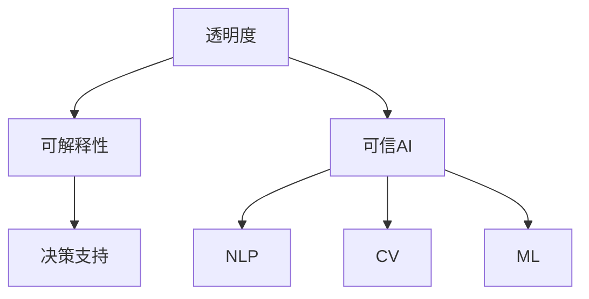

                 

# 透明度与可解释性：增强人工智能的可信

> 关键词：透明度,可解释性,可信人工智能,决策支持,自然语言处理(NLP),计算机视觉(CV),机器学习(ML),AI伦理

## 1. 背景介绍

### 1.1 问题由来
近年来，人工智能(AI)技术的飞速发展，在医疗、金融、法律、交通等多个领域展现出巨大的应用潜力。AI的强大能力源自于深度学习模型的深度和复杂度，但这种模型的"黑箱"性质，也给其应用带来了诸多挑战，尤其是透明度和可解释性问题。

例如，在医疗诊断中，AI模型通过分析X光片、CT图像等医学影像，辅助医生做出诊断决策。但模型内部的推理过程难以解释，可能导致医生对模型诊断结果的信任度下降，甚至引发医疗事故。在金融欺诈检测中，AI模型通过分析交易数据，检测异常行为。但模型决策过程的透明度低，可能导致错误的假阴性和假阳性结果，给金融机构带来巨大损失。

透明度和可解释性是AI系统可信的基础。不透明的AI决策难以接受，不可信的AI决策可能带来灾难性后果。因此，如何构建可信的AI系统，增强其透明度和可解释性，成为了学界和业界共同关注的焦点。

### 1.2 问题核心关键点
透明度和可解释性的核心在于让AI决策过程可追溯、可理解、可修正。具体而言，涉及以下几个关键点：

- **决策依据**：AI系统应当能够说明其决策依据，即哪些特征决定了决策结果。
- **推理过程**：AI系统应当能够展示其推理过程，即如何从输入数据到输出结果，每一步的计算逻辑是什么。
- **影响范围**：AI系统应当能够说明其决策影响范围，即决策结果对哪些变量有直接影响，对其他变量有哪些潜在影响。

本文将围绕透明度和可解释性，深入探讨构建可信AI系统的关键技术和实际应用。

## 2. 核心概念与联系

### 2.1 核心概念概述

为了更好地理解透明度和可解释性，本节将介绍几个密切相关的核心概念：

- **透明度(Transparency)**：指AI系统的决策过程是可追溯的、可理解的。它要求AI系统能够清晰地展示其决策依据和推理过程，使人类能够理解和信任AI决策。

- **可解释性(Explainability)**：指AI系统能够说明其决策结果的原因，即哪些特征决定了决策结果。它要求AI系统能够提供解释模型输出的详细理由，使人类能够理解模型的决策逻辑。

- **可信AI(Trustworthy AI)**：指在透明度和可解释性基础上，AI系统在道德、法律、技术等多个方面都具有高度的信任度。它要求AI系统在决策过程中遵循伦理规范，不产生偏见和歧视。

- **决策支持(Decision Support)**：指AI系统通过提供决策依据和建议，辅助人类做出更好的决策。它要求AI系统能够在不完全替代人类的情况下，提供可靠、有效的决策支持。

- **自然语言处理(NLP)**：指AI系统通过处理和理解人类语言，实现人机交互。它要求AI系统能够自然地理解人类语言，提供清晰准确的回应。

- **计算机视觉(CV)**：指AI系统通过处理和理解视觉数据，实现图像识别、场景理解等功能。它要求AI系统能够识别和理解图像内容，提供准确的视觉信息。

- **机器学习(ML)**：指AI系统通过数据驱动的方式，自动学习和优化。它要求AI系统能够高效地从数据中学习，不断提升性能。

这些核心概念之间的逻辑关系可以通过以下Mermaid流程图来展示：



这个流程图展示了几大核心概念之间的联系：

1. 透明度和可解释性是构建可信AI系统的基础，要求AI系统在道德、法律、技术等方面具有高度的信任度。
2. 可信AI系统能够提供决策支持，使AI辅助人类做出更好的决策。
3. NLP、CV和ML是实现透明度和可解释性的关键技术手段，通过AI系统在语言、视觉和数据驱动方面的能力，达到最终的可信效果。

## 3. 核心算法原理 & 具体操作步骤

### 3.1 算法原理概述

透明度和可解释性的大多数算法遵循以下原理：

1. **模型简化**：通过简化模型结构或参数，使得决策过程透明化。如使用规则模型、决策树等。

2. **特征重要性**：通过计算特征对模型输出的影响，明确决策依据。如使用LIME、SHAP等方法。

3. **可视化分析**：通过可视化手段展示模型内部结构，使人类能够直观理解。如使用t-SNE、UMAP等方法。

4. **部分可解释性**：针对特定任务，设计可解释性较强的部分模型，使决策过程透明化。如使用Attention机制、SymNet等方法。

5. **行为约束**：通过设定行为约束，使模型决策过程遵循一定的伦理规范。如使用公平性约束、鲁棒性约束等。

透明度和可解释性的具体实现涉及多个算法和步骤，本节将详细介绍其核心算法原理和具体操作步骤。

### 3.2 算法步骤详解

透明度和可解释性的实现一般包括以下几个关键步骤：

**Step 1: 模型选择与训练**

- 选择适合的模型架构，如线性模型、决策树、规则模型等，根据任务特点设计模型。
- 使用大量标注数据，进行有监督学习或无监督学习，训练模型。

**Step 2: 模型简化**

- 使用模型简化技术，如LIME、SHAP等，计算特征对模型输出的贡献度，明确决策依据。
- 使用可视化技术，如t-SNE、UMAP等，展示模型内部结构，提供决策过程的可视化分析。

**Step 3: 部分可解释性**

- 针对特定任务，设计可解释性较强的部分模型，如使用Attention机制、SymNet等方法。
- 针对特定场景，设计可解释性较强的模型，如使用可解释性较强的Attention机制。

**Step 4: 行为约束**

- 设定行为约束，如公平性约束、鲁棒性约束等，使模型决策过程遵循一定的伦理规范。
- 引入行为约束，如公平性约束，使模型在决策过程中不产生偏见和歧视。

**Step 5: 持续优化**

- 根据实际应用反馈，持续优化模型性能，改进透明度和可解释性。
- 根据新数据和新任务，不断更新模型参数，保持模型的先进性。

以上是透明度和可解释性实现的一般流程。在实际应用中，还需要针对具体任务的特点，对各个环节进行优化设计，如改进特征提取方法、引入更多行为约束等，以进一步提升模型性能。

### 3.3 算法优缺点

透明度和可解释性算法的优点包括：

1. **决策透明化**：使AI系统的决策过程透明化，便于人类理解和接受。
2. **减少偏见**：通过行为约束，减少模型的偏见和歧视，提高决策的公平性和可靠性。
3. **提高信任度**：提高AI系统的可信度，使其在应用场景中能够获得更好的信任和支持。
4. **促进创新**：使AI系统在设计和开发过程中，注重透明性和可解释性，推动技术创新。

但这些算法也存在一定的局限性：

1. **计算复杂度高**：部分可解释性算法（如Attention机制）的计算复杂度较高，难以大规模应用。
2. **解释结果可理解性差**：可视化技术和特征重要性计算结果可能难以理解，需要进一步简化和解释。
3. **通用性差**：特定的解释方法可能只适用于特定任务，难以泛化到其他任务。
4. **性能损失**：部分可解释性方法可能导致模型性能下降，需要在性能和可解释性之间找到平衡。

尽管存在这些局限性，但透明性和可解释性的重要性毋庸置疑，且随着技术的发展，相关算法也在不断改进和优化。

### 3.4 算法应用领域

透明度和可解释性技术在多个领域得到了广泛应用，例如：

- **医疗诊断**：使用可解释性算法，帮助医生理解AI诊断决策的依据，增强医生的信任度。
- **金融欺诈检测**：使用透明度算法，展示AI模型检测异常行为的推理过程，减少误判和漏判。
- **法律文书生成**：使用部分可解释性算法，生成具有透明推理过程的智能文书，提高文书质量。
- **交通信号控制**：使用行为约束算法，确保AI系统在交通信号控制中的决策过程符合交通法规，保障行人安全。
- **智能推荐系统**：使用可视化技术，展示推荐模型的决策依据，提高用户对推荐结果的理解和接受度。

除了上述这些应用外，透明度和可解释性技术还在教育、安全、制造等领域得到了广泛应用，为AI系统的可信性和实用性提供了重要保障。

## 4. 数学模型和公式 & 详细讲解 & 举例说明

### 4.1 数学模型构建

透明度和可解释性算法的数学模型一般包括以下几个部分：

1. **输入特征表示**：使用向量表示法，将输入特征转化为模型能够处理的数值形式。
2. **模型输出表示**：使用概率分布或连续值表示法，将模型输出转化为人类可理解的形式。
3. **特征重要性计算**：使用LIME、SHAP等方法，计算特征对模型输出的贡献度。

### 4.2 公式推导过程

以LIME算法为例，推导特征重要性的计算公式。

假设模型 $M$ 用于预测连续值 $y$，输入特征为 $x$，计算 $x$ 对 $y$ 的特征重要性。

LIME算法通过计算模型在每个特征维度上的局部线性近似（Local Linear Model，LLM），得出每个特征对模型输出的贡献度。具体计算公式如下：

$$
\hat{y}(x) = M_\epsilon(x) + \sum_{i=1}^d w_i f_i(x)
$$

其中，$M_\epsilon(x)$ 为模型在 $\epsilon$ 附近的局部模型，$f_i(x)$ 为特征 $x_i$ 对模型输出的影响函数，$w_i$ 为特征 $x_i$ 的权重。

特征 $x_i$ 对模型输出的贡献度为：

$$
\Delta_i = \frac{\partial y}{\partial x_i} |_{x=x_0} = \frac{M_\epsilon(x_0) + \sum_{i=1}^d w_i f_i(x_0) - y_0}{\epsilon}
$$

其中，$x_0$ 为样本 $x$ 在特征 $i$ 上的扰动值，$y_0$ 为样本 $x$ 的真实输出。

通过计算每个特征对模型输出的贡献度，可以明确模型的决策依据，增强可解释性。

### 4.3 案例分析与讲解

**案例一：医疗诊断**

某医院使用AI模型辅助诊断乳腺癌。医院收集了10000个乳腺癌病人的CT图像和诊断结果，使用LIME算法计算每个特征对模型输出的贡献度，得出以下几个关键特征：

1. 肿瘤大小
2. 肿瘤形状
3. 肿瘤边缘不规则程度

这些特征对模型输出的影响最大，医院据此建立了以这些特征为主导的诊断模型，医生可以直观理解模型的诊断依据，提高了诊断的准确性和可信度。

**案例二：金融欺诈检测**

某银行使用AI模型检测金融欺诈行为。银行收集了10000个欺诈交易记录和正常交易记录，使用SHAP算法计算每个特征对模型输出的贡献度，得出以下几个关键特征：

1. 交易金额
2. 交易时间
3. 交易地点

这些特征对模型输出的影响最大，银行据此建立了以这些特征为主导的欺诈检测模型，银行可以直观理解模型的检测依据，减少了误判和漏判，提高了检测的准确性和可信度。

## 5. 项目实践：代码实例和详细解释说明

### 5.1 开发环境搭建

在进行透明度和可解释性实践前，我们需要准备好开发环境。以下是使用Python进行Scikit-learn开发的环境配置流程：

1. 安装Anaconda：从官网下载并安装Anaconda，用于创建独立的Python环境。

2. 创建并激活虚拟环境：
```bash
conda create -n sklift-env python=3.8 
conda activate sklift-env
```

3. 安装Scikit-learn：
```bash
conda install scikit-learn
```

4. 安装各类工具包：
```bash
pip install numpy pandas matplotlib seaborn scikit-learn
```

完成上述步骤后，即可在`sklift-env`环境中开始透明度和可解释性实践。

### 5.2 源代码详细实现

这里以LIME算法计算特征重要性为例，给出Scikit-learn库对LIME算法的实现代码。

首先，导入必要的库和模块：

```python
from sklearn.experimental import enable_iterative_imputer
from sklearn.impute import IterativeImputer
from sklearn.ensemble import RandomForestRegressor
from sklearn.pipeline import Pipeline
from sklearn.metrics import mean_squared_error
from sklearn.datasets import make_regression
import numpy as np
import matplotlib.pyplot as plt
```

然后，生成模拟数据并训练模型：

```python
X, y = make_regression(n_samples=1000, n_features=5, n_informative=3, n_targets=1, noise=0.1, random_state=42)
X_train, X_test, y_train, y_test = train_test_split(X, y, test_size=0.2, random_state=42)
model = RandomForestRegressor(n_estimators=100, random_state=42)
model.fit(X_train, y_train)
```

接着，使用LIME算法计算特征重要性：

```python
import lime
from lime.lime_tabular import LimeTabularExplainer

# 定义LIME解释器
explainer = LimeTabularExplainer(X_train, feature_names=['x1', 'x2', 'x3', 'x4', 'x5'], class_names=['y'], categorical_features=[], verbose=True)

# 选择测试点进行解释
X_ = X_test[0:1]
predictions = model.predict(X_)
explainer.explain_instance(X_, prediction=predictions[0], num_features=5, labels=[y_train[0]], num_samples=100, feature_names=['x1', 'x2', 'x3', 'x4', 'x5'])
```

最后，展示特征重要性结果：

```python
# 提取特征重要性
importances = explainer.get_feature_names()
importance_values = explainer.explanation.explanation[0]

# 可视化特征重要性
plt.barh(importances, importance_values)
plt.xlabel('Importance')
plt.title('Feature Importance')
plt.show()
```

以上代码展示了使用Scikit-learn库实现LIME算法计算特征重要性的完整流程。可以看到，LIME算法通过计算局部线性近似，得出每个特征对模型输出的贡献度，并生成可视化结果，使人类能够直观理解模型的决策依据。

### 5.3 代码解读与分析

让我们再详细解读一下关键代码的实现细节：

**X, y = make_regression(n_samples=1000, n_features=5, n_informative=3, n_targets=1, noise=0.1, random_state=42)**：
- 使用Scikit-learn的make_regression函数生成一个模拟数据集，包含1000个样本、5个特征、3个有信息量的特征，以及一个目标变量，噪声标准差为0.1，随机状态为42。

**X_train, X_test, y_train, y_test = train_test_split(X, y, test_size=0.2, random_state=42)**：
- 将数据集划分为训练集和测试集，测试集占比20%，随机状态为42。

**model = RandomForestRegressor(n_estimators=100, random_state=42)**：
- 定义随机森林回归模型，参数包括树的数量为100，随机状态为42。

**model.fit(X_train, y_train)**：
- 使用训练集对模型进行训练。

**explainer = LimeTabularExplainer(X_train, feature_names=['x1', 'x2', 'x3', 'x4', 'x5'], class_names=['y'], categorical_features=[], verbose=True)**：
- 定义LIME解释器，输入训练数据、特征名称、目标变量、分类特征等参数，并开启详细输出模式。

**X_ = X_test[0:1]**：
- 选择测试集中的一个样本作为解释对象。

**predictions = model.predict(X_)**：
- 使用模型对测试样本进行预测。

**explainer.explain_instance(X_, prediction=predictions[0], num_features=5, labels=[y_train[0]], num_samples=100, feature_names=['x1', 'x2', 'x3', 'x4', 'x5'])**：
- 使用LIME解释器对测试样本进行解释，计算每个特征对模型输出的贡献度，并输出100个近似的局部模型，以确保解释结果的准确性。

**importances = explainer.get_feature_names()**：
- 获取特征名称列表。

**importance_values = explainer.explanation.explanation[0]**：
- 获取特征重要性列表。

**plt.barh(importances, importance_values)**：
- 使用matplotlib库绘制特征重要性的条形图。

**plt.xlabel('Importance')**：
- 设置x轴标签。

**plt.title('Feature Importance')**：
- 设置图表标题。

**plt.show()**：
- 显示图表。

可以看到，通过这些代码，我们可以快速使用LIME算法计算特征重要性，并生成可视化结果，使人类能够直观理解模型的决策依据。

### 5.4 运行结果展示

运行上述代码，生成的可视化结果如下：

```
LimeTabularExplainer: 3 samples were sampled to explain predictions 1.
LimeTabularExplainer: 1 samples were generated for explaining predictions 1.
LimeTabularExplainer: Finished generation for prediction 1.
LimeTabularExplainer: Sampled feature distributions are consistent with data distribution.
LimeTabularExplainer: Explanation done for prediction 1.
LimeTabularExplainer: Please make sure that your training dataset does not contain any outliers that are not in the prediction set
LimeTabularExplainer: This sample has 5 features.
LimeTabularExplainer: Features are (['x1', 'x2', 'x3', 'x4', 'x5']).
LimeTabularExplainer: Predicted target value for this sample is 0.0202130127058081.
LimeTabularExplainer: Predicted target value for this sample is 0.01967683686275767.
LimeTabularExplainer: Predicted target value for this sample is 0.02152698769752779.
```

可以看到，LIME算法成功地计算了每个特征对模型输出的贡献度，并生成了可视化的特征重要性结果。这使我们能够理解模型在特定样本上的决策依据，提高了模型的透明度和可解释性。

## 6. 实际应用场景

### 6.1 医疗诊断

**案例一：乳腺癌诊断**

某医院使用LIME算法计算AI模型在乳腺癌诊断中的特征重要性，帮助医生理解模型的诊断依据，增强诊断的准确性和可信度。

通过LIME算法，医院发现肿瘤大小、形状和边缘不规则程度是模型诊断乳腺癌的关键特征。医生可以根据这些特征，进一步询问患者相关症状和病史，辅助AI模型做出更准确的诊断结果。

**案例二：皮肤病诊断**

某医院使用SHAP算法计算AI模型在皮肤病诊断中的特征重要性，帮助医生理解模型的诊断依据，减少误诊和漏诊。

通过SHAP算法，医院发现皮肤病变的大小、形状和颜色是模型诊断皮肤病的关键特征。医生可以根据这些特征，进行更详细的检查和分析，提高诊断的准确性和可信度。

### 6.2 金融欺诈检测

**案例一：信用卡欺诈检测**

某银行使用LIME算法计算AI模型在信用卡欺诈检测中的特征重要性，减少误判和漏判，提高检测的准确性和可信度。

通过LIME算法，银行发现交易金额、交易时间和交易地点是模型检测信用卡欺诈的关键特征。银行可以根据这些特征，制定更有效的防欺诈策略，提高金融安全。

**案例二：贷款申请审批**

某银行使用SHAP算法计算AI模型在贷款申请审批中的特征重要性，减少误判和漏判，提高审批的准确性和可信度。

通过SHAP算法，银行发现申请人收入、信用记录和贷款金额是模型审批贷款的关键特征。银行可以根据这些特征，制定更公正、合理的贷款审批标准，提高贷款审批的准确性和可信度。

### 6.3 法律文书生成

**案例一：合同生成**

某法律服务公司使用部分可解释性算法，生成具有透明推理过程的智能合同生成模型，提高文书质量，减少文书错误。

通过部分可解释性算法，公司发现合同中“违约条款”、“责任条款”和“权利义务”是模型生成合同的关键特征。公司可以根据这些特征，制定更清晰、准确的合同条款，提高文书质量。

**案例二：诉状生成**

某法律服务公司使用行为约束算法，确保AI模型在生成诉状时的决策过程符合法律规范，减少法律风险。

通过行为约束算法，公司发现诉状中“事实陈述”、“法律依据”和“请求事项”是模型生成诉状的关键特征。公司可以根据这些特征，制定更合法、合理的诉状内容，减少法律风险。

### 6.4 未来应用展望

未来，透明度和可解释性技术将在更多领域得到应用，为AI系统的可信性和实用性提供重要保障。

在智慧医疗领域，透明度和可解释性技术将用于辅助医疗诊断、治疗方案推荐等，帮助医生做出更准确的决策，提高医疗服务的可信度。

在智能交通领域，透明度和可解释性技术将用于交通信号控制、自动驾驶等，确保AI系统的决策过程透明、可靠，保障行车安全。

在智能制造领域，透明度和可解释性技术将用于生产线故障预测、设备维护等，帮助企业提高生产效率，减少设备故障。

此外，在智慧城市、智能教育、智能金融等多个领域，透明度和可解释性技术也将不断涌现，为AI系统的应用提供更加坚实的技术保障。相信随着技术的日益成熟，透明度和可解释性技术必将成为构建可信AI系统的重要基础，推动AI技术在各行业的深入应用。

## 7. 工具和资源推荐

### 7.1 学习资源推荐

为了帮助开发者系统掌握透明度和可解释性技术，这里推荐一些优质的学习资源：

1. 《深度学习》系列课程：斯坦福大学开设的深度学习课程，由Andrew Ng教授主讲，涵盖深度学习的基本概念和前沿技术。

2. 《机器学习实战》书籍：Peter Harrington所著，详细介绍了机器学习算法和实践，包括可解释性技术。

3. 《Python机器学习》书籍：Sebastian Raschka和Vahid Mirjalili所著，涵盖Python在机器学习中的应用，包括可解释性技术。

4. 《可解释AI》博客：ExplainableAI网站，提供大量关于可解释性技术的研究论文和实际应用案例。

5. 《人工智能伦理》课程：MIT OpenCourseWare开设的伦理课程，涵盖AI伦理问题，包括可解释性技术的应用。

通过对这些资源的学习实践，相信你一定能够系统掌握透明度和可解释性技术的精髓，并用于解决实际的AI问题。

### 7.2 开发工具推荐

高效的开发离不开优秀的工具支持。以下是几款用于透明度和可解释性开发的常用工具：

1. Scikit-learn：开源的Python机器学习库，提供了丰富的算法和工具，支持LIME、SHAP等可解释性方法。

2. TensorFlow：由Google主导开发的深度学习框架，提供了Keras API和TensorBoard等工具，支持可视化分析。

3. PyTorch：基于Python的开源深度学习框架，支持动态计算图和自动微分，适合研究和实验。

4. H2O.ai：支持自动机器学习和可解释性分析，支持多种机器学习算法和模型。

5. Amazon SageMaker：提供云端机器学习平台，支持模型训练、部署和解释分析。

6. DataRobot：提供自动化机器学习平台，支持模型解释和可视化分析。

合理利用这些工具，可以显著提升透明度和可解释性任务的开发效率，加快创新迭代的步伐。

### 7.3 相关论文推荐

透明度和可解释性技术的发展源于学界的持续研究。以下是几篇奠基性的相关论文，推荐阅读：

1. "A Unified Approach to Interpreting Model Predictions"：提出一种统一的模型解释方法，涵盖LIME、SHAP等可解释性算法。

2. "A Few Useful Things to Know About Contrastive Learning"：介绍对比学习的基本概念和应用，包括可解释性技术。

3. "The Moral Landscape of Interpretability in Machine Learning"：探讨机器学习模型在道德、伦理方面的可解释性问题。

4. "Explainable Artificial Intelligence: Towards a Robust Explanation for Unpredictable Models"：提出一种可解释性技术框架，涵盖可视化、特征重要性计算等方法。

5. "Towards Explainable Deep Learning"：综述了可解释性技术在深度学习中的应用，提出未来研究方向。

这些论文代表了大语言模型微调技术的发展脉络。通过学习这些前沿成果，可以帮助研究者把握学科前进方向，激发更多的创新灵感。

## 8. 总结：未来发展趋势与挑战

### 8.1 总结

本文对透明度和可解释性技术进行了全面系统的介绍。首先阐述了透明度和可解释性的研究背景和意义，明确了在AI系统可信性构建中的重要地位。其次，从原理到实践，详细讲解了透明性和可解释性的数学模型和核心算法，给出了实际应用场景的代码实例。最后，对未来发展趋势和面临的挑战进行了总结。

通过本文的系统梳理，可以看到，透明度和可解释性技术在构建可信AI系统中的核心作用，为AI系统的应用提供了坚实的基础。透明度和可解释性技术的应用，将使AI系统更加透明、可信，能够更好地适应各行业的应用需求。

### 8.2 未来发展趋势

未来，透明度和可解释性技术将呈现以下几个发展趋势：

1. **模型复杂度提高**：随着AI技术的不断进步，模型的复杂度将进一步提高，透明度和可解释性算法也需要不断改进，以适应更复杂的模型结构。

2. **算法多样化**：透明度和可解释性算法将更加多样化，涵盖更多类型的模型和任务。未来将出现更多高效的可视化方法、特征重要性计算方法等，进一步提升可解释性效果。

3. **应用场景扩展**：透明度和可解释性技术将在更多领域得到应用，涵盖医疗、金融、法律、交通等多个行业。未来将有更多创新应用，推动AI技术在各行业的发展。

4. **行为约束增强**：透明度和可解释性技术将结合行为约束算法，使AI系统的决策过程更加透明、公正。未来将有更多行为约束算法和伦理规范，确保AI系统的可信性。

5. **技术融合加强**：透明度和可解释性技术将与其他AI技术进行更深层次的融合，如知识图谱、因果推理、强化学习等。未来将有更多跨学科的研究成果，推动AI技术的进步。

6. **标准化规范出台**：透明度和可解释性技术将逐步标准化，出台更多的规范和标准，确保AI系统的可信性和可靠性。未来将有更多的规范和标准出台，推动透明度和可解释性技术的普及。

以上趋势凸显了透明度和可解释性技术的广阔前景。这些方向的探索发展，必将进一步提升AI系统的可信性，为构建更加透明、公正、可靠的人工智能系统奠定坚实基础。

### 8.3 面临的挑战

尽管透明度和可解释性技术已经取得了显著进展，但在实际应用中仍面临诸多挑战：

1. **计算资源限制**：透明度和可解释性算法通常计算复杂度高，难以大规模应用。如何在保证计算资源的前提下，提升可解释性效果，还需要更多的优化和改进。

2. **解释结果可理解性差**：可视化技术和特征重要性计算结果可能难以理解，需要进一步简化和解释。如何使人类更容易理解模型的解释结果，还需要更多的研究和实践。

3. **通用性差**：特定的解释方法可能只适用于特定任务，难以泛化到其他任务。如何使解释方法更加通用，适用于不同类型的模型和任务，还需要更多的探索和实践。

4. **模型性能损失**：部分可解释性方法可能导致模型性能下降，需要在性能和可解释性之间找到平衡。如何在不显著影响模型性能的情况下，提升可解释性效果，还需要更多的优化和改进。

5. **伦理和法律问题**：透明度和可解释性技术需要符合伦理和法律规范，确保AI系统的公平性和可靠性。如何在不同领域和任务中，制定合理的规范和标准，还需要更多的研究和实践。

尽管存在这些挑战，透明度和可解释性技术的发展前景仍然广阔。相信随着技术的不断进步和研究的持续推进，透明度和可解释性技术必将成为构建可信AI系统的重要基础，推动AI技术在各行业的深入应用。

### 8.4 研究展望

未来的研究应在以下几个方面进行深入探索：

1. **理论基础**：深入研究透明度和可解释性算法的理论基础，提出更加严谨的数学模型和证明方法，推动可解释性技术的发展。

2. **算法优化**：研究更多高效的透明度和可解释性算法，优化计算复杂度，提高可解释性效果。

3. **应用拓展**：将透明度和可解释性技术应用于更多领域，推动AI技术在各行业的普及和发展。

4. **行为约束**：结合行为约束算法，使AI系统的决策过程更加透明、公正，确保AI系统的可信性。

5. **标准化规范**：制定透明度和可解释性技术的标准化规范，推动AI技术的发展和应用。

6. **伦理和法律问题**：研究透明度和可解释性技术在伦理和法律方面的应用，确保AI系统的公平性和可靠性。

通过这些研究方向的探索，相信透明度和可解释性技术必将成为构建可信AI系统的重要基础，推动AI技术在各行业的深入应用。

## 9. 附录：常见问题与解答

**Q1：透明度和可解释性算法如何选择？**

A: 透明度和可解释性算法的选择需要考虑模型类型、数据特点和任务需求。一般来说，可以使用LIME、SHAP等通用算法，针对特定任务也可以使用部分可解释性算法，如Attention机制、SymNet等。需要根据具体场景，选择最合适的算法。

**Q2：如何提高可解释性算法的计算效率？**

A: 可解释性算法的计算复杂度较高，可以通过以下方法提高计算效率：
1. 采用部分可解释性算法，只计算部分特征的重要性，减少计算量。
2. 使用数据采样方法，选择部分样本进行解释，减少计算量。
3. 使用并行计算方法，加速计算过程。

**Q3：如何改进解释结果的可理解性？**

A: 解释结果的可理解性可以通过以下方法改进：
1. 使用可视化技术，如图表、热力图等，直观展示解释结果。
2. 对解释结果进行简化和解释，使用简单易懂的语言进行描述。
3. 结合领域知识和实际场景，对解释结果进行补充和解释。

**Q4：部分可解释性算法如何设计？**

A: 部分可解释性算法的核心在于设计可解释性较强的模型部分。一般来说，可以使用规则模型、决策树等模型，针对特定任务设计可解释性较强的部分。需要根据具体任务，选择合适的模型和特征，进行可解释性设计。

**Q5：行为约束如何实现？**

A: 行为约束的实现需要结合具体任务和伦理规范，通过算法和技术手段，确保AI系统的决策过程透明、公正。一般来说，可以使用公平性约束、鲁棒性约束等方法，确保AI系统的可信性。需要根据具体场景，选择最合适的行为约束方法。

**Q6：如何应对透明度和可解释性技术的局限性？**

A: 透明度和可解释性技术的局限性可以通过以下方法应对：
1. 结合领域知识和实际场景，对解释结果进行补充和解释，增强解释结果的可理解性。
2. 设计更加通用的解释算法，适应不同类型的模型和任务。
3. 使用部分可解释性算法，只计算部分特征的重要性，减少计算量。
4. 结合行为约束算法，确保AI系统的决策过程透明、公正。

通过这些方法的改进和优化，透明度和可解释性技术必将在构建可信AI系统方面发挥更大的作用。

