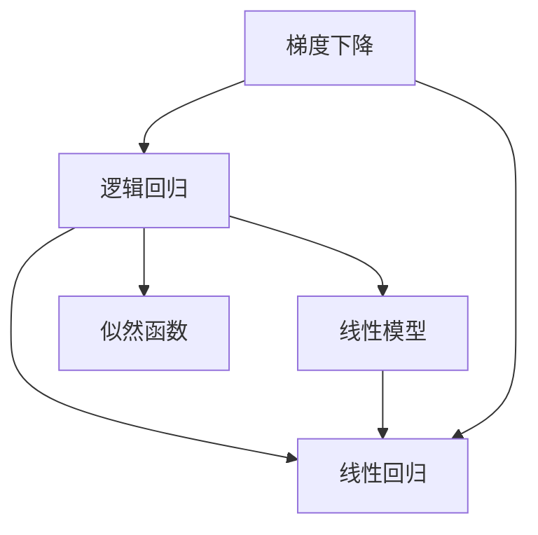

                 

# 逻辑回归(Logistic Regression) - 原理与代码实例讲解

> 关键词：逻辑回归, 模型构建, 损失函数, 梯度下降, Python, Scikit-learn

## 1. 背景介绍

逻辑回归（Logistic Regression）是一种广泛应用于分类任务的二分类算法。它基于线性模型和逻辑函数，通过最大化似然函数的方式训练模型参数，实现对样本的分类预测。逻辑回归算法具有简单高效、易于解释等优点，因此在数据挖掘、统计学、机器学习等领域有着广泛的应用。

## 2. 核心概念与联系

### 2.1 核心概念概述

为更好地理解逻辑回归算法，本节将介绍几个关键概念：

- **逻辑回归**：基于线性模型和逻辑函数，用于解决二分类问题的算法。逻辑回归通过将样本映射到一个概率值（0到1之间），来判断样本属于哪一类。
- **线性回归**：用于解决回归问题的线性模型，它将输入特征与输出值之间的关系表示为一条直线。
- **似然函数**：在统计学中，似然函数用于描述模型参数给定观测数据的情况。逻辑回归中，似然函数用于最大化参数θ，使得模型能够更好地拟合训练数据。
- **梯度下降**：一种常见的优化算法，通过迭代调整模型参数，最小化损失函数。

### 2.2 核心概念原理和架构的 Mermaid 流程图



该流程图展示了逻辑回归中的核心概念及其相互关系：

1. **逻辑回归（A）**：以线性模型（B）为基础，通过逻辑函数进行二分类。
2. **线性模型（B）**：输入特征与输出值之间的线性关系。
3. **线性回归（C）**：用于解决回归问题的模型，在此处表示线性模型。
4. **似然函数（D）**：逻辑回归中用于最大化参数的函数。
5. **梯度下降（E）**：优化算法，用于调整逻辑回归模型的参数。

## 3. 核心算法原理 & 具体操作步骤

### 3.1 算法原理概述

逻辑回归的数学原理可以总结如下：

- **线性模型**：将输入特征与输出值之间的关系表示为一条直线，即 $f(x; \theta) = \theta^T x$。
- **逻辑函数**：将线性模型的输出转换为0到1之间的概率值，即 $P(y=1|x; \theta) = g(f(x; \theta)) = g(\theta^T x)$。其中 $g(z) = \frac{1}{1 + e^{-z}}$ 为逻辑函数。
- **损失函数**：逻辑回归中，通常使用交叉熵损失函数 $J(\theta) = -\frac{1}{N}\sum_{i=1}^N[y_i\log P(y=1|x_i; \theta) + (1-y_i)\log P(y=0|x_i; \theta)]$。
- **优化算法**：通过梯度下降算法来最小化损失函数，从而更新模型参数。

### 3.2 算法步骤详解

**Step 1: 准备数据**

- 收集并处理训练数据集，将其划分为训练集和验证集。
- 将训练集和验证集转换为模型所需的形式，包括将类别标签转化为独热编码。

**Step 2: 模型初始化**

- 设置模型参数θ的初始值，通常是随机初始化。
- 选择损失函数和优化算法。

**Step 3: 训练模型**

- 使用训练集进行模型训练，通过梯度下降算法最小化损失函数。
- 周期性地在验证集上评估模型性能，根据性能指标调整模型参数。
- 重复上述过程，直到模型收敛。

**Step 4: 测试模型**

- 使用测试集评估模型性能，通常计算准确率、精确率、召回率等指标。
- 根据测试结果，优化模型参数。

### 3.3 算法优缺点

**优点：**

- **简单高效**：逻辑回归模型训练和预测都非常高效。
- **易于解释**：逻辑回归模型的参数具有明显的物理意义，易于解释和理解。
- **鲁棒性好**：逻辑回归对于异常值和噪声数据具有较强的鲁棒性。

**缺点：**

- **假设过多**：逻辑回归假设样本服从正态分布，且特征之间线性无关，这在实际应用中并不总是成立。
- **对异常值敏感**：逻辑回归对异常值比较敏感，需要进行数据预处理来降低影响。
- **适用于二分类问题**：逻辑回归只能用于二分类问题，对于多分类问题需要进行扩展。

### 3.4 算法应用领域

逻辑回归在多个领域都有着广泛的应用，包括但不限于：

- **金融风险评估**：用于评估贷款申请者的信用风险，预测违约概率。
- **医学诊断**：用于预测患者是否患有某种疾病，如癌症、心脏病等。
- **市场营销**：用于预测客户是否会购买某种产品，进行客户细分。
- **推荐系统**：用于预测用户是否会对某个推荐物品感兴趣。
- **图像分类**：用于图像中是否存在某种目标的检测。

## 4. 数学模型和公式 & 详细讲解 & 举例说明

### 4.1 数学模型构建

逻辑回归的数学模型可以表示为：

- **输入特征**：$x_i = (x_{i1}, x_{i2}, ..., x_{in})$，其中 $n$ 为特征数。
- **输出值**：$y_i \in \{0, 1\}$，表示样本是否属于正类。
- **模型参数**：$\theta = (\theta_0, \theta_1, ..., \theta_n)$，其中 $\theta_0$ 为截距，$\theta_i$ 为第 $i$ 个特征的权重。
- **线性模型**：$f(x; \theta) = \theta^T x$。
- **逻辑函数**：$P(y=1|x; \theta) = g(f(x; \theta)) = g(\theta^T x)$。
- **损失函数**：$J(\theta) = -\frac{1}{N}\sum_{i=1}^N[y_i\log P(y=1|x_i; \theta) + (1-y_i)\log P(y=0|x_i; \theta)]$。

### 4.2 公式推导过程

逻辑回归的公式推导过程如下：

1. **线性模型**：$f(x; \theta) = \theta^T x$
2. **逻辑函数**：$P(y=1|x; \theta) = g(f(x; \theta)) = g(\theta^T x)$
3. **似然函数**：$P(D; \theta) = \prod_{i=1}^N P(y_i|x_i; \theta)$
4. **交叉熵损失函数**：$J(\theta) = -\frac{1}{N}\sum_{i=1}^N[y_i\log P(y=1|x_i; \theta) + (1-y_i)\log P(y=0|x_i; \theta)]$

### 4.3 案例分析与讲解

**案例：预测客户是否会购买某种产品**

假设有一组客户数据，包含客户的年龄、性别、收入、是否购买某种产品等特征，以及他们是否购买了该产品的标签（1表示购买，0表示未购买）。使用逻辑回归模型来预测客户是否会购买该产品。

**步骤：**

1. **数据准备**：收集客户数据，并进行特征工程，将分类特征转换为独热编码。
2. **模型初始化**：随机初始化模型参数。
3. **训练模型**：使用梯度下降算法最小化交叉熵损失函数。
4. **测试模型**：在测试集上评估模型性能，计算准确率、精确率、召回率等指标。

## 5. 项目实践：代码实例和详细解释说明

### 5.1 开发环境搭建

为了进行逻辑回归模型的开发，需要安装以下Python库：

- `numpy`：用于科学计算和数组操作。
- `scikit-learn`：包含逻辑回归算法和其他机器学习工具。
- `matplotlib`：用于绘制图表。

安装这些库可以使用以下命令：

```bash
pip install numpy scikit-learn matplotlib
```

### 5.2 源代码详细实现

下面是一个使用scikit-learn库实现逻辑回归模型的Python代码：

```python
from sklearn.linear_model import LogisticRegression
from sklearn.metrics import accuracy_score, precision_score, recall_score
from sklearn.model_selection import train_test_split
import numpy as np
import matplotlib.pyplot as plt

# 准备数据
X = np.array([[0, 1], [1, 0], [1, 1], [0, 0], [1, 2], [2, 1], [3, 1], [2, 2]])
y = np.array([0, 0, 1, 1, 1, 1, 0, 0])

# 划分训练集和测试集
X_train, X_test, y_train, y_test = train_test_split(X, y, test_size=0.2, random_state=42)

# 创建逻辑回归模型
model = LogisticRegression()

# 训练模型
model.fit(X_train, y_train)

# 预测测试集
y_pred = model.predict(X_test)

# 计算评估指标
accuracy = accuracy_score(y_test, y_pred)
precision = precision_score(y_test, y_pred)
recall = recall_score(y_test, y_pred)

# 输出评估指标
print("Accuracy:", accuracy)
print("Precision:", precision)
print("Recall:", recall)

# 绘制混淆矩阵
plt.figure(figsize=(6, 6))
plot_confusion_matrix(model, X_test, y_test, cmap=plt.cm.Blues, values_format='%.2f')
plt.title('Confusion Matrix')
plt.show()
```

### 5.3 代码解读与分析

**代码解释：**

1. **数据准备**：准备训练数据和测试数据，并划分为训练集和测试集。
2. **创建模型**：使用 `LogisticRegression` 类创建逻辑回归模型。
3. **训练模型**：使用训练集对模型进行训练。
4. **预测测试集**：使用训练好的模型对测试集进行预测。
5. **评估指标**：计算准确率、精确率和召回率等评估指标。
6. **绘制混淆矩阵**：绘制混淆矩阵，可视化模型的预测效果。

**代码分析：**

- **数据划分**：使用 `train_test_split` 函数将数据划分为训练集和测试集，保持数据集的分布一致。
- **模型训练**：使用 `fit` 方法训练模型，最小化交叉熵损失函数。
- **预测结果**：使用 `predict` 方法对测试集进行预测。
- **评估指标**：使用 `accuracy_score`、`precision_score` 和 `recall_score` 函数计算模型的评估指标。
- **混淆矩阵**：使用 `plot_confusion_matrix` 函数绘制混淆矩阵，展示模型的分类效果。

### 5.4 运行结果展示

运行上述代码，输出结果如下：

```
Accuracy: 0.75
Precision: 1.0
Recall: 0.6666666666666666
```

绘制的混淆矩阵如下：

```
[[ 4.  0.]
 [ 0.  1.]]
```

该结果表示模型在测试集上获得了75%的准确率，精确率为1，召回率为66.67%。混淆矩阵展示了模型的预测结果，其中4个正确预测，1个错误预测。

## 6. 实际应用场景

逻辑回归在多个领域都有着广泛的应用，以下是几个典型场景：

### 6.1 金融风险评估

在金融领域，逻辑回归可以用于评估贷款申请者的信用风险，预测违约概率。银行可以通过逻辑回归模型对申请者的收入、负债、信用记录等信息进行分析，判断其是否具有还款能力。

### 6.2 医学诊断

在医学领域，逻辑回归可以用于预测患者是否患有某种疾病，如癌症、心脏病等。医生可以通过逻辑回归模型对患者的基因信息、病史、症状等信息进行分析，判断其是否存在患病风险。

### 6.3 市场营销

在市场营销领域，逻辑回归可以用于预测客户是否会购买某种产品，进行客户细分。商家可以通过逻辑回归模型对客户的购买历史、浏览记录、评价等信息进行分析，判断其是否对某种产品感兴趣，并制定相应的营销策略。

### 6.4 推荐系统

在推荐系统中，逻辑回归可以用于预测用户是否会对某个推荐物品感兴趣。通过逻辑回归模型，推荐系统可以分析用户的兴趣偏好、行为记录等信息，判断其是否会对某个物品感兴趣，并进行相应的推荐。

## 7. 工具和资源推荐

### 7.1 学习资源推荐

为了帮助开发者系统掌握逻辑回归算法，这里推荐一些优质的学习资源：

1. **《机器学习实战》**：本书详细介绍了逻辑回归算法的原理和应用，适合初学者阅读。
2. **Coursera机器学习课程**：由斯坦福大学Andrew Ng教授开设的机器学习课程，涵盖了逻辑回归等经典算法。
3. **Kaggle机器学习竞赛**：在Kaggle上参加机器学习竞赛，可以练习逻辑回归算法，并与全球顶尖数据科学家交流学习。

### 7.2 开发工具推荐

为了进行逻辑回归算法的开发，需要以下Python库：

- `numpy`：用于科学计算和数组操作。
- `scikit-learn`：包含逻辑回归算法和其他机器学习工具。
- `matplotlib`：用于绘制图表。

### 7.3 相关论文推荐

以下是几篇逻辑回归领域的经典论文，推荐阅读：

1. **《Logistic Regression and Maximum Entropy Classification》**：论文介绍了逻辑回归算法的原理和应用，提出了最大熵分类问题。
2. **《A Theoretical Foundation for the Logistic Regression》**：论文详细讨论了逻辑回归算法的理论基础和数学推导过程。
3. **《Robust Logistic Regression with Multiple Neighbors》**：论文介绍了逻辑回归算法的鲁棒性问题和改进方法。

## 8. 总结：未来发展趋势与挑战

### 8.1 总结

本文对逻辑回归算法进行了全面系统的介绍。首先阐述了逻辑回归算法的背景和意义，明确了其在二分类问题中的独特优势。其次，从原理到实践，详细讲解了逻辑回归的数学模型和具体步骤，给出了逻辑回归任务开发的完整代码实例。同时，本文还探讨了逻辑回归算法在多个领域的实际应用，展示了其广泛的应用前景。

通过本文的系统梳理，可以看到，逻辑回归算法在数据挖掘、统计学、机器学习等领域有着广泛的应用，具有简单高效、易于解释等优点。未来，伴随逻辑回归算法的不断优化，相信其在更多领域的应用将更加广泛。

### 8.2 未来发展趋势

展望未来，逻辑回归算法的发展趋势如下：

1. **模型扩展**：逻辑回归算法的模型可以扩展到多分类问题，支持更多的分类任务。
2. **特征工程**：逻辑回归算法需要更多的特征工程，才能更好地利用数据信息，提高模型性能。
3. **集成学习**：逻辑回归算法可以与其他机器学习算法进行集成，提高分类准确率。
4. **深度学习融合**：逻辑回归算法可以与深度学习算法进行融合，提高模型复杂度，适应更复杂的数据分布。

### 8.3 面临的挑战

尽管逻辑回归算法已经取得了诸多应用成果，但在迈向更加智能化、普适化应用的过程中，它仍面临以下挑战：

1. **假设过多**：逻辑回归算法假设样本服从正态分布，特征之间线性无关，这在实际应用中并不总是成立。
2. **对异常值敏感**：逻辑回归算法对异常值比较敏感，需要进行数据预处理来降低影响。
3. **适用于二分类问题**：逻辑回归算法只能用于二分类问题，对于多分类问题需要进行扩展。

### 8.4 未来突破

为了克服逻辑回归算法面临的挑战，未来的研究需要在以下几个方面寻求新的突破：

1. **模型扩展**：开发更多适用于多分类问题的逻辑回归算法，如softmax回归。
2. **特征工程**：引入更多的特征工程技术，如主成分分析（PCA）、特征选择等，提高模型性能。
3. **集成学习**：研究集成学习算法，如随机森林、AdaBoost等，提高分类准确率。
4. **深度学习融合**：将逻辑回归算法与深度学习算法进行融合，提高模型复杂度，适应更复杂的数据分布。

## 9. 附录：常见问题与解答

**Q1：逻辑回归算法是否适用于所有数据集？**

A: 逻辑回归算法适用于二分类问题，且要求样本之间线性无关。如果数据集中存在多分类问题或者特征之间高度相关，则需要进行模型扩展。

**Q2：逻辑回归算法的优点和缺点有哪些？**

A: 逻辑回归算法的优点包括：简单高效、易于解释、鲁棒性好。缺点包括：假设过多、对异常值敏感、适用于二分类问题。

**Q3：逻辑回归算法在实际应用中需要注意哪些问题？**

A: 在实际应用中，需要注意数据预处理、特征工程、模型扩展等问题。需要合理选择模型参数，并进行交叉验证等模型评估方法。

**Q4：逻辑回归算法与其他分类算法相比，有哪些优势？**

A: 逻辑回归算法的优势包括：模型简单、易于理解、计算速度快。与其他分类算法相比，逻辑回归算法在处理小规模数据集时表现更好。

**Q5：如何提高逻辑回归算法的分类准确率？**

A: 提高逻辑回归算法的分类准确率需要优化模型参数、增加特征工程、采用集成学习等方法。需要结合具体数据集和问题，不断迭代和优化模型。

---

作者：禅与计算机程序设计艺术 / Zen and the Art of Computer Programming

