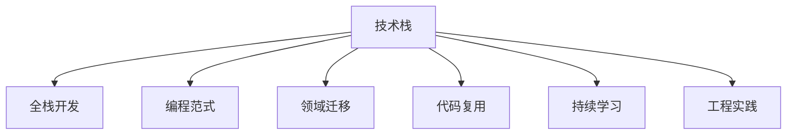

                 

# 避免在各个领域之间徘徊

> 关键词：领域迁移,技术栈优化,全栈开发,编程范式,代码复用,持续学习,工程实践

## 1. 背景介绍

### 1.1 问题由来

在现代软件开发中，技术栈的选择和配置往往直接影响到项目的开发效率、运维成本和扩展能力。但同时，随着技术的快速发展和不断演进，技术栈和开发范式的变化也会给开发者带来巨大的适应压力。许多开发者在多个领域之间频繁切换，导致技术积累的碎片化，难以构建高效、稳定、可靠的软件系统。

本文旨在探讨如何在技术栈选择与优化中避免在各个领域之间徘徊，提出一系列行之有效的策略，帮助开发者构建持续进步、灵活应对的软件生态。通过本实践指南，读者可以学习如何合理评估技术栈，构建高效的全栈开发环境，并通过持续学习和实践，不断提升自身技术水平。

### 1.2 问题核心关键点

当前开发环境中的一个普遍问题是，开发者需要掌握多领域的编程语言和工具，不断切换技术栈，导致技术积累的碎片化，难以形成系统性能力。如何通过合理的选择和优化技术栈，构建高效、灵活、稳定的开发环境，是本文探讨的核心问题。

## 2. 核心概念与联系

### 2.1 核心概念概述

为更好地理解本文内容，我们将介绍几个核心概念：

- **技术栈（Technology Stack）**：指一个软件开发项目中使用的所有技术工具和框架的集合，包括编程语言、数据库、前端框架、中间件等。

- **全栈开发（Full-Stack Development）**：指开发人员掌握前后端技术，可以独立构建完整软件系统的能力。

- **编程范式（Programming Paradigm）**：指不同编程语言或框架采用的编程思想和结构方式，如面向对象、函数式、事件驱动等。

- **领域迁移（Domain Transfer）**：指开发者在多个领域之间进行技术切换时，需要将已有技术栈迁移到新领域的过程。

- **代码复用（Code Reusability）**：指通过设计可复用的模块和组件，提高软件系统的开发效率和可维护性。

- **持续学习（Continuous Learning）**：指开发者通过不断学习和实践，掌握新的编程语言、工具和框架，提升自身技术能力。

- **工程实践（Engineering Practice）**：指软件开发生命周期中，涉及的各个环节（如需求分析、设计、编码、测试、部署等）的最佳实践和规范。

这些核心概念之间存在紧密联系，它们共同构成了软件开发的实践框架，帮助开发者构建高效、稳定、可靠的软件系统。

### 2.2 核心概念原理和架构的 Mermaid 流程图



该流程图展示了技术栈与各个关键概念之间的逻辑关系。开发者在构建技术栈时，需要综合考虑编程范式、代码复用、持续学习、工程实践等因素，以支持全栈开发和领域迁移。

## 3. 核心算法原理 & 具体操作步骤

### 3.1 算法原理概述

在技术栈选择与优化的过程中，需要遵循一些基本的原则和策略，以避免在各个领域之间徘徊。这些原则包括但不限于：

- **最佳实践原则**：选择经过验证的最佳实践，避免使用新奇但未经证明的技术栈。
- **可扩展原则**：选择具有良好扩展性和可维护性的技术栈，支持未来业务发展。
- **技术成熟度原则**：选择成熟稳定、社区活跃的技术栈，减少技术风险。
- **高性能原则**：选择性能优异的框架和工具，确保系统的响应速度和处理能力。

### 3.2 算法步骤详解

以下是构建高效技术栈的步骤：

**Step 1: 需求分析与评估**

- 明确项目需求，包括功能、性能、可靠性等目标。
- 评估不同技术栈的特点和适用场景，选择最符合需求的技术栈。

**Step 2: 确定技术栈**

- 根据需求和评估结果，选择合适的编程语言、框架、数据库等。
- 确保技术栈中的各组件之间兼容性好，易于集成。

**Step 3: 组件整合与测试**

- 将选择的技术栈组件进行整合，构建原型系统。
- 进行单元测试、集成测试、压力测试等，确保系统稳定性和可靠性。

**Step 4: 性能优化**

- 对系统进行性能调优，优化资源利用率，减少响应时间。
- 引入缓存、负载均衡、CDN等技术，提升系统扩展性和可用性。

**Step 5: 持续迭代与改进**

- 根据反馈和业务需求，持续改进技术栈和开发流程。
- 引入DevOps工具和持续集成机制，提升开发效率和质量。

### 3.3 算法优缺点

合理选择和优化技术栈有以下优点：

- **提高开发效率**：选择成熟稳定、易于集成的技术栈，减少技术风险。
- **提升系统性能**：选择高性能的框架和工具，确保系统响应速度和处理能力。
- **增强可维护性**：选择具有良好的扩展性和可维护性的技术栈，便于未来的维护和升级。
- **降低学习成本**：选择经过验证的最佳实践，减少开发过程中的技术学习成本。

同时，技术栈选择与优化也存在一定的局限性：

- **技术风险**：新技术栈可能存在不稳定性或未知的风险。
- **兼容问题**：不同的技术栈之间可能存在兼容性问题，影响集成和部署。
- **扩展成本**：技术栈的优化和升级可能需要投入大量时间和资源。

### 3.4 算法应用领域

技术栈选择与优化方法适用于各种软件开发项目，包括但不限于：

- **Web应用**：选择Node.js、Ruby on Rails、Django等框架。
- **移动应用**：选择React Native、Flutter、Xamarin等跨平台开发工具。
- **桌面应用**：选择Electron、Qt、WPF等框架。
- **大数据**：选择Hadoop、Spark、Flink等大数据处理框架。
- **人工智能**：选择TensorFlow、PyTorch、Keras等AI框架。

## 4. 数学模型和公式 & 详细讲解 & 举例说明

### 4.1 数学模型构建

我们以Web应用开发为例，建立一个简单的数学模型，来表示技术栈选择与优化的过程。

设 $T$ 为一个Web应用的技术栈，包括前端框架 $F$、后端语言 $L$、数据库 $D$ 等组件，每个组件的选择都对应一个评分 $S$，评分越高表示该组件越符合项目需求。则技术栈的总评分 $S_T$ 为：

$$
S_T = \sum_{i} S_i
$$

其中 $i$ 表示技术栈中的每个组件。

### 4.2 公式推导过程

我们进一步推导评分 $S_i$ 的计算方法，假设组件 $i$ 的评分由多个因素决定，包括性能评分 $P_i$、扩展性评分 $E_i$、社区评分 $C_i$ 等，则：

$$
S_i = \alpha_P \cdot P_i + \alpha_E \cdot E_i + \alpha_C \cdot C_i + \cdots
$$

其中 $\alpha_P$、$\alpha_E$、$\alpha_C$ 为各个因素的权重，可以通过需求分析确定。

### 4.3 案例分析与讲解

假设我们要开发一个高性能的Web应用，选择前端框架 $F$、后端语言 $L$、数据库 $D$，根据评分模型进行计算：

- 前端框架 $F$：性能评分 $P_F = 0.8$，扩展性评分 $E_F = 0.7$，社区评分 $C_F = 0.6$
- 后端语言 $L$：性能评分 $P_L = 0.9$，扩展性评分 $E_L = 0.5$，社区评分 $C_L = 0.4$
- 数据库 $D$：性能评分 $P_D = 0.7$，扩展性评分 $E_D = 0.8$，社区评分 $C_D = 0.9$

设 $S_F = \alpha_P \cdot P_F + \alpha_E \cdot E_F + \alpha_C \cdot C_F$，同理计算 $S_L$ 和 $S_D$，根据评分模型计算 $S_T = S_F + S_L + S_D$。

通过该数学模型，开发者可以量化各组件的评分，综合考虑性能、扩展性、社区等因素，选择最优的技术栈配置。

## 5. 项目实践：代码实例和详细解释说明

### 5.1 开发环境搭建

本节介绍如何使用Python和Django构建高效的全栈开发环境。

1. 安装Python和pip。
2. 安装Django和相关依赖。
3. 配置开发环境，设置虚拟环境。

### 5.2 源代码详细实现

以下是Django全栈开发的完整代码实现：

```python
# 安装Django
pip install django

# 创建Django项目
django-admin startproject myproject

# 创建Django应用
cd myproject
python manage.py startapp myapp

# 配置开发环境
settings.py 中添加以下配置：
DATABASES = {
    'default': {
        'ENGINE': 'django.db.backends.postgresql',
        'NAME': 'myproject',
        'USER': 'myuser',
        'PASSWORD': 'mypassword',
        'HOST': 'localhost',
        'PORT': '5432',
    }
}
```

### 5.3 代码解读与分析

在上述代码中，我们通过简单的配置，快速搭建了一个基于Django的全栈开发环境。以下是关键代码的详细解读：

**settings.py**：
- 配置数据库连接信息，确保数据存储和操作的安全性。
- 定义应用程序列表，Django根据这些信息构建路由。

**manage.py**：
- 是Django命令行工具，可以创建项目、应用，执行测试、部署等操作。

通过上述代码和配置，我们可以快速构建一个基于Django的全栈开发环境，开始进行前端和后端开发。

### 5.4 运行结果展示

以下是Django全栈开发的运行结果示例：

- 在浏览器中输入 `http://127.0.0.1:8000/`，显示Django欢迎页。
- 执行 `python manage.py runserver` 启动开发服务器，在浏览器中输入 `http://127.0.0.1:8000/admin/`，登录Django管理后台，进行数据管理和页面编辑。

## 6. 实际应用场景

### 6.1 智能客服系统

智能客服系统是一个典型的全栈开发项目，涉及前端页面、后端服务、数据库等多种技术栈。通过合理选择和优化技术栈，可以提升系统的响应速度、扩展性和可维护性。

在实际开发中，可以使用React或Vue作为前端框架，Flask或Django作为后端框架，MySQL或PostgreSQL作为数据库，TensorFlow或PyTorch作为自然语言处理模型。这些技术栈经过多年验证和实践，已经被广泛应用于各种项目中，具有稳定的性能和良好的可扩展性。

### 6.2 金融舆情监测

金融舆情监测项目需要实时监测海量数据，进行实时分析和决策。通过合理选择和优化技术栈，可以确保系统的稳定性和高可用性。

在实际开发中，可以使用Kafka作为消息队列，Elasticsearch作为数据存储和搜索，Flask或Django作为后端框架，Python或R作为数据分析和处理工具。这些技术栈具有高性能、高可靠性和良好扩展性，能够满足金融舆情监测的高要求。

### 6.3 个性化推荐系统

个性化推荐系统需要处理大量用户数据，实时生成个性化推荐结果。通过合理选择和优化技术栈，可以提高系统的处理能力和推荐精度。

在实际开发中，可以使用TensorFlow或PyTorch作为机器学习框架，Hadoop或Spark作为大数据处理框架，MySQL或Redis作为数据存储，Flask或Django作为后端框架。这些技术栈能够满足个性化推荐系统的高性能和低延迟要求，提供高质量的推荐服务。

### 6.4 未来应用展望

未来，随着技术栈和编程范式的不断发展，全栈开发也将面临更多的挑战和机遇。以下是我们对未来技术栈的一些展望：

- **全栈开发框架**：可能会出现一些全新的全栈开发框架，能够无缝整合前后端技术，提升开发效率。
- **云原生技术**：云原生技术将成为未来技术栈的主流，帮助开发者构建高性能、高可用性的系统。
- **微服务架构**：微服务架构将进一步发展，帮助开发者构建可扩展、可维护的软件系统。
- **低代码/无代码开发**：低代码/无代码开发工具将使开发者更加专注于业务逻辑的实现，减少开发时间和成本。
- **AI和ML集成**：AI和ML技术将更加紧密地集成到技术栈中，提升系统的智能化水平。

## 7. 工具和资源推荐

### 7.1 学习资源推荐

1. **《深入浅出Django》**：详细讲解Django的使用方法和最佳实践，适合新手学习。
2. **《Django实战》**：提供丰富的Django项目案例，适合有一定经验的开发者深入学习。
3. **《Flask Web开发》**：讲解Flask的使用方法和最佳实践，适合学习Flask框架。
4. **《Kubernetes权威指南》**：介绍Kubernetes的使用方法和最佳实践，适合学习云原生技术。
5. **《TensorFlow实战》**：提供TensorFlow的使用方法和案例，适合学习AI和ML技术。

### 7.2 开发工具推荐

1. **PyCharm**：功能强大的Python IDE，提供丰富的开发工具和调试功能。
2. **VS Code**：轻量级的开源代码编辑器，支持多种编程语言和框架。
3. **Django Admin**：Django内置的管理后台，方便进行数据管理和页面编辑。
4. **Gunicorn**：基于Python的WSGI HTTP服务器，支持Django应用部署。
5. **Jenkins**：开源的自动化集成工具，支持持续集成和部署。

### 7.3 相关论文推荐

1. **《全栈开发的最佳实践》**：探讨全栈开发的技术栈选择和优化方法，适合技术开发者阅读。
2. **《基于微服务的Web应用架构》**：介绍微服务架构的设计和实现方法，适合架构师和开发者阅读。
3. **《云原生技术的基础》**：讲解云原生技术的核心概念和设计理念，适合云计算开发者阅读。
4. **《TensorFlow实战》**：提供TensorFlow的使用方法和案例，适合AI和ML开发者阅读。

## 8. 总结：未来发展趋势与挑战

### 8.1 总结

本文介绍了如何通过合理选择和优化技术栈，构建高效、稳定、可靠的软件生态，避免在各个领域之间徘徊。通过本实践指南，读者可以学习如何构建全栈开发环境，提升开发效率和系统性能，掌握技术栈选择与优化的基本原则和策略。

### 8.2 未来发展趋势

未来，技术栈选择与优化将面临更多挑战和机遇，以下是一些可能的发展趋势：

1. **技术栈的集成与融合**：更多全栈开发框架和工具将出现，帮助开发者无缝集成前后端技术，提升开发效率。
2. **云原生技术的应用**：云原生技术将成为未来技术栈的主流，帮助开发者构建高性能、高可用性的系统。
3. **微服务架构的演进**：微服务架构将进一步发展，帮助开发者构建可扩展、可维护的软件系统。
4. **低代码/无代码开发**：低代码/无代码开发工具将使开发者更加专注于业务逻辑的实现，减少开发时间和成本。
5. **AI和ML的集成**：AI和ML技术将更加紧密地集成到技术栈中，提升系统的智能化水平。

### 8.3 面临的挑战

技术栈选择与优化虽然可以提升开发效率和系统性能，但在实际应用中也面临一些挑战：

1. **技术栈的多样性**：选择和优化技术栈需要综合考虑多个因素，可能需要花费大量时间和精力。
2. **新技术的学习成本**：新技术栈可能存在学习成本高、应用复杂的问题，需要开发者不断学习和适应。
3. **技术栈的兼容性**：不同技术栈之间可能存在兼容性问题，需要开发者进行充分测试和验证。
4. **技术栈的维护成本**：技术栈的维护和升级需要投入大量资源，需要开发者不断进行维护和优化。

### 8.4 研究展望

为了应对这些挑战，未来的技术栈选择与优化研究需要关注以下几个方向：

1. **自动化工具和平台**：开发更智能的自动化工具和平台，帮助开发者快速构建和优化技术栈。
2. **云计算的集成**：将云计算资源和平台集成到技术栈中，提升系统的可扩展性和可用性。
3. **跨平台技术**：开发跨平台技术，帮助开发者在不同设备和平台上实现一致的功能。
4. **可扩展框架和组件**：开发更多可扩展的框架和组件，提升系统的灵活性和可维护性。
5. **持续学习与改进**：开发持续学习和改进机制，帮助开发者不断提升技术栈和开发能力。

总之，通过技术栈选择与优化，合理构建高效、稳定、可靠的软件生态，避免在各个领域之间徘徊，是未来软件开发的重要方向。只有不断学习和实践，才能在技术栈选择与优化中不断取得进步，提升开发效率和系统性能。

## 9. 附录：常见问题与解答

**Q1: 如何选择适合的项目技术栈？**

A: 选择技术栈时，需要综合考虑项目需求、技术成熟度、开发效率和可维护性等因素。可以通过需求分析、技术评估、原型测试等步骤，选择最符合项目需求的技术栈。

**Q2: 如何优化技术栈的性能？**

A: 优化技术栈性能的方法包括但不限于：
1. 使用缓存技术，减少数据库访问次数。
2. 优化数据库查询，提升数据访问速度。
3. 引入CDN和负载均衡，提升系统的可扩展性。
4. 使用异步编程和消息队列，提高系统的响应速度。

**Q3: 如何确保技术栈的安全性？**

A: 确保技术栈安全性的方法包括但不限于：
1. 使用安全认证和授权机制，限制系统的访问权限。
2. 对数据进行加密存储和传输，保护数据隐私。
3. 定期进行安全漏洞扫描，及时修复安全漏洞。
4. 使用日志记录和监控系统，及时发现和处理安全事件。

通过这些方法，可以确保技术栈的安全性，提升系统的稳定性和可靠性。

**Q4: 如何应对技术栈的不断变化？**

A: 应对技术栈变化的方法包括但不限于：
1. 持续学习新技术，关注行业动态和技术趋势。
2. 引入DevOps机制，实现持续集成和持续部署。
3. 建立技术栈评估机制，定期进行技术栈评估和优化。
4. 引入组件化和模块化设计，提升系统的灵活性和可维护性。

通过这些方法，可以帮助开发者更好地应对技术栈的变化，提升系统的稳定性和可维护性。

**Q5: 如何提高技术栈的可扩展性？**

A: 提高技术栈可扩展性的方法包括但不限于：
1. 引入微服务架构，将系统拆分为多个独立的服务。
2. 使用云原生技术，提升系统的可扩展性和可用性。
3. 引入中间件和消息队列，提升系统的解耦和扩展能力。
4. 采用分布式数据库和缓存，提升系统的处理能力和可扩展性。

通过这些方法，可以提高技术栈的可扩展性，支持未来业务的发展和扩展。

---

作者：禅与计算机程序设计艺术 / Zen and the Art of Computer Programming

