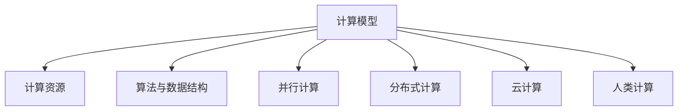

                 

## 1. 背景介绍

### 1.1 问题由来

在人类文明的发展历程中，计算能力一直是推动科学进步和社会变革的重要引擎。从早期的计算器，到机械计算设备，再到后来的电子计算机，人类通过不断拓展计算能力，实现了从数学推理到数据处理，从工业自动化到智能决策的全方位突破。

随着信息技术的高速发展，计算能力日益成为决定一个国家科技竞争力的关键因素。然而，传统的计算范式往往局限于固定的硬件架构和算法逻辑，难以应对复杂多变的问题场景和实时需求。为此，我们需要重新思考计算的本质，探索更灵活、高效、普适的计算范式，以释放人类创造力的源泉。

### 1.2 问题核心关键点

人类计算的魅力在于其灵活性和普适性。通过将复杂问题抽象为计算任务，结合不同的计算资源和算法工具，人类可以高效地解决问题，并在不断迭代中提升计算能力。然而，当前的计算范式（如传统冯诺依曼架构、固定算法逻辑等）在应对动态变化的环境和多样化的问题时，存在诸多局限。为此，我们需要探索新的计算模型和计算范式，以突破这些瓶颈，释放计算的潜能。

## 2. 核心概念与联系

### 2.1 核心概念概述

为更好地理解人类计算的魅力，本节将介绍几个密切相关的核心概念：

- **计算模型(Computational Model)**：定义了计算的基本框架和算法逻辑，决定了计算任务的处理方式和效率。常见的计算模型包括冯诺依曼模型、图灵机模型、量子计算模型等。

- **计算资源(Computational Resources)**：指用于支持计算任务的硬件和软件资源，如CPU、GPU、TPU、内存、存储等。

- **算法与数据结构(Algorithms and Data Structures)**：用于解决特定计算问题的算法和数据组织方式。算法的高效性直接影响计算任务的处理速度和资源消耗。

- **并行计算(Parallel Computing)**：通过多处理器、多线程等技术，同时处理多个计算任务，以提升计算效率和响应速度。

- **分布式计算(Distributed Computing)**：将计算任务分布到多个计算节点上，并行处理，以实现大规模数据处理和高并发服务。

- **云计算(Cloud Computing)**：通过互联网提供按需计算资源，支持弹性扩展和按量计费，便于大规模应用开发和部署。

- **人类计算(Human Computing)**：结合人类的计算能力和认知优势，将复杂计算任务分解为可管理的小任务，通过交互式计算和协同计算，提升计算效果和用户体验。

这些核心概念之间的逻辑关系可以通过以下Mermaid流程图来展示：



这个流程图展示了几类计算模型的主要关系：

1. 计算模型定义了计算的基本框架和逻辑。
2. 计算资源提供了计算任务所需的硬件和软件支持。
3. 算法与数据结构优化了计算过程和数据组织。
4. 并行计算和分布式计算提升了计算效率和资源利用率。
5. 云计算提供了灵活的计算资源管理和按需服务。
6. 人类计算结合了人类的认知和计算能力，实现了更高效的问题解决。

## 3. 核心算法原理 & 具体操作步骤

### 3.1 算法原理概述

人类计算的精髓在于将复杂问题分解为多个可管理的小任务，通过协同计算和交互式计算，实现高效、普适的计算。常见的计算模型如并行计算、分布式计算、云计算等，都是人类计算的重要工具和手段。

基于这些计算模型和工具，人类可以高效地处理大规模数据、解决复杂问题，并通过不断迭代优化算法和资源管理策略，提升计算效率和问题解决能力。

### 3.2 算法步骤详解

人类计算的核心步骤包括问题分解、任务分配、协同计算和结果整合。具体步骤如下：

**Step 1: 问题分解**

将复杂问题拆分为多个小任务，每个任务具有一定的独立性和可管理性。例如，将大规模数据分析任务分解为数据清洗、数据存储、数据处理、数据分析等多个子任务。

**Step 2: 任务分配**

根据任务的特点和计算资源的需求，将任务分配到合适的计算节点上。例如，对于计算密集型的任务，可以分配到GPU或TPU上；对于存储密集型的任务，可以分配到高容量存储设备上。

**Step 3: 协同计算**

通过多线程、多节点、分布式等技术，同时处理多个任务，提高计算效率和响应速度。例如，使用Hadoop或Spark进行大规模数据处理，使用MPI或OpenMPI进行大规模计算任务并行处理。

**Step 4: 结果整合**

将各个任务的计算结果汇总整合，形成最终的处理结果。例如，使用分布式数据库进行数据存储和查询，使用数据可视化工具展示结果，以便进行数据分析和决策。

### 3.3 算法优缺点

人类计算具有以下优点：

1. **灵活性高**：能够根据具体问题场景，灵活选择计算模型和资源，提升计算效率。
2. **可扩展性强**：通过分布式计算和云计算，可以动态扩展计算资源，支持大规模应用。
3. **协同效果好**：通过人类与机器的协同计算，可以更好地解决复杂问题，提升计算效果。
4. **用户体验好**：通过交互式计算和可视化工具，用户可以直观地了解计算结果和分析过程。

同时，人类计算也存在一些缺点：

1. **资源消耗高**：大规模并行计算和分布式计算需要大量的硬件资源，成本较高。
2. **协同复杂度高**：协同计算需要协调多个节点的计算任务，复杂度较高，容易出现瓶颈。
3. **算法实现复杂**：复杂的算法实现和优化需要更高的技术门槛，难以实现大规模推广。
4. **安全风险高**：分布式计算和云计算可能面临数据泄露和系统安全问题，需要更高的安全防护措施。

尽管存在这些局限，但就目前而言，人类计算仍是实现大规模、复杂问题解决的重要手段。未来相关研究的重点在于如何进一步降低计算资源的依赖，提高协同计算的效率，同时兼顾计算效果和用户体验。

### 3.4 算法应用领域

人类计算技术已经在多个领域得到了广泛应用，包括：

- **科学计算**：如天气预报、气候模拟、生物医药等。通过大规模并行计算和分布式计算，提升科学研究的计算效率。
- **大数据分析**：如金融风控、智能推荐、社交网络分析等。通过云计算和大数据平台，处理海量数据，提取有价值的信息。
- **人工智能**：如机器学习、深度学习、自然语言处理等。通过分布式训练和多节点协同，提升算法的训练效率和模型性能。
- **工业控制**：如自动化生产线、智能制造等。通过实时计算和智能决策，提升工业生产的效率和智能化水平。
- **娱乐产业**：如游戏开发、虚拟现实、影视制作等。通过高性能计算和并行计算，提升娱乐产品的制作质量和用户体验。

除了上述这些经典应用外，人类计算技术还将不断拓展到更多领域，如智慧城市、智能交通、智慧医疗等，为各行各业带来新的变革。

## 4. 数学模型和公式 & 详细讲解 & 举例说明

### 4.1 数学模型构建

人类计算的核心在于将复杂问题分解为多个小任务，并使用不同的计算模型和算法工具进行处理。以大数据分析为例，其数学模型可以描述为：

$$
\text{Big Data Analysis} = \text{Data Preprocessing} \times \text{Data Storage} \times \text{Data Mining} \times \text{Data Visualization}
$$

其中，Data Preprocessing负责数据清洗和格式转换，Data Storage负责大规模数据存储，Data Mining负责数据分析和模式挖掘，Data Visualization负责结果展示和分析。

### 4.2 公式推导过程

以数据清洗为例，其数学模型可以进一步细化为：

$$
\text{Data Preprocessing} = \text{Data Cleaning} \times \text{Data Formatting} \times \text{Data Augmentation} \times \text{Data Integration}
$$

其中，Data Cleaning负责去除噪声和错误，Data Formatting负责数据格式统一，Data Augmentation负责数据增强，Data Integration负责数据整合。

通过这些数学模型和公式，我们可以更好地理解和设计人类计算过程，提升计算效率和效果。

### 4.3 案例分析与讲解

以金融风险预测为例，其计算过程可以分为多个小任务，使用不同的计算模型和算法工具进行处理。具体步骤如下：

1. **数据预处理**：清洗和格式化金融数据，去除噪声和错误。
2. **特征提取**：使用PCA或LDA等算法进行特征降维，提取有价值的特征。
3. **模型训练**：使用随机森林、梯度提升树等算法进行模型训练，构建预测模型。
4. **模型评估**：使用交叉验证等方法评估模型性能，调整模型参数。
5. **结果展示**：使用可视化工具展示预测结果，提供决策支持。

## 5. 项目实践：代码实例和详细解释说明

### 5.1 开发环境搭建

在进行人类计算项目开发前，我们需要准备好开发环境。以下是使用Python进行Apache Spark开发的环境配置流程：

1. 安装Apache Spark：从官网下载并安装Spark，支持Java和Scala等多种编程语言。
2. 安装Hadoop：安装Hadoop分布式文件系统，用于存储和管理大规模数据。
3. 安装Scala：安装Scala开发环境，支持Scala编程语言。
4. 安装Eclipse或IntelliJ IDEA：配置IDE环境，方便代码调试和开发。

完成上述步骤后，即可在本地搭建Spark开发环境。

### 5.2 源代码详细实现

下面我们以大规模数据清洗为例，给出使用Apache Spark进行数据预处理的PySpark代码实现。

```python
from pyspark import SparkContext, SparkConf
from pyspark.sql import SparkSession
from pyspark.sql.functions import col

# 初始化Spark环境
conf = SparkConf().setMaster("local").setAppName("DataCleaning")
sc = SparkContext(conf=conf)
spark = SparkSession(sc)

# 加载数据
data = spark.read.csv("data.csv", header=True, inferSchema=True)

# 数据清洗
cleaned_data = data.select(
    expr("if(isnull(trade_date), '0', trade_date)").alias("cleaned_date"),
    expr("if(isnull(trade_price), '0', trade_price)").alias("cleaned_price")
)

# 数据格式化
formatted_data = cleaned_data.write.csv("formatted_data.csv")

# 数据存储
formatted_data.write.hdfs("hdfs://localhost:9000/user/hadoop/project/formatted_data")

# 数据展示
formatted_data.show()
```

以上代码展示了Spark进行数据清洗和格式化的基本流程。通过使用Spark的数据处理框架，可以高效地处理大规模数据，实现分布式计算和并行处理。

### 5.3 代码解读与分析

让我们再详细解读一下关键代码的实现细节：

**初始化Spark环境**：
- 创建SparkConf对象，设置Spark运行模式和应用名称。
- 创建SparkContext对象，作为Spark计算的核心。
- 创建SparkSession对象，作为Spark数据处理的高层API。

**加载数据**：
- 使用SparkSession的read方法读取数据文件。
- 使用header和inferSchema参数指定数据文件格式和自动推断数据类型。

**数据清洗**：
- 使用ifnull函数处理缺失值，将缺失值替换为默认值。
- 对数据进行格式化，确保数据一致性。

**数据格式化**：
- 使用select方法选择保留的字段，并进行格式化处理。
- 使用write方法将数据写入Hadoop分布式文件系统。

**数据展示**：
- 使用show方法展示数据，验证数据清洗和格式化的结果。

可以看到，通过使用Spark进行数据预处理，可以高效地处理大规模数据，实现分布式计算和并行处理。

## 6. 实际应用场景

### 6.1 智能制造

人类计算在智能制造领域的应用非常广泛。传统的制造系统往往是固定流程和手动操作的，难以适应复杂多变的需求和实时变化的环境。通过人类计算技术，可以将制造流程分解为多个小任务，并使用分布式计算和云计算进行协同处理，提升制造系统的灵活性和自动化水平。

具体而言，可以通过工业互联网平台和工业大数据平台，收集生产数据和运营数据，进行数据清洗和分析，发现生产流程中的瓶颈和优化点，实现智能调度和资源优化。例如，使用Spark和Hadoop进行实时数据处理，使用机器学习算法进行预测和决策，提升生产效率和产品质量。

### 6.2 智慧城市

智慧城市建设需要处理海量城市数据，包括交通、环境、能源、安全等各个方面。通过人类计算技术，可以实现城市数据的集中存储、分布式处理和协同计算，提升城市管理的智能化水平。

具体而言，可以通过云计算平台和物联网设备，收集城市数据，进行数据清洗和预处理，使用大数据分析工具进行模式挖掘和决策支持，实现城市管理的自动化和智能化。例如，使用Hadoop和Spark进行城市数据处理，使用机器学习算法进行交通流量预测，实现智能交通管理。

### 6.3 医疗健康

医疗健康领域需要处理大量的患者数据和医疗数据，传统的数据处理和分析方法往往效率低下、效果不佳。通过人类计算技术，可以实现医疗数据的集中存储、分布式处理和协同计算，提升医疗服务的智能化水平。

具体而言，可以通过云计算平台和医疗大数据平台，收集患者数据和医疗数据，进行数据清洗和预处理，使用大数据分析工具进行疾病预测和决策支持，实现智能医疗服务。例如，使用Hadoop和Spark进行医疗数据处理，使用机器学习算法进行疾病预测，实现智能诊断和治疗。

### 6.4 未来应用展望

随着人类计算技术的不断发展，未来在更多领域都将得到应用，为各行各业带来变革性影响。

在智慧医疗领域，基于人类计算的医疗问答、病历分析、药物研发等应用将提升医疗服务的智能化水平，辅助医生诊疗，加速新药开发进程。

在智能教育领域，微调技术可应用于作业批改、学情分析、知识推荐等方面，因材施教，促进教育公平，提高教学质量。

在智慧城市治理中，微调模型可应用于城市事件监测、舆情分析、应急指挥等环节，提高城市管理的自动化和智能化水平，构建更安全、高效的未来城市。

此外，在企业生产、社会治理、文娱传媒等众多领域，人类计算技术也将不断涌现，为经济社会发展注入新的动力。相信随着技术的日益成熟，人类计算技术将成为各行各业的重要范式，推动人工智能技术更好地造福人类社会。

## 7. 工具和资源推荐

### 7.1 学习资源推荐

为了帮助开发者系统掌握人类计算的理论基础和实践技巧，这里推荐一些优质的学习资源：

1. **《分布式计算原理与实践》**：详细介绍分布式计算的原理和实现方法，包括Hadoop、Spark等主流框架。

2. **《大数据分析与处理》**：全面介绍大数据分析的原理和工具，涵盖数据清洗、数据存储、数据处理、数据分析等多个环节。

3. **《Python数据科学手册》**：详细介绍了Python在数据科学中的应用，包括Pandas、NumPy、Matplotlib等库的使用方法。

4. **《云计算基础》**：全面介绍云计算的原理和应用，包括AWS、Azure、Google Cloud等主流云平台的使用方法。

5. **《Apache Spark官方文档》**：提供Spark的详细介绍和示例代码，是进行分布式计算开发的重要参考资料。

通过对这些资源的学习实践，相信你一定能够快速掌握人类计算的精髓，并用于解决实际的计算问题。

### 7.2 开发工具推荐

高效的开发离不开优秀的工具支持。以下是几款用于人类计算开发的常用工具：

1. **Apache Spark**：开源的分布式计算框架，支持大规模数据处理和并行计算，是进行人类计算开发的重要工具。

2. **Hadoop**：开源的分布式文件系统，支持大规模数据存储和处理，是进行分布式计算的基础设施。

3. **Amazon AWS**：提供云存储、云计算、云安全等全方位的云计算服务，支持弹性扩展和按量计费。

4. **Google Cloud Platform**：提供云存储、云计算、云AI等全方位的云计算服务，支持分布式计算和人工智能应用。

5. **Apache Flink**：开源的流处理框架，支持实时数据处理和分布式计算，是进行实时计算的重要工具。

6. **Kubernetes**：开源的容器编排工具，支持容器化应用的管理和调度，是进行分布式计算和云原生应用的重要工具。

合理利用这些工具，可以显著提升人类计算的开发效率，加快创新迭代的步伐。

### 7.3 相关论文推荐

人类计算的研究源于学界的持续研究。以下是几篇奠基性的相关论文，推荐阅读：

1. **《分布式计算：原理与实践》**：详细介绍了分布式计算的原理和实现方法，包括Hadoop、Spark等主流框架。

2. **《大数据分析与处理》**：全面介绍大数据分析的原理和工具，涵盖数据清洗、数据存储、数据处理、数据分析等多个环节。

3. **《云计算基础》**：全面介绍云计算的原理和应用，包括AWS、Azure、Google Cloud等主流云平台的使用方法。

4. **《Apache Spark官方文档》**：提供Spark的详细介绍和示例代码，是进行分布式计算开发的重要参考资料。

这些论文代表了大规模计算和数据处理的发展脉络。通过学习这些前沿成果，可以帮助研究者把握学科前进方向，激发更多的创新灵感。

## 8. 总结：未来发展趋势与挑战

### 8.1 总结

本文对人类计算的魅力进行了全面系统的介绍。首先阐述了人类计算的本质和核心概念，明确了其在解决复杂问题、提升计算效率方面的独特价值。其次，从原理到实践，详细讲解了人类计算的数学模型和计算过程，给出了人类计算任务开发的完整代码实例。同时，本文还广泛探讨了人类计算技术在智能制造、智慧城市、医疗健康等多个领域的应用前景，展示了人类计算技术的巨大潜力。此外，本文精选了人类计算技术的各类学习资源，力求为读者提供全方位的技术指引。

通过本文的系统梳理，可以看到，人类计算技术正在成为各行各业的重要范式，极大地拓展了计算资源的应用边界，催生了更多的落地场景。得益于大规模数据、分布式计算和云计算等技术的发展，人类计算技术在未来将更加普适、高效和灵活，为各行各业带来新的变革。

### 8.2 未来发展趋势

展望未来，人类计算技术将呈现以下几个发展趋势：

1. **计算资源日益丰富**：随着硬件设备的不断进步，计算资源的种类和规模将不断增加，支撑更多复杂计算任务。

2. **算法与数据结构不断优化**：随着对复杂问题的深入理解和计算能力的提升，新的算法和数据结构将被不断开发和优化，提升计算效率和效果。

3. **协同计算日益普及**：随着协同计算技术的成熟，更多场景将采用分布式计算、云计算等协同计算方式，提升计算效率和资源利用率。

4. **实时计算日益重要**：随着实时计算技术的发展，实时数据处理和决策支持将更加普及，满足用户对实时性的需求。

5. **人工智能与人类计算深度融合**：随着人工智能技术的不断发展，人工智能与人类计算的深度融合将成为未来发展方向，提升智能系统的智能化水平。

以上趋势凸显了人类计算技术的广阔前景。这些方向的探索发展，必将进一步提升计算能力，拓展计算应用的边界，释放计算的潜能。

### 8.3 面临的挑战

尽管人类计算技术已经取得了瞩目成就，但在迈向更加智能化、普适化应用的过程中，它仍面临诸多挑战：

1. **资源消耗高**：大规模分布式计算和云计算需要大量的硬件资源，成本较高。如何降低资源消耗，提高资源利用率，是未来发展的重要方向。

2. **协同复杂度高**：协同计算需要协调多个节点的计算任务，复杂度较高，容易出现瓶颈。如何优化协同计算策略，提升协同计算效率，是未来研究的重要课题。

3. **算法实现复杂**：复杂的算法实现和优化需要更高的技术门槛，难以实现大规模推广。如何简化算法实现，提高算法可扩展性，是未来研究的重要方向。

4. **安全风险高**：分布式计算和云计算可能面临数据泄露和系统安全问题，需要更高的安全防护措施。如何保障数据安全和系统安全，是未来研究的重要课题。

5. **系统复杂度高**：分布式计算和云计算系统复杂度高，需要更高的人才和资源投入。如何降低系统复杂度，提升系统可靠性，是未来研究的重要方向。

正视人类计算面临的这些挑战，积极应对并寻求突破，将是人类计算技术走向成熟的必由之路。相信随着学界和产业界的共同努力，这些挑战终将一一被克服，人类计算技术必将在构建普适化、智能化、高效化的计算系统中发挥重要作用。

### 8.4 研究展望

面对人类计算面临的挑战，未来的研究需要在以下几个方面寻求新的突破：

1. **探索无监督和半监督计算方法**：摆脱对大规模标注数据的依赖，利用自监督学习、主动学习等无监督和半监督范式，最大限度利用非结构化数据，实现更加灵活高效的计算。

2. **研究高效协同计算范式**：开发更加高效的协同计算方法，如流计算、雾计算等，减少计算延迟，提升计算效率。

3. **引入更多先验知识**：将符号化的先验知识，如知识图谱、逻辑规则等，与神经网络模型进行巧妙融合，引导计算过程学习更准确、合理的计算模型。

4. **结合因果分析和博弈论工具**：将因果分析方法引入计算过程，识别出计算决策的关键特征，增强计算输出的因果性和逻辑性。借助博弈论工具刻画人机交互过程，主动探索并规避计算模型的脆弱点，提高系统稳定性。

5. **纳入伦理道德约束**：在计算模型和计算任务中引入伦理导向的评估指标，过滤和惩罚有害的计算输出倾向，确保计算系统的可解释性和可控性。

这些研究方向的探索，必将引领人类计算技术迈向更高的台阶，为构建普适化、智能化、高效化的计算系统铺平道路。面向未来，人类计算技术还需要与其他计算范式进行更深入的融合，如量子计算、生物计算等，多路径协同发力，共同推动计算能力的突破。

## 9. 附录：常见问题与解答

**Q1：如何理解人类计算的本质？**

A: 人类计算的本质在于将复杂问题分解为多个小任务，通过协同计算和交互式计算，实现高效、普适的计算。其核心在于利用计算资源的灵活性和可扩展性，结合人类的计算能力和认知优势，实现最优的计算效果和用户体验。

**Q2：人类计算与传统计算有何不同？**

A: 传统计算往往局限于固定的硬件架构和算法逻辑，难以应对复杂多变的问题场景和实时需求。而人类计算则结合了人类的计算能力和认知优势，将复杂计算任务分解为可管理的小任务，通过协同计算和交互式计算，提升计算效率和效果。

**Q3：人类计算在实际应用中面临哪些挑战？**

A: 人类计算在实际应用中面临资源消耗高、协同复杂度高、算法实现复杂、安全风险高等挑战。需要积极应对并寻求突破，才能实现大规模、复杂问题的有效解决。

**Q4：如何优化人类计算的协同计算策略？**

A: 优化人类计算的协同计算策略需要从多个方面入手，包括提高数据传输效率、优化任务调度策略、引入实时计算技术等。同时需要综合考虑计算资源的利用率和系统的可扩展性。

**Q5：人类计算技术在未来将如何发展？**

A: 未来人类计算技术将不断丰富计算资源、优化算法与数据结构、普及协同计算、提升实时计算能力、实现人工智能与人类计算的深度融合。这些趋势将进一步拓展计算应用的边界，释放计算的潜能。

综上所述，人类计算技术正成为推动计算能力不断突破的重要手段。通过不断探索和创新，人类计算将助力各行各业实现智能化、普适化发展，为人类社会的进步带来深远影响。

