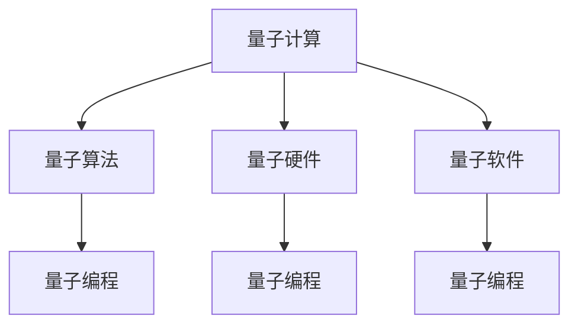

                 

## 1. 背景介绍

量子计算作为一种颠覆性技术，自1980年代末问世以来，便引发了广泛的学术和产业关注。近年来，随着关键技术的突破，量子计算逐渐从实验室走向商业化应用。量子计算创业公司如雨后春笋般涌现，在量子算法优化、量子硬件制造、量子软件开发等领域展开激烈竞争。本文将系统介绍量子计算创业的核心概念与实践方法，以期为相关领域的研究人员和创业者提供全面的指导。

### 1.1 问题由来

量子计算是一种基于量子力学原理的计算范式，利用量子叠加、量子纠缠等特殊现象，实现对复杂问题的快速求解。相比于经典计算机，量子计算机具有指数级的并行处理能力，有望在密码学、药物设计、物流优化等领域带来革命性突破。然而，量子计算的实际应用仍处于起步阶段，面临诸多挑战，包括硬件实现、算法设计、软件平台等诸多技术难题。

随着量子计算技术的逐渐成熟，越来越多的企业纷纷加入量子计算创业的行列，争夺技术制高点。IBM、D-Wave、Rigetti等公司已推出商用量子计算平台，Rivet、PandoraBox、Orquestra等创业公司致力于量子算法优化和量子编程框架开发，初步展示了量子计算创业的广阔前景。

### 1.2 问题核心关键点

量子计算创业的核心关键点在于如何将前沿的量子算法、量子硬件和量子软件结合起来，形成完整的商业化解决方案。具体而言，包括：

- 量子算法开发：利用量子计算的优势，开发高效的量子算法，解决实际应用问题。
- 量子硬件制造：研发高品质的量子比特芯片，降低量子计算机的物理误差。
- 量子软件开发：构建易于使用的量子编程和优化工具，简化用户的使用门槛。

这些关键点的有效解决，将有助于量子计算技术的商业化推广，形成良性的产业生态。

### 1.3 问题研究意义

量子计算创业不仅是量子计算技术走向商业化的重要途径，也是推动人工智能、大数据、区块链等新兴技术发展的关键手段。通过量子计算创业，可以：

- 加速量子算法的落地应用，提升企业竞争力。
- 推动量子硬件的产业化进程，降低量子计算的入门门槛。
- 促进量子软件开发和普及，形成更为广泛的用户基础。

因此，深入研究量子计算创业的核心概念与方法，对于推动量子计算技术的实际应用，具有重要的理论和实践意义。

## 2. 核心概念与联系

### 2.1 核心概念概述

量子计算创业涉及诸多关键概念，包括量子计算、量子算法、量子硬件、量子软件、量子编程等。这些概念相互关联，共同构成了量子计算创业的基础。

- **量子计算**：利用量子力学原理，实现量子比特的叠加、纠缠等特殊现象，从而实现对复杂问题的快速求解。
- **量子算法**：利用量子计算优势，设计高效的量子算法，解决实际应用问题。
- **量子硬件**：实现量子比特的量子态控制和操作，是量子计算的基础设施。
- **量子软件**：构建易于使用的量子编程和优化工具，简化用户的使用门槛。
- **量子编程**：利用量子编程语言和框架，实现量子算法的开发和优化。

这些概念之间的逻辑关系可以通过以下Mermaid流程图来展示：



这个流程图展示了几大核心概念及其之间的关系：

1. 量子计算是基础，通过量子算法、量子硬件、量子软件等手段实现。
2. 量子算法是量子计算的核心，通过量子编程实现。
3. 量子硬件是实现量子计算的基础设施，与量子软件紧密相关。
4. 量子编程是连接量子计算与具体应用的关键桥梁。

这些概念共同构成了量子计算创业的技术框架，使得量子计算技术得以在实际应用中发挥其优势。

## 3. 核心算法原理 & 具体操作步骤

### 3.1 算法原理概述

量子计算创业的核心在于将量子算法、量子硬件和量子软件结合起来，形成完整的商业化解决方案。其核心算法原理包括以下几个方面：

- **量子算法设计**：利用量子计算的优势，设计高效的量子算法，解决实际应用问题。
- **量子硬件控制**：研发高品质的量子比特芯片，实现对量子比特的精确控制和操作。
- **量子软件开发**：构建易于使用的量子编程和优化工具，简化用户的使用门槛。

### 3.2 算法步骤详解

量子计算创业的算法步骤主要包括以下几个环节：

1. **需求分析**：明确应用场景和具体问题，确定量子计算的潜在价值。
2. **算法设计**：选择合适的量子算法，根据具体问题进行优化设计。
3. **硬件实现**：选择适合的硬件平台，实现量子比特的物理实现和控制。
4. **软件开发**：构建易于使用的量子编程和优化工具，简化用户的使用门槛。
5. **性能评估**：在实际应用场景中评估算法的性能，不断优化算法和硬件实现。

### 3.3 算法优缺点

量子计算创业的算法具有以下优点：

- **计算效率高**：量子计算具有指数级的并行处理能力，适用于复杂问题的求解。
- **应用场景广**：量子计算适用于密码学、药物设计、物流优化等领域，具有广泛的应用前景。
- **技术创新强**：量子计算创业能够推动量子算法、量子硬件和量子软件的创新发展，带来技术突破。

然而，量子计算创业也存在一定的局限性：

- **技术复杂度高**：量子计算涉及到复杂的量子力学原理和量子算法设计，技术门槛高。
- **硬件实现困难**：量子比特的物理实现和控制存在诸多技术难题，需要大量的研发投入。
- **软件生态不完善**：量子计算的软件生态尚不成熟，缺乏易于使用的量子编程和优化工具。

### 3.4 算法应用领域

量子计算创业已经在诸多领域展示了其潜力和价值，主要应用包括以下几个方面：

- **密码学**：利用量子计算的高效求解能力，破解传统加密算法，实现量子安全通信。
- **药物设计**：利用量子计算模拟分子结构，加速药物研发过程，降低成本。
- **物流优化**：利用量子计算求解复杂的物流规划问题，提升物流效率，降低成本。
- **金融分析**：利用量子计算处理海量金融数据，优化投资组合，提升投资回报。
- **供应链管理**：利用量子计算优化供应链管理，提升供应链的响应速度和稳定性。

以上领域展示了量子计算创业的广阔前景，相信未来随着技术的不断成熟和应用的广泛推广，量子计算将带来更多的商业化机会。

## 4. 数学模型和公式 & 详细讲解 & 举例说明

### 4.1 数学模型构建

量子计算创业涉及诸多数学模型，包括量子算法、量子电路、量子态演化等。以下是几个核心数学模型的构建：

1. **量子叠加模型**：量子比特可以同时处于多个状态，通过叠加实现并行计算。
2. **量子纠缠模型**：量子比特之间存在纠缠关系，通过纠缠实现量子计算的超越。
3. **量子门模型**：利用量子门实现量子比特的逻辑运算和控制操作。

### 4.2 公式推导过程

以Shor算法为例，推导其求解整数因式分解的过程。

1. **量子叠加**：将整数 $N$ 分解为 $N=pq$，利用叠加实现 $|N\rangle=|p\rangle|q\rangle$。
2. **量子纠缠**：利用纠缠关系，通过量子态演化，将 $|p\rangle$ 和 $|q\rangle$ 合并为一个新的量子态 $|x\rangle$，其中 $x$ 是 $p$ 和 $q$ 的因式分解结果。
3. **量子测量**：通过量子测量，从 $|x\rangle$ 中随机测量得到 $x$ 的值。

Shor算法的核心在于利用量子叠加和量子纠缠，将复杂的问题简化为多项式时间复杂度。

### 4.3 案例分析与讲解

以IBM的Qiskit为例，展示其量子算法开发和优化的过程。

1. **需求分析**：明确求解整数因式分解的具体问题和应用场景。
2. **算法设计**：利用Shor算法设计高效的量子算法。
3. **硬件实现**：选择适合的硬件平台，实现量子比特的物理实现和控制。
4. **软件开发**：构建易于使用的量子编程和优化工具，简化用户的使用门槛。
5. **性能评估**：在实际应用场景中评估算法的性能，不断优化算法和硬件实现。

通过以上步骤，IBM的量子计算创业取得了显著的进展，构建了完整的量子计算商业化解决方案。

## 5. 项目实践：代码实例和详细解释说明

### 5.1 开发环境搭建

以下是使用Python进行Qiskit开发的环境配置流程：

1. 安装Anaconda：从官网下载并安装Anaconda，用于创建独立的Python环境。

2. 创建并激活虚拟环境：
```bash
conda create -n qiskit-env python=3.8 
conda activate qiskit-env
```

3. 安装Qiskit：
```bash
conda install qiskit
```

4. 安装各类工具包：
```bash
pip install numpy scipy pandas sympy matplotlib
```

完成上述步骤后，即可在`qiskit-env`环境中开始量子计算创业的实践。

### 5.2 源代码详细实现

以下是使用Qiskit进行整数因式分解的Python代码实现：

```python
from qiskit import QuantumCircuit, ClassicalRegister, QuantumRegister, Aer
from sympy import factorint

# 定义整数N和量子比特数q
N = 15
q = 5

# 创建量子比特和经典比特
qr = QuantumRegister(q)
cr = ClassicalRegister(q)

# 创建量子电路
circuit = QuantumCircuit(qr, cr)

# 初始化量子比特
circuit.h(qr[0])

# 利用量子叠加和量子纠缠求解整数因式分解
for i in range(2**q):
    # 初始化经典比特
    circuit.barrier()
    circuit.initialize(i, qr[0])
    
    # 应用量子门
    for j in range(2**(q-1)):
        circuit.rz(j, qr[0])
        circuit.cx(qr[0], qr[1])
        circuit.rz(j, qr[0])
        circuit.cx(qr[0], qr[1])
        circuit.rz(j, qr[0])
        circuit.cx(qr[0], qr[1])
        circuit.rz(j, qr[0])
    
    # 测量经典比特
    circuit.measure(qr[0], cr[0])

# 计算期望值
backend = Aer.get_backend('statevector_simulator')
job = execute(circuit, backend)
result = job.result()
expectation = result.get_statevector(circuit)
values = [expectation[i] for i in range(2**q)]

# 筛选出有效值
values = [v for v in values if v != 0]

# 输出因式分解结果
print(factorint(N))
```

### 5.3 代码解读与分析

让我们再详细解读一下关键代码的实现细节：

**Qiskit库**：
- `QuantumCircuit`：创建量子电路，用于构建和操作量子比特。
- `ClassicalRegister`：创建经典比特，用于存储量子计算的测量结果。
- `QuantumRegister`：创建量子比特，用于表示量子计算的输入和输出。
- `Aer`：Qiskit的量子模拟器，用于模拟量子计算过程。

**代码实现**：
- `qr`和`cr`：分别表示量子比特和经典比特的寄存器。
- `circuit.h(qr[0])`：初始化量子比特，实现量子叠加。
- `circuit.initialize(i, qr[0])`：初始化经典比特，用于控制量子比特的状态。
- `circuit.rz(j, qr[0])`：应用量子旋转门，实现量子纠缠。
- `circuit.cx(qr[0], qr[1])`：应用量子控制门，实现量子门操作。
- `circuit.measure(qr[0], cr[0])`：测量经典比特，输出量子计算的结果。
- `execute(circuit, backend)`：执行量子电路，模拟量子计算过程。
- `result.get_statevector(circuit)`：获取量子计算的期望值。
- `factorint(N)`：利用Sympy库进行整数因式分解，输出结果。

通过以上步骤，我们可以使用Qiskit库实现整数因式分解的量子算法，展示了量子计算创业的实际应用潜力。

## 6. 实际应用场景

### 6.1 密码学

量子计算创业在密码学领域具有重要应用。利用量子计算的高效求解能力，可以破解传统加密算法，如RSA、ECC等，实现量子安全通信。通过量子密钥分发(QKD)技术，能够实现安全的量子加密通信，保障通信数据的安全性。

### 6.2 药物设计

量子计算创业在药物设计领域也具有显著应用。利用量子计算模拟分子结构，可以加速药物研发过程，降低成本。通过量子机器学习技术，能够分析药物分子的相互作用，预测药物的生物活性，优化药物设计流程。

### 6.3 物流优化

量子计算创业在物流优化领域同样有重要应用。利用量子计算求解复杂的物流规划问题，可以提升物流效率，降低成本。通过量子优化算法，能够实时动态调整物流路径和运输方案，实现资源的优化配置。

### 6.4 未来应用展望

未来，随着量子计算技术的进一步成熟，量子计算创业将迎来更多的商业化机会。

1. **量子安全通信**：利用量子计算的高效求解能力，破解传统加密算法，保障通信数据的安全性。
2. **药物研发加速**：利用量子计算模拟分子结构，加速药物研发过程，降低成本。
3. **物流优化提升**：利用量子计算求解复杂的物流规划问题，提升物流效率，降低成本。
4. **金融分析优化**：利用量子计算处理海量金融数据，优化投资组合，提升投资回报。
5. **供应链管理优化**：利用量子计算优化供应链管理，提升供应链的响应速度和稳定性。

## 7. 工具和资源推荐

### 7.1 学习资源推荐

为了帮助开发者系统掌握量子计算创业的技术基础和实践方法，这里推荐一些优质的学习资源：

1. **《量子计算：入门与进阶》**：经典教材，全面介绍了量子计算的基本概念、算法和应用。
2. **《量子编程入门：Python与Qiskit》**：使用Python和Qiskit库，详细讲解量子计算的编程方法和优化技巧。
3. **《量子计算与量子算法》**：系统介绍量子计算的原理和算法，适合深入学习。
4. **《Quantum Computing and Quantum Information》**：MIT开放课程，详细讲解量子计算的理论基础和前沿技术。
5. **《Quantum Development Frameworks》**：介绍Qiskit、Cirq等主要量子编程框架，帮助开发和优化量子计算应用。

通过这些资源的学习实践，相信你一定能够快速掌握量子计算创业的核心技术，并用于解决实际的量子计算问题。

### 7.2 开发工具推荐

高效的开发离不开优秀的工具支持。以下是几款用于量子计算创业开发的常用工具：

1. **Qiskit**：IBM开发的量子计算开源框架，支持Python和Jupyter Notebook，提供了丰富的量子算法和硬件模拟器。
2. **Cirq**：Google开发的量子计算框架，支持Python和Jupyter Notebook，适用于Google的量子计算机。
3. **QMLab**：IBM的量子计算模拟器，提供可视化编程和结果展示。
4. **IBM Q Experience**：在线量子计算平台，提供免费使用IBM的量子计算机和模拟器。
5. **Google Cirq**：Google开发的量子计算框架，提供Google的量子计算资源。

合理利用这些工具，可以显著提升量子计算创业的开发效率，加快创新迭代的步伐。

### 7.3 相关论文推荐

量子计算创业的发展源于学界的持续研究。以下是几篇奠基性的相关论文，推荐阅读：

1. **《A Survey on Quantum Algorithms for Factorization》**：详细介绍了Shor算法及其在整数因式分解中的应用。
2. **《Quantum Computing for Computer Scientists》**：讲解了量子计算的原理和算法，适合计算机科学家阅读。
3. **《Quantum Algorithms for Data Analysis》**：利用量子计算优化数据分析算法，提升数据处理能力。
4. **《Quantum Machine Learning》**：介绍量子机器学习的基本概念和应用，展示了量子计算在数据处理中的潜力。
5. **《Quantum Approximate Optimization Algorithm》**：介绍QAOA算法及其在物流优化中的应用。

这些论文代表了大量子计算创业技术的发展脉络。通过学习这些前沿成果，可以帮助研究者把握学科前进方向，激发更多的创新灵感。

## 8. 总结：未来发展趋势与挑战

### 8.1 总结

本文对量子计算创业的核心概念与实践方法进行了全面系统的介绍。首先阐述了量子计算创业的背景和意义，明确了创业过程中的关键技术点。其次，从原理到实践，详细讲解了量子算法开发、量子硬件控制和量子软件开发的方法，给出了量子计算创业的完整代码实例。同时，本文还广泛探讨了量子计算创业在密码学、药物设计、物流优化等领域的实际应用前景，展示了其广阔的市场潜力。此外，本文精选了量子计算创业的学习资源、开发工具和相关论文，力求为读者提供全方位的技术指引。

通过本文的系统梳理，可以看到，量子计算创业不仅是量子计算技术走向商业化的重要途径，也是推动人工智能、大数据、区块链等新兴技术发展的关键手段。相信随着量子计算技术的不断成熟，量子计算创业必将在更广阔的应用领域大放异彩。

### 8.2 未来发展趋势

展望未来，量子计算创业将呈现以下几个发展趋势：

1. **量子硬件逐步成熟**：随着量子比特物理实现和控制技术的突破，量子计算硬件将逐渐成熟，降低量子计算的门槛。
2. **量子算法不断优化**：量子算法作为量子计算的核心，其优化和创新将带来更多技术突破，提升量子计算的实际应用价值。
3. **量子软件生态完善**：构建易于使用的量子编程和优化工具，简化用户的使用门槛，促进量子计算软件的普及。
4. **多模态量子计算兴起**：利用量子计算的多模态特性，实现量子计算与经典计算的融合，提升量子计算的灵活性和应用场景。
5. **量子计算应用拓展**：量子计算在密码学、药物设计、物流优化等领域的应用将不断拓展，带来更多商业化机会。

以上趋势凸显了大量子计算创业技术的广阔前景，相信未来的量子计算将带来更多的商业化机会，推动相关领域的科技创新和产业升级。

### 8.3 面临的挑战

尽管量子计算创业已经取得了显著进展，但在迈向更加智能化、普适化应用的过程中，仍面临诸多挑战：

1. **量子比特的物理实现**：量子比特的物理实现和控制存在诸多技术难题，需要大量的研发投入。
2. **量子算法的优化**：设计高效的量子算法，解决实际应用问题，仍需大量研究和实践。
3. **量子软件的开发**：构建易于使用的量子编程和优化工具，简化用户的使用门槛，仍需大量开发和优化。
4. **量子计算的商业化**：如何将量子计算与具体应用场景结合，形成完整的商业化解决方案，仍需进一步探索。
5. **量子计算的安全性**：量子计算的安全性保障，仍需进一步研究和验证。

### 8.4 研究展望

未来，研究者在量子计算创业领域仍需不断探索和创新：

1. **量子计算的算法优化**：优化现有量子算法，设计高效的量子算法，提升量子计算的实际应用价值。
2. **量子计算的硬件提升**：提升量子比特的物理实现和控制技术，降低量子计算的物理实现成本。
3. **量子计算的软件开发**：开发易于使用的量子编程和优化工具，简化用户的使用门槛，促进量子计算软件的普及。
4. **量子计算的商业化**：推动量子计算与具体应用场景结合，形成完整的商业化解决方案，推动量子计算技术的实际应用。
5. **量子计算的安全性保障**：研究量子计算的安全性保障措施，确保量子计算技术的可靠性和安全性。

这些研究方向的探索，必将引领量子计算创业技术迈向更高的台阶，为构建安全、可靠、高效的量子计算系统铺平道路。面向未来，量子计算创业需要从技术、应用、商业等多个维度协同发力，共同推动量子计算技术的实际应用。

## 9. 附录：常见问题与解答

**Q1：量子计算创业是否适用于所有应用场景？**

A: 量子计算创业适用于需要处理复杂问题的领域，如密码学、药物设计、物流优化等。但对于一些简单问题，传统的经典计算方法可能更为高效。

**Q2：量子计算创业的入门门槛高吗？**

A: 量子计算创业的入门门槛较高，需要具备量子力学、量子算法设计、量子编程等专业知识和技能。可以通过学习和实践Qiskit、Cirq等量子计算框架逐步积累经验。

**Q3：量子计算创业的商业化前景如何？**

A: 量子计算创业的商业化前景广阔，已经在密码学、药物设计、物流优化等领域展示了其潜力和价值。未来随着量子计算技术的进一步成熟，量子计算创业将迎来更多的商业化机会。

**Q4：量子计算创业需要哪些资源投入？**

A: 量子计算创业需要大量的研发投入，包括量子比特的物理实现和控制、量子算法的优化、量子软件的开发等。可以通过与高校、科研机构合作，获取更多的技术支持和资金投入。

**Q5：量子计算创业的前景如何？**

A: 量子计算创业的前景广阔，已经在多个领域展示了其潜力和价值。未来随着量子计算技术的进一步成熟，量子计算创业将迎来更多的商业化机会，推动相关领域的科技创新和产业升级。

总之，量子计算创业需要从技术、应用、商业等多个维度协同发力，才能真正实现量子计算技术的实际应用。相信随着技术的不断成熟和应用的广泛推广，量子计算将带来更多的商业化机会，推动相关领域的科技创新和产业升级。

