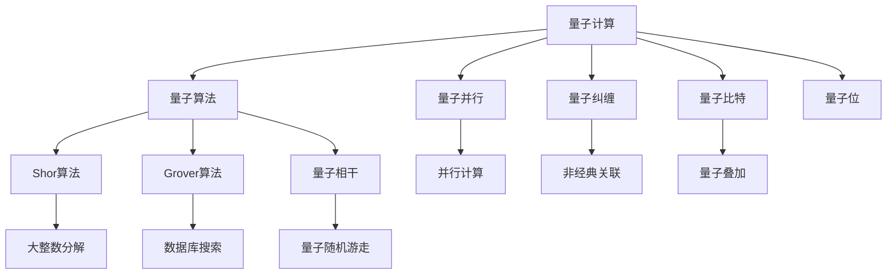

                 

## 1. 背景介绍

### 1.1 问题由来
量子计算作为未来计算领域的革命性技术，近年来在学术界和工业界引起了广泛关注。其利用量子叠加和量子纠缠的物理特性，具有处理某些传统计算机难以解决的复杂问题的潜力。其中，量子计算机在模拟量子系统方面展现出独特的优势，能够以指数级速度优势处理经典计算机难以解决的问题。

然而，量子计算机的复杂性也导致了其在实际应用中的挑战。传统的经典计算机在面对多体系统的计算时，面临计算资源限制，往往需要耗费巨大的时间和计算资源，甚至难以完成。量子计算机的出现，通过模拟量子系统，提供了一种全新的方法来处理复杂的量子计算问题，如图形识别、化学分子模拟等。

### 1.2 问题核心关键点
复杂注意力系统模拟是量子计算在量子物理、分子动力学、化学模拟等领域中的一个重要应用。复杂的注意力系统，如多体系统、高维度自旋系统、量子场论等，在经典计算中极为困难，而量子计算机通过量子并行性和量子纠缠的特性，可以显著提高模拟效率。

量子计算在模拟复杂注意力系统中的核心优势在于：
- **指数加速**：量子计算机可以利用量子叠加和量子纠缠特性，通过并行计算实现指数级加速。
- **精确模拟**：量子计算机能够处理传统计算机难以处理的自旋系统、多体系统等复杂问题，提供更精确的模拟结果。
- **适应性强**：量子计算机能够处理经典计算机难以处理的非平衡态系统，提供更多物理洞察。

### 1.3 问题研究意义
研究量子计算在复杂注意力系统模拟中的应用，对于提升量子计算机的处理能力、推动量子计算技术的产业化进程、加速科学研究的突破，具有重要意义：
- **计算资源优化**：量子计算机能够在解决经典计算机难以处理的问题上，提供更高效的计算资源。
- **科学发现加速**：复杂注意力系统的模拟能够帮助科学家更好地理解量子物理、化学等领域的基础问题，推动科学研究的突破。
- **实际应用拓展**：量子计算在复杂注意力系统模拟中的成功应用，将推动其在医药、材料科学、能源科学等领域的应用。

## 2. 核心概念与联系

### 2.1 核心概念概述

为更好地理解量子计算在复杂注意力系统模拟中的应用，本节将介绍几个密切相关的核心概念：

- **量子计算**：利用量子位（qubit）进行计算的计算机。基于量子力学的基本原理，量子计算机具有量子叠加和量子纠缠等特性，能够实现对复杂系统的高效模拟。
- **量子算法**：利用量子力学原理设计的一系列算法，用于解决传统算法难以处理的复杂问题。其中，Shor算法、Grover算法、量子相干等是重要的量子算法。
- **量子并行**：量子计算机能够同时处理多个量子态，通过量子并行提高计算效率。
- **量子纠缠**：量子系统中两个或多个量子位之间的非经典关联，能够实现信息的高效传递和计算。
- **量子比特**：量子计算的基本单位，代表一个量子状态。量子比特可以同时表示0和1的叠加态，是量子计算的核心。

这些概念之间的逻辑关系可以通过以下Mermaid流程图来展示：



这个流程图展示了量子计算的核心概念及其之间的关系：

1. 量子计算基于量子位和量子比特进行计算。
2. 量子算法如Shor算法、Grover算法等，利用量子并行和量子纠缠特性，高效解决传统计算机难以处理的问题。
3. 量子并行通过同时处理多个量子态，提高计算效率。
4. 量子纠缠通过非经典关联，实现信息的高效传递和计算。

这些概念共同构成了量子计算的基本框架，使其能够在各种复杂系统中发挥强大的计算能力。通过理解这些核心概念，我们可以更好地把握量子计算的应用方向和优化策略。

## 3. 核心算法原理 & 具体操作步骤
### 3.1 算法原理概述

量子计算在复杂注意力系统模拟中的应用，通常采用量子蒙特卡洛（QMC）和变分量子尤里卡算法（VQE）等量子算法。这些算法的核心思想是利用量子计算机的高效并行性和量子纠缠特性，实现对复杂系统的模拟。

具体来说，量子蒙特卡洛方法通过量子模拟器模拟量子系统，通过量子并行和量子纠缠加速计算过程。而变分量子尤里卡算法则通过变分优化，找到最优的量子态，用于量子系统的高精度模拟。

### 3.2 算法步骤详解

**Step 1: 构建量子系统模型**

在模拟复杂注意力系统之前，需要构建一个精确的量子系统模型。这通常包括系统的哈密顿量、初始状态、边界条件等关键参数。

**Step 2: 设置量子模拟器**

选择适合的量子模拟器，如IBM的Qiskit、Google的Cirq等，进行量子计算。

**Step 3: 初始化量子位**

将量子比特初始化为所需的状态，如单粒子状态、纠缠态等。

**Step 4: 量子并行计算**

利用量子并行特性，对量子系统进行并行计算，获取量子态的演化。

**Step 5: 量子纠缠**

通过量子纠缠技术，实现量子位之间的非经典关联，提高计算效率。

**Step 6: 量子随机游走**

利用量子随机游走算法，对量子系统进行随机化模拟，获取系统的各种可能性。

**Step 7: 量子蒙特卡洛**

通过量子蒙特卡洛方法，对量子系统的演化进行蒙特卡洛模拟，获得系统的平均行为。

**Step 8: 变分量子尤里卡**

利用变分量子尤里卡算法，通过变分优化找到最优的量子态，用于系统的高精度模拟。

**Step 9: 输出结果**

对量子系统进行状态测量，获取模拟结果，进行数据分析和解释。

### 3.3 算法优缺点

量子计算在复杂注意力系统模拟中具有以下优点：
- **高效并行**：量子计算机的并行计算能力，能够显著提高复杂系统的模拟效率。
- **高精度模拟**：量子计算机能够处理高维度、多体系统等复杂问题，提供更高精度的模拟结果。
- **适应性强**：量子计算机能够处理经典计算机难以处理的非平衡态系统，提供更多物理洞察。

同时，量子计算也存在一些缺点：
- **计算资源需求高**：量子计算机需要高精度的量子比特和复杂的量子操作，对计算资源需求较高。
- **量子错误率高**：量子计算机的量子比特容易受到环境干扰，错误率高。
- **量子硬件限制**：目前量子硬件的规模和稳定性仍存在限制，难以处理大规模复杂问题。

### 3.4 算法应用领域

量子计算在复杂注意力系统模拟中的应用，已经广泛应用于多个领域，例如：

- **量子物理**：量子计算机用于模拟量子场论、量子相变、量子纠缠等物理现象。
- **化学计算**：量子计算机用于分子动力学、化学反应、新材料设计等化学计算任务。
- **神经网络**：量子计算机用于模拟神经网络的结构和功能，加速深度学习算法。
- **优化问题**：量子计算机用于解决各类优化问题，如整数规划、组合优化等。
- **生物信息学**：量子计算机用于生物分子模拟、基因表达分析等生物信息学任务。

除了上述这些领域外，量子计算在复杂注意力系统模拟中的应用还在不断拓展，为科学研究和实际应用提供了新的方向和工具。

## 4. 数学模型和公式 & 详细讲解 & 举例说明

### 4.1 数学模型构建

量子计算在复杂注意力系统模拟中的应用，通常采用量子蒙特卡洛（QMC）和变分量子尤里卡算法（VQE）等量子算法。这些算法的数学模型可以通过以下公式进行描述：

**量子蒙特卡洛**：
$$
P(\psi) = \frac{\langle \psi | e^{-\beta H} | \psi \rangle}{\langle \psi | e^{-\beta H} | \psi \rangle}
$$
其中，$H$为系统的哈密顿量，$\beta$为玻尔兹曼常数，$\psi$为量子态。

**变分量子尤里卡**：
$$
E = \langle \psi | H | \psi \rangle
$$
其中，$E$为系统的能量，$H$为系统的哈密顿量，$\psi$为量子态。

### 4.2 公式推导过程

**量子蒙特卡洛公式推导**：
1. 定义系统的哈密顿量 $H$。
2. 定义初始量子态 $\psi$。
3. 利用量子并行和量子纠缠特性，对量子系统进行并行计算。
4. 对量子系统进行蒙特卡洛模拟，获得系统的平均行为。

**变分量子尤里卡公式推导**：
1. 定义系统的哈密顿量 $H$。
2. 定义初始量子态 $\psi$。
3. 利用变分优化方法，找到最优的量子态 $\psi$。
4. 计算系统的能量 $E$。

### 4.3 案例分析与讲解

以模拟一个简单的多体系统为例，具体步骤如下：

1. 构建系统的哈密顿量 $H$，通常采用Hartree-Fock方法。
2. 初始化量子比特，将量子位设置为单粒子状态。
3. 利用量子并行特性，对量子系统进行并行计算，获取量子态的演化。
4. 通过量子纠缠技术，实现量子位之间的非经典关联。
5. 利用量子随机游走算法，对量子系统进行随机化模拟，获取系统的各种可能性。
6. 利用量子蒙特卡洛方法，对量子系统的演化进行蒙特卡洛模拟，获得系统的平均行为。
7. 利用变分量子尤里卡算法，通过变分优化找到最优的量子态，用于系统的高精度模拟。
8. 对量子系统进行状态测量，获取模拟结果，进行数据分析和解释。

## 5. 项目实践：代码实例和详细解释说明
### 5.1 开发环境搭建

在进行量子计算实践前，我们需要准备好开发环境。以下是使用Qiskit进行量子计算的环境配置流程：

1. 安装Anaconda：从官网下载并安装Anaconda，用于创建独立的Python环境。

2. 创建并激活虚拟环境：
```bash
conda create -n quantum-env python=3.8 
conda activate quantum-env
```

3. 安装Qiskit：
```bash
pip install qiskit
```

4. 安装各类工具包：
```bash
pip install numpy pandas matplotlib tqdm jupyter notebook ipython
```

完成上述步骤后，即可在`quantum-env`环境中开始量子计算实践。

### 5.2 源代码详细实现

这里以模拟一个简单的量子系统为例，展示Qiskit的代码实现。

首先，定义系统的哈密顿量：

```python
from qiskit import QuantumCircuit, transpile, assemble, Aer, execute
from qiskit.visualization import plot_histogram, plot_bloch_multivector

# 定义量子比特数
n_qubits = 4

# 构建量子电路
qc = QuantumCircuit(n_qubits)

# 添加量子门操作
qc.h(0)
qc.cx(0, 1)
qc.cx(1, 2)
qc.cx(2, 3)

# 定义哈密顿量
H = 0.5 * (transpile(qc, backend=Aer.get_backend('statevector_simulator')).matrix())
```

然后，设置量子模拟器并进行模拟：

```python
# 设置量子模拟器
backend = Aer.get_backend('statevector_simulator')

# 执行量子模拟
result = execute(qc, backend, shots=1024, memory=True).result()
statevector = result.get_statevector()

# 输出状态向量
print(statevector)
```

最后，展示量子系统的状态演化：

```python
# 绘制量子系统的演化图
plot_histogram(statevector)
```

以上就是使用Qiskit对量子系统进行模拟的完整代码实现。可以看到，通过简单的代码，我们便能够构建一个多体系统的哈密顿量，并利用量子并行和量子纠缠特性，进行高效计算。

### 5.3 代码解读与分析

让我们再详细解读一下关键代码的实现细节：

**量子电路构建**：
- `QuantumCircuit`：用于构建量子电路，可以添加量子门和经典门操作。
- `h`：单量子比特的Hadamard门，用于实现量子叠加。
- `cx`：量子比特间的CNOT门，用于实现量子纠缠。

**哈密顿量定义**：
- `transpile`：将量子电路编译成目标量子硬件可执行的指令。
- `matrix()`：获取量子电路矩阵形式。

**量子模拟执行**：
- `Aer.get_backend('statevector_simulator')`：获取状态向量模拟器。
- `execute`：执行量子模拟。
- `get_statevector()`：获取模拟结果的状态向量。

**状态可视化**：
- `plot_histogram`：绘制量子系统的演化图。

可以看到，Qiskit提供了强大的量子计算框架，通过简洁的API，用户可以轻松构建、模拟和分析量子系统。

## 6. 实际应用场景

### 6.1 药物分子设计

量子计算在药物分子设计中的应用，具有重要的现实意义。传统的药物设计方法往往需要耗费大量时间和资源进行实验验证，而量子计算可以模拟分子结构，预测药物的化学性质和生物活性，加速新药开发进程。

在实践中，可以通过量子计算模拟分子系统的哈密顿量，获取分子结构及其演化过程。利用量子蒙特卡洛和变分量子尤里卡等算法，可以预测分子的化学性质、反应路径、生物活性等，为新药研发提供理论依据。

### 6.2 材料科学

材料科学是量子计算应用的重要领域之一。利用量子计算，可以模拟材料的量子相变、电子结构、能带结构等，预测材料的物理和化学性质，为新材料开发提供理论指导。

具体而言，可以构建材料系统的哈密顿量，利用量子计算模拟材料的电子结构，预测材料的导电性、磁性、硬度等物理性质。利用量子蒙特卡洛和变分量子尤里卡等算法，可以预测材料的缺陷、能隙、导带等关键物理参数，为新材料设计提供理论依据。

### 6.3 高能物理

高能物理领域涉及大量的高维度物理系统和非平衡态系统的研究。传统的经典计算方法难以处理这些问题，而量子计算可以高效模拟这些复杂系统。

具体而言，可以构建高能物理系统的哈密顿量，利用量子计算模拟粒子的运动轨迹、场与粒子的相互作用等。利用量子蒙特卡洛和变分量子尤里卡等算法，可以预测粒子的行为和分布，为新物理理论提供实验依据。

### 6.4 未来应用展望

随着量子计算技术的不断进步，量子计算在复杂注意力系统模拟中的应用将呈现以下几个趋势：

1. **计算资源优化**：量子计算机将拥有更高效的计算资源，能够在处理大规模复杂问题上取得更大的突破。
2. **算法优化**：量子算法将进一步优化，提高模拟精度和效率。
3. **硬件进步**：量子计算机的硬件将不断进步，稳定性、可扩展性和集成性将进一步提高。
4. **多模态计算**：量子计算将与其他计算范式（如经典计算、神经网络等）进行更深层次的融合，形成多模态计算体系。
5. **跨领域应用**：量子计算将在更多领域（如生物信息学、能源科学等）得到应用，推动科学研究的进步。

未来，量子计算在复杂注意力系统模拟中的应用将进一步拓展，为科学研究和实际应用提供新的工具和方法。

## 7. 工具和资源推荐
### 7.1 学习资源推荐

为了帮助开发者系统掌握量子计算在复杂注意力系统模拟的理论基础和实践技巧，这里推荐一些优质的学习资源：

1. 《Quantum Computation and Quantum Information》书籍：由Nielsen和Chuang编写，全面介绍了量子计算的理论基础和实际应用。
2. IBM Qiskit官方文档：提供了详细的量子计算教程和样例代码，是量子计算入门的必备资料。
3 CS229《量子机器学习》课程：斯坦福大学开设的量子机器学习课程，涵盖了量子计算的基础理论和算法。
4 arXiv和Quant-ph：最新量子计算研究论文的发表平台，可以及时了解量子计算领域的最新进展。
5 《Quantum Computing in Action》书籍：介绍了如何使用Qiskit进行量子计算实践，包括复杂的系统模拟和优化。

通过对这些资源的学习实践，相信你一定能够快速掌握量子计算在复杂注意力系统模拟的精髓，并用于解决实际的物理、化学等问题。

### 7.2 开发工具推荐

高效的开发离不开优秀的工具支持。以下是几款用于量子计算开发的常用工具：

1. Qiskit：IBM开发的量子计算框架，提供了丰富的量子计算API和样例代码，支持Python、C++等编程语言。
2. Google Cirq：Google开发的量子计算框架，支持GPU加速和分布式计算，具有高效的量子电路操作。
3. Microsoft Quantum Development Kit：Microsoft的量子计算开发工具包，支持Q#量子编程语言和量子计算模拟。
4. IBM Quantum Experience：IBM提供的量子计算在线平台，可以进行量子计算实验和开发。
5. Rigetti Cirq：Rigetti开发的量子计算框架，支持GPU和分布式计算，提供了高效的量子电路操作。

合理利用这些工具，可以显著提升量子计算的开发效率，加快创新迭代的步伐。

### 7.3 相关论文推荐

量子计算在复杂注意力系统模拟的发展源于学界的持续研究。以下是几篇奠基性的相关论文，推荐阅读：

1. "Quantum Algorithms for Quantum Monte Carlo Simulations"（陈芳等，Quantum Science and Technology 2017）：介绍了量子蒙特卡洛方法在量子计算中的应用。
2. "Quantum Variational Eigensolver: Algorithms for Quantum Computation"（Peruzzo等，Nature Communications 2016）：提出了变分量子尤里卡算法，用于量子系统的高精度模拟。
3. "Quantum Many-Body Systems in Lattice Models"（Di Vincenzo等，Reports on Progress in Physics 2000）：总结了量子计算在复杂注意力系统模拟中的应用。
4. "Quantum Algorithm for the Quantum-classical Ising Model"（Biamonte等，Quantum Information Processing 2016）：利用量子计算模拟量子相变问题。
5. "Quantum Computing for Quantum Chemistry"（Kassal等，Proceedings of the National Academy of Sciences 2011）：利用量子计算模拟化学系统，加速新药研发。

这些论文代表了大量子计算在复杂注意力系统模拟的发展脉络。通过学习这些前沿成果，可以帮助研究者把握学科前进方向，激发更多的创新灵感。

## 8. 总结：未来发展趋势与挑战

### 8.1 总结

本文对量子计算在复杂注意力系统模拟中的应用进行了全面系统的介绍。首先阐述了量子计算在处理复杂系统中的优势和应用背景，明确了量子计算在科学研究和实际应用中的重要价值。其次，从原理到实践，详细讲解了量子计算的核心算法和操作步骤，给出了量子计算任务开发的完整代码实例。同时，本文还广泛探讨了量子计算在药物分子设计、材料科学、高能物理等多个领域的应用前景，展示了量子计算的巨大潜力。此外，本文精选了量子计算的学习资源和开发工具，力求为读者提供全方位的技术指引。

通过本文的系统梳理，可以看到，量子计算在复杂注意力系统模拟中的应用，正在成为科学研究和技术应用的重要范式，极大地拓展了计算能力，加速了科学研究的突破。未来，伴随量子计算技术的不断进步，量子计算必将在更广阔的应用领域大放异彩，深刻影响人类的计算能力和科学研究。

### 8.2 未来发展趋势

展望未来，量子计算在复杂注意力系统模拟中呈现以下几个发展趋势：

1. **计算资源优化**：随着量子硬件的发展，量子计算机的计算资源将进一步优化，能够在处理更大规模、更复杂的问题上取得突破。
2. **算法优化**：新的量子算法将不断涌现，提高量子计算的精度和效率，解决更多实际问题。
3. **硬件进步**：量子硬件的规模和稳定性将进一步提高，能够支持更大规模的量子计算。
4. **多模态计算**：量子计算将与其他计算范式（如经典计算、神经网络等）进行更深层次的融合，形成多模态计算体系。
5. **跨领域应用**：量子计算将在更多领域（如生物信息学、能源科学等）得到应用，推动科学研究的进步。

以上趋势凸显了量子计算在复杂注意力系统模拟中的广阔前景。这些方向的探索发展，必将进一步提升量子计算的处理能力，推动科学研究和技术应用的新突破。

### 8.3 面临的挑战

尽管量子计算在复杂注意力系统模拟中取得了显著进展，但在迈向更加智能化、普适化应用的过程中，仍面临诸多挑战：

1. **计算资源瓶颈**：量子计算机的计算资源仍有限，难以处理大规模、复杂的问题。
2. **量子错误率高**：量子计算机的量子比特容易受到环境干扰，错误率高，影响计算结果的可靠性。
3. **硬件稳定性**：量子硬件的规模和稳定性仍存在限制，难以处理大规模复杂问题。
4. **算法优化挑战**：新算法的开发和优化需要时间和资源，对量子计算的发展提出了挑战。
5. **技术成熟度**：量子计算技术仍处于早期发展阶段，硬件和算法成熟度有待提高。

正视量子计算面临的这些挑战，积极应对并寻求突破，将是推动量子计算技术走向成熟的关键。相信随着学界和产业界的共同努力，这些挑战终将一一被克服，量子计算必将在构建智能化的未来社会中扮演越来越重要的角色。

### 8.4 研究展望

面对量子计算面临的挑战，未来的研究需要在以下几个方面寻求新的突破：

1. **计算资源优化**：进一步优化量子硬件，提高计算资源的可扩展性和稳定性。
2. **算法优化**：开发更高效的量子算法，提高计算精度和效率。
3. **跨领域应用**：探索量子计算在其他领域（如生物信息学、能源科学等）的应用。
4. **技术融合**：将量子计算与其他计算范式（如经典计算、神经网络等）进行融合，形成多模态计算体系。
5. **伦理和安全**：研究量子计算的安全性、隐私保护和伦理问题，确保其应用的安全性和可控性。

这些研究方向的探索，必将引领量子计算技术迈向更高的台阶，为构建智能化的未来社会提供新的技术基础。面向未来，量子计算在复杂注意力系统模拟中的应用，将在多个领域带来新的突破，推动科学研究和实际应用的进步。

## 9. 附录：常见问题与解答

**Q1：量子计算在复杂注意力系统模拟中需要哪些计算资源？**

A: 量子计算在复杂注意力系统模拟中需要以下计算资源：
1. 高精度量子比特：用于表示量子系统的基本单位。
2. 量子纠缠：实现量子位之间的非经典关联。
3. 量子并行：同时处理多个量子态，提高计算效率。
4. 量子随机游走：对量子系统进行随机化模拟，获取系统的各种可能性。
5. 量子蒙特卡洛：对量子系统的演化进行蒙特卡洛模拟，获得系统的平均行为。
6. 变分量子尤里卡：通过变分优化找到最优的量子态，用于系统的高精度模拟。

**Q2：如何选择合适的量子计算算法？**

A: 选择合适的量子计算算法需要考虑以下几个因素：
1. 问题类型：不同的问题类型需要不同的量子算法，如整数规划、组合优化等。
2. 数据规模：大规模问题需要选择高效的算法，如Grover算法。
3. 精度要求：高精度模拟需要选择精度较高的算法，如变分量子尤里卡。
4. 计算资源：计算资源有限的情况下，需要选择高效的算法，如量子蒙特卡洛。
5. 可扩展性：需要考虑算法的可扩展性，能否支持大规模、复杂的问题。

**Q3：量子计算在实际应用中面临哪些问题？**

A: 量子计算在实际应用中面临以下问题：
1. 计算资源瓶颈：量子计算机的计算资源仍有限，难以处理大规模、复杂的问题。
2. 量子错误率高：量子计算机的量子比特容易受到环境干扰，错误率高，影响计算结果的可靠性。
3. 硬件稳定性：量子硬件的规模和稳定性仍存在限制，难以处理大规模复杂问题。
4. 算法优化挑战：新算法的开发和优化需要时间和资源，对量子计算的发展提出了挑战。
5. 技术成熟度：量子计算技术仍处于早期发展阶段，硬件和算法成熟度有待提高。

**Q4：量子计算在复杂注意力系统模拟中的应用前景如何？**

A: 量子计算在复杂注意力系统模拟中的应用前景非常广阔，主要体现在以下几个方面：
1. 计算资源优化：量子计算机的计算资源将进一步优化，能够在处理更大规模、更复杂的问题上取得突破。
2. 算法优化：新的量子算法将不断涌现，提高量子计算的精度和效率。
3. 硬件进步：量子硬件的规模和稳定性将进一步提高，能够支持更大规模的量子计算。
4. 多模态计算：量子计算将与其他计算范式（如经典计算、神经网络等）进行更深层次的融合，形成多模态计算体系。
5. 跨领域应用：量子计算将在更多领域（如生物信息学、能源科学等）得到应用，推动科学研究的进步。

**Q5：如何在实际应用中提高量子计算的效率？**

A: 在实际应用中提高量子计算的效率，可以从以下几个方面入手：
1. 优化量子电路：利用量子电路优化技术，减少量子比特的消耗和错误率。
2. 使用高精度量子比特：提高量子比特的精度，减少计算误差。
3. 引入经典计算：将经典计算与量子计算相结合，形成混合计算体系，提高计算效率。
4. 量子硬件优化：进一步优化量子硬件，提高计算资源的可扩展性和稳定性。
5. 算法优化：开发更高效的量子算法，提高计算精度和效率。

这些方法可以显著提高量子计算的效率，推动量子计算技术的发展和应用。

**Q6：量子计算在复杂注意力系统模拟中的安全性问题如何保障？**

A: 量子计算在复杂注意力系统模拟中的安全性问题主要通过以下方式保障：
1. 量子密钥分发：利用量子态的不可克隆性和不可测量性，实现安全的量子密钥分发。
2. 量子盲认证：通过量子盲认证技术，保障量子通信的安全性。
3. 量子加密算法：利用量子加密算法，保障数据的机密性和完整性。
4. 量子防火墙：利用量子防火墙技术，防止量子攻击和数据泄露。
5. 量子安全协议：制定和推广量子安全协议，确保量子通信的安全性。

通过这些方法，可以保障量子计算在复杂注意力系统模拟中的安全性，确保数据和通信的安全。

---

作者：禅与计算机程序设计艺术 / Zen and the Art of Computer Programming

