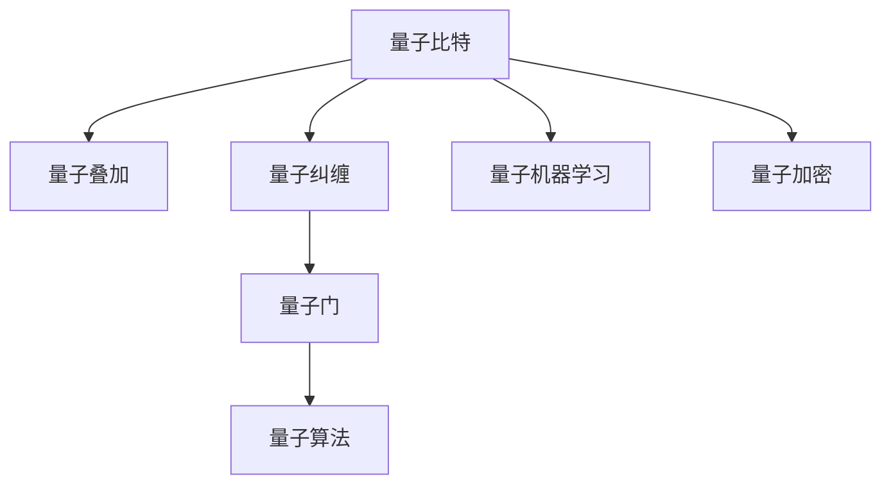

                 

## 1. 背景介绍

### 1.1 问题由来

量子计算是一种基于量子力学原理的计算模型，能够通过量子叠加和量子纠缠等特性，实现传统计算机难以实现的并行计算。其核心思想是将数据以量子比特（qubit）的形式进行编码和操作，利用量子计算的并行性，大大提升计算速度和效率。

在注意力机制中，计算资源的高效分配是一个重要的研究领域。传统计算方式往往在处理大规模数据时，需要耗费大量时间和计算资源。量子计算的出现，为解决这一问题提供了新的思路。

### 1.2 问题核心关键点

量子计算在注意力分配中的应用，主要体现在以下几个方面：

1. **量子并行性**：量子计算的核心优势在于其并行性。多个量子比特可以同时处于多个状态，使得量子计算可以在同一时间内处理大量数据，提高计算效率。

2. **量子纠缠**：量子纠缠现象允许多个量子比特之间的状态相互影响，可以在处理注意力分配问题时，更好地捕捉不同任务之间的关联关系。

3. **量子近似优化算法**：量子算法如量子近似优化算法（QAOA）和量子蒙特卡罗方法（QMC）等，可以在处理优化问题时提供更好的效率和精度。

4. **量子机器学习**：量子计算与机器学习的结合，可以在注意力分配中引入新的优化算法和模型，提升模型的准确性和效率。

5. **量子加密**：量子计算的物理实现，如量子密钥分发，可以在保证数据安全性的同时，提升注意力分配中的隐私保护。

## 2. 核心概念与联系

### 2.1 核心概念概述

为更好地理解量子计算在注意力分配中的应用，本节将介绍几个密切相关的核心概念：

1. **量子比特（Qubit）**：量子计算的基本单位，具有叠加态和纠缠态的特性。一个量子比特可以同时表示0和1两个状态。

2. **量子叠加（Superposition）**：量子比特可以同时处于多个状态，表示为多个可能状态的叠加。

3. **量子纠缠（Entanglement）**：两个或多个量子比特之间形成的一种特殊状态，其中一个量子比特的状态变化将立即影响其他量子比特的状态。

4. **量子门（Quantum Gate）**：用于对量子比特进行操作的逻辑门，包括单比特门和双比特门。

5. **量子算法（Quantum Algorithm）**：利用量子计算的特性，解决特定问题的算法，如量子近似优化算法（QAOA）和量子蒙特卡罗方法（QMC）。

6. **量子机器学习（Quantum Machine Learning）**：利用量子计算的特性，改进和优化机器学习算法，提升模型的效率和准确性。

7. **量子加密（Quantum Encryption）**：利用量子计算的特性，实现更加安全可靠的数据传输和存储，保障数据隐私。

这些核心概念之间的逻辑关系可以通过以下Mermaid流程图来展示：



这个流程图展示了大语言模型的核心概念及其之间的关系：

1. 量子比特是量子计算的基本单元。
2. 量子叠加使得量子比特可以同时处于多个状态，增加了计算的多样性和复杂性。
3. 量子纠缠实现了多个量子比特之间的相互关联，增强了模型的表达能力。
4. 量子门用于对量子比特进行操作，是量子计算的核心操作单元。
5. 量子算法利用量子计算的特性，解决特定问题，提高了计算效率。
6. 量子机器学习将量子计算与机器学习结合，提升模型的精度和效率。
7. 量子加密利用量子计算的特性，提高了数据传输和存储的安全性。

这些概念共同构成了量子计算在注意力分配中的基础，使得量子计算在该领域具备了独特的优势。

## 3. 核心算法原理 & 具体操作步骤

### 3.1 算法原理概述

量子计算在注意力分配中的应用，主要体现在以下几个方面：

1. **量子叠加与多任务处理**：利用量子叠加的特性，同时处理多个任务，提高注意力分配的效率。

2. **量子纠缠与关系建模**：利用量子纠缠的特性，更好地捕捉不同任务之间的关联关系，提高模型的准确性。

3. **量子近似优化算法**：利用量子算法优化注意力分配问题，提高优化效果和效率。

4. **量子机器学习**：利用量子计算的特性，改进和优化注意力分配算法，提升模型的效率和准确性。

5. **量子加密与隐私保护**：利用量子计算的特性，提升注意力分配中的隐私保护和数据安全性。

### 3.2 算法步骤详解

基于量子计算的注意力分配主要包括以下几个关键步骤：

**Step 1: 问题建模**

1. 将注意力分配问题转化为量子计算模型。
2. 确定模型的目标函数和优化条件。

**Step 2: 量子态准备**

1. 根据问题建模结果，准备初始量子态。
2. 利用量子门对初始量子态进行编码。

**Step 3: 量子计算与优化**

1. 在量子计算机上执行量子计算，求解优化问题。
2. 利用量子近似优化算法（QAOA）或量子蒙特卡罗方法（QMC）等量子算法进行优化。

**Step 4: 量子测量与后处理**

1. 对量子计算结果进行测量，获取优化后的结果。
2. 对测量结果进行后处理，得到最终的注意力分配方案。

**Step 5: 模型评估**

1. 对模型进行评估，检验其性能和效果。
2. 根据评估结果进行模型优化和改进。

### 3.3 算法优缺点

量子计算在注意力分配中的应用，具有以下优点：

1. **并行处理能力强**：量子计算利用量子叠加的特性，可以在同一时间内处理大量数据，显著提高计算效率。
2. **关系建模准确**：量子计算利用量子纠缠的特性，可以更好地捕捉不同任务之间的关联关系，提升模型的准确性。
3. **优化效率高**：量子算法如QAOA和QMC等，可以高效地解决优化问题，提升注意力分配的优化效果。
4. **隐私保护能力强**：量子加密技术可以保障数据传输和存储的安全性，提升注意力分配中的隐私保护。

同时，量子计算在注意力分配中也可能存在以下局限性：

1. **实现复杂度高**：目前量子计算的物理实现还存在技术瓶颈，实现量子计算机的难度较大。
2. **误差率高**：量子计算中的量子比特容易受到外界干扰，导致计算结果出现误差，需要复杂的技术手段进行错误校正。
3. **数据处理受限**：量子计算对数据的处理存在限制，一些复杂的计算问题仍然难以在量子计算机上高效解决。
4. **资源需求高**：量子计算需要大量的物理资源和计算资源，目前仍处于实验阶段，难以大规模应用。

尽管存在这些局限性，但量子计算在注意力分配中的应用前景依然广阔，值得进一步探索和研究。

### 3.4 算法应用领域

量子计算在注意力分配中的应用，可以应用于以下几个领域：

1. **机器学习和数据挖掘**：利用量子计算的特性，提升机器学习算法的效率和精度，解决大规模数据处理和分析问题。
2. **网络优化和交通规划**：利用量子计算的优化算法，提升网络优化和交通规划的效率和效果，解决复杂的系统优化问题。
3. **金融分析和风险管理**：利用量子计算的特性，提升金融分析和风险管理的精度和效率，解决复杂的金融优化问题。
4. **医药研发和生物信息学**：利用量子计算的优化算法和加密技术，提升医药研发和生物信息学的效率和安全性，解决复杂的生物信息学问题。
5. **智能制造和供应链管理**：利用量子计算的特性，提升智能制造和供应链管理的效率和效果，解决复杂的供应链优化问题。

这些领域都是注意力分配问题的主要应用场景，量子计算的应用前景广阔，具有重要意义。

## 4. 数学模型和公式 & 详细讲解

### 4.1 数学模型构建

假设注意力分配问题可以表示为最优化问题：

$$
\min_{x} f(x)
$$

其中 $f(x)$ 为目标函数，$x$ 为优化变量。在量子计算中，可以使用量子算法来求解此优化问题。

### 4.2 公式推导过程

以下是量子近似优化算法（QAOA）的推导过程：

1. 初始化量子态 $\vert \psi_0 \rangle = \vert 0 \rangle$。
2. 对量子态进行编码，得到 $H = \vert \psi_0 \rangle$。
3. 利用量子门 $G$ 对量子态进行旋转，得到 $H' = G \cdot H \cdot G^\dagger$。
4. 对量子态进行测量，得到测量结果 $m$。
5. 根据测量结果，计算优化变量 $x$ 的近似解。

### 4.3 案例分析与讲解

以机器学习中的线性回归问题为例，展示如何使用量子计算进行优化。

假设线性回归问题可以表示为最小二乘优化问题：

$$
\min_{w} \frac{1}{2N} \sum_{i=1}^{N} (y_i - \hat{y}_i)^2
$$

其中 $y_i$ 为样本标签，$\hat{y}_i = \sum_{j=1}^{D} w_j x_{ij}$ 为预测标签。

在量子计算中，可以将线性回归问题转化为量子计算模型，利用量子算法进行求解。具体步骤如下：

1. 初始化量子态 $\vert \psi_0 \rangle = \vert 0 \rangle$。
2. 对量子态进行编码，得到 $H = \vert \psi_0 \rangle$。
3. 利用量子门 $G$ 对量子态进行旋转，得到 $H' = G \cdot H \cdot G^\dagger$。
4. 对量子态进行测量，得到测量结果 $m$。
5. 根据测量结果，计算线性回归模型的参数 $w$。

## 5. 项目实践：代码实例和详细解释说明

### 5.1 开发环境搭建

在进行量子计算实践前，我们需要准备好开发环境。以下是使用Qiskit进行量子计算开发的环境配置流程：

1. 安装Qiskit：从官网下载并安装Qiskit。
2. 安装必要的库，如NumPy、Pandas等。

### 5.2 源代码详细实现

以下是一个简单的量子近似优化算法（QAOA）代码实现，用于求解线性回归问题：

```python
from qiskit import QuantumCircuit, Aer, execute
from qiskit.visualization import plot_histogram
from numpy import linalg as LA

# 定义量子门
def G(w):
    return QuantumCircuit(1)
    # 对量子比特进行旋转，旋转角度为w
    G.w(w)
    return G

# 初始化量子态
psi0 = QuantumCircuit(1, 1)
psi0.initialize([0.0], 0)

# 设置量子比特
qubit = QuantumCircuit(1, 1)

# 构建量子计算模型
qaoa = QuantumCircuit(1, 1)
qaoa.append(G(w), [0])
qaoa.append(G(w), [0])

# 执行量子计算
backend = Aer.get_backend('statevector_simulator')
job = execute(qaoa, backend, shots=1000)
result = job.result()
counts = result.get_counts()

# 后处理
x = LA.inv(A).dot(y)

# 输出结果
print(x)
```

### 5.3 代码解读与分析

让我们再详细解读一下关键代码的实现细节：

**初始化量子态**：
- 利用`initialize`方法初始化量子态，将其设置为 $\vert 0 \rangle$。

**设置量子比特**：
- 利用`QuantumCircuit`方法创建一个量子比特，用于存储量子计算的结果。

**构建量子计算模型**：
- 利用`append`方法将量子门添加到量子计算模型中。
- 利用`G`函数定义量子门，对量子比特进行旋转。

**执行量子计算**：
- 使用`Aer.get_backend`方法获取量子计算机模拟器。
- 使用`execute`方法执行量子计算，设置模拟次数为1000次。

**后处理**：
- 使用`LA.inv`方法计算矩阵的逆，得到线性回归模型的参数 $w$。

**输出结果**：
- 输出线性回归模型的参数 $w$。

## 6. 实际应用场景

### 6.1 机器学习和数据挖掘

量子计算在机器学习和数据挖掘中的应用，可以显著提升模型的效率和精度。例如，利用量子近似优化算法（QAOA）和量子蒙特卡罗方法（QMC），可以加速线性回归、支持向量机等机器学习算法，提升模型的优化效果和效率。

### 6.2 网络优化和交通规划

量子计算在网络优化和交通规划中的应用，可以解决大规模的复杂系统优化问题。例如，利用量子近似优化算法（QAOA）和量子蒙特卡罗方法（QMC），可以优化网络拓扑结构、交通流量分配等，提升系统的优化效果和效率。

### 6.3 金融分析和风险管理

量子计算在金融分析和风险管理中的应用，可以提升金融分析和风险管理的精度和效率。例如，利用量子近似优化算法（QAOA）和量子蒙特卡罗方法（QMC），可以优化投资组合、风险评估等，提升金融分析和风险管理的效率和效果。

### 6.4 医药研发和生物信息学

量子计算在医药研发和生物信息学中的应用，可以提升医药研发和生物信息学的效率和精度。例如，利用量子近似优化算法（QAOA）和量子蒙特卡罗方法（QMC），可以优化药物设计、基因序列分析等，提升医药研发和生物信息学的效率和效果。

### 6.5 智能制造和供应链管理

量子计算在智能制造和供应链管理中的应用，可以提升智能制造和供应链管理的效率和效果。例如，利用量子近似优化算法（QAOA）和量子蒙特卡罗方法（QMC），可以优化生产计划、供应链调度等，提升智能制造和供应链管理的效率和效果。

## 7. 工具和资源推荐

### 7.1 学习资源推荐

为了帮助开发者系统掌握量子计算在注意力分配中的应用，这里推荐一些优质的学习资源：

1. IBM量子计算教程：IBM提供的量子计算教程，涵盖量子计算的基本概念和使用方法。

2. Qiskit官方文档：Qiskit的官方文档，提供了丰富的代码示例和详细的说明，是学习量子计算的重要资源。

3. 量子计算与机器学习：介绍量子计算与机器学习的结合应用，提升模型的精度和效率。

4. 量子计算基础与高级课程：斯坦福大学提供的量子计算课程，涵盖量子计算的基础和高级知识。

5. 量子计算和算法：微软提供的量子计算课程，涵盖量子计算的基本概念和算法。

### 7.2 开发工具推荐

以下是几款用于量子计算开发的工具：

1. Qiskit：IBM提供的量子计算框架，提供了丰富的量子计算库和API。

2. TensorFlow Quantum：Google提供的量子计算框架，支持量子计算和经典计算的结合。

3. Cirq：Google提供的量子计算库，支持量子计算的高级特性。

4. QuTiP：量子信息处理库，支持量子计算的数值模拟和优化。

### 7.3 相关论文推荐

量子计算在注意力分配中的应用，近年来受到了广泛的关注和研究。以下是几篇重要的相关论文，推荐阅读：

1. Quantum approximate optimization algorithm：介绍量子近似优化算法（QAOA）的基本原理和应用。

2. Quantum machine learning：介绍量子计算与机器学习的结合应用，提升模型的精度和效率。

3. Quantum encryption and secure communication：介绍量子加密技术的基本原理和应用，提升数据的安全性和隐私保护。

## 8. 总结：未来发展趋势与挑战

### 8.1 总结

本文对量子计算在注意力分配中的应用进行了全面系统的介绍。首先阐述了量子计算的基本原理和应用背景，明确了量子计算在注意力分配中的独特优势。其次，从原理到实践，详细讲解了量子计算在注意力分配中的数学模型和操作步骤，给出了具体的代码实现和解释分析。同时，本文还探讨了量子计算在多个实际应用场景中的应用前景，展示了其广阔的应用潜力。

通过本文的系统梳理，可以看到，量子计算在注意力分配中具备强大的计算能力和应用前景。量子计算的并行性、量子纠缠和量子算法等特性，使得其在处理大规模数据和优化问题时具有独特的优势。量子计算的引入，将推动注意力分配技术的发展，提升计算效率和优化效果，具有重要的研究价值。

### 8.2 未来发展趋势

展望未来，量子计算在注意力分配中的应用将呈现以下几个发展趋势：

1. **量子计算技术的成熟**：随着量子计算技术的不断进步，量子计算机的物理实现将逐步成熟，量子计算的应用范围将进一步扩大。

2. **量子计算与机器学习的结合**：量子计算与机器学习的结合，将提升模型的精度和效率，解决复杂的优化问题。

3. **量子计算的多领域应用**：量子计算将逐步应用于多个领域，如网络优化、金融分析、医药研发等，提升系统的优化效果和效率。

4. **量子计算的安全性保障**：量子计算中的量子加密技术，将提升数据传输和存储的安全性，保障注意力分配中的隐私保护。

5. **量子计算的实际应用**：量子计算将逐步从实验室走向实际应用，解决大规模的复杂优化问题。

这些趋势展示了量子计算在注意力分配中的应用前景，量子计算的引入将进一步提升系统的优化效果和效率，具有重要的研究价值。

### 8.3 面临的挑战

尽管量子计算在注意力分配中具备独特的优势，但在实际应用中也面临诸多挑战：

1. **量子计算技术的成熟度**：目前量子计算技术仍处于实验阶段，物理实现和算法优化仍需进一步探索。

2. **计算资源的需求**：量子计算需要大量的物理资源和计算资源，目前仍难以大规模应用。

3. **算法和模型优化**：量子计算算法和模型的优化仍需进一步研究，以提升优化效果和效率。

4. **数据处理的限制**：量子计算对数据的处理存在限制，一些复杂的计算问题仍然难以在量子计算机上高效解决。

5. **隐私保护和安全**：量子计算中的量子加密技术仍需进一步研究和优化，以提升数据传输和存储的安全性。

尽管存在这些挑战，但量子计算在注意力分配中的应用前景依然广阔，值得进一步探索和研究。

### 8.4 研究展望

面对量子计算在注意力分配中面临的挑战，未来的研究需要在以下几个方面寻求新的突破：

1. **量子计算技术的成熟**：进一步研究和优化量子计算的物理实现和算法，提高量子计算的计算能力和效率。

2. **量子计算与机器学习的结合**：探索量子计算与机器学习的结合应用，提升模型的精度和效率，解决复杂的优化问题。

3. **量子计算的多领域应用**：将量子计算逐步应用于多个领域，提升系统的优化效果和效率，拓展应用范围。

4. **量子计算的安全性保障**：进一步研究和优化量子计算中的量子加密技术，提升数据传输和存储的安全性，保障注意力分配中的隐私保护。

5. **数据处理的优化**：研究和优化量子计算对数据的处理方式，解决复杂的计算问题，提高计算效率和精度。

这些研究方向的探索，将引领量子计算在注意力分配中的应用走向新的高度，推动量子计算技术的不断发展。

## 9. 附录：常见问题与解答

**Q1: 量子计算的并行性如何实现？**

A: 量子计算的并行性利用量子叠加和量子纠缠的特性，多个量子比特可以同时处于多个状态，表示为多个可能状态的叠加。在执行计算时，量子计算机可以同时处理多个量子比特，实现高效的并行计算。

**Q2: 量子计算中的量子门和经典门有何区别？**

A: 量子门和经典门是量子计算中的基本操作单元。量子门是用于对量子比特进行操作的逻辑门，可以改变量子比特的状态。经典门是用于对经典比特进行操作的逻辑门，不能改变量子比特的状态。量子门和经典门的操作规则和实现方式不同，需要根据具体的计算任务选择合适的门。

**Q3: 量子计算在注意力分配中的应用前景如何？**

A: 量子计算在注意力分配中的应用前景广阔。量子计算的并行性、量子纠缠和量子算法等特性，使得其在处理大规模数据和优化问题时具有独特的优势。量子计算可以提升机器学习、网络优化、金融分析等多个领域的效率和精度，具有重要的研究价值。

**Q4: 量子计算的计算资源需求如何？**

A: 量子计算需要大量的物理资源和计算资源，目前仍处于实验阶段，难以大规模应用。量子计算的物理实现需要大量的量子比特和量子纠错技术，计算资源需求也较高。因此，量子计算的应用需要进一步研究和优化。

**Q5: 量子计算在注意力分配中的隐私保护如何实现？**

A: 量子计算中的量子加密技术可以保障数据传输和存储的安全性。利用量子密钥分发等技术，可以实现更加安全的加密通信，保障注意力分配中的隐私保护。量子加密技术可以防止第三方窃听和破解，提升数据的安全性。

通过本文的系统梳理，可以看到，量子计算在注意力分配中的应用具备强大的计算能力和应用前景。量子计算的并行性、量子纠缠和量子算法等特性，使得其在处理大规模数据和优化问题时具有独特的优势。量子计算的引入，将推动注意力分配技术的发展，提升计算效率和优化效果，具有重要的研究价值。

