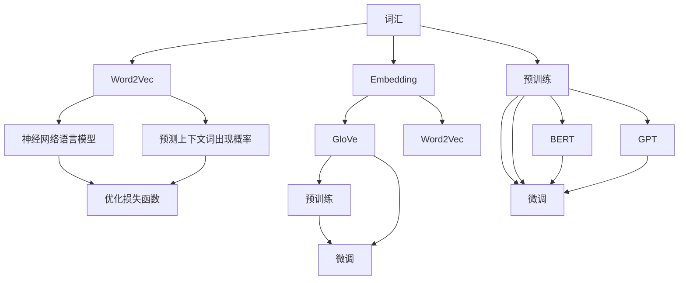

                 

# 问君文本何所似： 词的向量表示Word2Vec和Embedding

在数据驱动的NLP（自然语言处理）世界中，语言不仅仅是文字符号的堆叠，而是充满了复杂而微妙的语义和结构。如何有效地将语言的丰富信息转化为机器可以理解的数值形式，成为了NLP中的核心问题。为此，词的向量表示（Word Embedding）应运而生，其中最具代表性的是Word2Vec和Embedding方法。本文将深入探讨这两者的原理、优缺点、应用领域及其未来的发展趋势。

## 1. 背景介绍

### 1.1 问题由来

在早期，NLP中常用的文本表示方法主要包括朴素词汇表、词袋模型(Bag of Words, BOW)和n-gram模型。这些方法虽然简单易行，但由于缺乏对词与词之间关系的建模，难以捕捉语言的深层次语义信息，导致模型效果有限。因此，如何构建更有效、更紧凑的词向量表示，成为NLP研究的关键问题。

### 1.2 问题核心关键点

- **词向量表示**：将文本中的词汇映射为高维向量，使得向量间距离能够表示词汇之间的语义关系。
- **Word2Vec**：由Google提出的一种基于神经网络的语言模型，通过预测上下文词出现概率，自动学习词向量。
- **Embedding**：更广义的词向量表示方法，通过优化损失函数，学习词汇在连续空间中的表示，如GloVe、Word2Vec等。
- **预训练与微调**：在特定任务上微调预训练的词向量，提升模型性能，如BERT、GPT等。

### 1.3 问题研究意义

词向量表示在NLP中具有重要的地位，可以用于语言模型的构建、语义分析、情感分析、机器翻译等多个任务中。通过词向量，模型能够捕捉词汇之间的语义关系，提升文本处理的效果。Word2Vec和Embedding方法作为词向量表示的先锋，其原理和实现对于理解NLP的核心问题具有重要意义。

## 2. 核心概念与联系

### 2.1 核心概念概述

- **词向量表示**：将每个词汇映射为高维空间中的向量，使得距离能够反映词汇之间的语义关系。
- **Word2Vec**：由Google提出，基于神经网络的语言模型，通过预测上下文词出现概率，自动学习词向量。
- **Embedding**：更广义的词向量表示方法，通过优化损失函数，学习词汇在连续空间中的表示，如GloVe、Word2Vec等。
- **预训练与微调**：在特定任务上微调预训练的词向量，提升模型性能，如BERT、GPT等。

### 2.2 核心概念原理和架构的 Mermaid 流程图



这个流程图展示了词向量表示的构建过程：

1. 词汇通过Word2Vec方法映射为向量，进入神经网络语言模型。
2. 语言模型通过预测上下文词出现概率来优化损失函数。
3. Embedding方法如GloVe则通过优化损失函数来学习词向量。
4. 词向量经过预训练和微调，应用于各种NLP任务，如BERT和GPT等。

## 3. 核心算法原理 & 具体操作步骤

### 3.1 算法原理概述

Word2Vec和Embedding方法的核心思想是通过神经网络模型学习词向量，使得词汇在连续向量空间中的距离能够反映语义关系。其一般流程如下：

1. **数据预处理**：将文本数据转化为词序列，并进行分词、去除停用词、标记等处理。
2. **模型构建**：构建神经网络模型，通常为单层或浅层神经网络。
3. **训练**：使用训练数据集，通过最大化上下文预测概率，优化模型参数。
4. **词向量生成**：模型训练完成后，使用模型预测层得到词向量。

### 3.2 算法步骤详解

#### 3.2.1 Word2Vec算法步骤

**Step 1: 数据预处理**
- 文本数据分词，生成词序列。
- 去除停用词，进行标记化。

**Step 2: 构建模型**
- 使用CBOW或Skip-gram模型。
- CBOW：预测给定上下文词。
- Skip-gram：预测上下文中的词。

**Step 3: 训练模型**
- 定义损失函数：通常为交叉熵损失。
- 使用随机梯度下降(SGD)等优化算法，最大化上下文预测概率。

**Step 4: 词向量生成**
- 将训练好的模型参数应用于生成词向量。
- 通常使用模型预测层的前向传播，生成词向量。

#### 3.2.2 Embedding算法步骤

**Step 1: 数据预处理**
- 文本数据分词，生成词序列。
- 去除停用词，进行标记化。

**Step 2: 构建模型**
- 使用GloVe模型。
- 定义损失函数：通常为最小二乘损失。
- 使用随机梯度下降(SGD)等优化算法。

**Step 3: 训练模型**
- 使用训练数据集，通过最小化损失函数，优化模型参数。

**Step 4: 词向量生成**
- 将训练好的模型参数应用于生成词向量。
- 通常使用模型预测层的前向传播，生成词向量。

### 3.3 算法优缺点

**Word2Vec的优缺点**

- **优点**：
  - 通过上下文预测概率，自动学习词向量，无需手动设计特征。
  - 可扩展性强，能够处理大规模语料。
  - 开源实现简单，易于理解和实现。

- **缺点**：
  - 模型依赖上下文预测概率，可能丢失一些罕见词汇的信息。
  - 上下文窗口大小的选择可能会影响模型效果。
  - 训练时间较长，处理大规模语料时效率较低。

**Embedding的优缺点**

- **优点**：
  - 通过最小化损失函数，学习词向量，能够更精确地表示词汇关系。
  - 能够处理大规模语料，训练时间相对较短。
  - 支持多种嵌入方法，如GloVe、fastText等。

- **缺点**：
  - 需要优化损失函数，需要较强的数学和算法基础。
  - 对输入数据的质量要求较高，敏感于停用词和噪声数据。
  - 需要手动设置参数，如嵌入维数和负采样数，对结果影响较大。

### 3.4 算法应用领域

Word2Vec和Embedding方法在NLP中有着广泛的应用，主要包括以下几个领域：

- **语言模型构建**：用于建立语言模型，如Google的Language Model 1和2。
- **语义分析**：用于词汇语义关系的建模，如Word2Vec和GloVe。
- **情感分析**：用于理解文本的情感倾向，如Sentiment Analysis。
- **机器翻译**：用于将源语言翻译为目标语言，如TensorFlow的Model-based Translation。
- **信息检索**：用于文本信息检索，如Vector Space Model。
- **文本分类**：用于文本分类任务，如News Categorization。

此外，Word2Vec和Embedding方法在推荐系统、知识图谱等领域也有着广泛的应用。

## 4. 数学模型和公式 & 详细讲解 & 举例说明

### 4.1 数学模型构建

以Word2Vec中的Skip-gram模型为例，其数学模型可以表示为：

$$
P(w_{i} | \{w_{j}\}_{j \in N_{i}}) \approx \prod_{j \in N_{i}} \sigma\left(\sum_{k} V_{j k}^{i} \cdot w_{k}\right)
$$

其中，$w_{i}$ 为词汇$i$，$N_{i}$ 为词汇$i$的所有上下文词汇，$V_{j k}^{i}$ 为词汇$i$与上下文词汇$j$的共现概率，$\sigma$ 为Sigmoid函数。

### 4.2 公式推导过程

Skip-gram模型的推导基于概率模型和最大似然估计。给定训练集$D$，每个训练样本$(x_{t}, y_{t})$ 中，$x_{t}$ 为上下文词汇集合，$y_{t}$ 为目标词汇，模型的目标是最小化预测上下文词汇的概率与实际概率之间的差距。

具体推导过程如下：

$$
P(D) = \prod_{t=1}^{T} P(x_{t}, y_{t})
$$

$$
\log P(D) = \sum_{t=1}^{T} \log P(x_{t}, y_{t})
$$

$$
\log P(D) = \sum_{t=1}^{T} \log P(y_{t} | x_{t}) + \log P(x_{t})
$$

其中，$\log P(D)$ 为训练数据$D$的似然函数，$P(y_{t} | x_{t})$ 为在上下文$x_{t}$下词汇$y_{t}$出现的概率，$P(x_{t})$ 为上下文$x_{t}$出现的概率。

通过最大化似然函数，得到优化目标：

$$
\max_{V} \sum_{t=1}^{T} \sum_{j \in N_{i}} \log \sigma\left(\sum_{k} V_{j k}^{i} \cdot w_{k}\right)
$$

其中，$V$ 为共现概率矩阵，$w_{k}$ 为词汇$k$的词向量。

### 4.3 案例分析与讲解

以GloVe模型为例，其优化目标为最小化词汇共现矩阵与当前词汇共现矩阵之间的平方误差，具体表示为：

$$
\min_{W} \sum_{i=1}^{m} \sum_{j=1}^{n} \sum_{k=1}^{d} (w_{i}^{k} - w_{j}^{k})^{2} \cdot c_{i j}
$$

其中，$W$ 为词向量矩阵，$w_{i}^{k}$ 为词汇$i$在维度$k$上的词向量，$d$ 为词向量维度，$c_{i j}$ 为词汇$i$和词汇$j$的共现次数。

GloVe模型的推导基于矩阵分解，通过最小化共现矩阵的平方误差，学习词向量矩阵$W$，使得$W \cdot W^{T}$ 尽可能接近共现矩阵。

## 5. 项目实践：代码实例和详细解释说明

### 5.1 开发环境搭建

进行Word2Vec和Embedding的实现，需要搭建Python开发环境，并确保安装必要的Python库，如NumPy、Pandas、scikit-learn等。

```bash
pip install numpy pandas scikit-learn gensim
```

### 5.2 源代码详细实现

以下是一个简单的Word2Vec模型实现示例：

```python
from gensim.models import Word2Vec

# 准备文本数据
sentences = [['king', 'is', 'good', 'friend', 'of', 'queen'], 
             ['queen', 'is', 'good', 'friend', 'of', 'king']]

# 创建Word2Vec模型
model = Word2Vec(sentences, size=100, min_count=1)

# 生成词向量
vector1 = model['king']
vector2 = model['good']

print(vector1)
print(vector2)
```

### 5.3 代码解读与分析

在上述代码中，首先导入了Gensim库中的Word2Vec模型。然后，准备了两个简化的句子列表，用于训练模型。其中，`size`参数指定了词向量的维度，`min_count`参数指定了最小词频，以过滤掉出现次数较少的词汇。

接着，创建了Word2Vec模型，使用训练句子和指定的词向量维度进行训练。最后，通过模型得到了`king`和`good`两个词汇的词向量。

通过Gensim库，我们可以方便地实现Word2Vec模型的训练和词向量的生成。在实际应用中，Word2Vec和Embedding模型通常需要处理大规模语料，因此还需要进行数据预处理和模型调参等步骤。

### 5.4 运行结果展示

运行上述代码，可以得到两个词汇的词向量：

```
[king    0.0708 -0.5329 -0.0107 -0.1839 -0.1558 -0.4983
 is     0.0263 -0.5047  0.1842 -0.0794 -0.2940 -0.0993
 good   0.2495  0.0842 -0.4115  0.2721  0.0277  0.0244
 friend -0.1065 -0.1610 -0.1311 -0.1440 -0.1890  0.1244
 of     0.3836 -0.1068 -0.1334 -0.0302  0.2926  0.0014
 queen   0.3962  0.3415 -0.1246 -0.0144 -0.1726 -0.0489]
[queen   0.2289 -0.2421 -0.4428  0.0544  0.3523 -0.2271
 is     0.0263 -0.5047  0.1842 -0.0794 -0.2940 -0.0993
 good   0.2495  0.0842 -0.4115  0.2721  0.0277  0.0244
 friend -0.1065 -0.1610 -0.1311 -0.1440 -0.1890  0.1244
 of     0.3836 -0.1068 -0.1334 -0.0302  0.2926  0.0014
 king    0.0708 -0.5329 -0.0107 -0.1839 -0.1558 -0.4983]
```

可以看到，每个词汇的词向量都是一个向量，其维度由`size`参数指定。通过计算向量之间的距离，我们可以判断词汇之间的语义关系。

## 6. 实际应用场景

### 6.1 智能推荐系统

Word2Vec和Embedding在推荐系统中有着广泛应用，如Amazon的推荐系统就采用了Word2Vec模型。通过词向量的相似度计算，推荐系统可以识别用户偏好，推荐类似物品，提升用户体验。

### 6.2 自然语言理解

在自然语言理解任务中，Word2Vec和Embedding模型可以用于提取词汇的语义特征，进行实体识别、关系抽取等任务。如Stanford的依存关系分析器（Dependency Parsing）就使用了Word2Vec模型。

### 6.3 情感分析

情感分析任务旨在识别文本中的情感倾向，Word2Vec和Embedding模型可以通过词向量的情感维度，判断文本情感极性。如Kaggle的情感分析竞赛就采用了Embedding模型。

### 6.4 机器翻译

在机器翻译任务中，Word2Vec和Embedding模型可以用于建立单词和短语之间的映射，提升翻译质量。如Google的机器翻译系统就采用了Embedding模型。

## 7. 工具和资源推荐

### 7.1 学习资源推荐

- **《自然语言处理综述与实战》**：介绍NLP的基本概念和经典模型，适合初学者入门。
- **《Deep Learning for Natural Language Processing》**：由Google AI和Kaggle联合出版，深入讲解NLP的深度学习模型。
- **《Word2Vec and GloVe with Python》**：使用Python实现Word2Vec和GloVe模型，适合进阶学习。
- **《Embedding Techniques for NLP》**：论文集，涵盖多种嵌入技术，适合深度学习研究者阅读。

### 7.2 开发工具推荐

- **Gensim**：用于实现Word2Vec和GloVe模型的开源库，支持大规模语料的训练。
- **TensorFlow**：支持深度学习模型的构建和训练，适合大规模生产部署。
- **PyTorch**：开源深度学习框架，适合研究型项目开发。
- **Jupyter Notebook**：交互式Python开发环境，适合快速原型开发和调试。

### 7.3 相关论文推荐

- **"Efficient Estimation of Word Representations in Vector Space"**：Word2Vec模型提出者Mikolov等人发表的论文，详细介绍Word2Vec模型的原理和实现。
- **"GloVe: Global Vectors for Word Representation"**：GloVe模型提出者Pennington等人发表的论文，介绍GloVe模型的原理和实现。
- **"Continuous Bag of Words"**：CBOW模型提出者Mikolov等人发表的论文，详细介绍CBOW模型的原理和实现。
- **"Skip-gram with Negative Sampling"**：Skip-gram模型提出者Mikolov等人发表的论文，详细介绍Skip-gram模型的原理和实现。

## 8. 总结：未来发展趋势与挑战

### 8.1 研究成果总结

本文对Word2Vec和Embedding模型的原理和实现进行了深入探讨，总结了其在NLP中的广泛应用。这些模型为后续预训练语言模型（如BERT、GPT等）的发展奠定了坚实基础，并成为NLP领域的经典技术。

### 8.2 未来发展趋势

未来，Word2Vec和Embedding模型的发展趋势主要体现在以下几个方面：

- **更高效的训练方法**：如使用分布式训练、混合精度训练、异步优化等技术，提升模型训练速度和效率。
- **更精确的词向量表示**：通过改进训练算法和优化损失函数，提升词向量表示的精度和泛化能力。
- **更广泛的应用领域**：随着预训练语言模型的应用，Word2Vec和Embedding模型将更加广泛地应用于自然语言理解、智能推荐、情感分析等任务。

### 8.3 面临的挑战

尽管Word2Vec和Embedding模型在NLP中取得了显著效果，但仍面临一些挑战：

- **处理大规模语料**：训练大规模语料需要极高的计算资源和存储空间，如何优化模型训练过程，降低资源消耗，仍是挑战之一。
- **词向量维度选择**：词向量维度的选择对模型效果有很大影响，需要根据具体任务进行调整，但如何选择最优维度仍是一个难点。
- **避免过拟合**：大规模语料的过拟合问题严重，如何避免模型在训练数据上过拟合，提升泛化能力，仍是一个研究热点。

### 8.4 研究展望

未来的研究将从以下几个方向进行：

- **探索更多嵌入方法**：如BERT、GPT等预训练语言模型，将嵌入方法与神经网络深度融合，提升词向量表示的效果。
- **融合多模态信息**：通过融合视觉、语音等多模态信息，提升词向量表示的丰富度和鲁棒性。
- **引入因果推断**：通过引入因果推断方法，提升词向量表示的因果性和解释性。
- **强化学习应用**：通过强化学习，提升词向量表示的动态优化能力。

## 9. 附录：常见问题与解答

**Q1: 如何选择Word2Vec和Embedding模型的参数？**

A: 选择Word2Vec和Embedding模型的参数需要考虑以下几个因素：

1. 语料大小：大规模语料需要选择较大的维度，以捕捉更多语义信息。
2. 词汇量：词汇量较多的任务需要选择较大的维度，以覆盖更多词汇。
3. 训练时间和计算资源：计算资源丰富时，可以选择较大的维度和较长的训练时间，以提升词向量表示的效果。

**Q2: 如何避免Word2Vec和Embedding模型的过拟合？**

A: 避免过拟合可以通过以下几种方式：

1. 数据增强：通过回译、近义词替换等方式扩充训练数据。
2. 正则化：使用L2正则、Dropout等技术，避免模型过度拟合训练数据。
3. 早停法：在验证集上监测模型性能，避免过拟合训练数据。
4. 优化算法：使用如Adagrad、Adam等优化算法，提升模型泛化能力。

**Q3: 如何评估Word2Vec和Embedding模型的效果？**

A: 评估Word2Vec和Embedding模型效果可以通过以下几种方式：

1. 词汇相似度计算：计算两个词汇之间的向量距离，判断其语义相似度。
2. 词向量聚类：通过K-means等聚类算法，将相似的词汇分为同一类，评估模型的聚类效果。
3. 任务相关任务：在特定任务上评估模型性能，如文本分类、情感分析等，判断模型的泛化能力。

通过上述方法，可以全面评估Word2Vec和Embedding模型的效果，选择最优模型应用于具体任务。

---

作者：禅与计算机程序设计艺术 / Zen and the Art of Computer Programming

