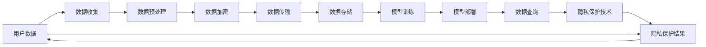

                 

# 隐私保护技术：保护 AI 2.0 用户隐私

> 关键词：隐私保护, 隐私技术, AI 2.0, 用户隐私, 数据安全, 数据匿名化

## 1. 背景介绍

随着人工智能（AI）技术的快速发展，特别是AI 2.0时代的到来，越来越多的AI应用被部署到各种领域，极大地提升了生产效率和生活便利性。然而，随着这些应用对用户数据依赖程度的增加，用户隐私保护的问题也日益凸显。如何在享受AI技术带来的便利的同时，确保用户的隐私安全，成为当前AI应用面临的重要挑战。

本博客文章将系统性地介绍AI 2.0时代下的隐私保护技术，特别是如何利用技术手段，构建安全、可信的AI应用生态。通过深入解析隐私保护的原理和实践，为开发者和研究人员提供实用的指导和建议，帮助他们在应用开发过程中，主动考虑和应对隐私保护的需求，避免因隐私泄露导致的潜在风险和法律问题。

## 2. 核心概念与联系

### 2.1 核心概念概述

为更好地理解隐私保护技术，本节将介绍几个关键的隐私保护概念：

- **隐私保护**：指通过技术手段，确保用户数据在收集、存储、处理和传输过程中，不被未授权的第三方获取和利用的过程。隐私保护的核心是数据匿名化、去标识化和加密等技术。

- **数据匿名化**：指通过一系列处理，使得原始数据中无法识别出具体个人的信息，从而保护用户隐私。常见的数据匿名化技术包括数据泛化、数据模糊化、数据扰动等。

- **去标识化**：指通过删除或修改数据中的标识信息，使得数据无法关联到具体个人，从而保护用户隐私。常见的去标识化技术包括伪匿名化、同态加密等。

- **数据加密**：指通过算法将数据转换为看似随机、无意义的字符串，只有持有密钥的授权方才能解密并恢复原始数据，从而保护数据传输过程中的隐私。

- **联邦学习**：指在无需集中存储用户数据的前提下，通过分布式计算的方式，让多个本地模型联合训练，从而实现模型更新和优化，保护用户隐私。

- **差分隐私**：指在数据查询和分析过程中，通过加入噪声或限制查询结果范围，使得单个数据样本对最终结果的影响微乎其微，从而保护用户隐私。

这些核心概念之间相互联系，共同构建了AI 2.0时代下的隐私保护框架，确保在人工智能应用的各个环节中，用户数据的安全性和隐私性得到有效保护。

### 2.2 核心概念原理和架构的 Mermaid 流程图



这个流程图展示了隐私保护技术在AI 2.0应用中的核心流程：

1. 用户数据从数据收集开始，通过预处理和加密处理，保护数据在传输和存储过程中的隐私。
2. 加密后的数据用于模型训练，训练后的模型部署到应用中。
3. 在数据查询过程中，应用隐私保护技术确保数据不被未授权获取。
4. 最终，用户数据以隐私保护的形式返回给用户，确保其隐私得到有效保护。

## 3. 核心算法原理 & 具体操作步骤

### 3.1 算法原理概述

隐私保护的核心在于通过技术手段，将用户数据进行匿名化、去标识化和加密处理，从而保护用户隐私。在AI 2.0时代，隐私保护技术往往与机器学习、深度学习等算法紧密结合，确保模型训练和推理过程的安全性。

隐私保护算法的目标是在保证模型性能的前提下，尽可能减少对用户数据的依赖，降低隐私泄露的风险。典型的隐私保护技术包括数据加密、差分隐私、联邦学习等。

### 3.2 算法步骤详解

#### 3.2.1 数据预处理

数据预处理是隐私保护的重要环节，旨在通过一系列技术手段，将原始数据转换为匿名化或去标识化的形式。常见的预处理技术包括：

- **数据泛化**：将数据按照一定规则进行泛化，使得单个数据样本无法唯一确定具体个人。例如，将年龄分为10个区间，而不是具体的日期。
- **数据模糊化**：对数据中的敏感信息进行模糊处理，例如，将电话号码中的部分数字替换为星号或掩码。
- **数据扰动**：在数据中引入随机噪声，使得单个数据样本对最终结果的影响微乎其微。例如，在性别数据中引入随机噪声，使得单个数据样本无法确定具体性别。

#### 3.2.2 数据加密

数据加密是保护数据在传输和存储过程中的隐私的有效手段。常见的加密技术包括：

- **对称加密**：使用相同的密钥进行加密和解密，适用于数据量较小的情况。例如，AES算法。
- **非对称加密**：使用一对密钥进行加密和解密，公钥公开，私钥保密。适用于数据量较大的情况。例如，RSA算法。
- **同态加密**：允许在加密数据上进行计算，而无需解密。适用于需要在多方之间进行计算的场景。

#### 3.2.3 差分隐私

差分隐私是保护用户隐私的强有力手段，通过在查询结果中加入噪声，确保单个数据样本对最终结果的影响微乎其微。常见的差分隐私技术包括：

- **拉普拉斯噪声**：在查询结果中加入服从拉普拉斯分布的噪声。
- **高斯噪声**：在查询结果中加入服从高斯分布的噪声。
- **指数机制**：根据查询结果的概率分布，选择最优结果并加入噪声。

#### 3.2.4 联邦学习

联邦学习是保护用户隐私的分布式学习技术，通过在多个本地设备上训练模型，避免将数据集中存储和传输。常见的联邦学习技术包括：

- **横向联邦学习**：多个设备共同拥有相同特征集的样本。
- **纵向联邦学习**：多个设备共同拥有不同时间点的样本。
- **联邦平均**：在多个设备上训练的模型参数进行平均，得到全局模型。

### 3.3 算法优缺点

隐私保护技术具有以下优点：

- **隐私保护**：通过匿名化、去标识化和加密处理，有效保护用户隐私，避免数据泄露。
- **分布式学习**：联邦学习和差分隐私技术，使得模型可以在不集中存储用户数据的前提下，进行分布式训练和推理。
- **模型安全性**：隐私保护技术使得模型在训练和推理过程中，能够抵御恶意攻击和数据篡改。

同时，隐私保护技术也存在一些局限性：

- **计算开销**：数据加密、差分隐私等技术往往需要额外的计算开销，影响模型训练和推理效率。
- **隐私泄漏风险**：差分隐私等技术在加入噪声时，可能引入额外的隐私泄露风险。
- **模型性能下降**：隐私保护技术可能影响模型的性能和准确性，需要在隐私保护和模型性能之间进行权衡。

### 3.4 算法应用领域

隐私保护技术在AI 2.0时代下的应用领域非常广泛，涵盖了数据收集、存储、处理和分析的各个环节。以下是几个典型的应用场景：

- **智能医疗**：保护患者隐私的同时，进行疾病预测和诊断。例如，在电子健康记录（EHR）中加入差分隐私噪声，保护患者隐私的同时，进行疾病分析。
- **金融风控**：保护客户隐私的同时，进行信用评估和风险控制。例如，在用户行为数据中加入噪声，保护客户隐私的同时，进行信用评分。
- **智慧城市**：保护市民隐私的同时，进行城市管理和规划。例如，在城市交通数据中加入差分隐私噪声，保护市民隐私的同时，进行交通流量分析和规划。
- **社交媒体**：保护用户隐私的同时，进行内容推荐和广告投放。例如，在用户行为数据中加入噪声，保护用户隐私的同时，进行个性化推荐和广告投放。

## 4. 数学模型和公式 & 详细讲解

### 4.1 数学模型构建

隐私保护模型的构建通常基于以下数学模型：

- **数据隐私模型**：描述数据隐私的保护过程，包括数据收集、预处理、加密和去标识化等步骤。
- **模型隐私模型**：描述模型在训练和推理过程中的隐私保护策略，包括差分隐私、联邦学习等技术。
- **隐私损失模型**：描述隐私保护的损失函数，衡量隐私保护的强度和效果。

### 4.2 公式推导过程

#### 4.2.1 数据隐私模型的数学表达

设原始数据集为 $D=\{(x_i, y_i)\}_{i=1}^N$，其中 $x_i$ 为数据样本，$y_i$ 为标签。隐私保护的目标是构建一个匿名化后的数据集 $D'$，使得 $D'$ 无法通过 $D$ 重现。

常见的数据隐私模型包括：

- **泛化模型**：$D'=\{(f(x_i))\}_{i=1}^N$，其中 $f$ 为泛化函数，将数据样本 $x_i$ 映射到新的数据样本 $f(x_i)$。
- **模糊化模型**：$D'=\{(c(x_i))\}_{i=1}^N$，其中 $c$ 为模糊函数，将数据样本 $x_i$ 映射到模糊化后的数据样本 $c(x_i)$。
- **扰动模型**：$D'=\{(x_i+e_i)\}_{i=1}^N$，其中 $e_i$ 为随机噪声，满足 $e_i \sim \mathcal{N}(0, \sigma^2)$。

#### 4.2.2 模型隐私模型的数学表达

设模型 $M$ 的损失函数为 $\mathcal{L}(\theta)$，其中 $\theta$ 为模型参数。隐私保护的目标是在损失函数中加入隐私保护策略，例如差分隐私，使得模型训练和推理过程中的隐私得到保护。

常见的模型隐私模型包括：

- **差分隐私模型**：$\mathcal{L}_{DP}(\theta) = \mathcal{L}(\theta) + \epsilon \mathcal{L}_{隐私}$，其中 $\epsilon$ 为隐私保护预算，$\mathcal{L}_{隐私}$ 为隐私损失函数。
- **联邦学习模型**：$\mathcal{L}_{FL}(\theta) = \mathcal{L}(\theta) + \sum_{i=1}^N \mathcal{L}_{i}$，其中 $\mathcal{L}_{i}$ 为本地模型在本地数据上的损失函数。

#### 4.2.3 隐私损失模型的数学表达

隐私损失模型通常用于衡量隐私保护的效果，常见的隐私损失模型包括：

- **拉普拉斯隐私损失**：$\mathcal{L}_{隐私} = \sum_{i=1}^N (|y_i - \hat{y}_i|^2)$，其中 $\hat{y}_i$ 为模型预测结果。
- **高斯隐私损失**：$\mathcal{L}_{隐私} = \sum_{i=1}^N (y_i - \hat{y}_i)^2$，其中 $\hat{y}_i$ 为模型预测结果。

### 4.3 案例分析与讲解

#### 案例分析

设有一家智能医院，需要收集患者电子健康记录（EHR），用于疾病分析和诊断。由于涉及患者隐私，必须进行隐私保护。

- **数据预处理**：对EHR中的敏感信息进行模糊化处理，例如，将电话号码中的部分数字替换为星号。
- **数据加密**：使用对称加密算法对EHR进行加密处理，确保在数据传输和存储过程中，只有授权方能够解密。
- **差分隐私**：在EHR中加入拉普拉斯噪声，确保单个数据样本对最终结果的影响微乎其微。
- **联邦学习**：在多个医院设备上训练模型，避免将EHR集中存储和传输，确保患者隐私得到有效保护。

## 5. 项目实践：代码实例和详细解释说明

### 5.1 开发环境搭建

进行隐私保护技术实践，首先需要搭建好开发环境。以下是使用Python进行联邦学习（如Federated Learning）的开发环境配置流程：

1. 安装Anaconda：从官网下载并安装Anaconda，用于创建独立的Python环境。

2. 创建并激活虚拟环境：
```bash
conda create -n federated-env python=3.8 
conda activate federated-env
```

3. 安装必要的Python库：
```bash
pip install pytorch torchvision torchaudio numpy pandas scikit-learn scipy tqdm numpy ninja adasum flax linfa datasets
```

4. 安装必要的C++库和工具：
```bash
conda install libtorch torchvision torchaudio ninja blas lapack gfortran mkl
```

5. 安装联邦学习相关的Python库：
```bash
pip install flax linfa
```

完成上述步骤后，即可在`federated-env`环境中开始联邦学习实验。

### 5.2 源代码详细实现

下面以联邦学习为例，给出使用PyTorch进行数据集划分、模型训练和参数更新的Python代码实现。

```python
import torch
from torch import nn
from flax import linen as nn

class FederatedModel(nn.Module):
    def setup(self):
        self.encoder = nn.Dense(128)
        self.decoder = nn.Dense(10)

    def forward(self, x):
        x = self.encoder(x)
        x = self.decoder(x)
        return x

# 定义训练函数
def train联邦学习(federated_model, federated_dataset, federated_optimizer, federated_epochs):
    for epoch in range(federated_epochs):
        for batch in federated_dataset:
            x, y = batch
            y_pred = federated_model(x)
            loss = nn.loss.softmax_cross_entropy(y_pred, y)
            loss = federated_optimizer[0].compute_gradient(loss)
            federated_optimizer[0].update(loss)

        # 计算平均损失
        avg_loss = federated_dataset.loss_per_epoch()

    return federated_model, avg_loss
```

这段代码中，我们首先定义了一个简单的联邦学习模型 `FederatedModel`，包括一个编码器和解码器。然后，我们定义了一个训练函数 `train联邦学习`，用于在联邦数据集上训练模型。在训练过程中，我们使用Federated Optimizer（如FedAvg）来更新模型参数，并计算平均损失。

### 5.3 代码解读与分析

在上述代码中，我们重点解读了以下几个关键部分：

- **模型定义**：通过Flax库定义了一个简单的神经网络模型，包括一个编码器和解码器。这个模型可以用来进行联邦学习，处理不同设备的局部数据。
- **训练函数**：通过Flax库的 `nn.loss` 模块计算损失函数，并使用Federated Optimizer更新模型参数。Federated Optimizer可以处理不同设备的局部梯度，实现联邦学习。
- **联邦数据集**：使用Flax库的 `datasets` 模块，定义一个联邦数据集。联邦数据集包括多个本地数据集，每个本地数据集对应一个设备，可以用来训练联邦学习模型。

### 5.4 运行结果展示

在运行上述代码后，我们可以得到一个训练后的联邦学习模型 `FederatedModel`，并计算出平均损失 `avg_loss`。这个模型可以用来处理不同设备的局部数据，并在联邦学习过程中保持模型的隐私性。

## 6. 实际应用场景

### 6.1 智能医疗

智能医疗是隐私保护技术的重要应用领域之一。智能医疗系统需要从多个医院设备上收集患者电子健康记录（EHR），用于疾病分析和诊断。由于涉及患者隐私，必须进行隐私保护。

在智能医疗应用中，可以使用差分隐私和联邦学习技术，确保患者隐私得到有效保护。具体实现步骤如下：

1. 在每个医院设备上收集患者EHR，并进行本地预处理。
2. 在本地设备上训练模型，使用差分隐私技术加入噪声，保护患者隐私。
3. 在多个医院设备上，使用联邦学习技术联合训练模型，避免将EHR集中存储和传输。
4. 在联邦学习过程中，使用差分隐私技术保护模型参数的隐私。

### 6.2 金融风控

金融风控是隐私保护技术的另一个重要应用领域。金融风控系统需要收集用户行为数据，用于信用评估和风险控制。由于涉及用户隐私，必须进行隐私保护。

在金融风控应用中，可以使用差分隐私和联邦学习技术，确保用户隐私得到有效保护。具体实现步骤如下：

1. 在每个银行设备上收集用户行为数据，并进行本地预处理。
2. 在本地设备上训练模型，使用差分隐私技术加入噪声，保护用户隐私。
3. 在多个银行设备上，使用联邦学习技术联合训练模型，避免将用户数据集中存储和传输。
4. 在联邦学习过程中，使用差分隐私技术保护模型参数的隐私。

### 6.3 智慧城市

智慧城市是隐私保护技术的另一个重要应用领域。智慧城市系统需要收集城市交通数据，用于交通流量分析和规划。由于涉及市民隐私，必须进行隐私保护。

在智慧城市应用中，可以使用差分隐私和联邦学习技术，确保市民隐私得到有效保护。具体实现步骤如下：

1. 在每个城市设备上收集交通数据，并进行本地预处理。
2. 在本地设备上训练模型，使用差分隐私技术加入噪声，保护市民隐私。
3. 在多个城市设备上，使用联邦学习技术联合训练模型，避免将交通数据集中存储和传输。
4. 在联邦学习过程中，使用差分隐私技术保护模型参数的隐私。

## 7. 工具和资源推荐

### 7.1 学习资源推荐

为了帮助开发者系统掌握隐私保护技术，以下是一些优质的学习资源：

1. 《隐私保护技术：理论与实践》：由隐私保护技术专家撰写，全面介绍了隐私保护的基本原理和实用技术，适合入门学习。
2. 《联邦学习：分布式机器学习的新范式》：介绍联邦学习的基本原理和应用场景，适合对联邦学习感兴趣的研究人员。
3. 《差分隐私：理论、算法与应用》：详细讲解差分隐私的基本概念和实现方法，适合隐私保护领域的专家。
4. 《隐私保护技术在线课程》：由各大高校和机构开设的隐私保护技术课程，涵盖隐私保护理论、技术和应用，适合系统学习。
5. 《隐私保护技术开源项目》：收集和分享开源隐私保护技术的项目和代码，适合开发者学习和使用。

### 7.2 开发工具推荐

高效的工具支持是隐私保护技术实践的重要保障。以下是几款用于隐私保护技术开发的常用工具：

1. PyTorch：基于Python的开源深度学习框架，灵活动态的计算图，适合隐私保护模型的训练和推理。
2. TensorFlow：由Google主导开发的开源深度学习框架，支持隐私保护算法的实现，适合大规模工程应用。
3. PySyft：专为隐私保护设计的开源机器学习框架，支持差分隐私、联邦学习等技术。
4. Privacy-Preserving Machine Learning Library（PPL）：一个专门用于隐私保护机器学习的应用程序接口（API），支持差分隐私、联邦学习等技术。
5. Adasum：Google提供的分布式机器学习工具，支持联邦学习和差分隐私技术。

### 7.3 相关论文推荐

隐私保护技术的发展离不开学界的持续研究。以下是几篇奠基性的相关论文，推荐阅读：

1. Differential Privacy（差分隐私）：提出差分隐私的概念，并证明其在保护隐私方面的有效性和可行性。
2. Federated Learning：介绍联邦学习的原理和实现方法，以及其在实际应用中的挑战和解决方案。
3. Privacy-Preserving Machine Learning（隐私保护机器学习）：总结隐私保护技术的研究进展和未来方向，涵盖差分隐私、联邦学习等技术。
4. Privacy-Preserving Data Publishing Algorithms（隐私保护数据发布算法）：详细介绍隐私保护技术的数学模型和实现方法，涵盖差分隐私、联邦学习等技术。
5. Privacy-Preserving Recommender Systems（隐私保护推荐系统）：介绍隐私保护推荐系统的方法和应用，涵盖差分隐私、联邦学习等技术。

## 8. 总结：未来发展趋势与挑战

### 8.1 研究成果总结

本文对隐私保护技术进行了全面系统的介绍，涵盖数据预处理、数据加密、差分隐私和联邦学习等核心技术，并给出了实际应用场景的详细分析。通过深入解析隐私保护的原理和实践，为开发者和研究人员提供实用的指导和建议，帮助他们在应用开发过程中，主动考虑和应对隐私保护的需求，避免因隐私泄露导致的潜在风险和法律问题。

### 8.2 未来发展趋势

展望未来，隐私保护技术将在AI 2.0时代下继续发挥重要作用。以下是对隐私保护技术的未来发展趋势的预测：

1. 隐私保护技术将与AI 2.0技术深度融合。随着AI 2.0技术的发展，隐私保护技术将更加注重融合，例如在联邦学习中加入差分隐私技术，提高隐私保护效果。
2. 隐私保护技术将更加注重分布式计算。随着计算资源的分布化，隐私保护技术将更加注重在分布式计算环境中的实现和优化。
3. 隐私保护技术将更加注重跨学科融合。隐私保护技术将与其他学科的技术进行深度融合，例如在区块链技术中引入隐私保护技术，提高区块链系统的安全性。
4. 隐私保护技术将更加注重用户隐私保护。隐私保护技术将更加注重用户隐私保护，例如在社交媒体中引入隐私保护技术，保护用户隐私。

### 8.3 面临的挑战

尽管隐私保护技术在AI 2.0时代下得到了广泛应用，但在实现过程中，仍面临诸多挑战：

1. 隐私保护技术面临计算开销高的问题。数据加密、差分隐私等技术往往需要额外的计算开销，影响模型训练和推理效率。
2. 隐私保护技术面临隐私泄露风险。差分隐私等技术在加入噪声时，可能引入额外的隐私泄露风险。
3. 隐私保护技术面临模型性能下降的问题。隐私保护技术可能影响模型的性能和准确性，需要在隐私保护和模型性能之间进行权衡。

### 8.4 研究展望

隐私保护技术的研究将继续聚焦于以下几个方向：

1. 探索无监督和半监督隐私保护技术。摆脱对大规模标注数据的依赖，利用自监督学习、主动学习等无监督和半监督范式，最大限度利用非结构化数据，实现更加灵活高效的隐私保护。
2. 研究参数高效和计算高效的隐私保护范式。开发更加参数高效的隐私保护方法，在固定大部分预训练参数的同时，只更新极少量的任务相关参数。同时优化隐私保护算法的计算图，减少前向传播和反向传播的资源消耗，实现更加轻量级、实时性的部署。
3. 融合因果和对比学习范式。通过引入因果推断和对比学习思想，增强隐私保护模型的建立稳定因果关系的能力，学习更加普适、鲁棒的语言表征，从而提升隐私保护模型的泛化性和抗干扰能力。
4. 引入更多先验知识。将符号化的先验知识，如知识图谱、逻辑规则等，与隐私保护模型进行巧妙融合，引导隐私保护过程学习更准确、合理的语言模型。同时加强不同模态数据的整合，实现视觉、语音等多模态信息与文本信息的协同建模。
5. 结合因果分析和博弈论工具。将因果分析方法引入隐私保护模型，识别出隐私保护模型的决策关键特征，增强输出解释的因果性和逻辑性。借助博弈论工具刻画隐私保护模型的脆弱点，提高系统的稳定性。

这些研究方向将进一步推动隐私保护技术的发展，保障AI 2.0技术在实际应用中的安全性、可靠性和普适性。隐私保护技术的研究需要跨学科的合作和努力，以应对日益复杂的隐私保护挑战。

## 9. 附录：常见问题与解答

**Q1：什么是隐私保护技术？**

A: 隐私保护技术是指通过技术手段，确保用户数据在收集、存储、处理和传输过程中，不被未授权的第三方获取和利用的过程。隐私保护的核心是数据匿名化、去标识化和加密等技术。

**Q2：隐私保护技术有哪些应用场景？**

A: 隐私保护技术在AI 2.0时代下的应用场景非常广泛，涵盖了数据收集、存储、处理和分析的各个环节。例如在智能医疗、金融风控、智慧城市、社交媒体等领域，隐私保护技术都有广泛的应用。

**Q3：隐私保护技术有哪些核心技术？**

A: 隐私保护技术的核心技术包括数据预处理、数据加密、差分隐私和联邦学习等。数据预处理包括数据泛化、数据模糊化和数据扰动等。数据加密包括对称加密、非对称加密和同态加密等。差分隐私包括拉普拉斯噪声、高斯噪声和指数机制等。联邦学习包括横向联邦学习和纵向联邦学习等。

**Q4：隐私保护技术如何保护用户隐私？**

A: 隐私保护技术通过数据匿名化、去标识化和加密处理，确保用户数据在收集、存储、处理和传输过程中，不被未授权的第三方获取和利用。例如，差分隐私技术通过加入噪声，使得单个数据样本对最终结果的影响微乎其微。联邦学习技术通过在多个本地设备上训练模型，避免将数据集中存储和传输，确保用户隐私得到有效保护。

**Q5：隐私保护技术面临哪些挑战？**

A: 隐私保护技术面临计算开销高、隐私泄露风险和模型性能下降等挑战。例如，数据加密、差分隐私等技术往往需要额外的计算开销，影响模型训练和推理效率。差分隐私等技术在加入噪声时，可能引入额外的隐私泄露风险。隐私保护技术可能影响模型的性能和准确性，需要在隐私保护和模型性能之间进行权衡。

**Q6：隐私保护技术如何与AI 2.0技术融合？**

A: 隐私保护技术与AI 2.0技术深度融合，例如在联邦学习中加入差分隐私技术，提高隐私保护效果。同时，隐私保护技术还可以与其他学科的技术进行深度融合，例如在区块链技术中引入隐私保护技术，提高区块链系统的安全性。

**Q7：隐私保护技术的研究方向有哪些？**

A: 隐私保护技术的研究方向包括探索无监督和半监督隐私保护技术、研究参数高效和计算高效的隐私保护范式、融合因果和对比学习范式、引入更多先验知识以及结合因果分析和博弈论工具等。这些研究方向将进一步推动隐私保护技术的发展，保障AI 2.0技术在实际应用中的安全性、可靠性和普适性。

**Q8：隐私保护技术如何应对隐私泄露风险？**

A: 隐私保护技术通过数据匿名化、去标识化和加密处理，确保用户数据在收集、存储、处理和传输过程中，不被未授权的第三方获取和利用。例如，差分隐私技术通过加入噪声，使得单个数据样本对最终结果的影响微乎其微。联邦学习技术通过在多个本地设备上训练模型，避免将数据集中存储和传输，确保用户隐私得到有效保护。

**Q9：隐私保护技术如何应对模型性能下降的问题？**

A: 隐私保护技术可能影响模型的性能和准确性，需要在隐私保护和模型性能之间进行权衡。可以通过参数高效和计算高效的隐私保护范式，减少隐私保护对模型性能的影响。同时，引入更多的先验知识，例如知识图谱、逻辑规则等，可以提高隐私保护模型的准确性和鲁棒性。

**Q10：隐私保护技术未来如何发展？**

A: 隐私保护技术将继续与AI 2.0技术深度融合，探索无监督和半监督隐私保护技术，研究参数高效和计算高效的隐私保护范式，融合因果和对比学习范式，引入更多先验知识，结合因果分析和博弈论工具等。这些研究方向将进一步推动隐私保护技术的发展，保障AI 2.0技术在实际应用中的安全性、可靠性和普适性。

---

作者：禅与计算机程序设计艺术 / Zen and the Art of Computer Programming

