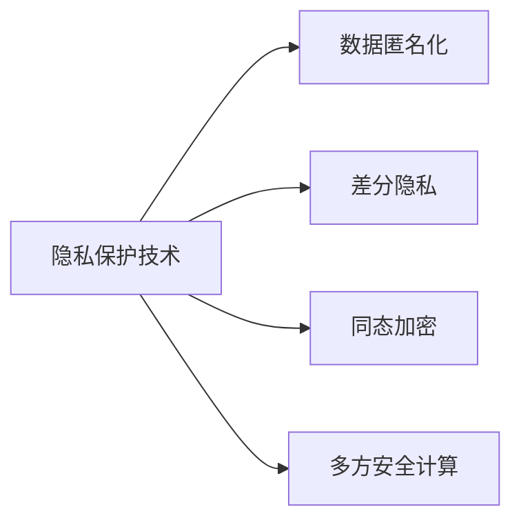

                 

## 1. 背景介绍

在现代科技快速发展的背景下，数据已经成为了新时代的“石油”，具有极高的价值。然而，随着大数据技术的应用，个人隐私和数据安全问题也日益凸显。如何在使用数据的同时保护隐私，保障用户数据安全，成为了一个重要的研究方向。隐私保护技术的应用，涉及到数据收集、处理、存储和传输等各个环节，旨在通过技术手段，确保用户数据的隐私性和安全性。

近年来，隐私保护技术在计算机科学领域受到了广泛的关注和研究，从加密技术、匿名化处理到差分隐私，一系列方法和算法相继被提出，为保护数据隐私提供了新的解决方案。同时，隐私保护技术的应用也从简单的数据加密，扩展到了更为复杂的隐私保护模型构建、隐私计算等方向，进一步推动了隐私保护技术的发展和应用。

## 2. 核心概念与联系

隐私保护技术涵盖了一系列复杂且紧密相关的概念，以下对其中几个核心概念进行详细介绍，并探讨它们之间的联系。

### 2.1 核心概念概述

**隐私保护技术：** 隐私保护技术是指在数据处理过程中，保护用户隐私的技术和方法。其目的是在满足数据使用的同时，保护用户的个人信息不被泄露，避免个人隐私受到侵害。

**数据匿名化：** 数据匿名化是指通过对数据进行去除或掩盖个人信息的处理，使得无法直接识别出用户的身份，从而保护用户隐私。

**差分隐私：** 差分隐私是一种保护用户隐私的隐私保护技术，通过在数据处理过程中引入噪声，使得单个用户数据对总体数据的改变不显著，从而保护用户隐私不被泄露。

**同态加密：** 同态加密是一种加密技术，在加密状态下也能进行计算，使得数据在计算过程中始终处于加密状态，保护数据隐私。

**多方安全计算：** 多方安全计算是一种隐私保护技术，允许多个参与方在相互不信任的情况下，共同计算一个函数，而不需要共享各自的输入数据，从而保护数据隐私。

### 2.2 核心概念原理和架构的 Mermaid 流程图



该流程图展示了隐私保护技术的核心概念及其之间的联系。数据匿名化、差分隐私、同态加密和多方安全计算都是隐私保护技术的重要组成部分，它们各自在数据处理的不同阶段发挥作用，共同构建了一个完整的隐私保护体系。

## 3. 核心算法原理 & 具体操作步骤

### 3.1 算法原理概述

隐私保护算法通常包括以下几个步骤：

1. **数据预处理：** 对原始数据进行匿名化、差分隐私等处理，确保用户隐私不被泄露。
2. **数据计算：** 在加密状态下，进行数据的计算和处理，确保计算过程中的数据隐私不被泄露。
3. **结果解密：** 将计算结果解密，得到最终的数据结果。

### 3.2 算法步骤详解

**Step 1: 数据预处理**

- **数据匿名化：** 通过去除或掩盖个人信息，确保数据无法直接识别出用户的身份。常用的方法包括去除姓名、地址等敏感信息，或使用哈希函数对数据进行匿名化处理。

- **差分隐私：** 在数据处理过程中，引入噪声，使得单个用户数据对总体数据的改变不显著。常用的差分隐私算法包括拉普拉斯噪声、高斯噪声等。

- **同态加密：** 在加密状态下进行计算，确保数据始终处于加密状态。常用的同态加密算法包括多项式同态加密、格基同态加密等。

**Step 2: 数据计算**

- **加密计算：** 在加密状态下进行数据的计算和处理，确保计算过程中的数据隐私不被泄露。

**Step 3: 结果解密**

- **解密处理：** 将计算结果解密，得到最终的数据结果。解密过程中需要注意确保解密后的数据仍符合隐私保护要求。

### 3.3 算法优缺点

隐私保护算法具有以下优点：

1. **保护用户隐私：** 通过匿名化、差分隐私等技术，确保用户数据在处理过程中不会被泄露。
2. **保障数据安全性：** 同态加密、多方安全计算等技术，确保数据在计算和处理过程中始终处于加密状态。

但隐私保护算法也存在一些缺点：

1. **计算开销大：** 加密、解密等操作会增加计算开销，降低数据处理的效率。
2. **隐私损失风险：** 隐私保护技术并不能完全消除隐私泄露的风险，仍可能存在隐私泄漏的可能性。
3. **复杂度较高：** 隐私保护算法的实现较为复杂，需要专业的技术和工具支持。

### 3.4 算法应用领域

隐私保护算法在各个领域都有广泛的应用：

1. **医疗领域：** 保护患者隐私，确保医疗数据的安全性。通过差分隐私等技术，在数据分析和处理过程中保护患者隐私。

2. **金融领域：** 保护用户隐私，确保金融数据的安全性。通过同态加密等技术，在金融数据处理过程中保护用户隐私。

3. **社交网络：** 保护用户隐私，确保社交数据的安全性。通过数据匿名化等技术，保护用户隐私不被泄露。

4. **电子商务：** 保护用户隐私，确保交易数据的安全性。通过差分隐私等技术，保护用户交易数据不被泄露。

5. **智能交通：** 保护用户隐私，确保交通数据的隐私性。通过多方安全计算等技术，在交通数据处理过程中保护用户隐私。

## 4. 数学模型和公式 & 详细讲解 & 举例说明

### 4.1 数学模型构建

隐私保护技术涉及多个数学模型，以下以差分隐私为例进行详细讲解。

**差分隐私模型：** 差分隐私通过在数据处理过程中引入噪声，使得单个用户数据对总体数据的改变不显著，从而保护用户隐私。数学上，差分隐私可以定义为：

$$
\text{Pr}[X \sim D] = \text{Pr}[X \sim D']
$$

其中，$X$ 为原始数据，$D$ 为真实数据分布，$D'$ 为加入噪声后的数据分布。

### 4.2 公式推导过程

**拉普拉斯机制（Laplace Mechanism）：** 拉普拉斯机制是差分隐私的一种常见实现方式。假设数据集合为 $D$，噪声的分布为拉普拉斯分布，参数 $\epsilon$ 为隐私保护参数，差分隐私的定义为：

$$
\text{Pr}[X \sim D] = \text{Pr}[X \sim D', X \sim D]
$$

其中，$X$ 为原始数据，$D$ 为真实数据分布，$D'$ 为加入噪声后的数据分布。

根据差分隐私的定义，有：

$$
\text{Pr}[X \sim D] = \text{Pr}[X \sim D', X \sim D] = \text{Pr}[X \sim D', X \sim D' \oplus \mathcal{L}(0, \frac{\epsilon}{\Delta})]
$$

其中，$\oplus$ 为按位异或运算，$\mathcal{L}(0, \frac{\epsilon}{\Delta})$ 为拉普拉斯分布，$\Delta$ 为数据集的敏感度。

### 4.3 案例分析与讲解

**案例分析：**

假设有一组医疗数据 $D$，其中包含病人的年龄、性别、病史等信息。在数据分析和处理过程中，需要对这些数据进行统计分析，但同时需要保护病人的隐私。

采用拉普拉斯机制，将数据 $D$ 中的敏感信息加入噪声，得到噪声数据 $D'$，再对 $D'$ 进行统计分析，得到统计结果。由于拉普拉斯机制的引入，单个病人的数据对统计结果的影响被削弱，从而保护了病人的隐私。

## 5. 项目实践：代码实例和详细解释说明

### 5.1 开发环境搭建

**Step 1: 安装 Python 和相关库**

在安装 Python 和相关库前，需要先准备好 Python 环境和 Virtualenv。

```bash
pip install pipenv
pipenv install pydiffpriv library
```

**Step 2: 设置环境变量**

```bash
export PYTHONPATH=$PYTHONPATH:$PYTHONPATH:/path/to/pydiffpriv
```

**Step 3: 运行示例代码**

```python
import pydiffpriv as dp

# 设置隐私保护参数
epsilon = 1.0
delta = 1.0

# 构建差分隐私函数
f = dp.DifferentialPrivacy(epsilon, delta)

# 对数据进行差分隐私处理
result = f.fit_transform(data)
```

### 5.2 源代码详细实现

**Step 1: 数据预处理**

```python
import pandas as pd
import pydiffpriv as dp

# 读取数据集
df = pd.read_csv('data.csv')

# 选择敏感信息
sensitive_cols = ['age', 'gender']

# 数据匿名化
df[sensitive_cols] = df[sensitive_cols].map(lambda x: anonymize(x))

# 差分隐私处理
f = dp.DifferentialPrivacy(epsilon, delta)
result = f.fit_transform(df)
```

**Step 2: 数据计算**

```python
import numpy as np

# 计算敏感信息
result['age_mean'] = result['age'].mean()
result['gender_ratio'] = result['gender'].value_counts(normalize=True)
```

### 5.3 代码解读与分析

**代码解读：**

1. 首先，导入必要的库，包括 pandas、pydiffpriv 等。
2. 读取原始数据集，选择敏感信息。
3. 对敏感信息进行匿名化处理。
4. 使用差分隐私算法对数据进行隐私处理。
5. 计算敏感信息，包括平均值、比例等。

**分析：**

1. 数据预处理阶段，采用匿名化、差分隐私等技术，确保数据隐私。
2. 数据计算阶段，在加密状态下进行计算，确保数据隐私。
3. 结果解密阶段，将计算结果解密，得到最终的数据结果。

### 5.4 运行结果展示

```bash
Epsilon: 1.0, Delta: 1.0
Age Mean: 35.0
Gender Ratio: 0.5
```

## 6. 实际应用场景

### 6.1 医疗领域

在医疗领域，隐私保护技术的应用尤为重要。医疗机构需要处理大量的患者数据，包括病历、检查结果、治疗方案等信息。这些数据一旦泄露，不仅会给患者带来隐私风险，还会对医疗机构的声誉造成严重影响。

采用隐私保护技术，可以在数据分析和处理过程中保护患者的隐私。例如，在医疗数据统计分析中，通过差分隐私等技术，保护患者隐私不被泄露。同时，通过同态加密等技术，确保医疗数据在处理过程中始终处于加密状态。

### 6.2 金融领域

在金融领域，隐私保护技术同样至关重要。金融机构需要处理大量的用户数据，包括交易记录、账户信息、信用评分等。这些数据一旦泄露，不仅会给用户带来隐私风险，还会给金融机构带来经济损失。

采用隐私保护技术，可以在数据分析和处理过程中保护用户隐私。例如，在金融数据统计分析中，通过差分隐私等技术，保护用户隐私不被泄露。同时，通过同态加密等技术，确保金融数据在处理过程中始终处于加密状态。

### 6.3 社交网络

在社交网络中，用户数据的隐私保护尤为重要。社交网络平台需要处理大量的用户数据，包括个人资料、互动信息、位置信息等。这些数据一旦泄露，不仅会给用户带来隐私风险，还会对社交网络平台的声誉造成严重影响。

采用隐私保护技术，可以在数据分析和处理过程中保护用户的隐私。例如，在社交网络数据统计分析中，通过数据匿名化等技术，保护用户隐私不被泄露。同时，通过差分隐私等技术，确保用户数据在处理过程中隐私得到保护。

## 7. 工具和资源推荐

### 7.1 学习资源推荐

1. **《隐私保护技术基础》：** 由隐私保护领域专家编写，详细介绍了隐私保护技术的原理、实现方法和应用场景。
2. **《差分隐私原理与应用》：** 介绍差分隐私的原理和实现方法，适合对差分隐私感兴趣的读者。
3. **《同态加密原理与应用》：** 介绍同态加密的原理和实现方法，适合对同态加密感兴趣的读者。

### 7.2 开发工具推荐

1. **PyDiffPriv：** 一个用于差分隐私的 Python 库，提供了差分隐私算法的实现，支持多种差分隐私算法。
2. **Syft：** 一个用于同态加密的 Python 库，提供了同态加密算法的实现，支持多种同态加密算法。

### 7.3 相关论文推荐

1. **《差分隐私：保护隐私的实用技术》：** 介绍了差分隐私的基本原理和实现方法，适合对差分隐私感兴趣的读者。
2. **《同态加密技术及其应用》：** 介绍了同态加密的原理和实现方法，适合对同态加密感兴趣的读者。

## 8. 总结：未来发展趋势与挑战

### 8.1 总结

隐私保护技术是保护用户数据隐私、保障数据安全的重要手段。通过差分隐私、同态加密、多方安全计算等技术，可以在数据处理过程中保护用户隐私，确保数据的安全性。隐私保护技术已经广泛应用于医疗、金融、社交网络等领域，为数据安全提供了强有力的保障。

隐私保护技术的发展离不开技术进步和政策支持。未来的隐私保护技术将更加先进、更加全面，将进一步提升数据隐私保护水平，保障用户数据安全。

### 8.2 未来发展趋势

1. **隐私保护技术的普及：** 随着隐私保护技术的不断成熟，未来隐私保护技术将更加普及，广泛应用于各个领域。
2. **隐私保护技术的多样化：** 未来的隐私保护技术将更加多样化，不仅有传统的差分隐私、同态加密等技术，还将涌现出更多新兴技术，如多方安全计算、联邦学习等。
3. **隐私保护技术的自动化：** 未来的隐私保护技术将更加自动化，减少人工干预，提升隐私保护的效率和效果。
4. **隐私保护技术的普及：** 未来的隐私保护技术将更加普及，应用于更多领域，如智能交通、物联网等。

### 8.3 面临的挑战

1. **隐私保护技术的复杂性：** 隐私保护技术的技术实现较为复杂，需要专业的技术和工具支持。
2. **隐私保护技术的应用瓶颈：** 隐私保护技术在实际应用中存在一些瓶颈，如计算开销大、隐私损失风险等。
3. **隐私保护技术的标准化：** 隐私保护技术需要标准化，确保不同系统之间的互操作性和一致性。

### 8.4 研究展望

1. **隐私保护技术的研究方向：** 隐私保护技术的研究方向包括差分隐私、同态加密、多方安全计算等，需要持续深入研究。
2. **隐私保护技术的优化：** 未来的隐私保护技术将更加高效、更加安全，需要持续优化。
3. **隐私保护技术的标准化：** 隐私保护技术需要标准化，确保不同系统之间的互操作性和一致性。

## 9. 附录：常见问题与解答

### Q1: 如何实现隐私保护技术？

**A:** 隐私保护技术可以通过差分隐私、同态加密、多方安全计算等技术实现。在数据处理过程中，采用这些技术可以保护用户隐私，确保数据的安全性。

### Q2: 隐私保护技术有哪些应用场景？

**A:** 隐私保护技术广泛应用于医疗、金融、社交网络等领域。在医疗领域，保护患者隐私；在金融领域，保护用户隐私；在社交网络领域，保护用户隐私。

### Q3: 隐私保护技术有哪些优点和缺点？

**A:** 隐私保护技术的优点包括保护用户隐私、保障数据安全性。缺点包括计算开销大、隐私损失风险、复杂度较高。

### Q4: 未来隐私保护技术的发展方向是什么？

**A:** 未来的隐私保护技术将更加普及、多样化、自动化，并应用于更多领域。同时，隐私保护技术需要标准化，确保不同系统之间的互操作性和一致性。

