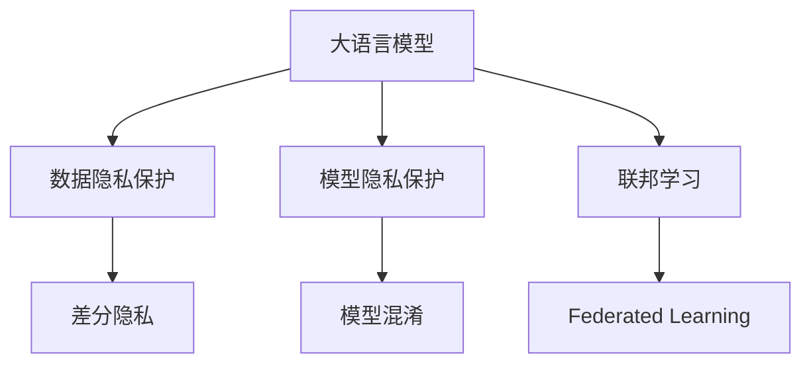

                 

## 1. 背景介绍

随着人工智能技术的发展，深度学习模型（尤其是大语言模型）在众多应用领域中展现出强大的潜力。然而，这些模型往往依赖大量的数据进行训练，而数据中可能包含敏感的个人信息，引发了严重的隐私保护问题。特别是在自然语言处理（Natural Language Processing, NLP）领域，用户生成的文本数据更是隐私风险的高发区。如何在利用深度学习模型进行NLP任务时保护用户隐私，成为当前研究的重点之一。

本文将聚焦于大语言模型（Large Language Model, LLM）的隐私保护问题，探讨如何在保证模型性能的同时，有效保护用户隐私，减少隐私泄露的风险。我们将首先介绍大语言模型的工作原理和隐私威胁，然后详细分析目前存在的隐私保护方法，最后给出未来的研究方向和挑战。

## 2. 核心概念与联系

### 2.1 核心概念概述

大语言模型是一种通过大规模无监督学习，构建具有强大语言理解和生成能力的人工智能模型。其典型代表包括GPT系列、BERT、RoBERTa等。这些模型通过学习大量文本数据，能够实现文本分类、文本生成、问答系统等NLP任务。

然而，大语言模型对隐私保护提出了严峻的挑战。训练大语言模型需要大量的文本数据，包括来自用户的个人信息、私人通信等，这些数据可能包含敏感的个人信息，如姓名、地址、健康状况等，一旦被滥用，将对用户隐私造成巨大威胁。

为了解决隐私保护问题，学术界和工业界已经提出了多种隐私保护方法。这些方法主要可以分为数据隐私保护、模型隐私保护和联邦学习等几种范式，下面将逐一介绍。

### 2.2 核心概念原理和架构的 Mermaid 流程图



这个流程图展示了大语言模型在隐私保护方面的主要研究方向：

1. **数据隐私保护**：通过数据脱敏、加密等方法，保护用户数据不被滥用。
2. **模型隐私保护**：通过修改模型结构或训练方法，防止模型泄露训练数据信息。
3. **联邦学习**：在不共享数据的情况下，通过分布式训练，保护用户隐私。

以下我们将对这些研究方向逐一进行详细介绍。

## 3. 核心算法原理 & 具体操作步骤

### 3.1 算法原理概述

大语言模型的隐私保护主要涉及两个方面：数据隐私保护和模型隐私保护。数据隐私保护旨在保护用户数据在收集、存储、传输过程中的隐私安全；模型隐私保护则通过保护模型的内部结构和参数，防止模型泄露用户隐私信息。

### 3.2 算法步骤详解

#### 3.2.1 数据隐私保护

数据隐私保护主要包括以下几个关键步骤：

1. **数据匿名化**：对原始数据进行匿名化处理，如去除标识性信息，使用伪匿名化方法（如k-匿名化、l-多样性等）保护用户身份。
2. **数据加密**：对敏感数据进行加密处理，防止数据在存储、传输过程中被窃取或篡改。常用的加密算法包括AES、RSA等。
3. **数据分割**：将数据分割成多个子集，分别用于不同的隐私保护方法，如模型训练、查询服务等。

#### 3.2.2 模型隐私保护

模型隐私保护主要通过以下几种方法实现：

1. **差分隐私**：在模型训练过程中，加入噪声扰动，确保每次查询和训练都不会泄露过多的个人隐私信息。
2. **模型混淆**：通过修改模型结构和参数，使得模型在相同输入下输出不同的结果，防止模型被反向推断训练数据。
3. **联邦学习**：在分布式环境中，通过分布式训练，保护数据隐私。

#### 3.2.3 联邦学习

联邦学习通过在多个节点上分布式训练模型，而不需要将数据传输到中心服务器，从而保护了数据的隐私。联邦学习主要包括以下几个步骤：

1. **模型分发**：将模型参数分发给各个节点。
2. **本地训练**：在各个节点上进行本地训练，更新模型参数。
3. **聚合更新**：在各个节点间进行模型参数的聚合更新，得到全局模型。

### 3.3 算法优缺点

#### 3.3.1 数据隐私保护的优缺点

**优点**：
- 数据匿名化、加密等方法能够有效保护用户数据，防止数据泄露。
- 数据分割方法可以防止单个数据集被滥用，提高数据安全。

**缺点**：
- 数据匿名化可能会影响数据的可用性和分析效果。
- 数据加密和解密操作会带来额外的计算开销。

#### 3.3.2 模型隐私保护的优缺点

**优点**：
- 差分隐私能够确保模型查询和训练不会泄露过多隐私信息。
- 模型混淆方法能够防止模型被反向推断训练数据。

**缺点**：
- 差分隐私可能会引入额外的噪声，影响模型性能。
- 模型混淆方法可能会导致模型精度下降。

#### 3.3.3 联邦学习的优缺点

**优点**：
- 联邦学习可以保护数据隐私，防止数据被集中存储和滥用。
- 分布式训练可以加快模型训练速度。

**缺点**：
- 模型参数的聚合更新可能会引入通信开销和计算开销。
- 模型分布式训练可能存在收敛性问题。

### 3.4 算法应用领域

大语言模型的隐私保护技术已经在多个领域得到应用，包括但不限于：

1. **医疗**：在医疗领域，大语言模型需要处理包含敏感医疗信息的文本数据。通过隐私保护技术，可以有效保护患者隐私。
2. **金融**：在金融领域，大语言模型需要处理包含用户财务信息的文本数据。通过隐私保护技术，可以有效保护用户财务隐私。
3. **社交媒体**：在社交媒体领域，大语言模型需要处理包含用户个人信息和社交关系的文本数据。通过隐私保护技术，可以有效保护用户隐私。
4. **政府**：在政府领域，大语言模型需要处理包含敏感政府信息的文本数据。通过隐私保护技术，可以有效保护政府信息安全。

## 4. 数学模型和公式 & 详细讲解 & 举例说明

### 4.1 数学模型构建

在大语言模型的隐私保护中，差分隐私是一种常用的方法。差分隐私通过在模型训练过程中加入噪声扰动，保护模型查询和训练的隐私。

差分隐私模型的数学定义为：对于任意两次查询，如果查询结果的差异不超过一个预定的值$\epsilon$，那么查询结果的概率差不超过$\delta$。即：

$$
\Pr[|f(x) - f(x')| \leq \Delta] \geq 1 - \delta
$$

其中，$f$ 表示查询函数，$x$ 和 $x'$ 表示输入数据，$\Delta$ 表示查询结果的差异，$\epsilon$ 和 $\delta$ 是差分隐私的参数。

### 4.2 公式推导过程

差分隐私的数学推导较为复杂，以下简单介绍其核心思想。

差分隐私的噪声扰动主要通过拉普拉斯分布实现。假设查询结果的差异为 $\Delta$，则加入拉普拉斯噪声的扰动项 $N$ 满足：

$$
N \sim \mathcal{L}(\Delta/\epsilon)
$$

其中，$\mathcal{L}(\Delta/\epsilon)$ 表示拉普拉斯分布，参数为 $\Delta/\epsilon$。

在实际应用中，可以通过调整 $\Delta$ 和 $\epsilon$ 来平衡查询结果的差异和隐私保护的程度。

### 4.3 案例分析与讲解

假设我们有一个简单的文本分类任务，使用大语言模型进行训练。在训练过程中，我们希望通过差分隐私保护用户隐私。

具体实现步骤如下：

1. **数据预处理**：对文本数据进行匿名化处理，去除标识性信息。
2. **模型训练**：在模型训练过程中，加入拉普拉斯噪声扰动，保护训练数据隐私。
3. **模型部署**：将训练好的模型部署到生产环境，进行用户查询。

在查询过程中，如果查询结果的差异超过一个预定的值，则返回一个随机值。这样可以确保查询结果的隐私安全。

## 5. 项目实践：代码实例和详细解释说明

### 5.1 开发环境搭建

要进行大语言模型的隐私保护实践，首先需要搭建开发环境。以下是使用Python进行PyTorch开发的环境配置流程：

1. 安装Anaconda：从官网下载并安装Anaconda，用于创建独立的Python环境。

2. 创建并激活虚拟环境：
```bash
conda create -n pytorch-env python=3.8 
conda activate pytorch-env
```

3. 安装PyTorch：根据CUDA版本，从官网获取对应的安装命令。例如：
```bash
conda install pytorch torchvision torchaudio cudatoolkit=11.1 -c pytorch -c conda-forge
```

4. 安装各类工具包：
```bash
pip install numpy pandas scikit-learn matplotlib tqdm jupyter notebook ipython
```

5. 安装差分隐私工具包：
```bash
pip install differential_privacy
```

完成上述步骤后，即可在`pytorch-env`环境中开始隐私保护实践。

### 5.2 源代码详细实现

以下是一个简单的基于差分隐私的文本分类模型的代码实现：

```python
import torch
import torch.nn as nn
from torch.utils.data import DataLoader
from differential_privacy import PrivacyEngine
from differential_privacy noise import LaplaceNoiseGenerator
from differential_privacy privacy import DifferentialPrivacy

class TextClassifier(nn.Module):
    def __init__(self, input_size, hidden_size, output_size):
        super(TextClassifier, self).__init__()
        self.hidden_layer = nn.Linear(input_size, hidden_size)
        self.output_layer = nn.Linear(hidden_size, output_size)

    def forward(self, x):
        x = self.hidden_layer(x)
        x = torch.sigmoid(x)
        x = self.output_layer(x)
        return x

def train_epoch(model, dataset, batch_size, optimizer, noise_generator):
    dataloader = DataLoader(dataset, batch_size=batch_size, shuffle=True)
    model.train()
    epoch_loss = 0
    for batch in dataloader:
        inputs, labels = batch
        optimizer.zero_grad()
        outputs = model(inputs)
        loss = nn.BCELoss()(outputs, labels)
        loss += noise_generator.add_noise(loss)
        loss.backward()
        optimizer.step()
        epoch_loss += loss.item()
    return epoch_loss / len(dataloader)

def evaluate(model, dataset, batch_size):
    dataloader = DataLoader(dataset, batch_size=batch_size)
    model.eval()
    correct = 0
    total = 0
    with torch.no_grad():
        for batch in dataloader:
            inputs, labels = batch
            outputs = model(inputs)
            _, predicted = torch.max(outputs, 1)
            total += labels.size(0)
            correct += (predicted == labels).sum().item()
    return correct / total

# 设置差分隐私参数
epsilon = 1e-6
delta = 0.1

# 创建差分隐私引擎
privacy_engine = PrivacyEngine(epsilon=epsilon, delta=delta)

# 创建拉普拉斯噪声生成器
noise_generator = LaplaceNoiseGenerator(epsilon=epsilon)

# 创建数据集
dataset = ...

# 创建模型
model = TextClassifier(input_size, hidden_size, output_size)

# 创建优化器
optimizer = torch.optim.Adam(model.parameters(), lr=0.001)

# 训练模型
for epoch in range(epochs):
    loss = train_epoch(model, dataset, batch_size, optimizer, noise_generator)
    print(f"Epoch {epoch+1}, train loss: {loss:.3f}")
    
    print(f"Epoch {epoch+1}, test accuracy: {evaluate(model, dataset, batch_size)}")
    
# 输出隐私保护参数
print(f"Privacy parameters: epsilon={epsilon}, delta={delta}")
```

在上述代码中，我们使用了PyTorch和Differential Privacy库来实现差分隐私保护。具体步骤如下：

1. **设置隐私参数**：定义差分隐私的 $\epsilon$ 和 $\delta$ 参数。
2. **创建差分隐私引擎**：使用Differential Privacy库创建隐私引擎。
3. **创建拉普拉斯噪声生成器**：使用LaplaceNoiseGenerator类创建噪声生成器。
4. **创建数据集**：加载文本分类数据集。
5. **创建模型**：创建文本分类模型。
6. **创建优化器**：创建Adam优化器。
7. **训练模型**：在每个epoch中，使用差分隐私保护训练模型。
8. **评估模型**：在测试集上评估模型性能。
9. **输出隐私保护参数**：输出差分隐私参数。

### 5.3 代码解读与分析

在上述代码中，我们详细介绍了差分隐私保护的基本实现步骤。以下是关键代码的解读：

- **设置隐私参数**：定义差分隐私的 $\epsilon$ 和 $\delta$ 参数，这些参数用于控制隐私保护的程度。
- **创建差分隐私引擎**：使用Differential Privacy库创建隐私引擎，并将其与模型关联。
- **创建拉普拉斯噪声生成器**：使用LaplaceNoiseGenerator类创建噪声生成器，用于在模型训练过程中加入噪声扰动。
- **创建数据集**：加载文本分类数据集，并将其作为模型的输入。
- **创建模型**：创建文本分类模型，并使用nn.Module定义模型结构。
- **创建优化器**：创建Adam优化器，用于更新模型参数。
- **训练模型**：在每个epoch中，使用差分隐私保护训练模型。在计算损失时，将拉普拉斯噪声扰动加入损失函数中。
- **评估模型**：在测试集上评估模型性能，计算分类准确率。
- **输出隐私保护参数**：输出差分隐私参数，供后续分析使用。

## 6. 实际应用场景

### 6.1 医疗数据隐私保护

在医疗领域，大语言模型需要处理包含敏感医疗信息的文本数据。例如，通过大语言模型进行疾病预测、病历分析等任务。这些任务需要大量的医疗文本数据作为训练样本。

为了保护医疗数据的隐私，可以采用以下措施：

1. **数据匿名化**：对医疗数据进行去标识化处理，去除患者姓名、地址等敏感信息。
2. **数据加密**：对医疗数据进行加密处理，防止数据在传输过程中被窃取或篡改。
3. **差分隐私**：在模型训练过程中加入噪声扰动，保护训练数据隐私。

### 6.2 金融数据隐私保护

在金融领域，大语言模型需要处理包含用户财务信息的文本数据。例如，通过大语言模型进行金融诈骗检测、信用评分预测等任务。这些任务需要大量的金融文本数据作为训练样本。

为了保护金融数据的隐私，可以采用以下措施：

1. **数据匿名化**：对金融数据进行去标识化处理，去除用户姓名、账户号码等敏感信息。
2. **数据加密**：对金融数据进行加密处理，防止数据在传输过程中被窃取或篡改。
3. **差分隐私**：在模型训练过程中加入噪声扰动，保护训练数据隐私。

### 6.3 社交媒体数据隐私保护

在社交媒体领域，大语言模型需要处理包含用户个人信息和社交关系的文本数据。例如，通过大语言模型进行社交情感分析、话题生成等任务。这些任务需要大量的社交媒体数据作为训练样本。

为了保护社交媒体数据的隐私，可以采用以下措施：

1. **数据匿名化**：对社交媒体数据进行去标识化处理，去除用户姓名、地点等敏感信息。
2. **数据加密**：对社交媒体数据进行加密处理，防止数据在传输过程中被窃取或篡改。
3. **差分隐私**：在模型训练过程中加入噪声扰动，保护训练数据隐私。

## 7. 工具和资源推荐

### 7.1 学习资源推荐

为了帮助开发者系统掌握大语言模型隐私保护的理论基础和实践技巧，以下是一些优质的学习资源：

1. **《数据隐私与机器学习》书籍**：介绍机器学习中的隐私保护问题，涵盖差分隐私、联邦学习等多种隐私保护技术。
2. **CS633《隐私保护技术》课程**：斯坦福大学开设的隐私保护课程，讲解隐私保护的核心概念和算法。
3. **Kaggle隐私保护竞赛**：Kaggle上的隐私保护竞赛，可以学习到隐私保护的实际应用案例和最佳实践。
4. **Differential Privacy官方文档**：Differential Privacy库的官方文档，提供详细的隐私保护方法和示例代码。
5. **联邦学习综述论文**：关于联邦学习的综述论文，介绍联邦学习的核心概念和实现方法。

### 7.2 开发工具推荐

进行大语言模型隐私保护的开发，需要使用一些专门的隐私保护工具。以下是几款推荐的工具：

1. **Differential Privacy**：一个用于实现差分隐私保护的开源库，支持多种隐私保护方法。
2. **Google Privacy Tools**：Google提供的隐私保护工具，包括差分隐私、联邦学习等。
3. **TensorFlow Privacy**：TensorFlow提供的隐私保护工具，支持差分隐私、联邦学习等多种隐私保护方法。
4. **Microsoft Privacy Guard**：微软提供的隐私保护工具，支持差分隐私、联邦学习等多种隐私保护方法。
5. **PySyft**：一个用于实现联邦学习的开源库，支持多轮联邦学习、差分隐私等隐私保护方法。

### 7.3 相关论文推荐

大语言模型隐私保护技术的发展得益于学界的持续研究。以下是几篇奠基性的相关论文，推荐阅读：

1. **《Differential Privacy: Privacy-Preserving Algorithms》**：差分隐私的经典论文，介绍差分隐私的核心概念和算法。
2. **《Secure Aggregation of Arbitrary Private Values》**：介绍联邦学习的核心算法和实现方法，是联邦学习的重要奠基性工作。
3. **《Anonymized multi-label learning in the presence of class imbalance and non-negative class constraints》**：介绍在数据匿名化场景下，如何保护模型隐私。
4. **《The Privacy Costs of Machine Learning Algorithms》**：讨论机器学习算法的隐私成本，并提出隐私保护策略。

## 8. 总结：未来发展趋势与挑战

### 8.1 研究成果总结

大语言模型的隐私保护技术已经取得了一些初步成果，主要包括：

1. **差分隐私**：通过在模型训练过程中加入噪声扰动，保护模型查询和训练的隐私。
2. **模型混淆**：通过修改模型结构和参数，防止模型被反向推断训练数据。
3. **联邦学习**：在分布式环境中，通过分布式训练，保护数据隐私。

这些技术在医疗、金融、社交媒体等领域得到了应用，保护了用户的隐私安全。

### 8.2 未来发展趋势

未来，大语言模型的隐私保护技术将继续发展，以下是一些可能的研究方向：

1. **多模态隐私保护**：保护多模态数据的隐私，如文本、图像、语音等。
2. **模型压缩与剪枝**：通过模型压缩和剪枝，减少模型参数，提高模型隐私保护的效率。
3. **差分隐私的优化**：优化差分隐私的参数设置，提高差分隐私的效果。
4. **联邦学习的高效聚合**：优化联邦学习的模型聚合算法，提高分布式训练的效率。
5. **隐私保护模型集成**：将多种隐私保护技术集成到模型中，提高隐私保护的全面性和安全性。

### 8.3 面临的挑战

尽管大语言模型的隐私保护技术已经取得了一些进展，但仍面临一些挑战：

1. **隐私保护的计算开销**：差分隐私和模型混淆等方法会增加计算开销，影响模型的训练速度和推理速度。
2. **隐私保护的参数调优**：差分隐私和模型混淆等方法需要调整多个参数，需要大量的实验和调试。
3. **隐私保护的跨领域应用**：不同领域的数据分布和隐私需求不同，需要针对性地设计隐私保护方法。
4. **隐私保护的透明性**：差分隐私等方法需要公开隐私保护参数，用户需要了解这些参数对隐私保护的影响。

### 8.4 研究展望

面对隐私保护技术的挑战，未来的研究需要在以下几个方面寻求新的突破：

1. **高效的隐私保护算法**：开发更加高效的隐私保护算法，减少计算开销，提高隐私保护的效果。
2. **自适应的隐私保护策略**：开发自适应的隐私保护策略，根据数据分布和隐私需求自动调整隐私保护参数。
3. **跨领域的隐私保护方法**：设计跨领域的隐私保护方法，适应不同领域的数据分布和隐私需求。
4. **隐私保护的透明度**：提高隐私保护参数的透明度，使用户能够理解和控制隐私保护的效果。

## 9. 附录：常见问题与解答

**Q1：如何平衡隐私保护和模型性能？**

A: 隐私保护和模型性能之间的平衡是一个重要的挑战。差分隐私等方法在保护隐私的同时，可能会引入额外的噪声，影响模型性能。为了平衡隐私保护和模型性能，可以采用以下方法：

1. **控制噪声大小**：合理调整差分隐私的参数 $\epsilon$ 和 $\delta$，控制噪声的大小，确保模型性能不受过多影响。
2. **多次训练**：在差分隐私保护下，多次训练模型，取平均值，降低噪声的影响。
3. **联合训练**：在差分隐私保护下，联合训练多个模型，取优势结果，提高模型性能。

**Q2：如何评估隐私保护的效果？**

A: 评估隐私保护的效果主要从隐私保护和模型性能两个方面进行：

1. **隐私保护评估**：通过差分隐私测试，评估模型在隐私保护方面的效果。常用的测试方法包括差分隐私测试、隐私预算测试等。
2. **模型性能评估**：通过模型评估指标，评估模型在特定任务上的性能。常用的评估指标包括准确率、召回率、F1值等。
3. **综合评估**：将隐私保护和模型性能综合考虑，评估隐私保护对模型性能的影响。

**Q3：差分隐私中的噪声扰动是什么？**

A: 差分隐私中的噪声扰动是通过拉普拉斯分布实现。假设查询结果的差异为 $\Delta$，则加入拉普拉斯噪声的扰动项 $N$ 满足：

$$
N \sim \mathcal{L}(\Delta/\epsilon)
$$

其中，$\mathcal{L}(\Delta/\epsilon)$ 表示拉普拉斯分布，参数为 $\Delta/\epsilon$。

在实际应用中，可以通过调整 $\Delta$ 和 $\epsilon$ 来平衡查询结果的差异和隐私保护的程度。

**Q4：差分隐私的隐私预算是什么？**

A: 差分隐私的隐私预算 $\epsilon$ 和 $\delta$ 是用于控制隐私保护的程度。其中，$\epsilon$ 表示查询结果的差异，$\delta$ 表示隐私保护的概率。

隐私预算的选择需要根据具体的隐私保护需求和应用场景进行平衡。例如，在医疗数据隐私保护中，通常选择较大的隐私预算，以确保数据隐私；而在社交媒体数据隐私保护中，通常选择较小的隐私预算，以确保数据可用性。

**Q5：联邦学习中的模型聚合算法是什么？**

A: 联邦学习中的模型聚合算法是通过在多个节点上分布式训练模型，而不需要将数据传输到中心服务器，从而保护数据隐私。常用的模型聚合算法包括模型平均、模型融合等。

模型平均算法是将各个节点的模型参数取平均值，得到全局模型。模型融合算法是将各个节点的模型参数进行加权组合，得到全局模型。这些算法都需要考虑如何处理模型参数的通信开销和计算开销。

---

作者：禅与计算机程序设计艺术 / Zen and the Art of Computer Programming

