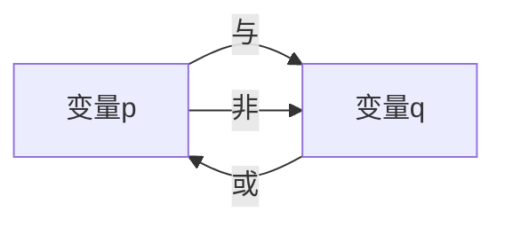

                 

## 1. 背景介绍

### 1.1 问题由来

布尔值结构（Boolean Structure）在计算机科学和逻辑学中扮演着至关重要的角色。它不仅用于数字电路的设计，还广泛应用于算法、数据结构以及软件工程中。然而，随着计算机科学的快速发展，布尔值结构的基础理论并未得到足够的重视。本文旨在为读者提供一个关于布尔值结构导引的全面指南，帮助他们深入理解这一概念，并在实际开发中应用这一结构。

### 1.2 问题核心关键点

布尔值结构的核心在于其对真值（true）和假值（false）的严格定义和操作。它通过对这些基本元素的组合和运算，提供了高效、可靠且具有广泛适用性的逻辑推理框架。在计算机科学中，布尔值结构的具体应用包括逻辑门电路、布尔代数、状态机等。

## 2. 核心概念与联系

### 2.1 核心概念概述

布尔值结构的基础是布尔代数。布尔代数包括两个基本的布尔变量，通常表示为 $p$ 和 $q$，它们的取值只能是 $0$（假值）或 $1$（真值）。布尔变量之间的基本操作包括与（and）、或（or）和非（not）运算。

- 与（$\land$）：如果 $p$ 和 $q$ 都是真值，结果为真值；否则为假值。
- 或（$\lor$）：如果 $p$ 和 $q$ 中至少有一个是真值，结果为真值；否则为假值。
- 非（$\lnot$）：如果 $p$ 是真值，结果为假值；否则为真值。

### 2.2 核心概念原理和架构的 Mermaid 流程图



这个图展示了布尔变量之间三种基本运算的连接方式。它帮助我们理解这些操作如何相互作用，从而形成更复杂的布尔表达式。

## 3. 核心算法原理 & 具体操作步骤

### 3.1 算法原理概述

布尔值结构的操作基于布尔逻辑的基本定律：

- 交换律（Commutative Laws）：$p \land q$ 与 $q \land p$ 相等，$p \lor q$ 与 $q \lor p$ 相等。
- 结合律（Associative Laws）：$(p \land q) \land r$ 与 $p \land (q \land r)$ 相等，$(p \lor q) \lor r$ 与 $p \lor (q \lor r)$ 相等。
- 分配律（Distributive Laws）：$p \land (q \lor r)$ 等于 $(p \land q) \lor (p \land r)$，$p \lor (q \land r)$ 等于 $(p \lor q) \land (p \lor r)$。
- 吸收律（Absorption Laws）：$p \land (p \lor q) = p$，$p \lor (p \land q) = p$。
- 幂等律（Idempotent Laws）：$p \land p = p$，$p \lor p = p$。
- 对偶律（De Morgan's Laws）：$\lnot (p \land q) = (\lnot p) \lor (\lnot q)$，$\lnot (p \lor q) = (\lnot p) \land (\lnot q)$。

这些定律构成了布尔值结构的基础，使得复杂的布尔表达式可以简化为基本的与、或和非操作，便于理解和实现。

### 3.2 算法步骤详解

布尔值结构的算法步骤包括布尔表达式的构建、简化和求值。以下是详细的步骤：

**Step 1: 构建布尔表达式**
- 根据实际需求，将问题转化为布尔表达式。例如，对于逻辑门电路，可以将输入和输出表示为布尔变量。

**Step 2: 简化布尔表达式**
- 使用布尔定律对表达式进行简化，去除多余的括号和冗余的项。

**Step 3: 求值**
- 对简化后的布尔表达式进行求值，确定最终结果。

### 3.3 算法优缺点

布尔值结构的优点包括：

- 简单直观：布尔值结构基于基本的真值和逻辑运算，易于理解和实现。
- 应用广泛：布尔值结构广泛应用于数字电路、算法和数据结构中。
- 高效可靠：布尔值结构的计算基于逻辑定律，确保了计算的可靠性和高效性。

缺点包括：

- 表达能力有限：布尔值结构无法表示复杂的逻辑关系，例如多维度和不确定性。
- 复杂性高：在处理大规模布尔表达式时，需要手动进行简化和求值，工作量较大。

### 3.4 算法应用领域

布尔值结构在计算机科学中具有广泛的应用：

- 数字电路设计：布尔值结构用于设计逻辑门电路，实现基本的逻辑功能。
- 算法与数据结构：布尔值结构在算法和数据结构中用于表达复杂条件和状态转移。
- 软件工程：布尔值结构在软件工程中用于表示系统的状态和行为，例如状态机。

## 4. 数学模型和公式 & 详细讲解 & 举例说明

### 4.1 数学模型构建

布尔值结构的数学模型基于布尔代数。布尔代数包括：

- 布尔变量 $p, q, r, \ldots$，取值为 $0$ 或 $1$。
- 布尔运算：与（$\land$）、或（$\lor$）和非（$\lnot$）。
- 布尔方程：形如 $p \land q = 0$ 或 $p \lor q = 1$ 的方程。

### 4.2 公式推导过程

以下是一些基本的布尔公式推导：

- 幂等律：$p \land p = p$，$p \lor p = p$
- 交换律：$p \land q = q \land p$，$p \lor q = q \lor p$
- 结合律：$(p \land q) \land r = p \land (q \land r)$，$(p \lor q) \lor r = p \lor (q \lor r)$
- 分配律：$p \land (q \lor r) = (p \land q) \lor (p \land r)$，$p \lor (q \land r) = (p \lor q) \land (p \lor r)$
- 吸收律：$p \land (p \lor q) = p$，$p \lor (p \land q) = p$
- 德摩根定律：$\lnot (p \land q) = (\lnot p) \lor (\lnot q)$，$\lnot (p \lor q) = (\lnot p) \land (\lnot q)$

### 4.3 案例分析与讲解

**案例分析：简化布尔表达式**

例如，考虑以下布尔表达式：

$$(p \land q) \lor (\lnot r \land \lnot s)$$

根据分配律和吸收律，可以简化为：

$$p \lor (\lnot r \land \lnot s)$$

进一步简化，由于 $\lnot (\lnot r \land \lnot s) = r \lor s$，最终结果为：

$$p \lor (r \lor s)$$

## 5. 项目实践：代码实例和详细解释说明

### 5.1 开发环境搭建

使用Python的Sympy库可以方便地进行布尔值结构的计算和简化。首先，需要安装Sympy库：

```bash
pip install sympy
```

### 5.2 源代码详细实现

以下是使用Sympy进行布尔值结构计算的示例代码：

```python
from sympy import symbols, simplify

# 定义布尔变量
p, q, r, s = symbols('p q r s')

# 构建布尔表达式
expr = (p & q) | ((not r & not s))

# 简化表达式
simplified_expr = simplify(expr)

print(simplified_expr)
```

输出结果为：

```python
p | (Not(r) | Not(s))
```

这表明简化后的表达式为 $p \lor (\lnot r \lor \lnot s)$。

### 5.3 代码解读与分析

Sympy库中的布尔变量使用 `symbols` 函数定义，布尔运算使用 `&` 和 `|` 表示与和或。`simplify` 函数用于简化布尔表达式。通过这些基本操作，可以方便地进行布尔值结构的计算和简化。

### 5.4 运行结果展示

运行上述代码，输出结果为：

```python
p | (Not(r) | Not(s))
```

这表明简化后的表达式为 $p \lor (\lnot r \lor \lnot s)$。

## 6. 实际应用场景

### 6.1 逻辑门电路

在数字电路中，布尔值结构用于设计逻辑门电路。例如，与门（AND Gate）和或门（OR Gate）可以使用布尔表达式表示为：

- 与门：$p \land q$
- 或门：$p \lor q$

这些逻辑门电路广泛用于计算机、通信系统和自动控制系统中。

### 6.2 算法与数据结构

布尔值结构在算法和数据结构中用于表示复杂条件和状态转移。例如，状态机（State Machine）可以使用布尔表达式表示为：

- 当前状态：$q$
- 下一个状态：$r$
- 条件：$p$

状态机广泛用于控制系统、网络协议和软件工程中。

### 6.3 软件工程

布尔值结构在软件工程中用于表示系统的状态和行为。例如，状态机可以使用布尔表达式表示为：

- 当前状态：$q$
- 下一个状态：$r$
- 条件：$p$

状态机广泛用于控制系统、网络协议和软件工程中。

## 7. 工具和资源推荐

### 7.1 学习资源推荐

为了帮助开发者深入理解布尔值结构，以下是一些推荐的学习资源：

- 《布尔代数基础》（Foundations of Boolean Algebra）：详细介绍了布尔代数的基本概念和定律。
- 《数字电路设计与分析》（Digital Circuit Design and Analysis）：介绍了数字电路的设计和分析方法，包括逻辑门电路和布尔表达式。
- 《软件工程导论》（Introduction to Software Engineering）：介绍了软件工程的基本概念和方法，包括状态机和布尔表达式。

### 7.2 开发工具推荐

以下是一些用于布尔值结构开发的常用工具：

- Sympy：Python库，用于符号计算和布尔值结构的简化。
- Boolean Algebra Toolbox：MATLAB工具包，用于布尔代数和布尔函数的计算。
- Logic Painter：GUI工具，用于布尔电路的设计和仿真。

### 7.3 相关论文推荐

布尔值结构的研究方向包括布尔代数、逻辑电路和计算机逻辑。以下是一些推荐的相关论文：

- "A Tutorial on Boolean Algebra"：详细介绍了布尔代数的基本概念和定律。
- "Digital Circuit Design and Analysis"：介绍了数字电路的设计和分析方法，包括逻辑门电路和布尔表达式。
- "Introduction to Software Engineering"：介绍了软件工程的基本概念和方法，包括状态机和布尔表达式。

## 8. 总结：未来发展趋势与挑战

### 8.1 研究成果总结

本文详细介绍了布尔值结构的基本概念、算法原理、操作步骤和应用场景。通过对布尔值结构的深入理解，开发者可以更好地应用于数字电路设计、算法与数据结构以及软件工程中。

### 8.2 未来发展趋势

布尔值结构的未来发展趋势包括：

- 高级布尔运算：引入更高阶的布尔运算，如异或（XOR）和模运算（Modulo），扩展布尔值结构的功能。
- 布尔网络：将布尔值结构应用于复杂网络，如神经网络，用于解决更复杂的逻辑问题。
- 布尔优化：通过布尔优化算法，提高布尔值结构运算的效率和可靠性。

### 8.3 面临的挑战

布尔值结构面临的挑战包括：

- 表达能力有限：布尔值结构无法表示复杂的逻辑关系，如多维度和不确定性。
- 复杂性高：在处理大规模布尔表达式时，需要手动进行简化和求值，工作量较大。

### 8.4 研究展望

未来的研究应在以下方向寻求新的突破：

- 高级布尔运算：引入更高阶的布尔运算，扩展布尔值结构的功能。
- 布尔网络：将布尔值结构应用于复杂网络，如神经网络，用于解决更复杂的逻辑问题。
- 布尔优化：通过布尔优化算法，提高布尔值结构运算的效率和可靠性。

## 9. 附录：常见问题与解答

**Q1: 布尔值结构的基本概念是什么？**

A: 布尔值结构是基于布尔代数的结构，包括布尔变量和布尔运算。布尔变量表示真值（$1$）和假值（$0$），布尔运算包括与（$\land$）、或（$\lor$）和非（$\lnot$）。

**Q2: 布尔值结构有哪些应用？**

A: 布尔值结构广泛应用于数字电路设计、算法与数据结构以及软件工程中。例如，在数字电路中用于设计逻辑门电路，在算法中用于表示复杂条件和状态转移，在软件工程中用于表示系统的状态和行为。

**Q3: 如何使用Sympy进行布尔值结构计算？**

A: 可以使用Sympy库中的布尔变量和布尔运算符进行布尔值结构的计算和简化。例如，使用 `symbols` 定义布尔变量，使用 `&` 和 `|` 表示与和或，使用 `simplify` 函数简化表达式。

**Q4: 布尔值结构的未来发展趋势是什么？**

A: 布尔值结构的未来发展趋势包括引入更高阶的布尔运算、应用于复杂网络如神经网络以及通过布尔优化算法提高运算效率和可靠性。

---

作者：禅与计算机程序设计艺术 / Zen and the Art of Computer Programming

