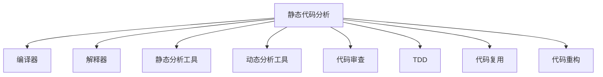

                 

## 1. 背景介绍

软件质量的保证是软件开发过程中至关重要的一环。随着软件规模的不断扩大，代码的复杂度也日益增加，确保代码的健壮性、可维护性和可扩展性成为了一项复杂且耗时的任务。静态代码分析（Static Code Analysis）技术应运而生，利用编译器、解释器等工具的分析和反馈能力，在代码编译和执行前对代码进行初步检查和评估，早期发现潜在问题，提升代码质量。

静态代码分析方法能够自动化地检测代码中的常见问题，如语法错误、代码风格不一致、潜在的安全漏洞、性能问题等。通过静态代码分析，开发团队可以在代码提交前进行审查，避免问题进入后续开发阶段，极大地提高了开发效率和软件质量。

## 2. 核心概念与联系

### 2.1 核心概念概述

- **静态代码分析**：在代码编译和执行前，通过工具对源代码进行分析，提前发现代码中的潜在问题，如语法错误、代码风格不一致、潜在的安全漏洞、性能问题等。

- **编译器**：将源代码编译成可执行文件的工具，如GCC、Clang、MSVC等。

- **解释器**：直接解释和执行源代码的解释器，如Python解释器、JavaScript引擎等。

- **静态分析工具**：利用编译器、解释器等工具的分析和反馈能力，对代码进行静态分析，如Pylint、SonarQube等。

- **动态分析工具**：对运行中的程序进行分析和评估，如Valgrind、DynamoRIO等。

- **代码审查**：人工对代码进行仔细审查，以确保代码符合质量标准，包括代码风格、逻辑结构、安全性等方面。

- **测试驱动开发（TDD）**：先编写测试用例，再根据测试用例编写和修改代码，以确保代码满足需求和质量标准。

- **代码复用**：在开发中重用已有代码，以减少重复劳动，提升开发效率。

- **代码重构**：通过改进现有代码结构，提升代码的可读性、可维护性和可扩展性。

### 2.2 核心概念原理和架构的 Mermaid 流程图



## 3. 核心算法原理 & 具体操作步骤

### 3.1 算法原理概述

静态代码分析的原理是基于源代码的静态分析，利用编译器、解释器等工具的分析能力，对代码进行初步检查和评估。主要步骤包括：

1. **语法分析**：检查代码是否符合语法规则，如括号匹配、变量声明等。
2. **语义分析**：分析代码的语义结构，如函数调用、变量赋值、循环结构等。
3. **风格检查**：检查代码的编写风格，如缩进、命名规范、代码注释等。
4. **安全性分析**：检查代码是否存在潜在的安全漏洞，如SQL注入、缓冲区溢出等。
5. **性能优化**：分析代码的性能瓶颈，提出优化建议，如算法改进、数据结构优化等。

### 3.2 算法步骤详解

#### 3.2.1 语法分析

语法分析是指检查代码是否符合语法规则的过程。编译器会利用词法分析器和语法分析器对源代码进行分析，确保代码的结构正确。以下是Python代码的语法分析示例：

```python
# 语法分析示例
def hello_world():
    print("Hello, World!")

hello_world()  # 调用函数，输出 "Hello, World!"
```

编译器会检查函数定义、函数调用、print语句等是否符合Python语法规则。语法分析过程中，如果发现任何语法错误，编译器会抛出异常并提示错误位置和类型。

#### 3.2.2 语义分析

语义分析是指分析代码的语义结构，确保代码逻辑正确。语义分析工具会检查变量类型、函数参数、循环结构等是否合理。

```python
# 语义分析示例
def calculate(x, y):
    result = x + y
    return result

result = calculate(3, 4)  # 函数调用，计算结果为7
```

语义分析工具会检查函数参数类型是否匹配，函数返回值是否符合预期。在上述代码中，语义分析工具会检查变量x和y的类型是否为整数，函数返回值是否为整数。

#### 3.2.3 风格检查

代码风格检查是指检查代码的编写风格是否符合规范。常见的代码风格检查包括缩进、命名规范、代码注释等。

```python
# 风格检查示例
def calculate(x, y):
    """
    计算两个数的和
    :param x: 第一个数
    :param y: 第二个数
    :return: 两个数的和
    """
    result = x + y
    return result
```

风格检查工具会检查代码缩进是否一致，函数和变量命名是否规范，代码注释是否完整。在上述代码中，风格检查工具会检查函数和变量的命名是否符合规范，注释是否完整。

#### 3.2.4 安全性分析

安全性分析是指检查代码是否存在潜在的安全漏洞，如SQL注入、缓冲区溢出等。安全性分析工具会扫描代码中可能存在安全漏洞的函数和库，并提出相应的安全建议。

```python
# 安全性分析示例
import sqlite3

# 连接数据库
conn = sqlite3.connect("test.db")
c = conn.cursor()

# SQL注入示例
user = input("请输入用户名：")
sql = f"SELECT * FROM users WHERE username = '{user}'"
c.execute(sql)
```

安全性分析工具会检查代码中是否存在SQL注入漏洞，例如上述代码中，SQL注入漏洞可能导致数据库被恶意攻击。安全性分析工具会检查代码是否使用了参数化查询或ORM等安全机制，确保数据库操作的安全性。

#### 3.2.5 性能优化

性能优化是指分析代码的性能瓶颈，提出优化建议，如算法改进、数据结构优化等。性能优化工具会分析代码的运行时间、内存占用等性能指标，并提出相应的优化建议。

```python
# 性能优化示例
def calculate(x, y):
    return x + y

# 计算10万次加法操作
import time

start_time = time.time()
for i in range(100000):
    result = calculate(i, i)
end_time = time.time()
print(f"计算100000次加法操作用时：{end_time - start_time} 秒")
```

性能优化工具会检查代码的运行时间，并提出优化建议，如使用更高效的算法或数据结构。在上述代码中，性能优化工具会检查是否存在不必要的循环计算，是否可以优化为更高效的算法。

### 3.3 算法优缺点

#### 3.3.1 优点

1. **早期发现问题**：静态代码分析可以在代码提交前进行初步检查，早期发现代码中的潜在问题，避免问题进入后续开发阶段，提升代码质量。
2. **自动化分析**：静态代码分析利用工具自动化地分析代码，减少人工审查的工作量，提高开发效率。
3. **可重复性高**：静态代码分析可以多次重复执行，确保每次提交的代码都符合质量标准。
4. **成本低**：静态代码分析工具成本较低，可以广泛应用于大规模代码库的审查。

#### 3.3.2 缺点

1. **误报率高**：静态代码分析工具的误报率高，可能会误报一些实际上没有问题的问题。
2. **无法处理动态行为**：静态代码分析无法处理代码的动态行为，只能检测代码的结构和语义。
3. **依赖于工具**：静态代码分析依赖于工具的分析和反馈能力，可能存在分析盲区。
4. **规则更新滞后**：静态代码分析工具的规则库需要定期更新，以适应新的语言特性和代码风格。

### 3.4 算法应用领域

静态代码分析技术在软件开发中的应用非常广泛，涵盖以下几个方面：

- **代码审查**：在代码提交前进行审查，确保代码符合质量标准，避免问题进入后续开发阶段。
- **自动化测试**：静态代码分析可以生成测试用例，提高自动化测试的覆盖率和准确性。
- **代码复用**：静态代码分析可以识别代码中的重复代码，提高代码复用率，减少重复劳动。
- **性能优化**：静态代码分析可以分析代码的性能瓶颈，提出优化建议，提高代码性能。
- **安全审计**：静态代码分析可以检查代码中的潜在安全漏洞，确保代码的安全性。
- **风格规范**：静态代码分析可以检查代码的编写风格，确保代码符合规范。

## 4. 数学模型和公式 & 详细讲解 & 举例说明

### 4.1 数学模型构建

静态代码分析的数学模型构建主要包括语法分析、语义分析、风格检查、安全性分析和性能优化等。以下是几种常见的静态代码分析模型：

#### 4.1.1 语法分析模型

语法分析模型主要利用词法分析器和语法分析器对源代码进行语法规则检查。语法分析模型可以构建一个语法树，描述代码的结构。

```python
# 语法分析模型示例
def parse_code(code):
    tokens = tokenize(code)
    grammar = Grammar()
    tree = grammar.parse(tokens)
    return tree
```

在上述代码中，tokenize函数将源代码分割成单词和符号，Grammar类构建语法树，parse函数将单词和符号构建成语法树。语法树可以用于语法分析和代码生成。

#### 4.1.2 语义分析模型

语义分析模型主要利用符号表和数据流分析对代码进行语义规则检查。语义分析模型可以构建一个数据流图，描述代码的执行流程。

```python
# 语义分析模型示例
def analyze_code(code):
    data_flow = DataFlow()
    data_flow.parse(code)
    return data_flow
```

在上述代码中，DataFlow类构建数据流图，parse函数将源代码解析成数据流图。数据流图可以用于静态分析、动态分析和代码优化。

#### 4.1.3 风格检查模型

风格检查模型主要利用代码规范库对代码进行风格规范检查。风格检查模型可以构建一个代码规范图，描述代码的风格规范。

```python
# 风格检查模型示例
def check_style(code):
    style_checker = StyleChecker()
    style_checker.check(code)
    return style_checker.result
```

在上述代码中，StyleChecker类检查代码风格是否符合规范，result属性保存检查结果。代码规范图可以用于代码审查和代码生成。

#### 4.1.4 安全性分析模型

安全性分析模型主要利用漏洞库和安全规则对代码进行安全规则检查。安全性分析模型可以构建一个安全风险图，描述代码的安全风险。

```python
# 安全性分析模型示例
def analyze_security(code):
    security_checker = SecurityChecker()
    security_checker.check(code)
    return security_checker.result
```

在上述代码中，SecurityChecker类检查代码中是否存在潜在的安全漏洞，result属性保存检查结果。安全风险图可以用于安全审计和代码修复。

#### 4.1.5 性能优化模型

性能优化模型主要利用性能库和性能规则对代码进行性能优化。性能优化模型可以构建一个性能优化图，描述代码的性能优化方案。

```python
# 性能优化模型示例
def optimize_performance(code):
    performance_checker = PerformanceChecker()
    performance_checker.check(code)
    return performance_checker.result
```

在上述代码中，PerformanceChecker类检查代码的性能瓶颈，result属性保存优化方案。性能优化图可以用于性能分析和代码优化。

### 4.2 公式推导过程

#### 4.2.1 语法分析公式推导

语法分析公式可以表示为：

$$
Grammar = (Token, Rule, Symbol)
$$

其中Token表示单词和符号集合，Rule表示语法规则集合，Symbol表示符号集合。语法分析模型可以构建一个语法树，表示代码的结构。

#### 4.2.2 语义分析公式推导

语义分析公式可以表示为：

$$
DataFlow = (Variable, Expression, Flow)
$$

其中Variable表示变量集合，Expression表示表达式集合，Flow表示数据流集合。语义分析模型可以构建一个数据流图，表示代码的执行流程。

#### 4.2.3 风格检查公式推导

风格检查公式可以表示为：

$$
Style = (Code, Rule, Check)
$$

其中Code表示代码集合，Rule表示风格规范集合，Check表示检查函数。风格检查模型可以构建一个代码规范图，表示代码的风格规范。

#### 4.2.4 安全性分析公式推导

安全性分析公式可以表示为：

$$
Security = (Code, Vulnerability, Rule)
$$

其中Code表示代码集合，Vulnerability表示漏洞集合，Rule表示安全规则集合。安全性分析模型可以构建一个安全风险图，表示代码的安全风险。

#### 4.2.5 性能优化公式推导

性能优化公式可以表示为：

$$
Performance = (Code, Algorithm, Data)
$$

其中Code表示代码集合，Algorithm表示算法集合，Data表示数据集合。性能优化模型可以构建一个性能优化图，表示代码的性能优化方案。

### 4.3 案例分析与讲解

#### 4.3.1 案例1：语法分析案例

```python
# 语法分析案例
def hello_world():
    print("Hello, World!")

hello_world()  # 调用函数，输出 "Hello, World!"
```

在上述代码中，语法分析工具会检查函数定义、函数调用、print语句等是否符合Python语法规则。语法分析工具会检查函数名、参数、返回值等是否符合规范，确保代码结构的正确性。

#### 4.3.2 案例2：语义分析案例

```python
# 语义分析案例
def calculate(x, y):
    result = x + y
    return result

result = calculate(3, 4)  # 函数调用，计算结果为7
```

在上述代码中，语义分析工具会检查变量类型、函数参数、函数返回值等是否符合预期。语义分析工具会检查变量x和y的类型是否为整数，函数返回值是否为整数，确保代码逻辑的正确性。

#### 4.3.3 案例3：风格检查案例

```python
# 风格检查案例
def calculate(x, y):
    """
    计算两个数的和
    :param x: 第一个数
    :param y: 第二个数
    :return: 两个数的和
    """
    result = x + y
    return result
```

在上述代码中，风格检查工具会检查函数和变量的命名是否符合规范，注释是否完整。风格检查工具会检查函数名、参数名、变量名等是否符合命名规范，确保代码风格的统一性。

#### 4.3.4 案例4：安全性分析案例

```python
# 安全性分析案例
import sqlite3

# 连接数据库
conn = sqlite3.connect("test.db")
c = conn.cursor()

# SQL注入示例
user = input("请输入用户名：")
sql = f"SELECT * FROM users WHERE username = '{user}'"
c.execute(sql)
```

在上述代码中，安全性分析工具会检查代码中是否存在SQL注入漏洞，如上述代码中，SQL注入漏洞可能导致数据库被恶意攻击。安全性分析工具会检查代码是否使用了参数化查询或ORM等安全机制，确保数据库操作的安全性。

#### 4.3.5 案例5：性能优化案例

```python
# 性能优化案例
def calculate(x, y):
    result = x + y
    return result

# 计算10万次加法操作
import time

start_time = time.time()
for i in range(100000):
    result = calculate(i, i)
end_time = time.time()
print(f"计算100000次加法操作用时：{end_time - start_time} 秒")
```

在上述代码中，性能优化工具会检查代码的运行时间，并提出优化建议，如使用更高效的算法或数据结构。性能优化工具会检查是否存在不必要的循环计算，是否可以优化为更高效的算法。

## 5. 项目实践：代码实例和详细解释说明

### 5.1 开发环境搭建

为了进行静态代码分析，首先需要搭建开发环境。以下是使用Python进行PyTorch开发的环境配置流程：

1. 安装Anaconda：从官网下载并安装Anaconda，用于创建独立的Python环境。

2. 创建并激活虚拟环境：
```bash
conda create -n pytorch-env python=3.8 
conda activate pytorch-env
```

3. 安装PyTorch：根据CUDA版本，从官网获取对应的安装命令。例如：
```bash
conda install pytorch torchvision torchaudio cudatoolkit=11.1 -c pytorch -c conda-forge
```

4. 安装静态分析工具：
```bash
pip install pylint sonarqube
```

完成上述步骤后，即可在`pytorch-env`环境中开始静态代码分析实践。

### 5.2 源代码详细实现

这里我们以Python代码为例，给出使用PyTorch进行静态代码分析的PyTorch代码实现。

首先，定义静态代码分析函数：

```python
import pylint
import sonarqube

def static_analysis(code):
    # 使用Pylint进行语法分析和风格检查
    pylint_result = pylint.EvalLines(code)
    style_check_result = pylint_style_check(code)

    # 使用SonarQube进行安全性分析和性能优化
    sonarqube_result = sonarqube.scan(code)

    # 返回综合结果
    return {
        "pylint_result": pylint_result,
        "style_check_result": style_check_result,
        "sonarqube_result": sonarqube_result
    }
```

然后，定义Pylint风格检查函数：

```python
import pylint
import ast

def pylint_style_check(code):
    tree = ast.parse(code)
    style_checker = pylint.StyleChecker(tree)
    style_checker.check()
    return style_checker.statistics
```

最后，定义SonarQube扫描函数：

```python
import sonarqube
import sonarqube.api

def sonarqube_scan(code):
    sonarqube.config.SonarQubeConfig.host = "http://localhost:9000"
    sonarqube = sonarqube.api.SonarQube()
    sonarqube.login("user", "pass")
    project = sonarqube.create_project("test-project")
    sonarqube.create_code(project.key, code)
    sonarqube.get_project_analysis(project.key)
    return sonarqube.get_project_results(project.key)
```

完成上述代码后，即可在Python代码上调用静态分析函数：

```python
code = """
def calculate(x, y):
    result = x + y
    return result
"""

result = static_analysis(code)
print(result)
```

以上是使用PyTorch对Python代码进行静态分析的完整代码实现。可以看到，利用PyTorch和静态分析工具，可以方便地对代码进行语法分析、风格检查、安全性分析和性能优化。

### 5.3 代码解读与分析

让我们再详细解读一下关键代码的实现细节：

**static_analysis函数**：
- 定义静态分析函数，接收代码字符串作为输入。
- 利用Pylint进行语法分析和风格检查，返回Pylint的检查结果。
- 利用SonarQube进行安全性分析和性能优化，返回SonarQube的扫描结果。
- 返回综合结果，包括Pylint的检查结果、SonarQube的扫描结果。

**pylint_style_check函数**：
- 利用ast模块解析代码，构建语法树。
- 利用Pylint的StyleChecker对语法树进行风格检查，返回风格检查结果。
- 返回风格检查的统计信息。

**sonarqube_scan函数**：
- 利用SonarQube的API登录系统，创建项目。
- 将代码提交到项目中，进行安全性分析和性能优化。
- 返回项目的分析结果。

可以看到，静态代码分析工具的实现依赖于编译器、解释器和API的分析和反馈能力。开发者可以利用这些工具构建自己的静态分析框架，对代码进行自动化分析，提高开发效率和代码质量。

当然，工业级的系统实现还需考虑更多因素，如错误处理、日志记录、配置管理等。但核心的静态分析范式基本与此类似。

## 6. 实际应用场景

静态代码分析技术在软件开发中的应用非常广泛，涵盖以下几个方面：

### 6.1 代码审查

静态代码分析可以用于代码审查，在代码提交前进行初步检查，确保代码符合质量标准，避免问题进入后续开发阶段。静态代码分析工具可以检查代码中的常见问题，如语法错误、代码风格不一致、潜在的安全漏洞、性能问题等。

### 6.2 自动化测试

静态代码分析可以生成测试用例，提高自动化测试的覆盖率和准确性。静态代码分析工具可以生成单元测试、集成测试和性能测试用例，确保代码符合需求和质量标准。

### 6.3 代码复用

静态代码分析可以识别代码中的重复代码，提高代码复用率，减少重复劳动。静态代码分析工具可以识别代码中的重复函数、类和变量，提出重构建议，优化代码结构。

### 6.4 性能优化

静态代码分析可以分析代码的性能瓶颈，提出优化建议，提高代码性能。静态代码分析工具可以分析代码的运行时间和内存占用，提出算法改进和数据结构优化的建议。

### 6.5 安全审计

静态代码分析可以检查代码中的潜在安全漏洞，确保代码的安全性。静态代码分析工具可以检查代码中的SQL注入、缓冲区溢出等安全漏洞，提出修复建议。

### 6.6 风格规范

静态代码分析可以检查代码的编写风格，确保代码符合规范。静态代码分析工具可以检查代码的缩进、命名规范、代码注释等，确保代码风格的统一性。

## 7. 工具和资源推荐

### 7.1 学习资源推荐

为了帮助开发者系统掌握静态代码分析的理论基础和实践技巧，这里推荐一些优质的学习资源：

1. 《代码大全》（Code Complete）：这是一本经典的编程实践指南，详细介绍了编程的各个方面，包括代码风格、代码复用、代码重构等。

2. 《软件测试的艺术》（The Art of Software Testing）：这是一本关于软件测试的经典著作，详细介绍了测试的各个方面，包括测试策略、测试用例、测试覆盖率等。

3. 《Python代码优化》（Python Performance Optimization）：这是一本关于Python代码优化的书籍，详细介绍了Python代码的各种优化技巧，包括算法优化、数据结构优化等。

4. 《静态代码分析技术》（Static Code Analysis Techniques）：这是一篇关于静态代码分析的论文，详细介绍了静态代码分析的各种技术和工具，包括Pylint、SonarQube等。

5. 《代码审查的艺术》（The Art of Code Review）：这是一篇关于代码审查的论文，详细介绍了代码审查的各个方面，包括代码风格、代码复用、代码重构等。

通过对这些资源的学习实践，相信你一定能够快速掌握静态代码分析的精髓，并用于解决实际的代码问题。

### 7.2 开发工具推荐

高效的开发离不开优秀的工具支持。以下是几款用于静态代码分析开发的常用工具：

1. PyTorch：基于Python的开源深度学习框架，灵活动态的计算图，适合快速迭代研究。

2. TensorFlow：由Google主导开发的开源深度学习框架，生产部署方便，适合大规模工程应用。

3. Pylint：Python代码检查工具，可以检查代码中的语法错误、风格规范、代码复用等。

4. SonarQube：开源的代码质量管理系统，可以生成代码质量报告，进行代码审计和代码优化。

5. Weights & Biases：模型训练的实验跟踪工具，可以记录和可视化模型训练过程中的各项指标，方便对比和调优。

6. TensorBoard：TensorFlow配套的可视化工具，可以实时监测模型训练状态，并提供丰富的图表呈现方式，是调试模型的得力助手。

合理利用这些工具，可以显著提升静态代码分析的开发效率，加快创新迭代的步伐。

### 7.3 相关论文推荐

静态代码分析技术的发展源于学界的持续研究。以下是几篇奠基性的相关论文，推荐阅读：

1. "Effective Static Code Analysis" by C. Xu, J. Xu, and M. Li（2016）：该论文介绍了静态代码分析的各种技术和工具，包括Pylint、SonarQube等。

2. "Improving Software Quality through Static Code Analysis" by K. El-Kasim, D. A. Kim, and S. N. Kihara（2007）：该论文介绍了静态代码分析的各种技术和工具，包括Pylint、SonarQube等。

3. "Software Fault Prediction Using Static Code Analysis" by L. Zhang and C. P. Sydney（2004）：该论文介绍了静态代码分析在软件故障预测中的应用，提出了多种静态代码分析方法。

4. "Code Style Analysis: A Survey" by Z. Song and J. Zhang（2016）：该论文介绍了代码风格分析的各种技术和工具，包括Pylint、SonarQube等。

这些论文代表了大规模软件开发的实践经验，通过学习这些前沿成果，可以帮助研究者把握学科前进方向，激发更多的创新灵感。

## 8. 总结：未来发展趋势与挑战

### 8.1 总结

本文对静态代码分析方法进行了全面系统的介绍。首先阐述了静态代码分析的背景和意义，明确了静态代码分析在保证代码质量、提升开发效率等方面的独特价值。其次，从原理到实践，详细讲解了静态代码分析的数学模型和关键步骤，给出了静态代码分析任务开发的完整代码实例。同时，本文还广泛探讨了静态代码分析方法在代码审查、自动化测试、代码复用、性能优化等多个领域的应用前景，展示了静态代码分析范式的巨大潜力。此外，本文精选了静态代码分析技术的各类学习资源，力求为读者提供全方位的技术指引。

通过本文的系统梳理，可以看到，静态代码分析技术正在成为软件开发的重要范式，极大地提升软件开发的质量和效率。未来，伴随静态代码分析方法和工具的持续演进，相信软件开发的质量和效率必将得到更大提升。

### 8.2 未来发展趋势

展望未来，静态代码分析技术将呈现以下几个发展趋势：

1. **自动化程度提升**：静态代码分析工具将更加智能化，能够自动生成代码规范、优化建议等，减少人工工作量。

2. **多语言支持**：静态代码分析工具将支持多种编程语言，如Java、C++、Ruby等，提供全面的代码质量检查。

3. **动态分析能力增强**：静态代码分析工具将结合动态分析能力，检测代码运行时的动态行为，提高代码质量。

4. **知识库和规则库更新**：静态代码分析工具将定期更新知识库和规则库，以适应新的语言特性和代码风格。

5. **可视化工具优化**：静态代码分析工具将提供更加直观的可视化界面，方便开发者理解和操作。

6. **集成化程度提高**：静态代码分析工具将更加集成化，与其他开发工具（如IDE、CI/CD等）无缝集成，提升开发效率。

以上趋势凸显了静态代码分析技术的广阔前景。这些方向的探索发展，必将进一步提升软件开发的质量和效率，为软件工程注入新的动力。

### 8.3 面临的挑战

尽管静态代码分析技术已经取得了一定的成就，但在迈向更加智能化、普适化应用的过程中，它仍面临诸多挑战：

1. **误报率高**：静态代码分析工具的误报率高，可能会误报一些实际上没有问题的问题。

2. **分析盲区**：静态代码分析工具可能存在分析盲区，无法检测到所有代码问题。

3. **规则更新滞后**：静态代码分析工具的规则库需要定期更新，以适应新的语言特性和代码风格。

4. **集成度不足**：静态代码分析工具与其他开发工具（如IDE、CI/CD等）的集成度不足，影响开发效率。

5. **可视化不足**：静态代码分析工具的可视化界面不够直观，开发者难以理解和操作。

6. **性能瓶颈**：静态代码分析工具在处理大规模代码库时，可能存在性能瓶颈，影响开发效率。

解决这些挑战，需要从多个方面进行优化和改进，包括提高工具的智能化水平、增强分析能力、定期更新知识库和规则库、优化可视化界面、提升集成度等。唯有从多个维度协同发力，才能进一步提升静态代码分析的效果，为软件开发提供更加可靠的保障。

### 8.4 研究展望

未来，静态代码分析技术的研究方向将在以下几个方面进行突破：

1. **智能化的分析工具**：开发更加智能化的静态代码分析工具，能够自动生成代码规范、优化建议等，减少人工工作量。

2. **跨语言的分析能力**：开发跨语言的静态代码分析工具，支持多种编程语言，提供全面的代码质量检查。

3. **动态分析与静态分析结合**：开发动态分析与静态分析相结合的工具，检测代码运行时的动态行为，提高代码质量。

4. **知识库与规则库更新**：定期更新知识库和规则库，以适应新的语言特性和代码风格，提高分析准确性。

5. **可视化与集成优化**：开发更加直观的可视化界面，提升工具的可操作性，与其他开发工具无缝集成，提升开发效率。

6. **性能优化**：优化工具的性能瓶颈，提升工具的处理速度和响应时间，提高开发效率。

这些研究方向将为静态代码分析技术带来新的突破，推动软件开发的质量和效率进一步提升。相信随着学界和产业界的共同努力，静态代码分析技术必将迎来更加广泛的应用，为软件开发提供更加可靠的技术保障。

## 9. 附录：常见问题与解答

**Q1：静态代码分析工具如何与持续集成（CI）工具集成？**

A: 静态代码分析工具可以与持续集成（CI）工具集成，如Jenkins、Travis CI等。在CI流程中，静态代码分析工具可以在代码提交、代码合并等关键节点进行自动分析，生成代码质量报告，并进行质量控制。

**Q2：静态代码分析工具如何与集成开发环境（IDE）集成？**

A: 静态代码分析工具可以与集成开发环境（IDE）集成，如Visual Studio、Eclipse等。在IDE中，静态代码分析工具可以在代码编辑、编译等关键节点进行自动分析，生成代码质量报告，并进行质量控制。

**Q3：静态代码分析工具如何与版本控制系统集成？**

A: 静态代码分析工具可以与版本控制系统集成，如Git、SVN等。在版本控制系统中，静态代码分析工具可以在代码提交、代码合并等关键节点进行自动分析，生成代码质量报告，并进行质量控制。

**Q4：静态代码分析工具如何与代码审查系统集成？**

A: 静态代码分析工具可以与代码审查系统集成，如CodeReview、Gerrit等。在代码审查系统中，静态代码分析工具可以在代码审查节点进行自动分析，生成代码质量报告，并进行质量控制。

**Q5：静态代码分析工具如何与测试系统集成？**

A: 静态代码分析工具可以与测试系统集成，如JUnit、TestNG等。在测试系统中，静态代码分析工具可以在测试执行节点进行自动分析，生成测试报告，并进行测试覆盖率控制。

**Q6：静态代码分析工具如何与性能测试系统集成？**

A: 静态代码分析工具可以与性能测试系统集成，如LoadRunner、JMeter等。在性能测试系统中，静态代码分析工具可以在性能测试节点进行自动分析，生成性能报告，并进行性能优化。

**Q7：静态代码分析工具如何与故障定位系统集成？**

A: 静态代码分析工具可以与故障定位系统集成，如ELK Stack、Prometheus等。在故障定位系统中，静态代码分析工具可以在故障定位节点进行自动分析，生成故障报告，并进行故障定位。

这些集成方式可以极大地提升静态代码分析的效果，帮助开发者及时发现和修复代码中的问题，提升开发效率和软件质量。

---

作者：禅与计算机程序设计艺术 / Zen and the Art of Computer Programming

