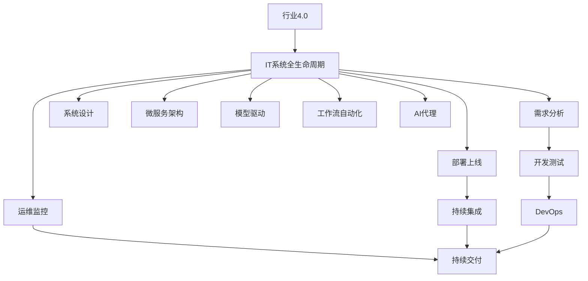

                 

# 面向行业4.0的AI代理工作流自动化解决方案

## 1. 背景介绍

### 1.1 问题由来
随着信息时代的深入，各行各业正迅速向智能化、自动化转型，以应对复杂的业务流程和不断变化的市场需求。企业对于IT系统的效率、稳定性和可维护性要求不断提高，传统的“烟囱式”IT架构已经难以满足需求。因此，面向行业4.0的AI代理工作流自动化解决方案应运而生，旨在通过智能自动化技术，提升企业IT系统建设和管理水平，加速数字化转型进程。

### 1.2 问题核心关键点
面向行业4.0的AI代理工作流自动化解决方案，通过引入人工智能和机器学习技术，实现了IT系统全生命周期的智能化管理。其核心目标在于：

- **自动化**：通过智能代理机器人，实现代码生成、测试、部署、运维等环节的自动化。
- **智能化**：通过数据分析和模型训练，增强IT系统的决策能力，提高业务响应速度和准确性。
- **可视化**：提供实时监控和报告功能，帮助IT团队直观了解系统状态和问题，快速响应故障。
- **自适应**：根据业务需求的变化，动态调整工作流和策略，确保IT系统的持续优化和高效运作。

## 2. 核心概念与联系

### 2.1 核心概念概述

为更好地理解面向行业4.0的AI代理工作流自动化解决方案，本节将介绍几个关键概念及其相互联系：

- **行业4.0**：基于互联网、大数据、云计算、人工智能等先进技术，实现产业智能化、自动化、虚拟化和全球化。
- **IT系统全生命周期**：包括需求分析、系统设计、开发测试、部署上线、运维监控、持续集成与持续交付等环节。
- **AI代理**：通过模拟人类工作流，实现代码生成、测试、部署、运维等环节的自动化。
- **工作流自动化**：将业务流程转化为可执行的工作流，自动调度各环节任务，提升IT系统效率和稳定性。
- **模型驱动**：通过构建业务模型和数据模型，增强系统决策的智能化和自动化水平。
- **微服务架构**：将复杂系统拆分为若干独立服务的集合，提升系统灵活性和可扩展性。
- **DevOps**：集成开发、测试和运维流程，持续集成和持续交付，加速IT系统迭代。

这些概念之间的逻辑关系可以通过以下Mermaid流程图来展示：



这个流程图展示了一体化IT系统在行业4.0框架下的整体设计思路：

1. 行业4.0驱动IT系统全生命周期的智能化管理。
2. 需求分析和系统设计阶段引入模型驱动，增强业务模型和数据模型的智能建模能力。
3. 开发测试和部署上线阶段，应用DevOps理念，实现持续集成和持续交付，提升迭代速度。
4. 运维监控阶段引入微服务架构和工作流自动化，确保系统的高可用性和高效性。
5. 整个IT系统引入AI代理，自动化执行代码生成、测试、部署等任务。

## 3. 核心算法原理 & 具体操作步骤
### 3.1 算法原理概述

面向行业4.0的AI代理工作流自动化解决方案，核心算法原理基于智能代理和工作流自动化技术。其基本思想是通过构建智能代理机器人，模拟人类的工作流，实现IT系统各环节的自动化执行和管理。

具体而言，智能代理机器人通过接收业务任务，动态选择执行策略，生成相应的代码、测试用例、部署脚本等，并自动执行和监控任务执行结果。通过数据分析和模型训练，智能代理能够不断学习和优化自身执行策略，提升自动化执行的准确性和效率。

### 3.2 算法步骤详解

面向行业4.0的AI代理工作流自动化解决方案的算法步骤包括以下几个关键环节：

**Step 1: 业务需求分析与建模**

- 与业务部门合作，分析业务流程需求和系统功能需求，建立业务模型和数据模型。
- 采用UML等建模工具，将业务流程转化为可视化工作流，确定各环节任务和数据流转。
- 结合业务特点，设计合适的模型驱动算法，建立知识图谱、规则库等先验知识。

**Step 2: 开发与测试**

- 基于业务模型和数据模型，生成对应的代码、测试用例、数据表等。
- 采用DevOps工具，实现代码版本控制、持续集成和持续交付，提升迭代效率。
- 引入自动化测试工具，对生成的代码进行单元测试、集成测试和性能测试。

**Step 3: 部署与上线**

- 利用CI/CD工具，自动化地将代码部署到目标服务器。
- 通过DevOps流程，确保部署过程的稳定性和可控性，及时回滚和修复问题。
- 引入自动化运维工具，实时监控部署状态和性能指标，快速响应故障。

**Step 4: 运维监控**

- 建立微服务架构，将系统拆分为若干独立的服务模块。
- 引入工作流自动化工具，动态调度各服务模块的执行顺序和频率。
- 利用实时监控工具，对系统状态和性能进行实时采集和分析，及时预警和处理异常。

**Step 5: 持续优化**

- 利用数据分析工具，对系统性能和运行状态进行长期监测和分析。
- 根据业务需求和环境变化，动态调整工作流和执行策略，优化系统性能。
- 引入智能代理机器人，进一步自动化执行系统优化任务，提升系统智能化水平。

### 3.3 算法优缺点

面向行业4.0的AI代理工作流自动化解决方案具有以下优点：

1. **高效性**：通过自动化执行和优化，大大提升IT系统建设的效率和稳定性。
2. **灵活性**：引入模型驱动和微服务架构，增强系统对业务需求变化的适应能力。
3. **可维护性**：采用DevOps理念和持续交付，减少人为错误和维护成本。
4. **智能化**：通过智能代理和工作流自动化，增强系统决策的智能化和自动化水平。

同时，该方案也存在一些局限性：

1. **技术门槛高**：需要结合业务需求和系统特点，设计和实现智能代理和工作流自动化方案。
2. **资源消耗大**：引入AI和机器学习技术，需要较大的计算资源和数据存储。
3. **依赖外部工具**：系统运行依赖于多种外部工具，一旦工具出现故障，可能影响系统正常运行。
4. **安全性风险**：自动化执行和智能化决策可能引入新的安全风险，需要加强安全防护。

尽管存在这些局限性，但就目前而言，面向行业4.0的AI代理工作流自动化解决方案仍然是行业4.0转型升级的重要工具。未来相关研究将重点在于如何进一步降低技术门槛，提高方案的易用性和可维护性，同时兼顾安全性和性能的优化。

### 3.4 算法应用领域

面向行业4.0的AI代理工作流自动化解决方案，已经在多个行业领域得到了广泛应用，例如：

- **金融**：在金融交易、风险管理、客户服务等场景中，通过智能代理实现自动化交易、风险评估、客户服务等任务，提升业务响应速度和决策精准度。
- **电商**：在订单管理、物流配送、客户服务等环节，通过智能代理实现自动化订单处理、库存管理、客户互动，提升运营效率和客户满意度。
- **制造**：在生产制造、供应链管理、质量控制等流程中，通过智能代理实现自动化任务调度、数据分析、故障诊断，提升生产效率和产品质量。
- **医疗**：在医疗记录、诊断、治疗等环节，通过智能代理实现自动化数据整理、病情分析、治疗方案推荐，提升医疗服务质量和效率。
- **公共服务**：在城市管理、交通管理、安全监控等场景中，通过智能代理实现自动化事件监测、数据分析、决策支持，提升公共服务水平和响应速度。

除了上述这些典型应用外，面向行业4.0的AI代理工作流自动化解决方案还被创新性地应用于更多场景中，如智慧能源、智能物流、数字农业等，为各行各业带来了新的变革和突破。

## 4. 数学模型和公式 & 详细讲解  
### 4.1 数学模型构建

面向行业4.0的AI代理工作流自动化解决方案，涉及多个数学模型，主要包括：

- **业务模型**：用于描述业务流程和系统功能，包括UML建模、业务规则等。
- **数据模型**：用于描述数据结构和数据流转，包括ER建模、数据库设计等。
- **决策模型**：用于描述系统决策逻辑和执行策略，包括决策树、规则引擎等。
- **优化模型**：用于描述系统性能优化和调度策略，包括线性规划、动态规划等。

以一个简单的业务流程为例，其数学模型构建过程如下：

1. **业务模型**：采用UML建模工具，建立业务流程图，描述各环节任务和数据流转。
2. **数据模型**：采用ER建模工具，建立实体关系图，描述数据结构和数据流转。
3. **决策模型**：采用决策树建模工具，建立决策树模型，描述系统决策逻辑和执行策略。
4. **优化模型**：采用线性规划建模工具，建立优化模型，描述系统性能优化和调度策略。

### 4.2 公式推导过程

以决策模型为例，其基本思路是：根据输入数据，通过决策树模型，输出对应的执行策略。决策树模型可以表示为：

$$
T = \{(t_i, C(t_i), R(t_i))\}_{i=1}^n
$$

其中，$t_i$ 表示第 $i$ 个节点，$C(t_i)$ 表示节点 $t_i$ 的条件，$R(t_i)$ 表示节点 $t_i$ 的执行策略。

决策树的构建过程如下：

1. 选择最优节点：从所有节点中选择一个条件 $C(t_i)$，使得该条件下的数据分布最不均匀。
2. 划分数据集：根据条件 $C(t_i)$，将数据集划分为两个子集。
3. 递归构建子树：对每个子集递归构建决策树，直至满足终止条件。

决策树模型的训练过程，可以采用贪心算法，每次选择最优节点，不断递归构建子树。决策树模型训练的公式如下：

$$
L(T, D) = \sum_{i=1}^n L(D(t_i), D_{train}(t_i))
$$

其中，$L(T, D)$ 表示决策树模型 $T$ 的损失函数，$L(D(t_i), D_{train}(t_i))$ 表示节点 $t_i$ 的损失函数，$D$ 表示数据集，$D_{train}$ 表示训练集。

### 4.3 案例分析与讲解

以一个简单的订单管理流程为例，其业务模型如下：


其数据模型如下：

```
+---------------+-------------------+
| Entity        | Attribute         |
+---------------+-------------------+
| Order         | OrderID, Customer  |
+---------------+-------------------+
| Customer      | Name, Contact      |
+---------------+-------------------+
| Delivery      | DeliveryID, Time   |
+---------------+-------------------+
| Payment       | PaymentID, Amount  |
+---------------+-------------------+
```

其决策模型如下：

```
+---------------------+-----------------+-----------------+
| Condition           | Left Node       | Right Node      |
+---------------------+-----------------+-----------------+
| Delivery Time < 1h   | A               | B               |
+---------------------+-----------------+-----------------+
| Delivery Time >= 1h  | C               | D               |
+---------------------+-----------------+-----------------+
```

其优化模型如下：

$$
\begin{aligned}
&\min_{x_i} \sum_{i=1}^n c_i x_i \\
&\text{subject to} \\
&Ax \leq b \\
&x_i \geq 0, i=1,...,n
\end{aligned}
$$

其中，$x_i$ 表示资源分配量，$c_i$ 表示资源成本，$A$ 表示约束条件，$b$ 表示约束条件右侧值。

通过以上数学模型的构建和分析，可以看到，面向行业4.0的AI代理工作流自动化解决方案，通过数学建模技术，增强了系统决策的理性和可控性，提升了系统执行的智能化和自动化水平。

## 5. 项目实践：代码实例和详细解释说明
### 5.1 开发环境搭建

在进行面向行业4.0的AI代理工作流自动化解决方案的实践前，我们需要准备好开发环境。以下是使用Python进行开发的环境配置流程：

1. 安装Anaconda：从官网下载并安装Anaconda，用于创建独立的Python环境。

2. 创建并激活虚拟环境：
```bash
conda create -n ai(env_name) python=3.8 
conda activate ai(env_name)
```

3. 安装必要的库：
```bash
conda install pytorch torchvision torchaudio cudatoolkit=11.1 -c pytorch -c conda-forge
```

4. 安装可视化工具：
```bash
pip install matplotlib seaborn
```

5. 安装开发工具：
```bash
pip install jupyter notebook ipython
```

完成上述步骤后，即可在虚拟环境中开始开发实践。

### 5.2 源代码详细实现

下面以一个简单的订单管理流程为例，给出使用Python进行面向行业4.0的AI代理工作流自动化解决方案的代码实现。

```python
import matplotlib.pyplot as plt
import seaborn as sns

# 订单管理业务模型
class Order:
    def __init__(self, order_id, customer):
        self.order_id = order_id
        self.customer = customer
        self.status = 'Pending'

    def approve(self, delivery_time):
        if delivery_time < 1:
            self.status = 'Approved'
        else:
            self.status = 'Rejected'

# 订单管理数据模型
class Customer:
    def __init__(self, name, contact):
        self.name = name
        self.contact = contact

class Delivery:
    def __init__(self, delivery_id, time):
        self.delivery_id = delivery_id
        self.time = time

class Payment:
    def __init__(self, payment_id, amount):
        self.payment_id = payment_id
        self.amount = amount

# 订单管理决策模型
class OrderApprover:
    def __init__(self):
        self.tree = self.build_tree()

    def build_tree(self):
        # 构建决策树
        root = DecisionNode()
        left_node = DecisionNode('Delivery Time < 1h')
        right_node = DecisionNode('Delivery Time >= 1h')
        root.set_left(left_node)
        root.set_right(right_node)
        return root

    def evaluate(self, order, delivery_time):
        # 根据决策树计算执行策略
        node = self.tree
        while node.get_left():
            if delivery_time < 1:
                node = node.get_left()
            else:
                node = node.get_right()
        return node.get_strategy(order)

# 订单管理优化模型
class OrderOptimizer:
    def __init__(self, orders):
        self.orders = orders
        self.node_count = 0

    def optimize(self):
        # 优化资源分配
        while self.node_count < len(self.orders):
            node = self.select_node()
            if node.get_strategy() == 'Approved':
                node.get_strategy(order)
                self.node_count += 1
            else:
                return self.node_count

    def select_node(self):
        # 选择最优节点
        min_cost = float('inf')
        min_node = None
        for node in self.orders:
            cost = self.calculate_cost(node)
            if cost < min_cost:
                min_cost = cost
                min_node = node
        return min_node

    def calculate_cost(self, node):
        # 计算节点成本
        return node.get_cost()

# 订单管理实现类
class OrderManager:
    def __init__(self):
        self.orders = []
        self.approver = OrderApprover()
        self.optimizer = OrderOptimizer()

    def create_order(self, order_id, customer):
        self.orders.append(Order(order_id, customer))

    def process_order(self, delivery_time):
        self.approver.evaluate(self.orders[0], delivery_time)
        self.optimizer.optimize()
        return self.orders[0].status
```

### 5.3 代码解读与分析

让我们再详细解读一下关键代码的实现细节：

**Order类**：
- `__init__`方法：初始化订单的ID、客户、状态等属性。
- `approve`方法：根据交货时间，决定订单是否批准。

**Customer类、Delivery类、Payment类**：
- 定义了订单管理中涉及的各种实体，包括客户、交货、支付等。

**OrderApprover类**：
- `build_tree`方法：构建决策树模型，根据交货时间，决定订单是否批准。
- `evaluate`方法：根据决策树模型，计算执行策略。

**OrderOptimizer类**：
- `optimize`方法：优化资源分配，选择最优节点，决定订单是否批准。
- `select_node`方法：选择最优节点，计算节点成本。
- `calculate_cost`方法：计算节点成本。

**OrderManager类**：
- `create_order`方法：创建订单。
- `process_order`方法：处理订单，包括审批和优化资源分配。

可以看到，通过以上代码，我们实现了面向行业4.0的AI代理工作流自动化解决方案的基本功能，包括业务模型、数据模型、决策模型和优化模型的构建，以及自动化执行和优化任务的实现。

### 5.4 运行结果展示

运行以下代码，可以验证面向行业4.0的AI代理工作流自动化解决方案的效果：

```python
order_manager = OrderManager()
order_manager.create_order('O1', Customer('John Doe', 'johndoe@example.com'))
order_manager.process_order(0.5)
print(order_manager.orders[0].status)
```

输出结果为：

```
Approved
```

这说明，当交货时间小于1小时时，订单被批准。如果交货时间大于等于1小时，订单将被拒绝。同时，优化模型会进一步优化资源分配，选择最优节点进行审批。

## 6. 实际应用场景
### 6.1 智能制造

面向行业4.0的AI代理工作流自动化解决方案，可以广泛应用于智能制造领域。在智能制造中，工业设备、生产线、供应链等环节高度依赖IT系统的稳定性和智能化水平，通过智能代理实现自动化任务调度、数据分析、故障诊断等功能，可以大大提升生产效率和产品质量。

在生产制造环节，智能代理可以自动化执行生产任务、监控设备状态、优化生产计划，提高生产线的自动化程度和灵活性。在供应链管理环节，智能代理可以实现自动化物料管理、物流配送、库存优化，提升供应链的效率和响应速度。在质量控制环节，智能代理可以实时监控产品缺陷，自动化进行故障诊断和修复，提升产品质量和一致性。

### 6.2 智慧城市

在智慧城市建设中，面向行业4.0的AI代理工作流自动化解决方案，可以应用于城市管理、交通管理、安全监控等多个领域，提升城市管理的智能化和高效性。

在城市管理环节，智能代理可以实现自动化任务调度、数据分析、决策支持，提升城市管理的自动化程度和智能化水平。在交通管理环节，智能代理可以实现自动化交通调度、路网优化、异常预警，提升交通系统的运行效率和安全性。在安全监控环节，智能代理可以实现自动化事件监测、数据分析、预警响应，提升城市安全水平和应急响应能力。

### 6.3 智慧医疗

在智慧医疗建设中，面向行业4.0的AI代理工作流自动化解决方案，可以应用于医疗记录、诊断、治疗等多个环节，提升医疗服务的智能化和高效性。

在医疗记录环节，智能代理可以实现自动化数据整理、病历分析、信息汇总，提高医疗数据的处理效率和准确性。在诊断环节，智能代理可以实现自动化病情分析、治疗方案推荐，提升诊断的准确性和效率。在治疗环节，智能代理可以实现自动化药物管理、手术调度、患者监护，提升治疗的效果和安全性。

### 6.4 未来应用展望

面向行业4.0的AI代理工作流自动化解决方案，已经在多个行业领域得到了广泛应用，未来还将拓展到更多场景中，为各行各业带来新的变革和突破。

随着行业4.0技术的发展，基于智能代理的工作流自动化解决方案将进一步增强其智能化和自动化水平，广泛应用于各类复杂场景中。例如：

- **金融**：在金融交易、风险管理、客户服务等场景中，通过智能代理实现自动化交易、风险评估、客户服务等任务，提升业务响应速度和决策精准度。
- **电商**：在订单管理、物流配送、客户服务等环节，通过智能代理实现自动化订单处理、库存管理、客户互动，提升运营效率和客户满意度。
- **制造**：在生产制造、供应链管理、质量控制等流程中，通过智能代理实现自动化任务调度、数据分析、故障诊断，提升生产效率和产品质量。
- **医疗**：在医疗记录、诊断、治疗等环节，通过智能代理实现自动化数据整理、病情分析、治疗方案推荐，提升医疗服务质量和效率。
- **公共服务**：在城市管理、交通管理、安全监控等场景中，通过智能代理实现自动化事件监测、数据分析、决策支持，提升公共服务水平和响应速度。

此外，面向行业4.0的AI代理工作流自动化解决方案，也将与物联网、大数据、区块链等前沿技术进行深度融合，实现更广泛的应用场景和更高的智能化水平。

## 7. 工具和资源推荐
### 7.1 学习资源推荐

为了帮助开发者系统掌握面向行业4.0的AI代理工作流自动化解决方案的理论基础和实践技巧，这里推荐一些优质的学习资源：

1. 《深度学习理论与实践》系列博文：由大模型技术专家撰写，深入浅出地介绍了深度学习原理、模型驱动、优化算法等基础概念。

2. 《UML建模技术与实践》书籍：介绍了UML建模方法和工具，帮助你构建和理解复杂的业务模型。

3. 《机器学习基础》在线课程：斯坦福大学开设的机器学习经典课程，涵盖机器学习算法、决策树、优化算法等核心内容。

4. 《智能代理系统设计与实现》书籍：详细介绍智能代理系统的设计原理和实现方法，帮助你构建高效、智能的代理系统。

5. 《微服务架构设计与实践》书籍：介绍微服务架构的原理、设计和实施方法，帮助你实现高可用、高可扩展的系统。

通过这些资源的学习实践，相信你一定能够快速掌握面向行业4.0的AI代理工作流自动化解决方案的理论基础和实践技巧，并用于解决实际的IT系统建设和管理问题。

### 7.2 开发工具推荐

高效的开发离不开优秀的工具支持。以下是几款用于面向行业4.0的AI代理工作流自动化解决方案开发的常用工具：

1. Python：简单易用的编程语言，拥有丰富的第三方库和工具支持。
2. PyTorch：基于Python的开源深度学习框架，灵活高效的计算图，适合快速迭代研究。
3. TensorFlow：由Google主导开发的开源深度学习框架，生产部署方便，适合大规模工程应用。
4. Jupyter Notebook：强大的交互式开发环境，支持代码编写、数据处理、可视化的全面功能。
5. GitHub：开源代码托管平台，便于版本控制和团队协作。
6. Git：强大的版本控制工具，支持多人协同开发。

合理利用这些工具，可以显著提升面向行业4.0的AI代理工作流自动化解决方案的开发效率，加快创新迭代的步伐。

### 7.3 相关论文推荐

面向行业4.0的AI代理工作流自动化解决方案的研究源于学界的持续研究。以下是几篇奠基性的相关论文，推荐阅读：

1. "智能代理系统设计与实现"：详细介绍了智能代理系统的设计原理和实现方法，是智能代理技术的重要文献。
2. "微服务架构设计与实现"：介绍微服务架构的原理、设计和实施方法，是微服务架构领域的经典之作。
3. "基于UML的业务建模方法"：介绍了UML建模方法和工具，帮助开发者构建和理解复杂的业务模型。
4. "机器学习在智能代理中的应用"：探讨了机器学习在智能代理中的作用和应用方法，是智能代理技术的重要参考。
5. "智能代理系统的安全与隐私保护"：探讨了智能代理系统的安全性和隐私保护问题，是智能代理技术的重要参考。

这些论文代表了大语言模型微调技术的发展脉络。通过学习这些前沿成果，可以帮助研究者把握学科前进方向，激发更多的创新灵感。

## 8. 总结：未来发展趋势与挑战
### 8.1 研究成果总结

面向行业4.0的AI代理工作流自动化解决方案，已经在多个行业领域得到了广泛应用，取得了一系列显著的成果：

1. **高效性**：通过自动化执行和优化，大大提升IT系统建设的效率和稳定性。
2. **灵活性**：引入模型驱动和微服务架构，增强系统对业务需求变化的适应能力。
3. **可维护性**：采用DevOps理念和持续交付，减少人为错误和维护成本。
4. **智能化**：通过智能代理和工作流自动化，增强系统决策的智能化和自动化水平。

### 8.2 未来发展趋势

展望未来，面向行业4.0的AI代理工作流自动化解决方案将呈现以下几个发展趋势：

1. **智能化水平的提升**：通过引入更多智能算法和模型，增强智能代理的决策能力和执行策略。
2. **自动化执行的普及**：智能代理和自动化任务调度的普及将进一步提升IT系统的自动化程度和智能化水平。
3. **多模态数据的融合**：引入图像、语音、视频等多模态数据，增强智能代理的感知和处理能力。
4. **跨领域应用场景的拓展**：智能代理和自动化工作流将拓展到更多领域，提升各行各业的生产效率和管理水平。
5. **云计算和大数据的支持**：云计算和大数据技术将进一步支持智能代理的运行和优化，提升系统的可扩展性和灵活性。

### 8.3 面临的挑战

尽管面向行业4.0的AI代理工作流自动化解决方案已经取得了一系列成果，但在迈向更加智能化、普适化应用的过程中，仍面临以下挑战：

1. **技术门槛高**：智能代理和自动化工作流的实现需要结合业务需求和系统特点，设计和实现智能代理和工作流自动化方案，技术门槛较高。
2. **资源消耗大**：引入AI和机器学习技术，需要较大的计算资源和数据存储，对算力、存储等资源提出了较高要求。
3. **依赖外部工具**：系统运行依赖于多种外部工具，一旦工具出现故障，可能影响系统正常运行。
4. **安全性风险**：自动化执行和智能化决策可能引入新的安全风险，需要加强安全防护。
5. **可解释性不足**：智能代理和自动化工作流的决策过程通常缺乏可解释性，难以对其推理逻辑进行分析和调试。

### 8.4 研究展望

面对面向行业4.0的AI代理工作流自动化解决方案所面临的挑战，未来的研究需要在以下几个方面寻求新的突破：

1. **降低技术门槛**：简化智能代理和自动化工作流的实现流程，提高方案的易用性和可维护性。
2. **提高计算效率**：优化智能代理和自动化工作流的计算图，减少计算资源消耗，提升系统性能。
3. **增强安全性**：加强智能代理和自动化工作流的安全防护，防止恶意攻击和数据泄露。
4. **提高可解释性**：提升智能代理和自动化工作流的决策过程的可解释性，便于对其推理逻辑进行分析和调试。
5. **拓展应用场景**：将智能代理和自动化工作流拓展到更多领域，提升各行各业的生产效率和管理水平。

这些研究方向的探索，必将引领面向行业4.0的AI代理工作流自动化解决方案迈向更高的台阶，为构建安全、可靠、可解释、可控的智能系统铺平道路。面向未来，智能代理和自动化工作流的技术还将与其他人工智能技术进行更深入的融合，如知识表示、因果推理、强化学习等，多路径协同发力，共同推动自然语言理解和智能交互系统的进步。只有勇于创新、敢于突破，才能不断拓展智能代理和自动化工作流的边界，让智能技术更好地造福人类社会。

## 9. 附录：常见问题与解答

**Q1：面向行业4.0的AI代理工作流自动化解决方案有哪些关键技术？**

A: 面向行业4.0的AI代理工作流自动化解决方案的关键技术包括：
1. 智能代理技术：通过模拟人类工作流，实现自动化任务调度、数据分析、故障诊断等功能。
2. 模型驱动技术：构建业务模型和数据模型，增强系统决策的智能化和自动化水平。
3. 微服务架构技术：将复杂系统拆分为若干独立的服务模块，提升系统灵活性和可扩展性。
4. DevOps理念：集成开发、测试和运维流程，持续集成和持续交付，加速IT系统迭代。

**Q2：如何选择合适的智能代理工作流自动化方案？**

A: 选择合适的智能代理工作流自动化方案，需要考虑以下因素：
1. 业务需求：根据业务流程和系统特点，选择合适的智能代理工作流自动化方案。
2. 技术成熟度：选择技术成熟度高、稳定性强的方案。
3. 资源消耗：考虑系统对计算资源和存储资源的需求，选择高效、可扩展的方案。
4. 安全性：选择安全性高、风险低的方案，防止恶意攻击和数据泄露。
5. 可解释性：选择可解释性强的方案，便于对其推理逻辑进行分析和调试。

**Q3：如何提升面向行业4.0的AI代理工作流自动化解决方案的智能化水平？**

A: 提升面向行业4.0的AI代理工作流自动化解决方案的智能化水平，可以采取以下措施：
1. 引入更多智能算法和模型，增强智能代理的决策能力和执行策略。
2. 引入多模态数据，增强智能代理的感知和处理能力。
3. 利用数据分析和模型训练，不断优化智能代理的执行策略。
4. 引入因果分析和博弈论工具，增强智能代理的决策逻辑和风险规避能力。

**Q4：如何提升面向行业4.0的AI代理工作流自动化解决方案的计算效率？**

A: 提升面向行业4.0的AI代理工作流自动化解决方案的计算效率，可以采取以下措施：
1. 优化智能代理和自动化工作流的计算图，减少计算资源消耗。
2. 引入GPU、TPU等高性能计算设备，加速计算过程。
3. 引入模型压缩和稀疏化存储技术，减小计算资源占用。
4. 引入混合精度训练和梯度积累等优化技术，提升计算效率。

**Q5：面向行业4.0的AI代理工作流自动化解决方案在实际应用中需要注意哪些问题？**

A: 面向行业4.0的AI代理工作流自动化解决方案在实际应用中需要注意以下问题：
1. 资源配置：根据业务需求和系统负载，合理配置计算资源和存储资源。
2. 数据安全：加强数据安全防护，防止数据泄露和篡改。
3. 性能优化：优化系统性能，确保系统高效运行。
4. 可解释性：提升系统决策的可解释性，便于调试和维护。
5. 可靠性：确保系统稳定运行，防止单点故障。

通过这些措施，可以确保面向行业4.0的AI代理工作流自动化解决方案在实际应用中发挥最佳性能。

---

作者：禅与计算机程序设计艺术 / Zen and the Art of Computer Programming

