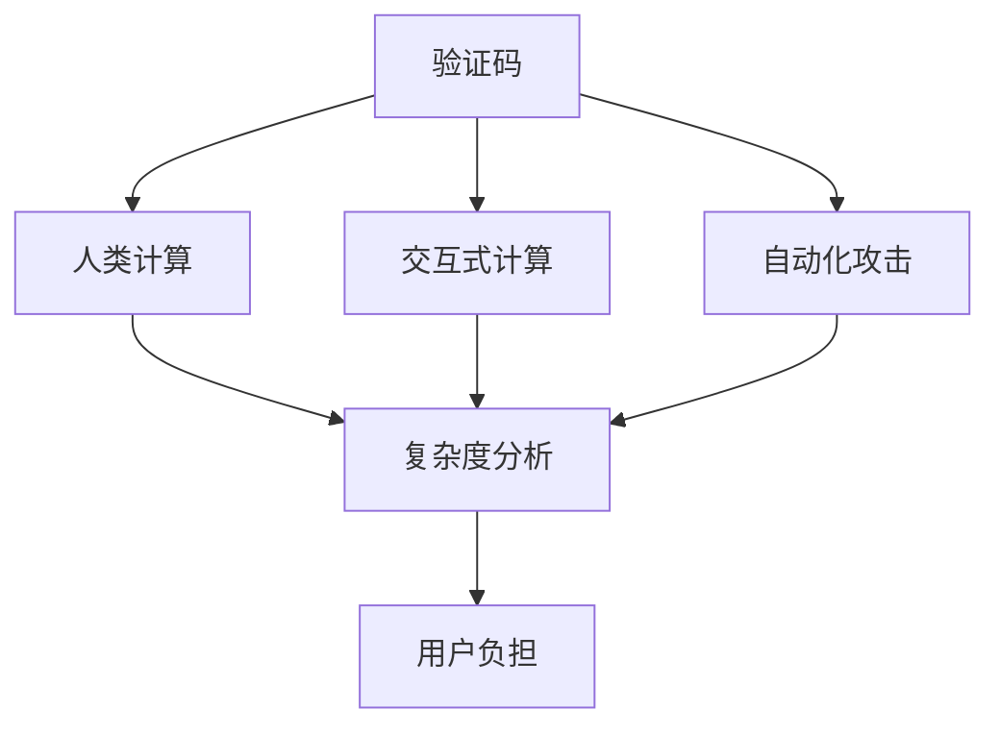

                 

# 验证码的背后：人类计算的另类应用

## 1. 背景介绍

### 1.1 问题由来
随着互联网的迅猛发展，在线服务变得越来越普遍。为了防范自动化攻击，确保账户安全，网站往往需要用户在注册、登录等操作中完成一定的“人机验证”。最常见的形式就是验证码（Captcha）。验证码本质上是一种交互式的计算难题，旨在要求用户进行一种复杂度超出自动化程序的计算。这不仅是一种安全机制，也体现了计算机科学中的“人类计算”思想。

### 1.2 问题核心关键点
验证码的核心关键点在于其设计需要平衡两个目标：一是能够有效阻止自动化攻击，二是不给人类用户带来太大的负担。这要求验证码既要具有足够的计算难度，又不至于过于复杂，影响用户体验。

### 1.3 问题研究意义
研究验证码背后的原理，不仅有助于理解“人类计算”的思想，还能为设计更高效、更人性化的验证码提供理论基础。验证码的优化可以提升网站的安全性，同时改善用户体验，促进网络服务的普及和应用。

## 2. 核心概念与联系

### 2.1 核心概念概述

为了更好地理解验证码背后的原理，本节将介绍几个关键概念：

- 验证码（Captcha）：通常指在网站注册、登录等过程中，用户需要完成的一种计算难题，以验证其是否为真人。

- 人类计算（Human Computation）：指利用人类的计算能力，解决自动化程序难以解决的复杂问题。验证码即是一种典型的人类计算应用。

- 交互式计算（Interactive Computation）：指要求用户与系统进行交互，完成特定计算的计算难题。验证码通常具有较强的交互性。

- 自动化攻击（Automated Attacks）：指通过自动化脚本或程序，尝试绕过安全机制，进行恶意操作的攻击手段。验证码可以有效防范这种攻击。

- 复杂度分析（Complexity Analysis）：用于评估计算问题的难度，区分其是否可以被自动化程序解决。

- 用户负担（User Burden）：指用户完成计算所需的时间和精力，验证码需要兼顾这一因素，避免给用户带来不必要的麻烦。

这些概念共同构成了验证码的设计和应用框架，使其能够在安全与用户体验之间找到平衡。

### 2.2 核心概念原理和架构的 Mermaid 流程图


这个流程图展示了验证码与人类计算、交互式计算、自动化攻击、复杂度分析和用户负担之间的关系。验证码的设计需要综合考虑这些因素，以确保其既安全又人性化。

## 3. 核心算法原理 & 具体操作步骤
### 3.1 算法原理概述

验证码的核心算法原理主要基于以下几个方面：

- **复杂性设计**：要求验证码的计算难度超出自动化程序的解决能力，但同时要避免过于复杂，影响用户体验。
- **交互性要求**：要求用户与系统进行交互，完成计算，这可以通过输入特定字符、解数学方程等方式实现。
- **安全性保障**：验证码应能够有效防范自动化攻击，确保其安全性。
- **性能优化**：验证码的设计需要兼顾计算难度和用户负担，避免给用户带来不必要的麻烦。

### 3.2 算法步骤详解

下面详细介绍验证码的设计和实现步骤：

**Step 1: 设计计算难题**
- 选择合适的计算难题，如数学问题、文字识别、图像处理等。
- 确保难题的计算复杂度超出自动化程序的解决能力。

**Step 2: 生成验证码图像**
- 根据计算难题，生成验证码图像。通常使用基于字符、数字、符号等的图像生成算法。
- 图像需要包含足够的细节和干扰信息，以增加计算难度。

**Step 3: 定义识别任务**
- 定义用户需要完成的识别任务，如选择数字、阅读并输入字符串等。
- 确保任务与生成的验证码图像紧密相关，避免无关任务的引入。

**Step 4: 验证用户答案**
- 接收用户输入的答案。
- 使用事先定义好的验证算法，检查用户答案是否正确。

**Step 5: 反馈结果**
- 根据用户答案的验证结果，给出相应的提示，如“输入正确”或“输入错误”。
- 记录用户尝试次数，防止恶意攻击。

### 3.3 算法优缺点

验证码算法具有以下优点：

- **安全性高**：通过设计复杂的计算难题，可以有效防范自动化攻击。
- **成本低廉**：相较于其他安全机制，验证码实现简单，成本较低。
- **易于扩展**：随着技术的发展，验证码算法不断改进，可以适应更多的应用场景。

同时，验证码算法也存在一些局限性：

- **用户体验差**：过于复杂的验证码可能给用户带来较大的负担，影响用户体验。
- **防御能力有限**：虽然验证码可以有效防范自动化攻击，但对于复杂的社交工程攻击，其防御能力有限。
- **算法多样性不足**：目前常见的验证码算法相对单一，容易被攻击者攻破。

### 3.4 算法应用领域

验证码算法在多个领域得到广泛应用，包括但不限于：

- **网站登录与注册**：验证用户的真实性，防止自动化脚本注册账户。
- **支付系统**：防止恶意自动化程序进行欺诈交易。
- **金融交易**：确保用户进行合法交易，防止欺诈。
- **在线广告**：验证用户是否为真人，防止自动化程序点击广告。
- **在线测试**：验证用户是否为真实考生，防止作弊。

## 4. 数学模型和公式 & 详细讲解 & 举例说明

### 4.1 数学模型构建

验证码的设计涉及到数学模型的构建。以一个简单的验证码为例，其数学模型可以表示为：

$$
\text{Captcha} = f(x, y, z)
$$

其中，$x, y, z$ 分别代表计算难题的三个部分，$f$ 代表计算函数。设计验证码时，需要考虑以下因素：

- $x$ 的复杂度，确保其超出自动化程序的解决能力。
- $y$ 的干扰性，确保用户需要仔细观察图像才能识别。
- $z$ 的准确性，确保用户输入的答案是正确的。

### 4.2 公式推导过程

以一个简单的数字识别验证码为例，其推导过程如下：

1. **复杂度设计**：选择一个两位数字 $x$，如 $43$。
2. **图像生成**：使用计算机图像生成算法，生成包含数字 $43$ 的验证码图像。
3. **任务定义**：用户需要读取并输入验证码数字 $x$。
4. **答案验证**：将用户输入的数字 $y$ 与 $x$ 进行比较，判断是否正确。

### 4.3 案例分析与讲解

以一个典型的文字识别验证码为例，分析其设计过程：

1. **复杂度设计**：选择一个简单的单词，如 "banana"。
2. **图像生成**：使用计算机图像生成算法，将单词 "banana" 转化为不规则、模糊的图像。
3. **任务定义**：用户需要识别并输入单词 "banana"。
4. **答案验证**：将用户输入的字符串与 "banana" 进行比较，判断是否正确。

## 5. 项目实践：代码实例和详细解释说明
### 5.1 开发环境搭建

在进行验证码实践前，我们需要准备好开发环境。以下是使用Python进行OpenCV和Tesseract库开发的Python环境配置流程：

1. 安装Anaconda：从官网下载并安装Anaconda，用于创建独立的Python环境。

2. 创建并激活虚拟环境：
```bash
conda create -n captcha-env python=3.8 
conda activate captcha-env
```

3. 安装OpenCV和Tesseract：
```bash
conda install opencv-python tesserocr
```

4. 安装PyTorch和其他相关工具包：
```bash
pip install numpy pandas scikit-learn matplotlib torch torchvision
```

完成上述步骤后，即可在`captcha-env`环境中开始验证码实践。

### 5.2 源代码详细实现

下面给出使用Python和OpenCV、Tesseract库实现文字识别验证码的代码实现。

```python
import cv2
import pytesseract
from PIL import Image
import numpy as np
import os

# 图片生成函数
def generate_captcha():
    text = "banana"
    image_size = (300, 100)
    font = cv2.FONT_HERSHEY_SIMPLEX
    font_size = 40
    
    # 在黑色背景上生成文字图像
    image = np.zeros(image_size, np.uint8)
    cv2.putText(image, text, (25, 50), font, font_size, (255, 255, 255), 2)
    
    # 添加噪声
    image += np.random.randint(0, 255, size=image_size, dtype=np.uint8)
    image = cv2.medianBlur(image, 3)
    
    # 二值化处理
    _, binary_image = cv2.threshold(image, 100, 255, cv2.THRESH_BINARY)
    binary_image = cv2.dilate(binary_image, None, iterations=3)
    
    # 保存图像
    cv2.imwrite("captcha.png", binary_image)

# 文字识别函数
def recognize_captcha():
    image_path = "captcha.png"
    # 读取图像
    image = cv2.imread(image_path)
    # 预处理图像
    gray_image = cv2.cvtColor(image, cv2.COLOR_BGR2GRAY)
    _, binary_image = cv2.threshold(gray_image, 100, 255, cv2.THRESH_BINARY)
    binary_image = cv2.dilate(binary_image, None, iterations=3)
    # 使用Tesseract识别文本
    text = pytesseract.image_to_string(binary_image, lang="eng")
    print(text)

# 运行程序
generate_captcha()
recognize_captcha()
```

### 5.3 代码解读与分析

让我们再详细解读一下关键代码的实现细节：

**generate_captcha函数**：
- 定义一个简单的字符串 "banana" 作为验证码文本。
- 生成一个大小为 $(300, 100)$ 的黑色背景图像。
- 在图像中心位置绘制验证码文本，并添加适当的噪声和二值化处理。
- 保存生成的验证码图像。

**recognize_captcha函数**：
- 读取生成的验证码图像。
- 进行预处理，包括灰度化、二值化等操作。
- 使用Tesseract库识别图像中的文字，并输出结果。

代码实现相对简单，但关键在于理解验证码的复杂度和干扰度的设计，以及如何利用图像处理和OCR技术实现文字识别。

## 6. 实际应用场景
### 6.1 网站登录与注册

网站登录与注册时，通常需要用户完成一个简单的数学问题或图像识别任务，如输入验证码。这不仅可以验证用户的真实性，还可以防止自动化脚本进行恶意注册。

### 6.2 支付系统

在支付系统中，验证码用于验证用户的身份和交易意图，防止欺诈行为。通过设计复杂的计算难题，可以有效防范自动化攻击。

### 6.3 金融交易

金融交易中，验证码用于确认用户身份和交易合法性。通过文字识别和数字识别技术，可以有效防范自动化攻击，保护用户资金安全。

### 6.4 在线广告

在线广告平台使用验证码验证用户是否为真人，防止自动化脚本点击广告，保护广告主和平台利益。

### 6.5 在线测试

在线测试平台使用验证码验证考生身份，防止作弊行为，确保测试的公正性和准确性。

## 7. 工具和资源推荐
### 7.1 学习资源推荐

为了帮助开发者掌握验证码的设计和实现，推荐以下学习资源：

1. **《OpenCV官方文档》**：详细介绍了OpenCV库的使用方法和图像处理算法，是学习验证码生成的重要参考。
2. **《Python机器学习》**：涵盖Python在图像处理、OCR等领域的常用技术和算法，推荐给初学者。
3. **《深度学习入门》**：介绍深度学习在图像识别、自然语言处理等领域的实践应用，推荐给进阶开发者。
4. **《Tesseract官方文档》**：详细介绍了Tesseract库的使用方法和文字识别算法，是学习OCR技术的重要资源。

### 7.2 开发工具推荐

高效的工具可以提高验证码的开发效率。以下是几款常用的开发工具：

1. **Python**：以其简洁易用的语法和丰富的第三方库，成为验证码开发的首选语言。
2. **OpenCV**：用于图像处理和计算机视觉任务的强大库，适合生成复杂的验证码图像。
3. **Tesseract**：开源OCR引擎，支持多种文字识别任务，适合文字识别的验证码设计。
4. **PyTorch**：深度学习框架，适合设计和训练复杂的验证码识别算法。
5. **TensorBoard**：可视化工具，可以实时监测模型训练状态，优化验证码生成和识别效果。

### 7.3 相关论文推荐

验证码技术的发展离不开学界的持续研究。以下是几篇相关论文，推荐阅读：

1. **《CAPTCHA: The Good, the Bad, and the Ugly》**：介绍验证码的历史和现状，分析其优缺点，适合了解验证码的基础知识。
2. **《Human+Machine: Learning to Solve CAPTCHAs with Transfer Learning》**：提出基于迁移学习的验证码生成和识别方法，适合研究验证码生成和识别的最新进展。
3. **《CAPTCHA Solver: A Challenge for a Framework for Program Synthesis》**：介绍使用程序合成技术解决验证码的方案，适合探索验证码的新方法和新思路。

## 8. 总结：未来发展趋势与挑战
### 8.1 研究成果总结

验证码技术在保障网络安全方面发挥了重要作用，但同时面临着用户体验差、防御能力有限等问题。未来，验证码需要在安全性和用户体验之间找到更好的平衡点。

### 8.2 未来发展趋势

1. **多模态验证码**：结合图像、文本、声音等多种模态，提升验证码的复杂度和安全性。
2. **基于AI的验证码**：利用机器学习和深度学习技术，自动化生成和验证验证码。
3. **交互式验证码**：设计更加多样化的交互任务，防止自动化脚本攻击。
4. **用户行为分析**：结合用户行为分析，进一步提高验证码的安全性和用户体验。

### 8.3 面临的挑战

验证码设计中仍面临诸多挑战：

1. **用户体验**：过于复杂的验证码可能给用户带来负担，影响用户体验。
2. **防御能力**：自动化脚本和高级攻击手段不断涌现，验证码的防御能力需要不断提升。
3. **算法多样性**：当前验证码算法相对单一，容易被攻破。

### 8.4 研究展望

未来，验证码研究需要在以下几个方面寻求新的突破：

1. **多模态验证码**：结合图像、文本、声音等多种模态，提升验证码的复杂度和安全性。
2. **基于AI的验证码**：利用机器学习和深度学习技术，自动化生成和验证验证码。
3. **交互式验证码**：设计更加多样化的交互任务，防止自动化脚本攻击。
4. **用户行为分析**：结合用户行为分析，进一步提高验证码的安全性和用户体验。

通过这些研究，验证码技术将能够更好地适应不断变化的网络环境，保障网络安全，提升用户体验。

## 9. 附录：常见问题与解答

**Q1: 验证码的设计需要考虑哪些因素？**

A: 验证码的设计需要考虑以下几个因素：
1. 复杂度：确保验证码的计算难度超出自动化程序的解决能力。
2. 干扰性：增加图像的噪声和干扰信息，增加用户识别难度。
3. 准确性：确保用户输入的答案是正确的。
4. 易用性：避免过于复杂的验证码给用户带来负担。

**Q2: 验证码的生成和识别有哪些常用方法？**

A: 验证码的生成和识别方法包括以下几种：
1. 图像生成：使用OpenCV等库生成包含文字、数字、符号等的图像。
2. 文字识别：使用Tesseract等OCR引擎识别图像中的文字。
3. 数字识别：使用深度学习模型（如CNN）识别图像中的数字。
4. 图像处理：使用图像处理技术增加验证码的干扰性和复杂度。

**Q3: 验证码在实际应用中面临哪些挑战？**

A: 验证码在实际应用中面临以下挑战：
1. 用户体验：过于复杂的验证码可能给用户带来负担，影响用户体验。
2. 防御能力：自动化脚本和高级攻击手段不断涌现，验证码的防御能力需要不断提升。
3. 算法多样性：当前验证码算法相对单一，容易被攻破。

**Q4: 如何提高验证码的安全性和用户体验？**

A: 提高验证码的安全性和用户体验可以采取以下措施：
1. 设计更加复杂和多样化的验证码，防止自动化脚本攻击。
2. 使用多模态验证码，结合图像、文本、声音等多种模态，提升验证码的复杂度和安全性。
3. 结合用户行为分析，进一步提高验证码的安全性和用户体验。

---

作者：禅与计算机程序设计艺术 / Zen and the Art of Computer Programming

