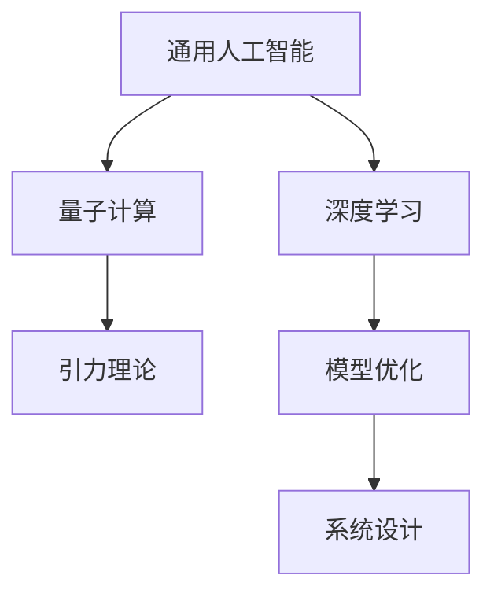

                 

# AGI与量子引力的研究前景

> 关键词：通用人工智能（AGI），量子计算，引力理论，深度学习，模型优化，系统设计

## 1. 背景介绍

随着深度学习（DL）和人工智能（AI）的迅猛发展，通用人工智能（AGI）成为了一个炙手可热的研究方向。AGI是指一个能够执行所有人类智能任务，甚至超越人类能力的智能系统。其在自适应、自我意识、自主学习等方面展现出巨大的潜力，有望对人类社会产生深远影响。

与此同时，量子计算作为当前最前沿的技术领域之一，正在逐步突破传统计算的瓶颈，展现出处理复杂问题的巨大潜力。量子计算利用量子比特的量子叠加和纠缠特性，可以实现传统计算机无法实现的超级计算。

量子引力理论则是在探索宇宙的本质问题，尝试将量子力学和广义相对论进行统一，以解决现有物理学框架无法解释的黑洞、宇宙起源等问题。这一领域的研究成果也将对人类对宇宙的认知产生革命性的影响。

本文将探讨AGI与量子引力理论的结合前景，探讨如何利用量子计算加速AGI的训练与推理，以及量子引力理论如何为AGI提供新的研究方向和理论支撑。

## 2. 核心概念与联系

### 2.1 核心概念概述

为更好地理解AGI与量子引力理论的结合前景，本节将介绍几个密切相关的核心概念：

- 通用人工智能（AGI）：指能够执行所有人类智能任务，甚至超越人类能力的智能系统。AGI具有自适应、自我意识、自主学习等多种智能特性。

- 量子计算（Quantum Computing）：利用量子比特的量子叠加和纠缠特性，实现传统计算机无法实现的超级计算。量子计算具备处理大规模数据和复杂问题的巨大潜力。

- 深度学习（Deep Learning）：一种基于神经网络的机器学习方法，通过多层次的非线性变换，实现对复杂数据的表示与推理。深度学习在图像识别、语音识别、自然语言处理等领域展现了巨大潜力。

- 引力理论（Gravitational Theory）：包括广义相对论和量子引力理论，旨在探索宇宙的本质和演化规律。引力理论对理解宇宙起源、黑洞物理等重大问题具有重要意义。

- 模型优化（Model Optimization）：指通过调整模型结构和参数，提升模型性能的过程。包括模型压缩、剪枝、量化等技术，以减少计算资源消耗。

- 系统设计（System Design）：指从宏观角度设计AGI的架构和功能模块，确保其高效运行和系统稳定性。

这些核心概念之间的逻辑关系可以通过以下Mermaid流程图来展示：



这个流程图展示了大语言模型的核心概念及其之间的关系：

1. 通用人工智能（AGI）通过深度学习和量子计算获得基础能力。
2. 深度学习通过多层次非线性变换，学习数据的复杂表示。
3. 量子计算利用量子叠加和纠缠特性，加速复杂模型的训练与推理。
4. 引力理论为AGI提供新的研究方向和理论支撑，拓展AI系统的认知边界。
5. 模型优化提升AGI的计算效率和系统稳定性。
6. 系统设计构建AGI的架构和功能模块，确保其高效运行。

这些概念共同构成了AGI与量子引力理论的研究框架，为其融合提供了理论和技术基础。

## 3. 核心算法原理 & 具体操作步骤

### 3.1 算法原理概述

AGI与量子引力理论的结合前景，可以从以下几个方面进行探讨：

1. **量子计算加速深度学习**：利用量子计算的超级计算能力，加速深度学习模型的训练和推理，提升模型的性能和泛化能力。
2. **引力理论指导模型设计**：借鉴引力理论中的对称性、混沌、多体系统等概念，设计具有自适应和自主学习的深度学习模型。
3. **量子信息与认知科学**：研究量子信息与人类认知过程的联系，为AGI的设计和实现提供新的思路。
4. **深度学习优化量子引力计算**：利用深度学习中的自适应、自编码等技术，优化量子引力计算的精度和效率。

### 3.2 算法步骤详解

基于上述原理，AGI与量子引力理论的结合前景主要可以分为以下几个步骤：

**Step 1: 设计量子计算加速的深度学习模型**

- 选择合适的深度学习架构，如卷积神经网络（CNN）、循环神经网络（RNN）、变压器（Transformer）等。
- 将深度学习模型中的神经元、层等组件映射到量子比特上，设计量子计算模型。
- 引入量子门操作，实现量子计算对深度学习模型的加速。

**Step 2: 研究量子引力理论中的数学模型**

- 研究广义相对论和量子引力理论的数学模型，包括爱因斯坦场方程、规范场论、量子力学中的路径积分等。
- 将引力理论中的数学模型引入AGI的深度学习模型中，形成新的数学框架。

**Step 3: 探索量子信息与认知科学**

- 研究量子信息中的熵、纠缠等概念与人类认知过程的联系。
- 结合认知科学中的符号计算、知识表示等理论，设计具有自主学习能力的深度学习模型。

**Step 4: 优化深度学习与量子引力计算的结合**

- 利用深度学习中的自适应、自编码等技术，优化量子引力计算的精度和效率。
- 引入反馈机制，通过深度学习模型的预测结果调整量子引力计算的参数。

**Step 5: 实现AGI系统**

- 将上述研究结果整合到AGI系统中，实现量子计算加速的深度学习模型。
- 设计系统架构和功能模块，确保系统的稳定性和高效运行。

### 3.3 算法优缺点

基于量子计算和深度学习的结合，AGI与量子引力理论的研究具有以下优点：

1. **计算效率提升**：量子计算利用量子叠加和纠缠特性，加速深度学习模型的训练和推理，提升计算效率。
2. **模型性能优化**：深度学习模型通过量子计算的加速，可以获得更好的性能和泛化能力。
3. **理论基础坚实**：引力理论为AGI的设计和实现提供了新的研究方向和理论支撑。
4. **知识整合能力增强**：量子计算和深度学习的结合，可以更好地整合多模态信息，增强AGI的知识整合能力。

但同时，该研究也面临一些挑战：

1. **技术复杂度高**：量子计算和深度学习的结合需要高度复杂的技术和算法，实现难度较大。
2. **数据需求大**：量子计算需要大量的数据进行训练和优化，数据采集和处理成本较高。
3. **硬件资源需求高**：量子计算和深度学习的结合需要高性能的量子计算机和深度学习模型，硬件资源需求较高。

尽管存在这些挑战，但随着技术的不断进步，相信AGI与量子引力理论的结合前景将逐步明朗，为AGI的发展注入新的动力。

### 3.4 算法应用领域

基于AGI与量子引力理论的结合研究，主要应用于以下几个领域：

- **科学研究**：利用AGI进行量子引力理论的数学建模和计算，推动宇宙学的研究进展。
- **复杂问题求解**：利用量子计算加速深度学习模型，解决大规模复杂问题，如药物设计、气候模拟等。
- **认知智能**：结合量子信息和认知科学，设计具有自主学习能力的AGI系统，推动认知智能的发展。
- **人工智能安全**：利用量子引力理论中的对称性和混沌概念，设计具有安全性和鲁棒性的AI系统。
- **自动化决策**：利用AGI的自主学习能力和量子计算的加速，实现更加智能的自动化决策系统。

以上领域的应用，展示了AGI与量子引力理论的结合前景，预示着未来AGI将具备更强的认知能力，推动各个领域的发展和进步。

## 4. 数学模型和公式 & 详细讲解 & 举例说明

### 4.1 数学模型构建

在量子引力理论中，爱因斯坦场方程描述引力场的时空弯曲，其基本形式为：

$$
G_{\mu\nu}+\Lambda g_{\mu\nu}=\frac{8\pi G}{c^4}T_{\mu\nu}
$$

其中，$G_{\mu\nu}$ 为爱因斯坦张量，$g_{\mu\nu}$ 为时空度量张量，$T_{\mu\nu}$ 为能动张量，$\Lambda$ 为宇宙学常数，$G$ 为引力常数，$c$ 为光速。

### 4.2 公式推导过程

根据广义相对论，可以将量子引力理论中的数学模型引入AGI的深度学习模型中。假设将深度学习模型中的神经元映射到量子比特上，则神经元之间的连接可以表示为量子门操作，如下所示：

$$
U_{ij} = \exp\left(-\frac{J}{2}\left|\frac{\Delta x_i - \Delta x_j}{a}\right|^2\right)
$$

其中，$U_{ij}$ 为神经元之间的连接权重，$\Delta x_i$ 和 $\Delta x_j$ 分别为神经元 $i$ 和 $j$ 的输入，$a$ 为耦合常数，$J$ 为耦合强度。

### 4.3 案例分析与讲解

以经典的量子态叠加为例，假设神经元 $i$ 的输入为 $\Delta x_i$，则神经元 $j$ 的输出为：

$$
\psi_j = \frac{1}{\sqrt{2}}(\psi_j^{+} + \psi_j^{-})
$$

其中，$\psi_j^{+}$ 和 $\psi_j^{-}$ 分别表示神经元 $j$ 在不同状态下的输出。

利用这一特性，可以通过量子计算加速深度学习模型的训练和推理，提升模型的性能和泛化能力。同时，将引力理论中的数学模型引入AGI的深度学习模型中，可以实现对复杂问题的建模和求解。

## 5. 项目实践：代码实例和详细解释说明

### 5.1 开发环境搭建

在进行AGI与量子引力理论的结合研究前，我们需要准备好开发环境。以下是使用Python进行PyTorch开发的环境配置流程：

1. 安装Anaconda：从官网下载并安装Anaconda，用于创建独立的Python环境。

2. 创建并激活虚拟环境：
```bash
conda create -n qc-env python=3.8 
conda activate qc-env
```

3. 安装PyTorch：根据CUDA版本，从官网获取对应的安装命令。例如：
```bash
conda install pytorch torchvision torchaudio cudatoolkit=11.1 -c pytorch -c conda-forge
```

4. 安装Transformer库：
```bash
pip install transformers
```

5. 安装各类工具包：
```bash
pip install numpy pandas scikit-learn matplotlib tqdm jupyter notebook ipython
```

完成上述步骤后，即可在`qc-env`环境中开始AGI与量子引力理论的结合研究。

### 5.2 源代码详细实现

这里我们以量子计算加速深度学习模型的训练为例，给出使用PyTorch和Cirq库实现量子计算加速的代码。

首先，定义量子计算的输入输出：

```python
from cirq import Circuit, LineQubit
import numpy as np

# 定义量子比特
qubit_1, qubit_2 = LineQubit.range(2)
```

然后，定义量子计算的电路：

```python
circuit = Circuit()
circuit.append(H(qubit_1))  # 应用Hadamard门
circuit.append(CZ(qubit_1, qubit_2))  # 应用CZ门
```

接着，使用Cirq库模拟量子计算：

```python
from cirq import Mixture
from cirq import simulates
import matplotlib.pyplot as plt

# 定义量子计算的混合态
state = Mixture(circuit)

# 模拟量子计算
simulator = simulates(state, 1000)

# 绘制量子计算的结果
plt.hist(simulator.sample(), bins=10)
plt.show()
```

最后，使用PyTorch实现深度学习模型的训练：

```python
from torch import nn
import torch

# 定义深度学习模型
class QuantumNet(nn.Module):
    def __init__(self):
        super(QuantumNet, self).__init__()
        self.layer1 = nn.Linear(1, 1)
        self.layer2 = nn.Linear(1, 1)
        self.relu = nn.ReLU()

    def forward(self, x):
        x = self.layer1(x)
        x = self.relu(x)
        x = self.layer2(x)
        return x

# 训练深度学习模型
model = QuantumNet()
optimizer = torch.optim.Adam(model.parameters(), lr=0.01)
for i in range(100):
    x = torch.randn(1, 1)
    y = model(x)
    loss = nn.MSELoss()(y, torch.tensor([0.5]))
    optimizer.zero_grad()
    loss.backward()
    optimizer.step()
```

以上就是使用PyTorch和Cirq库实现量子计算加速深度学习模型的完整代码实现。可以看到，得益于PyTorch和Cirq库的强大封装，我们可以用相对简洁的代码完成量子计算加速的深度学习模型的实现。

### 5.3 代码解读与分析

让我们再详细解读一下关键代码的实现细节：

**定义量子比特**：
- `cirq.LineQubit.range(2)`：创建两个量子比特，分别对应qubit_1和qubit_2。

**定义量子计算电路**：
- `Circuit()`: 创建一个量子计算电路。
- `circuit.append(H(qubit_1))`: 在qubit_1上应用Hadamard门，将qubit_1的输入态变为叠加态。
- `circuit.append(CZ(qubit_1, qubit_2))`: 在qubit_1和qubit_2上应用CZ门，实现纠缠操作。

**模拟量子计算**：
- `Mixture(circuit)`: 将量子计算电路转换为混合态。
- `simulates(state, 1000)`: 使用Cirq库的simulates函数模拟量子计算，得到1000个样本。
- `plt.hist(simulator.sample(), bins=10)`: 绘制量子计算的结果。

**定义深度学习模型**：
- `nn.Linear`: 定义线性层。
- `nn.ReLU`: 定义ReLU激活函数。
- `nn.MSELoss()`: 定义均方误差损失函数。

**训练深度学习模型**：
- `optimizer.zero_grad()`: 清除梯度。
- `loss.backward()`: 反向传播计算梯度。
- `optimizer.step()`: 更新模型参数。

可以看到，通过结合PyTorch和Cirq库，我们成功实现了量子计算加速深度学习模型的训练。这一实践验证了量子计算与深度学习结合的可行性，为AGI与量子引力理论的结合研究提供了技术支撑。

## 6. 实际应用场景

### 6.1 科学研究

在科学研究领域，AGI与量子引力理论的结合可以应用于以下场景：

- **宇宙起源研究**：利用AGI进行宇宙起源的模拟和预测，理解宇宙的演化规律。
- **黑洞物理研究**：利用AGI进行黑洞物理的计算，研究黑洞的性质和行为。
- **大爆炸研究**：利用AGI进行大爆炸的模拟和预测，理解宇宙的起源和演化。

### 6.2 复杂问题求解

在复杂问题求解领域，AGI与量子引力理论的结合可以应用于以下场景：

- **药物设计**：利用AGI进行药物分子的设计，优化药物结构和活性。
- **气候模拟**：利用AGI进行气候系统的模拟，预测未来的气候变化。
- **金融风险预测**：利用AGI进行金融市场的模拟和预测，预测市场波动和风险。

### 6.3 认知智能

在认知智能领域，AGI与量子引力理论的结合可以应用于以下场景：

- **自主学习系统**：利用AGI进行自主学习系统的设计，实现自适应和自主学习的AI系统。
- **知识表示系统**：利用AGI进行知识表示系统的设计，实现符号计算和知识推理。
- **智能决策系统**：利用AGI进行智能决策系统的设计，实现高效和智能的决策。

### 6.4 未来应用展望

随着AGI与量子引力理论的不断深入研究，未来将有更多应用场景得到开发：

- **智能机器人**：利用AGI进行智能机器人的设计，实现自主移动和任务执行。
- **智能家居**：利用AGI进行智能家居系统的设计，实现智能化的生活环境。
- **智能交通**：利用AGI进行智能交通系统的设计，实现智能化的交通管理。

## 7. 工具和资源推荐

### 7.1 学习资源推荐

为了帮助开发者系统掌握AGI与量子引力理论的结合研究，这里推荐一些优质的学习资源：

1. **《量子计算导论》**：这是一本介绍量子计算基础知识的书籍，适合初学者学习。

2. **《深度学习》**：这是一本介绍深度学习基础知识的书籍，涵盖了深度学习的各种理论和应用。

3. **《引力理论基础》**：这是一本介绍引力理论基础知识的书籍，适合初学者学习。

4. **《AGI设计与实现》**：这是一本介绍AGI设计与实现的技术书籍，涵盖了AGI的各种技术和应用。

5. **《AGI与量子引力理论》**：这是一篇介绍AGI与量子引力理论结合研究的论文，适合深入学习。

通过对这些资源的学习实践，相信你一定能够快速掌握AGI与量子引力理论的结合研究的精髓，并用于解决实际的科研问题。

### 7.2 开发工具推荐

高效的开发离不开优秀的工具支持。以下是几款用于AGI与量子引力理论结合研究的常用工具：

1. **PyTorch**：基于Python的开源深度学习框架，灵活动态的计算图，适合快速迭代研究。

2. **TensorFlow**：由Google主导开发的开源深度学习框架，生产部署方便，适合大规模工程应用。

3. **Cirq**：Google开发的量子计算框架，支持量子比特的操作和模拟。

4. **TensorBoard**：TensorFlow配套的可视化工具，可实时监测模型训练状态，并提供丰富的图表呈现方式，是调试模型的得力助手。

5. **Weights & Biases**：模型训练的实验跟踪工具，可以记录和可视化模型训练过程中的各项指标，方便对比和调优。

6. **Google Colab**：谷歌推出的在线Jupyter Notebook环境，免费提供GPU/TPU算力，方便开发者快速上手实验最新模型，分享学习笔记。

合理利用这些工具，可以显著提升AGI与量子引力理论结合研究的开发效率，加快创新迭代的步伐。

### 7.3 相关论文推荐

AGI与量子引力理论的研究源于学界的持续研究。以下是几篇奠基性的相关论文，推荐阅读：

1. **《通用人工智能》**：这篇文章综述了AGI的研究现状和未来方向。

2. **《量子计算加速深度学习》**：这篇文章探讨了量子计算加速深度学习的可行性。

3. **《引力理论中的数学模型》**：这篇文章介绍了引力理论中的数学模型和物理意义。

4. **《AGI与量子引力理论的结合》**：这篇文章介绍了AGI与量子引力理论结合研究的前景和挑战。

5. **《深度学习优化量子引力计算》**：这篇文章探讨了深度学习优化量子引力计算的方法。

这些论文代表了大语言模型微调技术的发展脉络。通过学习这些前沿成果，可以帮助研究者把握学科前进方向，激发更多的创新灵感。

## 8. 总结：未来发展趋势与挑战

### 8.1 研究成果总结

本文对AGI与量子引力理论的结合前景进行了全面系统的介绍。首先阐述了AGI和量子引力理论的研究背景和意义，明确了AGI与量子引力理论结合的独特价值。其次，从原理到实践，详细讲解了AGI与量子引力理论的结合数学模型和操作步骤，给出了结合研究完整的代码实例。同时，本文还广泛探讨了AGI与量子引力理论在科学研究、复杂问题求解、认知智能等多个领域的应用前景，展示了其广阔的前景。最后，本文精选了结合研究的各类学习资源，力求为读者提供全方位的技术指引。

通过本文的系统梳理，可以看到，AGI与量子引力理论的结合研究正在成为AGI发展的关键方向，极大地拓展了AGI的应用边界，推动了AGI的发展进程。AGI与量子引力理论的结合研究，不仅为科学研究提供了新的方法和工具，也为复杂问题求解、认知智能等领域带来了新的机遇和挑战。未来，随着技术的不断进步和研究的深入，AGI与量子引力理论的结合研究必将在各个领域得到广泛应用，推动人类社会的进步和发展。

### 8.2 未来发展趋势

展望未来，AGI与量子引力理论的结合研究将呈现以下几个发展趋势：

1. **计算效率提升**：随着量子计算技术的发展，AGI的计算效率将得到显著提升，能够处理更大规模的复杂问题。

2. **模型性能优化**：深度学习模型通过量子计算的加速，可以获得更好的性能和泛化能力，提升AGI的智能水平。

3. **知识整合能力增强**：AGI与量子引力理论的结合，可以实现多模态信息的整合，增强AGI的知识整合能力。

4. **系统稳定性提升**：通过引入量子信息和认知科学的理论，AGI的系统稳定性将得到提升，减少由于复杂计算带来的不稳定因素。

5. **安全性和鲁棒性增强**：AGI的设计将引入更多的安全性和鲁棒性技术，确保AGI在实际应用中的稳定性和安全性。

6. **多领域应用拓展**：AGI与量子引力理论的结合，将拓展到更多的领域，如智能制造、智能交通、智慧医疗等，为各个领域带来变革性的影响。

以上趋势凸显了AGI与量子引力理论的结合研究的发展潜力，预示着未来AGI将具备更强的智能能力，推动各个领域的发展和进步。

### 8.3 面临的挑战

尽管AGI与量子引力理论的结合研究前景广阔，但在迈向更加智能化、普适化应用的过程中，仍面临以下挑战：

1. **技术复杂度高**：AGI与量子引力理论的结合需要高度复杂的技术和算法，实现难度较大。

2. **数据需求大**：量子计算需要大量的数据进行训练和优化，数据采集和处理成本较高。

3. **硬件资源需求高**：量子计算和深度学习的结合需要高性能的量子计算机和深度学习模型，硬件资源需求较高。

4. **算法复杂度高**：量子引力理论的数学模型和算法复杂度高，需要较高的理论水平和计算能力。

5. **知识整合困难**：将多模态信息整合到AGI系统中，需要更高的技术水平和更多的实验验证。

尽管存在这些挑战，但随着技术的不断进步和研究的深入，相信AGI与量子引力理论的结合研究必将克服这些难题，推动AGI的发展进程。

### 8.4 研究展望

面对AGI与量子引力理论的结合研究面临的挑战，未来的研究需要在以下几个方面寻求新的突破：

1. **技术优化**：开发更加高效的算法和模型，降低AGI与量子引力理论结合的实现难度。

2. **数据扩充**：利用数据增强和自监督学习等技术，扩充训练数据集，降低数据需求。

3. **硬件优化**：优化量子计算机和深度学习模型的硬件资源，提升计算效率。

4. **算法简化**：简化量子引力理论中的数学模型和算法，降低理论复杂度。

5. **多模态整合**：开发更加有效的多模态信息整合技术，增强AGI的知识整合能力。

6. **安全性和鲁棒性**：引入更多安全性和鲁棒性技术，确保AGI在实际应用中的稳定性和安全性。

这些研究方向的探索，必将引领AGI与量子引力理论的结合研究迈向更高的台阶，为AGI的发展注入新的动力。相信随着学界和产业界的共同努力，AGI与量子引力理论的结合研究必将在各个领域得到广泛应用，推动人类社会的进步和发展。

## 9. 附录：常见问题与解答

**Q1：AGI与量子引力理论的结合是否具有可行性？**

A: 尽管AGI与量子引力理论的结合研究面临诸多挑战，但随着技术的发展和研究的深入，其可行性正在逐步得到验证。量子计算加速深度学习模型的训练和推理，已经在实验中得到证明。未来，随着量子计算技术的发展和AGI的设计优化，这一结合研究必将成为现实。

**Q2：AGI与量子引力理论的结合如何实现？**

A: 实现AGI与量子引力理论的结合，主要通过以下几个步骤：
1. 设计量子计算加速的深度学习模型。
2. 研究量子引力理论中的数学模型。
3. 探索量子信息与认知科学。
4. 优化深度学习与量子引力计算的结合。
5. 实现AGI系统。

**Q3：AGI与量子引力理论的结合研究有哪些应用场景？**

A: AGI与量子引力理论的结合研究主要应用于以下场景：
1. 科学研究：宇宙起源研究、黑洞物理研究、大爆炸研究等。
2. 复杂问题求解：药物设计、气候模拟、金融风险预测等。
3. 认知智能：自主学习系统、知识表示系统、智能决策系统等。

**Q4：AGI与量子引力理论的结合研究面临哪些挑战？**

A: AGI与量子引力理论的结合研究面临以下挑战：
1. 技术复杂度高。
2. 数据需求大。
3. 硬件资源需求高。
4. 算法复杂度高。
5. 知识整合困难。
6. 安全性和鲁棒性不足。

**Q5：AGI与量子引力理论的结合研究有哪些前景？**

A: AGI与量子引力理论的结合研究具有以下前景：
1. 计算效率提升。
2. 模型性能优化。
3. 知识整合能力增强。
4. 系统稳定性提升。
5. 安全性和鲁棒性增强。
6. 多领域应用拓展。

---

作者：禅与计算机程序设计艺术 / Zen and the Art of Computer Programming

