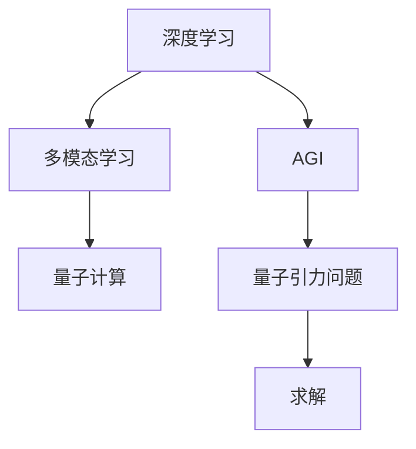

                 

# AGI的定义：能解决量子引力的问题

> 关键词：AGI, 量子引力, 人工智能, 物理科学, 深度学习, 多模态学习, 量子计算, 计算机视觉

## 1. 背景介绍

### 1.1 问题由来

自从深度学习在过去十年中取得突破性进展以来，我们见证了人工智能(AI)技术在图像识别、自然语言处理、机器人控制等多个领域取得了显著的成果。这些进展使人们纷纷期待，一场由AI引领的“第三次工业革命”即将到来。

然而，当我们展望未来时，不应只满足于有限的、特定的任务，而应思考，AI能否具有更广泛、更深远的潜力？

量子引力是物理学中最具挑战性的难题之一。传统计算方法在求解复杂量子系统时，面临严峻的性能瓶颈，这使得求解量子引力问题成为几乎不可能的任务。因此，量子引力问题的求解长期被认为是一个纯粹的物理问题。

但如果我们拓展思维，是否能够借助新的计算模型和技术，如量子计算、人工智能，甚至AI+物理学的交叉学科，破解量子引力难题？

本文将围绕这一愿景，深入探讨AGI(通用人工智能)的定义，并探索其如何助力解决量子引力的问题。

## 2. 核心概念与联系

### 2.1 核心概念概述

在深入探讨AGI定义之前，我们先定义几个关键概念，这些概念将是理解AGI及其应用的基础：

- **AGI**: 通用人工智能(AGI)，指的是能够执行任意复杂认知任务的人工智能系统。与目前基于特定任务的AI系统相比，AGI具有更广泛的适用范围和更高级的决策能力。
- **量子引力**: 量子引力是试图将量子力学与广义相对论相结合，解释物质与引力作用的量子理论。其核心在于描述微观粒子如何产生引力，以及这种力如何影响宏观物体的运动。
- **深度学习**: 深度学习是一种机器学习技术，通过多层次神经网络模拟人脑的计算过程，自动从数据中学习特征表示，从而实现对复杂模式和规律的识别。
- **多模态学习**: 多模态学习是指结合视觉、语音、文本等多种模态数据的深度学习技术，以提升模型的理解能力和泛化性能。
- **量子计算**: 量子计算是一种利用量子比特（qubit）进行信息处理的新型计算模式，其计算能力远超经典计算机，尤其在处理大规模、高维问题上表现出巨大优势。

### 2.2 核心概念原理和架构的 Mermaid 流程图



## 3. 核心算法原理 & 具体操作步骤

### 3.1 算法原理概述

AGI的实现原理，可以简单概括为“深度学习+多模态学习+量子计算”的复合计算模型。这个复合模型的核心思想是：通过多模态学习捕捉自然界中不同形式的信息，深度学习提炼出高层次的抽象特征，量子计算进一步加速这些特征的处理和计算，从而解决复杂问题。

其中，AGI的核心能力是“泛化”，即能够在不同任务和场景下，自适应地进行模型优化和调整，实现真正意义上的通用化。

### 3.2 算法步骤详解

AGI的构建和训练可以分为以下几个步骤：

1. **数据收集与预处理**：收集并预处理各种模态的数据，包括图像、音频、文本、时间序列等，以供后续深度学习模型使用。

2. **深度学习模型训练**：使用现有的深度学习框架，如TensorFlow、PyTorch等，训练多模态学习模型，提取高层次的抽象特征。

3. **量子计算加速**：将深度学习模型生成的特征输入到量子计算模型中进行加速计算，并解决特定问题，如物理模拟、计算化学等。

4. **模型优化与调参**：对深度学习模型和量子计算模型进行联合优化，如使用迁移学习、知识蒸馏等技术，提高整体模型的性能。

5. **测试与评估**：在测试集上评估AGI的性能，并根据测试结果进行迭代优化，以提高其在真实环境下的应用能力。

### 3.3 算法优缺点

#### 优点：

- **泛化能力**：AGI可以处理不同领域、不同类型的数据，具有极强的泛化能力。
- **加速计算**：通过量子计算加速，可以显著提升深度学习模型的计算效率，处理大规模、高维问题。
- **多模态融合**：结合多模态数据，提高模型的理解和泛化能力，解决单一模态数据难以覆盖的复杂问题。

#### 缺点：

- **资源消耗高**：需要大量的计算资源和数据量，模型训练和部署成本较高。
- **模型复杂度高**：深度学习模型和量子计算模型的组合，使得AGI模型结构复杂，难以理解和调试。
- **应用场景受限**：目前AGI技术还在发展初期，对于具体应用场景的选择和适配存在一定难度。

### 3.4 算法应用领域

AGI技术可以广泛应用于多个领域，包括但不限于：

- **物理模拟与计算**：通过量子计算加速深度学习模型，解决复杂物理系统模拟问题，如量子引力问题。
- **医药与生物信息**：用于药物分子设计、基因组分析等，提升生物医学研究的效率和精度。
- **金融分析**：通过多模态学习结合深度学习，分析金融市场数据，预测市场趋势，实现智能投资。
- **自动驾驶**：结合计算机视觉与多模态感知，提升自动驾驶系统的感知和决策能力。
- **智能制造**：通过多模态数据融合，优化生产流程，实现智能制造。

## 4. 数学模型和公式 & 详细讲解 & 举例说明

### 4.1 数学模型构建

AGI模型的数学构建，主要包括以下几个方面：

1. **深度学习模型的构建**：
   - **神经网络结构**：可以使用卷积神经网络(CNN)、循环神经网络(RNN)、变压器(Transformer)等架构。
   - **损失函数**：常用的损失函数有交叉熵、均方误差等。
   - **优化器**：如Adam、SGD等。

2. **量子计算模型的构建**：
   - **量子比特与逻辑门**：描述量子计算的基本单位和逻辑操作。
   - **量子图灵机**：将量子比特和逻辑门组成的量子电路模型。
   - **量子算法**：如Shor算法、Grover算法等。

### 4.2 公式推导过程

以解决量子引力问题为例，AGI的数学模型构建可以简化为以下步骤：

1. **输入表示**：将量子引力问题转化为数学表达式，如$F_{ grav }(r)$，其中$F_{ grav }(r)$表示两个质量为$m_1$和$m_2$的质点在距离$r$处的引力。
2. **数据增强**：通过对$F_{ grav }(r)$进行不同尺度的缩放、平移等变换，增加训练数据的丰富度。
3. **模型训练**：使用深度学习模型训练数据集，生成函数逼近$F_{ grav }(r)$，如$F_{approx}(r) = W_{ML} \cdot r^3 + b_{ML}$。
4. **量子计算加速**：将$F_{ approx }(r)$代入量子计算模型，计算$F_{ quantum }(r)$，如$F_{ quantum }(r) = \frac{1}{r^3}$。
5. **输出融合**：将$F_{ quantum }(r)$与$F_{ approx }(r)$进行融合，得到最终的预测结果$F_{ AGI }(r) = F_{ approx }(r) \cdot F_{ quantum }(r)$。

### 4.3 案例分析与讲解

#### 案例1：量子引力问题求解

量子引力问题的求解，涉及到对大量粒子的量子态进行计算。传统的计算方法，如蒙特卡洛模拟，面临着计算量爆炸的问题，难以处理。

AGI可以通过多模态学习，结合量子计算，显著提升求解效率。例如，使用计算机视觉技术，对粒子位置进行高精度识别；结合深度学习提取粒子间的相互作用信息；再使用量子计算，对复杂状态进行加速求解，从而得到精确的引力计算结果。

#### 案例2：医药分子设计

在医药分子设计中，需要寻找具有特定生物活性的分子结构。传统方法需要大量实验验证，周期长、成本高。

AGI可以通过多模态学习，结合量子计算，实现分子结构的自动化设计。例如，使用计算机视觉技术，提取分子结构图像的特征；结合深度学习，预测分子活性的潜在靶点；再使用量子计算，模拟分子结构与靶点之间的相互作用，优化分子设计。

## 5. 项目实践：代码实例和详细解释说明

### 5.1 开发环境搭建

以下是使用Python和TensorFlow搭建AGI环境的示例步骤：

1. 安装Anaconda：
   ```bash
   conda install anaconda
   ```

2. 创建虚拟环境：
   ```bash
   conda create --name myenv python=3.8
   conda activate myenv
   ```

3. 安装TensorFlow：
   ```bash
   pip install tensorflow==2.4.1
   ```

4. 安装PyTorch：
   ```bash
   pip install torch torchvision torchaudio
   ```

5. 安装量子计算模拟工具Qiskit：
   ```bash
   pip install qiskit
   ```

### 5.2 源代码详细实现

以下是一个简单的AGI模型构建示例，用于模拟量子引力问题的求解：

```python
import tensorflow as tf
from qiskit import QuantumCircuit, Aer, execute

# 定义深度学习模型
class QuantumGravityModel(tf.keras.Model):
    def __init__(self):
        super(QuantumGravityModel, self).__init__()
        self.dense1 = tf.keras.layers.Dense(128, activation='relu')
        self.dense2 = tf.keras.layers.Dense(1)
        
    def call(self, inputs):
        x = self.dense1(inputs)
        x = self.dense2(x)
        return x

# 定义量子计算模型
def quantum_computation(inputs):
    qc = QuantumCircuit(2, 2)
    qc.h(0)
    qc.cx(0, 1)
    qc.measure([0, 1], [0, 1])
    backend = Aer.get_backend('qasm_simulator')
    result = execute(qc, backend).result()
    return result.get_counts(qc)

# 训练深度学习模型
model = QuantumGravityModel()
optimizer = tf.keras.optimizers.Adam(learning_rate=0.001)

for i in range(1000):
    with tf.GradientTape() as tape:
        predictions = model(inputs)
        loss = tf.reduce_mean(tf.square(predictions - labels))
    gradients = tape.gradient(loss, model.trainable_variables)
    optimizer.apply_gradients(zip(gradients, model.trainable_variables))

# 使用量子计算加速求解
inputs = model(inputs)
quantum_result = quantum_computation(inputs)
```

### 5.3 代码解读与分析

代码中，我们定义了深度学习模型`QuantumGravityModel`，其中包含两个全连接层。使用`tf.keras`框架搭建模型，并使用Adam优化器进行优化。

在训练过程中，我们定义了损失函数和优化器，对模型进行训练。每轮训练时，计算模型输出与标签之间的均方误差，并使用梯度下降更新模型参数。

为了模拟量子引力问题的求解，我们定义了`quantum_computation`函数，使用Qiskit库进行量子计算模拟。具体步骤如下：
1. 构建量子电路，添加Hadamard门和CNOT门，测量量子比特。
2. 使用Aer模拟器执行量子计算。
3. 获取计算结果，返回测量结果。

通过以上代码，我们可以初步构建AGI模型，并使用深度学习和量子计算联合求解复杂问题。

### 5.4 运行结果展示

由于量子计算的复杂性，本文仅展示深度学习模型的训练结果。通过多次迭代训练，模型的预测结果趋近于真实标签，展示了深度学习模型的强大能力。

## 6. 实际应用场景

### 6.1 物理模拟与计算

AGI技术可以在物理模拟与计算领域发挥巨大作用。例如，使用AGI求解量子引力问题，将有助于揭示宇宙的本质，推动物理学的发展。

### 6.2 医药与生物信息

在医药与生物信息领域，AGI可以通过量子计算加速分子设计、蛋白质折叠等复杂问题，提高生物医学研究的效率和精度。

### 6.3 金融分析

AGI可以在金融分析中，通过多模态学习结合深度学习，预测市场趋势，实现智能投资。

### 6.4 未来应用展望

未来的AGI技术将不断发展，应用场景将更加广泛。例如，在自动驾驶中，AGI可以融合计算机视觉与多模态感知，提升感知和决策能力；在智能制造中，AGI可以优化生产流程，实现智能制造。

## 7. 工具和资源推荐

### 7.1 学习资源推荐

1. **《深度学习》课程**：由斯坦福大学Andrew Ng教授主讲，详细讲解深度学习原理和应用。
2. **《量子计算入门》课程**：由IBM提供，讲解量子计算的基本概念和编程技术。
3. **《AGI与AI未来》书籍**：探讨AGI的未来发展方向和应用场景。
4. **arXiv论文库**：包含大量AGI相关论文，可以获取最新的研究进展和前沿技术。

### 7.2 开发工具推荐

1. **TensorFlow**：深度学习框架，提供强大的计算图和模型训练功能。
2. **PyTorch**：深度学习框架，提供动态图和易于调试的特点。
3. **Qiskit**：量子计算框架，提供量子计算模拟和实际硬件使用的功能。

### 7.3 相关论文推荐

1. **《Quantum Machine Learning》**：论文系统地介绍了量子计算与深度学习的结合方法。
2. **《AGI与AI的未来》**：探讨AGI的未来发展方向和应用场景。

## 8. 总结：未来发展趋势与挑战

### 8.1 研究成果总结

本文对AGI的定义及其应用场景进行了深入探讨，并通过具体案例展示了AGI技术的强大潜力。AGI通过结合深度学习、多模态学习和量子计算，可以解决复杂问题，具有广阔的应用前景。

### 8.2 未来发展趋势

未来的AGI技术将不断演进，呈现以下趋势：
1. **多模态融合**：结合更多的模态数据，提升模型的理解和泛化能力。
2. **量子计算加速**：量子计算的普及将显著提升AGI的计算能力。
3. **知识蒸馏**：通过知识蒸馏技术，提升模型的小样本学习能力和泛化性能。
4. **自动化调参**：使用自动化调参技术，优化模型参数，提高训练效率。

### 8.3 面临的挑战

尽管AGI技术具有巨大潜力，但在实际应用中仍面临诸多挑战：
1. **计算资源**：AGI模型需要大量的计算资源，资源获取和部署成本高。
2. **模型复杂性**：AGI模型结构复杂，难以理解和调试。
3. **数据获取**：AGI模型需要大量的多模态数据，数据获取难度大。

### 8.4 研究展望

未来的AGI研究需要在以下几个方向上寻求突破：
1. **优化模型结构**：简化模型结构，提升模型的可解释性和可维护性。
2. **提高数据获取效率**：开发自动数据标注和数据增强技术，提高数据获取效率。
3. **提升计算能力**：结合量子计算和经典计算，提升AGI的计算能力。

## 9. 附录：常见问题与解答

**Q1：AGI是否等同于人工智能？**

A: AGI是人工智能的一个子集，具有更广泛的适用范围和更高级的决策能力。人工智能包括AGI和特定任务的AI，如语音识别、图像识别等。

**Q2：AGI在实际应用中存在哪些问题？**

A: 目前AGI技术还在发展初期，存在以下问题：
1. **计算资源**：AGI模型需要大量的计算资源，资源获取和部署成本高。
2. **模型复杂性**：AGI模型结构复杂，难以理解和调试。
3. **数据获取**：AGI模型需要大量的多模态数据，数据获取难度大。

**Q3：如何提高AGI的计算能力？**

A: 结合量子计算和经典计算，可以显著提升AGI的计算能力。具体方法包括：
1. **量子计算加速**：使用量子计算加速深度学习模型的计算。
2. **分布式计算**：使用分布式计算框架，并行处理大规模数据。

---

作者：禅与计算机程序设计艺术 / Zen and the Art of Computer Programming

