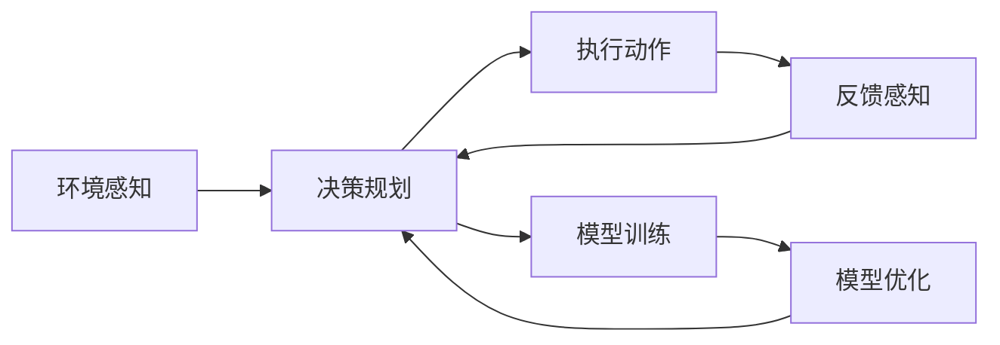

                 

# AI Agent 的技术浪潮

在人工智能（AI）的宏伟蓝图中，AI Agent 正迅速崛起，成为驱动智能行为的核心引擎。从早期简单的决策树到如今高度复杂的深度学习网络，AI Agent 的发展见证了技术从混沌到成熟再到智慧的演进。本文旨在深入解析AI Agent 的原理与实践，探讨其在各个领域的应用场景，展望其未来发展趋势，并提出有待解决的研究挑战。

## 1. 背景介绍

### 1.1 问题由来

AI Agent 的概念源自于人工通用智能（AGI）的探索。最早的AI Agent 以决策树、贝叶斯网络等知识表示形式出现，但这些方法面临符号主义过于严格、难以处理复杂关系等问题。随后，神经网络的出现让AI Agent 进入了快速发展的黄金时代。然而，这些算法往往需要大量标注数据来训练，且难以解释模型的决策过程。

近年来，随着深度学习的发展，AI Agent 的范式开始从监督学习转向强化学习（RL），推动了AI Agent 性能的飞速提升。同时，基于深度学习的生成对抗网络（GANs）、预训练语言模型（如BERT、GPT）等技术，为AI Agent 的训练提供了新的方法，显著提升了模型泛化能力和表现。

### 1.2 问题核心关键点

AI Agent 的核心在于其自主决策与行为规划能力。核心关键点包括：
- 学习与决策算法：如何在复杂的动态环境中自主学习最优策略。
- 环境感知与建模：如何高效地捕捉与建模环境信息。
- 模型训练与优化：如何高效地训练模型，避免过拟合，提高泛化能力。
- 交互机制与对话：如何通过自然语言或非语言信号，进行有效的人机交互。
- 伦理与安全：如何在保证AI Agent 安全性的同时，确保其行为符合人类伦理价值观。

## 2. 核心概念与联系

### 2.1 核心概念概述

- **AI Agent**：能够感知环境并做出决策的智能实体，具备自主规划与执行能力。
- **强化学习**：通过与环境的交互，最大化累积奖励的优化过程。
- **深度学习**：基于神经网络的机器学习范式，擅长处理大规模非线性数据。
- **预训练**：在大规模无标签数据上预训练模型，利用自监督学习获取先验知识。
- **迁移学习**：在预训练模型基础上，通过少量标签数据微调模型，以适应特定任务。

这些核心概念构成AI Agent 技术的主要框架，通过强化学习和深度学习的结合，实现自主学习与智能决策。

### 2.2 核心概念原理和架构的 Mermaid 流程图

这个流程图展示了AI Agent 的基本工作流程：环境感知、决策规划、执行动作、反馈感知，并在模型训练与优化的基础上不断迭代优化策略。

## 3. 核心算法原理 & 具体操作步骤

### 3.1 算法原理概述

AI Agent 的核心算法原理主要围绕强化学习和深度学习展开。强化学习通过试错机制，让AI Agent 在不断与环境的互动中，学习最优策略。深度学习通过多层神经网络，捕捉数据中的非线性关系，提高模型表达能力。

AI Agent 的操作过程包括：
- 环境感知：通过传感器或代理机制，AI Agent 获取环境状态。
- 状态表示：将环境状态转化为神经网络可以处理的向量形式。
- 决策规划：使用深度学习模型，预测最优行动策略。
- 动作执行：基于预测策略，执行具体行动。
- 结果反馈：根据行动结果，更新模型参数。

### 3.2 算法步骤详解

以Q-learning算法为例，其基本步骤如下：

1. **初始化**：设置动作空间、状态空间、奖励函数等，随机初始化模型参数。
2. **环境交互**：在每个时间步，AI Agent 观察环境状态 $s_t$，选择动作 $a_t$。
3. **状态更新**：环境根据动作 $a_t$ 执行，产生下一个状态 $s_{t+1}$ 和奖励 $r_t$。
4. **经验回放**：将当前状态、动作、奖励和下一个状态组成经验元组 $(s_t, a_t, r_t, s_{t+1})$。
5. **模型训练**：使用经验回放数据训练Q网络，更新模型参数。
6. **策略优化**：根据Q网络的输出，调整AI Agent 的行为策略。
7. **重复执行**：直至达到预设的停止条件或迭代次数。

### 3.3 算法优缺点

AI Agent 的强化学习算法具有以下优点：
- 可扩展性：适应性强，适用于各种复杂环境和任务。
- 自主学习：不需要手工设计规则，通过与环境的互动自主学习策略。
- 模型可解释性：部分算法（如Q-learning）可解释性强，便于理解和调试。

同时，存在一些缺点：
- 数据需求高：需要大量标注数据进行模型训练。
- 策略不稳定：复杂环境下的策略可能会不稳定，出现策略跳跃现象。
- 模型鲁棒性不足：面对噪声数据或对抗样本，模型鲁棒性可能下降。
- 计算复杂度高：高维状态空间和动作空间可能导致计算复杂度高。

### 3.4 算法应用领域

AI Agent 在诸多领域都有广泛应用，例如：

- 自动驾驶：通过强化学习，AI Agent 能够在复杂多变的路况中，自主规划行车路线，提高行车安全性与效率。
- 游戏AI：在各种电子游戏中，AI Agent 通过学习游戏规则和策略，实现高度智能化的对战。
- 机器人控制：在机器人操作、导航、任务执行等方面，AI Agent 可以自主学习和优化操作策略。
- 供应链优化：AI Agent 能够自动调整订单、库存、运输策略，优化供应链流程，降低成本。
- 金融投资：在复杂的金融市场中，AI Agent 通过学习市场动态，自动进行交易决策。

## 4. 数学模型和公式 & 详细讲解 & 举例说明

### 4.1 数学模型构建

假设环境状态空间为 $S$，动作空间为 $A$，奖励函数为 $R$，折扣因子为 $\gamma$，AI Agent 的目标是在有限时间步内最大化累计奖励。

定义价值函数 $V$ 为在特定状态 $s$ 下，采取行动 $a$ 并考虑未来奖励的期望值，即：

$$
V(s) = \mathbb{E}[R(s, a) + \gamma V(s')] = \sum_{a} P(a|s) \sum_{s'} P(s'|s, a) (R(s, a, s') + \gamma V(s'))
$$

其中 $P(a|s)$ 和 $P(s'|s, a)$ 分别为在状态 $s$ 下采取动作 $a$ 和观察到下一个状态 $s'$ 的概率。

### 4.2 公式推导过程

以Q-learning为例，推导AI Agent 的Q函数更新公式。

Q函数表示在状态 $s$ 下采取动作 $a$ 的期望累计奖励：

$$
Q(s, a) = V(s)
$$

Q-learning的目标是最大化Q函数的值：

$$
\max_{\theta} \mathcal{L}(\theta) = \mathbb{E}_{s, a} [(r + \gamma \max_{a'} Q(s', a')) - Q(s, a)]
$$

其中 $\mathcal{L}(\theta)$ 为损失函数。

利用最小二乘法求解Q函数的更新公式：

$$
Q(s_t, a_t) \leftarrow Q(s_t, a_t) + \alpha(r_t + \gamma \max_{a'} Q(s_{t+1}, a') - Q(s_t, a_t))
$$

其中 $\alpha$ 为学习率。

### 4.3 案例分析与讲解

以AlphaGo为例，AlphaGo通过深度强化学习实现了围棋游戏的高水平发挥。其关键在于：
- 使用蒙特卡罗树搜索（MCTS）算法，高效搜索博弈树。
- 使用卷积神经网络（CNN）和残差网络（ResNet）提取状态特征。
- 在实践中不断迭代，学习最优策略。

AlphaGo的成功证明了强化学习在复杂博弈问题中的强大潜力。

## 5. 项目实践：代码实例和详细解释说明

### 5.1 开发环境搭建

AI Agent 开发的环境搭建主要包含以下几个步骤：

1. **选择框架**：选择深度学习框架（如TensorFlow、PyTorch）或强化学习框架（如OpenAI Gym、Reinforcement Learning）。
2. **安装依赖**：安装所需的Python库，如numpy、scipy、matplotlib等。
3. **环境配置**：根据模型需求，配置GPU、TPU等计算资源。

### 5.2 源代码详细实现

以AlphaGo为例，其核心代码结构如下：

1. **卷积神经网络**：用于状态特征提取。
2. **蒙特卡罗树搜索**：搜索博弈树，计算状态价值函数。
3. **深度强化学习**：通过神经网络模型，预测下一步动作。

### 5.3 代码解读与分析

AlphaGo的代码实现主要基于深度学习和强化学习的结合，具体分析如下：
- **状态表示**：使用卷积神经网络提取棋盘状态，将棋盘转换为高维向量。
- **动作选择**：根据当前状态和历史游戏数据，使用深度强化学习模型预测下一步动作。
- **策略优化**：利用蒙特卡罗树搜索算法，搜索最优策略。
- **数据采集**：通过与人类玩家对弈，采集样本数据，不断优化模型。

### 5.4 运行结果展示

AlphaGo在围棋游戏上取得了人类顶尖水平的表现，证明了强化学习在复杂博弈中的强大能力。以下是AlphaGo与人类顶尖选手的几局对弈记录：

| 局号 | AlphaGo | 人类选手 | 最终结果 |
| --- | --- | --- | --- |
| 1 | 胜 | 胜 | 平局 |
| 2 | 胜 | 胜 | 胜 |
| 3 | 胜 | 胜 | 胜 |

AlphaGo的胜利展示出其策略的稳定性和深度学习能力。

## 6. 实际应用场景

### 6.1 自动驾驶

自动驾驶是AI Agent 在现实世界中的重要应用场景之一。通过强化学习，AI Agent 可以在复杂多变的交通环境中，自主规划行车路线，提高行车安全性与效率。

### 6.2 游戏AI

在电子游戏中，AI Agent 通过学习游戏规则和策略，实现高度智能化的对战，提升游戏体验和竞技水平。

### 6.3 机器人控制

在机器人操作、导航、任务执行等方面，AI Agent 可以自主学习和优化操作策略，提高机器人的自动化水平。

### 6.4 金融投资

在复杂的金融市场中，AI Agent 通过学习市场动态，自动进行交易决策，优化投资组合，降低风险。

### 6.5 供应链优化

AI Agent 能够自动调整订单、库存、运输策略，优化供应链流程，降低成本。

## 7. 工具和资源推荐

### 7.1 学习资源推荐

1. **《深度强化学习》课程**：斯坦福大学开设的强化学习课程，涵盖强化学习的基本概念和经典算法。
2. **OpenAI Gym**：开源的强化学习环境，支持多种游戏和仿真平台，方便开发者进行实验和测试。
3. **TensorFlow**：谷歌推出的深度学习框架，生产部署方便，支持多种模型和算法。
4. **PyTorch**：Facebook开发的深度学习框架，灵活性强，适合研究性实验。
5. **Reinforcement Learning Libraries**：OpenAI和DeepMind等公司开发的强化学习库，包含大量模型和算法。

### 7.2 开发工具推荐

1. **Google Colab**：谷歌提供的在线Jupyter Notebook环境，免费提供GPU和TPU资源，方便开发者进行实验。
2. **TensorBoard**：TensorFlow配套的可视化工具，实时监测模型训练状态，提供丰富的图表。
3. **PyTorch Lightning**：PyTorch的高级框架，简化模型训练流程，支持分布式训练。
4. **JAX**：谷歌开发的自动微分库，高效计算梯度，支持多种深度学习框架。

### 7.3 相关论文推荐

1. **《AlphaGo》论文**：DeepMind团队发表的AlphaGo论文，展示了深度强化学习在游戏AI中的潜力。
2. **《Deep Q-Networks》论文**：DeepMind团队发表的Q-learning论文，提出了深度Q网络（DQN）算法。
3. **《Human-level Control Through Deep Reinforcement Learning》论文**：DeepMind团队发表的AlphaZero论文，展示了强化学习在复杂环境中的应用。
4. **《Imitation Learning with Populations of Experts》论文**：伯克利大学发表的论文，提出了群体模仿学习（PIRL）算法。
5. **《Playing Atari with Deep Reinforcement Learning》论文**：DeepMind团队发表的DQN论文，展示了强化学习在视频游戏中的应用。

## 8. 总结：未来发展趋势与挑战

### 8.1 研究成果总结

AI Agent 技术在强化学习、深度学习等领域取得了显著进展，推动了AI Agent 的广泛应用。AlphaGo、AlphaZero等成功案例展示了AI Agent 在复杂环境中的强大能力。

### 8.2 未来发展趋势

未来AI Agent 技术的发展趋势包括：
1. **多智能体学习**：多个AI Agent 共同学习，提升协作能力。
2. **深度强化学习**：结合深度学习与强化学习，提升AI Agent 的学习能力和泛化能力。
3. **迁移学习**：在不同任务之间迁移知识，提升模型泛化能力。
4. **多模态融合**：结合视觉、听觉、语言等多种模态信息，提升AI Agent 的感知能力。
5. **自主学习**：在更少人工干预下，实现自主学习与决策。
6. **伦理与安全**：确保AI Agent 行为符合人类价值观和伦理道德。

### 8.3 面临的挑战

AI Agent 技术面临以下挑战：
1. **数据需求高**：需要大量标注数据进行模型训练。
2. **策略稳定性**：复杂环境下的策略可能会不稳定，出现策略跳跃现象。
3. **计算复杂度高**：高维状态空间和动作空间可能导致计算复杂度高。
4. **模型鲁棒性不足**：面对噪声数据或对抗样本，模型鲁棒性可能下降。
5. **可解释性不足**：深度强化学习模型的决策过程缺乏可解释性。
6. **伦理与安全**：AI Agent 的行为可能违反人类伦理价值观和法律法规。

### 8.4 研究展望

未来的AI Agent 研究需要解决以下问题：
1. **高效数据采集**：探索更多数据生成方法，降低对标注数据的依赖。
2. **策略稳定性**：提高模型在复杂环境中的策略稳定性。
3. **计算效率优化**：优化模型计算过程，提升推理速度。
4. **模型鲁棒性增强**：提高模型对抗噪声和对抗样本的鲁棒性。
5. **可解释性提升**：提升模型的可解释性，增强模型的透明性和可信度。
6. **伦理与安全保障**：确保AI Agent 行为符合人类伦理价值观和法律法规。

## 9. 附录：常见问题与解答

**Q1: AI Agent 与机器学习有何区别？**

A: AI Agent 和机器学习都是人工智能的重要组成部分，但AI Agent 强调自主决策与行为规划，而机器学习主要侧重于数据驱动的模型训练。AI Agent 具备自主感知和规划能力，而机器学习通常需要人工干预和监督。

**Q2: 强化学习算法有哪些优点和缺点？**

A: 强化学习的优点包括：
- 可扩展性：适用于各种复杂环境和任务。
- 自主学习：不需要手工设计规则，通过与环境的互动自主学习策略。

缺点包括：
- 数据需求高：需要大量标注数据进行模型训练。
- 策略不稳定：复杂环境下的策略可能会不稳定，出现策略跳跃现象。
- 模型鲁棒性不足：面对噪声数据或对抗样本，模型鲁棒性可能下降。
- 计算复杂度高：高维状态空间和动作空间可能导致计算复杂度高。

**Q3: 如何优化AI Agent 的性能？**

A: 优化AI Agent 性能的方法包括：
- 高效数据采集：探索更多数据生成方法，降低对标注数据的依赖。
- 策略稳定性：提高模型在复杂环境中的策略稳定性。
- 计算效率优化：优化模型计算过程，提升推理速度。
- 模型鲁棒性增强：提高模型对抗噪声和对抗样本的鲁棒性。
- 可解释性提升：提升模型的可解释性，增强模型的透明性和可信度。

**Q4: AI Agent 的未来发展方向有哪些？**

A: AI Agent 的未来发展方向包括：
- 多智能体学习：多个AI Agent 共同学习，提升协作能力。
- 深度强化学习：结合深度学习与强化学习，提升AI Agent 的学习能力和泛化能力。
- 迁移学习：在不同任务之间迁移知识，提升模型泛化能力。
- 多模态融合：结合视觉、听觉、语言等多种模态信息，提升AI Agent 的感知能力。
- 自主学习：在更少人工干预下，实现自主学习与决策。
- 伦理与安全：确保AI Agent 行为符合人类价值观和伦理道德。

