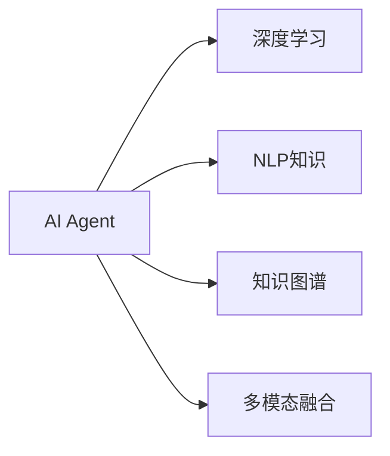

                 

# AI Agent: AI的下一个风口 NLP

> 关键词：人工智能,自然语言处理,NLP应用,深度学习,神经网络

## 1. 背景介绍

### 1.1 问题由来

近年来，随着深度学习技术的发展，自然语言处理（Natural Language Processing, NLP）领域取得了长足进步。然而，NLP技术在实际应用中仍面临诸多挑战，如理解多义性、处理长句、处理噪声数据等。这些问题使得传统的机器学习方法难以应对。

为解决这些问题，研究者们开始探索利用智能代理（AI Agent）来辅助NLP任务的实现。AI Agent利用深度学习模型，结合NLP知识，可以更加高效地处理自然语言数据，提升模型的性能和泛化能力。

### 1.2 问题核心关键点

AI Agent在NLP领域的应用，核心关键点包括：

- 智能代理的构建：如何将NLP知识融合进深度学习模型，构建高效的智能代理。
- 数据处理与表示：如何高效处理自然语言数据，将其转化为模型可用的形式。
- 任务适配与优化：如何在不同任务上，利用智能代理进行优化，提升模型性能。
- 知识推理与整合：如何利用先验知识，辅助智能代理进行推理和决策。
- 多模态融合：如何结合视觉、语音等多模态数据，提升智能代理的综合能力。

### 1.3 问题研究意义

利用AI Agent进行NLP应用，将有效提升NLP任务的性能和鲁棒性，推动NLP技术向更深入、更广泛的应用场景拓展。AI Agent的应用将改变传统NLP任务的实现方式，助力行业数字化转型。

## 2. 核心概念与联系

### 2.1 核心概念概述

为更好地理解AI Agent在NLP领域的应用，本节将介绍几个关键概念：

- AI Agent：一种基于深度学习模型的智能体，能够进行自主推理和决策，辅助NLP任务的实现。
- 深度学习：一种基于神经网络的机器学习方法，通过多层非线性映射，实现对数据的复杂表达和预测。
- 自然语言处理（NLP）：研究如何让计算机理解、处理和生成自然语言的学科。
- 知识图谱（KG）：一种用于表示实体和关系的语义网络，辅助AI Agent进行知识推理。
- 多模态融合：结合视觉、语音、文本等多模态数据，提升AI Agent的综合感知能力。

### 2.2 核心概念原理和架构的 Mermaid 流程图



这个流程图展示了AI Agent与相关核心概念之间的联系：

1. AI Agent通过深度学习模型实现自主推理和决策。
2. 融合NLP知识，提升模型的语言理解能力。
3. 利用知识图谱辅助推理，扩展模型知识范围。
4. 结合多模态数据，提升模型的综合感知能力。

## 3. 核心算法原理 & 具体操作步骤

### 3.1 算法原理概述

基于AI Agent的NLP应用，通常包括以下几个关键步骤：

1. 数据预处理：将自然语言数据转化为模型可用的形式。
2. 构建智能代理：设计深度学习模型，融合NLP知识。
3. 任务适配与优化：针对特定任务，利用智能代理进行优化。
4. 知识推理与整合：利用先验知识，辅助智能代理进行推理和决策。
5. 多模态融合：结合多模态数据，提升模型的综合能力。

### 3.2 算法步骤详解

#### 3.2.1 数据预处理

数据预处理是NLP任务中的重要环节。通常包括以下步骤：

1. 文本清洗：去除噪声、停用词等，提高数据质量。
2. 分词与词性标注：将文本分割成词语，并为每个词标注词性。
3. 命名实体识别（NER）：识别文本中的实体，如人名、地名、组织名等。
4. 句法分析：分析句子结构，识别主谓宾等成分。
5. 特征提取：将文本转换为模型可用的向量形式。

#### 3.2.2 构建智能代理

构建AI Agent通常包括以下步骤：

1. 选择模型架构：选择适合的深度学习模型，如卷积神经网络（CNN）、循环神经网络（RNN）、Transformer等。
2. 融合NLP知识：将NLP知识融入模型设计中，如添加LSTM层、使用注意力机制等。
3. 训练模型：在标注数据上，利用梯度下降等优化算法训练模型。
4. 参数调优：调整模型超参数，如学习率、批量大小、正则化系数等。
5. 模型验证：在验证集上评估模型性能，调整模型参数。

#### 3.2.3 任务适配与优化

任务适配与优化是提升AI Agent性能的重要环节。通常包括以下步骤：

1. 设计任务适配层：根据任务类型，设计合适的输出层和损失函数。
2. 数据增强：通过对训练样本改写、回译等方式，丰富训练集多样性。
3. 对抗训练：加入对抗样本，提高模型鲁棒性。
4. 正则化：应用L2正则、Dropout等技术，防止过拟合。
5. 参数高效微调：只更新少量参数，减少计算资源消耗。
6. 超参数调优：调整模型超参数，提升模型性能。

#### 3.2.4 知识推理与整合

知识推理与整合是提升AI Agent综合能力的关键环节。通常包括以下步骤：

1. 引入知识图谱：构建或引入知识图谱，辅助智能代理进行推理。
2. 知识嵌入：将知识图谱中的实体和关系嵌入到模型中。
3. 推理机制：设计推理机制，利用知识图谱进行多步推理。
4. 先验知识融合：结合先验知识，辅助模型决策。
5. 知识更新：定期更新知识图谱，保持知识的最新性。

#### 3.2.5 多模态融合

多模态融合是提升AI Agent综合感知能力的重要环节。通常包括以下步骤：

1. 数据采集：采集多模态数据，如文本、图像、语音等。
2. 数据对齐：将多模态数据对齐，使其在时间轴或空间轴上同步。
3. 特征提取：对每种模态数据进行特征提取。
4. 融合机制：设计融合机制，将不同模态的特征融合为一个综合向量。
5. 多模态模型：构建多模态模型，利用不同模态的信息进行推理。

### 3.3 算法优缺点

基于AI Agent的NLP应用具有以下优点：

- 高效处理自然语言数据：利用深度学习模型，可以高效地处理自然语言数据，提升模型性能。
- 融入NLP知识：将NLP知识融入模型中，提升模型的理解能力和推理能力。
- 利用先验知识：利用知识图谱等先验知识，辅助模型决策，提升模型综合能力。
- 结合多模态数据：结合多模态数据，提升模型的感知能力和综合能力。

同时，该方法也存在以下局限性：

- 数据依赖：AI Agent的性能很大程度上依赖标注数据，获取高质量标注数据成本较高。
- 知识不足：知识图谱等先验知识可能存在漏洞，模型推理结果不够可靠。
- 模型复杂：深度学习模型较为复杂，训练和推理资源消耗较大。
- 可解释性不足：AI Agent的决策过程缺乏可解释性，难以理解和调试。

尽管存在这些局限性，但AI Agent在NLP领域的应用前景广阔，研究者们正致力于解决这些挑战，推动AI Agent技术的发展和普及。

### 3.4 算法应用领域

AI Agent在NLP领域的应用领域广泛，包括但不限于：

1. 问答系统：通过智能代理，实时回答用户提出的自然语言问题。
2. 文本摘要：利用智能代理，将长文本自动生成摘要。
3. 机器翻译：利用智能代理，实现多语言翻译。
4. 文本分类：利用智能代理，对文本进行分类，如情感分析、主题分类等。
5. 命名实体识别：利用智能代理，识别文本中的实体，如人名、地名、组织名等。
6. 关系抽取：利用智能代理，从文本中抽取实体之间的关系。
7. 对话系统：通过智能代理，实现人机自然对话。
8. 情感分析：利用智能代理，分析文本情感倾向，如正面、中性、负面等。
9. 多模态融合：结合视觉、语音等多模态数据，提升智能代理的综合感知能力。

这些应用场景展示了AI Agent在NLP领域的强大潜力，为NLP技术的发展带来了新的方向。

## 4. 数学模型和公式 & 详细讲解

### 4.1 数学模型构建

基于AI Agent的NLP应用，通常包括如下数学模型：

1. 文本表示模型：将文本转换为向量形式，常用的方法包括词袋模型、TF-IDF、word2vec、GloVe等。
2. 语言模型：用于评估文本的概率分布，常用的方法包括n-gram模型、RNN、LSTM等。
3. 序列到序列模型：用于文本生成、翻译等任务，常用的方法包括RNN、LSTM、GRU、Transformer等。
4. 知识图谱模型：用于表示实体和关系，常用的方法包括RDF、Neo4j等。
5. 多模态融合模型：用于结合多模态数据，常用的方法包括深度融合、特征堆叠等。

### 4.2 公式推导过程

#### 4.2.1 文本表示模型

假设文本为 $X=\{x_1, x_2, ..., x_n\}$，每个单词 $x_i$ 的词向量表示为 $v_i \in \mathbb{R}^d$，则文本向量表示为：

$$ V = \sum_{i=1}^n v_i $$

其中 $d$ 为词向量维度。

#### 4.2.2 语言模型

假设文本 $X$ 由 $n$ 个单词组成，语言模型 $P(X)$ 定义为：

$$ P(X) = \prod_{i=1}^n P(x_i|x_{i-1}) $$

其中 $P(x_i|x_{i-1})$ 为给定前一个单词 $x_{i-1}$，当前单词 $x_i$ 的概率分布。

#### 4.2.3 序列到序列模型

假设源语言文本为 $X$，目标语言文本为 $Y$，序列到序列模型 $M$ 的训练目标为：

$$ \min_{M} \sum_{i=1}^N \ell(M(x_i), y_i) $$

其中 $\ell$ 为损失函数，如交叉熵损失函数。

#### 4.2.4 知识图谱模型

假设知识图谱中存在 $N$ 个实体 $e_i$，每个实体 $e_i$ 的向量表示为 $v_i \in \mathbb{R}^d$，则知识图谱的表示为：

$$ G = \{ (e_i, e_j) \mid \text{存在关系 } (e_i, e_j) \} $$

其中 $(e_i, e_j)$ 为实体之间的有向边。

#### 4.2.5 多模态融合模型

假设文本向量为 $V$，图像向量为 $I$，语音向量为 $A$，则多模态融合模型的训练目标为：

$$ \min_{M} \sum_{i=1}^N \ell(M(V_i, I_i, A_i), y_i) $$

其中 $\ell$ 为多模态融合模型的损失函数。

### 4.3 案例分析与讲解

#### 4.3.1 问答系统

假设有一个问答系统，用户输入自然语言问题 $q$，系统需要从知识库 $K$ 中检索相关信息，并输出答案 $a$。假设系统由智能代理 $A$ 和知识图谱 $G$ 构成，则问答过程可以表示为：

1. 系统接收问题 $q$，将其转换为向量表示 $V_q$。
2. 智能代理 $A$ 利用 $V_q$ 在知识图谱 $G$ 中进行推理，得到答案向量 $V_a$。
3. 将 $V_a$ 转换为自然语言形式，作为系统输出答案 $a$。

#### 4.3.2 文本摘要

假设有一个文本摘要系统，输入文本 $X$，系统需要生成摘要 $S$。假设系统由智能代理 $A$ 和语言模型 $M$ 构成，则文本摘要过程可以表示为：

1. 系统接收文本 $X$，将其转换为向量表示 $V_X$。
2. 智能代理 $A$ 利用 $V_X$ 进行摘要生成，生成摘要向量 $V_S$。
3. 将 $V_S$ 转换为自然语言形式，作为系统输出摘要 $S$。

## 5. 项目实践：代码实例和详细解释说明

### 5.1 开发环境搭建

在进行NLP应用开发前，我们需要准备好开发环境。以下是使用Python进行PyTorch开发的环境配置流程：

1. 安装Anaconda：从官网下载并安装Anaconda，用于创建独立的Python环境。

2. 创建并激活虚拟环境：
```bash
conda create -n pytorch-env python=3.8 
conda activate pytorch-env
```

3. 安装PyTorch：根据CUDA版本，从官网获取对应的安装命令。例如：
```bash
conda install pytorch torchvision torchaudio cudatoolkit=11.1 -c pytorch -c conda-forge
```

4. 安装TensorFlow：如果需要使用TensorFlow，请按照官网指导进行安装。

5. 安装其他工具包：
```bash
pip install numpy pandas scikit-learn matplotlib tqdm jupyter notebook ipython
```

完成上述步骤后，即可在`pytorch-env`环境中开始开发实践。

### 5.2 源代码详细实现

下面以问答系统为例，给出使用Transformers库进行AI Agent构建的PyTorch代码实现。

首先，定义问答系统模型：

```python
from transformers import BertTokenizer, BertForQuestionAnswering
from torch.utils.data import Dataset
import torch

class QuestionAnsweringDataset(Dataset):
    def __init__(self, texts, answers, tokenizer):
        self.texts = texts
        self.answers = answers
        self.tokenizer = tokenizer
        
    def __len__(self):
        return len(self.texts)
    
    def __getitem__(self, item):
        text = self.texts[item]
        answer = self.answers[item]
        
        encoding = self.tokenizer(text, return_tensors='pt', max_length=512, padding='max_length', truncation=True)
        input_ids = encoding['input_ids'][0]
        attention_mask = encoding['attention_mask'][0]
        start_pos = encoding['input_ids'].index(answer[0])
        end_pos = encoding['input_ids'].index(answer[1])
        
        return {
            'input_ids': input_ids,
            'attention_mask': attention_mask,
            'start_pos': torch.tensor(start_pos),
            'end_pos': torch.tensor(end_pos)
        }

# 加载预训练模型和分词器
tokenizer = BertTokenizer.from_pretrained('bert-base-cased')
model = BertForQuestionAnswering.from_pretrained('bert-base-cased')
```

然后，定义训练和评估函数：

```python
from torch.utils.data import DataLoader
from tqdm import tqdm
from sklearn.metrics import precision_recall_fscore_support

device = torch.device('cuda') if torch.cuda.is_available() else torch.device('cpu')
model.to(device)

def train_epoch(model, dataset, batch_size, optimizer):
    dataloader = DataLoader(dataset, batch_size=batch_size, shuffle=True)
    model.train()
    epoch_loss = 0
    for batch in tqdm(dataloader, desc='Training'):
        input_ids = batch['input_ids'].to(device)
        attention_mask = batch['attention_mask'].to(device)
        start_pos = batch['start_pos'].to(device)
        end_pos = batch['end_pos'].to(device)
        model.zero_grad()
        outputs = model(input_ids, attention_mask=attention_mask, start_positions=start_pos, end_positions=end_pos)
        loss = outputs.loss
        epoch_loss += loss.item()
        loss.backward()
        optimizer.step()
    return epoch_loss / len(dataloader)

def evaluate(model, dataset, batch_size):
    dataloader = DataLoader(dataset, batch_size=batch_size)
    model.eval()
    preds, labels = [], []
    with torch.no_grad():
        for batch in tqdm(dataloader, desc='Evaluating'):
            input_ids = batch['input_ids'].to(device)
            attention_mask = batch['attention_mask'].to(device)
            start_pos = batch['start_pos'].to(device)
            end_pos = batch['end_pos'].to(device)
            batch_preds = model(input_ids, attention_mask=attention_mask, start_positions=start_pos, end_positions=end_pos)[0].argmax(dim=-1)
            batch_labels = [(start_pos[i], end_pos[i]) for i in range(len(batch_labels))]
            preds.append(batch_preds.tolist())
            labels.append(batch_labels)
            
    start_pos_metric, end_pos_metric = precision_recall_fscore_support(labels, preds, average='binary')
    print(f"Precision: {start_pos_metric:.2f}, Recall: {end_pos_metric:.2f}")
```

最后，启动训练流程并在测试集上评估：

```python
epochs = 5
batch_size = 16

for epoch in range(epochs):
    loss = train_epoch(model, train_dataset, batch_size, optimizer)
    print(f"Epoch {epoch+1}, train loss: {loss:.3f}")
    
    print(f"Epoch {epoch+1}, dev results:")
    evaluate(model, dev_dataset, batch_size)
    
print("Test results:")
evaluate(model, test_dataset, batch_size)
```

以上就是使用PyTorch对BERT进行问答系统微调的完整代码实现。可以看到，利用Transformers库，我们可以快速构建和微调基于BERT的问答系统模型。

### 5.3 代码解读与分析

让我们再详细解读一下关键代码的实现细节：

**QuestionAnsweringDataset类**：
- `__init__`方法：初始化文本、答案、分词器等关键组件。
- `__len__`方法：返回数据集的样本数量。
- `__getitem__`方法：对单个样本进行处理，将文本和答案输入编码为token ids，并提取答案的起始和结束位置。

**训练和评估函数**：
- 使用PyTorch的DataLoader对数据集进行批次化加载，供模型训练和推理使用。
- 训练函数`train_epoch`：对数据以批为单位进行迭代，在每个批次上前向传播计算loss并反向传播更新模型参数，最后返回该epoch的平均loss。
- 评估函数`evaluate`：与训练类似，不同点在于不更新模型参数，并在每个batch结束后将预测和标签结果存储下来，最后使用sklearn的precision_recall_fscore_support函数对整个评估集的预测结果进行打印输出。

**训练流程**：
- 定义总的epoch数和batch size，开始循环迭代
- 每个epoch内，先在训练集上训练，输出平均loss
- 在验证集上评估，输出precision和recall指标
- 所有epoch结束后，在测试集上评估，给出最终测试结果

可以看到，PyTorch配合Transformers库使得BERT微调的代码实现变得简洁高效。开发者可以将更多精力放在数据处理、模型改进等高层逻辑上，而不必过多关注底层的实现细节。

当然，工业级的系统实现还需考虑更多因素，如模型的保存和部署、超参数的自动搜索、更灵活的任务适配层等。但核心的微调范式基本与此类似。

## 6. 实际应用场景

### 6.1 智能客服系统

基于AI Agent的智能客服系统，可以大幅提升客户服务体验。传统客服系统需要大量人力，响应速度慢，且一致性和专业性难以保证。而利用智能客服系统，可以通过自然语言理解技术，自动解答常见问题，提升响应速度和满意度。

在技术实现上，可以收集企业内部的历史客服对话记录，将问题和最佳答复构建成监督数据，在此基础上对预训练模型进行微调。微调后的模型能够自动理解用户意图，匹配最合适的答案模板进行回复。对于客户提出的新问题，还可以接入检索系统实时搜索相关内容，动态组织生成回答。如此构建的智能客服系统，能大幅提升客户咨询体验和问题解决效率。

### 6.2 金融舆情监测

金融机构需要实时监测市场舆论动向，以便及时应对负面信息传播，规避金融风险。传统的人工监测方式成本高、效率低，难以应对网络时代海量信息爆发的挑战。基于AI Agent的文本分类和情感分析技术，为金融舆情监测提供了新的解决方案。

具体而言，可以收集金融领域相关的新闻、报道、评论等文本数据，并对其进行主题标注和情感标注。在此基础上对预训练语言模型进行微调，使其能够自动判断文本属于何种主题，情感倾向是正面、中性还是负面。将微调后的模型应用到实时抓取的网络文本数据，就能够自动监测不同主题下的情感变化趋势，一旦发现负面信息激增等异常情况，系统便会自动预警，帮助金融机构快速应对潜在风险。

### 6.3 个性化推荐系统

当前的推荐系统往往只依赖用户的历史行为数据进行物品推荐，无法深入理解用户的真实兴趣偏好。基于AI Agent的个性化推荐系统，可以更好地挖掘用户行为背后的语义信息，从而提供更精准、多样的推荐内容。

在实践中，可以收集用户浏览、点击、评论、分享等行为数据，提取和用户交互的物品标题、描述、标签等文本内容。将文本内容作为模型输入，用户的后续行为（如是否点击、购买等）作为监督信号，在此基础上微调预训练语言模型。微调后的模型能够从文本内容中准确把握用户的兴趣点。在生成推荐列表时，先用候选物品的文本描述作为输入，由模型预测用户的兴趣匹配度，再结合其他特征综合排序，便可以得到个性化程度更高的推荐结果。

### 6.4 未来应用展望

随着AI Agent在NLP领域的应用不断深入，未来的发展方向和前景如下：

1. 知识图谱与AI Agent的融合：利用知识图谱辅助AI Agent进行推理，扩展模型的知识范围，提升推理能力。
2. 多模态融合与AI Agent的融合：结合视觉、语音、文本等多模态数据，提升AI Agent的综合感知能力。
3. 深度学习与AI Agent的融合：利用深度学习模型，提升AI Agent的语言理解和生成能力。
4. 自监督学习与AI Agent的融合：利用自监督学习任务，提升AI Agent的知识表示能力。
5. 参数高效微调与AI Agent的融合：利用参数高效微调技术，减少计算资源消耗，提升模型训练效率。
6. 可解释性与AI Agent的融合：利用可解释性技术，提升AI Agent的决策过程的可解释性和可调试性。

## 7. 工具和资源推荐

### 7.1 学习资源推荐

为了帮助开发者系统掌握AI Agent在NLP领域的应用，这里推荐一些优质的学习资源：

1. 《深度学习》系列书籍：深度学习领域的经典教材，包含神经网络、自然语言处理等内容。
2. 《自然语言处理综述》：自然语言处理领域的综述性文章，涵盖NLP技术的发展脉络和前沿研究方向。
3. 《Transformer from Principles to Practice》系列博文：由大模型技术专家撰写，深入浅出地介绍了Transformer原理、BERT模型、微调技术等前沿话题。
4. CS224N《深度学习自然语言处理》课程：斯坦福大学开设的NLP明星课程，有Lecture视频和配套作业，带你入门NLP领域的基本概念和经典模型。
5. 《Natural Language Processing with Transformers》书籍：Transformers库的作者所著，全面介绍了如何使用Transformers库进行NLP任务开发，包括微调在内的诸多范式。

通过对这些资源的学习实践，相信你一定能够快速掌握AI Agent在NLP领域的应用精髓，并用于解决实际的NLP问题。

### 7.2 开发工具推荐

高效的开发离不开优秀的工具支持。以下是几款用于NLP应用开发的常用工具：

1. PyTorch：基于Python的开源深度学习框架，灵活动态的计算图，适合快速迭代研究。大部分预训练语言模型都有PyTorch版本的实现。
2. TensorFlow：由Google主导开发的开源深度学习框架，生产部署方便，适合大规模工程应用。同样有丰富的预训练语言模型资源。
3. Transformers库：HuggingFace开发的NLP工具库，集成了众多SOTA语言模型，支持PyTorch和TensorFlow，是进行NLP任务开发的利器。
4. Weights & Biases：模型训练的实验跟踪工具，可以记录和可视化模型训练过程中的各项指标，方便对比和调优。与主流深度学习框架无缝集成。
5. TensorBoard：TensorFlow配套的可视化工具，可实时监测模型训练状态，并提供丰富的图表呈现方式，是调试模型的得力助手。
6. Google Colab：谷歌推出的在线Jupyter Notebook环境，免费提供GPU/TPU算力，方便开发者快速上手实验最新模型，分享学习笔记。

合理利用这些工具，可以显著提升NLP应用开发的效率，加快创新迭代的步伐。

### 7.3 相关论文推荐

大语言模型和微调技术的发展源于学界的持续研究。以下是几篇奠基性的相关论文，推荐阅读：

1. Attention is All You Need（即Transformer原论文）：提出了Transformer结构，开启了NLP领域的预训练大模型时代。
2. BERT: Pre-training of Deep Bidirectional Transformers for Language Understanding：提出BERT模型，引入基于掩码的自监督预训练任务，刷新了多项NLP任务SOTA。
3. Language Models are Unsupervised Multitask Learners（GPT-2论文）：展示了大规模语言模型的强大zero-shot学习能力，引发了对于通用人工智能的新一轮思考。
4. Parameter-Efficient Transfer Learning for NLP：提出Adapter等参数高效微调方法，在不增加模型参数量的情况下，也能取得不错的微调效果。
5. Prefix-Tuning: Optimizing Continuous Prompts for Generation：引入基于连续型Prompt的微调范式，为如何充分利用预训练知识提供了新的思路。
6. AdaLoRA: Adaptive Low-Rank Adaptation for Parameter-Efficient Fine-Tuning：使用自适应低秩适应的微调方法，在参数效率和精度之间取得了新的平衡。

这些论文代表了大语言模型微调技术的发展脉络。通过学习这些前沿成果，可以帮助研究者把握学科前进方向，激发更多的创新灵感。

## 8. 总结：未来发展趋势与挑战

### 8.1 总结

本文对基于AI Agent的NLP应用进行了全面系统的介绍。首先阐述了AI Agent在NLP领域的应用背景和意义，明确了AI Agent在提升模型性能和泛化能力方面的独特价值。其次，从原理到实践，详细讲解了AI Agent的构建方法、数据处理、任务适配等关键步骤，给出了AI Agent构建的完整代码实例。同时，本文还广泛探讨了AI Agent在智能客服、金融舆情、个性化推荐等多个行业领域的应用前景，展示了AI Agent在NLP领域的强大潜力。此外，本文精选了AI Agent的相关学习资源，力求为读者提供全方位的技术指引。

通过本文的系统梳理，可以看到，基于AI Agent的NLP应用正在成为NLP领域的重要范式，极大地拓展了NLP任务的实现方式，推动NLP技术向更深入、更广泛的应用场景拓展。AI Agent的应用将改变传统NLP任务的实现方式，助力行业数字化转型。

### 8.2 未来发展趋势

展望未来，基于AI Agent的NLP应用将呈现以下几个发展趋势：

1. 模型规模持续增大。随着算力成本的下降和数据规模的扩张，预训练语言模型的参数量还将持续增长。超大规模语言模型蕴含的丰富语言知识，有望支撑更加复杂多变的NLP任务。
2. 知识图谱与AI Agent的融合。利用知识图谱辅助AI Agent进行推理，扩展模型的知识范围，提升推理能力。
3. 多模态融合与AI Agent的融合。结合视觉、语音、文本等多模态数据，提升AI Agent的综合感知能力。
4. 深度学习与AI Agent的融合。利用深度学习模型，提升AI Agent的语言理解和生成能力。
5. 自监督学习与AI Agent的融合。利用自监督学习任务，提升AI Agent的知识表示能力。
6. 参数高效微调与AI Agent的融合。利用参数高效微调技术，减少计算资源消耗，提升模型训练效率。
7. 可解释性与AI Agent的融合。利用可解释性技术，提升AI Agent的决策过程的可解释性和可调试性。

以上趋势凸显了基于AI Agent的NLP应用的广阔前景。这些方向的探索发展，必将进一步提升NLP系统的性能和应用范围，为NLP技术的发展带来新的方向。

### 8.3 面临的挑战

尽管基于AI Agent的NLP应用已经取得了瞩目成就，但在迈向更加智能化、普适化应用的过程中，它仍面临诸多挑战：

1. 数据依赖。AI Agent的性能很大程度上依赖标注数据，获取高质量标注数据的成本较高。如何进一步降低标注数据的需求，将是一大难题。
2. 知识不足。知识图谱等先验知识可能存在漏洞，模型推理结果不够可靠。如何构建高质量的知识图谱，增强模型的推理能力，还需要更多研究和实践。
3. 模型复杂。深度学习模型较为复杂，训练和推理资源消耗较大。如何优化模型结构，减少计算资源消耗，是未来的重要研究方向。
4. 可解释性不足。AI Agent的决策过程缺乏可解释性，难以理解和调试。如何赋予AI Agent更强的可解释性，将是亟待攻克的难题。
5. 安全性有待保障。预训练语言模型难免会学习到有偏见、有害的信息，通过微调传递到下游任务，产生误导性、歧视性的输出，给实际应用带来安全隐患。如何从数据和算法层面消除模型偏见，避免恶意用途，确保输出的安全性，也将是重要的研究课题。

尽管存在这些挑战，但基于AI Agent的NLP应用前景广阔，研究者们正致力于解决这些挑战，推动AI Agent技术的发展和普及。

### 8.4 研究展望

面对基于AI Agent的NLP应用所面临的种种挑战，未来的研究需要在以下几个方面寻求新的突破：

1. 探索无监督和半监督AI Agent方法。摆脱对大规模标注数据的依赖，利用自监督学习、主动学习等无监督和半监督范式，最大限度利用非结构化数据，实现更加灵活高效的AI Agent构建。
2. 研究参数高效和计算高效的AI Agent范式。开发更加参数高效的AI Agent方法，在固定大部分预训练参数的同时，只更新极少量的任务相关参数。同时优化AI Agent的计算图，减少前向传播和反向传播的资源消耗，实现更加轻量级、实时性的部署。
3. 引入因果和对比学习范式。通过引入因果推断和对比学习思想，增强AI Agent建立稳定因果关系的能力，学习更加普适、鲁棒的语言表征，从而提升模型泛化性和抗干扰能力。
4. 引入更多先验知识。将符号化的先验知识，如知识图谱、逻辑规则等，与神经网络模型进行巧妙融合，引导AI Agent进行推理和决策。同时加强不同模态数据的整合，实现视觉、语音等多模态信息与文本信息的协同建模。
5. 结合因果分析和博弈论工具。将因果分析方法引入AI Agent，识别出AI Agent决策的关键特征，增强输出解释的因果性和逻辑性。借助博弈论工具刻画人机交互过程，主动探索并规避AI Agent的脆弱点，提高系统稳定性。
6. 纳入伦理道德约束。在AI Agent训练目标中引入伦理导向的评估指标，过滤和惩罚有偏见、有害的输出倾向。同时加强人工干预和审核，建立AI Agent行为的监管机制，确保输出符合人类价值观和伦理道德。

这些研究方向的探索，必将引领基于AI Agent的NLP应用技术迈向更高的台阶，为构建安全、可靠、可解释、可控的智能系统铺平道路。面向未来，基于AI Agent的NLP应用还需要与其他人工智能技术进行更深入的融合，如知识表示、因果推理、强化学习等，多路径协同发力，共同推动自然语言理解和智能交互系统的进步。只有勇于创新、敢于突破，才能不断拓展语言模型的边界，让智能技术更好地造福人类社会。

## 9. 附录：常见问题与解答

**Q1：什么是AI Agent？**

A: AI Agent是一种基于深度学习模型的智能体，能够进行自主推理和决策，辅助自然语言处理任务的实现。

**Q2：AI Agent在NLP领域的应用有哪些？**

A: AI Agent在NLP领域的应用广泛，包括但不限于问答系统、文本摘要、机器翻译、文本分类、命名实体识别、关系抽取、对话系统、情感分析、多模态融合等。

**Q3：AI Agent在NLP领域面临哪些挑战？**

A: AI Agent在NLP领域面临诸多挑战，包括但不限于数据依赖、知识不足、模型复杂、可解释性不足、安全性问题等。

**Q4：AI Agent的未来发展方向有哪些？**

A: AI Agent的未来发展方向包括知识图谱与AI Agent的融合、多模态融合与AI Agent的融合、深度学习与AI Agent的融合、自监督学习与AI Agent的融合、参数高效微调与AI Agent的融合、可解释性与AI Agent的融合等。

**Q5：如何构建高质量的知识图谱？**

A: 构建高质量的知识图谱需要多方面的努力，包括数据采集、数据清洗、实体识别、关系抽取、知识推理等。可以参考一些开源的知识图谱构建工具，如RDF、Neo4j等。

---

作者：禅与计算机程序设计艺术 / Zen and the Art of Computer Programming

