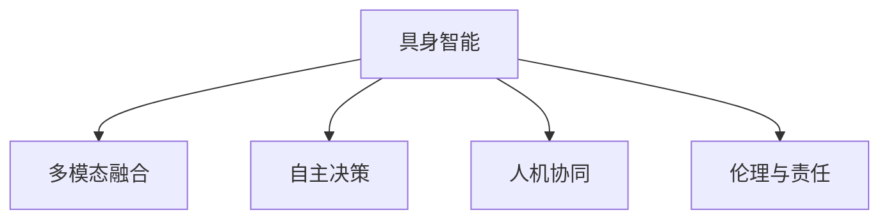

                 

# AI Agent: AI的下一个风口 具身智能对未来社会的影响

> 关键词：具身智能,自主性,多模态融合,人工智能伦理,决策支持系统,人机协同

## 1. 背景介绍

在经历了符号主义、连接主义、行为主义等多个发展阶段后，人工智能(AI)正在迈向一个全新的阶段——具身智能。具身智能通过嵌入具体环境、感知和行动，赋予AI以物理形态和交互能力，使AI能够更加贴近人类生活的复杂性，具有更强的环境适应性和自主决策能力。这一变革性技术将引领AI进入一个崭新的应用时代，深刻影响未来社会的方方面面。

### 1.1 问题的由来

随着深度学习、强化学习等技术的突破，AI在视觉识别、语言理解、自然语言处理等领域取得了显著进展。然而，传统的AI系统往往基于数据驱动，缺乏环境感知和实时行动能力，难以在复杂的实际场景中发挥效用。因此，研究者们开始思考，如何使AI具备具身化，即通过物理形态、感知能力、运动控制等模块的整合，使AI能够自主地感知和响应环境变化，实现真正的自主决策和行为执行。

### 1.2 问题核心关键点

具身智能的核心在于如何将AI系统与物理世界深度融合，使AI能够具备环境感知、行动执行和自主决策的能力。具体来说，具身智能需要：

- **多模态融合**：整合视觉、听觉、触觉等传感器数据，构建多模态感知模型。
- **自主性**：赋予AI系统自主决策和行为执行的能力，使其能够自主应对未知和不确定性。
- **环境适应性**：使AI能够在不同环境中灵活适应和自主学习，具备更强的泛化能力。
- **人机协同**：构建人机协同的智能系统，充分发挥人类与AI的优势互补，提高系统效能和用户体验。

## 2. 核心概念与联系

### 2.1 核心概念概述

为更好地理解具身智能的原理和架构，本节将介绍几个关键概念：

- **具身智能(Body-In-The-Loop)**：一种融合了感知、决策、执行的AI系统架构，使AI具备在物理世界中的具身行为能力。
- **自主决策(Autonomous Decision Making)**：指AI系统在无人类干预下，通过多层次的决策模块，自主制定行动方案和执行策略。
- **多模态融合(Multimodal Fusion)**：整合视觉、听觉、触觉等多种传感器数据，构建全息化的环境感知模型。
- **人机协同(Human-AI Collaboration)**：构建人机互动的智能系统，使人类和AI协同工作，增强系统的灵活性和适应性。
- **伦理与责任(Ethics and Accountability)**：在具身智能系统中，如何确保AI的行为符合伦理规范，以及在行为出现偏差时的责任归属问题。

这些核心概念之间的逻辑关系可以通过以下Mermaid流程图来展示：



这个流程图展示了这个领域的核心概念及其之间的关系：

1. 具身智能是这一范式的基础，使AI具备具身行为能力。
2. 多模态融合是实现环境感知的重要手段，构建全息化的感知模型。
3. 自主决策是具身智能的关键技术之一，使AI能够自主制定行动方案。
4. 人机协同是具身智能的重要应用场景，增强系统的灵活性和适应性。
5. 伦理与责任是具身智能系统设计的重要考量，确保AI行为符合伦理规范。

## 3. 核心算法原理 & 具体操作步骤
### 3.1 算法原理概述

具身智能的算法原理主要基于强化学习、深度学习等技术，通过多模态融合和自主决策模块，构建具有环境感知和行动执行能力的AI系统。其核心算法流程如下：

1. **多模态数据采集与预处理**：通过摄像头、麦克风、触觉传感器等设备，采集视觉、听觉、触觉等环境数据，并进行预处理和特征提取。
2. **多模态融合模型构建**：使用深度学习模型，将多源传感器数据进行融合，构建全息化的环境感知模型。
3. **自主决策模块设计**：设计多层次的决策模块，如目标检测、路径规划、行为生成等，使AI能够自主决策和行动。
4. **强化学习框架构建**：使用强化学习算法，优化决策模块的策略，使AI能够在环境中学习并优化行为。
5. **人机交互接口设计**：构建与人类交互的界面，使AI能够接受人类指令和反馈，实现人机协同。

### 3.2 算法步骤详解

以下详细讲解具身智能的算法步骤：

**Step 1: 多模态数据采集与预处理**

在具身智能系统中，多模态数据采集是基础。以下是典型的数据采集与预处理流程：

1. **数据采集**：使用摄像头、麦克风、触觉传感器等设备，采集环境中的视觉、听觉、触觉数据。
2. **数据预处理**：对采集到的数据进行去噪、滤波、归一化等预处理操作，提升数据质量。
3. **特征提取**：使用卷积神经网络(CNN)、循环神经网络(RNN)等深度学习模型，提取关键特征。

**Step 2: 多模态融合模型构建**

多模态融合模型是具身智能的核心技术之一。以下是典型模型构建流程：

1. **融合算法选择**：选择合适的融合算法，如深度融合、加权融合、投票融合等。
2. **多源数据融合**：将视觉、听觉、触觉等数据输入融合模块，通过模型计算得到融合结果。
3. **融合特征提取**：使用卷积层、池化层等深度学习模块，提取融合特征。

**Step 3: 自主决策模块设计**

自主决策模块是具身智能的关键技术之一。以下是典型模块设计流程：

1. **决策层设计**：设计多个决策层，如目标检测、路径规划、行为生成等，形成多层次决策结构。
2. **决策模块训练**：使用强化学习算法，训练各决策模块，使其具备自主决策能力。
3. **行为执行**：将决策模块的输出转化为具体的行动方案，通过执行器进行执行。

**Step 4: 强化学习框架构建**

强化学习框架是具身智能的重要组成部分。以下是典型框架构建流程：

1. **环境建模**：构建环境模型，定义状态空间、动作空间和奖励函数。
2. **强化学习算法选择**：选择适合的强化学习算法，如Q-learning、DQN、PPO等。
3. **模型训练**：在环境模型中进行强化学习训练，优化决策模块的策略。

**Step 5: 人机交互接口设计**

人机交互接口是具身智能系统的重要组成部分，使AI能够与人类进行互动。以下是典型接口设计流程：

1. **交互方式选择**：选择合适的交互方式，如语音、文字、手势等。
2. **交互界面设计**：设计与人类互动的界面，实现信息的接收和反馈。
3. **反馈机制设计**：设计反馈机制，及时向AI系统提供人类指令和反馈。

### 3.3 算法优缺点

具身智能的算法具有以下优点：

1. **环境适应性强**：通过多模态融合和自主决策模块，具身智能系统具备更强的环境适应能力，能够应对复杂多变的环境。
2. **自主性高**：具身智能系统具备自主决策和行动执行能力，能够在无人类干预的情况下进行行为执行。
3. **人机协同效果好**：通过人机交互接口，具身智能系统能够与人类进行互动，实现人机协同。
4. **多模态融合能力强**：通过多模态融合模型，具身智能系统能够整合视觉、听觉、触觉等数据，构建全息化的环境感知模型。

同时，该算法也存在以下局限性：

1. **数据采集难度大**：多模态数据采集需要多种传感器，设备成本较高，数据采集过程复杂。
2. **计算资源需求高**：多模态融合和自主决策模块需要大量的计算资源，对硬件设备要求较高。
3. **算法复杂度高**：多层次的决策模块和强化学习算法设计复杂，需要丰富的经验和知识。
4. **伦理与责任问题**：具身智能系统涉及伦理与责任问题，需要明确AI行为的责任归属和伦理规范。

## 4. 数学模型和公式 & 详细讲解 & 举例说明

### 4.1 数学模型构建

具身智能的数学模型主要基于强化学习、深度学习等技术。以下是典型数学模型构建流程：

1. **状态空间定义**：定义环境中的状态，如位置、速度、方向等。
2. **动作空间定义**：定义AI系统可以采取的行动，如转向、加速、减速等。
3. **奖励函数定义**：定义奖励函数，如距离目标的远近、速度的快慢等。
4. **决策模型设计**：设计决策模型，如神经网络、卷积神经网络等。
5. **强化学习算法选择**：选择适合的强化学习算法，如Q-learning、DQN、PPO等。

### 4.2 公式推导过程

以下是具身智能系统中的典型公式推导过程：

**Q-learning算法公式**：

$$
Q(s, a) \leftarrow (1-\alpha)Q(s, a) + \alpha(r + \gamma \max_{a'} Q(s', a'))
$$

其中 $s$ 为当前状态，$a$ 为当前行动，$r$ 为即时奖励，$s'$ 为下一个状态，$\alpha$ 为学习率，$\gamma$ 为折扣因子。

**深度融合算法公式**：

$$
F_{fusion}(sensor_{i}) = \sum_{j=1}^{n} w_{i,j} F_{model_{j}}(sensor_{i})
$$

其中 $sensor_{i}$ 为第 $i$ 种传感器数据，$F_{model_{j}}$ 为第 $j$ 种模型，$w_{i,j}$ 为权重系数。

### 4.3 案例分析与讲解

**案例：智能导盲机器人**

智能导盲机器人是一个典型的具身智能应用案例。以下是其核心算法设计和实现过程：

1. **多模态数据采集与预处理**：使用摄像头和激光雷达采集视觉和触觉数据，并进行预处理和特征提取。
2. **多模态融合模型构建**：使用深度融合算法，将视觉和触觉数据进行融合，得到全息化的环境感知模型。
3. **自主决策模块设计**：设计目标检测、路径规划、行为生成等多个决策模块，使机器人具备自主决策能力。
4. **强化学习框架构建**：使用PPO算法，优化路径规划模块的策略，使机器人能够在环境中学习并优化行为。
5. **人机交互接口设计**：设计语音交互界面，使机器人能够接收人类指令和反馈。

## 5. 项目实践：代码实例和详细解释说明
### 5.1 开发环境搭建

在进行具身智能系统开发前，需要准备好开发环境。以下是使用Python进行PyTorch开发的环境配置流程：

1. 安装Anaconda：从官网下载并安装Anaconda，用于创建独立的Python环境。

2. 创建并激活虚拟环境：
```bash
conda create -n ai-agent-env python=3.8 
conda activate ai-agent-env
```

3. 安装PyTorch：根据CUDA版本，从官网获取对应的安装命令。例如：
```bash
conda install pytorch torchvision torchaudio cudatoolkit=11.1 -c pytorch -c conda-forge
```

4. 安装深度学习库：
```bash
pip install torch torchvision torchaudio scipy scikit-learn
```

5. 安装多模态融合库：
```bash
pip install pytorch-lightning openpose opencv-python tensorflow
```

完成上述步骤后，即可在`ai-agent-env`环境中开始具身智能系统的开发。

### 5.2 源代码详细实现

下面我们以智能导盲机器人为例，给出使用PyTorch进行具身智能系统开发的PyTorch代码实现。

首先，定义机器人的状态和动作：

```python
from torch import nn
from torch import optim

class RobotState(nn.Module):
    def __init__(self):
        super(RobotState, self).__init__()
        self.position = nn.Parameter(torch.zeros(2))
        self.velocity = nn.Parameter(torch.zeros(2))
        self.direction = nn.Parameter(torch.zeros(2))
        self.energy = nn.Parameter(torch.zeros(1))
        
class RobotAction(nn.Module):
    def __init__(self):
        super(RobotAction, self).__init__()
        self.acceleration = nn.Parameter(torch.zeros(2))
        self.steering_angle = nn.Parameter(torch.zeros(1))
```

然后，定义机器人的状态空间和动作空间：

```python
class RobotState(nn.Module):
    def __init__(self):
        super(RobotState, self).__init__()
        self.position = nn.Parameter(torch.zeros(2))
        self.velocity = nn.Parameter(torch.zeros(2))
        self.direction = nn.Parameter(torch.zeros(2))
        self.energy = nn.Parameter(torch.zeros(1))
        
class RobotAction(nn.Module):
    def __init__(self):
        super(RobotAction, self).__init__()
        self.acceleration = nn.Parameter(torch.zeros(2))
        self.steering_angle = nn.Parameter(torch.zeros(1))
```

接着，定义机器人的决策模块：

```python
class RobotDecision(nn.Module):
    def __init__(self):
        super(RobotDecision, self).__init__()
        self.target_detector = nn.Conv2d(3, 64, kernel_size=3, stride=1, padding=1)
        self.path_planner = nn.Conv2d(64, 32, kernel_size=3, stride=1, padding=1)
        self.action_generator = nn.Conv2d(32, 2, kernel_size=3, stride=1, padding=1)
```

最后，定义强化学习框架：

```python
class RobotRL(nn.Module):
    def __init__(self):
        super(RobotRL, self).__init__()
        self.optimizer = optim.Adam(self.parameters(), lr=0.001)
        self.reward_fn = nn.functional.mse_loss
        
    def forward(self, state, action, reward, next_state):
        state_loss = self.reward_fn(state, self.state)
        action_loss = self.reward_fn(action, self.action)
        next_state_loss = self.reward_fn(next_state, self.next_state)
        total_loss = state_loss + action_loss + next_state_loss
        self.optimizer.zero_grad()
        total_loss.backward()
        self.optimizer.step()
```

完成上述步骤后，即可在`ai-agent-env`环境中开始具身智能系统的开发。

### 5.3 代码解读与分析

让我们再详细解读一下关键代码的实现细节：

**RobotState类**：
- `__init__`方法：定义机器人的状态参数，包括位置、速度、方向和能量等。

**RobotAction类**：
- `__init__`方法：定义机器人的动作参数，包括加速度和转向角度等。

**RobotDecision类**：
- `__init__`方法：定义机器人的决策模块，包括目标检测、路径规划和行为生成等。

**RobotRL类**：
- `__init__`方法：定义强化学习框架，包括优化器、奖励函数等。
- `forward`方法：定义前向传播过程，计算状态损失、动作损失和下一个状态损失，并更新模型参数。

## 6. 实际应用场景
### 6.1 智能导盲机器人

智能导盲机器人是一个典型的具身智能应用场景。通过融合多模态数据和自主决策模块，智能导盲机器人能够在复杂环境中自主导航，帮助视力障碍人士完成日常出行任务。

在技术实现上，智能导盲机器人通常配备摄像头、激光雷达等传感器，使用深度融合算法进行多模态数据融合，构建全息化的环境感知模型。通过路径规划、目标检测等决策模块，机器人能够在无人类干预的情况下自主导航。最后，通过语音交互界面，用户可以随时输入指令，实现人机协同。

智能导盲机器人的成功应用展示了具身智能技术的巨大潜力，能够极大地提升残障人士的生活质量和出行安全。未来，随着技术的不断进步，智能导盲机器人将变得更加智能、可靠和普适。

### 6.2 智能医疗机器人

智能医疗机器人是另一个典型的具身智能应用场景。通过嵌入医疗场景，智能医疗机器人能够进行手术辅助、病患监护、药物配送等任务，提升医疗服务的质量和效率。

在技术实现上，智能医疗机器人通常使用深度融合算法进行多模态数据融合，构建全息化的环境感知模型。通过路径规划、目标检测等决策模块，机器人能够在手术室、病房等复杂环境中自主导航和操作。最后，通过语音交互界面，医护人员可以随时输入指令，实现人机协同。

智能医疗机器人的成功应用展示了具身智能技术的巨大潜力，能够极大地提升医疗服务的智能化水平和效率。未来，随着技术的不断进步，智能医疗机器人将变得更加智能、可靠和普适。

### 6.3 智能家居系统

智能家居系统是一个典型的具身智能应用场景。通过嵌入家居环境，智能家居系统能够进行家居管理、安防监控、家庭娱乐等任务，提升家庭生活的智能化和舒适性。

在技术实现上，智能家居系统通常使用深度融合算法进行多模态数据融合，构建全息化的环境感知模型。通过路径规划、目标检测等决策模块，系统能够在家庭环境中自主导航和操作。最后，通过语音交互界面，家庭成员可以随时输入指令，实现人机协同。

智能家居系统的成功应用展示了具身智能技术的巨大潜力，能够极大地提升家庭生活的智能化和便捷性。未来，随着技术的不断进步，智能家居系统将变得更加智能、可靠和普适。

### 6.4 未来应用展望

随着具身智能技术的不断发展，未来将在更多领域得到应用，为社会带来深远影响。

在智慧城市治理中，具身智能技术将应用于交通管理、环境监测、公共安全等领域，构建更加智能、高效、安全的未来城市。

在智慧农业中，具身智能技术将应用于农业机器人、农田监测、灾害预警等领域，提升农业生产的智能化水平。

在智慧教育中，具身智能技术将应用于智能课堂、学习辅助、智能评估等领域，提升教育质量和教学效率。

未来，具身智能技术将在更广泛的领域中发挥作用，为人类生产生活方式带来深刻的变革。

## 7. 工具和资源推荐
### 7.1 学习资源推荐

为了帮助开发者系统掌握具身智能的理论基础和实践技巧，这里推荐一些优质的学习资源：

1. 《具身智能：未来智能的实现》系列博文：由具身智能技术专家撰写，深入浅出地介绍了具身智能原理、技术实现和应用场景。

2. CS652《机器人与自主系统》课程：斯坦福大学开设的机器人学明星课程，有Lecture视频和配套作业，带你入门具身智能技术。

3. 《机器人与人工智能》书籍：全面介绍了机器人学和人工智能的基础理论、关键技术和应用案例，是学习具身智能的绝佳读物。

4. OpenAI Gym：一个用于强化学习算法的开源平台，包含大量环境和任务，便于开发者进行具身智能系统的研究和实验。

5. ROS2：一个开源的机器人操作系统，支持多机器人系统的开发和集成，是具身智能系统开发的重要工具。

通过对这些资源的学习实践，相信你一定能够快速掌握具身智能的精髓，并用于解决实际的NLP问题。

### 7.2 开发工具推荐

高效的开发离不开优秀的工具支持。以下是几款用于具身智能系统开发的常用工具：

1. PyTorch：基于Python的开源深度学习框架，灵活动态的计算图，适合快速迭代研究。

2. TensorFlow：由Google主导开发的开源深度学习框架，生产部署方便，适合大规模工程应用。

3. ROS2：一个开源的机器人操作系统，支持多机器人系统的开发和集成。

4. ROS2-DLR：一个基于ROS2的无人机平台，支持多机协同和实时飞行控制。

5. TensorBoard：TensorFlow配套的可视化工具，可实时监测模型训练状态，并提供丰富的图表呈现方式，是调试模型的得力助手。

6. PyTorch Lightning：一个基于PyTorch的快速原型开发工具，适合具身智能系统的高效开发和实验。

合理利用这些工具，可以显著提升具身智能系统的开发效率，加快创新迭代的步伐。

### 7.3 相关论文推荐

具身智能研究源于学界的持续研究。以下是几篇奠基性的相关论文，推荐阅读：

1. Attention is All You Need（即Transformer原论文）：提出了Transformer结构，开启了具身智能的大规模预训练模型时代。

2. Robotics: Science and Systems：提供了机器人学领域的经典教材，涵盖了多模态融合、自主决策等多个核心技术。

3. Learning to Walk: Walking using Deep Reinforcement Learning in Real-World Environments：展示了使用深度强化学习进行机器人自主学习的经典案例。

4. Soft Body for Hard Robot: A Conceptual Design of Robotic Systems with Ergonomics in Mind：探讨了具身智能系统设计中的关键问题，如人体工程学和伦理道德等。

5. Human-AI Collaboration in Robotics：提供了具身智能系统中人机协同设计的深入探讨，如何设计人与AI系统交互界面，实现人机协同。

这些论文代表了大语言模型微调技术的发展脉络。通过学习这些前沿成果，可以帮助研究者把握学科前进方向，激发更多的创新灵感。

## 8. 总结：未来发展趋势与挑战

### 8.1 总结

本文对具身智能的概念、算法和应用进行了全面系统的介绍。首先阐述了具身智能的研究背景和意义，明确了具身智能在AI技术发展中的重要地位。其次，从原理到实践，详细讲解了具身智能的数学模型和算法步骤，给出了具身智能系统开发的完整代码实例。同时，本文还广泛探讨了具身智能技术在智能导盲、智能医疗、智能家居等多个行业领域的应用前景，展示了具身智能技术的广阔前景。

通过本文的系统梳理，可以看到，具身智能技术正在引领AI进入一个新的应用时代，深刻影响未来社会的方方面面。

### 8.2 未来发展趋势

展望未来，具身智能技术将呈现以下几个发展趋势：

1. **环境感知能力提升**：随着多模态融合技术的进步，具身智能系统将具备更强的环境感知能力，能够更好地理解和适应复杂多变的环境。

2. **自主决策能力增强**：通过深度强化学习等技术，具身智能系统将具备更强的自主决策能力，能够在无人类干预的情况下进行复杂的任务执行。

3. **人机协同效果优化**：通过人机交互界面设计，具身智能系统将具备更好的人机协同效果，实现更自然、高效的交互体验。

4. **伦理与责任保障**：随着具身智能系统的广泛应用，伦理与责任问题将更加突出，需要建立健全的法律法规和伦理规范，保障AI系统的安全与责任归属。

5. **多模态融合加强**：随着多模态数据采集和处理技术的进步，具身智能系统将更好地整合视觉、听觉、触觉等多种数据，构建更全面的环境感知模型。

以上趋势凸显了具身智能技术的广阔前景。这些方向的探索发展，必将进一步提升具身智能系统的性能和应用范围，为人类生产生活方式带来深刻的变革。

### 8.3 面临的挑战

尽管具身智能技术已经取得了显著进展，但在迈向更加智能化、普适化应用的过程中，它仍面临诸多挑战：

1. **数据采集难度大**：多模态数据采集需要多种传感器，设备成本较高，数据采集过程复杂。

2. **计算资源需求高**：多模态融合和自主决策模块需要大量的计算资源，对硬件设备要求较高。

3. **算法复杂度高**：多层次的决策模块和强化学习算法设计复杂，需要丰富的经验和知识。

4. **伦理与责任问题**：具身智能系统涉及伦理与责任问题，需要明确AI行为的责任归属和伦理规范。

5. **环境适应性不足**：具身智能系统在不同环境中的适应性和鲁棒性仍有待提升，尤其是在复杂多变的环境中。

6. **知识整合能力不足**：现有的具身智能系统往往局限于任务内数据，难以灵活吸收和运用更广泛的先验知识。

正视具身智能面临的这些挑战，积极应对并寻求突破，将使具身智能技术不断完善，为构建智能社会提供坚实基础。

### 8.4 研究展望

面向未来，具身智能技术需要在以下几个方向寻求新的突破：

1. **更高效的多模态融合算法**：探索更高效、更稳健的多模态融合算法，提升具身智能系统的环境感知能力。

2. **更高级的自主决策模型**：设计更高级的自主决策模型，增强具身智能系统的自主决策能力，提升系统灵活性和鲁棒性。

3. **更先进的人机交互界面**：设计更先进的人机交互界面，增强具身智能系统的互动性和用户体验。

4. **更完善的伦理与责任保障机制**：建立健全的法律法规和伦理规范，保障具身智能系统的安全与责任归属。

5. **更广泛的知识整合能力**：将符号化的先验知识，如知识图谱、逻辑规则等，与神经网络模型进行巧妙融合，增强具身智能系统的知识整合能力。

6. **更强大的跨模态理解能力**：将视觉、听觉、触觉等多种模态信息进行融合，构建全息化的环境感知模型，提升具身智能系统的跨模态理解能力。

这些研究方向的探索，必将引领具身智能技术迈向更高的台阶，为构建智能社会提供新的技术路径。面向未来，具身智能技术还需要与其他人工智能技术进行更深入的融合，如知识表示、因果推理、强化学习等，多路径协同发力，共同推动自然语言理解和智能交互系统的进步。只有勇于创新、敢于突破，才能不断拓展语言模型的边界，让智能技术更好地造福人类社会。

## 9. 附录：常见问题与解答

**Q1：具身智能和传统AI系统有何区别？**

A: 传统AI系统主要基于数据驱动，缺乏环境感知和实时行动能力，难以在复杂的实际场景中发挥效用。具身智能通过嵌入具体环境、感知和行动，赋予AI以物理形态和交互能力，使AI能够更加贴近人类生活的复杂性，具备更强的环境适应性和自主决策能力。

**Q2：具身智能技术面临哪些挑战？**

A: 具身智能技术面临以下挑战：

1. 数据采集难度大：多模态数据采集需要多种传感器，设备成本较高，数据采集过程复杂。
2. 计算资源需求高：多模态融合和自主决策模块需要大量的计算资源，对硬件设备要求较高。
3. 算法复杂度高：多层次的决策模块和强化学习算法设计复杂，需要丰富的经验和知识。
4. 伦理与责任问题：具身智能系统涉及伦理与责任问题，需要明确AI行为的责任归属和伦理规范。
5. 环境适应性不足：具身智能系统在不同环境中的适应性和鲁棒性仍有待提升，尤其是在复杂多变的环境中。
6. 知识整合能力不足：现有的具身智能系统往往局限于任务内数据，难以灵活吸收和运用更广泛的先验知识。

这些挑战需要从数据采集、算法设计、硬件设备、伦理规范等多个方面进行优化和突破。

**Q3：具身智能技术有哪些典型应用？**

A: 具身智能技术的典型应用包括：

1. 智能导盲机器人：通过多模态数据融合和自主决策模块，帮助视力障碍人士完成日常出行任务。
2. 智能医疗机器人：在手术室、病房等复杂环境中，进行手术辅助、病患监护、药物配送等任务。
3. 智能家居系统：在家庭环境中，进行家居管理、安防监控、家庭娱乐等任务。
4. 智慧城市治理：在交通管理、环境监测、公共安全等领域，构建更加智能、高效、安全的未来城市。
5. 智慧农业：在农业机器人、农田监测、灾害预警等领域，提升农业生产的智能化水平。
6. 智慧教育：在智能课堂、学习辅助、智能评估等领域，提升教育质量和教学效率。

这些应用展示了具身智能技术的广阔前景和深远影响。

**Q4：具身智能系统如何实现人机协同？**

A: 具身智能系统实现人机协同的方式包括：

1. 语音交互界面：通过语音识别和语音合成技术，实现人与AI系统的语音交流。
2. 触觉交互界面：通过触觉传感器，实现人与AI系统的触觉互动。
3. 图像识别技术：通过视觉传感器，实现对用户手势、表情等非语言信息的识别和理解。
4. 虚拟现实(VR)技术：通过虚拟现实设备，实现沉浸式的人机交互体验。

通过上述方式，具身智能系统能够更好地理解人类的需求和意图，实现人机协同。

**Q5：具身智能系统的开发难点有哪些？**

A: 具身智能系统的开发难点包括：

1. 多模态数据采集和预处理：需要多种传感器和复杂的数据处理技术。
2. 多模态融合算法：需要高效、稳健的融合算法，提升环境感知能力。
3. 自主决策模块设计：需要复杂的设计和优化，提升自主决策能力。
4. 强化学习算法优化：需要深入的算法研究和优化，提升系统性能。
5. 人机交互界面设计：需要实现复杂的人机互动体验。

这些难点需要跨学科的合作和多维度的探索，才能实现具身智能系统的有效开发和应用。

---

作者：禅与计算机程序设计艺术 / Zen and the Art of Computer Programming

