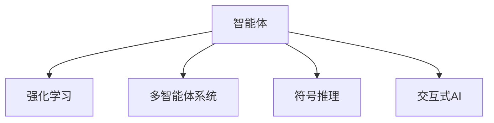

                 

# AI Agent: AI的下一个风口 智能体的核心技术

> 关键词：智能体(Agent), 强化学习(Reinforcement Learning), 多智能体系统(Multi-agent Systems), 符号推理(Symbolic Reasoning), 交互式AI (Interactive AI)

## 1. 背景介绍

### 1.1 问题由来
近年来，人工智能(AI)技术在各个领域取得了突破性进展，尤其是在深度学习、自然语言处理、计算机视觉等领域。然而，这些技术往往只能解决特定的问题，缺乏跨领域的通用性和智能交互能力。智能体(Agent)作为AI的新兴领域，为实现这一目标提供了新的方向。智能体不仅能理解环境变化，还能自主决策，形成社会化的交互行为，是未来AI的重要发展趋势。

智能体研究已涉足诸如自动驾驶、机器人、复杂系统优化、人机交互等多个应用场景。例如，自动驾驶汽车需要不断感知环境并做出精准决策；机器人需要在复杂环境中完成多种任务；复杂系统优化则需协调多个智能体共同作用。智能体技术正在逐步从理论走向实用，为AI的应用范围和能力带来了质的飞跃。

### 1.2 问题核心关键点
智能体技术的关键点在于其如何理解和适应动态多变的环境，并通过自主决策实现预定目标。与传统的基于规则和统计的方法相比，智能体能够不断学习和优化，展现出强大的自适应能力。

智能体技术主要包括以下几个方面：
1. 感知模块：通过传感器获取环境信息。
2. 决策模块：基于感知信息，通过算法制定决策策略。
3. 执行模块：将决策转化为具体行为。
4. 学习模块：根据环境反馈不断优化决策和行为策略。
5. 交互模块：与环境中的其他智能体进行交互和协作。

这些模块构成了一个闭环系统，智能体通过感知、决策、执行和交互不断循环迭代，实现环境的适应和优化。

### 1.3 问题研究意义
研究智能体技术，对于拓展AI的应用边界，提升系统的智能性和通用性，推动人工智能技术的产业化进程，具有重要意义：

1. 降低系统开发成本。智能体技术能够提高系统的自适应能力和决策效率，减少对外部环境的干预，降低开发和维护成本。
2. 提升系统性能。通过不断学习和优化，智能体能够在复杂多变的环境中保持稳定高效的运作。
3. 加速开发进度。智能体技术允许开发者构建具有自主决策能力的系统，快速响应环境变化，缩短开发周期。
4. 提供新的技术创新点。智能体的自适应和学习能力，带来了许多新的研究方向和应用场景，如多智能体协作、自适应游戏、交互式AI等。
5. 赋能产业升级。智能体技术使得系统能够更灵活地应对多变环境，提升了其在金融、医疗、教育等垂直行业的应用价值。

## 2. 核心概念与联系

### 2.1 核心概念概述

为更好地理解智能体技术，本节将介绍几个密切相关的核心概念：

- 智能体(Agent)：指能够在环境中感知、决策、执行和学习的系统。通过与环境进行交互，智能体能够实现特定目标。
- 强化学习(Reinforcement Learning, RL)：一种通过与环境交互，根据奖励信号不断优化策略的学习方法。智能体通过试错学习，逐步优化决策策略。
- 多智能体系统(Multi-agent Systems,MAS)：由多个智能体构成的系统，各智能体之间通过交互进行合作或竞争。多智能体系统需要考虑各智能体之间的协调和协作。
- 符号推理(Symbolic Reasoning)：指通过符号逻辑和推理技术，实现对复杂问题的解析和解决。符号推理常用于辅助智能体的决策和规划。
- 交互式AI(Interactive AI)：指能够与用户进行自然交互的AI系统，提供更加直观、高效的用户体验。交互式AI系统需具备理解用户意图和情感的能力。

这些核心概念之间的逻辑关系可以通过以下Mermaid流程图来展示：



这个流程图展示了几类智能体的共性特性及其相互联系：

1. 智能体通过与环境交互获取信息，并根据目标制定决策。
2. 强化学习为智能体提供了一个反馈机制，通过不断的试错优化决策策略。
3. 多智能体系统强调了智能体之间的协作和竞争，需要考虑各智能体的协调。
4. 符号推理为智能体提供了对问题的逻辑解析和推理能力，辅助决策和规划。
5. 交互式AI使智能体能够与用户进行自然交互，提供更好的用户体验。

## 3. 核心算法原理 & 具体操作步骤

### 3.1 算法原理概述

智能体的核心技术主要基于强化学习(Reinforcement Learning, RL)和符号推理(Symbolic Reasoning)两大理论。智能体通过感知环境，利用RL方法制定决策策略，并通过符号推理处理复杂任务，实现环境适应和目标实现。

具体而言，智能体在环境中执行一系列动作，根据环境反馈获得奖励信号，通过优化策略最大化期望奖励。智能体决策策略的优化过程由以下公式描述：

$$
\pi^* = \mathop{\arg\max}_{\pi} \mathbb{E}_{s \sim p}[R_\gamma(s,a,\pi)]
$$

其中 $\pi$ 表示策略，$p$ 表示环境状态分布，$R_\gamma$ 表示瞬时奖励函数，$\gamma$ 表示折扣因子。目标是最小化期望的累计折扣奖励，即最大化期望奖励。

在决策策略优化过程中，智能体通过逐步调整动作概率分布，探索和利用环境中的信息，实现目标的逐步逼近。这一过程可以使用蒙特卡罗方法、Q-learning、策略梯度方法等不同的算法实现。

### 3.2 算法步骤详解

智能体技术实现一般包括以下几个关键步骤：

**Step 1: 环境建模**
- 设计智能体所处的虚拟环境或真实环境，并确定状态空间、动作空间和奖励函数。
- 构建环境模拟器，模拟环境状态和动作的演变。

**Step 2: 感知与决策**
- 设计智能体的感知模块，实现对环境信息的采集和处理。
- 根据感知信息，设计决策模块，选择合适的动作策略。
- 将感知和决策模块封装为智能体类，实现感知、决策和执行的闭环迭代。

**Step 3: 训练与优化**
- 设定学习策略和优化算法，如Q-learning、策略梯度、蒙特卡罗树搜索等。
- 使用训练数据集对智能体进行训练，逐步调整策略，使期望奖励最大化。
- 使用验证集评估智能体的性能，根据性能反馈调整模型参数和策略。

**Step 4: 测试与部署**
- 在实际应用环境中测试智能体的性能，评估其适应性和稳定性。
- 将智能体部署到实际系统中，与其他智能体或系统进行交互。
- 持续收集反馈数据，不断迭代优化智能体性能。

以上是智能体技术的核心实现流程。在实际应用中，还需要针对具体问题进行优化设计，如选择合适的策略、优化参数调度和模型压缩等。

### 3.3 算法优缺点

智能体技术具有以下优点：
1. 适应性强。智能体能够在动态多变的环境中进行自主决策，适应性强。
2. 自我优化。通过不断的试错和学习，智能体能够优化策略，提高性能。
3. 灵活性高。智能体能够与多种类型的数据和模型进行交互，灵活性强。
4. 可扩展性。智能体技术能够应用于各种复杂的系统，可扩展性强。

同时，智能体技术也存在以下局限性：
1. 对环境建模依赖大。智能体的性能依赖于环境建模的准确性，一旦环境变化，智能体的学习过程可能受阻。
2. 计算复杂度高。智能体的学习和优化过程复杂，需要高计算资源支持。
3. 鲁棒性不足。智能体在面对突发情况和干扰时，可能表现出不稳定。
4. 策略收敛困难。智能体在学习过程中可能陷入局部最优解，难以收敛到全局最优。
5. 缺乏可解释性。智能体的决策过程缺乏直观的解释，难以理解其内部逻辑。

尽管存在这些局限性，但智能体技术仍是大势所趋，其在复杂系统优化、人机交互、自动化控制等领域的应用前景广阔。

### 3.4 算法应用领域

智能体技术已经广泛应用于自动化控制、机器人、智能交通、复杂系统优化等多个领域。以下是一些典型的应用场景：

1. 机器人导航与操作：智能体导航机器人通过环境感知和动作决策，实现自主导航和物品操作。
2. 自动驾驶汽车：智能体控制汽车在复杂交通环境中行驶，实现安全、高效的路径规划。
3. 智能电网：智能体控制电网中的电力分配，实现系统的稳定和优化。
4. 经济模拟与决策：智能体进行经济模型的模拟和预测，辅助经济决策。
5. 社交网络分析：智能体分析社交网络中的行为和关系，优化社交互动和信息传播。
6. 自动游戏AI：智能体在游戏中进行自主决策和策略优化，提升游戏体验。

以上场景展示了智能体技术的广泛应用和巨大潜力。随着技术的不断进步，智能体技术将在更多领域发挥重要作用。

## 4. 数学模型和公式 & 详细讲解  
### 4.1 数学模型构建

智能体技术的核心在于通过强化学习优化决策策略。以下我们将用数学语言详细描述这一过程。

假设智能体在环境中的状态空间为 $S$，动作空间为 $A$，瞬时奖励函数为 $R$，折扣因子为 $\gamma$，定义智能体的状态-动作-奖励轨迹为 $(s_0, a_0, r_0, s_1, a_1, r_1, ..., s_t, a_t, r_t, s_{t+1})$，其中 $s_t$ 表示状态，$a_t$ 表示动作，$r_t$ 表示瞬时奖励。智能体的目标是最小化累计折扣奖励，即：

$$
J(\pi) = \mathbb{E}_{s_0 \sim p}[R_\gamma(s_0, a_0, \pi)]
$$

在实际应用中，智能体通过与环境交互获得轨迹，并根据轨迹计算累计奖励。目标是通过优化策略 $\pi$，使期望累计奖励最大化。

### 4.2 公式推导过程

以下是智能体决策策略优化的数学推导过程。

首先，定义智能体在状态 $s_t$ 时，采取动作 $a_t$ 的瞬时奖励为 $r_t$，状态 $s_{t+1}$ 为下一步状态。智能体的期望奖励为：

$$
J(\pi) = \mathbb{E}_{s_0 \sim p}[R_\gamma(s_0, a_0, \pi)]
$$

通过马尔可夫性质，可以得到期望奖励的递推式：

$$
J(\pi) = \sum_{t=0}^{\infty} \gamma^t \mathbb{E}_{s_0 \sim p}[R_\gamma(s_0, a_0, \pi)]
$$

进一步展开得到：

$$
J(\pi) = \sum_{t=0}^{\infty} \gamma^t r_t + \gamma^{t+1} J(\pi) + \gamma^{t+2} J(\pi) + ...
$$

将上式整理得到：

$$
J(\pi) = \mathbb{E}_{s_0 \sim p}[R_\gamma(s_0, a_0, \pi)] + \gamma J(\pi)
$$

化简得到：

$$
J(\pi) - \gamma J(\pi) = \mathbb{E}_{s_0 \sim p}[R_\gamma(s_0, a_0, \pi)]
$$

即：

$$
(1-\gamma) J(\pi) = \mathbb{E}_{s_0 \sim p}[R_\gamma(s_0, a_0, \pi)]
$$

最后得到智能体目标函数：

$$
J(\pi) = \frac{1}{1-\gamma} \mathbb{E}_{s_0 \sim p}[R_\gamma(s_0, a_0, \pi)]
$$

在实际应用中，智能体的目标函数可以被优化算法求解，从而找到最优策略。

### 4.3 案例分析与讲解

以下是智能体在自动驾驶汽车中的应用案例：

假设自动驾驶汽车在道路上的状态空间为 $S$，包括车的位置、速度、周围车辆和行人等，动作空间为 $A$，包括加速、减速、转向等。汽车通过摄像头、雷达等传感器感知周围环境，根据当前状态和动作选择最优路径。汽车的奖励函数定义为到达目的地的时间成本，越快到达目的地，获得的奖励越高。

智能体的目标是通过优化动作策略，最小化累计时间成本，实现高效的路径规划。通过与环境交互，智能体不断尝试不同的动作，根据实时状态调整策略，从而逐步优化路径规划。

例如，智能体可以通过Q-learning算法，逐步优化动作策略，最终找到最优路径。具体步骤如下：

1. 初始化Q值表 $Q(s,a)$，设定学习率 $\alpha$，折扣因子 $\gamma$。
2. 在每个时间步，智能体感知环境，选择动作 $a_t$，执行动作并得到瞬时奖励 $r_t$ 和下一步状态 $s_{t+1}$。
3. 根据当前状态和动作，更新Q值表：

   $$
   Q(s_t, a_t) \leftarrow Q(s_t, a_t) + \alpha (r_t + \gamma \max Q(s_{t+1}, \cdot) - Q(s_t, a_t))
   $$

4. 重复执行步骤2和步骤3，直至达到终止条件。

通过不断迭代，智能体能够逐步优化路径规划策略，实现高效安全的自动驾驶。

## 5. 项目实践：代码实例和详细解释说明
### 5.1 开发环境搭建

在进行智能体实践前，我们需要准备好开发环境。以下是使用Python进行Reinforcement Learning开发的环境配置流程：

1. 安装Anaconda：从官网下载并安装Anaconda，用于创建独立的Python环境。

2. 创建并激活虚拟环境：
```bash
conda create -n rein-env python=3.8 
conda activate rein-env
```

3. 安装PyTorch、TorchVision、TorchAudio、Pygame等依赖库：
```bash
pip install torch torchvision torchaudio pygame
```

4. 安装RL相关的库：
```bash
pip install stable-baselines3 stable-baselines3-contrib
```

5. 安装Lidar库：
```bash
pip install lidar-gym
```

6. 安装PyBullet库：
```bash
pip install pybullet
```

完成上述步骤后，即可在`rein-env`环境中开始智能体实践。

### 5.2 源代码详细实现

这里我们以自动驾驶汽车的路径规划为例，给出使用Stable Baselines3库对智能体进行Reinforcement Learning代码实现。

首先，定义环境类：

```python
import gym
from stable_baselines3 import A2C
from stable_baselines3.common.vec_env import VecEnv
from stable_baselines3.common.policies import MlpPolicy
import torch

class CarEnv(gym.Env):
    def __init__(self):
        super(CarEnv, self).__init__()
        self.viewer = None
        self.action_space = gym.spaces.Discrete(4) # 动作空间为加速、减速、左转、右转
        self.state = 0 # 初始状态

    def reset(self):
        self.state = 0
        return np.array([self.state])

    def step(self, action):
        self.state += action
        if self.state > 3:
            self.state = 0
        return np.array([self.state]), float('-inf'), False, {}
```

然后，定义智能体模型和训练参数：

```python
model = A2C(MlpPolicy, CarEnv, verbose=1)
model.learn(total_timesteps=5000)
```

接着，定义训练和评估函数：

```python
def train(model, env):
    obs = env.reset()
    done = False
    steps = 0
    while not done:
        action, _states, done, info = model.predict(obs)
        obs, reward, done, info = env.step(action)
        steps += 1
    print("训练完成，总步数：", steps)
    
def test(model, env):
    obs = env.reset()
    done = False
    steps = 0
    while not done:
        action, _states, done, info = model.predict(obs)
        obs, reward, done, info = env.step(action)
        steps += 1
    print("测试完成，总步数：", steps)
```

最后，启动训练流程并在测试集上评估：

```python
env = CarEnv()
train(model, env)
test(model, env)
```

以上就是使用Stable Baselines3库对自动驾驶汽车路径规划进行Reinforcement Learning的完整代码实现。可以看到，得益于Stable Baselines3的强大封装，我们可以用相对简洁的代码完成智能体的加载和训练。

### 5.3 代码解读与分析

让我们再详细解读一下关键代码的实现细节：

**CarEnv类**：
- `__init__`方法：初始化环境，定义状态空间和动作空间。
- `reset`方法：重置环境状态，返回初始状态。
- `step`方法：根据动作执行环境状态更新，返回状态、奖励和结束信号。

**A2C模型和训练参数**：
- `model = A2C(MlpPolicy, CarEnv, verbose=1)`：使用A2C算法训练模型，其中MlpPolicy为模型策略，CarEnv为环境，verbose=1表示打印训练过程信息。
- `model.learn(total_timesteps=5000)`：设置总训练步数。

**训练和评估函数**：
- 使用A2C模型进行路径规划训练，并通过不断迭代调整动作策略。
- `train`函数：循环执行环境状态更新和模型预测，直至达到终止条件。
- `test`函数：测试模型在环境中的表现，记录总步数。

**训练流程**：
- 定义环境实例，并启动训练过程。
- 在训练过程中，不断更新动作策略，优化路径规划。
- 在测试过程中，记录模型在环境中的总步数，评估性能。

可以看到，Reinforcement Learning使得智能体训练和优化过程变得高效简洁。开发者可以将更多精力放在环境建模、模型设计等高层逻辑上，而不必过多关注底层的实现细节。

当然，工业级的系统实现还需考虑更多因素，如环境模拟器的优化、多智能体协作等，但核心的Reinforcement Learning流程基本与此类似。

## 6. 实际应用场景
### 6.1 智能机器人导航

智能体技术在智能机器人导航中有着广泛的应用。通过与环境交互，智能体能够实时感知周围环境，自动规划最优路径，实现自主导航。

在技术实现上，可以设计一个高精度的激光雷达传感器，结合计算机视觉技术，实现对环境的实时感知。智能体则通过与传感器数据交互，规划最优路径，避开障碍物，最终到达目标位置。这一过程可以用于无人配送、自动化仓库管理等场景。

### 6.2 金融市场模拟

智能体技术在金融市场模拟中也具有重要应用。通过建立金融市场的虚拟环境，智能体能够模拟市场动态，优化投资策略，预测市场走势。

具体而言，可以构建一个包含股票、债券、商品等多种金融产品的市场环境，智能体通过与市场交互，学习最优的投资策略，实现收益最大化。这一过程可以用于自动化交易系统、风险管理等场景。

### 6.3 自动化生产系统

智能体技术在自动化生产系统中也有着广泛的应用。通过与生产设备交互，智能体能够实时感知生产状态，优化生产流程，提高生产效率。

例如，在汽车生产线上，智能体可以通过与生产线传感器交互，实时调整生产速度和资源分配，实现高效的生产调度。这一过程可以用于智能制造、智能仓储等场景。

### 6.4 未来应用展望

随着智能体技术的发展，其应用场景将进一步拓展，带来更广阔的发展前景：

1. 自动化协作系统：智能体技术将在自动化协作系统中发挥重要作用，支持多个智能体协同完成任务，提高系统效率和灵活性。
2. 智能制造与机器人：智能体技术将推动智能制造与机器人技术的发展，实现生产线的智能化和自动化。
3. 多智能体博弈：智能体技术将支持多智能体博弈模型的研究，提供新的理论工具和方法。
4. 自动驾驶与交通管理：智能体技术将在自动驾驶和交通管理中发挥重要作用，实现交通流量的优化和动态调度。
5. 医疗健康：智能体技术将支持医疗健康系统的智能化，实现患者信息和诊疗过程的优化管理。

以上趋势凸显了智能体技术的巨大前景。这些方向的探索发展，必将进一步提升智能体系统的性能和应用范围，为社会的各个领域带来深刻变革。

## 7. 工具和资源推荐
### 7.1 学习资源推荐

为了帮助开发者系统掌握智能体技术的基础知识和应用技能，这里推荐一些优质的学习资源：

1. 《强化学习：经典算法和现代方法》：详细介绍了强化学习的基本理论和经典算法，是学习智能体技术的重要入门书籍。
2. 《Reinforcement Learning: An Introduction》：经典的强化学习教材，由Richard Sutton和Andrew Barto撰写，提供了丰富的案例和代码实现。
3. 《Python深度学习》：介绍深度学习基础和强化学习应用，涵盖了智能体技术的核心内容。
4. 《Deep Reinforcement Learning for Games: Graph Neural Networks in General Game Playing》：介绍深度强化学习在游戏中的应用，提供了丰富的案例和代码实现。
5. 《Stable Baselines3》：使用TensorFlow和PyTorch实现的强化学习库，支持多种智能体算法和环境，提供了丰富的API和文档。

通过对这些资源的学习实践，相信你一定能够快速掌握智能体技术的精髓，并用于解决实际的NLP问题。

### 7.2 开发工具推荐

高效的开发离不开优秀的工具支持。以下是几款用于智能体技术开发的常用工具：

1. Stable Baselines3：使用TensorFlow和PyTorch实现的强化学习库，支持多种智能体算法和环境，提供了丰富的API和文档。
2. OpenAI Gym：开放源代码的强化学习环境库，提供了多种环境模拟器和评估工具。
3. PyBullet：用于机器人仿真和控制的库，支持多种物理引擎和传感器。
4. Lidar gym：用于激光雷达仿真的库，支持多种激光雷达传感器和环境。
5. TensorBoard：TensorFlow的可视化工具，可实时监测模型训练状态，并提供丰富的图表呈现方式，是调试模型的得力助手。

合理利用这些工具，可以显著提升智能体技术的开发效率，加快创新迭代的步伐。

### 7.3 相关论文推荐

智能体技术的发展源于学界的持续研究。以下是几篇奠基性的相关论文，推荐阅读：

1. 《Reinforcement Learning: An Introduction》：由Richard Sutton和Andrew Barto撰写，详细介绍了强化学习的基本理论和经典算法。
2. 《Playing Atari with Deep Reinforcement Learning》：DeepMind的研究人员使用深度强化学习成功训练了游戏AI，取得突破性成果。
3. 《AlphaGo Zero》：DeepMind的研究人员使用强化学习训练了AlphaGo Zero，并成功击败人类世界冠军。
4. 《Multi-Agent Reinforcement Learning: Independent, Interdependent, and Hierarchical Agents》：提出了多智能体系统的强化学习方法，强调了智能体之间的协作和竞争。
5. 《Multi-Agent Deep Reinforcement Learning》：介绍了多智能体深度强化学习的研究进展和应用实例。

这些论文代表了大智能体技术的发展脉络。通过学习这些前沿成果，可以帮助研究者把握学科前进方向，激发更多的创新灵感。

## 8. 总结：未来发展趋势与挑战

### 8.1 研究成果总结

智能体技术作为AI的新兴领域，已经取得了一系列重要的研究成果。这些成果包括：
1. 基于强化学习的路径规划算法。智能体通过感知和决策，实现了高效的环境适应和路径规划。
2. 基于符号推理的决策支持系统。智能体通过逻辑推理和知识库辅助，实现了对复杂问题的解析和解决。
3. 多智能体协作系统。智能体通过交互和协作，实现了协同决策和任务优化。
4. 交互式AI系统。智能体通过自然交互，提供了更好的用户体验。

### 8.2 未来发展趋势

展望未来，智能体技术将呈现以下几个发展趋势：

1. 多智能体协作系统：智能体技术将支持多智能体协作系统的研究，提供新的理论工具和方法。
2. 符号推理和知识库的融合：智能体将与符号推理和知识库结合，实现更加全面、准确的信息整合能力。
3. 自适应学习能力的提升：智能体将通过学习环境的动态变化，不断优化自身策略，提高适应性和鲁棒性。
4. 交互式AI的普及：智能体技术将支持交互式AI系统的发展，提供更直观、高效的用户体验。
5. 强化学习的优化：强化学习算法将不断优化，实现更高效的策略学习。

### 8.3 面临的挑战

尽管智能体技术已经取得了不少成果，但在迈向更加智能化、普适化应用的过程中，仍面临诸多挑战：

1. 环境建模的复杂性：智能体需要准确建模环境，才能实现高效的策略优化。环境建模的复杂性往往难以准确处理，影响智能体的性能。
2. 计算资源的需求：智能体训练和优化过程需要大量的计算资源，对硬件设施提出了较高的要求。
3. 策略收敛的困难：智能体在学习和优化过程中可能陷入局部最优解，难以收敛到全局最优。
4. 策略的鲁棒性：智能体在面对突发情况和干扰时，可能表现出不稳定。
5. 策略的可解释性：智能体的决策过程缺乏直观的解释，难以理解其内部逻辑。

### 8.4 研究展望

面对智能体技术面临的挑战，未来的研究需要在以下几个方面寻求新的突破：

1. 强化学习算法的优化：开发更加高效的强化学习算法，减少计算资源的消耗，提升策略收敛速度。
2. 环境建模的技术：提升环境建模的精度和复杂度，实现更加逼真的环境模拟。
3. 多智能体协作的机制：研究多智能体协作的机制，实现高效的协同决策和任务优化。
4. 知识库和逻辑推理的融合：将符号推理和知识库与智能体结合，实现更加全面的信息整合能力。
5. 交互式AI的扩展：研究交互式AI的扩展技术，提供更直观、高效的用户体验。

这些研究方向的探索，必将引领智能体技术迈向更高的台阶，为构建安全、可靠、可解释、可控的智能系统铺平道路。面向未来，智能体技术还需要与其他人工智能技术进行更深入的融合，如知识表示、因果推理、强化学习等，多路径协同发力，共同推动自然语言理解和智能交互系统的进步。只有勇于创新、敢于突破，才能不断拓展智能体的边界，让智能技术更好地造福人类社会。

## 9. 附录：常见问题与解答

**Q1：智能体技术是否适用于所有环境？**

A: 智能体技术具有较强的环境适应能力，但环境建模的复杂性和精度直接影响智能体的性能。对于简单的环境，智能体可以取得较好的效果。但对于复杂多变的环境，智能体的性能可能受限。

**Q2：智能体技术是否需要大量的训练数据？**

A: 智能体技术通过与环境的交互进行学习，通常不需要大量训练数据。但对于一些复杂的任务，如高精度路径规划、多智能体协作等，需要更长的训练时间和更多的样本支持。

**Q3：智能体的学习过程是否容易陷入局部最优解？**

A: 智能体的学习过程可能会陷入局部最优解，但通过选择合适的优化算法和策略，可以提升策略的收敛性和全局性。常用的优化算法包括梯度下降、Adam、REINFORCE等。

**Q4：智能体的策略是否具有可解释性？**

A: 智能体的策略缺乏直观的解释，通常需要借助可视化工具或模型分析方法来理解其内部机制。符号推理和逻辑推理可以辅助智能体，提供更清晰的决策过程。

**Q5：智能体在实际应用中是否需要人工干预？**

A: 智能体在实际应用中可能需要进行人工干预，特别是在高风险场景下。通过人工干预，可以增强系统的安全性和可靠性。

---

作者：禅与计算机程序设计艺术 / Zen and the Art of Computer Programming

