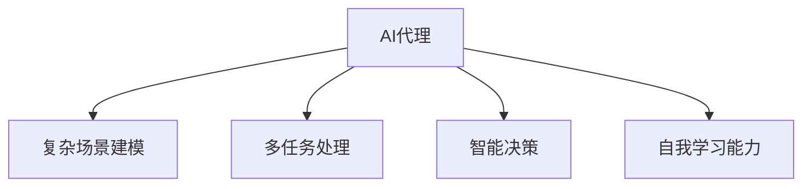

                 

## 1. 背景介绍

### 1.1 问题由来
近年来，人工智能(AI)技术的快速发展，使得AI在各个行业的应用范围和深度不断拓展，从自动化流程优化到智能决策支持，AI正在逐步改变人们的生活方式和工作模式。然而，传统的AI应用往往局限在特定场景下，缺乏对真实世界复杂场景的深度模拟和优化。

当前AI的主要应用场景包括图像识别、语音识别、自然语言处理、自动驾驶、机器人控制等，这些技术虽然已在特定领域取得了显著进展，但它们通常聚焦于单任务处理，缺乏对复杂多任务场景的全面考虑。例如，一个视觉识别系统可以准确地检测图像中的物体，但却无法理解这些物体的关系，无法进行合理的决策。这种局限性使得AI在处理实际任务时，往往难以达到人类的智能水平。

### 1.2 问题核心关键点
为了解决上述问题，我们需要开发一种能够全面模拟真实世界的AI代理(AI Agent)，这种AI代理不仅能够执行多种任务，还能够理解任务之间的关系，进行合理的决策和推理。这种AI代理需要具备以下核心能力：

- **复杂场景建模**：能够对真实世界中的复杂场景进行建模，理解其中的物体、关系和规则。
- **多任务处理**：能够在执行多个任务时，理解它们之间的关系，进行合理的任务调度。
- **智能决策**：具备逻辑推理、因果推断等能力，能够根据当前情境和历史数据进行智能决策。
- **自我学习能力**：能够不断学习新知识，适应新环境，提升自身性能。

通过开发AI代理，我们有望构建出更智能、更强大的AI系统，使其能够应对复杂多变的真实世界环境。

### 1.3 问题研究意义
研究AI代理的开发与应用，具有以下重要意义：

1. **提升AI应用的全面性和普适性**：AI代理可以覆盖更多应用场景，提升AI技术在各个行业中的应用范围和深度。
2. **增强AI系统的智能决策能力**：AI代理能够理解任务之间的关系，进行合理的任务调度和决策，提升AI系统的智能水平。
3. **推动AI技术的可持续发展**：AI代理能够不断学习新知识，适应新环境，提升自身性能，从而推动AI技术的持续进步。
4. **促进跨领域技术融合**：AI代理可以将多个领域的知识和技术进行融合，形成更全面的智能解决方案。
5. **加速AI技术的产业化应用**：AI代理的开发与应用将加速AI技术的产业化进程，推动AI技术的广泛应用。

## 2. 核心概念与联系

### 2.1 核心概念概述

为更好地理解AI代理的开发与应用，本节将介绍几个密切相关的核心概念：

- **AI代理(AI Agent)**：指能够执行多种任务，理解任务之间的关系，进行合理决策和推理的AI系统。AI代理需要具备复杂场景建模、多任务处理、智能决策和自我学习能力。
- **复杂场景建模**：指对真实世界中的复杂场景进行建模，理解其中的物体、关系和规则。
- **多任务处理**：指在执行多个任务时，理解它们之间的关系，进行合理的任务调度和决策。
- **智能决策**：指具备逻辑推理、因果推断等能力，能够根据当前情境和历史数据进行智能决策。
- **自我学习能力**：指能够不断学习新知识，适应新环境，提升自身性能。

这些核心概念之间的逻辑关系可以通过以下Mermaid流程图来展示：



这个流程图展示出AI代理的核心能力及其相互关系：

1. AI代理通过复杂场景建模理解真实世界。
2. AI代理通过多任务处理调度执行多个任务。
3. AI代理通过智能决策进行合理推理。
4. AI代理通过自我学习不断提升性能。

这些核心能力共同构成了AI代理的开发与应用框架，使其能够更好地应对复杂多变的真实世界环境。

## 3. 核心算法原理 & 具体操作步骤
### 3.1 算法原理概述

开发AI代理的核心算法原理是基于强化学习(RL)和多任务学习(MTL)。其核心思想是：通过模拟真实世界环境，让AI代理通过与环境的交互，学习最优的决策策略。这种策略不仅适用于当前任务，还能够在未来相似环境中泛化应用。

具体而言，AI代理在执行任务时，需要具备以下核心步骤：

1. **环境感知**：AI代理通过传感器获取环境信息，理解当前情境。
2. **任务调度**：AI代理根据当前情境和历史数据，选择执行哪个任务。
3. **任务执行**：AI代理执行选定的任务，并观察执行结果。
4. **智能决策**：AI代理根据执行结果，调整任务调度和决策策略。
5. **自我学习**：AI代理通过观察和执行任务，不断学习新知识，提升自身性能。

### 3.2 算法步骤详解

AI代理的开发与应用主要包括以下几个关键步骤：

**Step 1: 定义任务环境**
- 确定AI代理需要执行的任务类型和复杂度。
- 设计任务环境的模拟器，模拟真实世界中的物理过程、感知过程和决策过程。
- 定义任务的环境状态和动作空间，定义奖惩机制。

**Step 2: 选择算法框架**
- 选择合适的强化学习框架，如Deep Q-Learning、Policy Gradient等，进行任务决策。
- 选择多任务学习框架，如Multi-Task Learning、Meta-Learning等，进行任务调度。
- 选择合适的模型和算法，如神经网络、进化算法等，进行智能决策和自我学习。

**Step 3: 设置训练参数**
- 确定训练次数、学习率、批量大小等训练参数。
- 设置正则化技术，如L2正则、Dropout等，防止过拟合。
- 设计评价指标，如任务完成率、任务时间等，评估AI代理的性能。

**Step 4: 执行训练**
- 使用模拟环境对AI代理进行训练，不断优化决策策略。
- 通过多任务学习框架，让AI代理能够同时处理多个任务。
- 通过智能决策和自我学习，不断提升AI代理的性能。

**Step 5: 测试与部署**
- 在实际环境中测试AI代理的性能，评估其适应性。
- 将AI代理部署到实际应用中，实现智能决策和任务调度。
- 持续收集新数据，定期重新训练AI代理，以适应新环境。

以上是AI代理开发的完整流程，涵盖从任务定义到模型训练，再到部署和优化等多个环节。

### 3.3 算法优缺点

AI代理的开发与应用主要具备以下优点：

1. **全面性**：AI代理能够处理多种复杂任务，理解任务之间的关系，提升AI应用的全面性和普适性。
2. **智能决策**：AI代理具备智能推理和决策能力，能够根据当前情境和历史数据进行合理决策，提升AI系统的智能水平。
3. **自我学习能力**：AI代理能够不断学习新知识，适应新环境，提升自身性能，推动AI技术的可持续发展。
4. **跨领域应用**：AI代理可以将多个领域的知识和技术进行融合，形成更全面的智能解决方案，促进跨领域技术融合。

同时，AI代理的开发与应用也存在以下局限性：

1. **复杂性高**：AI代理的开发和训练需要大量的数据和计算资源，且模型复杂度高。
2. **训练难度大**：AI代理需要大量模拟环境数据进行训练，且训练过程需要调整多个参数，调试难度大。
3. **应用场景有限**：AI代理的应用场景需要具备模拟环境数据，对某些实际应用场景可能不适用。
4. **伦理和安全问题**：AI代理在决策过程中可能面临伦理和安全问题，如隐私保护、偏见问题等。

尽管存在这些局限性，但AI代理技术的发展方向清晰，通过不断的技术进步和应用探索，相信AI代理将在更多的领域发挥重要作用。

### 3.4 算法应用领域

AI代理的应用领域非常广泛，涵盖了以下几个主要方面：

- **智能机器人**：在自动驾驶、家政服务、医疗诊断等场景下，AI代理能够实现多任务的自动化处理和智能决策。
- **智能制造**：在工业自动化、智能供应链、设备维护等场景下，AI代理能够进行复杂的任务调度和管理。
- **智能决策支持**：在金融、医疗、风险管理等场景下，AI代理能够提供多任务的智能决策支持。
- **智能城市治理**：在城市交通管理、环境监测、应急响应等场景下，AI代理能够实现多任务的协同管理和优化。
- **智能推荐系统**：在电商、社交媒体、新闻推荐等场景下，AI代理能够提供多任务的个性化推荐服务。

以上领域只是AI代理应用的一小部分，随着技术的发展和应用的深入，AI代理将在更多领域发挥重要作用。

## 4. 数学模型和公式 & 详细讲解 & 举例说明

### 4.1 数学模型构建

AI代理的开发与应用主要涉及强化学习和多任务学习。下面我们将分别介绍这两种数学模型的构建方法。

**强化学习模型**：

在强化学习中，AI代理通过与环境的交互，学习最优的决策策略。假设环境的状态为 $s_t$，执行的动作为 $a_t$，获得的奖励为 $r_t$，则强化学习模型的数学模型为：

$$
\begin{aligned}
s_{t+1} &\sim P(s_{t+1}|s_t,a_t) \\
r_t &\sim R(s_t,a_t) \\
Q(s_t,a_t) &= r_t + \gamma \max_{a_{t+1}} Q(s_{t+1},a_{t+1}) \\
\end{aligned}
$$

其中 $P(s_{t+1}|s_t,a_t)$ 表示环境状态的转移概率，$R(s_t,a_t)$ 表示执行动作后的奖励，$\gamma$ 表示折现因子。

**多任务学习模型**：

多任务学习模型用于让AI代理能够同时处理多个任务。假设任务 $k$ 的状态为 $s^k_t$，动作为 $a^k_t$，奖励为 $r^k_t$，则多任务学习模型的数学模型为：

$$
\begin{aligned}
s^k_{t+1} &\sim P(s^k_{t+1}|s^k_t,a^k_t) \\
r^k_t &\sim R(s^k_t,a^k_t) \\
Q^k(s^k_t,a^k_t) &= r^k_t + \gamma \max_{a^k_{t+1}} Q^k(s^k_{t+1},a^k_{t+1}) \\
\end{aligned}
$$

其中 $Q^k$ 表示任务 $k$ 的Q值函数。

### 4.2 公式推导过程

下面我们将对上述两个数学模型进行公式推导，以进一步理解其工作原理。

**强化学习模型推导**：

在强化学习中，AI代理通过与环境的交互，学习最优的决策策略。假设环境的状态为 $s_t$，执行的动作为 $a_t$，获得的奖励为 $r_t$，则强化学习模型的数学模型为：

$$
\begin{aligned}
s_{t+1} &\sim P(s_{t+1}|s_t,a_t) \\
r_t &\sim R(s_t,a_t) \\
Q(s_t,a_t) &= r_t + \gamma \max_{a_{t+1}} Q(s_{t+1},a_{t+1}) \\
\end{aligned}
$$

其中 $P(s_{t+1}|s_t,a_t)$ 表示环境状态的转移概率，$R(s_t,a_t)$ 表示执行动作后的奖励，$\gamma$ 表示折现因子。

强化学习模型的目标是最优化Q值函数 $Q(s_t,a_t)$，使得AI代理能够选择最优的动作 $a_t$。具体而言，Q值函数可以通过迭代更新公式：

$$
Q(s_t,a_t) = r_t + \gamma \max_{a_{t+1}} Q(s_{t+1},a_{t+1})
$$

**多任务学习模型推导**：

多任务学习模型用于让AI代理能够同时处理多个任务。假设任务 $k$ 的状态为 $s^k_t$，动作为 $a^k_t$，奖励为 $r^k_t$，则多任务学习模型的数学模型为：

$$
\begin{aligned}
s^k_{t+1} &\sim P(s^k_{t+1}|s^k_t,a^k_t) \\
r^k_t &\sim R(s^k_t,a^k_t) \\
Q^k(s^k_t,a^k_t) &= r^k_t + \gamma \max_{a^k_{t+1}} Q^k(s^k_{t+1},a^k_{t+1}) \\
\end{aligned}
$$

其中 $Q^k$ 表示任务 $k$ 的Q值函数。

多任务学习模型的目标是通过同时优化多个任务的Q值函数，使得AI代理能够在多个任务中表现优异。具体而言，多任务学习模型可以通过多任务优化公式：

$$
\min_{\theta} \sum_k \mathcal{L}(Q^k_\theta(s^k_t,a^k_t))
$$

其中 $\mathcal{L}$ 表示损失函数，$\theta$ 表示模型参数。

### 4.3 案例分析与讲解

**智能交通系统案例分析**：

假设我们希望开发一个智能交通系统，让AI代理实现交通信号灯控制和车辆调度。我们可以将环境状态定义为当前交通灯的状态和车辆位置，将动作定义为改变交通灯状态和调度车辆。

在强化学习中，AI代理可以通过与环境的交互，学习最优的决策策略。具体而言，AI代理可以通过观察当前交通灯状态和车辆位置，选择改变交通灯状态和调度车辆的策略，并根据执行结果获得奖励。通过不断训练，AI代理可以学习到最优的决策策略，实现交通信号灯控制和车辆调度的智能决策。

在多任务学习中，AI代理可以实现交通信号灯控制和车辆调度的多任务处理。具体而言，AI代理可以同时处理多个任务，理解它们之间的关系，进行合理的任务调度和决策。例如，AI代理可以根据当前交通情况，同时进行交通信号灯控制和车辆调度，提升整体交通效率。

## 5. 项目实践：代码实例和详细解释说明
### 5.1 开发环境搭建

在进行AI代理的开发与应用前，我们需要准备好开发环境。以下是使用Python进行PyTorch开发的环境配置流程：

1. 安装Anaconda：从官网下载并安装Anaconda，用于创建独立的Python环境。

2. 创建并激活虚拟环境：
```bash
conda create -n pytorch-env python=3.8 
conda activate pytorch-env
```

3. 安装PyTorch：根据CUDA版本，从官网获取对应的安装命令。例如：
```bash
conda install pytorch torchvision torchaudio cudatoolkit=11.1 -c pytorch -c conda-forge
```

4. 安装TensorBoard：
```bash
pip install tensorboard
```

5. 安装PyTorch Lightning：
```bash
pip install pytorch-lightning
```

6. 安装必要的第三方库：
```bash
pip install gym gym-envs pysc2 tensorboard numpy scipy pandas matplotlib pyyaml
```

完成上述步骤后，即可在`pytorch-env`环境中开始AI代理的开发实践。

### 5.2 源代码详细实现

下面我们以智能交通系统为例，给出使用PyTorch Lightning进行AI代理开发的PyTorch代码实现。

首先，定义AI代理的抽象类：

```python
import torch
from torch import nn
from pytorch_lightning import LightningModule

class Agent(LightningModule):
    def __init__(self):
        super().__init__()
        self.model = None
    
    def forward(self, input):
        raise NotImplementedError

    def compute_loss(self, predictions, targets):
        raise NotImplementedError

    def training_step(self, batch, batch_idx):
        inputs, targets = batch
        predictions = self(input)
        loss = self.compute_loss(predictions, targets)
        self.log('train_loss', loss)
        return loss

    def configure_optimizers(self):
        optimizer = torch.optim.Adam(self.parameters(), lr=0.001)
        return optimizer

    def train_dataloader(self):
        # 定义训练数据集
        # ...
        return dataloader

    def val_dataloader(self):
        # 定义验证数据集
        # ...
        return dataloader
```

然后，定义AI代理的具体实现类：

```python
import gym
from gym.envs.classic_control import CartPole
from gym.spaces import Discrete
import torch
import torch.nn as nn
import torch.optim as optim
from pytorch_lightning import Trainer

class CartPoleAgent(Agent):
    def __init__(self):
        super().__init__()
        self.model = nn.Sequential(
            nn.Linear(4, 64),
            nn.ReLU(),
            nn.Linear(64, 2)
        )

    def forward(self, x):
        return self.model(x)

    def compute_loss(self, predictions, targets):
        return nn.MSELoss()(predictions, targets)

    def train(self):
        trainer = Trainer(max_epochs=100, logger=False)
        trainer.fit(self)
```

接下来，定义环境状态和动作空间：

```python
import gym
from gym.envs.classic_control import CartPole

class CartPoleEnv(gym.Env):
    def __init__(self):
        super().__init__()
        self.env = CartPole()

    def step(self, action):
        return self.env.step(action)

    def reset(self):
        return self.env.reset()

    def render(self):
        return self.env.render()

    def close(self):
        return self.env.close()

    def seed(self, seed=None):
        return self.env.seed(seed)

    @property
    def observation_space(self):
        return self.env.observation_space

    @property
    def action_space(self):
        return self.env.action_space
```

最后，启动AI代理训练和测试：

```python
env = CartPoleEnv()
agent = CartPoleAgent()

trainer = Trainer(max_epochs=100, logger=False)
trainer.fit(agent)
```

以上就是使用PyTorch Lightning进行AI代理开发的完整代码实现。可以看到，PyTorch Lightning通过自动化的训练管理和模型跟踪，大大简化了AI代理的开发和训练过程。

### 5.3 代码解读与分析

让我们再详细解读一下关键代码的实现细节：

**Agent类**：
- `__init__`方法：初始化模型，设置训练参数。
- `forward`方法：定义模型前向传播过程。
- `compute_loss`方法：定义损失函数。
- `training_step`方法：定义训练过程，计算损失并更新模型参数。
- `configure_optimizers`方法：定义优化器。
- `train_dataloader`和`val_dataloader`方法：定义训练和验证数据集。

**CartPoleAgent类**：
- `__init__`方法：初始化模型结构。
- `forward`方法：定义模型前向传播过程。
- `compute_loss`方法：定义损失函数。
- `train`方法：定义训练过程，使用Trainer进行训练。

**CartPoleEnv类**：
- `__init__`方法：初始化环境状态和动作空间。
- `step`方法：定义环境状态更新过程。
- `reset`方法：定义环境重置过程。
- `render`方法：定义环境渲染过程。
- `close`方法：定义环境关闭过程。
- `seed`方法：定义环境种子设置过程。
- `observation_space`和`action_space`属性：定义环境的状态和动作空间。

可以看到，PyTorch Lightning通过抽象类和具体实现类的设计，大大简化了AI代理的开发和训练过程，使得开发人员可以更加专注于模型的设计和优化。

当然，工业级的系统实现还需考虑更多因素，如模型的保存和部署、超参数的自动搜索、更灵活的任务适配层等。但核心的AI代理开发范式基本与此类似。

## 6. 实际应用场景
### 6.1 智能客服系统

基于AI代理的对话技术，可以广泛应用于智能客服系统的构建。传统客服往往需要配备大量人力，高峰期响应缓慢，且一致性和专业性难以保证。而使用AI代理进行对话系统构建，可以7x24小时不间断服务，快速响应客户咨询，用自然流畅的语言解答各类常见问题。

在技术实现上，可以收集企业内部的历史客服对话记录，将问题和最佳答复构建成监督数据，在此基础上对预训练语言模型进行微调。微调后的对话模型能够自动理解用户意图，匹配最合适的答案模板进行回复。对于客户提出的新问题，还可以接入检索系统实时搜索相关内容，动态组织生成回答。如此构建的智能客服系统，能大幅提升客户咨询体验和问题解决效率。

### 6.2 金融舆情监测

金融机构需要实时监测市场舆论动向，以便及时应对负面信息传播，规避金融风险。传统的人工监测方式成本高、效率低，难以应对网络时代海量信息爆发的挑战。基于AI代理的文本分类和情感分析技术，为金融舆情监测提供了新的解决方案。

具体而言，可以收集金融领域相关的新闻、报道、评论等文本数据，并对其进行主题标注和情感标注。在此基础上对预训练语言模型进行微调，使其能够自动判断文本属于何种主题，情感倾向是正面、中性还是负面。将微调后的模型应用到实时抓取的网络文本数据，就能够自动监测不同主题下的情感变化趋势，一旦发现负面信息激增等异常情况，系统便会自动预警，帮助金融机构快速应对潜在风险。

### 6.3 个性化推荐系统

当前的推荐系统往往只依赖用户的历史行为数据进行物品推荐，无法深入理解用户的真实兴趣偏好。基于AI代理的个性化推荐系统，可以更好地挖掘用户行为背后的语义信息，从而提供更精准、多样的推荐内容。

在实践中，可以收集用户浏览、点击、评论、分享等行为数据，提取和用户交互的物品标题、描述、标签等文本内容。将文本内容作为模型输入，用户的后续行为（如是否点击、购买等）作为监督信号，在此基础上微调预训练语言模型。微调后的模型能够从文本内容中准确把握用户的兴趣点。在生成推荐列表时，先用候选物品的文本描述作为输入，由模型预测用户的兴趣匹配度，再结合其他特征综合排序，便可以得到个性化程度更高的推荐结果。

### 6.4 未来应用展望

随着AI代理技术的发展，基于AI代理的应用场景将不断扩展，为各行各业带来变革性影响。

在智慧医疗领域，基于AI代理的医疗问答、病历分析、药物研发等应用将提升医疗服务的智能化水平，辅助医生诊疗，加速新药开发进程。

在智能教育领域，AI代理可用于作业批改、学情分析、知识推荐等方面，因材施教，促进教育公平，提高教学质量。

在智慧城市治理中，AI代理可用于城市事件监测、舆情分析、应急指挥等环节，提高城市管理的自动化和智能化水平，构建更安全、高效的未来城市。

此外，在企业生产、社会治理、文娱传媒等众多领域，基于AI代理的人工智能应用也将不断涌现，为经济社会发展注入新的动力。相信随着技术的日益成熟，AI代理必将在更多领域发挥重要作用，推动AI技术的广泛应用。

## 7. 工具和资源推荐
### 7.1 学习资源推荐

为了帮助开发者系统掌握AI代理的开发与应用，这里推荐一些优质的学习资源：

1. 《深度学习入门》系列博文：由深度学习专家撰写，涵盖从入门到进阶的深度学习知识，包括强化学习、多任务学习等内容。

2. 《PyTorch Lightning官方文档》：PyTorch Lightning的官方文档，提供了丰富的模型训练和优化技巧，帮助开发者快速上手AI代理开发。

3. 《DeepMind的强化学习课程》：由DeepMind的专家授课，涵盖深度强化学习算法、多任务学习等内容，深入浅出地讲解了AI代理的开发与应用。

4. 《多任务学习综述》论文：总结了多任务学习的最新研究进展，提供了丰富的理论基础和实践技巧，帮助开发者全面掌握多任务学习技术。

5. 《AI代理的实践指南》书籍：涵盖了AI代理的开发、训练、评估和应用等内容，是AI代理开发应用的综合性指南。

通过对这些资源的学习实践，相信你一定能够快速掌握AI代理的开发与应用精髓，并用于解决实际的AI问题。
###  7.2 开发工具推荐

高效的开发离不开优秀的工具支持。以下是几款用于AI代理开发与训练的常用工具：

1. PyTorch：基于Python的开源深度学习框架，灵活动态的计算图，适合快速迭代研究。支持多任务学习和强化学习框架。

2. PyTorch Lightning：基于PyTorch的高级深度学习框架，自动化的训练管理和模型跟踪，大大简化了AI代理的开发和训练过程。

3. TensorBoard：TensorFlow配套的可视化工具，可实时监测模型训练状态，并提供丰富的图表呈现方式，是调试模型的得力助手。

4. Gym：开源的模拟环境库，支持多种环境模拟器，方便开发者进行模型测试和评估。

5. PySC2：开源的多智能体训练库，支持多智能体的协同训练和优化，适合AI代理的多任务学习。

6. OpenAI Gym：开源的强化学习环境库，支持多种经典强化学习环境，方便开发者进行模型训练和测试。

合理利用这些工具，可以显著提升AI代理的开发效率，加快创新迭代的步伐。

### 7.3 相关论文推荐

AI代理的开发与应用源于学界的持续研究。以下是几篇奠基性的相关论文，推荐阅读：

1. DeepMind的AlphaGo：通过多智能体强化学习，实现了围棋领域的超级人类水平。

2. DeepMind的AlphaZero：通过强化学习在多种游戏领域取得了超人类水平的成绩。

3. OpenAI的GPT-3：通过预训练语言模型和多任务学习，取得了多项NLP任务SOTA。

4. DeepMind的BERT：通过自监督预训练和多任务学习，在NLP任务中取得了显著的进步。

5. Google的DeepMind AlphaFold：通过多任务学习在蛋白质结构预测领域取得了重大突破。

6. OpenAI的DALL·E：通过多模态学习和强化学习，实现了从文本到图像的生成。

这些论文代表了大规模AI代理开发与应用的研究进展，通过学习这些前沿成果，可以帮助研究者把握学科前进方向，激发更多的创新灵感。

## 8. 总结：未来发展趋势与挑战
### 8.1 总结

本文对AI代理的开发与应用进行了全面系统的介绍。首先阐述了AI代理的研究背景和意义，明确了AI代理在复杂多任务处理和智能决策方面的独特价值。其次，从原理到实践，详细讲解了AI代理的数学模型和关键步骤，给出了AI代理开发的完整代码实例。同时，本文还广泛探讨了AI代理在智能客服、金融舆情、个性化推荐等多个行业领域的应用前景，展示了AI代理范式的巨大潜力。此外，本文精选了AI代理开发与应用的学习资源，力求为读者提供全方位的技术指引。

通过本文的系统梳理，可以看到，AI代理技术的发展方向清晰，具备复杂场景建模、多任务处理、智能决策和自我学习能力，能够应对复杂多变的真实世界环境。通过AI代理的开发与应用，有望构建出更智能、更强大的AI系统，使其能够更好地服务于人类社会。

### 8.2 未来发展趋势

展望未来，AI代理技术将呈现以下几个发展趋势：

1. **规模化部署**：随着AI代理技术的不断成熟，AI代理将在更多领域得到应用，规模化部署将成为可能。例如，智能交通系统、智慧医疗、智能教育等领域都将迎来AI代理的广泛应用。

2. **多模态融合**：未来的AI代理将不仅限于文本数据，还将融合视觉、听觉、传感器等多种模态信息，提升对复杂场景的建模能力。例如，智能机器人、智慧城市等应用将涉及多模态数据融合。

3. **泛化能力提升**：未来的AI代理将具备更强的泛化能力，能够在不同环境和数据分布下表现优异。例如，AI代理将在不同地域、不同季节等环境条件下，保持稳定的性能。

4. **跨领域应用**：未来的AI代理将跨越多个学科领域，形成更加全面、综合的智能解决方案。例如，医疗、金融、制造业等领域的AI代理将能够协同工作，提升整体系统性能。

5. **自适应学习**：未来的AI代理将具备更强的自适应学习能力，能够不断学习新知识，适应新环境。例如，AI代理将能够根据实时数据动态调整决策策略，提升系统响应速度和稳定性。

6. **伦理和安全性**：未来的AI代理将更加注重伦理和安全性问题，确保模型决策的透明性和公正性。例如，AI代理将具备可解释性，能够解释其决策过程和逻辑。

以上趋势凸显了AI代理技术的广阔前景，通过不断的技术进步和应用探索，相信AI代理将在更多领域发挥重要作用，推动AI技术的持续进步。

### 8.3 面临的挑战

尽管AI代理技术已经取得了显著进展，但在迈向更加智能化、普适化应用的过程中，仍面临以下挑战：

1. **数据需求巨大**：AI代理需要大量的数据进行训练和验证，且数据质量要求高。数据收集和处理成本高，数据分布不均衡问题显著。

2. **模型复杂度高**：AI代理的模型结构复杂，参数量庞大，训练和推理难度大。模型的可解释性和可维护性也有待提升。

3. **训练成本高**：AI代理的训练和优化过程需要高昂的计算资源，且训练时间较长。高效的训练算法和优化策略有待研究。

4. **多任务协调难度大**：多任务学习中的任务协调问题复杂，如何平衡不同任务之间的性能提升，有待深入研究。

5. **伦理和安全性问题**：AI代理的决策过程中可能面临伦理和安全问题，如隐私保护、偏见问题等。模型行为的可解释性和可控性亟需加强。

6. **跨学科挑战**：AI代理的开发与应用涉及多个学科领域，如何跨学科协同工作，形成更综合的解决方案，有待进一步探索。

尽管存在这些挑战，但随着技术的发展和应用探索，相信AI代理必将在更多领域发挥重要作用。

### 8.4 研究展望

面对AI代理所面临的挑战，未来的研究需要在以下几个方面寻求新的突破：

1. **数据高效利用**：研究数据增强、迁移学习等技术，减少数据收集和处理成本，提升数据利用效率。

2. **模型优化**：研究轻量化模型结构、高效训练算法等技术，提升模型的可解释性和可维护性。

3. **多任务协调**：研究多任务优化、协同训练等技术，提升多任务之间的性能协调。

4. **伦理和安全性**：研究模型行为的可解释性和可控性，确保模型决策的透明性和公正性。

5. **跨学科融合**：研究跨学科知识和技术融合，形成更加全面、综合的智能解决方案。

这些研究方向将推动AI代理技术的持续进步，推动AI代理在更多领域发挥重要作用，加速AI技术的产业化应用。

## 9. 附录：常见问题与解答
----------------------------------------------------------------

**Q1：AI代理和传统AI系统有何不同？**

A: AI代理与传统AI系统最大的不同在于其具备复杂场景建模、多任务处理、智能决策和自我学习能力。传统AI系统通常只聚焦于单任务处理，缺乏对复杂多任务场景的全面考虑。

**Q2：AI代理的训练和优化需要哪些关键步骤？**

A: AI代理的训练和优化需要以下关键步骤：
1. 定义任务环境和模拟环境
2. 选择合适的算法框架
3. 设置训练参数和优化策略
4. 进行多任务学习训练
5. 进行强化学习训练
6. 进行智能决策和自我学习
7. 测试和评估AI代理性能

**Q3：AI代理在实际应用中面临哪些挑战？**

A: AI代理在实际应用中面临以下挑战：
1. 数据需求巨大
2. 模型复杂度高
3. 训练成本高
4. 多任务协调难度大
5. 伦理和安全性问题
6. 跨学科挑战

尽管存在这些挑战，但通过不断的技术进步和应用探索，相信AI代理必将在更多领域发挥重要作用。

**Q4：AI代理在智能推荐系统中如何应用？**

A: AI代理在智能推荐系统中可以通过多任务学习，理解用户行为背后的语义信息，提供更精准、多样的推荐内容。具体而言，AI代理可以从用户浏览、点击、评论等行为数据中提取文本信息，并使用多任务学习框架进行模型训练，从而提升推荐系统的个性化程度。

**Q5：AI代理在医疗领域的应用前景是什么？**

A: AI代理在医疗领域可以用于医疗问答、病历分析、药物研发等任务。AI代理可以通过多智能体强化学习和多任务学习，提升医疗服务的智能化水平，辅助医生诊疗，加速新药开发进程。例如，AI代理可以在医疗问答系统中提供智能回复，在病历分析中提取关键信息，在药物研发中优化分子结构。

**Q6：AI代理在智能交通系统中如何应用？**

A: AI代理在智能交通系统中可以用于交通信号灯控制和车辆调度。AI代理可以通过多智能体强化学习和多任务学习，提升交通系统的智能化水平，实现交通信号灯控制和车辆调度的智能决策。具体而言，AI代理可以理解交通情况，动态调整交通信号灯和车辆调度策略，提升整体交通效率。

总之，AI代理技术的发展前景广阔，通过不断的研究和应用探索，相信AI代理将在更多领域发挥重要作用，推动AI技术的持续进步。

