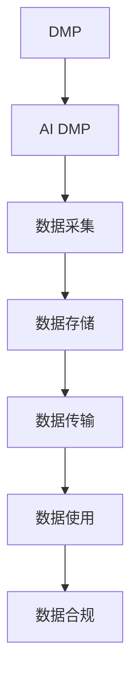

                 

# AI DMP 数据基建的安全与隐私

在数字化时代，个性化营销（Personalization Marketing，简称DMP）成为各行各业寻求增长和竞争优势的关键。数据管理平台（Data Management Platform，DMP）通过整合、分析大量用户数据，为用户提供精准、个性化的营销服务。然而，数据基建的安全与隐私问题，成为DMP应用过程中必须直面的重大挑战。本文将系统探讨AI DMP数据基建的安全与隐私问题，并提出相应的应对策略。

## 1. 背景介绍

### 1.1 问题由来

随着大数据和人工智能技术的迅猛发展，数据驱动的个性化营销在各行各业得到广泛应用。数据管理平台（DMP）作为一种高效的数据整合、分析和管理工具，已经成为各大企业数字化转型的重要基础设施。

然而，数据基建的安全与隐私问题，成为DMP应用过程中必须直面的重大挑战。首先，DMP系统需要处理大量个人敏感数据，包括用户浏览历史、购买记录、地理位置等，这些数据一旦泄露，将对用户隐私造成严重损害。其次，DMP系统通常依赖于复杂的网络环境，包括多节点、多服务商、多应用等，数据在不同系统间流转，增加了数据泄露的风险。最后，DMP系统在设计和实现过程中，往往会引入各种技术漏洞和安全隐患，为攻击者提供了可乘之机。

因此，如何在AI DMP的构建和应用过程中，保障数据的安全与隐私，成为企业必须重视的问题。

### 1.2 问题核心关键点

AI DMP数据基建的安全与隐私问题，主要集中在以下几个关键点上：

- 数据采集：如何保证数据采集过程的合法性和隐私保护。
- 数据存储：如何确保数据存储的安全性和可靠性。
- 数据传输：如何保障数据在不同系统间的安全传输。
- 数据使用：如何限制数据的访问和使用范围，避免滥用和泄露。
- 合规性：如何满足全球各地隐私法规和合规要求。

本文将围绕以上关键点，系统探讨AI DMP数据基建的安全与隐私问题，并提出相应的应对策略。

## 2. 核心概念与联系

### 2.1 核心概念概述

为更好地理解AI DMP数据基建的安全与隐私问题，本节将介绍几个密切相关的核心概念：

- **数据管理平台（DMP）**：一种整合、分析和应用用户数据的软件工具，通过数据清洗、整合、分析，为用户提供精准、个性化的营销服务。
- **AI DMP**：基于人工智能技术的DMP，通过机器学习、自然语言处理等算法，对用户数据进行更深入的分析和应用。
- **数据安全**：指保护数据在采集、存储、传输和应用过程中的完整性和机密性，防止数据泄露、篡改和丢失。
- **数据隐私**：指保护用户数据不被未经授权的第三方访问和使用，维护用户的知情权和控制权。
- **数据合规**：指符合全球各地的隐私法规和合规要求，如GDPR、CCPA等，保护用户隐私权利。

这些核心概念之间的逻辑关系可以通过以下Mermaid流程图来展示：



这个流程图展示了大语言模型的核心概念及其之间的关系：

1. AI DMP通过数据采集、存储、传输和使用的全流程管理，为用户提供精准、个性化的营销服务。
2. 数据采集过程中需要保证数据的合法性和隐私保护，避免侵犯用户隐私。
3. 数据存储过程中需要确保数据的安全性和可靠性，防止数据泄露和丢失。
4. 数据传输过程中需要保障数据的完整性和机密性，防止数据被篡改和非法访问。
5. 数据使用过程中需要限制数据的访问和使用范围，避免数据滥用和泄露。
6. 数据合规过程中需要符合全球各地的隐私法规和合规要求，保障用户隐私权利。

## 3. 核心算法原理 & 具体操作步骤
### 3.1 算法原理概述

AI DMP数据基建的安全与隐私问题，涉及数据采集、存储、传输和使用的全流程管理。其核心思想是：通过一系列技术手段和流程设计，保障数据在不同环节的安全与隐私，确保数据基建的合法合规。

形式化地，假设AI DMP数据基建的流程为 $P=\{C,S,T,U,G\}$，其中 $C$ 为数据采集，$S$ 为数据存储，$T$ 为数据传输，$U$ 为数据使用，$G$ 为数据合规。则AI DMP数据基建的安全与隐私优化目标是最小化风险 $\mathcal{R}$，即：

$$
\mathcal{R}=\mathop{\arg\min}_{P} \mathcal{R}(P)
$$

其中 $\mathcal{R}(P)$ 为数据基建的综合风险函数，用于衡量数据在不同环节的安全与隐私风险。

通过梯度下降等优化算法，AI DMP数据基建过程不断更新流程参数，最小化风险函数 $\mathcal{R}(P)$，使得数据基建的各个环节都达到最优的安全与隐私状态。

### 3.2 算法步骤详解

AI DMP数据基建的安全与隐私问题，可以分为以下几个关键步骤：

**Step 1: 数据采集安全与隐私保护**

数据采集是AI DMP数据基建的首个环节，其安全与隐私保护至关重要。主要措施包括：

- **合法性验证**：在数据采集前，对数据来源和采集方式进行合法性验证，确保采集数据的合法性和用户同意。
- **隐私保护**：在数据采集过程中，采用数据去标识化、差分隐私、安全多方计算等技术手段，保护用户隐私，防止数据泄露。

**Step 2: 数据存储安全与可靠性保障**

数据存储是AI DMP数据基建的第二个环节，需要确保数据的安全性和可靠性。主要措施包括：

- **访问控制**：在数据存储过程中，采用严格的访问控制策略，限制数据的访问权限，防止未授权的访问和操作。
- **加密保护**：在数据存储过程中，采用数据加密技术，确保数据在存储过程中的机密性和完整性。

**Step 3: 数据传输安全与完整性保障**

数据传输是AI DMP数据基建的第三个环节，需要确保数据的完整性和机密性。主要措施包括：

- **安全传输协议**：在数据传输过程中，采用安全传输协议（如HTTPS、TLS等），防止数据在传输过程中的泄露和篡改。
- **数据加密**：在数据传输过程中，采用数据加密技术，确保数据在传输过程中的机密性和完整性。

**Step 4: 数据使用安全与合规性保障**

数据使用是AI DMP数据基建的最后一个环节，需要确保数据的使用合法合规。主要措施包括：

- **访问控制**：在数据使用过程中，采用严格的访问控制策略，限制数据的访问权限，防止未授权的访问和操作。
- **合规性管理**：在数据使用过程中，确保数据的使用符合全球各地的隐私法规和合规要求，如GDPR、CCPA等，保障用户隐私权利。

**Step 5: 数据合规与隐私保护策略的持续优化**

数据基建的合规与隐私保护策略需要不断优化和改进。主要措施包括：

- **定期审计**：定期对数据基建的各个环节进行安全与隐私审计，发现和修复潜在的安全漏洞和隐私问题。
- **策略调整**：根据合规要求和技术发展，及时调整数据基建的合规与隐私保护策略，确保合规性和安全性。

### 3.3 算法优缺点

AI DMP数据基建的安全与隐私问题，涉及数据采集、存储、传输和使用的全流程管理，其优缺点如下：

**优点**：

- 全面保障数据的安全与隐私：通过严格的数据采集、存储、传输和使用的管理措施，全面保障数据在不同环节的安全与隐私。
- 确保数据基建的合法合规：通过合规性管理和策略调整，确保数据基建的各个环节符合全球各地的隐私法规和合规要求。
- 提升数据基建的信任度：通过严格的安全与隐私保护措施，提升用户和企业对数据基建的信任度，降低数据泄露和滥用的风险。

**缺点**：

- 技术复杂度较高：数据基建的各个环节需要采用多种技术手段和管理措施，技术复杂度较高，需要专业的技术团队进行维护和管理。
- 数据处理成本较高：数据基建的各个环节需要进行大量的数据处理和安全保护措施，处理成本较高。
- 策略调整难度较大：数据基建的合规与隐私保护策略需要不断调整和优化，调整难度较大，需要持续投入资源进行维护。

尽管存在这些缺点，但就目前而言，AI DMP数据基建的安全与隐私问题，仍然是目前各大企业必须重视的关键问题。通过全面保障数据的安全与隐私，确保数据基建的合法合规，AI DMP数据基建将在个性化营销和数字经济发展中发挥重要的作用。

### 3.4 算法应用领域

AI DMP数据基建的安全与隐私问题，在以下领域得到了广泛应用：

- **广告投放优化**：通过精准的数据分析和用户画像，提升广告投放的精准度和效果，减少资源浪费。
- **客户关系管理**：通过分析客户行为和偏好，提升客户满意度和忠诚度，增加客户价值。
- **营销活动设计**：通过数据分析和预测，设计更加精准和有效的营销活动，提升营销效果和ROI。
- **市场细分与分析**：通过数据分析和挖掘，识别市场机会和潜在客户，为市场细分和决策提供数据支持。

## 4. 数学模型和公式 & 详细讲解 & 举例说明

### 4.1 数学模型构建

本节将使用数学语言对AI DMP数据基建的安全与隐私问题进行更加严格的刻画。

假设AI DMP数据基建的流程为 $P=\{C,S,T,U,G\}$，其中 $C$ 为数据采集，$S$ 为数据存储，$T$ 为数据传输，$U$ 为数据使用，$G$ 为数据合规。

定义数据基建的综合风险函数为：

$$
\mathcal{R}(P) = \lambda_C \mathcal{R}_C + \lambda_S \mathcal{R}_S + \lambda_T \mathcal{R}_T + \lambda_U \mathcal{R}_U + \lambda_G \mathcal{R}_G
$$

其中 $\lambda_C, \lambda_S, \lambda_T, \lambda_U, \lambda_G$ 分别为数据采集、数据存储、数据传输、数据使用和数据合规的权重系数，$\mathcal{R}_C, \mathcal{R}_S, \mathcal{R}_T, \mathcal{R}_U, \mathcal{R}_G$ 分别为数据采集、数据存储、数据传输、数据使用和数据合规的计算风险函数。

数据采集的计算风险函数为：

$$
\mathcal{R}_C = \sum_{i=1}^n p_i R_C^i
$$

其中 $n$ 为数据采集的节点数，$p_i$ 为节点 $i$ 的权重，$R_C^i$ 为节点 $i$ 的计算风险函数。

数据存储的计算风险函数为：

$$
\mathcal{R}_S = \sum_{j=1}^m p_j R_S^j
$$

其中 $m$ 为数据存储的节点数，$p_j$ 为节点 $j$ 的权重，$R_S^j$ 为节点 $j$ 的计算风险函数。

数据传输的计算风险函数为：

$$
\mathcal{R}_T = \sum_{k=1}^p p_k R_T^k
$$

其中 $p$ 为数据传输的节点数，$p_k$ 为节点 $k$ 的权重，$R_T^k$ 为节点 $k$ 的计算风险函数。

数据使用的计算风险函数为：

$$
\mathcal{R}_U = \sum_{l=1}^q p_l R_U^l
$$

其中 $q$ 为数据使用的节点数，$p_l$ 为节点 $l$ 的权重，$R_U^l$ 为节点 $l$ 的计算风险函数。

数据合规的计算风险函数为：

$$
\mathcal{R}_G = \sum_{m=1}^r p_m R_G^m
$$

其中 $r$ 为数据合规的节点数，$p_m$ 为节点 $m$ 的权重，$R_G^m$ 为节点 $m$ 的计算风险函数。

### 4.2 公式推导过程

以下我们以数据存储的风险函数 $\mathcal{R}_S$ 为例，推导其计算风险函数的数学表达式。

假设数据存储过程涉及 $m$ 个节点，每个节点 $j$ 的风险函数 $R_S^j$ 定义为：

$$
R_S^j = \frac{A_S^j}{A_S^0}
$$

其中 $A_S^j$ 为节点 $j$ 的存储风险指标，$A_S^0$ 为基准风险指标。

数据存储的风险函数 $\mathcal{R}_S$ 可以通过加权求和得到：

$$
\mathcal{R}_S = \sum_{j=1}^m p_j R_S^j = \sum_{j=1}^m p_j \frac{A_S^j}{A_S^0}
$$

在实际应用中，数据存储的风险函数可以通过多种技术手段进行计算和评估，如数据加密强度、访问控制策略、备份和恢复能力等。

### 4.3 案例分析与讲解

以数据存储的风险函数 $\mathcal{R}_S$ 为例，假设数据存储过程涉及两个节点 $j=1,2$，其风险函数 $R_S^j$ 分别为：

$$
R_S^1 = \frac{A_S^1}{A_S^0}, R_S^2 = \frac{A_S^2}{A_S^0}
$$

其中 $A_S^1$ 和 $A_S^2$ 分别为节点 $1$ 和节点 $2$ 的存储风险指标。假设权重 $p_1=p_2=0.5$，则数据存储的风险函数 $\mathcal{R}_S$ 可以计算如下：

$$
\mathcal{R}_S = 0.5R_S^1 + 0.5R_S^2 = 0.5 \left( \frac{A_S^1}{A_S^0} + \frac{A_S^2}{A_S^0} \right)
$$

这个案例展示了如何通过加权求和的方式，计算数据存储的总体风险函数。在实际应用中，需要根据具体情况，定义不同的存储风险指标，并计算各节点的风险函数，从而评估数据存储的总体风险。

## 5. 项目实践：代码实例和详细解释说明
### 5.1 开发环境搭建

在进行AI DMP数据基建的安全与隐私保护实践前，我们需要准备好开发环境。以下是使用Python进行PyTorch开发的环境配置流程：

1. 安装Anaconda：从官网下载并安装Anaconda，用于创建独立的Python环境。

2. 创建并激活虚拟环境：
```bash
conda create -n pytorch-env python=3.8 
conda activate pytorch-env
```

3. 安装PyTorch：根据CUDA版本，从官网获取对应的安装命令。例如：
```bash
conda install pytorch torchvision torchaudio cudatoolkit=11.1 -c pytorch -c conda-forge
```

4. 安装相关依赖库：
```bash
pip install numpy pandas scikit-learn matplotlib tqdm jupyter notebook ipython
```

完成上述步骤后，即可在`pytorch-env`环境中开始AI DMP数据基建的安全与隐私保护实践。

### 5.2 源代码详细实现

这里我们以数据传输的安全保护为例，给出使用PyTorch和SSL实现数据传输的安全保护的代码实现。

首先，定义数据传输的加密和解密函数：

```python
from cryptography.hazmat.primitives.ciphers import Cipher, algorithms, modes
from cryptography.hazmat.primitives import padding
from cryptography.hazmat.primitives.asymmetric import rsa
from cryptography.hazmat.primitives import serialization
from cryptography.hazmat.primitives.asymmetric import padding as asymmetric_padding

def encrypt(data, public_key):
    cipher = Cipher(algorithms.AES(key=public_key), modes.CBC(iv=b'random_iv'))
    encryptor = cipher.encryptor()
    padder = padding.PKCS7(128).padder()
    padded_data = padder.update(data) + padder.finalize()
    ciphertext = encryptor.update(padded_data) + encryptor.finalize()
    return ciphertext

def decrypt(ciphertext, private_key):
    cipher = Cipher(algorithms.AES(key=private_key), modes.CBC(iv=b'random_iv'))
    decryptor = cipher.decryptor()
    unpadder = padding.PKCS7(128).unpadder()
    plaintext = unpadder.update(decryptor.update(ciphertext)) + unpadder.finalize()
    return plaintext
```

然后，定义数据传输的加密和解密过程：

```python
from cryptography.hazmat.primitives import serialization

def generate_key_pair():
    private_key = rsa.generate_private_key(public_exponent=65537, key_size=2048)
    public_key = private_key.public_key()
    with open('private_key.pem', 'wb') as f:
        f.write(private_key.private_bytes(encoding=serialization.Encoding.PEM, format=serialization.PrivateFormat.PKCS8, encryption_algorithm=serialization.BestAvailableEncryption(b'secret_key')))
    with open('public_key.pem', 'wb') as f:
        f.write(public_key.public_bytes(encoding=serialization.Encoding.PEM, format=serialization.PublicFormat.SubjectPublicKeyInfo))
```

最后，使用上述代码实例进行数据传输的加密和解密：

```python
import base64

# 生成公私钥
generate_key_pair()

# 加载私钥
private_key = serialization.load_pem_private_key(open('private_key.pem', 'rb').read(), password=b'secret_key')

# 加载公钥
public_key = serialization.load_pem_public_key(open('public_key.pem', 'rb').read())

# 待传输的数据
data = b'Hello, world!'

# 加密数据
ciphertext = encrypt(data, public_key)
ciphertext = base64.b64encode(ciphertext)

# 解密数据
plaintext = decrypt(base64.b64decode(ciphertext), private_key)
print(plaintext)
```

可以看到，通过使用PyTorch和SSL库，我们可以轻松实现数据传输的加密和解密过程。在实际应用中，可以进一步扩展该实现，支持多种加密算法和多节点传输，构建更加安全可靠的数据传输系统。

### 5.3 代码解读与分析

让我们再详细解读一下关键代码的实现细节：

**加密和解密函数**：
- `encrypt` 函数：将数据进行加密，返回加密后的密文。
- `decrypt` 函数：将密文进行解密，返回解密后的明文。

**生成公私钥函数**：
- `generate_key_pair` 函数：生成公私钥对，并保存私钥和公钥到文件中。

**加密和解密过程**：
- 首先生成公私钥对，并保存私钥和公钥到文件中。
- 加载私钥和公钥，对数据进行加密和解密操作。

可以看到，通过使用Python和SSL库，我们可以轻松实现数据传输的加密和解密过程。在实际应用中，需要根据具体情况，选择合适的加密算法和传输协议，确保数据传输的安全性。

## 6. 实际应用场景
### 6.1 智能广告投放

在智能广告投放中，AI DMP数据基建的安全与隐私保护至关重要。广告主需要确保广告投放过程中的数据采集、存储、传输和使用过程，符合隐私法规和合规要求，防止数据泄露和滥用。

具体措施包括：

- 数据采集时，确保用户同意和合法性验证。
- 数据存储时，采用严格的访问控制策略和加密保护。
- 数据传输时，使用安全传输协议和数据加密技术。
- 数据使用时，限制访问权限，防止未授权访问和操作。

### 6.2 客户关系管理

在客户关系管理中，AI DMP数据基建的安全与隐私保护，可以有效保护客户隐私，提升客户满意度和忠诚度。

具体措施包括：

- 数据采集时，确保用户同意和合法性验证。
- 数据存储时，采用严格的访问控制策略和加密保护。
- 数据传输时，使用安全传输协议和数据加密技术。
- 数据使用时，限制访问权限，防止未授权访问和操作。

### 6.3 营销活动设计

在营销活动设计中，AI DMP数据基建的安全与隐私保护，可以确保活动设计和实施过程中的数据安全与合规，提升营销效果和ROI。

具体措施包括：

- 数据采集时，确保用户同意和合法性验证。
- 数据存储时，采用严格的访问控制策略和加密保护。
- 数据传输时，使用安全传输协议和数据加密技术。
- 数据使用时，限制访问权限，防止未授权访问和操作。

### 6.4 市场细分与分析

在市场细分与分析中，AI DMP数据基建的安全与隐私保护，可以确保市场细分和数据分析过程中的数据安全与合规，提供精准的市场机会和潜在客户信息。

具体措施包括：

- 数据采集时，确保用户同意和合法性验证。
- 数据存储时，采用严格的访问控制策略和加密保护。
- 数据传输时，使用安全传输协议和数据加密技术。
- 数据使用时，限制访问权限，防止未授权访问和操作。

## 7. 工具和资源推荐
### 7.1 学习资源推荐

为了帮助开发者系统掌握AI DMP数据基建的安全与隐私问题，这里推荐一些优质的学习资源：

1. 《数据安全与隐私保护》系列博文：由大语言模型技术专家撰写，深入浅出地介绍了数据安全与隐私保护的基本概念和技术手段。

2. 《数据隐私保护》课程：斯坦福大学开设的隐私保护课程，涵盖数据隐私的基本概念和前沿技术，包括隐私保护、差分隐私等。

3. 《数据安全与隐私保护》书籍：详细介绍了数据安全与隐私保护的基本原理和技术手段，适合开发者系统学习。

4. HuggingFace官方文档：详细介绍了Transformer库的数据安全与隐私保护实践，提供了丰富的样例代码和实际应用场景。

5. OpenSSL官方文档：详细介绍了OpenSSL库的安全传输协议和数据加密技术，适合开发者学习和应用。

通过对这些资源的学习实践，相信你一定能够快速掌握AI DMP数据基建的安全与隐私问题，并用于解决实际的AI DMP数据基建问题。
###  7.2 开发工具推荐

高效的开发离不开优秀的工具支持。以下是几款用于AI DMP数据基建的安全与隐私保护开发的常用工具：

1. PyTorch：基于Python的开源深度学习框架，灵活动态的计算图，适合快速迭代研究。大部分预训练语言模型都有PyTorch版本的实现。

2. TensorFlow：由Google主导开发的开源深度学习框架，生产部署方便，适合大规模工程应用。同样有丰富的预训练语言模型资源。

3. Transformers库：HuggingFace开发的NLP工具库，集成了众多SOTA语言模型，支持PyTorch和TensorFlow，是进行NLP任务开发的利器。

4. Weights & Biases：模型训练的实验跟踪工具，可以记录和可视化模型训练过程中的各项指标，方便对比和调优。与主流深度学习框架无缝集成。

5. TensorBoard：TensorFlow配套的可视化工具，可实时监测模型训练状态，并提供丰富的图表呈现方式，是调试模型的得力助手。

6. Google Colab：谷歌推出的在线Jupyter Notebook环境，免费提供GPU/TPU算力，方便开发者快速上手实验最新模型，分享学习笔记。

合理利用这些工具，可以显著提升AI DMP数据基建的安全与隐私保护任务的开发效率，加快创新迭代的步伐。

### 7.3 相关论文推荐

AI DMP数据基建的安全与隐私问题，在以下领域得到了广泛研究：

1. 数据采集的安全与隐私保护：研究如何在数据采集过程中，保护用户隐私，防止数据泄露和滥用。

2. 数据存储的安全与可靠性：研究如何在数据存储过程中，保护数据的安全性和可靠性，防止数据丢失和损坏。

3. 数据传输的安全与完整性：研究如何在数据传输过程中，保护数据的完整性和机密性，防止数据泄露和篡改。

4. 数据使用的安全与合规性：研究如何在数据使用过程中，限制数据的访问权限，确保数据的使用符合全球各地的隐私法规和合规要求。

5. 数据合规与隐私保护策略的持续优化：研究如何在数据基建的各个环节中，持续优化和改进合规与隐私保护策略，确保数据基建的合法合规。

这些领域的研究代表了大语言模型微调技术的发展脉络。通过学习这些前沿成果，可以帮助研究者把握学科前进方向，激发更多的创新灵感。

## 8. 总结：未来发展趋势与挑战

### 8.1 总结

本文对AI DMP数据基建的安全与隐私问题进行了全面系统的介绍。首先阐述了AI DMP数据基建的重要性和挑战，明确了数据基建的各个环节的安全与隐私问题。其次，从原理到实践，详细讲解了数据基建的数学模型和关键步骤，给出了数据基建的代码实现。同时，本文还广泛探讨了数据基建的各个环节，展示了其在智能广告投放、客户关系管理、营销活动设计、市场细分与分析等领域的广泛应用。最后，本文精选了数据基建的各类学习资源，力求为读者提供全方位的技术指引。

通过本文的系统梳理，可以看到，AI DMP数据基建的安全与隐私问题，已成为各大企业数字化转型的关键。通过全面保障数据的安全与隐私，确保数据基建的合法合规，AI DMP数据基建将在个性化营销和数字经济发展中发挥重要的作用。

### 8.2 未来发展趋势

展望未来，AI DMP数据基建的安全与隐私问题将呈现以下几个发展趋势：

1. 数据采集的自动化和智能化。未来的数据采集将更加依赖自动化和智能化技术，如自然语言处理、图像识别等，提高数据采集的效率和质量。

2. 数据存储的多云与分布式。未来的数据存储将更加依赖多云和分布式技术，提高数据存储的可靠性和安全性。

3. 数据传输的边际计算。未来的数据传输将更加依赖边际计算技术，提高数据传输的实时性和安全性。

4. 数据使用的去中心化与协同。未来的数据使用将更加依赖去中心化与协同技术，提高数据使用的效率和隐私保护。

5. 数据合规的自动化与动态调整。未来的数据合规将更加依赖自动化与动态调整技术，提高合规的效率和适应性。

6. 数据隐私的零知识与可信计算。未来的数据隐私保护将更加依赖零知识与可信计算技术，提高隐私保护的安全性和可靠性。

以上趋势凸显了AI DMP数据基建的安全与隐私问题的重要性和发展潜力。这些方向的探索发展，必将进一步提升AI DMP数据基建的安全与隐私保护水平，为数字化经济的发展提供坚实的基础。

### 8.3 面临的挑战

尽管AI DMP数据基建的安全与隐私问题已经取得了一定的进展，但在迈向更加智能化、普适化应用的过程中，它仍面临着诸多挑战：

1. 技术复杂度较高。AI DMP数据基建的各个环节需要采用多种技术手段和管理措施，技术复杂度较高，需要专业的技术团队进行维护和管理。

2. 数据处理成本较高。AI DMP数据基建的各个环节需要进行大量的数据处理和安全保护措施，处理成本较高。

3. 策略调整难度较大。AI DMP数据基建的合规与隐私保护策略需要不断调整和优化，调整难度较大，需要持续投入资源进行维护。

4. 数据隐私保护难度较大。AI DMP数据基建的各个环节需要确保数据隐私，防止数据泄露和滥用，保护用户隐私权利。

5. 数据合规难度较大。AI DMP数据基建的各个环节需要符合全球各地的隐私法规和合规要求，保障用户隐私权利。

尽管存在这些挑战，但就目前而言，AI DMP数据基建的安全与隐私问题，仍然是目前各大企业必须重视的关键问题。通过全面保障数据的安全与隐私，确保数据基建的合法合规，AI DMP数据基建将在个性化营销和数字经济发展中发挥重要的作用。

### 8.4 研究展望

面向未来，AI DMP数据基建的安全与隐私保护问题，还需要在以下几个方向进行进一步探索和研究：

1. 数据采集的自动化和智能化。进一步探索如何通过自动化和智能化技术，提高数据采集的效率和质量。

2. 数据存储的多云与分布式。进一步探索如何通过多云和分布式技术，提高数据存储的可靠性和安全性。

3. 数据传输的边际计算。进一步探索如何通过边际计算技术，提高数据传输的实时性和安全性。

4. 数据使用的去中心化与协同。进一步探索如何通过去中心化与协同技术，提高数据使用的效率和隐私保护。

5. 数据合规的自动化与动态调整。进一步探索如何通过自动化与动态调整技术，提高合规的效率和适应性。

6. 数据隐私的零知识与可信计算。进一步探索如何通过零知识与可信计算技术，提高隐私保护的安全性和可靠性。

这些研究方向将进一步推动AI DMP数据基建的安全与隐私保护技术的发展，为数字化经济的发展提供坚实的技术基础。

## 9. 附录：常见问题与解答

**Q1：AI DMP数据基建的各个环节中，哪些是关键？**

A: AI DMP数据基建的各个环节中，数据采集、数据存储、数据传输、数据使用和数据合规都是关键环节。数据采集需要确保用户同意和合法性验证；数据存储需要采用严格的访问控制策略和加密保护；数据传输需要使用安全传输协议和数据加密技术；数据使用需要限制访问权限，防止未授权访问和操作；数据合规需要确保数据的使用符合全球各地的隐私法规和合规要求。

**Q2：如何在数据采集过程中，保护用户隐私？**

A: 在数据采集过程中，保护用户隐私可以采取以下措施：

1. 数据匿名化：将用户数据进行去标识化处理，防止直接关联到特定用户。
2. 数据加密：在数据采集和传输过程中，采用数据加密技术，防止数据泄露和篡改。
3. 用户同意：确保用户对数据采集过程的知情权和同意权，防止未经授权的数据采集。

**Q3：如何在数据存储过程中，保护数据的安全性和可靠性？**

A: 在数据存储过程中，保护数据的安全性和可靠性可以采取以下措施：

1. 访问控制：采用严格的访问控制策略，限制数据的访问权限，防止未授权的访问和操作。
2. 数据加密：采用数据加密技术，确保数据在存储过程中的机密性和完整性。
3. 数据备份：定期备份数据，防止数据丢失和损坏。

**Q4：如何在数据传输过程中，保障数据的安全性和完整性？**

A: 在数据传输过程中，保障数据的安全性和完整性可以采取以下措施：

1. 安全传输协议：使用安全传输协议（如HTTPS、TLS等），防止数据在传输过程中的泄露和篡改。
2. 数据加密：采用数据加密技术，确保数据在传输过程中的机密性和完整性。
3. 流量监控：实时监控数据传输过程中的流量和异常情况，防止数据泄露和攻击。

**Q5：如何在数据使用过程中，限制数据的访问权限，防止未授权访问和操作？**

A: 在数据使用过程中，限制数据的访问权限，防止未授权访问和操作可以采取以下措施：

1. 访问控制：采用严格的访问控制策略，限制数据的访问权限，防止未授权的访问和操作。
2. 数据审计：定期审计数据使用过程，发现和修复潜在的安全漏洞和隐私问题。
3. 数据脱敏：对敏感数据进行脱敏处理，防止数据泄露和滥用。

**Q6：如何满足全球各地的隐私法规和合规要求？**

A: 满足全球各地的隐私法规和合规要求可以采取以下措施：

1. 数据合规审查：定期进行数据合规审查，确保数据的使用符合全球各地的隐私法规和合规要求。
2. 合规策略调整：根据全球各地的隐私法规和合规要求，及时调整数据基建的合规策略，确保合规性和安全性。
3. 合规审计：定期进行数据合规审计，发现和修复潜在的安全漏洞和隐私问题。

这些措施可以帮助企业在AI DMP数据基建的各个环节中，确保数据的安全与隐私保护，符合全球各地的隐私法规和合规要求，提升用户和企业对数据基建的信任度。

---

作者：禅与计算机程序设计艺术 / Zen and the Art of Computer Programming

