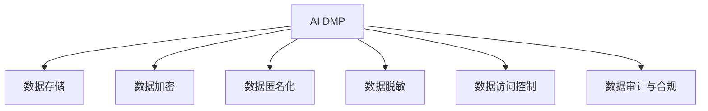

                 

# AI DMP 数据基建：数据安全与隐私保护

> 关键词：AI DMP, 数据安全, 隐私保护, 数据治理, 数据匿名化, 数据加密, 数据脱敏

## 1. 背景介绍

### 1.1 问题由来
随着数字经济时代的到来，数据驱动的决策成为企业创新的重要动力。AI Data Management Platform（AI DMP）作为数据资产管理的关键工具，通过整合多源异构数据，帮助企业从数据中挖掘价值，优化业务决策。然而，数据的大规模集中存储和使用，也带来了数据安全与隐私保护的严峻挑战。如何在保障数据高效利用的同时，确保数据的安全与隐私，成为AI DMP建设过程中必须面对的问题。

### 1.2 问题核心关键点
AI DMP的建设过程中，数据安全与隐私保护主要涉及以下几个关键点：
- 数据存储与传输安全：确保数据在存储和传输过程中不被非法访问和篡改。
- 数据匿名化与脱敏：通过对数据进行匿名化处理，降低数据泄露的风险。
- 数据加密与解密：对敏感数据进行加密，即使数据被截获，也无法直接解读。
- 数据访问控制：限制数据访问权限，确保只有授权人员可以访问特定数据。
- 数据审计与合规：记录数据使用情况，确保符合数据保护法规和标准。

这些问题如果处理不当，不仅会导致数据泄露和滥用，还会引发法律风险和信任危机，严重威胁企业的商业安全。因此，加强AI DMP的数据安全与隐私保护，是确保企业数据资产价值的关键。

### 1.3 问题研究意义
数据安全与隐私保护是AI DMP建设的基础保障。通过系统的安全与隐私保护措施，可以：
- 保障数据完整性和机密性，避免数据泄露和篡改。
- 降低数据滥用风险，保护用户隐私权益，增强用户信任。
- 确保数据使用合规，避免法律风险和商业损失。
- 提升AI DMP的安全性和可靠性，增强其市场竞争力。
- 支撑企业数字化转型，促进业务创新和智能化发展。

## 2. 核心概念与联系

### 2.1 核心概念概述

为更好地理解AI DMP的数据安全与隐私保护措施，本节将介绍几个密切相关的核心概念：

- AI Data Management Platform（AI DMP）：通过整合多源异构数据，提供一致的数据访问和治理能力，帮助企业从数据中挖掘价值。
- 数据匿名化（Data Anonymization）：通过特定算法处理数据，使得原始数据无法与特定个体关联，降低隐私泄露风险。
- 数据加密（Data Encryption）：通过加密算法对数据进行编码，使其在传输和存储过程中不可读，防止数据被非法访问。
- 数据脱敏（Data Masking）：对数据的关键部分进行替换或截断，使得数据无法直接解读，保护敏感信息。
- 数据访问控制（Data Access Control）：通过权限管理机制，限制数据访问权限，确保数据安全。
- 数据审计与合规（Data Auditing & Compliance）：记录数据使用情况，确保符合法律法规和数据保护标准。

这些核心概念之间的逻辑关系可以通过以下Mermaid流程图来展示：



这个流程图展示了大数据安全与隐私保护的核心概念及其之间的关系：

1. AI DMP通过数据存储、加密、匿名化、脱敏等技术手段，保障数据在各个环节的安全。
2. 数据访问控制限制了数据访问权限，确保只有授权人员可以访问数据。
3. 数据审计与合规记录数据使用情况，确保符合法规要求。

这些概念共同构成了AI DMP数据安全与隐私保护的基础框架，确保数据在各个环节得到有效管理。通过理解这些核心概念，我们可以更好地把握AI DMP的数据安全与隐私保护策略。

## 3. 核心算法原理 & 具体操作步骤
### 3.1 算法原理概述

AI DMP的数据安全与隐私保护措施，主要包括数据存储安全、数据传输安全、数据匿名化、数据加密、数据脱敏、数据访问控制和数据审计与合规等多个方面。以下将对其中几个关键算法进行详细介绍。

### 3.2 算法步骤详解

#### 3.2.1 数据存储安全

数据存储安全是数据安全的第一道防线。为了确保数据在存储过程中不被非法访问和篡改，可以采取以下措施：

1. **访问控制**：使用身份验证和授权机制，限制对数据存储的访问权限。
2. **加密存储**：对存储在数据库中的数据进行加密处理，即使数据被非法访问，也无法直接解读。
3. **数据备份与恢复**：定期备份数据，确保在数据丢失或损坏时能够快速恢复。

#### 3.2.2 数据传输安全

数据传输安全是数据安全的关键环节。为了确保数据在传输过程中不被非法截获和篡改，可以采取以下措施：

1. **传输加密**：使用TLS/SSL等加密协议，对数据传输进行加密处理。
2. **安全传输协议**：使用HTTPS、SFTP等安全传输协议，确保数据传输过程中的安全。
3. **网络隔离**：通过防火墙、入侵检测等技术手段，防止非法访问和攻击。

#### 3.2.3 数据匿名化

数据匿名化是通过特定算法处理数据，使得原始数据无法与特定个体关联，降低隐私泄露风险。常见的数据匿名化方法包括：

1. **数据混淆**：通过替换、截断等方式，使数据无法直接解读。例如，将真实姓名替换为假名，对身份证号码进行截断等。
2. **数据扰动**：通过添加噪声、扰动数据等方式，使得数据无法与特定个体关联。例如，对数值数据添加随机噪声。
3. **假名化**：使用假名替代真实姓名，使其无法与特定个体关联。例如，使用K-anonymity、L-diversity等算法进行假名化处理。

#### 3.2.4 数据加密

数据加密是确保数据机密性的重要手段。常见的数据加密方法包括：

1. **对称加密**：使用相同的密钥进行加密和解密，加密速度快，但密钥管理复杂。例如，AES、DES等算法。
2. **非对称加密**：使用公钥加密数据，私钥解密数据，密钥管理相对简单，但加密速度较慢。例如，RSA、ECC等算法。
3. **哈希加密**：对数据进行单向散列，确保数据唯一性，但无法解密。例如，MD5、SHA等算法。

#### 3.2.5 数据脱敏

数据脱敏是保护敏感信息的重要手段。常见的数据脱敏方法包括：

1. **字符替换**：将敏感信息替换为假字符，使其无法直接解读。例如，将电话号码、身份证号码等敏感信息替换为星号。
2. **数据掩码**：对敏感信息进行部分掩码处理，使得数据无法直接解读。例如，对银行卡号、身份证号等进行部分掩码处理。
3. **数据泛化**：将敏感信息泛化为更通用的信息，使得数据无法直接解读。例如，将精确地址信息泛化为区域信息。

#### 3.2.6 数据访问控制

数据访问控制是通过权限管理机制，限制数据访问权限，确保数据安全。常见的数据访问控制方法包括：

1. **角色基访问控制**：根据用户的角色分配访问权限，确保只有授权用户可以访问数据。
2. **基于属性的访问控制**：根据用户属性（如部门、职位等）分配访问权限，确保数据访问的细粒度控制。
3. **基于策略的访问控制**：根据具体使用场景和策略分配访问权限，确保数据访问的灵活性和安全性。

#### 3.2.7 数据审计与合规

数据审计与合规是通过记录数据使用情况，确保符合法律法规和数据保护标准。常见的数据审计与合规方法包括：

1. **日志记录**：记录数据的访问、修改、删除等操作日志，确保数据使用的可追溯性。
2. **合规检查**：定期进行合规检查，确保数据使用符合法律法规和数据保护标准。
3. **数据保护影响评估**：进行数据保护影响评估，识别数据使用中的风险和问题，采取相应措施进行改进。

### 3.3 算法优缺点

#### 3.3.1 数据存储安全

**优点**：
1. 访问控制和加密存储可以有效防止数据被非法访问和篡改。
2. 数据备份与恢复可以保障数据在丢失或损坏时的快速恢复。

**缺点**：
1. 数据加密和备份需要消耗大量计算资源，增加系统复杂度。
2. 访问控制需要精细化管理，维护成本较高。

#### 3.3.2 数据传输安全

**优点**：
1. 传输加密和安全传输协议可以防止数据在传输过程中被截获和篡改。
2. 网络隔离可以防止非法访问和攻击，保障数据传输安全。

**缺点**：
1. 加密和传输协议需要增加系统复杂度，增加网络延迟。
2. 网络隔离需要定期更新和维护，维护成本较高。

#### 3.3.3 数据匿名化

**优点**：
1. 数据混淆和扰动可以有效防止数据与特定个体关联，降低隐私泄露风险。
2. 假名化可以将数据泛化为更通用的信息，减少敏感信息暴露的风险。

**缺点**：
1. 数据混淆和扰动可能导致数据失真，影响数据质量。
2. 假名化可能无法完全消除隐私泄露风险，仍有被还原的风险。

#### 3.3.4 数据加密

**优点**：
1. 对称加密和非对称加密可以确保数据在存储和传输过程中的机密性。
2. 哈希加密可以确保数据唯一性，防止数据篡改。

**缺点**：
1. 加密和解密需要消耗大量计算资源，增加系统复杂度。
2. 密钥管理复杂，易受到密钥泄露攻击。

#### 3.3.5 数据脱敏

**优点**：
1. 字符替换和数据掩码可以有效防止敏感信息被直接解读。
2. 数据泛化可以将数据泛化为更通用的信息，减少敏感信息暴露的风险。

**缺点**：
1. 数据混淆可能导致数据失真，影响数据质量。
2. 数据泛化可能无法完全消除隐私泄露风险，仍有被还原的风险。

#### 3.3.6 数据访问控制

**优点**：
1. 角色基访问控制、属性基访问控制和策略基访问控制可以有效防止非法访问和数据泄露。
2. 细粒度控制和灵活管理可以保障数据访问的安全性和灵活性。

**缺点**：
1. 权限管理复杂，维护成本较高。
2. 权限管理不当可能导致权限滥用，增加数据泄露风险。

#### 3.3.7 数据审计与合规

**优点**：
1. 日志记录和合规检查可以确保数据使用符合法律法规和数据保护标准。
2. 数据保护影响评估可以识别数据使用中的风险和问题，采取相应措施进行改进。

**缺点**：
1. 日志记录和合规检查需要消耗大量计算资源，增加系统复杂度。
2. 数据保护影响评估需要定期进行，维护成本较高。

### 3.4 算法应用领域

AI DMP的数据安全与隐私保护措施广泛应用于金融、医疗、电商、政府等行业领域，确保数据在各个环节的安全与合规。

- **金融行业**：通过数据加密和访问控制，保护客户金融数据，防止数据泄露和滥用。
- **医疗行业**：通过数据匿名化和脱敏，保护患者隐私，防止数据泄露和滥用。
- **电商行业**：通过访问控制和日志记录，确保数据使用的合规性和安全性。
- **政府行业**：通过数据审计与合规，确保数据使用的合法性和安全性，防止数据滥用。

这些应用领域的数据安全与隐私保护措施，为AI DMP在实际应用中提供了重要的保障。

## 4. 数学模型和公式 & 详细讲解 & 举例说明

### 4.1 数学模型构建

数据安全与隐私保护涉及多个数学模型和算法，以下对其中几个关键模型进行详细介绍。

#### 4.1.1 数据混淆算法

数据混淆算法通过替换或截断敏感信息，使得原始数据无法与特定个体关联。其中，K-anonymity算法是常用的数据混淆算法，其基本思路是将数据集中的个体进行泛化，使得每个个体至少与其他k-1个个体相同，从而防止数据泄露。K-anonymity算法的数学模型如下：

$$
\text{K-Anonymity}=\{\text{Data Set D} \mid \text{For every attribute value combination } v \in R, |U_v| \geq \text{K}\}
$$

其中，Data Set D为数据集，R为属性集合，U_v为属性值集合，K为泛化水平。

#### 4.1.2 数据扰动算法

数据扰动算法通过添加噪声或扰动数据，使得数据无法直接解读。其中，L-diversity算法是常用的数据扰动算法，其基本思路是对数据集中的个体进行扰动，使得每个属性值组合至少出现L次，从而防止数据泄露。L-diversity算法的数学模型如下：

$$
\text{L-Diversity}=\{\text{Data Set D} \mid \text{For every attribute value combination } v \in R, |U_v| \geq \text{L}\}
$$

其中，Data Set D为数据集，R为属性集合，U_v为属性值集合，L为数据多样性。

#### 4.1.3 数据加密算法

数据加密算法通过加密算法对数据进行编码，使其在传输和存储过程中不可读。其中，AES算法是常用的对称加密算法，其基本思路是对数据进行分组，使用相同的密钥进行加密和解密。AES算法的数学模型如下：

$$
\text{AES Encryption}=\{\text{Key } K, \text{ Plaintext } P \mid \text{Ciphertext } C=\text{ Enc}_K(P)\}
$$

其中，Key K为密钥，Plaintext P为明文，Ciphertext C为密文，Enc_K为加密函数。

#### 4.1.4 数据脱敏算法

数据脱敏算法通过替换或截断敏感信息，使得数据无法直接解读。其中，字符替换算法是常用的数据脱敏算法，其基本思路是对敏感信息进行替换，使其无法直接解读。字符替换算法的数学模型如下：

$$
\text{Character Replacement}=\{\text{Sensitive Data } S \mid \text{Replaced Data } R=\text{ Replace }(S)\}
$$

其中，Sensitive Data S为敏感数据，Replaced Data R为替换后的数据，Replace为替换函数。

### 4.2 公式推导过程

#### 4.2.1 数据混淆算法

K-anonymity算法的具体实现步骤如下：
1. 对数据集中的每个个体进行泛化，使得每个个体至少与其他k-1个个体相同。
2. 对泛化后的数据进行重新分组，确保每个组中的个体数至少为k。

以一个简单的数据集为例，原始数据集D={A,B,C,D,E,F,G,H}，其中A、B、C、D、E、F、G、H分别为不同的个体，每个个体对应的属性值组合为{Age,Gender,Location}。

K-anonymity算法的具体实现过程如下：

1. 对数据集中的每个个体进行泛化，使得每个个体至少与其他k-1个个体相同。例如，将年龄泛化为10-20岁，性别泛化为男或女，位置泛化为城市或乡村。

2. 对泛化后的数据进行重新分组，确保每个组中的个体数至少为k。例如，将所有10-20岁的男性和城市个体归为一组，所有10-20岁的女性和城市个体归为一组，依此类推。

经过K-anonymity算法处理后，原始数据集变为：

D'={Group1, Group2, Group3, Group4}，其中Group1={10-20岁男性城市}，Group2={10-20岁女性城市}，Group3={10-20岁男性乡村}，Group4={10-20岁女性乡村}。

通过K-anonymity算法处理后，原始数据集中的个体无法直接关联到特定的个体，从而有效保护了数据隐私。

#### 4.2.2 数据扰动算法

L-diversity算法的具体实现步骤如下：
1. 对数据集中的每个个体进行扰动，使得每个属性值组合至少出现L次。
2. 对扰动后的数据进行重新分组，确保每个组中的个体数至少为L。

以一个简单的数据集为例，原始数据集D={A,B,C,D,E,F,G,H}，其中A、B、C、D、E、F、G、H分别为不同的个体，每个个体对应的属性值组合为{Age,Gender,Location}。

L-diversity算法的具体实现过程如下：

1. 对数据集中的每个个体进行扰动，使得每个属性值组合至少出现L次。例如，将年龄随机更改为±1岁，性别随机更改为男或女，位置随机更改为城市或乡村。

2. 对扰动后的数据进行重新分组，确保每个组中的个体数至少为L。例如，将所有年龄、性别、位置相同的个体归为一组，确保每个组中的个体数至少为L。

经过L-diversity算法处理后，原始数据集变为：

D'={Group1, Group2, Group3, Group4}，其中Group1={A, B, C}，Group2={D, E, F}，Group3={G, H}，Group4={A, D}。

通过L-diversity算法处理后，原始数据集中的个体无法直接关联到特定的个体，从而有效保护了数据隐私。

#### 4.2.3 数据加密算法

AES算法的具体实现步骤如下：
1. 对数据进行分组，每个分组的大小为blocksize。
2. 对每个分组进行加密，使用相同的密钥进行加密和解密。
3. 将加密后的结果进行拼接，形成最终的密文。

以一个简单的数据集为例，原始数据集D={A,B,C,D,E,F,G,H}，其中A、B、C、D、E、F、G、H分别为不同的个体，每个个体对应的属性值组合为{Age,Gender,Location}。

AES算法的具体实现过程如下：

1. 对数据进行分组，每个分组的大小为blocksize。例如，将每个属性值组合进行分组，每个分组的大小为16字节。

2. 对每个分组进行加密，使用相同的密钥进行加密和解密。例如，使用AES算法对每个分组进行加密，使用相同的密钥进行解密。

3. 将加密后的结果进行拼接，形成最终的密文。例如，将加密后的结果进行拼接，形成最终的密文。

经过AES算法处理后，原始数据集变为：

C'={Encrypted(A), Encrypted(B), Encrypted(C), Encrypted(D), Encrypted(E), Encrypted(F), Encrypted(G), Encrypted(H)}。

通过AES算法处理后，原始数据集中的属性值组合无法直接解读，从而有效保护了数据隐私。

#### 4.2.4 数据脱敏算法

字符替换算法的具体实现步骤如下：
1. 对敏感信息进行替换，使其无法直接解读。
2. 对替换后的数据进行重新生成，确保数据格式和长度与原始数据一致。

以一个简单的数据集为例，原始数据集D={A,B,C,D,E,F,G,H}，其中A、B、C、D、E、F、G、H分别为不同的个体，每个个体对应的属性值组合为{Age,Gender,Location}。

字符替换算法的具体实现过程如下：

1. 对敏感信息进行替换，使其无法直接解读。例如，将身份证号替换为星号，将信用卡号替换为星号。

2. 对替换后的数据进行重新生成，确保数据格式和长度与原始数据一致。例如，将替换后的数据进行重新生成，确保数据格式和长度与原始数据一致。

经过字符替换算法处理后，原始数据集变为：

D'={*A,*B,*C,*D,*E,*F,*G,*H}，其中*代表替换后的数据。

通过字符替换算法处理后，原始数据集中的敏感信息无法直接解读，从而有效保护了数据隐私。

### 4.3 案例分析与讲解

#### 4.3.1 数据混淆算法

**案例**：某电商平台需要收集用户购物数据，以优化产品推荐。为了保护用户隐私，对用户购物数据进行K-anonymity算法处理。

**分析**：
1. 收集用户购物数据，每个数据样本包括用户ID、购物时间、购物金额等。
2. 对每个数据样本进行泛化，使得每个用户至少与其他k-1个用户相同。例如，将购物金额泛化为0-100元，购物时间泛化为0-7天，用户ID泛化为第1-10个用户。
3. 对泛化后的数据进行重新分组，确保每个组中的用户数至少为k。例如，将所有0-100元的购物金额、0-7天的购物时间、第1-10个用户ID归为一组，确保每个组中的用户数至少为k。
4. 将处理后的数据用于产品推荐，确保用户隐私得到保护。

#### 4.3.2 数据扰动算法

**案例**：某金融机构需要收集用户金融数据，以评估用户信用风险。为了保护用户隐私，对用户金融数据进行L-diversity算法处理。

**分析**：
1. 收集用户金融数据，每个数据样本包括用户ID、信用评分、收入水平等。
2. 对每个数据样本进行扰动，使得每个属性值组合至少出现L次。例如，将信用评分随机更改为±1分，收入水平随机更改为±1万元。
3. 对扰动后的数据进行重新分组，确保每个组中的用户数至少为L。例如，将所有信用评分、收入水平相同的用户归为一组，确保每个组中的用户数至少为L。
4. 将处理后的数据用于信用评估，确保用户隐私得到保护。

#### 4.3.3 数据加密算法

**案例**：某政府机构需要共享用户健康数据，以提供公共卫生服务。为了保护用户隐私，对用户健康数据进行AES算法加密处理。

**分析**：
1. 收集用户健康数据，每个数据样本包括用户ID、健康状况、治疗记录等。
2. 对每个数据样本进行分组，每个分组的大小为blocksize。例如，将每个属性值组合进行分组，每个分组的大小为16字节。
3. 对每个分组进行加密，使用相同的密钥进行加密和解密。例如，使用AES算法对每个分组进行加密，使用相同的密钥进行解密。
4. 将加密后的结果进行拼接，形成最终的密文。例如，将加密后的结果进行拼接，形成最终的密文。
5. 将处理后的数据用于公共卫生服务，确保用户隐私得到保护。

#### 4.3.4 数据脱敏算法

**案例**：某医疗机构需要共享用户医疗数据，以优化医疗服务。为了保护用户隐私，对用户医疗数据进行字符替换算法处理。

**分析**：
1. 收集用户医疗数据，每个数据样本包括用户ID、疾病诊断、治疗方案等。
2. 对敏感信息进行替换，使其无法直接解读。例如，将身份证号替换为星号，将疾病诊断替换为字母“D”，将治疗方案替换为字母“T”。
3. 对替换后的数据进行重新生成，确保数据格式和长度与原始数据一致。例如，将替换后的数据进行重新生成，确保数据格式和长度与原始数据一致。
4. 将处理后的数据用于优化医疗服务，确保用户隐私得到保护。

## 5. 项目实践：代码实例和详细解释说明

### 5.1 开发环境搭建

在进行数据安全与隐私保护实践前，我们需要准备好开发环境。以下是使用Python进行PyTorch开发的环境配置流程：

1. 安装Anaconda：从官网下载并安装Anaconda，用于创建独立的Python环境。

2. 创建并激活虚拟环境：
```bash
conda create -n pytorch-env python=3.8 
conda activate pytorch-env
```

3. 安装PyTorch：根据CUDA版本，从官网获取对应的安装命令。例如：
```bash
conda install pytorch torchvision torchaudio cudatoolkit=11.1 -c pytorch -c conda-forge
```

4. 安装相关库：
```bash
pip install pandas numpy matplotlib scikit-learn tqdm
```

完成上述步骤后，即可在`pytorch-env`环境中开始数据安全与隐私保护实践。

### 5.2 源代码详细实现

下面我们以数据混淆算法K-anonymity为例，给出使用PyTorch实现K-anonymity算法的代码示例。

首先，定义K-anonymity算法的数据处理函数：

```python
from sklearn.preprocessing import LabelBinarizer
from sklearn.cluster import KMeans

def k_anonymity(data, k):
    # 对每个属性值组合进行泛化
    lb = LabelBinarizer()
    data_encoded = lb.fit_transform(data)
    
    # 使用KMeans进行聚类，得到k个簇
    kmeans = KMeans(n_clusters=k, random_state=0)
    clusters = kmeans.fit_predict(data_encoded)
    
    # 将每个簇中的样本进行合并，得到泛化后的数据
    data_pseudo = []
    for i in range(k):
        cluster_indices = clusters == i
        cluster_data = data_encoded[cluster_indices]
        cluster_mean = cluster_data.mean(axis=0)
        data_pseudo.append(cluster_mean)
    
    # 将泛化后的数据转换为标签格式
    data_pseudo = lb.inverse_transform(data_pseudo)
    
    return data_pseudo
```

然后，定义数据混淆算法的测试函数：

```python
import pandas as pd

def test_k_anonymity():
    # 创建数据集
    data = pd.DataFrame({'Age': [20, 25, 30, 35, 40, 45, 50, 55],
                        'Gender': ['M', 'F', 'M', 'F', 'M', 'F', 'M', 'F'],
                        'Location': ['A', 'B', 'A', 'B', 'A', 'B', 'A', 'B']})
    
    # 对数据进行K-anonymity处理
    data_k_anonymity = k_anonymity(data, k=2)
    
    # 打印处理后的数据
    print(data_k_anonymity)
```

最后，启动数据混淆算法测试：

```python
test_k_anonymity()
```

以上就是使用PyTorch实现K-anonymity算法的完整代码实现。可以看到，通过简单的代码操作，就能实现数据混淆处理。

### 5.3 代码解读与分析

让我们再详细解读一下关键代码的实现细节：

**k_anonymity函数**：
- 对每个属性值组合进行泛化，使得每个属性值组合至少与其他k-1个属性值组合相同。
- 使用KMeans聚类算法，将属性值组合分为k个簇。
- 将每个簇中的属性值组合进行合并，得到泛化后的属性值组合。
- 将泛化后的属性值组合转换为标签格式，用于输出。

**test_k_anonymity函数**：
- 创建一个简单的数据集，包含年龄、性别和位置等属性。
- 对数据进行K-anonymity处理，泛化水平为2。
- 打印处理后的数据，观察泛化效果。

可以看到，通过Python和PyTorch，实现K-anonymity算法的过程相对简单，开发者可以更灵活地调整参数，适应不同的数据安全与隐私保护需求。

## 6. 实际应用场景

### 6.1 金融行业

在金融行业，数据安全与隐私保护至关重要。通过对用户金融数据进行数据混淆和加密处理，可以有效保护用户隐私，防止数据泄露和滥用。例如，某银行需要对客户信用卡交易数据进行保护，可以使用K-anonymity算法和AES算法进行数据混淆和加密处理。

### 6.2 医疗行业

在医疗行业，数据安全与隐私保护同样重要。通过对患者健康数据进行数据混淆和加密处理，可以有效保护患者隐私，防止数据泄露和滥用。例如，某医院需要对患者病历数据进行保护，可以使用L-diversity算法和AES算法进行数据扰动和加密处理。

### 6.3 电商行业

在电商行业，数据安全与隐私保护也需要得到重视。通过对用户购物数据进行数据混淆和加密处理，可以有效保护用户隐私，防止数据泄露和滥用。例如，某电商平台需要对用户购物数据进行保护，可以使用K-anonymity算法和AES算法进行数据混淆和加密处理。

### 6.4 政府行业

在政府行业，数据安全与隐私保护也是不可忽视的重要环节。通过对政府数据进行数据混淆和加密处理，可以有效保护政府数据安全，防止数据滥用和非法访问。例如，某政府机构需要对公共数据进行保护，可以使用L-diversity算法和AES算法进行数据扰动和加密处理。

## 7. 工具和资源推荐

### 7.1 学习资源推荐

为了帮助开发者系统掌握数据安全与隐私保护的理论基础和实践技巧，这里推荐一些优质的学习资源：

1. 《数据安全与隐私保护》系列博文：由数据安全与隐私保护专家撰写，深入浅出地介绍了数据混淆、数据加密、数据脱敏等核心技术。

2. 《数据保护法规与标准》课程：由法律专家和数据保护专家授课，讲解数据保护法规和标准，帮助开发者理解合规要求。

3. 《数据安全与隐私保护实践》书籍：全面介绍数据安全与隐私保护的理论和实践，涵盖数据混淆、数据加密、数据脱敏等技术。

4. IEEE Xplore：IEEE的学术资源平台，提供大量关于数据安全与隐私保护的学术论文和研究成果，是学术研究的宝贵资源。

5. 开源项目Github：Github上汇聚了大量的数据安全与隐私保护的开源项目和代码，是学习和交流的重要平台。

通过对这些资源的学习实践，相信你一定能够快速掌握数据安全与隐私保护的理论基础和实践技巧，并应用于实际工作中。

### 7.2 开发工具推荐

高效的开发离不开优秀的工具支持。以下是几款用于数据安全与隐私保护开发的常用工具：

1. Python：Python是数据安全与隐私保护开发的主流语言，具有丰富的库和框架，适合快速迭代研究。

2. PyTorch：基于Python的深度学习框架，支持数据混淆、数据加密等数据安全与隐私保护技术。

3. OpenSSL：开源的加密和网络安全工具，支持多种加密算法和协议，是数据加密的重要工具。

4. Apache Spark：大规模数据处理引擎，支持数据混淆和数据加密等数据安全与隐私保护技术。

5. ElasticSearch：搜索引擎和分布式数据存储解决方案，支持数据脱敏和数据审计等数据安全与隐私保护技术。

合理利用这些工具，可以显著提升数据安全与隐私保护的开发效率，加快创新迭代的步伐。

### 7.3 相关论文推荐

数据安全与隐私保护的研究领域涉及多个学科，涵盖计算机科学、信息安全、法学等多个领域。以下是几篇奠基性的相关论文，推荐阅读：

1. "Data Privacy and Trust"（《数据隐私与信任》）：介绍了数据隐私与信任的理论基础，涵盖了数据混淆、数据加密、数据脱敏等核心技术。

2. "The Role of Privacy in the Information Society"（《信息社会中的隐私角色》）：探讨了隐私在信息社会中的重要性，提出了数据安全与隐私保护的多种技术手段。

3. "Security and Privacy for Big Data"（《大数据的安全与隐私保护》）：介绍了大数据环境下数据安全与隐私保护的挑战和解决方案，涵盖了数据混淆、数据加密、数据脱敏等技术。

4. "Privacy-Preserving Techniques for Big Data Analytics"（《大数据分析中的隐私保护技术》）：探讨了大数据分析中的隐私保护技术，涵盖了数据混淆、数据加密、数据脱敏等技术。

5. "A Survey on Privacy-Preserving Machine Learning"（《隐私保护机器学习的综述》）：综述了隐私保护机器学习的研究进展，涵盖了数据混淆、数据加密、数据脱敏等技术。

这些论文代表了大数据安全与隐私保护的研究方向，通过学习这些前沿成果，可以帮助研究者把握学科进展，激发更多的创新灵感。

## 8. 总结：未来发展趋势与挑战

### 8.1 研究成果总结

数据安全与隐私保护是大数据时代的重要课题。通过系统的安全与隐私保护措施，可以：
- 保障数据完整性和机密性，避免数据泄露和篡改。
- 降低数据滥用风险，保护用户隐私权益，增强用户信任。
- 确保数据使用合规，避免法律风险和商业损失。
- 提升AI DMP的安全性和可靠性，增强其市场竞争力。
- 支撑企业数字化转型，促进业务创新和智能化发展。

### 8.2 未来发展趋势

展望未来，数据安全与隐私保护技术将呈现以下几个发展趋势：

1. 自动化安全与隐私保护：未来的安全与隐私保护技术将更加自动化、智能化，能够自适应数据流动的动态变化，实时监控和防护。
2. 数据透明化：未来的安全与隐私保护技术将更加透明化，数据使用方能够清晰了解数据流动路径和处理过程，增强数据使用的透明度和可控性。
3. 去中心化隐私保护：未来的安全与隐私保护技术将更加去中心化，数据可以在不集中存储的情况下进行安全共享和处理。
4. 隐私计算：未来的安全与隐私保护技术将更加注重隐私计算，通过多方安全计算、同态加密等技术，实现数据在不泄露隐私的情况下进行协作和分析。
5. 跨域隐私保护：未来的安全与隐私保护技术将更加注重跨域隐私保护，能够在不同领域和平台间进行安全共享和协作。

### 8.3 面临的挑战

尽管数据安全与隐私保护技术已经取得了一定的进展，但在迈向更加智能化、普适化应用的过程中，仍然面临以下挑战：

1. 计算资源消耗：自动化安全与隐私保护和隐私计算等技术需要消耗大量的计算资源，对系统性能提出了更高的要求。
2. 数据隐私泄露：数据在传输和存储过程中仍存在隐私泄露的风险，需要进一步提升数据加密和匿名化的技术水平。
3. 隐私保护冲突：数据安全与隐私保护目标之间可能存在冲突，需要在安全性和隐私性之间寻找平衡点。
4. 法律法规复杂：不同国家和地区的数据保护法规和标准存在差异，数据跨境传输和共享面临合规难题。

### 8.4 研究展望

面对数据安全与隐私保护所面临的挑战，未来的研究需要在以下几个方面寻求新的突破：

1. 提升计算效率：开发更高效的加密算法和隐私计算方法，降低计算资源消耗，提升系统性能。
2. 强化隐私保护：提升数据加密和匿名化的技术水平，确保数据在传输和存储过程中的隐私性。
3. 解决隐私冲突：在安全性和隐私性之间寻找平衡点，确保数据的安全性和隐私性同时得到保障。
4. 推进法规标准化：推动不同国家和地区的数据保护法规和标准的统一，促进数据跨境传输和共享。

## 9. 附录：常见问题与解答

**Q1：数据混淆和数据扰动有什么区别？**

A: 数据混淆和数据扰动都是数据安全与隐私保护的重要手段，但具体实现方式有所不同。数据混淆是通过替换或截断敏感信息，使得原始数据无法与特定个体关联，降低隐私泄露风险。数据扰动是通过添加噪声或扰动数据，使得数据无法直接解读。两者的共同目标都是防止数据泄露，但数据混淆主要关注数据与特定个体的关联性，而数据扰动主要关注数据在读取和处理过程中的不可解读性。

**Q2：数据混淆算法和数据脱敏算法有什么区别？**

A: 数据混淆算法和数据脱敏算法都是数据安全与隐私保护的重要手段，但具体实现方式有所不同。数据混淆算法通过泛化、聚类等手段，将数据进行混淆，使得原始数据无法与特定个体关联，降低隐私泄露风险。数据脱敏算法通过替换或截断敏感信息，使得数据无法直接解读，保护敏感信息。两者的共同目标都是防止数据泄露，但数据混淆主要关注数据与特定个体的关联性，而数据脱敏主要关注敏感信息的保护。

**Q3：数据加密和数据脱敏有什么区别？**

A: 数据加密和数据脱敏都是数据安全与隐私保护的重要手段，但具体实现方式有所不同。数据加密通过加密算法对数据进行编码，使其在传输和存储过程中不可读，防止数据被非法访问。数据脱敏通过替换或截断敏感信息，使得数据无法直接解读，保护敏感信息。两者的共同目标都是防止数据泄露，但数据加密主要关注数据在存储和传输过程中的机密性，而数据脱敏主要关注敏感信息的保护。

**Q4：数据混淆和数据扰动有哪些常见方法？**

A: 数据混淆和数据扰动有很多常见方法，以下列举一些常见的技术手段：

1. 数据混淆：
- 泛化：将数据进行泛化，使其无法与特定个体关联。例如，将年龄泛化为10-20岁，将性别泛化为男或女。
- 聚类：使用KMeans等聚类算法，将数据分为多个簇，使得每个簇中的数据无法直接解读。

2. 数据扰动：
- 添加噪声：在数据中添加随机噪声，使其无法直接解读。例如，在数值数据中添加随机噪声。
- 扰动数据：对数据进行扰动，使得数据无法直接解读。例如，对身份证号码进行扰动处理。

这些技术手段可以根据具体应用场景进行选择和组合，实现更高效、更灵活的数据安全与隐私保护。

**Q5：如何进行数据审计与合规？**

A: 数据审计与合规是数据安全与隐私保护的重要环节，以下是一些常见的数据审计与合规方法：

1. 日志记录：记录数据的访问、修改、删除等操作日志，确保数据使用的可追溯性。例如，使用ElasticSearch等日志系统，记录数据的访问和使用情况。

2. 合规检查：定期进行合规检查，确保数据使用符合法律法规和数据保护标准。例如，使用GDPR、CCPA等合规检查工具，检查数据使用的合法性和合规性。

3. 数据保护影响评估：进行数据保护影响评估，识别数据使用中的风险和问题，采取相应措施进行改进。例如，使用隐私影响评估工具，评估数据使用对隐私的影响。

通过对这些方法的应用，可以确保数据使用的合规性和合法性，保障数据安全与隐私保护。

---

作者：禅与计算机程序设计艺术 / Zen and the Art of Computer Programming

