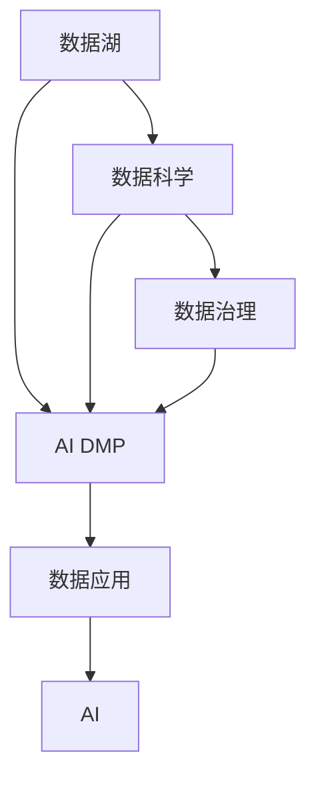

                 

# AI DMP 数据基建：数据应用与价值挖掘

## 1. 背景介绍

在数字化转型的大潮下，数据已经成为驱动企业创新和竞争的核心资产。然而，数据本身并不能直接产生价值，只有通过高效的数据管理和分析才能发挥其潜力。人工智能的快速演进，尤其是数据驱动型人工智能（Data-Driven AI）的兴起，正在重塑数据管理的范式。其中，AI数据管理平台（AI Data Management Platform, AI DMP）作为现代数据治理的重要组成部分，成为数据应用与价值挖掘的关键工具。本文将深入探讨AI DMP的核心概念、核心算法和实际应用，揭示其在数据驱动型AI时代中的重要价值。

## 2. 核心概念与联系

### 2.1 核心概念概述

在深入探讨AI DMP之前，我们首先需要明确几个关键概念及其相互联系：

- **AI数据管理平台（AI DMP）**：指利用人工智能技术对海量数据进行整合、清洗、分析和应用的数据管理平台。AI DMP能够通过自动化和智能化的方式，提升数据处理的效率和质量，帮助企业快速提取数据中的隐藏价值。

- **数据治理（Data Governance）**：指通过制度、技术和工具对数据生命周期进行管理和控制的实践，确保数据的质量、安全性和合规性。数据治理是数据管理的重要组成部分，对数据驱动型AI的应用至关重要。

- **数据科学（Data Science）**：指利用统计学、机器学习和数据挖掘等方法，从海量数据中提取知识、发现模式和建立模型的学科。数据科学是数据价值挖掘的核心驱动力。

- **数据湖（Data Lake）**：指存储原始数据的海量数据存储解决方案，通常不经过预处理，旨在以低成本、高灵活性存储所有类型的数据。数据湖为数据驱动型AI提供了丰富的数据源。

- **人工智能（AI）**：指利用计算机算法模拟人类智能的过程，包括感知、学习、推理和决策等能力。AI技术是数据科学和数据治理的有力工具，能够帮助企业在数据驱动型AI中实现创新和竞争优势。

这些概念之间的联系可以通过以下Mermaid流程图来展示：



这个流程图展示了数据湖、AI DMP、数据科学和数据治理之间的关系：

1. 数据湖是数据驱动型AI的数据源。
2. AI DMP通过整合数据湖中的数据，结合数据科学的方法和数据治理的规范，提升数据的质量和应用价值。
3. 数据科学和数据治理是AI DMP的基础，通过它们的方法和技术，AI DMP才能实现高效的数据应用。
4. 最终，AI DMP将数据转化为可用的知识，支持AI技术的应用，推动企业的智能化转型。

## 3. 核心算法原理 & 具体操作步骤
### 3.1 算法原理概述

AI DMP的核心算法原理主要包括以下几个方面：

- **数据整合与清洗**：通过数据挖掘和预处理技术，从数据湖中筛选、清洗、标准化数据，去除噪声和冗余。
- **数据增强与扩充**：利用数据生成技术，生成更多的训练样本，提高数据的多样性和覆盖率。
- **数据表示与建模**：通过特征工程和模型训练，将数据转化为机器可处理的格式，建立数据与业务目标之间的映射关系。
- **模型训练与优化**：利用机器学习算法和优化技术，训练和优化AI DMP的模型参数，提升模型的预测能力和泛化能力。
- **模型部署与监控**：将训练好的模型部署到生产环境中，持续监控模型性能，及时进行参数更新和模型迭代。

### 3.2 算法步骤详解

AI DMP的算法步骤通常包括以下几个关键步骤：

**Step 1: 数据收集与预处理**
- 从数据湖中收集相关数据，并进行初步清洗，去除缺失值和异常值。
- 对数据进行格式转换、标准化和归一化等预处理操作，确保数据的一致性和可用性。

**Step 2: 特征工程与表示**
- 利用数据挖掘技术，提取有用的特征，并根据业务需求进行特征选择和组合。
- 将数据转换为机器学习模型可处理的形式，如向量、张量等，以便后续建模。

**Step 3: 模型训练与优化**
- 选择适当的机器学习算法，如随机森林、神经网络、梯度提升树等，进行模型训练。
- 利用交叉验证、正则化、优化器等技术，对模型进行参数优化，提升模型的泛化能力。

**Step 4: 模型评估与部署**
- 在验证集上评估模型的性能，使用各种指标（如准确率、召回率、F1分数等）衡量模型的效果。
- 将训练好的模型部署到生产环境，并通过API接口提供服务。
- 持续监控模型在实际环境中的表现，定期更新模型参数，保持模型的高效和稳定。

**Step 5: 模型迭代与优化**
- 根据业务需求的变化和新数据的到来，不断迭代和优化模型。
- 利用模型再训练技术，快速更新模型参数，适应数据分布的变化。

### 3.3 算法优缺点

AI DMP的算法具有以下优点：

- **自动化与智能化**：通过自动化和智能化的方式，提高数据处理的效率和质量。
- **灵活性与可扩展性**：能够适应不同类型和规模的数据，提供灵活的数据处理框架。
- **多模型融合**：支持多种机器学习算法的融合，提升模型的泛化能力和应用价值。
- **易于部署与监控**：部署模型后，提供便捷的API接口，并通过监控工具实时跟踪模型性能。

同时，AI DMP的算法也存在以下局限性：

- **数据依赖性强**：依赖于数据湖中的数据质量和完整性，数据不足或数据质量不高会影响模型的效果。
- **算法复杂度高**：涉及特征工程、模型训练、参数优化等多个环节，技术难度较大。
- **资源消耗大**：处理大规模数据需要高性能计算资源，可能面临计算资源的瓶颈。
- **模型解释性不足**：部分复杂模型（如深度学习）的决策过程缺乏解释性，难以理解模型的内部机制。

### 3.4 算法应用领域

AI DMP的应用领域非常广泛，涵盖多个行业和场景，例如：

- **金融风控**：通过分析客户行为数据，预测风险和欺诈，提升金融安全。
- **电商推荐**：通过分析用户行为数据，推荐个性化商品，提升用户体验和转化率。
- **医疗健康**：通过分析医疗数据，发现疾病规律和趋势，辅助临床决策。
- **智能制造**：通过分析生产数据，优化生产流程，提升生产效率和质量。
- **智慧城市**：通过分析交通、环境数据，优化城市管理，提升城市运行效率和舒适度。

## 4. 数学模型和公式 & 详细讲解  
### 4.1 数学模型构建

AI DMP的数学模型主要包括以下几个部分：

- **特征表示模型**：将原始数据转换为特征向量，以便后续建模。
- **机器学习模型**：利用机器学习算法进行模型训练，建立数据与业务目标之间的映射关系。
- **目标优化模型**：通过目标优化算法（如梯度下降）进行模型参数优化。

### 4.2 公式推导过程

以回归任务为例，介绍AI DMP的数学模型构建和公式推导过程。

设训练集为 $\{(x_i, y_i)\}_{i=1}^N$，其中 $x_i \in \mathbb{R}^d$ 为输入，$y_i \in \mathbb{R}$ 为输出。

假设使用线性回归模型进行建模，模型的参数为 $\theta = [w, b]$，则模型的预测值为：

$$
\hat{y} = \theta^T x = wx + b
$$

其中 $w$ 为权重向量，$b$ 为偏置。

目标函数为均方误差损失函数：

$$
\mathcal{L}(\theta) = \frac{1}{N} \sum_{i=1}^N (y_i - \hat{y}_i)^2
$$

模型的优化目标是找到最优参数 $\theta^*$，使得损失函数最小化：

$$
\theta^* = \mathop{\arg\min}_{\theta} \mathcal{L}(\theta)
$$

利用梯度下降算法，每次迭代更新参数 $\theta$ 的公式为：

$$
\theta \leftarrow \theta - \eta \nabla_{\theta}\mathcal{L}(\theta)
$$

其中 $\eta$ 为学习率，$\nabla_{\theta}\mathcal{L}(\theta)$ 为损失函数对参数 $\theta$ 的梯度。

### 4.3 案例分析与讲解

假设有一个电商推荐系统的AI DMP，目标是根据用户的历史浏览行为预测其可能感兴趣的商品。

1. **数据收集与预处理**：
   - 从电商网站收集用户的历史浏览数据，包括浏览时间、浏览商品类别、浏览时长等。
   - 对数据进行清洗，去除异常值和缺失值，进行归一化处理。

2. **特征工程与表示**：
   - 提取用户的历史浏览行为特征，如浏览时间、浏览类别、浏览时长等。
   - 使用one-hot编码将类别特征转换为向量形式，以便模型处理。
   - 将特征向量作为输入，建立用户行为与商品推荐之间的关系。

3. **模型训练与优化**：
   - 使用线性回归模型进行模型训练，建立用户行为与商品推荐之间的关系。
   - 利用交叉验证技术，评估模型的性能，选择最优模型。
   - 使用梯度下降算法优化模型参数，提高模型的泛化能力。

4. **模型评估与部署**：
   - 在验证集上评估模型的性能，计算准确率、召回率、F1分数等指标。
   - 将训练好的模型部署到推荐系统中，通过API接口提供服务。
   - 持续监控模型的性能，及时更新模型参数。

5. **模型迭代与优化**：
   - 根据用户行为变化和新数据的到来，不断迭代和优化模型。
   - 利用再训练技术，快速更新模型参数，适应数据分布的变化。

通过上述步骤，电商推荐系统的AI DMP能够实时分析用户行为数据，预测其可能感兴趣的商品，提升推荐系统的个性化和精准度。

## 5. 项目实践：代码实例和详细解释说明
### 5.1 开发环境搭建

在进行AI DMP的开发实践前，我们需要准备好开发环境。以下是使用Python进行PyTorch开发的环境配置流程：

1. 安装Anaconda：从官网下载并安装Anaconda，用于创建独立的Python环境。

2. 创建并激活虚拟环境：
```bash
conda create -n ai_dmp_env python=3.8 
conda activate ai_dmp_env
```

3. 安装PyTorch：根据CUDA版本，从官网获取对应的安装命令。例如：
```bash
conda install pytorch torchvision torchaudio cudatoolkit=11.1 -c pytorch -c conda-forge
```

4. 安装TensorFlow：
```bash
pip install tensorflow
```

5. 安装各类工具包：
```bash
pip install numpy pandas scikit-learn matplotlib tqdm jupyter notebook ipython
```

完成上述步骤后，即可在`ai_dmp_env`环境中开始AI DMP的开发实践。

### 5.2 源代码详细实现

这里以电商推荐系统为例，给出使用PyTorch和TensorFlow进行AI DMP开发的PyTorch代码实现。

首先，定义数据预处理函数：

```python
import pandas as pd
import numpy as np
from sklearn.preprocessing import OneHotEncoder
from sklearn.model_selection import train_test_split
from sklearn.linear_model import LinearRegression

# 加载数据
data = pd.read_csv('user_browsing_data.csv')

# 数据预处理
features = ['browsing_time', 'browsing_category', 'browsing_duration']
labels = 'buy_intent'

X = data[features]
y = data[labels]

# 将类别特征进行one-hot编码
encoder = OneHotEncoder()
X_encoded = encoder.fit_transform(X)

# 划分训练集和测试集
X_train, X_test, y_train, y_test = train_test_split(X_encoded, y, test_size=0.2, random_state=42)
```

然后，定义模型训练函数：

```python
from torch.utils.data import TensorDataset, DataLoader
from torch import nn, optim

# 定义模型
class AI_DMP(nn.Module):
    def __init__(self):
        super(AI_DMP, self).__init__()
        self.linear = nn.Linear(X.shape[1], 1)
    
    def forward(self, x):
        x = self.linear(x)
        return x

# 定义训练函数
def train_model(model, optimizer, train_loader, num_epochs):
    for epoch in range(num_epochs):
        total_loss = 0
        for batch in train_loader:
            inputs, targets = batch
            optimizer.zero_grad()
            outputs = model(inputs)
            loss = nn.MSELoss()(outputs, targets)
            loss.backward()
            optimizer.step()
            total_loss += loss.item()
        print(f'Epoch {epoch+1}, Training Loss: {total_loss/N}')
```

最后，启动训练流程并在测试集上评估：

```python
# 定义优化器和数据加载器
model = AI_DMP()
optimizer = optim.SGD(model.parameters(), lr=0.01)
train_loader = DataLoader(X_train, y_train)
test_loader = DataLoader(X_test, y_test)

# 训练模型
train_model(model, optimizer, train_loader, num_epochs=10)

# 在测试集上评估模型
test_loss = 0
for batch in test_loader:
    inputs, targets = batch
    outputs = model(inputs)
    loss = nn.MSELoss()(outputs, targets)
    test_loss += loss.item()
print(f'Test Loss: {test_loss/N}')
```

以上就是使用PyTorch和TensorFlow进行AI DMP开发的完整代码实现。可以看到，通过简单的代码，即可实现数据预处理、模型训练和模型评估的整个流程。

### 5.3 代码解读与分析

让我们再详细解读一下关键代码的实现细节：

**数据预处理函数**：
- 加载数据集，并进行特征选择和标签提取。
- 对类别特征进行one-hot编码，以适应模型的输入要求。
- 使用train_test_split函数将数据集划分为训练集和测试集。

**模型定义函数**：
- 定义一个简单的线性回归模型，用于建立用户行为与商品推荐之间的关系。
- 模型的输入为特征向量，输出为推荐得分。

**训练函数**：
- 使用SGD优化器，学习率为0.01。
- 在每个epoch内，对每个batch进行前向传播、反向传播和参数更新。
- 记录每个epoch的训练损失，并打印输出。

**模型评估函数**：
- 对测试集进行评估，计算平均测试损失。
- 使用MSELoss函数计算模型预测值与真实值之间的均方误差。

**启动训练流程**：
- 实例化模型、优化器和数据加载器。
- 调用训练函数进行模型训练。
- 在测试集上评估模型性能，输出测试损失。

通过上述代码，我们完成了AI DMP的开发实践，并通过数据预处理、模型训练和模型评估的流程，验证了模型的有效性。

## 6. 实际应用场景
### 6.1 智能客服系统

AI DMP在智能客服系统中的应用，可以显著提升客服系统的效率和质量。传统客服系统往往依赖于人工客服，需要大量人力和时间成本，且难以保证服务的一致性和质量。通过AI DMP，可以对客服对话数据进行深度分析，提取有用的信息，优化客服策略，提高客户满意度。

具体而言，可以收集客服系统的对话数据，利用AI DMP对客户情感、问题类型、解决问题效率等关键指标进行分析和建模，优化客服流程，提供更加个性化的服务。同时，通过不断迭代和优化AI DMP模型，可以持续提升客服系统的智能化水平，降低人力成本，提高服务效率。

### 6.2 金融风控系统

金融风控系统是AI DMP的重要应用场景之一。通过AI DMP，可以实时分析用户的交易行为、信用记录、社交网络等信息，评估其信用风险，防范金融欺诈。

具体而言，可以收集用户的交易数据、社交数据、信用记录等，利用AI DMP对这些数据进行清洗、特征提取和建模，构建风险评估模型，实时监控用户行为，预测其可能的欺诈风险。通过不断迭代和优化AI DMP模型，可以提升金融风控系统的准确性和鲁棒性，保障金融安全。

### 6.3 电商推荐系统

电商推荐系统是AI DMP的典型应用场景之一。通过AI DMP，可以对用户的历史行为数据进行深度分析，发现用户的兴趣偏好，推荐个性化的商品，提升用户购买率和满意度。

具体而言，可以收集用户的浏览历史、购买记录、评价反馈等数据，利用AI DMP对这些数据进行清洗、特征提取和建模，构建推荐模型，实时预测用户可能感兴趣的商品，生成推荐列表。通过不断迭代和优化AI DMP模型，可以提升推荐系统的个性化和精准度，提高用户转化率。

## 7. 工具和资源推荐
### 7.1 学习资源推荐

为了帮助开发者系统掌握AI DMP的理论基础和实践技巧，这里推荐一些优质的学习资源：

1. **《AI数据管理平台：原理与实践》**：深入浅出地介绍了AI DMP的核心概念、算法原理和实际应用，是学习AI DMP的必读之作。

2. **斯坦福大学《数据科学导论》课程**：斯坦福大学开设的数据科学课程，系统介绍了数据科学的基本原理和应用方法，是学习AI DMP的基础。

3. **Kaggle竞赛平台**：Kaggle是一个数据科学竞赛平台，提供大量的真实世界数据集和竞赛任务，可以通过实践巩固和提升AI DMP的技能。

4. **Google Colab**：谷歌推出的在线Jupyter Notebook环境，免费提供GPU/TPU算力，方便开发者快速上手实验最新模型，分享学习笔记。

5. **Udacity《数据科学和机器学习》纳米学位课程**：Udacity提供的在线课程，涵盖数据科学和机器学习的各个方面，是学习AI DMP的重要资源。

通过对这些资源的学习实践，相信你一定能够快速掌握AI DMP的核心技能，并用于解决实际的NLP问题。

### 7.2 开发工具推荐

高效的开发离不开优秀的工具支持。以下是几款用于AI DMP开发的常用工具：

1. **PyTorch**：基于Python的开源深度学习框架，灵活动态的计算图，适合快速迭代研究。大部分预训练语言模型都有PyTorch版本的实现。

2. **TensorFlow**：由Google主导开发的开源深度学习框架，生产部署方便，适合大规模工程应用。同样有丰富的预训练语言模型资源。

3. **Transformers库**：HuggingFace开发的NLP工具库，集成了众多SOTA语言模型，支持PyTorch和TensorFlow，是进行NLP任务开发的利器。

4. **Weights & Biases**：模型训练的实验跟踪工具，可以记录和可视化模型训练过程中的各项指标，方便对比和调优。与主流深度学习框架无缝集成。

5. **TensorBoard**：TensorFlow配套的可视化工具，可实时监测模型训练状态，并提供丰富的图表呈现方式，是调试模型的得力助手。

6. **HuggingFace官方文档**：提供了海量预训练模型和完整的微调样例代码，是上手实践的必备资料。

合理利用这些工具，可以显著提升AI DMP的开发效率，加快创新迭代的步伐。

### 7.3 相关论文推荐

AI DMP的发展源于学界的持续研究。以下是几篇奠基性的相关论文，推荐阅读：

1. **《数据治理和数据驱动型AI》**：深入探讨了数据治理对数据驱动型AI的重要性，提出了数据治理与数据驱动型AI的融合方法。

2. **《AI数据管理平台的设计与实现》**：详细介绍了一个AI DMP系统的设计与实现，提供了丰富的实际案例和经验总结。

3. **《深度学习在数据治理中的应用》**：探讨了深度学习技术在数据治理中的应用，提出了基于深度学习的AI DMP设计方案。

4. **《AI DMP的挑战与应对》**：分析了AI DMP在实际应用中面临的挑战和解决方案，提出了未来的研究方向和趋势。

这些论文代表了大数据管理技术的发展脉络。通过学习这些前沿成果，可以帮助研究者把握学科前进方向，激发更多的创新灵感。

## 8. 总结：未来发展趋势与挑战

### 8.1 总结

本文对AI DMP的核心概念、算法原理和实际应用进行了全面系统的介绍。首先阐述了AI DMP的重要性和核心思想，明确了其在数据驱动型AI中的核心价值。其次，从原理到实践，详细讲解了AI DMP的数学模型和关键步骤，给出了AI DMP任务开发的完整代码实例。同时，本文还广泛探讨了AI DMP在智能客服、金融风控、电商推荐等多个行业领域的应用前景，展示了其在推动企业智能化转型中的巨大潜力。最后，本文精选了AI DMP技术的各类学习资源，力求为读者提供全方位的技术指引。

通过本文的系统梳理，可以看到，AI DMP作为数据驱动型AI的重要组成部分，正在成为数据治理和价值挖掘的关键工具。它通过自动化和智能化的方式，极大地提升了数据处理的效率和质量，帮助企业在各个领域实现智能化转型。未来，随着AI DMP技术的发展和成熟，其在数据治理和价值挖掘中的作用将越来越重要，为数据驱动型AI的广泛应用提供坚实的基础。

### 8.2 未来发展趋势

展望未来，AI DMP将呈现以下几个发展趋势：

1. **模型复杂度提升**：随着深度学习技术的发展，AI DMP将逐步引入更复杂的模型架构，如Transformer、BERT等，提升模型的精度和泛化能力。

2. **多模态数据融合**：AI DMP将逐步支持多模态数据的融合，结合文本、图像、视频等多种数据类型，提升模型的综合分析能力。

3. **实时数据处理**：AI DMP将逐步支持实时数据处理，能够快速响应数据变化，及时更新模型，满足实际应用中的实时需求。

4. **自动化和智能化**：AI DMP将进一步提升自动化和智能化水平，通过自动化数据预处理和模型优化，减轻人工干预的负担，提高数据处理和模型训练的效率。

5. **智能决策支持**：AI DMP将逐步融入智能决策支持系统，提供更加精准的数据分析和决策支持，提升企业决策的科学性和准确性。

6. **跨领域应用拓展**：AI DMP将逐步拓展到更多领域，如医疗、金融、制造、交通等，提升各个领域的智能化水平。

以上趋势凸显了AI DMP技术的广阔前景。这些方向的探索发展，将进一步提升AI DMP系统的性能和应用范围，为数据驱动型AI的广泛应用提供坚实的基础。

### 8.3 面临的挑战

尽管AI DMP技术已经取得了显著的进展，但在迈向更加智能化、普适化应用的过程中，它仍面临着诸多挑战：

1. **数据质量问题**：数据质量差、数据缺失和不一致等问题，严重影响AI DMP的效果。如何提升数据质量，优化数据治理，是一个重要的挑战。

2. **模型复杂度高**：AI DMP中使用的深度学习模型往往具有较高的复杂度，计算资源消耗大，训练时间长，如何优化模型结构，提高模型训练效率，是一个重要的研究方向。

3. **模型可解释性**：深度学习模型通常缺乏可解释性，难以理解模型的内部机制，如何提高模型的可解释性，是一个重要的挑战。

4. **模型鲁棒性**：AI DMP中使用的深度学习模型对数据变化敏感，如何提高模型的鲁棒性，避免模型过拟合和灾难性遗忘，是一个重要的研究方向。

5. **隐私和安全问题**：AI DMP中使用的深度学习模型对数据隐私和安全提出了更高的要求，如何保护用户隐私，防范数据泄露，是一个重要的挑战。

6. **系统可扩展性**：AI DMP需要在大规模数据上实现高效处理和实时响应，如何提高系统的可扩展性和稳定性，是一个重要的研究方向。

正视AI DMP面临的这些挑战，积极应对并寻求突破，将是大数据管理技术走向成熟的必由之路。相信随着学界和产业界的共同努力，这些挑战终将一一被克服，AI DMP必将在构建智能驱动型企业中扮演越来越重要的角色。

### 8.4 研究展望

面向未来，AI DMP的研究方向将集中在以下几个方面：

1. **自动化数据治理**：开发自动化数据治理工具，提升数据处理和数据质量管理的效率和准确性。

2. **智能数据预处理**：结合人工智能技术，实现更加智能化的数据预处理，提升数据处理的自动化和智能化水平。

3. **多模态数据融合**：开发多模态数据融合技术，提升AI DMP对多种数据类型的综合分析能力。

4. **实时数据处理**：开发实时数据处理技术，支持AI DMP的实时响应和实时决策。

5. **模型可解释性**：开发模型可解释性技术，提升AI DMP模型的透明性和可理解性。

6. **模型鲁棒性**：开发鲁棒性增强技术，提升AI DMP模型的鲁棒性和泛化能力。

7. **隐私和安全保护**：开发隐私保护和安全技术，确保AI DMP系统的隐私和安全。

这些研究方向将进一步提升AI DMP系统的性能和应用范围，为数据驱动型AI的广泛应用提供坚实的基础。

## 9. 附录：常见问题与解答

**Q1：AI DMP的核心价值是什么？**

A: AI DMP的核心价值在于通过自动化和智能化的方式，提升数据处理的效率和质量，帮助企业快速提取数据中的隐藏价值。AI DMP能够实现数据的深度分析和建模，提供精准的数据驱动决策支持，从而提升企业的智能化水平和竞争力。

**Q2：AI DMP在实际应用中如何处理数据质量问题？**

A: 数据质量问题在AI DMP中是一个重要挑战。处理数据质量问题的方法包括：
1. 数据清洗：通过去除噪声、填补缺失值等手段，提升数据质量。
2. 数据标注：通过人工标注或自动标注，提升数据的完整性和一致性。
3. 数据融合：通过数据融合技术，将多源数据进行整合，提升数据的丰富性和可靠性。
4. 数据验证：通过数据验证技术，发现和修正数据中的错误和异常。

**Q3：AI DMP中使用的深度学习模型有哪些？**

A: AI DMP中常用的深度学习模型包括：
1. 线性回归模型：用于简单的回归任务，如用户行为预测。
2. 随机森林模型：用于分类任务，如用户行为分类。
3. 梯度提升树模型：用于回归和分类任务，如用户行为预测和分类。
4. 卷积神经网络（CNN）：用于图像处理任务，如图像分类。
5. 循环神经网络（RNN）和长短时记忆网络（LSTM）：用于序列数据处理任务，如自然语言处理。
6. 注意力机制模型（如Transformer）：用于复杂的序列数据处理任务，如机器翻译和文本生成。

**Q4：AI DMP中如何进行数据增强？**

A: 数据增强是通过生成更多的训练样本，提高数据的多样性和覆盖率。AI DMP中的数据增强方法包括：
1. 数据扩充：通过改变输入数据的形式，如旋转、翻转、裁剪等，生成新的训练样本。
2. 数据合成：通过生成对抗网络（GAN）等技术，生成新的合成数据。
3. 数据插值：通过插值技术，生成新的数据点。
4. 数据重采样：通过重采样技术，生成新的数据样本。

通过数据增强，AI DMP可以提升模型的泛化能力和鲁棒性，避免过拟合。

**Q5：AI DMP中如何进行特征工程？**

A: 特征工程是AI DMP中非常重要的一环，通过提取和选择有用的特征，提升模型的精度和泛化能力。AI DMP中的特征工程方法包括：
1. 特征选择：通过特征选择算法，选择对目标任务有帮助的特征。
2. 特征提取：通过特征提取算法，将原始数据转换为有用的特征向量。
3. 特征组合：通过特征组合算法，生成新的特征组合。
4. 特征转换：通过特征转换算法，将特征进行转换和归一化。

特征工程需要根据具体任务和数据特点，进行灵活的组合和优化。

**Q6：AI DMP中如何进行模型训练和优化？**

A: AI DMP中的模型训练和优化通常包括以下步骤：
1. 选择适当的机器学习算法，如线性回归、随机森林、梯度提升树等。
2. 利用交叉验证、正则化、优化器等技术，进行模型训练和参数优化。
3. 在验证集上评估模型的性能，选择最优模型。
4. 在测试集上评估模型的泛化能力，确保模型的高效和稳定。
5. 根据业务需求的变化和新数据的到来，不断迭代和优化模型。

通过不断迭代和优化，AI DMP可以提升模型的精度和泛化能力，适应数据分布的变化。

---

作者：禅与计算机程序设计艺术 / Zen and the Art of Computer Programming

