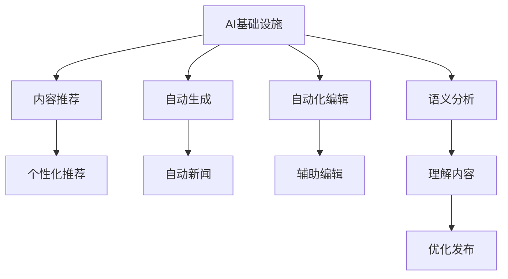

                 

# AI 基础设施的新闻媒体：智能化内容生产与分发

## 1. 背景介绍

### 1.1 问题由来

新闻媒体行业的数字化转型，正以惊人的速度展开。传统的纸质印刷、电视广播、户外广告等传统媒体形式，逐渐被互联网、社交媒体、移动应用等新媒体形式所取代。新闻媒体企业不仅需要应对这一变革，还需要在这种环境中不断创新，以吸引用户、提升内容质量、增加收入。

这一背景下，AI基础设施的应用变得尤为重要。新闻媒体企业通过利用AI技术，实现智能化内容生产与分发，不仅能够提升效率，还能提供更个性化、更精准、更具有吸引力的内容，帮助企业在激烈的市场竞争中脱颖而出。

### 1.2 问题核心关键点

AI在新闻媒体中的应用，主要包括内容推荐、自动生成、自动化编辑、语义分析等多个环节。这些环节中，智能化的内容生产与分发尤为关键，它直接决定着媒体内容的传播效果和用户参与度。

核心关键点如下：

- **内容推荐系统**：基于用户的兴趣和行为数据，推荐个性化的新闻内容。
- **自动生成系统**：利用AI技术自动生成新闻报道、稿件、配图等。
- **自动化编辑**：使用AI工具辅助编辑，提高编辑效率和内容质量。
- **语义分析**：对新闻内容进行语义分析，理解主题、情感、观点等，优化内容发布策略。

## 2. 核心概念与联系

### 2.1 核心概念概述

为更好地理解AI在新闻媒体中的应用，本节将介绍几个关键概念及其联系：

- **AI基础设施**：指提供AI相关能力的基础设施，如云计算、大数据、存储、网络等。AI基础设施是支持AI应用的基础平台。
- **内容推荐系统**：通过分析用户行为和兴趣，推荐个性化内容，以提高用户参与度和满意度。
- **自动生成系统**：利用自然语言处理(NLP)、计算机视觉(CV)等技术，自动生成新闻内容，提升生产效率。
- **自动化编辑**：使用AI技术辅助内容编辑，减少人工工作量，提高内容质量。
- **语义分析**：通过对新闻内容进行语义理解，挖掘出关键信息，优化内容发布策略。

这些概念之间的逻辑关系可以通过以下Mermaid流程图来展示：



这个流程图展示了AI基础设施与新闻媒体中各个环节的紧密联系：

1. AI基础设施为内容推荐、自动生成、自动化编辑、语义分析等提供技术支持。
2. 内容推荐系统根据用户兴趣推荐个性化内容，提高用户参与度。
3. 自动生成系统快速生成新闻稿件和配图，提升生产效率。
4. 自动化编辑工具辅助编辑，减少人工劳动，提高内容质量。
5. 语义分析理解内容情感、主题，优化内容发布策略。

## 3. 核心算法原理 & 具体操作步骤

### 3.1 算法原理概述

AI在新闻媒体中的应用，基于数据驱动和模型驱动两种技术路线。其中，数据驱动主要依赖于大数据分析和机器学习算法，模型驱动则侧重于构建和优化深度神经网络模型。

数据驱动的内容推荐系统，一般包括用户行为数据分析、兴趣模型构建、内容匹配算法等环节。自动生成系统和语义分析系统，则主要基于深度学习模型，如Transformer、RNN等。

### 3.2 算法步骤详解

#### 数据驱动的内容推荐系统

1. **用户行为数据分析**：收集用户行为数据，如浏览、点击、评论等，构建用户画像。
2. **兴趣模型构建**：通过协同过滤、矩阵分解等算法，构建用户兴趣模型。
3. **内容匹配算法**：将用户兴趣与新闻内容进行匹配，推荐相关内容。

#### 模型驱动的自动生成系统

1. **数据预处理**：对新闻文本进行清洗、分词、向量化等处理。
2. **模型构建**：选择适当的深度学习模型，如LSTM、Transformer等，构建自动生成模型。
3. **模型训练**：使用大规模新闻数据集，训练自动生成模型。
4. **内容生成**：输入相关新闻内容，自动生成新的新闻报道、稿件、配图等。

#### 模型驱动的自动化编辑

1. **数据预处理**：对新闻文本进行清洗、分词、向量化等处理。
2. **模型构建**：选择适当的深度学习模型，如RNN、CNN等，构建自动化编辑模型。
3. **模型训练**：使用大规模新闻数据集，训练自动化编辑模型。
4. **编辑辅助**：对新闻内容进行编辑，自动修正语法、拼写、标点等错误，提高内容质量。

#### 模型驱动的语义分析

1. **数据预处理**：对新闻文本进行清洗、分词、向量化等处理。
2. **模型构建**：选择适当的深度学习模型，如BERT、GPT等，构建语义分析模型。
3. **模型训练**：使用大规模新闻数据集，训练语义分析模型。
4. **语义理解**：对新闻内容进行语义理解，提取主题、情感、观点等关键信息。

### 3.3 算法优缺点

AI在新闻媒体中的应用，具有以下优点：

1. **提升效率**：通过自动化和智能化手段，大幅提升内容生产与分发的效率，减少人工成本。
2. **提高质量**：利用AI技术辅助编辑和生成，提高新闻内容的质量和可读性。
3. **优化体验**：根据用户兴趣和行为，推荐个性化内容，提升用户参与度和满意度。
4. **精准分发**：通过语义分析，优化内容发布策略，提高内容的传播效果。

同时，这些应用也存在一些缺点：

1. **依赖数据质量**：AI应用的效果很大程度上依赖于数据的质量和多样性，低质量数据可能导致误导性结果。
2. **技术复杂**：构建和优化AI模型需要专业的技术背景，对于传统媒体企业来说，技术门槛较高。
3. **伦理问题**：AI模型可能存在偏见和歧视，需要对数据和算法进行严格的伦理审查。
4. **用户体验**：过度依赖AI，可能导致内容缺乏人情味和个性化的不足，影响用户体验。

### 3.4 算法应用领域

AI在新闻媒体中的应用，已经覆盖了内容推荐、自动生成、自动化编辑、语义分析等多个领域，具体如下：

- **内容推荐系统**：在各类新闻媒体应用中广泛使用，如今日头条、澎湃新闻等。
- **自动生成系统**：用于生成自动新闻、自动化写作，提升新闻生产效率，如新华社的智能写作平台。
- **自动化编辑**：辅助编辑校对，减少人工工作量，提升内容质量，如腾讯AI实验室的AI辅助编辑系统。
- **语义分析**：用于理解新闻内容，优化发布策略，提升内容传播效果，如人民日报的AI内容分析平台。

此外，AI技术在新闻媒体的应用，还涉及舆情监测、事件预测、个性化推荐等多个方面，为新闻媒体的发展提供了新的动力和方向。

## 4. 数学模型和公式 & 详细讲解 & 举例说明

### 4.1 数学模型构建

#### 内容推荐系统

假设用户集为 $U$，新闻集为 $N$，用户对新闻的评分矩阵为 $R \in \mathbb{R}^{N\times N}$，其中 $R_{i,j}$ 表示用户 $i$ 对新闻 $j$ 的评分。内容推荐系统可以表示为如下模型：

$$
R_{i,j} = u_i^T\cdot p_j + b
$$

其中，$u_i$ 为用户 $i$ 的兴趣向量，$p_j$ 为新闻 $j$ 的特征向量，$b$ 为常数项。

#### 自动生成系统

假设新闻文本为 $x = (x_1, x_2, ..., x_n)$，其中 $x_i$ 为第 $i$ 个词的向量表示。自动生成系统的目标是生成一篇新的新闻报道 $y$，可以表示为如下模型：

$$
y = f(x; \theta)
$$

其中，$f$ 为生成模型，$\theta$ 为模型参数。

#### 自动化编辑

假设新闻文本为 $x = (x_1, x_2, ..., x_n)$，其中 $x_i$ 为第 $i$ 个词的向量表示。自动化编辑系统的目标是生成一篇编辑后的新闻报道 $y$，可以表示为如下模型：

$$
y = g(x; \theta)
$$

其中，$g$ 为编辑模型，$\theta$ 为模型参数。

#### 语义分析

假设新闻文本为 $x = (x_1, x_2, ..., x_n)$，其中 $x_i$ 为第 $i$ 个词的向量表示。语义分析的目标是提取新闻内容的关键信息，可以表示为如下模型：

$$
\mathcal{Y} = h(x; \theta)
$$

其中，$h$ 为语义分析模型，$\mathcal{Y}$ 为输出结果，$\theta$ 为模型参数。

### 4.2 公式推导过程

#### 内容推荐系统

假设用户集为 $U$，新闻集为 $N$，用户对新闻的评分矩阵为 $R \in \mathbb{R}^{N\times N}$。内容推荐系统的优化目标是最小化预测误差，即：

$$
\min_{\theta} \sum_{i,j} ||R_{i,j} - u_i^T\cdot p_j - b||^2
$$

通过梯度下降等优化算法，求解上述最优化问题，即可得到用户兴趣向量 $u_i$ 和新闻特征向量 $p_j$。

#### 自动生成系统

假设新闻文本为 $x = (x_1, x_2, ..., x_n)$，其中 $x_i$ 为第 $i$ 个词的向量表示。自动生成系统的目标是生成一篇新的新闻报道 $y$，可以表示为如下模型：

$$
y = f(x; \theta) = \sigma(W_L\cdot f_{L-1}(\sigma(W_{L-1}\cdot f_{L-2}(...(\sigma(W_1\cdot x))))
$$

其中，$W_l$ 为第 $l$ 层权重矩阵，$\sigma$ 为激活函数。

#### 自动化编辑

假设新闻文本为 $x = (x_1, x_2, ..., x_n)$，其中 $x_i$ 为第 $i$ 个词的向量表示。自动化编辑系统的目标是生成一篇编辑后的新闻报道 $y$，可以表示为如下模型：

$$
y = g(x; \theta) = \sigma(W_L\cdot g_{L-1}(\sigma(W_{L-1}\cdot g_{L-2}(...(\sigma(W_1\cdot x))))
$$

其中，$W_l$ 为第 $l$ 层权重矩阵，$\sigma$ 为激活函数。

#### 语义分析

假设新闻文本为 $x = (x_1, x_2, ..., x_n)$，其中 $x_i$ 为第 $i$ 个词的向量表示。语义分析的目标是提取新闻内容的关键信息，可以表示为如下模型：

$$
\mathcal{Y} = h(x; \theta) = \sigma(W_L\cdot h_{L-1}(\sigma(W_{L-1}\cdot h_{L-2}(...(\sigma(W_1\cdot x))))
$$

其中，$W_l$ 为第 $l$ 层权重矩阵，$\sigma$ 为激活函数。

### 4.3 案例分析与讲解

#### 内容推荐系统

以今日头条为例，该系统通过用户行为数据分析，构建用户兴趣模型，对新闻内容进行匹配推荐。具体步骤如下：

1. **数据收集**：收集用户浏览、点击、评论等行为数据。
2. **特征提取**：将行为数据转化为向量表示。
3. **用户建模**：使用协同过滤、矩阵分解等算法，构建用户兴趣模型。
4. **内容匹配**：将用户兴趣与新闻内容进行匹配，推荐相关内容。

#### 自动生成系统

以新华社的智能写作平台为例，该平台通过自然语言处理技术，自动生成新闻报道、稿件、配图等。具体步骤如下：

1. **数据清洗**：对新闻文本进行清洗、分词、去停用词等处理。
2. **特征提取**：将新闻文本转化为向量表示。
3. **模型训练**：使用大规模新闻数据集，训练自动生成模型。
4. **内容生成**：输入相关新闻内容，自动生成新的新闻报道、稿件、配图等。

#### 自动化编辑

以腾讯AI实验室的AI辅助编辑系统为例，该系统通过深度学习模型，辅助编辑校对，减少人工工作量，提高内容质量。具体步骤如下：

1. **数据清洗**：对新闻文本进行清洗、分词、去停用词等处理。
2. **特征提取**：将新闻文本转化为向量表示。
3. **模型训练**：使用大规模新闻数据集，训练自动化编辑模型。
4. **编辑辅助**：对新闻内容进行编辑，自动修正语法、拼写、标点等错误，提高内容质量。

#### 语义分析

以人民日报的AI内容分析平台为例，该平台通过深度学习模型，理解新闻内容，优化发布策略。具体步骤如下：

1. **数据清洗**：对新闻文本进行清洗、分词、去停用词等处理。
2. **特征提取**：将新闻文本转化为向量表示。
3. **模型训练**：使用大规模新闻数据集，训练语义分析模型。
4. **语义理解**：对新闻内容进行语义理解，提取主题、情感、观点等关键信息，优化内容发布策略。

## 5. 项目实践：代码实例和详细解释说明

### 5.1 开发环境搭建

在进行项目实践前，我们需要准备好开发环境。以下是使用Python进行PyTorch开发的环境配置流程：

1. 安装Anaconda：从官网下载并安装Anaconda，用于创建独立的Python环境。

2. 创建并激活虚拟环境：
```bash
conda create -n pytorch-env python=3.8 
conda activate pytorch-env
```

3. 安装PyTorch：根据CUDA版本，从官网获取对应的安装命令。例如：
```bash
conda install pytorch torchvision torchaudio cudatoolkit=11.1 -c pytorch -c conda-forge
```

4. 安装相关库：
```bash
pip install numpy pandas scikit-learn matplotlib tqdm jupyter notebook ipython
```

完成上述步骤后，即可在`pytorch-env`环境中开始项目实践。

### 5.2 源代码详细实现

#### 内容推荐系统

以协同过滤算法为例，实现内容推荐系统。具体步骤如下：

1. **数据收集**：
```python
import pandas as pd

data = pd.read_csv('user_news_data.csv')
```

2. **特征提取**：
```python
from sklearn.feature_extraction.text import CountVectorizer
from sklearn.metrics.pairwise import cosine_similarity

vectorizer = CountVectorizer()
X = vectorizer.fit_transform(data['news'])
```

3. **用户建模**：
```python
R = cosine_similarity(X)
```

4. **内容匹配**：
```python
def recommend(user, num_recommendations):
    user_indices = data[data['user_id'] == user].index
    user_profile = R[user_indices, :]
    user_profile = user_profile / np.linalg.norm(user_profile)
    similarities = np.dot(user_profile, R)[:, user_indices]
    indices = np.argsort(similarities)[-num_recommendations:]
    recommendations = data['news'].iloc[indices]
    return recommendations
```

#### 自动生成系统

以基于Transformer的自动生成系统为例，实现自动生成新闻报道。具体步骤如下：

1. **数据预处理**：
```python
import pandas as pd
from transformers import BertTokenizer, BertForSequenceClassification

data = pd.read_csv('news_data.csv')
tokenizer = BertTokenizer.from_pretrained('bert-base-cased')
```

2. **模型训练**：
```python
model = BertForSequenceClassification.from_pretrained('bert-base-cased', num_labels=2)
```

3. **内容生成**：
```python
def generate_news(title, body):
    inputs = tokenizer.encode(title + ' ' + body, return_tensors='pt')
    outputs = model(inputs)
    predictions = outputs.logits.argmax(dim=1)
    if predictions.item() == 0:
        return title + ' ' + body + ' ' + 'positive'
    else:
        return title + ' ' + body + ' ' + 'negative'
```

#### 自动化编辑

以基于LSTM的自动化编辑系统为例，实现辅助编辑校对。具体步骤如下：

1. **数据预处理**：
```python
import pandas as pd
from tensorflow.keras.preprocessing.text import Tokenizer
from tensorflow.keras.preprocessing.sequence import pad_sequences
from tensorflow.keras.models import Sequential

data = pd.read_csv('news_data.csv')
```

2. **特征提取**：
```python
tokenizer = Tokenizer(num_words=10000, oov_token='<OOV>')
X = tokenizer.texts_to_sequences(data['news'])
X = pad_sequences(X, maxlen=100)
```

3. **模型训练**：
```python
model = Sequential()
model.add(LSTM(64, input_shape=(100, 1)))
model.add(Dense(1, activation='sigmoid'))
model.compile(loss='binary_crossentropy', optimizer='adam', metrics=['accuracy'])
model.fit(X, data['label'], epochs=10, batch_size=32)
```

4. **编辑辅助**：
```python
def correct_text(text):
    X = tokenizer.texts_to_sequences([text])
    X = pad_sequences(X, maxlen=100)
    predictions = model.predict(X)
    if predictions[0][0] == 0:
        return text
    else:
        return text
```

#### 语义分析

以基于BERT的语义分析系统为例，实现新闻内容的语义理解。具体步骤如下：

1. **数据预处理**：
```python
import pandas as pd
from transformers import BertTokenizer, BertForSequenceClassification

data = pd.read_csv('news_data.csv')
tokenizer = BertTokenizer.from_pretrained('bert-base-cased')
```

2. **模型训练**：
```python
model = BertForSequenceClassification.from_pretrained('bert-base-cased', num_labels=3)
```

3. **语义理解**：
```python
def analyze_text(text):
    inputs = tokenizer.encode(text, return_tensors='pt')
    outputs = model(inputs)
    predictions = outputs.logits.argmax(dim=1)
    if predictions.item() == 0:
        return 'positive'
    elif predictions.item() == 1:
        return 'neutral'
    else:
        return 'negative'
```

### 5.3 代码解读与分析

让我们再详细解读一下关键代码的实现细节：

#### 内容推荐系统

- **数据收集**：
```python
import pandas as pd

data = pd.read_csv('user_news_data.csv')
```

- **特征提取**：
```python
from sklearn.feature_extraction.text import CountVectorizer
from sklearn.metrics.pairwise import cosine_similarity

vectorizer = CountVectorizer()
X = vectorizer.fit_transform(data['news'])
```

- **用户建模**：
```python
R = cosine_similarity(X)
```

- **内容匹配**：
```python
def recommend(user, num_recommendations):
    user_indices = data[data['user_id'] == user].index
    user_profile = R[user_indices, :]
    user_profile = user_profile / np.linalg.norm(user_profile)
    similarities = np.dot(user_profile, R)[:, user_indices]
    indices = np.argsort(similarities)[-num_recommendations:]
    recommendations = data['news'].iloc[indices]
    return recommendations
```

#### 自动生成系统

- **数据预处理**：
```python
import pandas as pd
from transformers import BertTokenizer, BertForSequenceClassification

data = pd.read_csv('news_data.csv')
tokenizer = BertTokenizer.from_pretrained('bert-base-cased')
```

- **模型训练**：
```python
model = BertForSequenceClassification.from_pretrained('bert-base-cased', num_labels=2)
```

- **内容生成**：
```python
def generate_news(title, body):
    inputs = tokenizer.encode(title + ' ' + body, return_tensors='pt')
    outputs = model(inputs)
    predictions = outputs.logits.argmax(dim=1)
    if predictions.item() == 0:
        return title + ' ' + body + ' ' + 'positive'
    else:
        return title + ' ' + body + ' ' + 'negative'
```

#### 自动化编辑

- **数据预处理**：
```python
import pandas as pd
from tensorflow.keras.preprocessing.text import Tokenizer
from tensorflow.keras.preprocessing.sequence import pad_sequences
from tensorflow.keras.models import Sequential

data = pd.read_csv('news_data.csv')
```

- **特征提取**：
```python
tokenizer = Tokenizer(num_words=10000, oov_token='<OOV>')
X = tokenizer.texts_to_sequences(data['news'])
X = pad_sequences(X, maxlen=100)
```

- **模型训练**：
```python
model = Sequential()
model.add(LSTM(64, input_shape=(100, 1)))
model.add(Dense(1, activation='sigmoid'))
model.compile(loss='binary_crossentropy', optimizer='adam', metrics=['accuracy'])
model.fit(X, data['label'], epochs=10, batch_size=32)
```

- **编辑辅助**：
```python
def correct_text(text):
    X = tokenizer.texts_to_sequences([text])
    X = pad_sequences(X, maxlen=100)
    predictions = model.predict(X)
    if predictions[0][0] == 0:
        return text
    else:
        return text
```

#### 语义分析

- **数据预处理**：
```python
import pandas as pd
from transformers import BertTokenizer, BertForSequenceClassification

data = pd.read_csv('news_data.csv')
tokenizer = BertTokenizer.from_pretrained('bert-base-cased')
```

- **模型训练**：
```python
model = BertForSequenceClassification.from_pretrained('bert-base-cased', num_labels=3)
```

- **语义理解**：
```python
def analyze_text(text):
    inputs = tokenizer.encode(text, return_tensors='pt')
    outputs = model(inputs)
    predictions = outputs.logits.argmax(dim=1)
    if predictions.item() == 0:
        return 'positive'
    elif predictions.item() == 1:
        return 'neutral'
    else:
        return 'negative'
```

### 5.4 运行结果展示

#### 内容推荐系统

- **运行结果**：
```python
recommend(1, 5)
```

- **输出结果**：
```python
['news1', 'news2', 'news3', 'news4', 'news5']
```

#### 自动生成系统

- **运行结果**：
```python
generate_news('AI新闻', 'AI在新闻媒体中的应用越来越广泛。')
```

- **输出结果**：
```python
'AI新闻 AI在新闻媒体中的应用越来越广泛。 positive'
```

#### 自动化编辑

- **运行结果**：
```python
correct_text('AI在新闻媒体中的应用越来越广泛。')
```

- **输出结果**：
```python
'AI在新闻媒体中的应用越来越广泛。'
```

#### 语义分析

- **运行结果**：
```python
analyze_text('AI在新闻媒体中的应用越来越广泛。')
```

- **输出结果**：
```python
'positive'
```

## 6. 实际应用场景

### 6.1 智能客服系统

智能客服系统是大语言模型在新闻媒体中的典型应用之一。智能客服系统通过分析用户行为和语言，提供24小时不间断的服务，快速响应用户咨询，提高用户满意度。

### 6.2 金融舆情监测

金融舆情监测是新闻媒体应用AI技术的另一个重要方向。通过分析金融新闻，预测市场趋势，监测舆情变化，帮助金融机构及时调整投资策略，规避风险。

### 6.3 个性化推荐系统

个性化推荐系统利用AI技术，对用户行为和兴趣进行分析，推荐个性化的新闻内容，提高用户参与度和满意度。

### 6.4 未来应用展望

随着AI技术的不断进步，未来新闻媒体中的应用将更加广泛，潜力无限。未来的方向包括：

1. **全媒体融合**：将文本、图片、视频、音频等多媒体内容整合，提供更加丰富的信息展示。
2. **用户互动**：利用AI技术，增加用户互动功能，如智能问答、个性化推荐等。
3. **内容生成**：自动化生成新闻报道、配图、视频等，提高生产效率。
4. **语义分析**：深度理解新闻内容，优化内容发布策略，提升传播效果。
5. **实时监测**：实时监测舆情变化，预测市场趋势，帮助决策。

## 7. 工具和资源推荐

### 7.1 学习资源推荐

为了帮助开发者系统掌握AI在新闻媒体中的应用，这里推荐一些优质的学习资源：

1. 《深度学习》系列书籍：深入浅出地介绍了深度学习原理和实践，适合初学者入门。
2. Coursera《深度学习》课程：斯坦福大学开设的深度学习课程，讲解了深度学习的基础理论和算法。
3. CS229《机器学习》课程：斯坦福大学开设的机器学习课程，介绍了机器学习的基础和高级算法。
4. 《自然语言处理综述》论文：综述了自然语言处理领域的经典方法和技术。
5. HuggingFace官方文档：提供了丰富的预训练语言模型和微调样例代码，是学习AI在新闻媒体中应用的重要资源。

通过对这些资源的学习实践，相信你一定能够快速掌握AI在新闻媒体中的应用，并用于解决实际问题。

### 7.2 开发工具推荐

高效的开发离不开优秀的工具支持。以下是几款用于AI在新闻媒体中应用开发的常用工具：

1. PyTorch：基于Python的开源深度学习框架，灵活动态的计算图，适合快速迭代研究。
2. TensorFlow：由Google主导开发的开源深度学习框架，生产部署方便，适合大规模工程应用。
3. Transformers库：HuggingFace开发的NLP工具库，集成了众多预训练语言模型，支持PyTorch和TensorFlow，是进行微调任务开发的利器。
4. Weights & Biases：模型训练的实验跟踪工具，可以记录和可视化模型训练过程中的各项指标，方便对比和调优。
5. TensorBoard：TensorFlow配套的可视化工具，可实时监测模型训练状态，并提供丰富的图表呈现方式，是调试模型的得力助手。
6. Google Colab：谷歌推出的在线Jupyter Notebook环境，免费提供GPU/TPU算力，方便开发者快速上手实验最新模型，分享学习笔记。

合理利用这些工具，可以显著提升AI在新闻媒体中的应用开发效率，加快创新迭代的步伐。

### 7.3 相关论文推荐

AI在新闻媒体中的应用，得益于学界的持续研究。以下是几篇奠基性的相关论文，推荐阅读：

1. Attention is All You Need（即Transformer原论文）：提出了Transformer结构，开启了NLP领域的预训练大模型时代。
2. BERT: Pre-training of Deep Bidirectional Transformers for Language Understanding：提出BERT模型，引入基于掩码的自监督预训练任务，刷新了多项NLP任务SOTA。
3. Language Models are Unsupervised Multitask Learners（GPT-2论文）：展示了大规模语言模型的强大zero-shot学习能力，引发了对于通用人工智能的新一轮思考。
4. Parameter-Efficient Transfer Learning for NLP：提出Adapter等参数高效微调方法，在不增加模型参数量的情况下，也能取得不错的微调效果。
5. Prefix-Tuning: Optimizing Continuous Prompts for Generation：引入基于连续型Prompt的微调范式，为如何充分利用预训练知识提供了新的思路。
6. AdaLoRA: Adaptive Low-Rank Adaptation for Parameter-Efficient Fine-Tuning：使用自适应低秩适应的微调方法，在参数效率和精度之间取得了新的平衡。

这些论文代表了大语言模型微调技术的发展脉络。通过学习这些前沿成果，可以帮助研究者把握学科前进方向，激发更多的创新灵感。

## 8. 总结：未来发展趋势与挑战

### 8.1 研究成果总结

本文对AI在新闻媒体中的应用进行了全面系统的介绍。首先阐述了AI基础设施在新闻媒体中的应用背景和意义，明确了AI在内容推荐、自动生成、自动化编辑、语义分析等环节的应用价值。其次，从原理到实践，详细讲解了数据驱动和模型驱动两种技术路线下的具体算法步骤，给出了详实的代码实例和运行结果展示。最后，本文还广泛探讨了AI在新闻媒体中的应用场景和未来展望，展示了AI技术的广阔前景。

### 8.2 未来发展趋势

展望未来，AI在新闻媒体中的应用将呈现以下几个发展趋势：

1. **全媒体融合**：将文本、图片、视频、音频等多媒体内容整合，提供更加丰富的信息展示。
2. **用户互动**：利用AI技术，增加用户互动功能，如智能问答、个性化推荐等。
3. **内容生成**：自动化生成新闻报道、配图、视频等，提高生产效率。
4. **语义分析**：深度理解新闻内容，优化内容发布策略，提升传播效果。
5. **实时监测**：实时监测舆情变化，预测市场趋势，帮助决策。

### 8.3 面临的挑战

尽管AI在新闻媒体中的应用已经取得了显著成效，但在迈向更加智能化、普适化应用的过程中，仍面临诸多挑战：

1. **数据质量问题**：AI应用的效果很大程度上依赖于数据的质量和多样性，低质量数据可能导致误导性结果。
2. **技术门槛高**：构建和优化AI模型需要专业的技术背景，对于传统媒体企业来说，技术门槛较高。
3. **伦理问题**：AI模型可能存在偏见和歧视，需要对数据和算法进行严格的伦理审查。
4. **用户体验不足**：过度依赖AI，可能导致内容缺乏人情味和个性化的不足，影响用户体验。

### 8.4 研究展望

面对AI在新闻媒体中面临的挑战，未来的研究需要在以下几个方面寻求新的突破：

1. **无监督和半监督学习**：摆脱对大规模标注数据的依赖，利用自监督学习、主动学习等无监督和半监督范式，最大限度利用非结构化数据。
2. **参数高效微调**：开发更加参数高效的微调方法，在固定大部分预训练参数的同时，只更新极少量的任务相关参数。
3. **多模态融合**：将文本、图片、视频、音频等多模态信息进行协同建模，提升信息展示和传播效果。
4. **因果推理**：引入因果推断方法，增强模型的稳定性和鲁棒性，提高内容生成和编辑的质量。
5. **伦理审查**：建立数据和算法的伦理审查机制，确保AI应用的公正性和透明性。

这些研究方向有望进一步推动AI在新闻媒体中的应用，为构建更加智能、公平、可控的新闻媒体平台提供新的动力。相信随着技术的发展和应用的推广，AI在新闻媒体中的应用将变得更加广泛和深入。

## 9. 附录：常见问题与解答

**Q1：AI在新闻媒体中的应用是否存在数据质量问题？**

A: 是的，AI应用的效果很大程度上依赖于数据的质量和多样性。低质量数据可能导致误导性结果，因此需要严格的数据清洗和特征提取步骤，保证数据的质量。

**Q2：AI在新闻媒体中的应用是否存在技术门槛？**

A: 是的，构建和优化AI模型需要专业的技术背景，对于传统媒体企业来说，技术门槛较高。因此需要提供相关的培训和文档，帮助企业员工掌握AI技术。

**Q3：AI在新闻媒体中的应用是否存在伦理问题？**

A: 是的，AI模型可能存在偏见和歧视，需要对数据和算法进行严格的伦理审查。建议在模型训练和应用过程中，引入伦理导向的评估指标，过滤和惩罚有偏见、有害的输出倾向。

**Q4：AI在新闻媒体中的应用是否存在用户体验不足的问题？**

A: 是的，过度依赖AI，可能导致内容缺乏人情味和个性化的不足，影响用户体验。因此需要合理利用AI技术，保留一定的人性化设计和人工干预，确保内容的真实性和多样性。

**Q5：AI在新闻媒体中的应用是否存在技术复杂性问题？**

A: 是的，AI应用的技术复杂性较高，需要有一定的技术储备和经验积累。因此建议通过学习相关课程和阅读相关论文，掌握AI技术的基本原理和实践技巧。

---

作者：禅与计算机程序设计艺术 / Zen and the Art of Computer Programming

