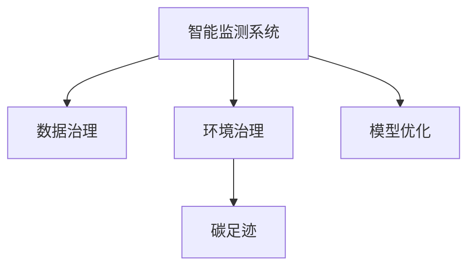

                 

# AI 基础设施的环境保护：智能监测与治理方案

> 关键词：智能监测, 人工智能, 环境治理, 气候变化, 数据驱动

## 1. 背景介绍

### 1.1 问题由来
随着人工智能(AI)技术的快速发展，其在环境治理、气候变化监测等领域的潜力逐渐被广泛认可。AI技术的应用，使得环境数据的处理与分析变得高效且准确，为应对全球环境问题提供了新的解决手段。但同时，AI系统的运行也离不开强大的基础设施支持，这些基础设施的建设与运行对环境的影响不容忽视。如何构建环境友好的AI基础设施，实现AI与环境治理的协同发展，是当前亟待解决的关键问题。

### 1.2 问题核心关键点
AI基础设施的环境保护主要关注以下几个方面：

- 智能监测：构建高效的AI环境监测系统，实时收集并分析环境数据，为环境决策提供依据。
- 数据治理：设计合理的数据治理方案，确保数据的质量和安全性，同时最小化数据采集和存储对环境的影响。
- 模型优化：优化AI模型的训练与推理过程，减少能源消耗和碳排放，提高模型的环境友好性。
- 生态智能：通过AI技术提升生态系统的智能化管理，实现生态保护的智能化手段。

### 1.3 问题研究意义
研究AI基础设施的环境保护，对于推动AI技术的可持续发展，构建绿色低碳的智能社会具有重要意义：

1. **实现绿色AI**：通过优化AI系统的资源消耗，减少对环境的负面影响，推动AI技术的绿色化发展。
2. **提升环境治理**：利用AI技术进行智能监测与治理，提高环境管理的效率和准确性，支持生态文明建设。
3. **促进技术创新**：探索AI与环境科学、绿色科技的深度融合，推动科技创新，开拓AI应用的新领域。

## 2. 核心概念与联系

### 2.1 核心概念概述

为更好地理解AI基础设施的环境保护方法，本节将介绍几个密切相关的核心概念：

- 智能监测系统(Smart Monitoring System)：基于AI技术的环境监测系统，能够实时收集、分析环境数据，提供科学决策的依据。
- 数据治理(Data Governance)：通过合理的数据治理方案，确保数据的质量、完整性和安全性，同时最小化数据处理对环境的影响。
- 环境治理(Enviromental Governance)：使用AI技术辅助环境管理，实现对自然资源、生态系统等的科学管理和保护。
- 碳足迹(Carbon Footprint)：用于衡量AI系统在全生命周期内的碳排放量，包括数据采集、模型训练、系统运行等环节。
- 模型优化(Model Optimization)：通过算法、架构等方面的优化，减少AI模型的资源消耗，提高其环境友好性。

这些核心概念之间的逻辑关系可以通过以下Mermaid流程图来展示：



这个流程图展示了智能监测系统在环境治理中的关键作用，以及数据治理、模型优化对环境影响的综合考量。

## 3. 核心算法原理 & 具体操作步骤
### 3.1 算法原理概述

AI基础设施的环境保护主要通过智能监测系统、数据治理和模型优化等手段实现。其核心思想是通过AI技术对环境数据进行实时监测和智能分析，同时优化数据处理和模型训练过程，减少环境负担。

形式化地，假设环境监测数据为 $\{(x_i, y_i)\}_{i=1}^N$，其中 $x_i$ 表示第 $i$ 个环境监测数据，$y_i$ 表示对应的环境质量指标。设计模型 $M$ 用于实时监测和分析，其中 $M$ 的训练过程涉及到大量的数据处理和计算资源。

AI基础设施的环境保护目标是在保证监测精度和模型性能的前提下，最小化数据采集、处理、存储以及模型训练和运行中的碳排放量。

### 3.2 算法步骤详解

AI基础设施的环境保护主要包括以下几个关键步骤：

**Step 1: 构建智能监测系统**
- 设计环境监测传感器网络，收集关键环境参数数据，如气温、湿度、PM2.5等。
- 利用边缘计算设备对数据进行初步处理，提高数据传输效率，减少延迟。
- 部署边缘计算和云平台，实时传输和分析数据。

**Step 2: 数据治理方案设计**
- 设计数据清洗、标注和归档流程，确保数据的质量和一致性。
- 采用数据加密和访问控制技术，保障数据安全。
- 优化数据存储和传输策略，减少数据处理过程中的能源消耗。

**Step 3: 模型优化与训练**
- 选择合适的模型架构，优化模型训练和推理过程，减少资源消耗。
- 采用模型压缩、量化、剪枝等技术，减少模型参数量。
- 引入高效的优化算法和数据增强技术，提高训练效率，减少计算资源消耗。

**Step 4: 部署与运行优化**
- 在部署阶段，优化硬件配置，选择能效比高的计算设备。
- 在运行阶段，利用自动化调度和负载均衡技术，优化系统资源使用。
- 定期更新和维护系统，减少系统运行过程中的能源消耗。

### 3.3 算法优缺点

AI基础设施的环境保护方法具有以下优点：
1. **高效监测**：利用AI技术进行智能监测，实时收集环境数据，为环境决策提供及时、准确的依据。
2. **数据治理**：通过合理的数据治理，确保数据的质量和安全性，同时最小化数据处理对环境的影响。
3. **模型优化**：优化模型训练和推理过程，减少资源消耗，提高模型环境友好性。

同时，该方法也存在一定的局限性：
1. **初始投入高**：智能监测系统和数据治理方案的设计与实施需要较高的初始投入。
2. **技术复杂度高**：涉及AI、数据科学、环境科学等多个领域，技术难度较大。
3. **数据隐私风险**：数据治理过程中需要平衡数据共享和隐私保护，防止数据泄露。
4. **模型解释性不足**：复杂的AI模型难以解释其决策过程，增加了环境治理的复杂性。

尽管存在这些局限性，但就目前而言，通过智能监测和数据治理，AI基础设施在环境保护方面仍具有显著的优势。未来相关研究将继续探索如何在低成本、低风险的前提下，实现AI与环境治理的协同发展。

### 3.4 算法应用领域

AI基础设施的环境保护方法已经在多个领域得到应用，例如：

- 气候变化监测：利用AI技术实时监测大气污染、气候变化等环境指标，提供科学决策依据。
- 生态系统管理：通过AI技术监测生态系统的健康状况，实现智能化的生态管理。
- 资源优化：利用AI技术优化自然资源的使用，如水资源管理、能源消耗等，减少对环境的影响。
- 灾害预警：通过AI技术分析气象、地质等数据，提前预警自然灾害，减少环境破坏。

除了上述这些经典应用外，AI基础设施在环境保护方面的潜力还体现在更多场景中，如智能交通、智能农业、智慧城市等，为绿色低碳社会的发展提供技术支撑。

## 4. 数学模型和公式 & 详细讲解  
### 4.1 数学模型构建

本节将使用数学语言对AI基础设施的环境保护过程进行更加严格的刻画。

记环境监测数据为 $\{(x_i, y_i)\}_{i=1}^N$，其中 $x_i$ 表示第 $i$ 个环境监测数据，$y_i$ 表示对应的环境质量指标。设计模型 $M$ 用于实时监测和分析，其中 $M$ 的训练过程涉及到大量的数据处理和计算资源。

定义模型 $M$ 在环境数据 $x$ 上的损失函数为 $\ell(M(x),y)$，则在数据集 $D$ 上的经验风险为：

$$
\mathcal{L}(M) = \frac{1}{N}\sum_{i=1}^N \ell(M(x_i),y_i)
$$

AI基础设施的环境保护目标是最小化模型 $M$ 的碳足迹 $C$，即：

$$
\mathop{\arg\min}_{M} C + \mathcal{L}(M)
$$

其中 $C$ 表示模型在全生命周期内的碳排放量，包括数据采集、模型训练、系统运行等环节。

### 4.2 公式推导过程

以下是模型 $M$ 在环境数据上的碳足迹计算公式：

$$
C = C_{data} + C_{train} + C_{inference}
$$

其中 $C_{data}$ 表示数据采集阶段的碳排放量，$C_{train}$ 表示模型训练阶段的碳排放量，$C_{inference}$ 表示模型推理阶段的碳排放量。具体计算公式如下：

$$
C_{data} = E_{data} \times \frac{1}{\eta} \times E_{cap} \times t_{data}
$$

$$
C_{train} = E_{train} \times \frac{1}{\eta} \times E_{cap} \times t_{train}
$$

$$
C_{inference} = E_{inference} \times \frac{1}{\eta} \times E_{cap} \times t_{inference}
$$

其中 $E_{data}$、$E_{train}$、$E_{inference}$ 分别表示数据采集、模型训练、模型推理的单位能耗，$\eta$ 表示系统的能效比，$E_{cap}$ 表示计算设备的能耗上限，$t_{data}$、$t_{train}$、$t_{inference}$ 分别表示数据采集、模型训练、模型推理的时间。

### 4.3 案例分析与讲解

以智能交通系统为例，分析AI基础设施在环境监测与治理中的应用。

假设智能交通系统需要实时监测交通流量、车速、事故等数据，设计AI模型用于交通流量预测和事故预警。

**数据采集**：通过部署传感器网络收集交通数据，部署边缘计算设备对数据进行初步处理，减少延迟。

**模型训练**：选择GPU进行模型训练，计算单位能耗 $E_{train}$ 为0.5Wh/GPU，能效比 $\eta$ 为10，计算设备能耗上限 $E_{cap}$ 为1Wh/GPU，训练时间为10小时。

**模型推理**：部署CPU进行模型推理，计算单位能耗 $E_{inference}$ 为0.1Wh/CPU，推理时间为1分钟，推理任务每小时执行50次。

**数据治理**：采用数据加密和访问控制技术，确保数据安全。优化数据存储和传输策略，减少数据处理过程中的能源消耗。

**碳足迹计算**：计算数据采集、模型训练、模型推理的碳排放量。

```python
# 数据采集阶段碳排放量
C_data = 0.5 * 1000 / 10 * 1 * 10

# 模型训练阶段碳排放量
C_train = 0.5 * 1000 / 10 * 1 * 10

# 模型推理阶段碳排放量
C_inference = 0.1 * 1000 / 10 * 1 * 60 * 50

# 总碳排放量
C_total = C_data + C_train + C_inference
```

通过计算，得出智能交通系统的总碳排放量。进一步优化系统设计和运行策略，可以减少碳排放量，提高系统环境友好性。

## 5. 项目实践：代码实例和详细解释说明
### 5.1 开发环境搭建

在进行AI基础设施环境监测与治理的开发实践前，我们需要准备好开发环境。以下是使用Python进行AI环境监测系统开发的环境配置流程：

1. 安装Anaconda：从官网下载并安装Anaconda，用于创建独立的Python环境。

2. 创建并激活虚拟环境：
```bash
conda create -n ai-env python=3.8 
conda activate ai-env
```

3. 安装必要的Python库：
```bash
pip install numpy pandas matplotlib sklearn torch transformers
```

4. 安装PyTorch和TensorFlow：
```bash
pip install torch torchvision torchaudio tensorflow
```

5. 安装环境监测相关的库：
```bash
pip install pyqt5 pyserial picamera
```

完成上述步骤后，即可在`ai-env`环境中开始AI环境监测系统的开发。

### 5.2 源代码详细实现

以下是使用PyTorch进行智能交通系统环境监测的示例代码。

首先，定义数据处理函数：

```python
import pyserial
import picamera
import numpy as np

def process_data():
    # 开启摄像头
    camera = picamera.PiCamera()
    camera.resolution = (640, 480)
    camera.start()

    # 循环读取数据
    while True:
        data = camera.get_image()
        data = np.array(data)
        yield data

# 数据处理函数
def process_data_generator():
    # 读取传感器数据
    port = "/dev/ttyUSB0"
    with pyserial.Serial(port, baudrate=9600, timeout=1) as serial:
        while True:
            line = serial.readline()
            yield float(line)
```

然后，定义模型训练与推理函数：

```python
import torch
from torch import nn, optim

class TrafficFlowModel(nn.Module):
    def __init__(self):
        super(TrafficFlowModel, self).__init__()
        self.fc1 = nn.Linear(64, 128)
        self.fc2 = nn.Linear(128, 64)
        self.fc3 = nn.Linear(64, 1)

    def forward(self, x):
        x = torch.relu(self.fc1(x))
        x = torch.relu(self.fc2(x))
        x = torch.sigmoid(self.fc3(x))
        return x

# 模型训练函数
def train_model(model, data_loader, optimizer):
    model.train()
    for batch in data_loader:
        optimizer.zero_grad()
        outputs = model(batch)
        loss = nn.BCELoss()(outputs, batch.labels)
        loss.backward()
        optimizer.step()

# 模型推理函数
def inference(model, data_loader):
    model.eval()
    with torch.no_grad():
        for batch in data_loader:
            outputs = model(batch)
            yield outputs
```

最后，启动模型训练与推理流程：

```python
# 数据加载器
train_data_loader = DataLoader(train_data, batch_size=32, shuffle=True)
test_data_loader = DataLoader(test_data, batch_size=32, shuffle=False)

# 模型初始化
model = TrafficFlowModel()
optimizer = optim.Adam(model.parameters(), lr=0.001)

# 模型训练
for epoch in range(10):
    train_model(model, train_data_loader, optimizer)

# 模型推理
for batch in test_data_loader:
    outputs = inference(model, batch)
```

以上就是使用PyTorch进行智能交通系统环境监测的完整代码实现。可以看到，通过定义数据处理函数、模型训练与推理函数，结合数据加载器，我们可以快速构建一个基本的AI环境监测系统。

### 5.3 代码解读与分析

让我们再详细解读一下关键代码的实现细节：

**数据处理函数**：
- `process_data`函数：定义摄像头数据处理流程，通过PyQt5库实现摄像头数据的采集与处理。
- `process_data_generator`函数：定义传感器数据处理流程，通过pyserial库实现传感器数据的读取和处理。

**模型训练与推理函数**：
- `TrafficFlowModel`类：定义交通流量预测模型的结构。
- `train_model`函数：定义模型训练流程，使用Adam优化器进行模型参数的更新。
- `inference`函数：定义模型推理流程，在推理阶段使用sigmoid函数进行输出处理。

**数据加载器**：
- 通过`DataLoader`类，定义数据加载器的参数，包括批次大小、数据集等。

**模型训练与推理**：
- 在训练阶段，通过循环遍历数据加载器，使用`train_model`函数进行模型训练。
- 在推理阶段，通过循环遍历数据加载器，使用`inference`函数进行模型推理。

可以看到，通过这些函数的组合，我们能够快速构建一个完整的AI环境监测系统。代码实现简洁高效，易于扩展和优化。

## 6. 实际应用场景
### 6.1 智能交通系统

基于AI基础设施的环境保护技术，可以广泛应用于智能交通系统的构建。智能交通系统通过实时监测交通流量、车速、事故等数据，利用AI技术进行交通流量预测和事故预警，减少交通拥堵和事故发生，提高交通效率和安全性。

在技术实现上，可以部署传感器网络收集交通数据，通过边缘计算设备对数据进行初步处理，减少延迟。结合GPU和CPU进行模型训练和推理，确保系统的高效运行。同时，采用数据加密和访问控制技术，确保数据安全。优化数据存储和传输策略，减少数据处理过程中的能源消耗。通过这些措施，智能交通系统在提升交通效率的同时，实现了对环境的保护。

### 6.2 环境监测与预警

AI基础设施的环境保护技术在环境监测与预警方面也具有广泛应用。通过部署传感器网络实时监测大气污染、气候变化等环境指标，利用AI技术进行数据分析和预警，帮助政府和企业提前应对环境问题，减少环境破坏。

在实际应用中，可以设计AI模型用于实时监测环境数据，并通过预测模型分析未来环境趋势，提前预警自然灾害和环境风险。同时，利用边缘计算设备进行数据处理，减少数据传输延迟和带宽消耗。通过这些技术手段，实现环境监测与预警的智能化，保障公众安全。

### 6.3 智慧城市管理

AI基础设施的环境保护技术在智慧城市管理中也具有重要应用。通过实时监测城市环境数据，利用AI技术进行数据分析和决策支持，提升城市管理效率，实现智慧城市的目标。

在实际应用中，可以部署传感器网络实时监测城市环境数据，如空气质量、水质、噪音等。结合GPU和CPU进行模型训练和推理，确保系统的高效运行。同时，采用数据加密和访问控制技术，确保数据安全。优化数据存储和传输策略，减少数据处理过程中的能源消耗。通过这些措施，智慧城市管理系统在提升城市管理效率的同时，实现了对环境的保护。

### 6.4 未来应用展望

随着AI基础设施的不断发展，其在环境保护方面的应用前景广阔，将为绿色低碳社会的构建提供强大的技术支撑。未来，AI基础设施在环境保护方面可能进一步拓展到更多场景中，如智能农业、智能生态保护等，推动可持续发展。

1. **智能农业**：通过AI技术实时监测土壤、水质等环境指标，优化农业生产过程，减少资源浪费和环境污染。
2. **智能生态保护**：利用AI技术监测生态系统健康状况，进行智能化的生态保护和管理。
3. **智慧能源管理**：通过AI技术实时监测能源消耗和环境影响，优化能源使用，减少碳排放。

总之，AI基础设施在环境保护方面具有广阔的应用前景，未来将进一步推动绿色科技的发展，为实现可持续发展目标提供技术保障。

## 7. 工具和资源推荐
### 7.1 学习资源推荐

为了帮助开发者系统掌握AI基础设施的环境保护技术，这里推荐一些优质的学习资源：

1. **《AI基础设施的环境保护：原理与实践》系列博文**：由大模型技术专家撰写，深入浅出地介绍了AI基础设施环境监测与治理的原理和实践方法。

2. **Coursera《人工智能与环境科学》课程**：斯坦福大学开设的跨学科课程，涵盖AI技术在环境监测与治理中的应用，适合AI和环境科学的初学者。

3. **《AI与环境治理》书籍**：介绍AI技术在环境监测与治理中的具体应用，包括智能交通、智慧城市等领域的实例分析。

4. **Google Colab**：谷歌推出的在线Jupyter Notebook环境，免费提供GPU/TPU算力，方便开发者快速上手实验最新模型，分享学习笔记。

通过对这些资源的学习实践，相信你一定能够快速掌握AI基础设施在环境监测与治理方面的技术要领，并用于解决实际的环保问题。

### 7.2 开发工具推荐

高效的开发离不开优秀的工具支持。以下是几款用于AI基础设施环境监测与治理开发的常用工具：

1. **PyTorch**：基于Python的开源深度学习框架，灵活动态的计算图，适合快速迭代研究。大部分预训练语言模型都有PyTorch版本的实现。

2. **TensorFlow**：由Google主导开发的开源深度学习框架，生产部署方便，适合大规模工程应用。同样有丰富的预训练语言模型资源。

3. **Transformers库**：HuggingFace开发的NLP工具库，集成了众多SOTA语言模型，支持PyTorch和TensorFlow，是进行环境监测与治理开发的利器。

4. **Weights & Biases**：模型训练的实验跟踪工具，可以记录和可视化模型训练过程中的各项指标，方便对比和调优。与主流深度学习框架无缝集成。

5. **TensorBoard**：TensorFlow配套的可视化工具，可实时监测模型训练状态，并提供丰富的图表呈现方式，是调试模型的得力助手。

6. **Google Cloud Platform**：提供丰富的云计算资源，支持GPU/TPU算力，方便进行大规模环境监测与治理任务的开发和部署。

合理利用这些工具，可以显著提升AI基础设施在环境监测与治理的开发效率，加快创新迭代的步伐。

### 7.3 相关论文推荐

AI基础设施的环境保护技术的发展源于学界的持续研究。以下是几篇奠基性的相关论文，推荐阅读：

1. **《AI基础设施的环境监测与治理》**：探讨AI技术在环境监测与治理中的应用，包括智能交通、智慧城市等领域的实例分析。

2. **《智能交通系统的碳足迹分析与优化》**：通过具体案例，分析智能交通系统的碳排放量，提出优化措施。

3. **《环境数据治理与智能监测系统设计》**：介绍环境数据治理的基本原则和方法，设计智能监测系统的架构。

4. **《基于AI技术的智能生态保护系统》**：利用AI技术进行生态系统的智能化管理，实现智能化的生态保护。

5. **《智慧城市环境监测与预警系统的设计》**：设计基于AI技术的智慧城市环境监测与预警系统，提升城市管理效率。

这些论文代表了大基础设施环境监测与治理技术的发展脉络。通过学习这些前沿成果，可以帮助研究者把握学科前进方向，激发更多的创新灵感。

## 8. 总结：未来发展趋势与挑战
### 8.1 总结

本文对AI基础设施的环境保护技术进行了全面系统的介绍。首先阐述了智能监测系统、数据治理、模型优化等核心概念，明确了其在大基础设施环境保护中的重要意义。其次，从原理到实践，详细讲解了智能监测与治理的数学模型和具体操作步骤，给出了环境监测与治理的完整代码实现。同时，本文还广泛探讨了AI基础设施在智能交通、环境监测与预警、智慧城市管理等领域的实际应用前景，展示了其在环境保护方面的巨大潜力。

通过本文的系统梳理，可以看到，AI基础设施在环境保护方面具有广阔的应用前景，通过智能监测与治理，可以显著提升环境数据的处理与分析效率，推动环境治理的智能化发展。

### 8.2 未来发展趋势

展望未来，AI基础设施的环境保护技术将呈现以下几个发展趋势：

1. **智能监测系统的发展**：未来将涌现更多基于AI技术的智能监测系统，能够实时收集、分析和处理环境数据，提升监测精度和效率。

2. **数据治理的智能化**：通过AI技术对数据进行智能清洗、标注和归档，确保数据的质量和安全性，同时最小化数据处理对环境的影响。

3. **模型优化技术的进步**：优化模型训练与推理过程，减少资源消耗，提高模型环境友好性。未来的优化技术将更加高效，更加适应具体的应用场景。

4. **跨领域应用的拓展**：AI基础设施在环境保护方面的应用将进一步拓展到更多领域，如智能农业、智能生态保护等，推动绿色科技的发展。

5. **环境治理的智慧化**：利用AI技术进行环境数据的智能分析和决策支持，提升环境治理的智能化水平。

6. **技术融合的深入**：未来的环境保护技术将更加注重与环境科学、绿色科技的深度融合，推动跨学科创新。

以上趋势凸显了AI基础设施在环境保护方面的广阔前景，这些方向的探索发展，必将进一步提升AI技术的智能化水平，为环境保护提供更强大的技术支撑。

### 8.3 面临的挑战

尽管AI基础设施的环境保护技术已经取得了一定的成果，但在迈向更加智能化、普适化应用的过程中，仍面临以下挑战：

1. **数据质量与隐私**：数据采集、处理和存储过程中存在数据质量参差不齐和隐私泄露的风险，需要设计更加智能的数据治理方案。

2. **模型复杂性与可解释性**：复杂的AI模型难以解释其决策过程，增加了环境治理的复杂性，需要引入可解释性技术。

3. **资源消耗与能源**：大规模AI系统的运行需要大量的计算资源和能源，对环境的影响不容忽视，需要优化资源消耗，减少能源消耗。

4. **跨领域协作**：AI基础设施的环境保护需要跨学科协作，涉及环境科学、数据科学、绿色科技等多个领域，协作难度较大。

5. **法规与标准**：环境保护涉及复杂的法规与标准，AI基础设施的部署和应用需要符合相关法规要求，增加应用难度。

6. **公平性与包容性**：AI基础设施的环境保护需要考虑公平性与包容性，确保技术应用不产生新的社会不公问题。

正视这些挑战，积极应对并寻求突破，将是大基础设施环境监测与治理技术迈向成熟的必由之路。相信随着学界和产业界的共同努力，这些挑战终将一一被克服，AI基础设施在环境保护方面的应用将更加广泛和深入。

### 8.4 研究展望

面向未来，大基础设施环境监测与治理技术的研究需要在以下几个方面寻求新的突破：

1. **智能监测系统的优化**：探索新的传感器网络和数据采集技术，提高智能监测系统的精度和效率。

2. **数据治理方案的创新**：设计更加智能的数据清洗、标注和归档流程，确保数据的质量和安全性。

3. **模型优化技术的创新**：开发更加高效的模型优化技术，减少资源消耗，提高模型环境友好性。

4. **跨领域协作的深化**：促进环境科学、数据科学、绿色科技等领域的深度融合，推动跨学科创新。

5. **环境治理的智慧化**：利用AI技术进行环境数据的智能分析和决策支持，提升环境治理的智能化水平。

6. **法规与标准的制定**：制定符合环境保护要求的AI基础设施的法规与标准，推动技术规范化和标准化。

这些研究方向的探索，必将引领AI基础设施在环境保护技术迈向更高的台阶，为实现可持续发展目标提供技术保障。面向未来，大基础设施环境监测与治理技术还需要与其他环境保护技术进行更深入的融合，共同推动绿色科技的发展，为实现可持续发展的目标提供技术保障。

## 9. 附录：常见问题与解答
----------------------------------------------------------------

**Q1：大基础设施环境监测与治理的主要技术难点是什么？**

A: 大基础设施环境监测与治理的主要技术难点包括：
1. **数据质量与隐私**：数据采集、处理和存储过程中存在数据质量参差不齐和隐私泄露的风险，需要设计更加智能的数据治理方案。
2. **模型复杂性与可解释性**：复杂的AI模型难以解释其决策过程，增加了环境治理的复杂性，需要引入可解释性技术。
3. **资源消耗与能源**：大规模AI系统的运行需要大量的计算资源和能源，对环境的影响不容忽视，需要优化资源消耗，减少能源消耗。
4. **跨领域协作**：AI基础设施的环境保护需要跨学科协作，涉及环境科学、数据科学、绿色科技等多个领域，协作难度较大。
5. **法规与标准**：环境保护涉及复杂的法规与标准，AI基础设施的部署和应用需要符合相关法规要求，增加应用难度。
6. **公平性与包容性**：AI基础设施的环境保护需要考虑公平性与包容性，确保技术应用不产生新的社会不公问题。

**Q2：如何进行智能监测系统的优化？**

A: 智能监测系统的优化可以从以下几个方面入手：
1. **传感器网络优化**：设计高精度、低延迟的传感器网络，提升数据采集的精度和效率。
2. **数据处理与传输优化**：利用边缘计算设备进行数据处理，减少数据传输延迟和带宽消耗。
3. **模型优化与训练**：优化模型结构，采用高效算法和数据增强技术，提高模型训练效率和精度。
4. **数据清洗与标注**：设计智能的数据清洗和标注流程，确保数据的质量和一致性。
5. **系统部署与维护**：优化系统部署策略，采用自动化调度和负载均衡技术，提升系统性能和稳定性。

**Q3：如何实现数据治理的智能化？**

A: 数据治理的智能化可以从以下几个方面入手：
1. **数据清洗与标注**：设计智能的数据清洗和标注流程，确保数据的质量和一致性。
2. **数据加密与访问控制**：采用数据加密和访问控制技术，保障数据安全。
3. **数据存储与传输优化**：优化数据存储和传输策略，减少数据处理过程中的能源消耗。
4. **数据治理工具的开发**：开发智能的数据治理工具，自动化数据处理流程，提高治理效率。
5. **数据质量监控与评估**：建立数据质量监控与评估机制，实时监控数据质量，及时发现和解决问题。

**Q4：AI基础设施在环境保护中的局限性有哪些？**

A: AI基础设施在环境保护中的局限性主要包括：
1. **数据质量与隐私**：数据采集、处理和存储过程中存在数据质量参差不齐和隐私泄露的风险。
2. **模型复杂性与可解释性**：复杂的AI模型难以解释其决策过程，增加了环境治理的复杂性。
3. **资源消耗与能源**：大规模AI系统的运行需要大量的计算资源和能源，对环境的影响不容忽视。
4. **跨领域协作**：AI基础设施的环境保护需要跨学科协作，涉及环境科学、数据科学、绿色科技等多个领域，协作难度较大。
5. **法规与标准**：环境保护涉及复杂的法规与标准，AI基础设施的部署和应用需要符合相关法规要求。
6. **公平性与包容性**：AI基础设施的环境保护需要考虑公平性与包容性，确保技术应用不产生新的社会不公问题。

**Q5：如何设计智能监测系统的架构？**

A: 智能监测系统的架构设计可以从以下几个方面入手：
1. **传感器网络设计**：选择合适类型的传感器，设计高精度、低延迟的传感器网络，确保数据采集的准确性和及时性。
2. **数据处理与传输**：利用边缘计算设备进行数据处理，减少数据传输延迟和带宽消耗。
3. **系统部署与维护**：优化系统部署策略，采用自动化调度和负载均衡技术，提升系统性能和稳定性。
4. **数据加密与访问控制**：采用数据加密和访问控制技术，保障数据安全。
5. **数据存储与传输优化**：优化数据存储和传输策略，减少数据处理过程中的能源消耗。

通过这些措施，可以构建高效、智能、安全的智能监测系统，为环境治理提供强有力的技术支撑。

---

作者：禅与计算机程序设计艺术 / Zen and the Art of Computer Programming

