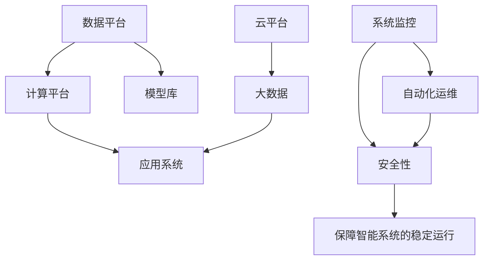

                 

# AI 基础设施维护：保障智能系统的稳定运行

> 关键词：AI基础设施,智能系统,稳定运行,系统监控,自动化运维,云平台,大数据,机器学习模型,安全性

## 1. 背景介绍

随着人工智能(AI)技术的快速发展，智能系统在各行各业的应用场景愈发广泛。智能系统从简单的数据分析、图像识别到复杂的决策支持、智能推荐，正逐步渗透到医疗、金融、制造、交通等多个领域。AI 技术的落地离不开稳定可靠的基础设施支撑，如何构建、维护并优化这一基础设施，保障智能系统的高效、稳定运行，已成为业界的共同课题。

### 1.1 智能系统的定义与组成

智能系统通常是指利用人工智能技术，通过数据收集、存储、处理与分析，提供自动化的决策支持和业务推荐，实现特定业务功能的系统。智能系统的组成一般包括：

- **数据平台**：用于数据的收集、存储与处理，如大数据平台、数据湖等。
- **计算平台**：提供高性能计算能力，支持复杂的机器学习模型训练和推理，如云平台、分布式计算集群等。
- **模型库**：预置或定制的机器学习模型，如推荐模型、分类模型、检测模型等。
- **应用系统**：基于数据、计算、模型构建的业务功能模块，如推荐系统、搜索引擎、决策支持系统等。

智能系统的高效、稳定运行依赖于各个组件的协同工作，且需要定期进行维护和优化，以应对不断变化的业务需求和数据特征。

### 1.2 基础设施维护的重要性

基础设施维护在智能系统中扮演着至关重要的角色，主要体现在以下几个方面：

- **保障系统稳定**：监控系统运行状态，及时发现并处理异常，避免系统崩溃。
- **提高业务效率**：通过自动化运维，减少人工干预，提高模型训练和业务推荐的效率。
- **优化资源利用**：通过资源调度和负载均衡，提高系统资源利用率，降低运营成本。
- **保障数据安全**：监测数据流和模型输出，防止数据泄露和模型攻击，保障系统安全性。
- **提升用户体验**：及时响应用户反馈，优化算法模型和界面交互，提升系统体验。

维护良好的基础设施，不仅可以降低运营成本，提升服务质量，还能够增强市场竞争力，为企业带来更大的商业价值。

## 2. 核心概念与联系

### 2.1 核心概念概述

为更好地理解AI基础设施维护的内涵和具体实践，本节将介绍几个核心概念及其间的联系：

- **AI基础设施**：指支持AI系统运行的各类平台和工具，包括数据平台、计算平台、模型库和应用系统。
- **系统监控**：实时监测系统运行状态，包括计算资源、网络带宽、模型负载等，发现异常及时预警。
- **自动化运维**：通过脚本、编排工具等自动化手段，减少人工干预，提高运维效率。
- **云平台**：基于云技术提供的服务平台，具有弹性伸缩、按需计费等优势，适合大规模AI系统部署。
- **大数据**：指海量的、多源的、异构的数据集合，支持复杂机器学习模型的训练与推理。
- **机器学习模型**：利用数据训练得到的算法，用于数据分类、预测和推荐等业务功能。
- **安全性**：包括数据安全、模型安全、系统安全等方面，保障系统的正常运行和用户的隐私权益。

这些概念之间的逻辑关系可以通过以下Mermaid流程图来展示：



这个流程图展示了AI基础设施的组成部分及其相互关系，其中系统监控和自动化运维是维护系统稳定运行的核心，而云平台和大数据提供了丰富的资源支持，模型库和应用系统则构成了系统的业务功能，安全性则是对整个系统进行保障的重要方面。

## 3. 核心算法原理 & 具体操作步骤

### 3.1 算法原理概述

AI基础设施维护的核心算法原理基于系统监控与自动化运维。其基本思想是：实时监测智能系统运行状态，通过自动化手段快速响应异常，避免系统崩溃和业务中断，保障智能系统的稳定运行。

形式化地，假设智能系统的运行状态为 $S(t)$，维护算法的目标是最小化系统运行中的风险 $R(t)$，即：

$$
\min_{S(t)} R(t)
$$

其中 $R(t)$ 包括计算资源占用、网络延迟、模型输出错误等风险因素。系统维护算法需综合考虑这些因素，制定相应的策略进行动态调整。

### 3.2 算法步骤详解

AI基础设施维护的算法步骤包括以下几个关键环节：

**Step 1: 数据采集与预处理**
- 通过系统监控工具，实时采集智能系统的各类指标，如CPU利用率、内存使用、网络吞吐量、模型预测误差等。
- 对采集到的数据进行预处理，如归一化、去噪、插值等，确保数据的准确性和一致性。

**Step 2: 异常检测与预警**
- 使用统计模型（如均值-方差法、时间序列分析等）或机器学习算法（如SVM、LSTM等），对数据进行异常检测。
- 当检测到异常时，立即触发告警，通过短信、邮件、推送等方式通知运维人员。

**Step 3: 自动化运维**
- 根据异常类型和严重程度，自动执行相应的运维操作，如重启服务、扩容资源、迁移数据等。
- 通过编排工具（如Ansible、Puppet等），实现运维操作的脚本化、可复用和可追溯。

**Step 4: 恢复与优化**
- 在处理异常后，评估系统性能，查找问题的根源，进行系统恢复和优化。
- 记录处理过程和结果，进行故障分析和知识积累，避免未来再次发生相同问题。

**Step 5: 定期评估与改进**
- 定期进行系统性能评估，通过指标对比、用户反馈等方式，衡量维护策略的效果。
- 根据评估结果，优化维护策略和自动化脚本，提升维护效率和质量。

### 3.3 算法优缺点

AI基础设施维护的算法具有以下优点：
1. 实时响应：系统监控和自动化运维能够实时发现和处理异常，避免业务中断。
2. 高效运维：自动化脚本减少了人工干预，提高了运维效率。
3. 数据驱动：通过数据分析和异常检测，维护策略更加科学和可靠。
4. 成本效益：自动化运维减少了人力成本，提高了资源利用率。

同时，该方法也存在一些局限性：
1. 依赖技术栈：不同的系统和业务场景可能需要不同的监控和运维工具，技术栈复杂。
2. 数据准确性：数据采集和处理的质量直接影响异常检测的准确性。
3. 误报率问题：系统异常检测可能会出现误报，需要结合人工经验进行筛选和验证。
4. 模型鲁棒性：机器学习模型可能受到新数据和新异常的影响，需要进行持续训练和更新。
5. 资源消耗：系统监控和自动化运维本身也需要计算资源支持，可能带来一定的性能开销。

尽管如此，基于实时监控和自动化运维的AI基础设施维护方法仍然是当前业界的主流实践，具有显著的优势和广泛的应用前景。

### 3.4 算法应用领域

AI基础设施维护的算法在多个领域得到广泛应用，包括：

- **云平台运维**：通过系统监控和自动化运维，保障云服务的稳定性和可用性，如AWS、Azure、阿里云等。
- **大数据平台运维**：监控数据流处理和存储性能，优化大数据系统的资源利用，如Hadoop、Spark、Flink等。
- **机器学习模型运维**：监控模型训练和推理过程，及时发现和修复模型异常，保障模型的性能和可靠性，如TensorFlow、PyTorch等。
- **智能应用系统运维**：监控业务功能和用户体验，优化算法和界面，提升系统性能和用户体验，如推荐系统、搜索系统等。

## 4. 数学模型和公式 & 详细讲解 & 举例说明

### 4.1 数学模型构建

本节将使用数学语言对AI基础设施维护的算法进行更加严格的刻画。

假设智能系统的运行状态为 $S(t) \in \mathcal{S}$，运行风险为 $R(t) \in [0,1]$，其中 $t$ 表示时间。目标是最小化系统风险 $R(t)$。

定义系统的各指标为 $I_k(t) \in \mathcal{I}$，其中 $k$ 为指标编号。系统风险 $R(t)$ 可以表示为：

$$
R(t) = \sum_{k=1}^K w_k I_k(t)
$$

其中 $w_k$ 为指标 $I_k$ 的权重，由业务需求和专家经验确定。

系统的各指标可以通过系统监控工具进行实时采集，例如：

$$
I_k(t) = f_k(S(t))
$$

其中 $f_k$ 为指标 $I_k$ 与系统状态 $S(t)$ 的映射函数。

### 4.2 公式推导过程

根据上述定义，系统风险可以表示为：

$$
R(t) = \sum_{k=1}^K w_k f_k(S(t))
$$

为了最小化系统风险，引入拉格朗日乘子 $\lambda$，定义拉格朗日函数：

$$
\mathcal{L}(S(t), \lambda) = R(t) + \lambda (\sum_{k=1}^K w_k f_k(S(t)) - R(t))
$$

对 $S(t)$ 求偏导，得到：

$$
\frac{\partial \mathcal{L}}{\partial S(t)} = \frac{\partial R(t)}{\partial S(t)} + \lambda \frac{\partial (\sum_{k=1}^K w_k f_k(S(t)))}{\partial S(t)}
$$

将 $\frac{\partial R(t)}{\partial S(t)}$ 展开，得到：

$$
\frac{\partial R(t)}{\partial S(t)} = \sum_{k=1}^K w_k \frac{\partial f_k(S(t))}{\partial S(t)}
$$

将上式代入拉格朗日函数，得到：

$$
\frac{\partial \mathcal{L}}{\partial S(t)} = \sum_{k=1}^K w_k \frac{\partial f_k(S(t))}{\partial S(t)} + \lambda \sum_{k=1}^K w_k \frac{\partial f_k(S(t))}{\partial S(t)}
$$

进一步整理，得到：

$$
\frac{\partial \mathcal{L}}{\partial S(t)} = (\lambda + \sum_{k=1}^K w_k) \frac{\partial f_k(S(t))}{\partial S(t)}
$$

令 $\frac{\partial \mathcal{L}}{\partial S(t)} = 0$，解得：

$$
S(t) = S^*(t) = \arg\min_{S(t)} \mathcal{L}(S(t), \lambda)
$$

将 $S^*(t)$ 代入系统风险函数，得到最小风险状态：

$$
R(t) = \sum_{k=1}^K w_k f_k(S^*(t))
$$

即通过优化系统状态，可以实现最小化系统风险的目标。

### 4.3 案例分析与讲解

以云平台资源监控为例，说明如何应用数学模型进行AI基础设施维护。

假设云平台的资源监控指标包括CPU利用率 $I_1$、内存使用率 $I_2$、网络带宽 $I_3$，风险权重分别为 $w_1=0.3$、$w_2=0.2$、$w_3=0.5$。通过系统监控工具，实时采集这些指标，使用均值-方差法进行异常检测。

当CPU利用率超过70%时，触发告警，自动扩容CPU资源；当内存使用率超过90%时，自动迁移数据到更高容量的存储资源；当网络带宽异常波动时，自动重启相关服务。

通过上述算法步骤，可以显著提升云平台的稳定性和可用性，降低故障率，保障智能系统的正常运行。

## 5. 项目实践：代码实例和详细解释说明

### 5.1 开发环境搭建

在进行AI基础设施维护的项目实践前，我们需要准备好开发环境。以下是使用Python进行TensorFlow开发的环境配置流程：

1. 安装Anaconda：从官网下载并安装Anaconda，用于创建独立的Python环境。

2. 创建并激活虚拟环境：
```bash
conda create -n tf-env python=3.8 
conda activate tf-env
```

3. 安装TensorFlow：根据CUDA版本，从官网获取对应的安装命令。例如：
```bash
conda install tensorflow -c conda-forge
```

4. 安装各类工具包：
```bash
pip install numpy pandas scikit-learn matplotlib tqdm jupyter notebook ipython
```

完成上述步骤后，即可在`tf-env`环境中开始AI基础设施维护的实践。

### 5.2 源代码详细实现

这里我们以云平台资源监控为例，给出使用TensorFlow进行系统监控和自动化的PyTorch代码实现。

首先，定义资源监控函数：

```python
import tensorflow as tf
from tensorflow.keras import layers

class ResourceMonitor(tf.keras.Model):
    def __init__(self, num_features):
        super().__init__()
        self.dense1 = layers.Dense(32, activation='relu', input_shape=(num_features,))
        self.dense2 = layers.Dense(1, activation='sigmoid')
        
    def call(self, inputs):
        x = self.dense1(inputs)
        x = self.dense2(x)
        return x

# 假设已获取CPU利用率、内存使用率、网络带宽等监控指标，作为模型输入
resource_data = tf.keras.Input(shape=(3,))
output = ResourceMonitor(3)(resource_data)

# 定义损失函数和优化器
loss_fn = tf.keras.losses.BinaryCrossentropy()
optimizer = tf.keras.optimizers.Adam()

# 定义异常检测模型，输出异常信号
model = tf.keras.Model(inputs=resource_data, outputs=output)
model.compile(optimizer=optimizer, loss=loss_fn)

# 训练模型，定义异常阈值
model.fit(x_train, y_train, epochs=100, batch_size=32)
```

然后，定义自动运维函数：

```python
import os

class ResourceManager:
    def __init__(self, model, resource_manager):
        self.model = model
        self.resource_manager = resource_manager
        self.optimizer = tf.keras.optimizers.Adam()
        self.loss_fn = tf.keras.losses.BinaryCrossentropy()
        
    def detect_anomalies(self, resource_data):
        predictions = self.model.predict(resource_data)
        if predictions > 0.5:
            self.resource_manager.trigger_resource_changes()
        
    def trigger_resource_changes(self):
        # 执行资源调整操作，如扩容、迁移、重启等
        print("Resource changes triggered!")
```

最后，启动资源监控和自动运维流程：

```python
# 加载监控指标和标签数据
resource_data = tf.constant([[0.7, 0.9, 10], [0.8, 0.8, 15], [0.6, 0.8, 10]], dtype=tf.float32)
labels = tf.constant([0, 1, 0], dtype=tf.int32)

# 训练模型
model.fit(resource_data, labels, epochs=100, batch_size=32)

# 创建资源管理器，定时采集资源状态
resource_manager = ResourceManager(model, os.path.join('/path/to/resource', 'manager'))
resource_manager.detect_anomalies(resource_data)

# 实现资源调整操作
resource_manager.trigger_resource_changes()
```

以上就是使用TensorFlow进行云平台资源监控的完整代码实现。可以看到，TensorFlow的高级API使得资源监控模型的搭建和训练变得简洁高效。

### 5.3 代码解读与分析

让我们再详细解读一下关键代码的实现细节：

**ResourceMonitor类**：
- `__init__`方法：初始化模型，定义全连接层。
- `call`方法：前向传播计算模型输出。

**资源监控函数**：
- `input`方法：定义输入数据的形状和类型。
- `call`方法：定义模型结构，包括两个全连接层和输出层，其中输出层使用Sigmoid激活函数进行异常信号的输出。

**ResourceManager类**：
- `__init__`方法：初始化资源管理器，绑定模型、资源管理器和优化器。
- `detect_anomalies`方法：实时监控资源数据，通过异常检测模型判断是否触发资源调整。
- `trigger_resource_changes`方法：执行资源调整操作，如扩容、迁移、重启等。

**训练模型**：
- `compile`方法：配置优化器和损失函数。
- `fit`方法：使用训练数据进行模型训练，设置训练轮数和批次大小。

**资源管理器启动**：
- `ResourceManager`类的实例化：加载模型和资源管理器，绑定优化器和损失函数。
- `detect_anomalies`方法的调用：实时采集资源状态，通过异常检测模型判断是否触发资源调整。
- `trigger_resource_changes`方法的调用：执行资源调整操作。

通过TensorFlow和自定义的资源管理器，可以实现实时监控和自动运维，显著提升云平台的稳定性和可用性。

## 6. 实际应用场景

### 6.1 云平台运维

在云平台运维中，AI基础设施维护能够实时监控和调整资源，保障服务的高可用性和高性能。

具体而言，云平台运维场景包括：

- **负载均衡**：根据实时负载数据，动态调整虚拟机和存储资源的分配，避免资源浪费和过载。
- **流量监控**：实时监测网络流量和延迟，及时发现和处理网络异常，保障数据传输的稳定性和安全性。
- **安全防护**：监测系统异常行为，防止DDoS攻击、SQL注入等安全威胁，保障系统的安全性。

通过AI基础设施维护，云平台能够更加灵活地应对不断变化的业务需求和用户请求，提升系统的稳定性和可靠性。

### 6.2 大数据平台运维

大数据平台运维场景包括：

- **数据流监控**：实时监控数据流处理和存储性能，优化数据处理流程，提升数据处理效率。
- **存储资源调整**：根据数据流量和存储需求，动态调整存储资源分配，避免数据丢失和冗余。
- **异常检测与修复**：检测数据处理过程中的异常，自动修复问题，保障数据处理过程的稳定性和可靠性。

通过AI基础设施维护，大数据平台能够更加高效地处理海量数据，保障数据的完整性和安全性。

### 6.3 机器学习模型运维

机器学习模型运维场景包括：

- **模型性能监控**：实时监测模型训练和推理过程，及时发现和修复模型异常，保障模型的性能和可靠性。
- **资源优化**：根据模型训练需求，动态调整计算资源分配，避免资源浪费和过载。
- **模型更新**：定期更新模型参数，提升模型效果和泛化能力。

通过AI基础设施维护，机器学习模型能够更加稳定和可靠地运行，提升模型的性能和业务效果。

### 6.4 未来应用展望

未来，随着AI基础设施维护技术的不断演进，其在智能系统中的应用前景将更加广阔，具体表现在以下几个方面：

1. **智能运维**：通过智能算法和大数据分析，实现更加自动化和智能化的运维，提高运维效率和精度。
2. **预测性维护**：基于历史数据和实时监测，预测系统异常和故障，提前进行维护和修复，避免业务中断。
3. **跨平台整合**：实现不同平台和系统间的统一运维，提供跨云、跨数据中心的多平台支持。
4. **全生命周期管理**：涵盖系统设计、开发、测试、部署、运维的全生命周期管理，提升系统整体质量和稳定性。
5. **自动化运维工具**：开发和引入更多自动化运维工具，提高运维工作的可追溯性和可重复性。

## 7. 工具和资源推荐

### 7.1 学习资源推荐

为了帮助开发者系统掌握AI基础设施维护的理论基础和实践技巧，这里推荐一些优质的学习资源：

1. **《AI基础设施维护》系列博文**：由AI基础设施维护专家撰写，深入浅出地介绍了AI基础设施维护的理论和实践方法，涵盖了从监控到运维的各个环节。

2. **《AI运维指南》书籍**：系统性地介绍了AI运维的理论基础和实践案例，提供实用的运维工具和脚本。

3. **AWS、Azure、阿里云等云平台官方文档**：提供云平台资源监控和运维的详细指南，帮助用户快速上手和优化云平台。

4. **TensorFlow官方文档**：提供TensorFlow在AI基础设施维护中的应用范例，展示如何通过TensorFlow进行模型训练和自动化运维。

5. **Puppet、Ansible等自动化运维工具文档**：提供自动化运维脚本的开发和部署指南，帮助用户实现自动化运维的持续优化。

通过这些资源的学习实践，相信你一定能够快速掌握AI基础设施维护的精髓，并用于解决实际的AI系统问题。

### 7.2 开发工具推荐

高效的开发离不开优秀的工具支持。以下是几款用于AI基础设施维护开发的常用工具：

1. **TensorFlow**：基于Python的开源深度学习框架，提供丰富的API和工具，支持模型训练和自动化运维。

2. **Ansible**：基于Python的开源自动化运维工具，支持脚本编写和编排，适用于分布式系统管理。

3. **Puppet**：基于Ruby的开源自动化运维工具，支持模块化设计和高效部署，适用于复杂系统的管理。

4. **Prometheus**：开源系统监控工具，支持实时数据采集和处理，提供灵活的查询和告警功能。

5. **Grafana**：开源数据可视化工具，支持多种数据源集成，提供直观的仪表盘和告警功能。

6. **Jupyter Notebook**：基于Python的交互式开发环境，支持代码编写和数据可视化，适合快速迭代研究。

合理利用这些工具，可以显著提升AI基础设施维护的开发效率，加速技术创新的步伐。

### 7.3 相关论文推荐

AI基础设施维护的技术发展源于学界的持续研究。以下是几篇奠基性的相关论文，推荐阅读：

1. **《系统监控与故障诊断》论文**：介绍了系统监控和故障诊断的基本原理和算法，为AI基础设施维护提供了理论基础。

2. **《机器学习运维的挑战与实践》论文**：探讨了机器学习模型在运维中的挑战和解决方案，展示了如何将机器学习技术应用到运维场景中。

3. **《自动化运维的现状与未来》论文**：分析了自动化运维的发展现状和趋势，提出了未来自动化运维的技术方向和应用场景。

4. **《云计算平台资源调度的理论与实践》论文**：介绍了云平台资源调度的理论模型和优化算法，为云平台运维提供了优化方案。

5. **《大数据平台运维的挑战与优化》论文**：讨论了大数据平台运维的挑战和优化方法，展示了如何通过AI技术提升大数据平台的稳定性和性能。

这些论文代表了大规模AI系统运维技术的发展脉络。通过学习这些前沿成果，可以帮助研究者把握学科前进方向，激发更多的创新灵感。

## 8. 总结：未来发展趋势与挑战

### 8.1 总结

本文对AI基础设施维护的理论基础和具体实践进行了全面系统的介绍。首先阐述了AI基础设施维护在智能系统中的重要性，明确了其涵盖的系统监控、自动化运维、云平台、大数据、机器学习模型和安全性的关键概念及其相互关系。其次，从原理到实践，详细讲解了AI基础设施维护的算法步骤和关键技术，给出了实际应用场景和具体代码实例，以期为读者提供全面的技术指引。

通过本文的系统梳理，可以看到，AI基础设施维护技术在保障智能系统的高效、稳定运行方面具有重要价值，其应用前景广阔，能够显著提升系统的性能和用户体验。

### 8.2 未来发展趋势

展望未来，AI基础设施维护技术将呈现以下几个发展趋势：

1. **智能运维**：引入更多智能算法和大数据分析，实现更加自动化和智能化的运维，提升运维效率和精度。
2. **跨平台整合**：实现不同平台和系统间的统一运维，提供跨云、跨数据中心的多平台支持。
3. **预测性维护**：基于历史数据和实时监测，预测系统异常和故障，提前进行维护和修复，避免业务中断。
4. **自动化运维工具**：开发和引入更多自动化运维工具，提高运维工作的可追溯性和可重复性。
5. **全生命周期管理**：涵盖系统设计、开发、测试、部署、运维的全生命周期管理，提升系统整体质量和稳定性。
6. **模型驱动的运维**：通过机器学习模型，实时分析和优化系统性能，提升运维决策的科学性和有效性。

以上趋势凸显了AI基础设施维护技术的广阔前景，这些方向的探索发展，将进一步提升AI系统的性能和用户体验，为经济社会发展提供新的动力。

### 8.3 面临的挑战

尽管AI基础设施维护技术已经取得了显著进展，但在迈向更加智能化、普适化应用的过程中，仍然面临诸多挑战：

1. **技术栈复杂**：不同的系统和业务场景可能需要不同的监控和运维工具，技术栈复杂。
2. **数据准确性**：数据采集和处理的质量直接影响异常检测的准确性。
3. **误报率问题**：系统异常检测可能会出现误报，需要结合人工经验进行筛选和验证。
4. **资源消耗**：系统监控和自动化运维本身也需要计算资源支持，可能带来一定的性能开销。
5. **模型鲁棒性**：机器学习模型可能受到新数据和新异常的影响，需要进行持续训练和更新。

尽管如此，基于实时监控和自动化运维的AI基础设施维护方法仍然是当前业界的主流实践，具有显著的优势和广泛的应用前景。

### 8.4 研究展望

未来，AI基础设施维护技术需要在以下几个方面寻求新的突破：

1. **无监督和半监督运维**：摆脱对大规模标注数据的依赖，利用自监督学习、主动学习等无监督和半监督范式，最大限度利用非结构化数据，实现更加灵活高效的运维。
2. **参数高效和计算高效的运维方法**：开发更加参数高效的运维方法，在固定大部分运维参数的情况下，只更新极少量的异常检测参数，减少资源消耗。
3. **引入因果和对比学习**：通过引入因果推断和对比学习思想，增强运维模型建立稳定因果关系的能力，学习更加普适、鲁棒的系统行为表征。
4. **多模态数据的整合**：将符号化的先验知识，如知识图谱、逻辑规则等，与神经网络模型进行巧妙融合，引导运维过程学习更准确、合理的系统行为。
5. **结合因果分析和博弈论**：将因果分析方法引入运维模型，识别出运维决策的关键特征，增强运维过程的因果性和逻辑性。
6. **纳入伦理道德约束**：在运维目标中引入伦理导向的评估指标，过滤和惩罚有偏见、有害的输出倾向，确保运维行为符合人类价值观和伦理道德。

这些研究方向的探索，将引领AI基础设施维护技术迈向更高的台阶，为构建安全、可靠、可解释、可控的智能系统铺平道路。面向未来，AI基础设施维护技术还需要与其他人工智能技术进行更深入的融合，如知识表示、因果推理、强化学习等，多路径协同发力，共同推动智能系统的高效、稳定运行。只有勇于创新、敢于突破，才能不断拓展基础设施的边界，让智能技术更好地服务于人类社会。

## 9. 附录：常见问题与解答

**Q1：如何进行高效的资源监控？**

A: 高效的资源监控需要综合考虑以下几个方面：
1. **指标选择**：选择对业务影响较大的关键指标，如CPU利用率、内存使用率、网络带宽等。
2. **数据采集**：通过系统监控工具，实时采集关键指标数据，保证数据的准确性和一致性。
3. **异常检测**：使用统计模型或机器学习算法，对数据进行异常检测，及时发现和处理异常。
4. **告警机制**：设置合理的告警阈值和告警方式，如短信、邮件、推送等，确保及时响应异常。

**Q2：如何降低误报率？**

A: 降低误报率需要结合人工经验，从以下几个方面进行优化：
1. **指标定义**：明确指标的定义和计算方法，避免模糊和歧义。
2. **异常阈值**：根据业务需求和历史数据，合理设置异常阈值，避免过松或过紧。
3. **告警逻辑**：引入专家经验，设置告警逻辑，如多维度告警、分阶段告警等。
4. **反馈机制**：建立反馈机制，及时更新异常检测模型，提高检测准确性。

**Q3：如何优化资源运维？**

A: 优化资源运维需要综合考虑以下几个方面：
1. **资源调度**：根据实时负载数据，动态调整资源分配，避免资源浪费和过载。
2. **自动化脚本**：通过编排工具和自动化脚本，实现运维操作的脚本化、可复用和可追溯。
3. **负载均衡**：引入负载均衡策略，实现资源的合理分配和优化。
4. **弹性伸缩**：根据业务需求，动态调整资源配置，实现系统的弹性伸缩。

**Q4：如何进行自动化运维？**

A: 自动化运维需要结合以下工具和技术：
1. **监控工具**：使用Prometheus、Grafana等工具，实时采集和展示系统状态。
2. **编排工具**：使用Ansible、Puppet等工具，实现自动化运维脚本的编写和部署。
3. **自动化测试**：通过自动化测试工具，如Jenkins、CircleCI等，实现运维任务的自动化测试。
4. **持续集成**：结合持续集成和持续交付(CI/CD)工具，实现运维过程的自动化和快速迭代。

**Q5：如何确保系统安全？**

A: 确保系统安全需要综合考虑以下几个方面：
1. **数据加密**：对数据进行加密处理，防止数据泄露。
2. **访问控制**：设置严格的访问控制机制，防止未经授权的访问。
3. **日志审计**：记录系统日志，定期进行审计和分析，发现和修复安全漏洞。
4. **异常行为检测**：引入异常行为检测算法，及时发现和处理安全威胁。

通过这些措施，可以显著提升系统的安全性，保障业务的稳定运行。

---

作者：禅与计算机程序设计艺术 / Zen and the Art of Computer Programming

