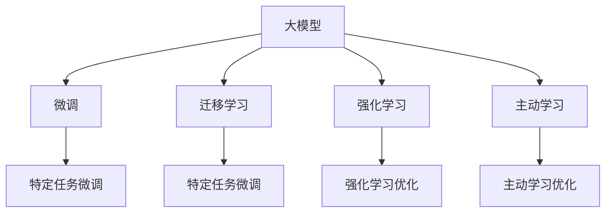

                 

## 1. 背景介绍

### 1.1 问题由来

近年来，人工智能(AI)大模型的应用场景不断扩展，从自然语言处理(NLP)、计算机视觉(CV)到推荐系统、智能推荐，各种技术如雨后春笋般涌现，为不同领域带来了显著的创新与进步。以大模型为基础的AI创业公司也在如火如荼地发展，如OpenAI、DeepMind、谷歌AI等巨头公司都在大模型研究上投入了大量的人力和财力，并且取得了显著的成果。然而，随着市场竞争的加剧，如何利用技术优势进行有效的创业也成为了很多AI创业者关注的问题。

### 1.2 问题核心关键点

大模型创业的核心在于如何充分利用大模型的技术优势，将其转化为商业价值。这包括但不限于以下几个关键点：

1. **技术领先**：选择最前沿的技术，如最新的深度学习框架、模型优化算法、大规模训练平台等。
2. **产品差异化**：开发具有独特价值的产品或服务，区别于竞争对手。
3. **商业模式**：设计合理的商业模式，将技术优势转化为稳定的收入流。
4. **用户体验**：确保产品具有良好的用户体验，易用性强，能够满足用户需求。
5. **市场推广**：通过有效的市场推广策略，将产品推向市场，吸引用户。

这些核心关键点，构成了AI大模型创业的技术框架，指导着创业者在技术、产品、市场等多个维度进行全面布局。

## 2. 核心概念与联系

### 2.1 核心概念概述

要理解AI大模型创业，首先需要明确一些核心概念：

- **大模型**：指基于深度学习模型，如Transformer架构，通过大量数据进行预训练，拥有巨大参数量和复杂结构的模型。如BERT、GPT-3、T5等。
- **微调(Fine-Tuning)**：在大模型上添加特定任务的前向神经网络层，并利用少量有标签数据进行训练，优化模型在该任务上的性能。
- **迁移学习(Transfer Learning)**：通过在大模型上进行特定任务微调，将预训练知识迁移到新任务上，减少从头开始训练的资源需求。
- **强化学习(Reinforcement Learning)**：通过奖励机制指导模型学习，使其在特定任务上逐渐优化。
- **主动学习(Active Learning)**：通过模型反馈，指导人工选择有意义的样本进行标注，减少标注成本。

这些概念之间的关系可以用以下Mermaid流程图来展示：



这些概念构成了AI大模型创业的技术基石，通过灵活运用这些技术，可以实现多样化的应用场景和商业目标。

## 3. 核心算法原理 & 具体操作步骤

### 3.1 算法原理概述

AI大模型创业的核心算法原理主要涉及深度学习和机器学习中的各种模型和算法。大模型作为深度学习中的关键技术，具有以下特点：

1. **参数量大**：大模型通常具有数亿甚至数十亿的参数，需要强大的计算资源支持。
2. **泛化能力强**：通过在大规模数据集上进行预训练，大模型具备良好的泛化能力，可以处理多种不同类型的任务。
3. **计算密集**：大模型的训练和推理过程需要大量的计算资源和时间。

基于大模型的创业公司，通常会在现有技术的基础上进行二次开发和优化，以提升模型的性能和应用效率，同时降低成本。

### 3.2 算法步骤详解

基于大模型的创业公司，其算法开发和优化的步骤如下：

1. **选择合适的预训练模型**：选择与创业公司业务领域相关的预训练模型，如BERT用于NLP、ResNet用于CV等。
2. **添加任务适配层**：根据具体任务的需求，添加特定的输出层和损失函数。
3. **设计优化算法**：选择合适的优化算法，如Adam、SGD等，并设置适当的超参数。
4. **数据增强**：通过数据增强技术，如旋转、裁剪、翻转等，扩充数据集，提高模型的泛化能力。
5. **模型微调**：在标注数据集上对模型进行微调，提升其在特定任务上的性能。
6. **性能评估**：通过验证集和测试集对模型进行性能评估，并根据评估结果进行必要的调整。
7. **部署上线**：将优化后的模型部署到线上，并集成到实际应用中。

### 3.3 算法优缺点

大模型创业的优势在于其强大的技术基础和广泛的应用前景，但也存在一些缺点：

**优点**：

1. **技术先进**：大模型基于最新的深度学习算法和理论，具备领先的技术优势。
2. **应用广泛**：可以应用于多种类型的任务，如NLP、CV、推荐系统等。
3. **效率高**：通过微调和优化，可以快速提升模型性能。

**缺点**：

1. **资源消耗大**：大模型的训练和推理需要大量的计算资源和时间，成本较高。
2. **数据依赖性高**：模型性能高度依赖于标注数据的质量和数量，获取高质量数据成本较高。
3. **可解释性差**：大模型通常是"黑盒"模型，难以解释其内部决策过程。
4. **偏见问题**：大模型可能学习到数据中的偏见，导致输出结果存在偏差。

## 4. 数学模型和公式 & 详细讲解

### 4.1 数学模型构建

数学模型是AI大模型创业的基础，以下是一些常见的数学模型：

1. **线性回归模型**：
   $$
   y = \beta_0 + \beta_1x_1 + \beta_2x_2 + \ldots + \beta_nx_n
   $$
   其中，$\beta_0, \beta_1, \ldots, \beta_n$ 为模型参数，$x_1, x_2, \ldots, x_n$ 为输入特征，$y$ 为输出。

2. **深度神经网络模型**：
   $$
   \hat{y} = \sigma(W^T\vec{x} + b)
   $$
   其中，$W$ 为权重矩阵，$b$ 为偏置向量，$\vec{x}$ 为输入，$\sigma$ 为激活函数。

3. **softmax回归模型**：
   $$
   P(y|x) = \frac{e^{W^T\vec{x} + b}}{\sum_{i=1}^K e^{W_i^T\vec{x} + b_i}}
   $$
   其中，$W$ 和 $b$ 分别为权重矩阵和偏置向量，$K$ 为输出类别数。

### 4.2 公式推导过程

深度神经网络的反向传播算法是一个重要的推导过程，用于更新模型参数。其步骤如下：

1. 前向传播：计算模型输出 $\hat{y}$。
   $$
   a_0 = x
   $$
   $$
   a_l = \sigma(W_l^T a_{l-1} + b_l), \quad l=1,\ldots,L
   $$
   $$
   \hat{y} = a_L
   $$

2. 计算损失函数 $J$。
   $$
   J = \frac{1}{2m} \sum_{i=1}^m (\hat{y}^{(i)} - y^{(i)})^2
   $$

3. 反向传播：计算梯度 $\nabla J$。
   $$
   \delta_L = (\hat{y} - y) \cdot \sigma'(a_L) \cdot \frac{\partial J}{\partial \hat{y}}
   $$
   $$
   \delta_l = (\sigma(W_l) \delta_{l+1}) \cdot \sigma'(a_l) \cdot \frac{\partial J}{\partial a_l}
   $$

4. 更新参数。
   $$
   W_l \leftarrow W_l - \eta \frac{\partial J}{\partial W_l}
   $$
   $$
   b_l \leftarrow b_l - \eta \frac{\partial J}{\partial b_l}
   $$

### 4.3 案例分析与讲解

以图像分类为例，假设有一组训练数据 $(x_i, y_i)$，其中 $x_i$ 为输入图像，$y_i$ 为对应的标签。

1. **数据准备**：
   $$
   x = [x_{i_1}, x_{i_2}, \ldots, x_{i_m}]
   $$
   $$
   y = [y_1, y_2, \ldots, y_m]
   $$

2. **模型初始化**：
   $$
   W_0 = 0
   $$
   $$
   b_0 = 0
   $$

3. **前向传播**：
   $$
   a_0 = x
   $$
   $$
   a_1 = \sigma(W_1^T a_0 + b_1)
   $$
   $$
   \ldots
   $$
   $$
   a_L = \sigma(W_L^T a_{L-1} + b_L)
   $$

4. **计算损失函数**：
   $$
   J = \frac{1}{2m} \sum_{i=1}^m (\hat{y}^{(i)} - y^{(i)})^2
   $$

5. **反向传播**：
   $$
   \delta_L = (\hat{y} - y) \cdot \sigma'(a_L) \cdot \frac{\partial J}{\partial \hat{y}}
   $$
   $$
   \delta_{L-1} = (\sigma(W_{L-1}) \delta_L) \cdot \sigma'(a_{L-1}) \cdot \frac{\partial J}{\partial a_{L-1}}
   $$
   $$
   \ldots
   $$
   $$
   \delta_1 = (\sigma(W_1) \delta_2) \cdot \sigma'(a_1) \cdot \frac{\partial J}{\partial a_1}
   $$

6. **更新参数**：
   $$
   W_l \leftarrow W_l - \eta \frac{\partial J}{\partial W_l}
   $$
   $$
   b_l \leftarrow b_l - \eta \frac{\partial J}{\partial b_l}
   $$

通过这样的数学推导，可以看出深度神经网络模型的训练过程是一个迭代更新的过程，不断调整模型参数，使模型预测结果与真实结果尽可能接近。

## 5. 项目实践：代码实例和详细解释说明

### 5.1 开发环境搭建

基于大模型的创业公司通常需要搭建高性能的计算环境和数据存储环境。以下是开发环境的搭建步骤：

1. **选择合适的硬件资源**：选择高性能GPU或TPU，如NVIDIA Tesla、Google Cloud TPU等。
2. **安装深度学习框架**：安装TensorFlow、PyTorch等深度学习框架，并配置好环境变量。
3. **搭建数据存储系统**：搭建高效的分布式文件系统，如Hadoop、Spark等，用于存储大规模数据。
4. **部署模型服务器**：部署高性能的服务器，并集成监控系统，确保服务器稳定运行。

### 5.2 源代码详细实现

以下是使用PyTorch实现图像分类任务的程序代码：

```python
import torch
import torch.nn as nn
import torch.optim as optim
import torchvision.transforms as transforms
import torchvision.datasets as datasets

# 定义模型
class Net(nn.Module):
    def __init__(self):
        super(Net, self).__init__()
        self.conv1 = nn.Conv2d(3, 6, 5)
        self.pool = nn.MaxPool2d(2, 2)
        self.conv2 = nn.Conv2d(6, 16, 5)
        self.fc1 = nn.Linear(16 * 5 * 5, 120)
        self.fc2 = nn.Linear(120, 84)
        self.fc3 = nn.Linear(84, 10)

    def forward(self, x):
        x = self.pool(F.relu(self.conv1(x)))
        x = self.pool(F.relu(self.conv2(x)))
        x = x.view(-1, 16 * 5 * 5)
        x = F.relu(self.fc1(x))
        x = F.relu(self.fc2(x))
        x = self.fc3(x)
        return x

# 定义训练函数
def train(net, data_loader, optimizer, criterion, epochs):
    for epoch in range(epochs):
        running_loss = 0.0
        for i, data in enumerate(data_loader, 0):
            inputs, labels = data
            optimizer.zero_grad()
            outputs = net(inputs)
            loss = criterion(outputs, labels)
            loss.backward()
            optimizer.step()

            running_loss += loss.item()
            if i % 100 == 99:
                print('[%d, %5d] loss: %.3f' %
                      (epoch + 1, i + 1, running_loss / 100))
                running_loss = 0.0

# 数据预处理
transform = transforms.Compose([
    transforms.ToTensor(),
    transforms.Normalize((0.5, 0.5, 0.5), (0.5, 0.5, 0.5))
])

train_dataset = datasets.CIFAR10(root='./data', train=True,
                                download=True, transform=transform)
train_loader = torch.utils.data.DataLoader(train_dataset, batch_size=4,
                                          shuffle=True, num_workers=2)

# 模型初始化
net = Net()
criterion = nn.CrossEntropyLoss()
optimizer = optim.SGD(net.parameters(), lr=0.001, momentum=0.9)

# 训练模型
train(net, train_loader, optimizer, criterion, epochs=2)
```

### 5.3 代码解读与分析

1. **定义模型**：
   - `class Net(nn.Module)`: 定义神经网络模型。
   - `self.conv1 = nn.Conv2d(3, 6, 5)`: 第一层卷积层，输入3个通道，输出6个通道，卷积核大小为5。
   - `self.pool = nn.MaxPool2d(2, 2)`: 最大池化层，池化窗口大小为2。
   - `self.fc1 = nn.Linear(16 * 5 * 5, 120)`: 全连接层，输入大小为16 * 5 * 5，输出120个节点。
   - `self.fc2 = nn.Linear(120, 84)`: 全连接层，输入120个节点，输出84个节点。
   - `self.fc3 = nn.Linear(84, 10)`: 全连接层，输入84个节点，输出10个节点。

2. **定义训练函数**：
   - `train(net, data_loader, optimizer, criterion, epochs)`: 定义训练函数，循环训练模型。
   - `optimizer.zero_grad()`: 梯度清零。
   - `outputs = net(inputs)`: 前向传播，计算模型输出。
   - `loss = criterion(outputs, labels)`: 计算损失。
   - `loss.backward()`: 反向传播，计算梯度。
   - `optimizer.step()`: 更新参数。

3. **数据预处理**：
   - `transform = transforms.Compose([transforms.ToTensor(), transforms.Normalize((0.5, 0.5, 0.5), (0.5, 0.5, 0.5))]`: 数据预处理，将图像转化为张量，并进行标准化。

4. **训练模型**：
   - `train(net, train_loader, optimizer, criterion, epochs=2)`: 训练模型，使用SGD优化器，交叉熵损失函数，共训练2个epoch。

## 6. 实际应用场景

### 6.1 智能推荐系统

AI大模型可以用于智能推荐系统的开发，通过深度学习模型预测用户行为，为用户推荐个性化产品或服务。例如，基于深度学习算法的协同过滤和基于内容的推荐算法，可以将用户的历史行为与产品特征进行匹配，从而精准推荐用户感兴趣的商品。

### 6.2 语音识别

AI大模型还可以用于语音识别领域，通过深度学习模型进行语音转文本的识别。例如，使用声学模型和语言模型进行联合训练，可以提高语音识别的准确率，并支持多种语言的识别。

### 6.3 自然语言处理(NLP)

NLP是AI大模型的重要应用领域，可以用于文本分类、情感分析、机器翻译、问答系统等任务。例如，使用BERT、GPT等模型进行文本分类，可以自动对文本进行情感、主题、意图等分类。使用机器翻译模型，可以自动将不同语言的文本进行翻译。

## 7. 工具和资源推荐

### 7.1 学习资源推荐

为了帮助开发者快速掌握AI大模型的应用，以下是一些推荐的资源：

1. **在线课程**：如Coursera、Udacity、edX等平台上的深度学习课程。
2. **书籍**：如《深度学习》、《Python深度学习》等书籍。
3. **社区**：如Stack Overflow、GitHub等社区，可以获取最新的技术动态和代码实现。
4. **博客**：如Towards Data Science、Medium等博客平台，可以获取深度学习领域的最新研究成果。

### 7.2 开发工具推荐

以下是一些推荐的开发工具：

1. **深度学习框架**：如TensorFlow、PyTorch等，支持深度学习模型的开发和训练。
2. **分布式计算框架**：如Apache Spark、Hadoop等，支持大规模数据处理和分布式计算。
3. **可视化工具**：如TensorBoard、Weights & Biases等，支持模型的可视化分析和调试。

### 7.3 相关论文推荐

以下是一些推荐的论文：

1. **深度学习中的优化算法**：如Adam、SGD等优化算法的相关论文。
2. **深度学习中的神经网络模型**：如CNN、RNN、LSTM等神经网络模型的相关论文。
3. **深度学习中的数据增强**：如数据增强技术的相关论文。

## 8. 总结：未来发展趋势与挑战

### 8.1 研究成果总结

AI大模型创业的技术优势在于其强大的数据处理能力和泛化能力，能够处理复杂的数据结构和多种类型的数据。通过深度学习模型的微调，可以在特定任务上取得显著的性能提升，应用场景广泛，前景广阔。

### 8.2 未来发展趋势

未来的AI大模型创业将呈现以下几个发展趋势：

1. **更高效的模型结构**：未来的模型将更加高效，能够在较小的计算资源上获得更好的性能。
2. **更丰富的数据应用**：数据应用将更加多样化，可以应用于更多的场景和领域。
3. **更智能的决策系统**：决策系统将更加智能，能够根据用户的行为和数据进行实时调整。
4. **更强的安全保障**：系统将具备更强的安全保障能力，能够防止恶意攻击和数据泄露。
5. **更灵活的模型部署**：模型将更加灵活，能够适应多种设备和环境。

### 8.3 面临的挑战

AI大模型创业也面临着一些挑战：

1. **数据获取难度大**：获取高质量标注数据和有效数据难度大，成本高。
2. **模型复杂度大**：模型结构复杂，训练和优化难度大。
3. **计算资源消耗大**：计算资源消耗大，成本高。
4. **算法复杂度大**：算法复杂度大，需要深厚的理论基础。
5. **应用场景多样化**：应用场景多样化，需要针对不同的场景进行优化。

### 8.4 研究展望

未来的研究需要在以下几个方面进行突破：

1. **更高效的模型优化**：研究更高效的模型优化算法，提高模型的训练和推理效率。
2. **更智能的决策系统**：研究更智能的决策系统，提高系统的智能水平。
3. **更灵活的模型部署**：研究更灵活的模型部署方法，适应多种设备和环境。
4. **更安全的数据保护**：研究更安全的数据保护方法，确保数据安全。
5. **更广泛的应用场景**：研究更广泛的应用场景，拓展AI大模型的应用边界。

## 9. 附录：常见问题与解答

### Q1: AI大模型创业的商业模式有哪些？

A: AI大模型创业的商业模式有多种，如直接销售API接口、提供SaaS平台、开发专用硬件设备等。

### Q2: AI大模型创业的难点是什么？

A: AI大模型创业的难点在于数据获取、模型训练、市场推广等方面。需要投入大量资源进行技术研发和市场推广，且面临激烈的竞争。

### Q3: AI大模型创业的资源需求有哪些？

A: AI大模型创业需要高性能计算资源、优质数据、优秀人才等资源，需要投入大量的时间和金钱。

### Q4: AI大模型创业的长期发展方向是什么？

A: AI大模型创业的长期发展方向是构建具有核心技术竞争力、灵活的市场反应机制、稳定的商业收入模式等，以实现可持续的发展。

---

作者：禅与计算机程序设计艺术 / Zen and the Art of Computer Programming

