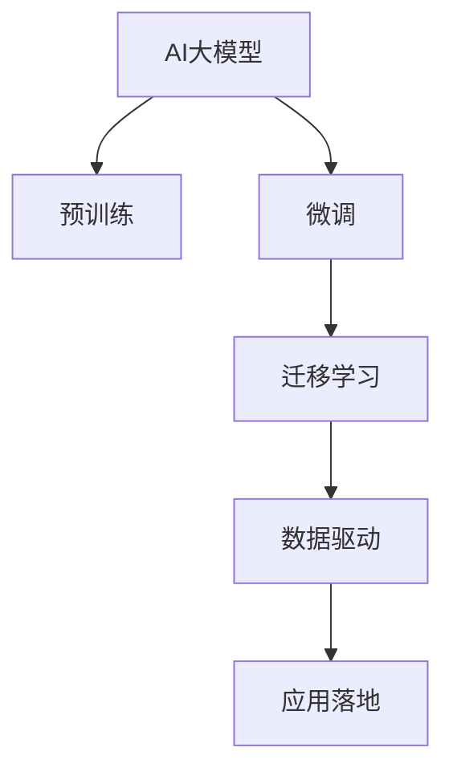

                 

# AI 大模型创业：如何利用未来优势？

> 关键词：大模型创业、AI技术、未来优势、机会识别、应用落地、模型优化、算法优化、数据驱动、市场竞争、投资回报、持续创新、技术迭代

## 1. 背景介绍

随着人工智能技术的快速发展，AI大模型已经在多个领域展现出了强大的潜力和应用前景。无论是语音识别、图像识别，还是自然语言处理(NLP)、机器翻译，大模型都显示出卓越的性能和广泛的应用能力。因此，创业公司在利用AI大模型时，如何把握未来的优势，进行市场细分和应用落地，成为了一个关键问题。

### 1.1 问题由来

AI大模型的出现，为创业公司提供了丰富的资源和广阔的发展空间。然而，如何高效利用这些资源，将技术优势转化为市场竞争力，是许多创业者面临的挑战。此外，大模型的训练、优化和应用过程中，也存在诸多技术和业务难题。如何在众多竞争对手中脱颖而出，如何有效管理投资回报，这些都是需要深入探讨的问题。

### 1.2 问题核心关键点

AI大模型创业的核心关键点包括：

- **市场细分**：确定目标应用领域，识别市场需求和潜力。
- **技术优势**：提升大模型的性能和优化，提高模型效率和实用性。
- **应用落地**：将大模型技术转化为实际业务应用，满足用户需求。
- **投资回报**：高效管理资金，最大化投资回报率。
- **持续创新**：不断迭代模型和技术，保持竞争优势。

## 2. 核心概念与联系

### 2.1 核心概念概述

为更好地理解AI大模型创业的实践，本节将介绍几个密切相关的核心概念：

- **AI大模型**：基于深度学习技术，具有大规模参数量、强大的数据表示能力和泛化能力的模型。常见的有BERT、GPT、DALL·E等。
- **预训练**：在大规模无标签数据上训练模型，学习通用的数据表示，增强模型的泛化能力。
- **微调**：在预训练模型的基础上，使用小规模有标签数据进行进一步训练，优化模型在特定任务上的性能。
- **迁移学习**：将一个领域学到的知识应用到另一个领域，提升模型的跨领域迁移能力。
- **数据驱动**：基于数据的模型训练和优化，保证模型性能的稳定性和可靠性。
- **应用落地**：将模型转化为实际业务应用，解决实际问题，实现商业价值。

这些核心概念之间的逻辑关系可以通过以下Mermaid流程图来展示：



这个流程图展示了AI大模型从训练到应用的主要流程：

1. 大模型通过预训练获得基础能力。
2. 通过微调优化模型，针对特定任务进行调整。
3. 迁移学习使得模型具备跨领域应用能力。
4. 数据驱动保障模型性能稳定。
5. 应用落地实现商业价值。

## 3. 核心算法原理 & 具体操作步骤
### 3.1 算法原理概述

AI大模型创业的核心算法原理是：在预训练的基础上，通过微调、迁移学习和数据驱动等技术，构建适应目标应用场景的AI模型，并通过应用落地实现商业价值。这一过程可以分为以下几个关键步骤：

1. **预训练**：在大规模无标签数据上训练大模型，学习通用的数据表示能力。
2. **微调**：在预训练模型的基础上，使用小规模有标签数据进行进一步训练，优化模型在特定任务上的性能。
3. **迁移学习**：将一个领域学到的知识应用到另一个领域，提升模型的跨领域迁移能力。
4. **数据驱动**：通过实时数据反馈，持续优化模型性能，提升应用效果。

### 3.2 算法步骤详解

AI大模型创业的算法步骤主要包括：

1. **数据收集与准备**：收集目标应用领域的数据，并进行清洗、标注和划分。
2. **模型选择与构建**：选择适合应用场景的大模型，并进行必要的调整和构建。
3. **微调与优化**：使用小规模有标签数据进行微调，优化模型性能。
4. **迁移学习与融合**：将模型应用于其他领域，提升跨领域迁移能力。
5. **数据驱动与迭代**：实时收集数据反馈，持续优化模型性能。

### 3.3 算法优缺点

AI大模型创业的算法优点包括：

- **高效性**：使用预训练和迁移学习技术，可以快速构建高性能模型。
- **普适性**：大模型具备较强的泛化能力，适用于多种应用场景。
- **灵活性**：通过微调，可以针对特定任务进行调整，提高应用效果。

然而，这一过程也存在一些缺点：

- **数据依赖**：微调和迁移学习需要大量的有标签数据，数据获取成本较高。
- **计算资源需求高**：预训练和微调需要大量计算资源，成本较高。
- **性能波动**：模型性能可能受数据质量、训练策略等因素影响，存在波动。

### 3.4 算法应用领域

AI大模型创业的算法广泛应用于以下领域：

- **自然语言处理(NLP)**：语音识别、机器翻译、情感分析、文本摘要等。
- **计算机视觉**：图像识别、视频分析、自动驾驶等。
- **医疗健康**：疾病诊断、基因分析、影像分析等。
- **金融服务**：风险评估、交易预测、欺诈检测等。
- **智能制造**：质量检测、设备维护、生产优化等。

## 4. 数学模型和公式 & 详细讲解 & 举例说明

### 4.1 数学模型构建

AI大模型的数学模型构建包括以下关键步骤：

1. **数据准备**：将数据集分为训练集、验证集和测试集。
2. **模型选择**：选择合适的预训练模型，如BERT、GPT等。
3. **模型微调**：在预训练模型的基础上，使用小规模有标签数据进行微调。

### 4.2 公式推导过程

假设预训练模型为 $M_{\theta}$，在任务 $T$ 上有标签数据集 $D=\{(x_i,y_i)\}_{i=1}^N$。则微调的目标是找到最优参数 $\theta^*$，使得：

$$
\theta^* = \mathop{\arg\min}_{\theta} \mathcal{L}(M_{\theta},D)
$$

其中 $\mathcal{L}$ 为针对任务 $T$ 设计的损失函数，用于衡量模型预测输出与真实标签之间的差异。常见的损失函数包括交叉熵损失、均方误差损失等。

### 4.3 案例分析与讲解

以情感分析任务为例，假设模型在输入文本 $x_i$ 上的输出为 $\hat{y}=M_{\theta}(x_i)$，真实标签 $y_i \in \{1,0\}$。则二分类交叉熵损失函数定义为：

$$
\ell(M_{\theta}(x_i),y_i) = -[y_i\log \hat{y}_i + (1-y_i)\log (1-\hat{y}_i)]
$$

将其代入经验风险公式，得：

$$
\mathcal{L}(\theta) = -\frac{1}{N}\sum_{i=1}^N [y_i\log M_{\theta}(x_i)+(1-y_i)\log(1-M_{\theta}(x_i))]
$$

通过反向传播算法计算损失函数对参数 $\theta$ 的梯度，然后使用梯度下降等优化算法更新模型参数。重复上述步骤直至收敛，最终得到适应下游任务的最优模型参数 $\theta^*$。

## 5. 项目实践：代码实例和详细解释说明
### 5.1 开发环境搭建

在进行AI大模型创业的实践中，首先需要准备开发环境。以下是使用Python进行TensorFlow开发的环境配置流程：

1. 安装Anaconda：从官网下载并安装Anaconda，用于创建独立的Python环境。

2. 创建并激活虚拟环境：
```bash
conda create -n tf-env python=3.8 
conda activate tf-env
```

3. 安装TensorFlow：根据CUDA版本，从官网获取对应的安装命令。例如：
```bash
conda install tensorflow==2.6.0
```

4. 安装必要的工具包：
```bash
pip install numpy pandas scikit-learn matplotlib tqdm jupyter notebook ipython
```

完成上述步骤后，即可在`tf-env`环境中开始AI大模型创业的实践。

### 5.2 源代码详细实现

下面以情感分析任务为例，给出使用TensorFlow对BERT模型进行微调的代码实现。

首先，定义数据处理函数：

```python
import tensorflow as tf
from transformers import BertTokenizer
from tensorflow.keras.preprocessing.sequence import pad_sequences

tokenizer = BertTokenizer.from_pretrained('bert-base-cased')

def preprocess(text):
    tokens = tokenizer.tokenize(text)
    tokens = [token.lower() for token in tokens if token.isalnum()]
    tokens = tokenizer.convert_tokens_to_ids(tokens)
    input_ids = tokenizer.build_input_ids_from_tokens(tokens)
    attention_mask = [1] * len(input_ids)
    return input_ids, attention_mask
```

然后，定义模型和优化器：

```python
from transformers import TFBertForSequenceClassification

model = TFBertForSequenceClassification.from_pretrained('bert-base-cased', num_labels=2)

optimizer = tf.keras.optimizers.AdamW(learning_rate=2e-5)
```

接着，定义训练和评估函数：

```python
def train_step(model, input_ids, attention_mask, labels):
    with tf.GradientTape() as tape:
        outputs = model(input_ids, attention_mask=attention_mask, labels=labels)
        loss = tf.keras.losses.binary_crossentropy(labels, outputs.logits)
    gradients = tape.gradient(loss, model.trainable_variables)
    optimizer.apply_gradients(zip(gradients, model.trainable_variables))
    return loss

def evaluate(model, input_ids, attention_mask, labels):
    outputs = model(input_ids, attention_mask=attention_mask)
    loss = tf.keras.losses.binary_crossentropy(labels, outputs.logits)
    return loss
```

最后，启动训练流程并在测试集上评估：

```python
epochs = 5
batch_size = 16

for epoch in range(epochs):
    for input_ids, attention_mask, labels in train_dataset:
        loss = train_step(model, input_ids, attention_mask, labels)
        print(f'Epoch {epoch+1}, training loss: {loss.numpy():.4f}')

    dev_loss = evaluate(model, input_ids, attention_mask, labels)
    print(f'Epoch {epoch+1}, dev loss: {dev_loss.numpy():.4f}')
    
test_loss = evaluate(model, test_input_ids, test_attention_mask, test_labels)
print(f'Test loss: {test_loss.numpy():.4f}')
```

以上就是使用TensorFlow对BERT进行情感分析任务微调的完整代码实现。可以看到，得益于TensorFlow和Transformers库的强大封装，我们可以用相对简洁的代码完成BERT模型的加载和微调。

### 5.3 代码解读与分析

让我们再详细解读一下关键代码的实现细节：

**preprocess函数**：
- `tokenize`方法：将文本分词。
- `lower`方法：将分词结果转换为小写。
- `convert_tokens_to_ids`方法：将分词结果转换为模型能够接受的id格式。
- `build_input_ids_from_tokens`方法：将id列表转换为模型需要的输入格式。

**model选择与构建**：
- `TFBertForSequenceClassification`类：用于构建序列分类模型，接收预训练模型作为初始化参数。

**optimizer选择**：
- `AdamW`优化器：适用于大规模深度学习模型，具有较快的收敛速度和较好的稳定性。

**train_step函数**：
- 使用`tf.GradientTape`记录梯度，并使用`apply_gradients`更新模型参数。

**evaluate函数**：
- 计算模型在验证集和测试集上的损失，评估模型性能。

**训练流程**：
- 定义总迭代次数和批次大小，开始循环迭代。
- 每个epoch内，在训练集上训练，输出损失。
- 在验证集上评估，输出损失。
- 所有epoch结束后，在测试集上评估，给出最终测试结果。

## 6. 实际应用场景
### 6.1 智能客服系统

AI大模型在智能客服系统中的应用非常广泛。传统客服系统往往需要大量人力，高峰期响应速度慢，且一致性和专业性难以保证。而使用大模型微调的对话技术，可以7x24小时不间断服务，快速响应客户咨询，用自然流畅的语言解答各类常见问题。

在技术实现上，可以收集企业内部的历史客服对话记录，将问题和最佳答复构建成监督数据，在此基础上对预训练对话模型进行微调。微调后的对话模型能够自动理解用户意图，匹配最合适的答案模板进行回复。对于客户提出的新问题，还可以接入检索系统实时搜索相关内容，动态组织生成回答。如此构建的智能客服系统，能大幅提升客户咨询体验和问题解决效率。

### 6.2 金融舆情监测

金融机构需要实时监测市场舆论动向，以便及时应对负面信息传播，规避金融风险。传统的人工监测方式成本高、效率低，难以应对网络时代海量信息爆发的挑战。基于大语言模型微调的文本分类和情感分析技术，为金融舆情监测提供了新的解决方案。

具体而言，可以收集金融领域相关的新闻、报道、评论等文本数据，并对其进行主题标注和情感标注。在此基础上对预训练语言模型进行微调，使其能够自动判断文本属于何种主题，情感倾向是正面、中性还是负面。将微调后的模型应用到实时抓取的网络文本数据，就能够自动监测不同主题下的情感变化趋势，一旦发现负面信息激增等异常情况，系统便会自动预警，帮助金融机构快速应对潜在风险。

### 6.3 个性化推荐系统

当前的推荐系统往往只依赖用户的历史行为数据进行物品推荐，无法深入理解用户的真实兴趣偏好。基于大语言模型微调技术，个性化推荐系统可以更好地挖掘用户行为背后的语义信息，从而提供更精准、多样的推荐内容。

在实践中，可以收集用户浏览、点击、评论、分享等行为数据，提取和用户交互的物品标题、描述、标签等文本内容。将文本内容作为模型输入，用户的后续行为（如是否点击、购买等）作为监督信号，在此基础上微调预训练语言模型。微调后的模型能够从文本内容中准确把握用户的兴趣点。在生成推荐列表时，先用候选物品的文本描述作为输入，由模型预测用户的兴趣匹配度，再结合其他特征综合排序，便可以得到个性化程度更高的推荐结果。

### 6.4 未来应用展望

随着大语言模型和微调方法的不断发展，基于微调范式将在更多领域得到应用，为传统行业带来变革性影响。

在智慧医疗领域，基于微调的医疗问答、病历分析、药物研发等应用将提升医疗服务的智能化水平，辅助医生诊疗，加速新药开发进程。

在智能教育领域，微调技术可应用于作业批改、学情分析、知识推荐等方面，因材施教，促进教育公平，提高教学质量。

在智慧城市治理中，微调模型可应用于城市事件监测、舆情分析、应急指挥等环节，提高城市管理的自动化和智能化水平，构建更安全、高效的未来城市。

此外，在企业生产、社会治理、文娱传媒等众多领域，基于大模型微调的人工智能应用也将不断涌现，为经济社会发展注入新的动力。相信随着技术的日益成熟，微调方法将成为人工智能落地应用的重要范式，推动人工智能技术向更广阔的领域加速渗透。

## 7. 工具和资源推荐
### 7.1 学习资源推荐

为了帮助开发者系统掌握AI大模型创业的理论基础和实践技巧，这里推荐一些优质的学习资源：

1. **TensorFlow官方文档**：提供了全面的TensorFlow API介绍和代码示例，帮助开发者快速上手。
2. **Transformers库文档**：提供了丰富的预训练模型和微调样例代码，是进行NLP任务开发的利器。
3. **自然语言处理课程**：如斯坦福大学开设的CS224N《深度学习自然语言处理》课程，带你深入了解NLP的基本概念和经典模型。
4. **深度学习图书**：如《深度学习》（Ian Goodfellow等著），系统介绍了深度学习的基础理论和应用实践。
5. **开源项目**：如CLUE开源项目，涵盖了大量不同类型的中文NLP数据集，并提供了基于微调的baseline模型，助力中文NLP技术发展。

通过对这些资源的学习实践，相信你一定能够快速掌握AI大模型创业的精髓，并用于解决实际的NLP问题。

### 7.2 开发工具推荐

高效的开发离不开优秀的工具支持。以下是几款用于AI大模型创业开发的常用工具：

1. **TensorFlow**：基于Python的开源深度学习框架，生产部署方便，适合大规模工程应用。
2. **PyTorch**：基于Python的开源深度学习框架，灵活动态的计算图，适合快速迭代研究。
3. **Jupyter Notebook**：免费的交互式开发环境，支持实时代码运行和结果展示。
4. **Weights & Biases**：模型训练的实验跟踪工具，可以记录和可视化模型训练过程中的各项指标，方便对比和调优。
5. **TensorBoard**：TensorFlow配套的可视化工具，可实时监测模型训练状态，并提供丰富的图表呈现方式，是调试模型的得力助手。

合理利用这些工具，可以显著提升AI大模型创业任务的开发效率，加快创新迭代的步伐。

### 7.3 相关论文推荐

AI大模型创业的研究源于学界的持续研究。以下是几篇奠基性的相关论文，推荐阅读：

1. **Transformer论文**：提出了Transformer结构，开启了NLP领域的预训练大模型时代。
2. **BERT论文**：提出BERT模型，引入基于掩码的自监督预训练任务，刷新了多项NLP任务SOTA。
3. **GPT-2论文**：展示了大规模语言模型的强大zero-shot学习能力，引发了对于通用人工智能的新一轮思考。
4. **Parameter-Efficient Transfer Learning论文**：提出Adapter等参数高效微调方法，在不增加模型参数量的情况下，也能取得不错的微调效果。
5. **AdaLoRA论文**：使用自适应低秩适应的微调方法，在参数效率和精度之间取得了新的平衡。

这些论文代表了大语言模型微调技术的发展脉络。通过学习这些前沿成果，可以帮助研究者把握学科前进方向，激发更多的创新灵感。

## 8. 总结：未来发展趋势与挑战
### 8.1 总结

本文对AI大模型创业的方法进行了全面系统的介绍。首先阐述了AI大模型创业的背景和意义，明确了预训练和微调在拓展模型应用、提升性能方面的独特价值。其次，从原理到实践，详细讲解了微调的基本流程和操作步骤，提供了情感分析任务的代码实现。同时，本文还探讨了AI大模型在多个行业领域的应用前景，展示了微调范式的广泛应用潜力。最后，本文精选了相关的学习资源、开发工具和学术论文，力求为读者提供全方位的技术指引。

通过本文的系统梳理，可以看到，AI大模型微调技术正在成为NLP领域的重要范式，极大地拓展了预训练语言模型的应用边界，催生了更多的落地场景。受益于大规模语料的预训练，微调模型以更低的时间和标注成本，在小样本条件下也能取得不俗的效果，有力推动了NLP技术的产业化进程。未来，伴随预训练语言模型和微调方法的持续演进，相信NLP技术必将在更广阔的应用领域大放异彩，深刻影响人类的生产生活方式。

### 8.2 未来发展趋势

展望未来，AI大模型微调技术将呈现以下几个发展趋势：

1. **模型规模持续增大**：随着算力成本的下降和数据规模的扩张，预训练语言模型的参数量还将持续增长。超大规模语言模型蕴含的丰富语言知识，有望支撑更加复杂多变的下游任务微调。
2. **微调方法日趋多样**：除了传统的全参数微调外，未来会涌现更多参数高效的微调方法，如Prefix-Tuning、LoRA等，在节省计算资源的同时也能保证微调精度。
3. **持续学习成为常态**：随着数据分布的不断变化，微调模型也需要持续学习新知识以保持性能。如何在不遗忘原有知识的同时，高效吸收新样本信息，将成为重要的研究课题。
4. **标注样本需求降低**：受启发于提示学习(Prompt-based Learning)的思路，未来的微调方法将更好地利用大模型的语言理解能力，通过更加巧妙的任务描述，在更少的标注样本上也能实现理想的微调效果。
5. **多模态微调崛起**：当前的微调主要聚焦于纯文本数据，未来会进一步拓展到图像、视频、语音等多模态数据微调。多模态信息的融合，将显著提升语言模型对现实世界的理解和建模能力。
6. **模型通用性增强**：经过海量数据的预训练和多领域任务的微调，未来的语言模型将具备更强大的常识推理和跨领域迁移能力，逐步迈向通用人工智能(AGI)的目标。

以上趋势凸显了大语言模型微调技术的广阔前景。这些方向的探索发展，必将进一步提升NLP系统的性能和应用范围，为人类认知智能的进化带来深远影响。

### 8.3 面临的挑战

尽管AI大模型微调技术已经取得了瞩目成就，但在迈向更加智能化、普适化应用的过程中，它仍面临着诸多挑战：

1. **标注成本瓶颈**：微调需要大量的有标签数据，对于长尾应用场景，难以获得充足的高质量标注数据，成为制约微调性能的瓶颈。如何进一步降低微调对标注样本的依赖，将是一大难题。
2. **模型鲁棒性不足**：当前微调模型面对域外数据时，泛化性能往往大打折扣。对于测试样本的微小扰动，微调模型的预测也容易发生波动。如何提高微调模型的鲁棒性，避免灾难性遗忘，还需要更多理论和实践的积累。
3. **推理效率有待提高**：超大批次的训练和推理也可能遇到显存不足的问题。如何在保证性能的同时，简化模型结构，提升推理速度，优化资源占用，将是重要的优化方向。
4. **可解释性亟需加强**：当前微调模型更像是"黑盒"系统，难以解释其内部工作机制和决策逻辑。对于医疗、金融等高风险应用，算法的可解释性和可审计性尤为重要。如何赋予微调模型更强的可解释性，将是亟待攻克的难题。
5. **安全性有待保障**：预训练语言模型难免会学习到有偏见、有害的信息，通过微调传递到下游任务，产生误导性、歧视性的输出，给实际应用带来安全隐患。如何从数据和算法层面消除模型偏见，避免恶意用途，确保输出的安全性，也将是重要的研究课题。
6. **知识整合能力不足**：现有的微调模型往往局限于任务内数据，难以灵活吸收和运用更广泛的先验知识。如何让微调过程更好地与外部知识库、规则库等专家知识结合，形成更加全面、准确的信息整合能力，还有很大的想象空间。

正视微调面临的这些挑战，积极应对并寻求突破，将是大语言模型微调走向成熟的必由之路。相信随着学界和产业界的共同努力，这些挑战终将一一被克服，AI大模型微调必将在构建人机协同的智能时代中扮演越来越重要的角色。

### 8.4 未来突破

面对AI大模型微调所面临的种种挑战，未来的研究需要在以下几个方面寻求新的突破：

1. **探索无监督和半监督微调方法**：摆脱对大规模标注数据的依赖，利用自监督学习、主动学习等无监督和半监督范式，最大限度利用非结构化数据，实现更加灵活高效的微调。
2. **研究参数高效和计算高效的微调范式**：开发更加参数高效的微调方法，在固定大部分预训练参数的同时，只更新极少量的任务相关参数。同时优化微调模型的计算图，减少前向传播和反向传播的资源消耗，实现更加轻量级、实时性的部署。
3. **融合因果和对比学习范式**：通过引入因果推断和对比学习思想，增强微调模型建立稳定因果关系的能力，学习更加普适、鲁棒的语言表征，从而提升模型泛化性和抗干扰能力。
4. **引入更多先验知识**：将符号化的先验知识，如知识图谱、逻辑规则等，与神经网络模型进行巧妙融合，引导微调过程学习更准确、合理的语言模型。同时加强不同模态数据的整合，实现视觉、语音等多模态信息与文本信息的协同建模。
5. **结合因果分析和博弈论工具**：将因果分析方法引入微调模型，识别出模型决策的关键特征，增强输出解释的因果性和逻辑性。借助博弈论工具刻画人机交互过程，主动探索并规避模型的脆弱点，提高系统稳定性。
6. **纳入伦理道德约束**：在模型训练目标中引入伦理导向的评估指标，过滤和惩罚有偏见、有害的输出倾向。同时加强人工干预和审核，建立模型行为的监管机制，确保输出符合人类价值观和伦理道德。

这些研究方向的探索，必将引领AI大模型微调技术迈向更高的台阶，为构建安全、可靠、可解释、可控的智能系统铺平道路。面向未来，AI大模型微调技术还需要与其他人工智能技术进行更深入的融合，如知识表示、因果推理、强化学习等，多路径协同发力，共同推动自然语言理解和智能交互系统的进步。只有勇于创新、敢于突破，才能不断拓展语言模型的边界，让智能技术更好地造福人类社会。

## 9. 附录：常见问题与解答

**Q1：AI大模型创业是否适用于所有NLP任务？**

A: AI大模型创业在大多数NLP任务上都能取得不错的效果，特别是对于数据量较小的任务。但对于一些特定领域的任务，如医学、法律等，仅仅依靠通用语料预训练的模型可能难以很好地适应。此时需要在特定领域语料上进一步预训练，再进行微调，才能获得理想效果。此外，对于一些需要时效性、个性化很强的任务，如对话、推荐等，微调方法也需要针对性的改进优化。

**Q2：采用AI大模型创业时会面临哪些资源瓶颈？**

A: 目前主流的预训练大模型动辄以亿计的参数规模，对算力、内存、存储都提出了很高的要求。GPU/TPU等高性能设备是必不可少的，但即便如此，超大批次的训练和推理也可能遇到显存不足的问题。因此需要采用一些资源优化技术，如梯度积累、混合精度训练、模型并行等，来突破硬件瓶颈。同时，模型的存储和读取也可能占用大量时间和空间，需要采用模型压缩、稀疏化存储等方法进行优化。

**Q3：如何缓解AI大模型创业过程中的过拟合问题？**

A: 过拟合是AI大模型创业面临的主要挑战，尤其是在标注数据不足的情况下。常见的缓解策略包括：
1. 数据增强：通过回译、近义替换等方式扩充训练集
2. 正则化：使用L2正则、Dropout、Early Stopping等避免过拟合
3. 对抗训练：引入对抗样本，提高模型鲁棒性
4. 参数高效微调：只调整少量参数(如Adapter、Prefix等)，减小过拟合风险
5. 多模型集成：训练多个微调模型，取平均输出，抑制过拟合

这些策略往往需要根据具体任务和数据特点进行灵活组合。只有在数据、模型、训练、推理等各环节进行全面优化，才能最大限度地发挥AI大模型创业的威力。

**Q4：AI大模型创业在落地部署时需要注意哪些问题？**

A: 将AI大模型创业转化为实际业务应用，还需要考虑以下因素：
1. 模型裁剪：去除不必要的层和参数，减小模型尺寸，加快推理速度
2. 量化加速：将浮点模型转为定点模型，压缩存储空间，提高计算效率
3. 服务化封装：将模型封装为标准化服务接口，便于集成调用
4. 弹性伸缩：根据请求流量动态调整资源配置，平衡服务质量和成本
5. 监控告警：实时采集系统指标，设置异常告警阈值，确保服务稳定性
6. 安全防护：采用访问鉴权、数据脱敏等措施，保障数据和模型安全

AI大模型创业为NLP应用开启了广阔的想象空间，但如何将强大的性能转化为稳定、高效、安全的业务价值，还需要工程实践的不断打磨。唯有从数据、算法、工程、业务等多个维度协同发力，才能真正实现人工智能技术在垂直行业的规模化落地。总之，AI大模型创业需要开发者根据具体任务，不断迭代和优化模型、数据和算法，方能得到理想的效果。

---

作者：禅与计算机程序设计艺术 / Zen and the Art of Computer Programming

