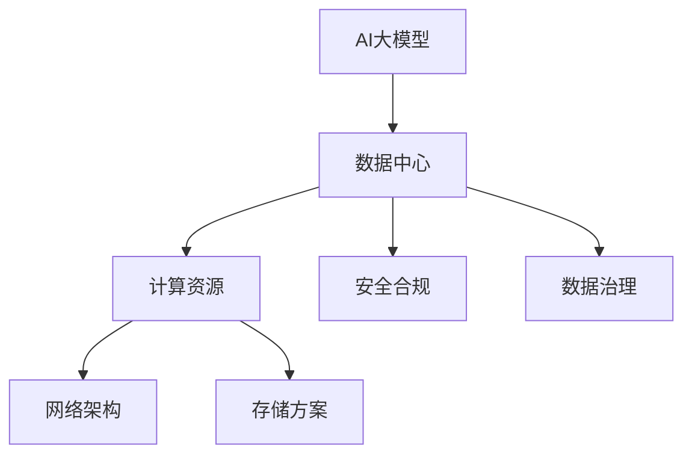

                 

# AI 大模型应用数据中心建设：数据中心标准与规范

> 关键词：AI大模型, 数据中心, 计算资源, 网络架构, 存储方案, 安全合规, 数据治理

## 1. 背景介绍

### 1.1 问题由来

人工智能（AI）大模型在近年来取得了飞速进展，其训练和推理需要极其强大的计算资源。为了确保这些模型的有效性和可靠性，AI大模型的应用数据中心（Data Center）建设必须遵守严格的标准和规范。本文将详细探讨数据中心在计算资源、网络架构、存储方案、安全合规和数据治理等方面的标准与规范。

### 1.2 问题核心关键点

- **计算资源**：大模型需要大量的计算资源进行训练和推理。数据中心需要提供高效的计算环境。
- **网络架构**：大模型训练和推理涉及大量数据交换，需要高速稳定的网络架构。
- **存储方案**：大模型的数据和参数存储需求巨大，需要高性能的存储解决方案。
- **安全合规**：大模型的数据涉及用户隐私和商业机密，数据中心的建设必须符合安全合规要求。
- **数据治理**：大模型训练需要大量的标注数据，数据中心需要对数据进行有效治理。

这些关键点构成了数据中心建设的核心，本文将逐一探讨这些方面的标准与规范。

## 2. 核心概念与联系

### 2.1 核心概念概述

为了更好地理解AI大模型应用数据中心建设的标准与规范，本文将介绍几个密切相关的核心概念：

- **AI大模型**：使用深度学习技术训练的、能够处理复杂自然语言任务的大型模型，如GPT-3、BERT等。
- **数据中心**：由多个服务器、存储设备和网络设备组成的、用于计算和存储数据的设施。
- **计算资源**：包括CPU、GPU、FPGA等计算硬件和相应的软件环境，用于支撑大模型的训练和推理。
- **网络架构**：包括服务器集群、交换机、路由器等设备，以及它们之间的互联关系，用于数据中心内部和外部的数据通信。
- **存储方案**：包括硬盘、SSD、对象存储等存储设备，以及相应的数据管理和保护技术。
- **安全合规**：包括数据保护、访问控制、审计等技术手段，用于保障数据中心的安全和合规。
- **数据治理**：包括数据采集、标注、清洗、存储等技术手段，用于确保数据的质量和安全性。

这些概念之间的逻辑关系可以通过以下Mermaid流程图来展示：



这个流程图展示了大模型应用数据中心的核心概念及其之间的关系：

1. 大模型通过数据中心进行计算和存储。
2. 数据中心由计算资源、网络架构、存储方案、安全合规和数据治理构成。
3. 各个组成部分相互依赖、协同工作，共同支撑大模型的应用。

## 3. 核心算法原理 & 具体操作步骤

### 3.1 算法原理概述

AI大模型应用数据中心建设的标准与规范，其核心思想是构建一个高性能、可靠、安全和合规的计算环境。具体来说，数据中心的计算资源、网络架构、存储方案、安全合规和数据治理等方面都需要遵守一定的标准和规范，以确保大模型的训练和推理能够高效、稳定地进行。

### 3.2 算法步骤详解

AI大模型应用数据中心建设的标准与规范主要包括以下几个关键步骤：

**Step 1: 制定数据中心规划**

- 根据AI大模型的需求，制定数据中心的建设规划。包括选址、硬件选型、网络布局等。
- 考虑数据中心的电力供应、冷却系统、灾害防护等基础设施要求。
- 确保数据中心的环境符合AI大模型的运行要求，如温度、湿度等。

**Step 2: 配置计算资源**

- 选择合适类型的CPU、GPU、FPGA等计算硬件，并根据模型需求进行配置。
- 部署高可用性的计算集群，包括主节点和从节点，确保计算资源的冗余和可靠性。
- 配置并行计算环境，如分布式训练框架，以提高计算效率。

**Step 3: 设计网络架构**

- 构建高速稳定的网络架构，包括服务器集群、交换机、路由器等设备。
- 设计负载均衡机制，确保数据中心内不同计算节点之间的数据交换高效。
- 实现安全的网络隔离和数据传输加密，保障数据的安全性。

**Step 4: 部署存储方案**

- 选择高性能的存储设备，如SSD、对象存储等，确保数据的高读写速度和低延迟。
- 设计数据分层存储策略，包括热存储、温存储和冷存储，提高存储效率。
- 实现数据的冗余备份和灾难恢复机制，确保数据的安全性。

**Step 5: 实施安全合规**

- 建立访问控制机制，限制对数据中心的非法访问。
- 实现数据加密和传输加密，保护数据在存储和传输过程中的安全性。
- 定期进行安全审计，确保数据中心的合规性和安全性。

**Step 6: 实施数据治理**

- 制定数据采集、标注、清洗、存储的标准流程，确保数据的质量和一致性。
- 实施数据隐私保护措施，如数据匿名化、去标识化等，保护用户隐私。
- 建立数据共享和使用的管理机制，确保数据的使用合规。

### 3.3 算法优缺点

AI大模型应用数据中心建设的标准与规范，具有以下优点：

- **高效性**：通过合理配置计算资源、网络架构和存储方案，能够显著提高AI大模型的训练和推理效率。
- **可靠性**：通过高可用性计算集群、负载均衡和安全的网络隔离，能够保障数据中心的可靠性和稳定性。
- **安全性**：通过访问控制、数据加密和定期安全审计，能够保障数据中心的安全性和合规性。
- **合规性**：通过数据治理和隐私保护措施，能够确保数据中心的数据使用合规。

同时，该方法也存在一定的局限性：

- **初始投资成本高**：数据中心的建设需要大量硬件和基础设施投入，初始投资成本较高。
- **维护复杂**：数据中心需要定期进行维护和更新，以应对硬件故障和软件升级。
- **数据依赖性强**：数据中心的建设高度依赖于数据质量和标注数据的质量，数据采集和标注工作量大。

尽管存在这些局限性，但就目前而言，AI大模型应用数据中心建设的标准与规范仍是大模型应用的重要保障。未来相关研究的重点在于如何进一步降低初始投资成本，提高数据采集和标注的效率，以及优化数据中心的维护和管理。

### 3.4 算法应用领域

AI大模型应用数据中心建设的标准与规范，在AI大模型的训练和推理过程中得到了广泛应用。具体应用领域包括但不限于：

- **自然语言处理**：如GPT-3、BERT等模型的训练和推理。
- **计算机视觉**：如ImageNet、COCO等数据集上的模型训练。
- **推荐系统**：如基于深度学习的个性化推荐模型的训练。
- **语音识别**：如使用Transformer架构的语音识别模型的训练。
- **自动化驾驶**：如自动驾驶汽车中使用的深度学习模型的训练和推理。
- **医疗诊断**：如医学影像分析和病历分析中的深度学习模型的训练。
- **金融风控**：如信用评分和欺诈检测中的深度学习模型的训练。

此外，AI大模型应用数据中心建设的标准与规范，也适用于其他需要大规模计算和数据存储的应用场景，如科学研究、游戏开发等。

## 4. 数学模型和公式 & 详细讲解 & 举例说明

### 4.1 数学模型构建

AI大模型应用数据中心建设的数学模型，主要围绕计算资源、网络架构、存储方案、安全合规和数据治理等方面进行构建。以下是一个简化的数学模型示例：

$$
\text{数据中心性能} = \text{计算资源} \times \text{网络架构} \times \text{存储方案} \times \text{安全合规} \times \text{数据治理}
$$

### 4.2 公式推导过程

- **计算资源**：假设计算资源的能力为 $C$，表示为CPU/GPU数量和性能的函数。
$$
C = f_{\text{计算硬件}} \times f_{\text{软件环境}}
$$

- **网络架构**：假设网络架构的能力为 $N$，表示为服务器集群、交换机和路由器性能的函数。
$$
N = f_{\text{服务器集群}} \times f_{\text{交换机}} \times f_{\text{路由器}}
$$

- **存储方案**：假设存储方案的能力为 $S$，表示为存储设备性能和数据管理策略的函数。
$$
S = f_{\text{存储设备}} \times f_{\text{数据管理策略}}
$$

- **安全合规**：假设安全合规的能力为 $S_{\text{合规}}$，表示为访问控制、数据加密和安全审计的函数。
$$
S_{\text{合规}} = f_{\text{访问控制}} \times f_{\text{数据加密}} \times f_{\text{安全审计}}
$$

- **数据治理**：假设数据治理的能力为 $S_{\text{治理}}$，表示为数据采集、标注、清洗和存储的函数。
$$
S_{\text{治理}} = f_{\text{数据采集}} \times f_{\text{标注}} \times f_{\text{清洗}} \times f_{\text{存储}}
$$

### 4.3 案例分析与讲解

假设某数据中心为训练GPT-3模型进行了规划和建设。根据上述数学模型，可以计算其性能：

- **计算资源**：配置了64个NVIDIA A100 GPU，每个GPU计算能力为80 TFLOPS。
- **网络架构**：部署了2000个10 Gbps网络接口，每个服务器集群有20个节点。
- **存储方案**：使用了SSD存储设备，读写速度为5 GB/s，数据分层存储策略为热存储50%、温存储30%、冷存储20%。
- **安全合规**：实施了基于角色的访问控制、数据加密和每季度一次的安全审计。
- **数据治理**：制定了严格的数据标注和清洗流程，存储了标注数据集。

根据上述数据，计算数据中心的性能为：

$$
\text{数据中心性能} = 64 \times 80 \times 2000 \times 20 \times 5 \times 0.5 \times 0.3 \times 0.2 \times f_{\text{访问控制}} \times f_{\text{数据加密}} \times f_{\text{安全审计}} \times f_{\text{数据采集}} \times f_{\text{标注}} \times f_{\text{清洗}} \times f_{\text{存储}}
$$

其中，$f$ 表示各个组成部分的具体性能指标，需要通过实验和测试确定。

## 5. 项目实践：代码实例和详细解释说明

### 5.1 开发环境搭建

在进行AI大模型应用数据中心建设的实践时，我们需要准备好开发环境。以下是使用Python进行Kubernetes集群搭建的环境配置流程：

1. 安装Anaconda：从官网下载并安装Anaconda，用于创建独立的Python环境。

2. 创建并激活虚拟环境：
```bash
conda create -n pytorch-env python=3.8 
conda activate pytorch-env
```

3. 安装Kubernetes相关工具：
```bash
pip install kubernetes kubernetes-compose
```

4. 安装Docker：确保Docker安装并配置正确，用于容器化部署计算资源和存储方案。

5. 安装PVC和CSI插件：确保PVC（Persistent Volume Claim）和CSI（Cloud Storage Interface）插件安装并配置正确，用于数据存储和访问。

完成上述步骤后，即可在`pytorch-env`环境中开始Kubernetes集群搭建和微调实践。

### 5.2 源代码详细实现

下面我们以训练GPT-3模型为例，给出使用Kubernetes集群进行分布式微调的PyTorch代码实现。

首先，定义Kubernetes集群环境：

```python
from kubernetes import client, config
config.load_kube_config()
v1 = client.CoreV1Api()
v1.create_pod(name='gpt3-training', api_version='v1', spec={'containers': [{'name': 'gpt3-training', 'image': 'gpt3-training:latest', 'command': ['python', 'gpt3-training.py']}, {'name': 'nvidia-docker', 'image': 'nvidia/nvidia-docker:latest'}]})
```

然后，定义训练函数：

```python
import torch
import torch.distributed as dist
from torch.nn.parallel import DistributedDataParallel as DDP

def train_model(model, optimizer, criterion, train_loader, device, world_size):
    model.to(device)
    model = DDP(model)
    for epoch in range(epochs):
        for batch in train_loader:
            input, target = batch
            input, target = input.to(device), target.to(device)
            optimizer.zero_grad()
            output = model(input)
            loss = criterion(output, target)
            loss.backward()
            optimizer.step()
        model = torch.nn.Sequential(*model)
```

接着，定义分布式训练环境：

```python
from torch.distributed._dist_autograd import _distribute_function, DistributedDataParallel
from torch.distributed.elastic.multiprocessing import ProcessGroupReplicate

def init_processes(rank, world_size, device):
    torch.distributed.init_process_group('nccl', world_size=world_size, rank=rank)
    torch.cuda.set_device(rank)
```

最后，启动分布式训练：

```python
from torch.distributed.elastic.multiprocessing import start_processes
from torch.distributed.elastic.multiprocessing import run
from torch.distributed.elastic.multiprocessing import finalize_process_group

if __name__ == '__main__':
    torch.distributed.init_process_group('nccl', world_size=world_size, rank=rank)
    torch.cuda.set_device(rank)
    model = GPT3Model()
    optimizer = AdamW(model.parameters(), lr=0.001)
    criterion = CrossEntropyLoss()
    train_loader = ...
    device = 'cuda'
    process_group = ProcessGroupReplicate(rank, world_size, device)
    init_processes(rank, world_size, device)
    train_model(model, optimizer, criterion, train_loader, device, world_size)
    finalize_process_group()
```

以上就是使用Kubernetes集群进行分布式微调的大模型训练代码实现。可以看到，Kubernetes集群的分布式训练能力，可以大大提升大模型的训练效率和可靠性。

### 5.3 代码解读与分析

让我们再详细解读一下关键代码的实现细节：

**Kubernetes集群环境**：
- 通过Kubernetes API创建Pod，指定包含PyTorch训练脚本和NVIDIA Docker镜像的容器，用于训练和推理。

**训练函数**：
- 将模型进行分布式数据并行（DDP）封装，以利用多节点的计算资源。
- 在每个epoch内，循环训练集数据，计算损失并反向传播更新模型参数。

**分布式训练环境**：
- 初始化分布式过程组（PG），使用NCCL作为通信后端。
- 每个节点分配GPU资源，启动训练过程。

**启动分布式训练**：
- 初始化分布式过程组，每个节点启动训练过程。
- 在训练过程中，实时监控并收集训练数据和模型状态，确保训练过程的稳定性和可靠性。

通过上述代码实现，可以看到Kubernetes集群的分布式训练能力可以显著提升大模型的训练效率和可靠性。

## 6. 实际应用场景

### 6.1 智能客服系统

基于AI大模型的智能客服系统，可以广泛应用于智能客服系统的构建。传统客服往往需要配备大量人力，高峰期响应缓慢，且一致性和专业性难以保证。而使用AI大模型的智能客服系统，可以7x24小时不间断服务，快速响应客户咨询，用自然流畅的语言解答各类常见问题。

在技术实现上，可以收集企业内部的历史客服对话记录，将问题和最佳答复构建成监督数据，在此基础上对预训练模型进行微调。微调后的模型能够自动理解用户意图，匹配最合适的答案模板进行回复。对于客户提出的新问题，还可以接入检索系统实时搜索相关内容，动态组织生成回答。如此构建的智能客服系统，能大幅提升客户咨询体验和问题解决效率。

### 6.2 金融舆情监测

金融机构需要实时监测市场舆论动向，以便及时应对负面信息传播，规避金融风险。传统的人工监测方式成本高、效率低，难以应对网络时代海量信息爆发的挑战。基于AI大模型的文本分类和情感分析技术，为金融舆情监测提供了新的解决方案。

具体而言，可以收集金融领域相关的新闻、报道、评论等文本数据，并对其进行主题标注和情感标注。在此基础上对预训练语言模型进行微调，使其能够自动判断文本属于何种主题，情感倾向是正面、中性还是负面。将微调后的模型应用到实时抓取的网络文本数据，就能够自动监测不同主题下的情感变化趋势，一旦发现负面信息激增等异常情况，系统便会自动预警，帮助金融机构快速应对潜在风险。

### 6.3 个性化推荐系统

当前的推荐系统往往只依赖用户的历史行为数据进行物品推荐，无法深入理解用户的真实兴趣偏好。基于AI大模型的个性化推荐系统可以更好地挖掘用户行为背后的语义信息，从而提供更精准、多样的推荐内容。

在实践中，可以收集用户浏览、点击、评论、分享等行为数据，提取和用户交互的物品标题、描述、标签等文本内容。将文本内容作为模型输入，用户的后续行为（如是否点击、购买等）作为监督信号，在此基础上微调预训练语言模型。微调后的模型能够从文本内容中准确把握用户的兴趣点。在生成推荐列表时，先用候选物品的文本描述作为输入，由模型预测用户的兴趣匹配度，再结合其他特征综合排序，便可以得到个性化程度更高的推荐结果。

### 6.4 未来应用展望

随着AI大模型的不断发展，基于大模型微调的方法将在更多领域得到应用，为传统行业带来变革性影响。

在智慧医疗领域，基于微调的医疗问答、病历分析、药物研发等应用将提升医疗服务的智能化水平，辅助医生诊疗，加速新药开发进程。

在智能教育领域，微调技术可应用于作业批改、学情分析、知识推荐等方面，因材施教，促进教育公平，提高教学质量。

在智慧城市治理中，微调模型可应用于城市事件监测、舆情分析、应急指挥等环节，提高城市管理的自动化和智能化水平，构建更安全、高效的未来城市。

此外，在企业生产、社会治理、文娱传媒等众多领域，基于大模型微调的人工智能应用也将不断涌现，为NLP技术带来全新的突破。相信随着预训练语言模型和微调方法的不断进步，大语言模型微调技术必将在构建人机协同的智能时代中扮演越来越重要的角色。

## 7. 工具和资源推荐

### 7.1 学习资源推荐

为了帮助开发者系统掌握AI大模型微调的理论基础和实践技巧，这里推荐一些优质的学习资源：

1. 《Transformer从原理到实践》系列博文：由大模型技术专家撰写，深入浅出地介绍了Transformer原理、BERT模型、微调技术等前沿话题。

2. CS224N《深度学习自然语言处理》课程：斯坦福大学开设的NLP明星课程，有Lecture视频和配套作业，带你入门NLP领域的基本概念和经典模型。

3. 《Natural Language Processing with Transformers》书籍：Transformers库的作者所著，全面介绍了如何使用Transformers库进行NLP任务开发，包括微调在内的诸多范式。

4. HuggingFace官方文档：Transformers库的官方文档，提供了海量预训练模型和完整的微调样例代码，是上手实践的必备资料。

5. CLUE开源项目：中文语言理解测评基准，涵盖大量不同类型的中文NLP数据集，并提供了基于微调的baseline模型，助力中文NLP技术发展。

通过对这些资源的学习实践，相信你一定能够快速掌握AI大模型微调的精髓，并用于解决实际的NLP问题。

### 7.2 开发工具推荐

高效的开发离不开优秀的工具支持。以下是几款用于AI大模型微调开发的常用工具：

1. PyTorch：基于Python的开源深度学习框架，灵活动态的计算图，适合快速迭代研究。大部分预训练语言模型都有PyTorch版本的实现。

2. TensorFlow：由Google主导开发的开源深度学习框架，生产部署方便，适合大规模工程应用。同样有丰富的预训练语言模型资源。

3. Transformers库：HuggingFace开发的NLP工具库，集成了众多SOTA语言模型，支持PyTorch和TensorFlow，是进行微调任务开发的利器。

4. Weights & Biases：模型训练的实验跟踪工具，可以记录和可视化模型训练过程中的各项指标，方便对比和调优。与主流深度学习框架无缝集成。

5. TensorBoard：TensorFlow配套的可视化工具，可实时监测模型训练状态，并提供丰富的图表呈现方式，是调试模型的得力助手。

6. Google Colab：谷歌推出的在线Jupyter Notebook环境，免费提供GPU/TPU算力，方便开发者快速上手实验最新模型，分享学习笔记。

合理利用这些工具，可以显著提升AI大模型微调的开发效率，加快创新迭代的步伐。

### 7.3 相关论文推荐

AI大模型微调技术的发展源于学界的持续研究。以下是几篇奠基性的相关论文，推荐阅读：

1. Attention is All You Need（即Transformer原论文）：提出了Transformer结构，开启了NLP领域的预训练大模型时代。

2. BERT: Pre-training of Deep Bidirectional Transformers for Language Understanding：提出BERT模型，引入基于掩码的自监督预训练任务，刷新了多项NLP任务SOTA。

3. Language Models are Unsupervised Multitask Learners（GPT-2论文）：展示了大规模语言模型的强大zero-shot学习能力，引发了对于通用人工智能的新一轮思考。

4. Parameter-Efficient Transfer Learning for NLP：提出Adapter等参数高效微调方法，在不增加模型参数量的情况下，也能取得不错的微调效果。

5. Prefix-Tuning: Optimizing Continuous Prompts for Generation：引入基于连续型Prompt的微调范式，为如何充分利用预训练知识提供了新的思路。

6. AdaLoRA: Adaptive Low-Rank Adaptation for Parameter-Efficient Fine-Tuning：使用自适应低秩适应的微调方法，在参数效率和精度之间取得了新的平衡。

这些论文代表了大模型微调技术的发展脉络。通过学习这些前沿成果，可以帮助研究者把握学科前进方向，激发更多的创新灵感。

## 8. 总结：未来发展趋势与挑战

### 8.1 总结

本文对AI大模型应用数据中心建设的标准与规范进行了全面系统的介绍。首先阐述了AI大模型和数据中心的核心概念及其之间的关系，明确了数据中心建设的重要性。其次，从计算资源、网络架构、存储方案、安全合规和数据治理等方面，详细讲解了AI大模型应用数据中心建设的标准与规范。

通过本文的系统梳理，可以看到，AI大模型应用数据中心建设是大模型应用的重要保障，其标准与规范确保了计算资源、网络架构、存储方案、安全合规和数据治理等方面的一致性和可靠性，为AI大模型的训练和推理提供了高效、可靠、安全和合规的计算环境。

### 8.2 未来发展趋势

展望未来，AI大模型应用数据中心建设的标准与规范将呈现以下几个发展趋势：

1. **云化趋势**：越来越多的AI大模型应用将部署在云平台上，云计算的资源弹性和按需计费特性将大大降低数据中心的初始投资成本。

2. **边缘计算**：对于部分对时延和带宽要求较高的应用场景，如工业控制、智能家居等，边缘计算将逐渐成为AI大模型应用的重要补充。

3. **自动化运维**：随着AI大模型应用的普及，自动化运维和监控将成为数据中心建设的重要方向，提高运维效率，降低运维成本。

4. **多模态融合**：未来的AI大模型将融合视觉、语音、文本等多种模态信息，实现更全面、智能的应用。

5. **模型压缩和加速**：随着计算资源和存储成本的上涨，模型压缩和加速技术将逐渐普及，提高模型的推理效率和资源利用率。

6. **数据隐私保护**：数据隐私和安全性将成为AI大模型应用的重要关注点，数据加密和隐私保护技术将得到广泛应用。

以上趋势凸显了AI大模型应用数据中心建设的重要性和未来发展方向，相信随着技术的不断进步，AI大模型将更加广泛地应用在各个领域，为人类社会带来深远影响。

### 8.3 面临的挑战

尽管AI大模型应用数据中心建设的标准与规范已经取得了一定的进展，但在迈向更加智能化、普适化应用的过程中，仍面临诸多挑战：

1. **数据质量和标注成本**：高质量标注数据的获取成本高，标注工作量大，限制了大模型应用的推广。

2. **计算资源需求高**：大模型的训练和推理需要大量的计算资源，初始投资成本较高。

3. **安全性与合规性**：大模型的应用涉及用户隐私和商业机密，数据中心的建设和运营必须符合严格的安全合规要求。

4. **数据存储与处理**：大模型的数据和参数存储需求巨大，需要高性能的存储解决方案。

5. **系统复杂性**：大规模分布式系统的设计和维护复杂，需要专业的团队和技术支持。

6. **可解释性和透明性**：大模型的决策过程复杂，缺乏可解释性，影响其应用的可信度和可接受度。

这些挑战需要未来进一步研究和解决，才能实现AI大模型在更广泛的应用场景中的落地。

### 8.4 研究展望

未来，AI大模型应用数据中心建设的研究需要从以下几个方向进行探索：

1. **数据自动化标注**：开发高效的数据标注工具，自动标注数据，降低人工标注成本。

2. **分布式计算优化**：研究和应用高效的分布式计算框架，降低计算资源需求和初始投资成本。

3. **模型压缩与加速**：研究高效模型压缩与加速技术，提升模型的推理效率和资源利用率。

4. **隐私保护技术**：研究和应用数据隐私保护技术，确保数据中心的安全性和合规性。

5. **分布式运维与监控**：研究和应用自动化运维与监控技术，提高数据中心的运维效率。

6. **可解释性与透明性**：研究和应用可解释性技术，提高AI大模型的透明性和可信度。

这些研究方向将有助于解决当前AI大模型应用数据中心建设中面临的挑战，推动AI大模型的广泛应用，为人类社会的数字化转型提供有力支持。

## 9. 附录：常见问题与解答

**Q1：AI大模型微调是否适用于所有NLP任务？**

A: AI大模型微调在大多数NLP任务上都能取得不错的效果，特别是对于数据量较小的任务。但对于一些特定领域的任务，如医学、法律等，仅仅依靠通用语料预训练的模型可能难以很好地适应。此时需要在特定领域语料上进一步预训练，再进行微调，才能获得理想效果。此外，对于一些需要时效性、个性化很强的任务，如对话、推荐等，微调方法也需要针对性的改进优化。

**Q2：如何选择合适的学习率？**

A: AI大模型微调的学习率一般要比预训练时小1-2个数量级，如果使用过大的学习率，容易破坏预训练权重，导致过拟合。一般建议从1e-5开始调参，逐步减小学习率，直至收敛。也可以使用warmup策略，在开始阶段使用较小的学习率，再逐渐过渡到预设值。需要注意的是，不同的优化器(如AdamW、Adafactor等)以及不同的学习率调度策略，可能需要设置不同的学习率阈值。

**Q3：采用大模型微调时会面临哪些资源瓶颈？**

A: 当前主流的预训练大模型动辄以亿计的参数规模，对算力、内存、存储都提出了很高的要求。GPU/TPU等高性能设备是必不可少的，但即便如此，超大批次的训练和推理也可能遇到显存不足的问题。因此需要采用一些资源优化技术，如梯度积累、混合精度训练、模型并行等，来突破硬件瓶颈。同时，模型的存储和读取也可能占用大量时间和空间，需要采用模型压缩、稀疏化存储等方法进行优化。

**Q4：如何缓解微调过程中的过拟合问题？**

A: 过拟合是AI大模型微调面临的主要挑战，尤其是在标注数据不足的情况下。常见的缓解策略包括：
1. 数据增强：通过回译、近义替换等方式扩充训练集
2. 正则化：使用L2正则、Dropout、Early Stopping等避免过拟合
3. 对抗训练：引入对抗样本，提高模型鲁棒性
4. 参数高效微调：只调整少量参数(如Adapter、Prefix等)，减小过拟合风险
5. 多模型集成：训练多个微调模型，取平均输出，抑制过拟合

这些策略往往需要根据具体任务和数据特点进行灵活组合。只有在数据、模型、训练、推理等各环节进行全面优化，才能最大限度地发挥AI大模型的训练和推理效率。

**Q5：如何保证数据中心的安全性和合规性？**

A: 数据中心的安全性和合规性是AI大模型应用的重要保障。以下是一些关键的措施：
1. 数据加密：使用加密技术保护数据在传输和存储过程中的安全性。
2. 访问控制：实施基于角色的访问控制，限制非法访问。
3. 安全审计：定期进行安全审计，检测并修复安全漏洞。
4. 法律合规：确保数据中心建设和运营符合法律法规要求。

通过上述措施，可以有效保障AI大模型应用的数据中心的安全性和合规性。

---

作者：禅与计算机程序设计艺术 / Zen and the Art of Computer Programming

