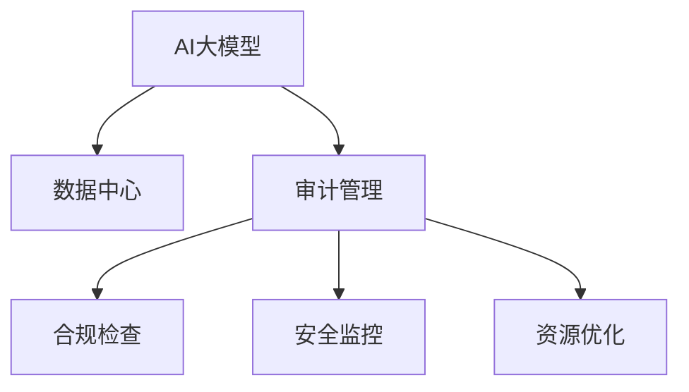

                 

# AI 大模型应用数据中心的审计管理

## 1. 背景介绍

### 1.1 问题由来
近年来，人工智能(AI)大模型在医疗、金融、电商等多个领域的应用越来越广泛。这些大模型依赖于海量数据进行训练，常常部署在数据中心以支持高性能计算需求。然而，数据中心的复杂性和安全性要求，对AI大模型的应用带来了不小的挑战。其中，数据中心的审计管理是一个关键问题，它涉及到合规性、安全性、效率等多个方面。

### 1.2 问题核心关键点
数据中心审计管理的目标是确保AI大模型的应用环境安全、合规、高效。关键点包括：

- **合规性**：确保数据中心遵循国家法律法规和行业标准，避免数据泄露和滥用。
- **安全性**：保护数据中心中的数据和模型免受恶意攻击和未经授权的访问。
- **效率**：优化数据中心的资源配置，提高AI大模型的运行效率和响应速度。

### 1.3 问题研究意义
数据中心的审计管理对AI大模型应用的合规性、安全性和效率至关重要。良好的审计管理可以：

- **保障数据安全**：防止敏感数据被非法获取或滥用。
- **确保合规性**：遵守国家法律法规和行业标准，避免法律风险。
- **提升运行效率**：优化资源配置，提高AI大模型的运行效率和响应速度。
- **促进技术创新**：确保AI大模型在合规、安全的前提下，充分发挥其潜力，促进技术进步。

## 2. 核心概念与联系

### 2.1 核心概念概述

为更好地理解数据中心AI大模型的审计管理，本节将介绍几个密切相关的核心概念：

- **AI大模型**：基于深度学习技术训练的大型模型，如BERT、GPT等，用于自然语言处理、计算机视觉、语音识别等任务。
- **数据中心**：用于存储、计算、存储AI大模型所需数据和模型的大型设施，包括服务器、存储设备、网络设备等。
- **审计管理**：通过监控、检查、评估等手段，确保数据中心遵守法律法规、行业标准和内部政策，保障数据和模型的安全性和合规性。

这些核心概念之间的逻辑关系可以通过以下Mermaid流程图来展示：



这个流程图展示了大模型应用数据中心的审计管理的关键环节：

1. AI大模型在数据中心存储和运行。
2. 审计管理通过合规检查、安全监控和资源优化等手段，确保数据中心的合规性和安全性，提升AI大模型的运行效率。

## 3. 核心算法原理 & 具体操作步骤
### 3.1 算法原理概述

数据中心的审计管理通常采用基于规则的监控和评估方法。其核心思想是定义一系列合规性和安全性规则，通过自动化工具对数据中心的操作进行实时监控和评估，发现违反规则的行为，并及时采取措施。

形式化地，假设数据中心有N个监控指标 $X_1, X_2, ..., X_N$，定义一组合规规则 $R=\{R_1, R_2, ..., R_M\}$ 和安全性规则 $S=\{S_1, S_2, ..., S_N\}$，则审计管理的目标是最小化以下风险：

$$
\min_{X_1, X_2, ..., X_N} \sum_{i=1}^N R(X_i) + \sum_{j=1}^M S(X_j)
$$

其中 $R(X_i)$ 和 $S(X_j)$ 分别表示合规规则 $R_i$ 和安全规则 $S_j$ 对监控指标 $X_i$ 和 $X_j$ 的评价函数。

### 3.2 算法步骤详解

数据中心的审计管理一般包括以下几个关键步骤：

**Step 1: 定义审计规则**
- 根据法律法规和行业标准，定义数据中心的合规规则和安全规则。
- 例如，合规规则可能包括数据访问权限控制、数据备份策略等；安全规则可能包括网络流量监控、异常行为检测等。

**Step 2: 配置监控工具**
- 在数据中心部署监控工具，如日志分析工具、异常检测系统等。
- 配置工具以监控指定的合规和安全规则。

**Step 3: 实时监控和评估**
- 实时收集数据中心的操作数据，如日志、网络流量、设备状态等。
- 根据预定义的合规和安全规则，评估数据中心的合规性和安全性。

**Step 4: 异常处理和告警**
- 当发现违反规则的行为时，触发告警机制，通知管理员进行处理。
- 例如，当发现异常数据访问请求时，及时拦截并通知安全团队。

**Step 5: 审计报告和改进**
- 定期生成审计报告，评估数据中心的合规性和安全性。
- 根据审计结果，提出改进措施，优化数据中心的操作流程和资源配置。

### 3.3 算法优缺点

基于规则的审计管理方法具有以下优点：

- **可控性**：通过预定义的规则，可以控制数据中心的操作行为，确保合规性和安全性。
- **透明性**：审计规则和评估结果都是可解释的，易于理解和验证。
- **灵活性**：可以针对特定的合规和安全需求，灵活定义和调整规则。

同时，该方法也存在一定的局限性：

- **规则依赖**：审计管理的有效性高度依赖于规则的质量和覆盖面，规则不全或错误可能导致误报或漏报。
- **动态性不足**：规则通常难以应对快速变化的环境和新的安全威胁。
- **维护成本高**：随着业务和法规的变化，需要不断更新和维护审计规则。

### 3.4 算法应用领域

基于规则的审计管理方法在数据中心的应用非常广泛，例如：

- **网络安全监控**：监控网络流量，检测异常行为，防止DDoS攻击等。
- **数据访问控制**：控制数据访问权限，防止未经授权的数据泄露。
- **设备监控**：监控设备状态，避免设备故障导致的业务中断。
- **日志审计**：分析系统日志，发现安全漏洞和异常行为。
- **性能优化**：监控系统性能，优化资源配置，提高系统响应速度。

## 4. 数学模型和公式 & 详细讲解 & 举例说明

### 4.1 数学模型构建

本节将使用数学语言对数据中心AI大模型的审计管理过程进行更加严格的刻画。

假设数据中心有M个合规规则 $R_1, R_2, ..., R_M$ 和N个安全性规则 $S_1, S_2, ..., S_N$，定义一个数据中心的操作行为 $O$，则合规性评分函数 $F_{compliance}$ 和安全评分函数 $F_{security}$ 分别为：

$$
F_{compliance}(O) = \sum_{i=1}^M w_i R_i(O)
$$

$$
F_{security}(O) = \sum_{j=1}^N w_j S_j(O)
$$

其中 $w_i$ 和 $w_j$ 是规则 $R_i$ 和 $S_j$ 的权重。

### 4.2 公式推导过程

以下我们以网络流量监控为例，推导合规性评分函数的计算公式。

假设数据中心的合规规则为 "每日记录至少100条网络流量日志"，即 $R_1(O) = 1$ 表示 $O$ 操作记录了至少100条日志，$R_1(O) = 0$ 表示 $O$ 操作未记录或记录少于100条日志。

当操作 $O$ 记录了 $n$ 条日志时，则合规性评分函数为：

$$
F_{compliance}(O) = w_1 R_1(O) = w_1 (1 - \mathbb{I}(n < 100))
$$

其中 $\mathbb{I}$ 是示性函数，$\mathbb{I}(n < 100) = 1$ 表示 $n < 100$，$\mathbb{I}(n < 100) = 0$ 表示 $n \geq 100$。

### 4.3 案例分析与讲解

以医疗数据中心为例，我们分析其合规性评分函数和安全评分函数的计算过程。

**合规性评分函数**：

- 数据中心需每天备份数据，备份时间间隔不超过4小时，备份数据完整性不得低于99.9%。
- 定义合规规则 $R_1$ 为 "每天备份数据且备份时间间隔不超过4小时"，$R_2$ 为 "备份数据完整性不低于99.9%"。

假设 $O_1$ 表示备份了当天数据且备份时间间隔小于4小时，$O_2$ 表示备份了当天数据且备份数据完整性不低于99.9%。

则合规性评分函数为：

$$
F_{compliance}(O) = w_1 R_1(O_1) + w_2 R_2(O_2) = w_1 (1 - \mathbb{I}(t > 4)) + w_2 (1 - \mathbb{I}(m < 0.1))
$$

其中 $t$ 表示备份时间，$m$ 表示备份数据完整性。

**安全评分函数**：

- 数据中心需限制外部IP访问，只有授权IP可访问敏感数据。
- 定义安全规则 $S_1$ 为 "只有授权IP可访问敏感数据"。

假设 $O_3$ 表示访问请求来源于授权IP。

则安全评分函数为：

$$
F_{security}(O) = w_1 S_1(O_3) = w_1 \mathbb{I}(ip \in authorized)
$$

其中 $ip$ 表示访问请求的IP地址，$authorized$ 表示授权IP集合。

## 5. 项目实践：代码实例和详细解释说明
### 5.1 开发环境搭建

在进行审计管理实践前，我们需要准备好开发环境。以下是使用Python进行开发的环境配置流程：

1. 安装Anaconda：从官网下载并安装Anaconda，用于创建独立的Python环境。

2. 创建并激活虚拟环境：
```bash
conda create -n audit-env python=3.8 
conda activate audit-env
```

3. 安装PyTorch：根据CUDA版本，从官网获取对应的安装命令。例如：
```bash
conda install pytorch torchvision torchaudio cudatoolkit=11.1 -c pytorch -c conda-forge
```

4. 安装pandas、numpy、matplotlib等工具包：
```bash
pip install pandas numpy matplotlib jupyter notebook ipython
```

5. 安装数据中心审计管理工具：
```bash
pip install auditmanagement
```

完成上述步骤后，即可在`audit-env`环境中开始审计管理实践。

### 5.2 源代码详细实现

这里我们以网络流量监控为例，展示使用Python进行数据中心合规性评分函数计算的代码实现。

```python
import pandas as pd
from auditmanagement import compliance_check

# 定义合规规则
def compliance_rule1(o):
    if o['backup_time'] <= 4 and o['backup_complete'] >= 0.99:
        return 1
    else:
        return 0

# 定义安全规则
def security_rule1(o):
    if o['ip'] in authorized_ips:
        return 1
    else:
        return 0

# 创建合规性和安全性评分函数
compliance_function = compliance_check(compliance_rule1)
security_function = compliance_check(security_rule1)

# 读取数据中心的操作日志
df = pd.read_csv('log_data.csv')

# 计算合规性和安全性评分
df['compliance_score'] = compliance_function(df)
df['security_score'] = security_function(df)

# 输出评分结果
print(df[['o', 'compliance_score', 'security_score']].head())
```

在这个代码示例中，我们首先定义了两个合规规则和一个安全规则。然后，使用`compliance_check`函数将规则封装成合规性评分函数和安全性评分函数。接下来，从数据中心的操作日志中读取数据，并计算每个操作的合规性和安全性评分。最后，输出评分结果。

### 5.3 代码解读与分析

让我们再详细解读一下关键代码的实现细节：

**compliance_rule1和security_rule1函数**：
- 定义了两个函数，用于评估操作是否符合合规规则和安全规则。
- 在函数中，根据操作日志中的字段（如备份时间、备份完成度、IP地址等）进行评估，返回评分结果。

**compliance_function和security_function函数**：
- 使用`compliance_check`函数，将规则函数封装成合规性和安全性评分函数。
- `compliance_check`函数将规则函数作为参数，并返回一个函数，用于计算合规性和安全性评分。

**df['compliance_score']和df['security_score']列**：
- 通过`compliance_function`和`security_function`函数，对操作日志进行评分计算。
- 将评分结果存储在数据框的`compliance_score`和`security_score`列中。

**df[['o', 'compliance_score', 'security_score']].head()打印结果**：
- 输出数据框的前几行，展示操作ID、合规性和安全性评分。
- 通过打印结果，可以直观地了解操作合规性和安全性评分。

可以看到，使用Python进行数据中心审计管理的代码实现相对简洁高效。开发者可以将更多精力放在数据处理、规则设计等高层逻辑上，而不必过多关注底层的实现细节。

当然，工业级的系统实现还需考虑更多因素，如规则动态更新、多规则组合、异常告警等。但核心的审计管理流程基本与此类似。

## 6. 实际应用场景
### 6.1 智能医疗数据中心

在智能医疗数据中心，合规性和安全性要求尤为严格。数据中心需存储大量的患者医疗数据，包括病历、影像、检验报告等。

为确保数据安全和合规，数据中心可以实施以下审计管理措施：

- **数据访问控制**：定义严格的访问权限，确保只有授权人员可以访问敏感数据。
- **数据备份与恢复**：定期备份数据，并测试数据恢复流程，确保备份数据的完整性和可用性。
- **安全监控与告警**：部署网络流量监控和安全异常检测系统，实时监控数据中心的操作行为，及时发现并处理异常情况。
- **合规性检查**：定期审计数据中心的合规性，确保其操作符合医疗法规和内部政策。

通过这些措施，智能医疗数据中心可以保障医疗数据的隐私和安全，提高数据访问的合规性，确保系统的稳定性和可靠性。

### 6.2 金融数据中心

金融数据中心存储了大量客户的交易数据、账户信息等敏感数据，对合规性和安全性要求极高。

为保障数据安全和合规，金融数据中心可以实施以下审计管理措施：

- **访问权限管理**：定义严格的访问权限，确保只有授权人员可以访问敏感数据。
- **数据加密**：对数据进行加密存储和传输，防止数据泄露。
- **安全监控与告警**：部署网络流量监控和安全异常检测系统，实时监控数据中心的操作行为，及时发现并处理异常情况。
- **合规性检查**：定期审计数据中心的合规性，确保其操作符合金融法规和内部政策。

通过这些措施，金融数据中心可以保障客户数据的安全性，防止数据泄露和滥用，确保系统的合规性。

### 6.3 智慧城市数据中心

智慧城市数据中心存储了大量公共服务数据，包括交通、环境、公共安全等数据。

为保障数据安全和合规，智慧城市数据中心可以实施以下审计管理措施：

- **数据访问控制**：定义严格的访问权限，确保只有授权人员可以访问敏感数据。
- **数据备份与恢复**：定期备份数据，并测试数据恢复流程，确保备份数据的完整性和可用性。
- **安全监控与告警**：部署网络流量监控和安全异常检测系统，实时监控数据中心的操作行为，及时发现并处理异常情况。
- **合规性检查**：定期审计数据中心的合规性，确保其操作符合城市管理政策和内部政策。

通过这些措施，智慧城市数据中心可以保障公共服务数据的安全性和可靠性，确保数据的合规性和隐私性。

### 6.4 未来应用展望

随着AI大模型在各个领域的广泛应用，数据中心的审计管理也将面临新的挑战和机遇：

- **多模态数据整合**：未来的数据中心将不仅存储文本数据，还存储图像、视频、语音等多模态数据。如何整合不同模态的数据，确保其安全性和合规性，将是新的挑战。
- **自动化管理**：数据中心的审计管理将逐步向自动化、智能化方向发展，通过机器学习和大数据分析，提高审计效率和准确性。
- **跨领域应用**：审计管理技术将逐步应用于更多领域，如物联网、车联网等新兴领域，为智慧城市、智慧交通等提供新的安全保障。
- **全球合规**：数据中心的审计管理需要遵循全球范围内的法律法规和标准，确保数据跨境传输的安全性和合规性。

## 7. 工具和资源推荐
### 7.1 学习资源推荐

为了帮助开发者系统掌握数据中心审计管理的技术基础和实践技巧，这里推荐一些优质的学习资源：

1. **《数据中心审计管理》系列博文**：由数据中心技术专家撰写，深入浅出地介绍了数据中心审计管理的基本概念、技术和工具，涵盖合规性、安全性、效率等多个方面。

2. **《数据中心安全管理》课程**：由知名大学开设的在线课程，系统讲解数据中心安全管理的原理和实践，包括审计管理、风险评估、应急响应等。

3. **《数据中心合规性管理》书籍**：详细介绍了数据中心合规性管理的法律法规、行业标准和最佳实践，提供了大量的案例分析和工具应用。

4. **《数据中心审计管理工具》官方文档**：详细介绍各类数据中心审计管理工具的功能、配置和应用，提供丰富的使用示例和用户手册。

5. **Kaggle数据集**：提供了大量数据中心相关数据集，供开发者进行数据分析和模型训练，助力数据中心审计管理技术的提升。

通过对这些资源的学习实践，相信你一定能够快速掌握数据中心审计管理的精髓，并用于解决实际的数据中心应用问题。

### 7.2 开发工具推荐

高效的开发离不开优秀的工具支持。以下是几款用于数据中心审计管理的常用工具：

1. **OpenAI Codex**：集成了自然语言处理、机器学习等多种技术，提供智能代码补全、调试、审计等功能，提升开发效率。

2. **AWS Security Hub**：提供自动化的安全合规管理服务，帮助企业实时监控和审计其数据中心的安全性和合规性。

3. **Splunk**：提供安全事件监控、日志审计、数据分析等功能，帮助企业实时发现和响应安全威胁。

4. **Prometheus**：提供分布式系统监控、告警、日志管理等功能，帮助企业实时监控数据中心的运行状态和性能。

5. **Kubernetes**：提供容器编排、调度和自动化部署等功能，帮助企业高效管理和部署数据中心应用。

合理利用这些工具，可以显著提升数据中心审计管理的开发效率，加速技术创新和落地。

### 7.3 相关论文推荐

数据中心审计管理的研究源于学界的持续研究。以下是几篇奠基性的相关论文，推荐阅读：

1. **《数据中心安全审计管理》**：提出了一套全面的数据中心安全审计管理框架，包括合规性检查、安全监控、告警机制等。

2. **《智能数据中心安全管理》**：探讨了基于机器学习和人工智能技术的数据中心安全管理方法，如入侵检测、异常行为分析等。

3. **《多模态数据中心安全审计》**：研究了如何整合多种数据模态，提升数据中心的安全性和合规性。

4. **《全球数据中心合规性管理》**：分析了不同国家的数据中心法律法规，提出了全球数据中心合规性管理策略。

这些论文代表了大数据中心审计管理的研究方向，通过学习这些前沿成果，可以帮助研究者把握学科前进方向，激发更多的创新灵感。

## 8. 总结：未来发展趋势与挑战

### 8.1 总结

本文对数据中心AI大模型的审计管理方法进行了全面系统的介绍。首先阐述了数据中心审计管理的背景和意义，明确了审计管理在保障数据安全和合规方面的独特价值。其次，从原理到实践，详细讲解了数据中心审计管理的数学模型和操作步骤，给出了具体的代码实现。同时，本文还广泛探讨了审计管理在智能医疗、金融、智慧城市等领域的实际应用，展示了审计管理范式的巨大潜力。此外，本文精选了审计管理技术的各类学习资源，力求为读者提供全方位的技术指引。

通过本文的系统梳理，可以看到，数据中心AI大模型的审计管理在保障数据安全和合规方面具有重要意义。良好的审计管理可以：

- **保障数据安全**：防止敏感数据被非法获取或滥用。
- **确保合规性**：遵守国家法律法规和行业标准，避免法律风险。
- **提升运行效率**：优化资源配置，提高AI大模型的运行效率和响应速度。

### 8.2 未来发展趋势

展望未来，数据中心AI大模型的审计管理将呈现以下几个发展趋势：

1. **自动化管理**：随着AI和大数据技术的发展，数据中心审计管理将逐步向自动化、智能化方向发展，通过机器学习和大数据分析，提高审计效率和准确性。

2. **跨模态整合**：未来的数据中心将不仅存储文本数据，还存储图像、视频、语音等多模态数据。如何整合不同模态的数据，确保其安全性和合规性，将是新的挑战。

3. **全球合规**：数据中心的审计管理需要遵循全球范围内的法律法规和标准，确保数据跨境传输的安全性和合规性。

4. **隐私保护**：数据中心需要更加注重用户隐私保护，采用先进的加密技术和匿名化处理，确保数据隐私安全。

5. **安全预警**：通过智能分析和预测，提前识别和预警潜在的安全威胁，降低数据泄露和滥用的风险。

6. **审计合规**：建立严格的审计规则和流程，确保审计活动的合规性和透明性。

以上趋势凸显了数据中心审计管理的广阔前景。这些方向的探索发展，必将进一步提升数据中心的安全性和合规性，保障数据中心应用环境的安全和稳定。

### 8.3 面临的挑战

尽管数据中心审计管理技术已经取得了一定的进展，但在迈向更加智能化、自动化应用的过程中，它仍面临着诸多挑战：

1. **规则更新和维护**：随着法规和业务的变化，审计规则需要不断更新和维护，工作量大且复杂。

2. **数据安全**：数据中心存储的大量敏感数据，容易成为黑客攻击的目标，保障数据安全是一个长期且艰巨的任务。

3. **合规性**：不同国家和地区的法律法规和标准存在差异，如何在全球范围内实现合规性是一个复杂的挑战。

4. **资源优化**：优化数据中心的资源配置，提高AI大模型的运行效率，需要在性能和安全之间找到平衡。

5. **技术复杂性**：数据中心审计管理涉及多方面的技术，如网络安全、日志审计、异常检测等，技术复杂性高。

6. **成本控制**：审计管理的实施需要投入大量资源，如何平衡成本和效果是一个重要的挑战。

正视审计管理面临的这些挑战，积极应对并寻求突破，将是大数据中心审计管理走向成熟的必由之路。相信随着学界和产业界的共同努力，这些挑战终将一一被克服，大数据中心审计管理必将在构建安全、可靠、高效的数据中心中扮演越来越重要的角色。

### 8.4 研究展望

面对大数据中心审计管理所面临的种种挑战，未来的研究需要在以下几个方面寻求新的突破：

1. **自动化审计管理**：通过机器学习和大数据分析，自动化审计管理流程，减少人工干预和错误。

2. **跨模态数据整合**：研究如何整合不同模态的数据，确保其安全性和合规性，提高数据中心的多模态处理能力。

3. **全局合规性管理**：研究如何在全球范围内实现数据中心合规性管理，确保数据跨境传输的安全性和合规性。

4. **隐私保护技术**：研究先进的隐私保护技术，如差分隐私、联邦学习等，确保用户数据的隐私安全。

5. **安全预警系统**：研究智能分析和预测技术，提前识别和预警潜在的安全威胁，降低数据泄露和滥用的风险。

6. **审计合规性评估**：研究如何建立严格的审计规则和流程，确保审计活动的合规性和透明性。

这些研究方向的发展，必将推动数据中心审计管理技术的进步，为构建安全、可靠、高效的数据中心提供有力的技术支持。面向未来，数据中心审计管理技术还需要与其他人工智能技术进行更深入的融合，如知识表示、因果推理、强化学习等，多路径协同发力，共同推动数据中心安全管理系统的进步。只有勇于创新、敢于突破，才能不断拓展数据中心审计管理的边界，让智能技术更好地造福人类社会。

## 9. 附录：常见问题与解答

**Q1：如何定义和评估数据中心的合规性和安全性？**

A: 数据中心的合规性和安全性评估通常通过以下步骤进行：

1. **定义合规和安全规则**：根据法律法规和行业标准，定义数据中心的合规规则和安全规则。例如，合规规则可能包括数据访问权限控制、数据备份策略等；安全规则可能包括网络流量监控、异常行为检测等。

2. **配置监控工具**：在数据中心部署监控工具，如日志分析工具、异常检测系统等，配置工具以监控指定的合规和安全规则。

3. **实时监控和评估**：实时收集数据中心的操作数据，如日志、网络流量、设备状态等。根据预定义的合规和安全规则，评估数据中心的合规性和安全性。

4. **异常处理和告警**：当发现违反规则的行为时，触发告警机制，通知管理员进行处理。例如，当发现异常数据访问请求时，及时拦截并通知安全团队。

5. **审计报告和改进**：定期生成审计报告，评估数据中心的合规性和安全性。根据审计结果，提出改进措施，优化数据中心的操作流程和资源配置。

**Q2：如何优化数据中心的安全性和合规性？**

A: 优化数据中心的安全性和合规性通常通过以下措施进行：

1. **访问权限管理**：定义严格的访问权限，确保只有授权人员可以访问敏感数据。例如，使用基于角色的访问控制(RBAC)，将权限与用户的角色相关联。

2. **数据加密**：对数据进行加密存储和传输，防止数据泄露。例如，使用AES、RSA等加密算法对数据进行加密保护。

3. **安全监控与告警**：部署网络流量监控和安全异常检测系统，实时监控数据中心的操作行为，及时发现并处理异常情况。例如，使用入侵检测系统(IDS)和入侵防御系统(IPS)对网络流量进行监控。

4. **合规性检查**：定期审计数据中心的合规性，确保其操作符合国家法律法规和行业标准。例如，使用自动化合规性检查工具，对数据中心的操作行为进行合规性检查。

5. **资源优化**：优化数据中心的资源配置，提高AI大模型的运行效率和响应速度。例如，使用容器化技术，如Kubernetes，实现资源的弹性管理和调度。

6. **备份与恢复**：定期备份数据，并测试数据恢复流程，确保备份数据的完整性和可用性。例如，使用备份工具和灾难恢复计划，确保数据中心在故障情况下能够快速恢复。

**Q3：如何在多模态数据中心实现数据安全和合规？**

A: 在多模态数据中心实现数据安全和合规，需要考虑以下因素：

1. **数据整合技术**：研究如何整合不同模态的数据，确保其安全性和合规性。例如，使用数据融合技术，将文本、图像、视频等多模态数据进行整合。

2. **多模态安全监控**：部署多模态安全监控系统，实时监控不同模态的数据操作行为，及时发现并处理异常情况。例如，使用多模态异常检测系统，对多模态数据进行安全监控。

3. **多模态合规性检查**：定期审计多模态数据的合规性，确保其操作符合国家法律法规和行业标准。例如，使用多模态合规性检查工具，对多模态数据的操作行为进行合规性检查。

4. **跨模态数据保护**：研究如何保护多模态数据的安全性和隐私性。例如，使用跨模态加密技术，对不同模态的数据进行保护。

5. **跨模态审计报告**：定期生成跨模态审计报告，评估多模态数据的合规性和安全性。例如，使用跨模态审计工具，对多模态数据的合规性和安全性进行评估。

**Q4：如何提升数据中心的安全预警能力？**

A: 提升数据中心的安全预警能力通常通过以下措施进行：

1. **智能分析和预测**：使用机器学习和大数据分析技术，对数据中心的操作行为进行智能分析和预测，提前识别和预警潜在的安全威胁。例如，使用异常检测算法，如支持向量机(SVM)、随机森林(Random Forest)等，对异常行为进行预测。

2. **实时监控与告警**：部署实时监控系统，对数据中心的操作行为进行实时监控，及时发现并处理异常情况。例如，使用网络流量监控系统，对网络流量进行实时监控。

3. **异常行为检测**：研究如何检测数据中心中的异常行为，识别和预警潜在的安全威胁。例如，使用异常检测算法，如深度学习模型，对异常行为进行检测。

4. **自动化响应机制**：建立自动化响应机制，对异常行为进行快速响应和处理。例如，使用自动化脚本，对异常行为进行快速响应和处理。

5. **告警通知系统**：建立告警通知系统，及时通知管理员和相关部门处理异常情况。例如，使用告警通知系统，对异常行为进行及时通知和处理。

**Q5：如何在数据中心实施多层次的安全防护措施？**

A: 在数据中心实施多层次的安全防护措施通常通过以下步骤进行：

1. **网络安全**：部署网络安全设备，如防火墙、IDS/IPS等，保护数据中心的网络安全。例如，使用防火墙对数据中心的网络流量进行过滤和控制。

2. **主机安全**：部署主机安全设备，如终端检测与响应(EDR)、安全信息和事件管理(SIEM)等，保护数据中心的主机安全。例如，使用EDR对主机行为进行监控和响应。

3. **应用安全**：部署应用安全设备，如Web应用防火墙(WAF)、API网关等，保护数据中心的应用安全。例如，使用WAF对Web应用进行保护。

4. **数据安全**：保护数据中心中的数据安全，包括数据加密、访问控制、备份与恢复等。例如，使用数据加密技术，对数据进行加密保护。

5. **物理安全**：保护数据中心中的物理安全，包括门禁控制、视频监控等。例如，使用门禁系统，对数据中心的物理访问进行控制。

6. **人员安全**：保护数据中心中的人员安全，包括访问控制、员工培训等。例如，使用访问控制技术，对数据中心的人员访问进行控制。

通过以上多层次的安全防护措施，可以全面保障数据中心的安全性，降低数据泄露和滥用的风险。

---

作者：禅与计算机程序设计艺术 / Zen and the Art of Computer Programming

