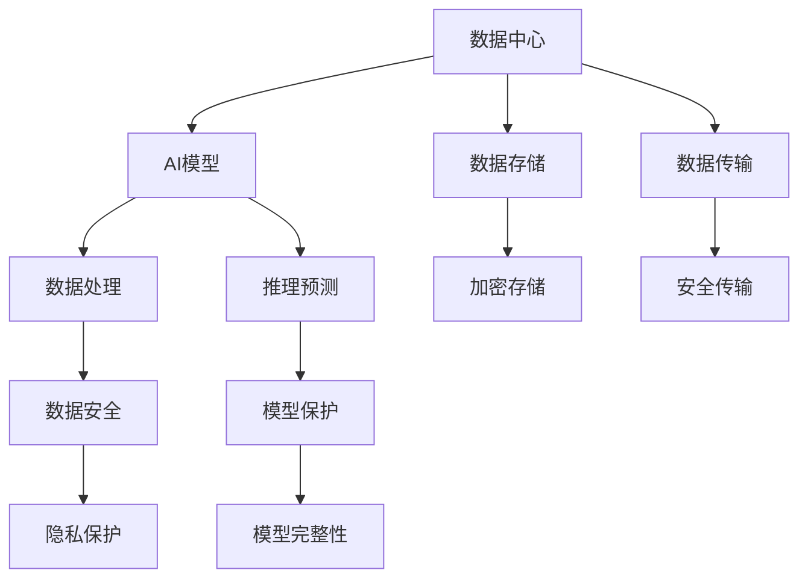

                 

# AI 大模型应用数据中心的数据安全

> 关键词：数据中心, 人工智能(AI), 数据安全, 隐私保护, 加密技术, 模型保护

## 1. 背景介绍

### 1.1 问题由来
随着人工智能(AI)技术在各行业的广泛应用，特别是基于大模型的AI应用，数据安全问题日益凸显。AI大模型通常依赖海量数据进行训练，这使得数据中心在数据收集、存储、处理、传输等环节的安全风险大幅提升。一旦数据中心被攻击，将直接影响AI模型的安全性、可靠性和隐私性。

### 1.2 问题核心关键点
AI大模型应用数据中心的数据安全问题主要包括以下几个方面：

- **数据泄露风险**：数据中心存储和处理的大规模数据可能被未授权访问，导致隐私泄露。
- **模型篡改风险**：数据中心存储的AI模型可能被篡改或注入恶意代码，影响模型的准确性和可信度。
- **性能损失风险**：数据中心不稳定的环境可能影响AI模型的性能和运行速度。
- **合规风险**：数据中心必须符合各地区的法律法规要求，否则可能面临法律和监管风险。

这些核心关键点表明，数据中心不仅是AI大模型运行的物理载体，更是保护数据安全、保障模型合规的重要环节。

## 2. 核心概念与联系

### 2.1 核心概念概述

为更好地理解数据中心在AI大模型应用中的数据安全问题，本节将介绍几个密切相关的核心概念：

- **数据中心**：由大量服务器、存储设备、网络设备等组成的物理设施，负责数据存储、处理和传输。
- **人工智能(AI)**：通过机器学习和深度学习等技术，实现数据处理、模型训练、推理预测等功能。
- **数据安全**：通过技术和管理手段，保护数据免受未授权访问、泄露和篡改的风险。
- **隐私保护**：确保数据处理和使用过程中，用户隐私不被侵犯。
- **加密技术**：通过算法转换数据，使其在未授权状态下难以解读。
- **模型保护**：确保AI模型在数据中心运行时，不被未授权修改和破坏。

这些核心概念之间的逻辑关系可以通过以下Mermaid流程图来展示：



这个流程图展示了大模型应用数据中心的核心概念及其之间的关系：

1. 数据中心通过存储设备(C)和网络设备(D)，对AI模型(B)所需的数据进行处理。
2. AI模型通过数据处理(E)和推理预测(F)，进行功能实现。
3. 数据存储(G)和数据传输(H)环节，必须确保数据的加密和安全传输。
4. 数据安全(I)和隐私保护(K)是保障数据中心数据完整性的基础。
5. 模型保护(L)确保AI模型在运行过程中不被篡改和破坏。

## 3. 核心算法原理 & 具体操作步骤

### 3.1 算法原理概述

数据中心在AI大模型应用中的数据安全问题，本质上是一个多维度的技术和管理问题。其核心思想是：通过多种技术手段，确保数据中心存储、传输、处理的数据不受未授权访问和篡改，同时保障AI模型的完整性和隐私性。

### 3.2 算法步骤详解

数据中心在AI大模型应用中的数据安全保护流程一般包括以下几个关键步骤：

**Step 1: 数据加密**

- **数据加密**：对存储和传输的数据进行加密处理，确保未授权者无法解读。
- **加密算法**：采用AES、RSA等高效加密算法，对数据进行对称加密或非对称加密。
- **密钥管理**：使用密钥管理系统，对加密密钥进行安全管理，防止密钥泄露。

**Step 2: 数据传输安全**

- **安全传输协议**：使用HTTPS、VPN等安全协议，确保数据传输过程中的安全性。
- **传输加密**：对传输的数据进行加密处理，防止中间人攻击。
- **传输审计**：记录和审计数据传输日志，及时发现异常行为。

**Step 3: 数据存储安全**

- **加密存储**：对存储的数据进行加密处理，防止数据泄露。
- **访问控制**：通过权限管理，限制对存储数据的访问权限，确保只有授权人员才能访问。
- **存储审计**：记录和审计存储日志，及时发现异常行为。

**Step 4: 数据处理安全**

- **数据脱敏**：对处理的数据进行脱敏处理，防止敏感信息泄露。
- **处理审计**：记录和审计数据处理日志，及时发现异常行为。
- **模型保护**：对AI模型进行保护，防止模型被篡改或注入恶意代码。

**Step 5: 数据合规**

- **合规管理**：确保数据中心的数据处理和使用符合各地区的法律法规要求。
- **法律审核**：定期进行法律审核，确保数据处理过程合规。
- **合规审计**：记录和审计合规日志，及时发现违规行为。

### 3.3 算法优缺点

数据中心在AI大模型应用中的数据安全保护方法，具有以下优点：

- **数据加密**：保障数据在传输和存储过程中的安全性，防止数据泄露和篡改。
- **安全传输**：通过安全协议和传输加密，防止中间人攻击和数据窃听。
- **访问控制**：通过权限管理，限制对数据的访问权限，防止未授权访问。
- **合规管理**：符合各地区的法律法规要求，减少法律风险。

同时，该方法也存在一定的局限性：

- **技术复杂性**：数据加密和安全传输需要采用复杂的加密算法和密钥管理系统，技术门槛较高。
- **性能损失**：加密和解密的计算开销较大，可能影响数据处理和传输的效率。
- **管理复杂性**：数据安全保护需要多种技术手段和管理措施，管理复杂度较高。
- **成本较高**：安全设备和软件的采购和维护成本较高，初期投资较大。

尽管存在这些局限性，但就目前而言，数据中心的数据安全保护方法仍是大模型应用的重要保障。未来相关研究的重点在于如何进一步降低技术和管理复杂度，提高性能，同时兼顾成本效益。

### 3.4 算法应用领域

数据中心在AI大模型应用中的数据安全保护方法，已经在诸多领域得到了广泛应用，包括但不限于：

- **金融行业**：处理和存储大量的客户交易数据，必须确保数据安全和隐私保护。
- **医疗行业**：存储和处理患者的医疗记录，必须遵守隐私法规，防止数据泄露。
- **公共安全**：存储和传输敏感的监控数据，必须确保数据安全和合规。
- **国防安全**：存储和传输重要情报数据，必须严格控制访问权限，防止数据泄露。
- **电子商务**：存储和传输用户购买数据，必须确保数据安全和隐私保护。

除了上述这些经典应用外，数据中心的数据安全保护方法也被创新性地应用到更多场景中，如智慧城市、智能交通、物联网等，为各行业的数字化转型提供了坚实的安全保障。

## 4. 数学模型和公式 & 详细讲解 & 举例说明

### 4.1 数学模型构建

本节将使用数学语言对数据中心在AI大模型应用中的数据安全保护过程进行更加严格的刻画。

假设存储在数据中心的数据集为 $D=\{d_i\}_{i=1}^N$，其中 $d_i$ 表示第 $i$ 条数据。定义加密函数 $E$ 和解密函数 $D$，其中 $E$ 为加密算法，$D$ 为解密算法。假设加密密钥为 $K$，则加密存储的数据集为 $E(D)=\{E(d_i)\}_{i=1}^N$。

### 4.2 公式推导过程

在数据中心进行加密存储时，主要使用对称加密算法。以下是一个简化的对称加密模型，假设使用AES算法：

1. **加密过程**：
$$
C = E(d_i, K) = d_i \oplus K
$$
其中 $\oplus$ 表示按位异或操作。

2. **解密过程**：
$$
d_i' = D(C, K) = C \oplus K
$$

为了确保加密和解密的安全性，密钥 $K$ 必须安全管理。通常使用密钥管理系统，对 $K$ 进行存储、分配、更换等操作，防止 $K$ 泄露。

### 4.3 案例分析与讲解

假设某金融公司需要存储大量的客户交易记录，这些记录包含客户的个人信息、交易金额、时间戳等信息，必须确保数据的安全性和隐私性。

**加密存储流程**：

1. **密钥管理**：使用密钥管理系统，对加密密钥 $K$ 进行安全管理，防止密钥泄露。
2. **数据加密**：对每条记录 $d_i$ 进行加密，生成加密后的记录 $E(d_i)$。
3. **安全存储**：将加密后的记录 $E(d_i)$ 存储在数据中心，确保数据的安全性。

**解密过程**：

1. **密钥管理**：根据访问权限，分配合适的加密密钥 $K$ 给授权人员。
2. **数据解密**：授权人员使用解密函数 $D$，将加密后的记录 $E(d_i)$ 解密成原始记录 $d_i'$。

通过上述加密存储和解密流程，可以确保金融公司客户交易记录在数据中心的安全性和隐私性。

## 5. 项目实践：代码实例和详细解释说明

### 5.1 开发环境搭建

在进行数据中心在AI大模型应用中的数据安全保护实践前，我们需要准备好开发环境。以下是使用Python进行PyTorch开发的环境配置流程：

1. 安装Anaconda：从官网下载并安装Anaconda，用于创建独立的Python环境。

2. 创建并激活虚拟环境：
```bash
conda create -n pytorch-env python=3.8 
conda activate pytorch-env
```

3. 安装PyTorch：根据CUDA版本，从官网获取对应的安装命令。例如：
```bash
conda install pytorch torchvision torchaudio cudatoolkit=11.1 -c pytorch -c conda-forge
```

4. 安装Transformers库：
```bash
pip install transformers
```

5. 安装各类工具包：
```bash
pip install numpy pandas scikit-learn matplotlib tqdm jupyter notebook ipython
```

完成上述步骤后，即可在`pytorch-env`环境中开始数据安全保护实践。

### 5.2 源代码详细实现

下面是使用Python实现数据加密和解密过程的示例代码：

```python
from cryptography.fernet import Fernet

# 生成密钥并加密数据
def encrypt_data(data):
    key = Fernet.generate_key()
    f = Fernet(key)
    encrypted_data = f.encrypt(data.encode())
    return encrypted_data, key

# 解密数据
def decrypt_data(encrypted_data, key):
    f = Fernet(key)
    decrypted_data = f.decrypt(encrypted_data).decode()
    return decrypted_data
```

### 5.3 代码解读与分析

让我们再详细解读一下关键代码的实现细节：

**encrypt_data函数**：
- 生成加密密钥
- 创建Fernet对象
- 对输入数据进行加密，并返回加密后的数据和密钥

**decrypt_data函数**：
- 创建Fernet对象
- 对加密后的数据进行解密，并返回解密后的原始数据

这两个函数实现了基本的对称加密和解密过程。需要注意的是，实际应用中，密钥的管理和分配需要采用更加安全的方式，如使用密钥管理系统。

**加密过程**：
```python
# 假设需要加密的数据为 text
encrypted_text, key = encrypt_data(text)
```

**解密过程**：
```python
# 假设需要解密的数据为 encrypted_text
decrypted_text = decrypt_data(encrypted_text, key)
```

通过上述代码，我们可以对文本数据进行加密和解密，保障数据的安全性。

## 6. 实际应用场景

### 6.1 金融行业

金融行业的数据中心必须存储和处理大量的客户交易数据，这些数据包含用户的个人信息、交易金额、时间戳等信息，必须确保数据的安全性和隐私性。数据中心可以采用对称加密算法，对存储的数据进行加密处理，确保未授权者无法解读。

**实际应用**：某金融公司使用AES算法对客户交易记录进行加密存储，密钥由密钥管理系统进行管理。授权人员根据访问权限，使用密钥进行解密，处理完数据后，将解密后的数据进行安全传输，防止数据泄露。

### 6.2 医疗行业

医疗行业的数据中心必须存储和处理患者的医疗记录，这些记录包含患者的个人信息、病史、诊断结果等敏感信息，必须遵守隐私法规，防止数据泄露。数据中心可以采用对称加密算法，对存储的数据进行加密处理，确保未授权者无法解读。

**实际应用**：某医院使用AES算法对患者医疗记录进行加密存储，密钥由密钥管理系统进行管理。授权医生根据访问权限，使用密钥进行解密，处理完数据后，将解密后的数据进行安全传输，防止数据泄露。

### 6.3 公共安全

公共安全领域的数据中心必须存储和传输敏感的监控数据，这些数据包含视频、音频、地理位置等敏感信息，必须确保数据的安全性和合规性。数据中心可以采用非对称加密算法，对存储的数据进行加密处理，确保未授权者无法解读。

**实际应用**：某城市监控中心使用RSA算法对监控视频进行加密存储，公钥对外公开，私钥由授权人员保管。授权人员根据访问权限，使用私钥进行解密，处理完数据后，将解密后的数据进行安全传输，防止数据泄露。

### 6.4 未来应用展望

随着大模型和微调技术的不断发展，数据中心在AI大模型应用中的数据安全保护也将迎来新的挑战和机遇。未来，数据中心的数据安全保护方法将呈现以下几个发展趋势：

1. **零信任架构**：通过最小权限原则和动态授权，减少数据泄露的风险。
2. **多因素认证**：通过生物识别、短信验证码等方式，进一步增强访问控制的安全性。
3. **人工智能辅助**：使用AI技术进行异常检测和入侵预防，提高数据中心的安全性。
4. **区块链技术**：通过区块链技术，确保数据传输的完整性和不可篡改性。
5. **隐私保护技术**：采用差分隐私、联邦学习等技术，保护用户隐私。

这些趋势表明，数据中心的数据安全保护将更加智能化、自动化、多样化，为AI大模型应用提供更坚实的安全保障。

## 7. 工具和资源推荐

### 7.1 学习资源推荐

为了帮助开发者系统掌握数据中心在AI大模型应用中的数据安全保护的理论基础和实践技巧，这里推荐一些优质的学习资源：

1. **《数据中心安全性》系列博文**：由数据中心安全专家撰写，深入浅出地介绍了数据中心的安全机制、加密算法、访问控制等核心技术。

2. **《数据安全与隐私保护》课程**：由各大高校和在线教育平台开设的NLP课程，涵盖数据加密、安全传输、隐私保护等关键主题，适合初学者学习。

3. **《数据中心技术手册》书籍**：详细介绍了数据中心的架构、设备、协议等核心技术，帮助开发者理解数据中心的基础知识。

4. **NIST数据中心安全指南**：美国国家标准与技术研究所发布的权威数据中心安全指南，提供了详尽的行业最佳实践和安全建议。

5. **Cloudflare安全博客**：定期发布关于Web应用、API安全的文章，涵盖了数据加密、安全传输、API防护等多个方面。

通过对这些资源的学习实践，相信你一定能够快速掌握数据中心在AI大模型应用中的数据安全保护精髓，并用于解决实际的NLP问题。

### 7.2 开发工具推荐

高效的开发离不开优秀的工具支持。以下是几款用于数据中心在AI大模型应用中的数据安全保护开发的常用工具：

1. **Python**：开源的编程语言，拥有丰富的数据处理和加密库，是数据安全保护的重要开发工具。

2. **PyTorch**：基于Python的开源深度学习框架，提供高效的数据处理和模型训练功能。

3. **TensorFlow**：由Google主导开发的开源深度学习框架，生产部署方便，适合大规模工程应用。

4. **OpenSSL**：开源的安全套接字层协议库，支持多种加密算法和协议，是数据安全保护的基础工具。

5. **AWS KMS**：亚马逊云服务的密钥管理服务，提供了安全密钥管理、加密和解密功能，适合数据中心的安全保护。

6. **GCP KMS**：谷歌云服务的密钥管理服务，提供了安全密钥管理、加密和解密功能，适合数据中心的安全保护。

合理利用这些工具，可以显著提升数据中心在AI大模型应用中的数据安全保护开发效率，加快创新迭代的步伐。

### 7.3 相关论文推荐

数据中心在AI大模型应用中的数据安全保护技术，已经得到了广泛的研究和应用。以下是几篇奠基性的相关论文，推荐阅读：

1. **《数据中心加密技术综述》**：综述了对称加密、非对称加密、公钥基础设施(PKI)等核心技术，适合入门学习。

2. **《基于区块链的数据安全技术》**：探讨了区块链技术在数据加密、安全传输、隐私保护等方面的应用，提供了新的思路。

3. **《数据中心安全架构设计》**：介绍了数据中心的架构设计、设备选择、协议配置等核心内容，适合实践参考。

4. **《基于人工智能的数据中心安全监控》**：研究了AI技术在异常检测、入侵预防中的应用，提高了数据中心的安全性。

5. **《数据隐私保护技术综述》**：综述了差分隐私、联邦学习等隐私保护技术，适合深入研究。

这些论文代表了大模型应用数据中心的数据安全保护技术的发展脉络。通过学习这些前沿成果，可以帮助研究者把握学科前进方向，激发更多的创新灵感。

## 8. 总结：未来发展趋势与挑战

### 8.1 总结

本文对数据中心在AI大模型应用中的数据安全保护问题进行了全面系统的介绍。首先阐述了数据中心存储和处理大规模数据的安全风险，明确了数据中心在AI大模型应用中的重要性。其次，从原理到实践，详细讲解了数据中心在AI大模型应用中的数据安全保护方法，给出了数据加密、安全传输、访问控制等核心步骤的代码实现。同时，本文还广泛探讨了数据中心在金融、医疗、公共安全等多个行业领域的数据安全保护应用，展示了数据中心技术的广泛应用前景。最后，本文精选了数据中心安全保护技术的各类学习资源，力求为读者提供全方位的技术指引。

通过本文的系统梳理，可以看到，数据中心在AI大模型应用中的数据安全保护，是一项多维度、多技术、多管理的复杂工程。通过在存储、传输、处理等环节采取多种措施，可以有效保障数据的安全性和隐私性，确保AI大模型的可靠性和合规性。未来，伴随数据中心技术的持续演进，大模型应用的数据安全保护将更加智能、高效、安全，为AI大模型的广泛应用提供坚实的保障。

### 8.2 未来发展趋势

展望未来，数据中心在AI大模型应用中的数据安全保护技术将呈现以下几个发展趋势：

1. **自动化安全管理**：通过AI技术进行自动化安全管理和决策，减少人工干预。
2. **智能化异常检测**：使用AI技术进行异常检测和入侵预防，提高数据中心的安全性。
3. **多技术融合**：将数据加密、访问控制、隐私保护等多项技术进行融合，形成更加全面、可靠的安全体系。
4. **区块链技术应用**：利用区块链技术的不可篡改性和透明性，增强数据中心的可信度和安全性。
5. **隐私计算技术**：采用隐私计算技术，在保护用户隐私的前提下，实现数据的协作和共享。

这些趋势表明，数据中心的数据安全保护将更加智能化、自动化、多样化，为AI大模型应用提供更坚实的安全保障。

### 8.3 面临的挑战

尽管数据中心在AI大模型应用中的数据安全保护技术已经取得了一定的进展，但在迈向更加智能化、普适化应用的过程中，仍面临诸多挑战：

1. **技术复杂性**：数据加密、安全传输、访问控制等技术都需要高水平的技术实现，技术门槛较高。
2. **性能损失**：加密和解密的计算开销较大，可能影响数据处理和传输的效率。
3. **管理复杂性**：数据安全保护需要多种技术手段和管理措施，管理复杂度较高。
4. **成本较高**：安全设备和软件的采购和维护成本较高，初期投资较大。
5. **安全漏洞**：安全协议和加密算法的漏洞可能导致数据泄露和篡改。
6. **法规合规**：各地区的法律法规要求不同，数据中心必须符合当地的法律法规要求，增加了合规难度。

这些挑战凸显了数据中心在AI大模型应用中的数据安全保护需要不断改进和优化。唯有在技术、管理、法规等多个层面协同发力，才能真正实现数据中心的安全保障目标。

### 8.4 研究展望

面对数据中心在AI大模型应用中的数据安全保护所面临的种种挑战，未来的研究需要在以下几个方面寻求新的突破：

1. **自动化安全管理**：开发更加智能化的安全管理工具，减少人工干预，提高安全管理的效率。
2. **智能化异常检测**：研究更加智能化的异常检测和入侵预防技术，提高数据中心的安全性。
3. **多技术融合**：将数据加密、访问控制、隐私保护等多项技术进行融合，形成更加全面、可靠的安全体系。
4. **区块链技术应用**：深入研究区块链技术在数据加密、安全传输、隐私保护等方面的应用，提供新的安全保障手段。
5. **隐私计算技术**：研究隐私计算技术在保护用户隐私的前提下，实现数据的协作和共享，提高数据中心的安全性和合规性。

这些研究方向的探索，必将引领数据中心在AI大模型应用中的数据安全保护技术迈向更高的台阶，为构建安全、可靠、可解释、可控的智能系统铺平道路。面向未来，数据中心技术还需要与其他人工智能技术进行更深入的融合，如知识表示、因果推理、强化学习等，多路径协同发力，共同推动自然语言理解和智能交互系统的进步。只有勇于创新、敢于突破，才能不断拓展语言模型的边界，让智能技术更好地造福人类社会。

## 9. 附录：常见问题与解答

**Q1：数据中心在AI大模型应用中的数据安全保护是否需要考虑隐私保护？**

A: 数据中心在AI大模型应用中的数据安全保护必须考虑隐私保护。在数据存储、传输和处理过程中，必须确保用户隐私不被侵犯，防止数据泄露和滥用。因此，数据中心需要采用多种隐私保护技术，如数据脱敏、差分隐私、联邦学习等，保护用户隐私。

**Q2：数据中心在AI大模型应用中的数据安全保护是否需要考虑法规合规？**

A: 数据中心在AI大模型应用中的数据安全保护必须考虑法规合规。不同国家和地区对数据存储、传输、处理等方面有不同法律法规要求。因此，数据中心必须符合当地法律法规，确保数据安全保护措施符合合规要求。

**Q3：数据中心在AI大模型应用中的数据安全保护是否需要考虑模型保护？**

A: 数据中心在AI大模型应用中的数据安全保护必须考虑模型保护。模型保护技术可以确保AI模型在存储和传输过程中不被篡改或注入恶意代码，确保模型完整性和安全性。因此，数据中心需要采用多种模型保护技术，如模型加密、水印技术、数字签名等，保护AI模型。

**Q4：数据中心在AI大模型应用中的数据安全保护是否需要考虑性能损失？**

A: 数据中心在AI大模型应用中的数据安全保护必须考虑性能损失。加密和解密的计算开销较大，可能影响数据处理和传输的效率。因此，数据中心需要优化加密算法和密钥管理策略，减少性能损失。

**Q5：数据中心在AI大模型应用中的数据安全保护是否需要考虑技术复杂性？**

A: 数据中心在AI大模型应用中的数据安全保护必须考虑技术复杂性。数据加密、安全传输、访问控制等技术都需要高水平的技术实现，技术门槛较高。因此，数据中心需要采用多种先进技术手段，提升安全管理的效率。

通过本文的系统梳理，可以看到，数据中心在AI大模型应用中的数据安全保护，是一项多维度、多技术、多管理的复杂工程。通过在存储、传输、处理等环节采取多种措施，可以有效保障数据的安全性和隐私性，确保AI大模型的可靠性和合规性。未来，伴随数据中心技术的持续演进，大模型应用的数据安全保护将更加智能、高效、安全，为AI大模型的广泛应用提供坚实的保障。

