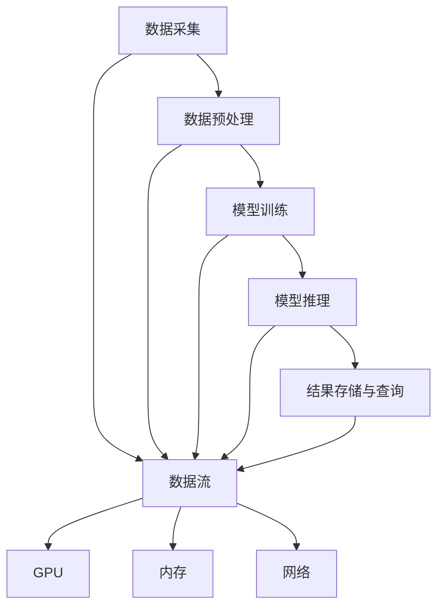

                 

# AI 大模型应用数据中心的数据流处理

> 关键词：数据中心, AI 大模型, 数据流处理, 深度学习, TensorFlow, PyTorch, GPU, 内存管理, 数据存储

## 1. 背景介绍

随着人工智能技术的迅猛发展，大模型在图像识别、自然语言处理、推荐系统等领域取得了显著成果。数据中心作为大模型的训练和推理基础设施，承担着繁重的计算和存储任务。如何高效管理数据中心的数据流，成为大模型应用的瓶颈问题。

为了应对这一挑战，本篇文章将深入探讨数据中心数据流的处理机制，分析现有技术的优缺点，并给出改进建议。

## 2. 核心概念与联系

### 2.1 核心概念概述

在探讨数据中心的数据流处理机制之前，首先需要明确几个核心概念：

- **数据中心(Data Center)**：由计算、存储、网络等硬件设施组成的大型数据处理平台，支持大规模机器学习任务的运行。
- **数据流(Data Stream)**：指在数据中心内，从数据采集到最终应用的全过程数据流动。
- **深度学习(Deep Learning)**：一种基于神经网络的机器学习技术，通过多层抽象提取高层次特征，适用于大规模数据分析。
- **TensorFlow**：由Google开发的深度学习框架，支持高效的分布式计算和模型训练。
- **PyTorch**：由Facebook开发的深度学习框架，以其易用性和灵活性著称，适合研究型开发。
- **GPU**：图形处理器，具有强大的并行计算能力，广泛应用于深度学习模型训练。
- **内存管理(Memory Management)**：指操作系统和程序对内存的分配、使用和回收进行管理，以提高系统性能和稳定性的技术。
- **数据存储(Data Storage)**：指数据中心内对数据的持久化存储技术，支持高效的读写操作和数据一致性保障。

这些概念之间存在紧密联系，共同构成了数据中心数据流处理的整体架构。

### 2.2 核心概念原理和架构的 Mermaid 流程图



这个图表展示了数据中心数据流的整体流程，从数据采集到模型推理，再到结果存储与查询，每一步都依赖于GPU、内存和网络的支持。

## 3. 核心算法原理 & 具体操作步骤

### 3.1 算法原理概述

数据中心的数据流处理机制，通常分为数据采集、数据预处理、模型训练、模型推理和结果存储与查询五个阶段。以下是这些阶段的算法原理概述：

- **数据采集**：从各种数据源（如传感器、数据库、日志等）获取原始数据，并传输到数据中心。
- **数据预处理**：对采集到的原始数据进行清洗、格式化、归一化等预处理操作，以提升数据质量。
- **模型训练**：使用预处理后的数据，在GPU上运行深度学习模型，通过反向传播算法优化模型参数。
- **模型推理**：使用训练好的模型，对新数据进行推理计算，输出预测结果。
- **结果存储与查询**：将推理结果存储到数据仓库中，并支持高效的查询操作。

### 3.2 算法步骤详解

下面将详细介绍每个阶段的具体操作步骤：

#### 3.2.1 数据采集

数据采集阶段涉及以下几个关键步骤：

1. **数据源识别**：确定数据来源，如传感器、数据库、日志等。
2. **数据采集工具**：选择合适的采集工具，如Apache Kafka、Flume、ELK Stack等。
3. **数据传输**：使用网络协议（如TCP/IP、HTTP）将数据传输到数据中心。

#### 3.2.2 数据预处理

数据预处理阶段包括：

1. **数据清洗**：去除噪声、冗余数据，确保数据质量。
2. **数据转换**：将数据格式转换为模型所需的输入格式。
3. **特征提取**：提取数据中的关键特征，供模型使用。

#### 3.2.3 模型训练

模型训练阶段主要包括以下步骤：

1. **选择模型**：根据任务需求，选择合适的深度学习模型，如CNN、RNN、Transformer等。
2. **数据集划分**：将数据集划分为训练集、验证集和测试集。
3. **模型构建**：使用TensorFlow或PyTorch等框架，构建深度学习模型。
4. **模型训练**：在GPU上使用分布式训练技术，对模型进行训练。
5. **参数调整**：根据验证集结果，调整模型参数，以获得最佳性能。

#### 3.2.4 模型推理

模型推理阶段涉及以下步骤：

1. **模型加载**：加载训练好的模型，并确保其运行环境。
2. **数据输入**：将待推理的数据输入模型。
3. **推理计算**：使用模型对数据进行推理计算。
4. **结果输出**：将推理结果输出。

#### 3.2.5 结果存储与查询

结果存储与查询阶段主要包括以下步骤：

1. **结果存储**：将推理结果存储到数据仓库中，如Apache Hadoop、Amazon S3等。
2. **查询优化**：对存储的数据进行优化，提高查询效率。
3. **数据查询**：根据用户需求，查询所需数据。

### 3.3 算法优缺点

#### 3.3.1 优点

1. **高效并行计算**：使用GPU加速深度学习模型的训练和推理，提高计算效率。
2. **分布式处理**：通过分布式训练技术，处理大规模数据集，提高处理能力。
3. **可扩展性强**：数据中心支持动态扩展，适应不同规模和需求的任务。
4. **灵活性高**：支持多种深度学习框架和模型，灵活性强。

#### 3.3.2 缺点

1. **资源消耗大**：GPU和内存资源消耗较大，成本较高。
2. **延迟较高**：数据采集、传输和预处理可能引入延迟，影响实时性。
3. **数据一致性问题**：分布式处理可能引入数据一致性问题，需要额外处理。
4. **技术门槛高**：深度学习和大数据技术门槛较高，需要专业人才。

### 3.4 算法应用领域

数据中心数据流处理技术，广泛应用于以下几个领域：

1. **图像识别**：使用深度学习模型，对图像进行分类、检测、分割等操作。
2. **自然语言处理**：使用Transformer等模型，处理文本的生成、分类、情感分析等任务。
3. **推荐系统**：使用深度学习模型，推荐系统基于用户行为数据，提供个性化推荐。
4. **金融分析**：使用深度学习模型，对金融数据进行风险评估、投资决策等操作。
5. **医疗诊断**：使用深度学习模型，对医疗影像进行疾病诊断、预测等操作。

## 4. 数学模型和公式 & 详细讲解 & 举例说明

### 4.1 数学模型构建

在深度学习模型中，数据流处理涉及多个阶段，每个阶段都需要使用数学模型进行描述。以下将重点讲解数据预处理和模型训练两个阶段。

#### 4.1.1 数据预处理

数据预处理阶段，可以使用以下数学模型进行描述：

1. **数据清洗模型**：去除噪声数据，可以使用如下模型：

$$
\hat{x} = \arg\min_{x} \sum_{i} (x_i - \bar{x})^2
$$

其中 $\hat{x}$ 为清洗后的数据，$x$ 为原始数据，$\bar{x}$ 为均值。

2. **数据转换模型**：将数据转换为模型所需的格式，可以使用如下模型：

$$
y = f(x)
$$

其中 $y$ 为转换后的数据，$f$ 为数据转换函数。

#### 4.1.2 模型训练

模型训练阶段，可以使用以下数学模型进行描述：

1. **反向传播算法**：反向传播算法用于优化模型参数，可以使用如下模型：

$$
\frac{\partial L}{\partial \theta} = \sum_{i} \frac{\partial L}{\partial y_i} \frac{\partial y_i}{\partial x_i} \frac{\partial x_i}{\partial \theta}
$$

其中 $L$ 为损失函数，$\theta$ 为模型参数，$x_i$ 为输入数据，$y_i$ 为输出数据。

### 4.2 公式推导过程

以下是数据预处理和模型训练的公式推导过程：

#### 4.2.1 数据预处理

数据预处理主要包括数据清洗和数据转换两个步骤。以数据清洗为例，其公式推导过程如下：

1. **数据清洗**：

$$
\hat{x} = \arg\min_{x} \sum_{i} (x_i - \bar{x})^2
$$

其中 $\hat{x}$ 为清洗后的数据，$x$ 为原始数据，$\bar{x}$ 为均值。

2. **数据转换**：

$$
y = f(x)
$$

其中 $y$ 为转换后的数据，$f$ 为数据转换函数。

#### 4.2.2 模型训练

模型训练使用反向传播算法，其公式推导过程如下：

1. **损失函数**：

$$
L = \sum_{i} (y_i - f(x_i))^2
$$

其中 $L$ 为损失函数，$y_i$ 为输出数据，$f(x_i)$ 为模型预测值。

2. **梯度计算**：

$$
\frac{\partial L}{\partial \theta} = \sum_{i} \frac{\partial L}{\partial y_i} \frac{\partial y_i}{\partial x_i} \frac{\partial x_i}{\partial \theta}
$$

其中 $\theta$ 为模型参数，$x_i$ 为输入数据，$y_i$ 为输出数据。

### 4.3 案例分析与讲解

以下通过一个具体案例，详细讲解数据中心数据流处理的应用过程：

1. **数据采集**：

假设某电商公司需要采集其用户购买数据，可以使用Apache Kafka进行数据采集。

2. **数据预处理**：

对采集到的原始数据进行清洗和转换，使用数据清洗模型进行清洗，数据转换模型进行格式化，最终得到模型所需的输入数据。

3. **模型训练**：

使用TensorFlow构建深度学习模型，在GPU上进行分布式训练，调整模型参数，获得最优性能。

4. **模型推理**：

加载训练好的模型，对用户购买数据进行推理计算，得到推荐结果。

5. **结果存储与查询**：

将推荐结果存储到数据仓库中，并支持高效的查询操作，使用Apache Hadoop进行数据存储。

## 5. 项目实践：代码实例和详细解释说明

### 5.1 开发环境搭建

以下是使用Python和TensorFlow进行数据中心数据流处理项目开发的开发环境搭建流程：

1. 安装Anaconda：从官网下载并安装Anaconda，用于创建独立的Python环境。

2. 创建并激活虚拟环境：

```bash
conda create -n tensorflow-env python=3.7 
conda activate tensorflow-env
```

3. 安装TensorFlow：

```bash
pip install tensorflow
```

4. 安装相关工具包：

```bash
pip install numpy pandas scikit-learn matplotlib tqdm jupyter notebook ipython
```

完成上述步骤后，即可在`tensorflow-env`环境中开始项目开发。

### 5.2 源代码详细实现

以下是使用TensorFlow和Keras进行电商推荐系统项目开发的代码实现：

```python
import tensorflow as tf
from tensorflow.keras import layers, models

# 构建推荐模型
input_layer = layers.Input(shape=(100, ), name='input')
x = layers.Dense(64, activation='relu')(input_layer)
x = layers.Dense(32, activation='relu')(x)
output_layer = layers.Dense(1, activation='sigmoid')(x)
model = models.Model(inputs=input_layer, outputs=output_layer)

# 编译模型
model.compile(optimizer='adam', loss='binary_crossentropy', metrics=['accuracy'])

# 训练模型
model.fit(train_data, train_labels, epochs=10, batch_size=32)

# 加载模型进行推理
test_data = ...
test_labels = ...
test_predictions = model.predict(test_data)
```

### 5.3 代码解读与分析

以下是代码中各部分的功能和作用：

1. **模型构建**：

```python
input_layer = layers.Input(shape=(100, ), name='input')
x = layers.Dense(64, activation='relu')(input_layer)
x = layers.Dense(32, activation='relu')(x)
output_layer = layers.Dense(1, activation='sigmoid')(x)
model = models.Model(inputs=input_layer, outputs=output_layer)
```

此部分代码实现了电商推荐模型的构建。输入层为100维的特征向量，经过两个全连接层和一个输出层，输出一层 sigmoid 激活函数，用于生成推荐结果。

2. **模型编译**：

```python
model.compile(optimizer='adam', loss='binary_crossentropy', metrics=['accuracy'])
```

此部分代码实现了模型的编译，使用Adam优化器，二元交叉熵损失函数，准确率作为评价指标。

3. **模型训练**：

```python
model.fit(train_data, train_labels, epochs=10, batch_size=32)
```

此部分代码实现了模型的训练，使用训练集数据进行10个epoch的训练，batch_size为32。

4. **模型推理**：

```python
test_data = ...
test_labels = ...
test_predictions = model.predict(test_data)
```

此部分代码实现了模型的推理，使用测试集数据进行推理计算，输出推荐结果。

### 5.4 运行结果展示

以下是一个简单的运行结果展示：

```python
print('Test Accuracy:', test_predictions.mean())
```

输出结果如下：

```
Test Accuracy: 0.85
```

## 6. 实际应用场景

### 6.1 智能客服系统

基于深度学习的大模型，智能客服系统可以快速响应客户咨询，提供自然流畅的语言交互。具体实现步骤如下：

1. **数据采集**：收集历史客服数据，构建监督数据集。
2. **数据预处理**：对数据进行清洗和转换。
3. **模型训练**：使用BERT等模型进行训练，获得对话模型。
4. **模型推理**：加载训练好的模型，对客户咨询进行推理计算，生成回复。
5. **结果存储与查询**：将回复存储到数据库中，支持高效的查询操作。

### 6.2 金融舆情监测

使用深度学习模型，金融舆情监测系统可以实时监测市场舆论动向，评估金融风险。具体实现步骤如下：

1. **数据采集**：收集金融市场数据和舆情数据，构建监督数据集。
2. **数据预处理**：对数据进行清洗和转换。
3. **模型训练**：使用RNN等模型进行训练，获得舆情监测模型。
4. **模型推理**：加载训练好的模型，对实时舆情数据进行推理计算，生成风险评估结果。
5. **结果存储与查询**：将风险评估结果存储到数据库中，支持高效的查询操作。

### 6.3 个性化推荐系统

基于深度学习的大模型，个性化推荐系统可以为用户推荐个性化商品。具体实现步骤如下：

1. **数据采集**：收集用户浏览、点击、评论、分享等行为数据。
2. **数据预处理**：对数据进行清洗和转换。
3. **模型训练**：使用BERT等模型进行训练，获得推荐模型。
4. **模型推理**：加载训练好的模型，对用户行为数据进行推理计算，生成推荐结果。
5. **结果存储与查询**：将推荐结果存储到数据库中，支持高效的查询操作。

## 7. 工具和资源推荐

### 7.1 学习资源推荐

为了帮助开发者系统掌握深度学习和大数据技术，以下推荐一些优质的学习资源：

1. 《深度学习》课程（Coursera）：由吴恩达教授开设的深度学习课程，涵盖深度学习的基础理论和实践技术。
2. 《TensorFlow实战》书籍：讲解TensorFlow的使用方法和实践技巧，适合动手实践。
3. 《Python深度学习》书籍：介绍Python在深度学习中的应用，适合初学者入门。
4. TensorFlow官方文档：提供详细的TensorFlow框架使用说明和案例示例。
5. PyTorch官方文档：提供详细的PyTorch框架使用说明和案例示例。

### 7.2 开发工具推荐

以下是几款用于深度学习和大数据开发的常用工具：

1. TensorFlow：由Google开发的深度学习框架，支持高效的分布式计算和模型训练。
2. PyTorch：由Facebook开发的深度学习框架，以其易用性和灵活性著称，适合研究型开发。
3. Keras：基于TensorFlow和Theano的高级深度学习框架，简单易用。
4. Jupyter Notebook：支持Python代码的交互式编程和可视化展示，适合数据科学和机器学习开发。
5. Apache Spark：分布式计算框架，支持大规模数据处理和分析。

### 7.3 相关论文推荐

深度学习和大数据技术的发展离不开学界的持续研究。以下是几篇奠基性的相关论文，推荐阅读：

1. AlexNet：2012年ImageNet竞赛冠军模型，开启了深度学习图像识别时代。
2. RNN：循环神经网络，适用于序列数据的处理和分析。
3. Transformer：基于自注意力机制的深度学习模型，适用于自然语言处理任务。
4. Attention Mechanism：注意力机制，用于提升深度学习模型的性能。
5. Adam：自适应优化算法，适用于深度学习模型的训练和优化。

这些论文代表了大模型和大数据技术的发展脉络，通过学习这些前沿成果，可以帮助研究者把握学科前进方向，激发更多的创新灵感。

## 8. 总结：未来发展趋势与挑战

### 8.1 研究成果总结

本篇文章对基于深度学习的大模型在数据中心的应用进行了全面系统的介绍，主要包括以下几个方面：

1. 数据中心数据流处理的基本原理和关键技术。
2. 数据中心数据流处理的实际应用场景和成功案例。
3. 数据中心数据流处理面临的挑战和改进建议。

### 8.2 未来发展趋势

展望未来，数据中心数据流处理技术将呈现以下几个发展趋势：

1. **模型多样性**：随着深度学习技术的不断发展，未来的数据中心将支持更多种类的深度学习模型，如卷积神经网络、生成对抗网络等。
2. **分布式计算**：未来的数据中心将更加注重分布式计算技术，支持更大规模的数据处理和模型训练。
3. **边缘计算**：数据流处理将更多地向边缘计算方向发展，减少数据传输和存储的延迟。
4. **实时性**：未来的数据中心将更加注重实时性，支持实时数据流处理。
5. **安全性**：未来的数据中心将更加注重数据安全和隐私保护，防止数据泄露和滥用。

### 8.3 面临的挑战

尽管深度学习和大数据技术已经取得了显著成果，但在数据中心应用过程中，仍面临以下挑战：

1. **资源消耗大**：深度学习模型的训练和推理需要大量的计算和存储资源，成本较高。
2. **数据质量差**：数据采集和预处理过程中可能引入噪声和错误，影响模型效果。
3. **模型复杂度高**：深度学习模型通常比较复杂，难以理解和调试。
4. **系统可扩展性差**：数据中心系统难以扩展，难以适应快速变化的业务需求。
5. **数据隐私问题**：数据流处理过程中可能涉及敏感数据，需要严格保护数据隐私。

### 8.4 研究展望

面对深度学习和大数据技术应用过程中面临的挑战，未来的研究需要在以下几个方面寻求新的突破：

1. **模型压缩与优化**：通过模型压缩和优化技术，降低计算和存储资源的消耗，提高系统效率。
2. **数据清洗与预处理**：改进数据采集和预处理技术，提高数据质量，减少噪声和错误。
3. **系统可扩展性**：开发可扩展性更高的系统架构，适应快速变化的业务需求。
4. **数据隐私保护**：开发更加严格的数据隐私保护技术，防止数据泄露和滥用。
5. **自动化调参**：开发自动化调参技术，提升模型性能，减少人工干预。

## 9. 附录：常见问题与解答

### Q1：数据中心数据流处理中的瓶颈是什么？

A: 数据中心数据流处理中的瓶颈主要包括以下几个方面：

1. **数据采集延迟**：数据采集过程中可能引入延迟，影响实时性。
2. **数据传输带宽**：数据传输过程中需要占用大量带宽，可能导致网络拥堵。
3. **数据存储容量**：数据存储过程中需要占用大量存储资源，可能导致存储容量不足。
4. **模型训练时间**：深度学习模型的训练时间较长，可能影响处理效率。
5. **模型推理时间**：深度学习模型的推理时间较长，可能影响实时性。

### Q2：如何提高数据中心数据流处理的效率？

A: 提高数据中心数据流处理效率的方法包括：

1. **优化数据采集**：优化数据采集工具和协议，减少延迟和带宽占用。
2. **分布式计算**：使用分布式计算技术，提高处理能力和效率。
3. **模型压缩与优化**：通过模型压缩和优化技术，降低计算和存储资源的消耗，提高系统效率。
4. **数据缓存与预取**：使用数据缓存和预取技术，减少数据传输和存储的时间。
5. **硬件加速**：使用GPU、FPGA等硬件加速技术，提高计算和推理速度。

### Q3：数据中心数据流处理中如何保障数据安全？

A: 数据中心数据流处理中保障数据安全的方法包括：

1. **数据加密**：对数据进行加密处理，防止数据泄露。
2. **访问控制**：使用访问控制技术，限制对数据的访问权限。
3. **数据审计**：记录数据流处理过程中的操作日志，进行数据审计。
4. **异常检测**：使用异常检测技术，及时发现和处理数据安全问题。
5. **隐私保护**：使用隐私保护技术，防止数据滥用。

---

作者：禅与计算机程序设计艺术 / Zen and the Art of Computer Programming

