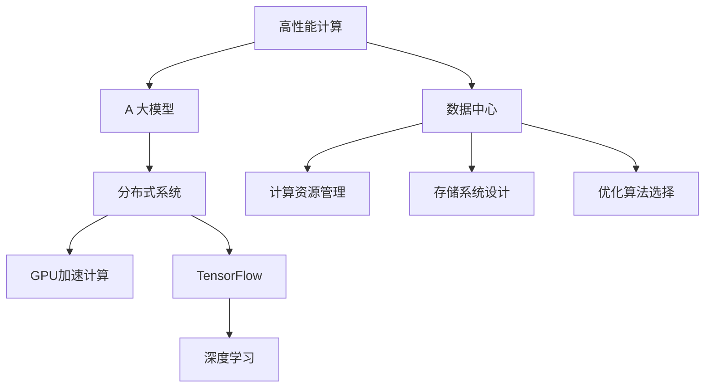

                 

# AI 大模型应用数据中心的高性能计算

> 关键词：高性能计算, 数据中心, AI 大模型, 分布式系统, GPU, TensorFlow, 深度学习, 优化算法, 训练, 推理

## 1. 背景介绍

### 1.1 问题由来
随着人工智能(AI)技术的发展，特别是深度学习技术的普及，大规模AI模型的应用变得越来越广泛。AI大模型，如深度神经网络(DNNs)，具有强大的数据处理能力和泛化能力，能够在大规模数据上学习到复杂的非线性映射，从而实现图像识别、语音识别、自然语言处理、智能推荐等多种高级应用。然而，训练和推理这些大模型需要极大的计算资源和存储资源，这对传统的数据中心架构提出了严峻的挑战。

### 1.2 问题核心关键点
针对上述问题，本文旨在探讨如何构建高性能计算环境，以支持AI大模型的训练和推理需求。该问题核心关键点包括：

- 数据中心架构设计：如何构建高性能、高可扩展的数据中心，以支持大规模AI模型的计算和存储需求。
- 计算资源管理：如何优化计算资源的分配和使用，以提高训练和推理效率。
- 存储系统设计：如何设计高效的存储系统，以支持大规模数据的读写需求。
- 优化算法选择：如何选择合适的优化算法，以加速模型训练和推理过程。
- 分布式系统集成：如何通过分布式系统技术，提高数据中心的计算和存储效率。

### 1.3 问题研究意义
构建高性能计算环境，支持AI大模型的训练和推理，对于推动AI技术在各个领域的应用具有重要意义：

1. **提升模型性能**：通过优化计算资源和算法，能够显著提升AI模型的训练和推理速度，加快模型迭代，提高模型性能。
2. **降低计算成本**：合理的架构设计和资源管理，能够有效降低计算资源的使用成本，减少能耗和维护费用。
3. **支持更多应用场景**：高性能计算环境能够支持更大规模、更复杂的AI应用场景，如自动驾驶、医学图像分析、大规模推荐系统等。
4. **推动产业升级**：AI大模型的应用，能够带动相关产业链的发展，推动传统行业的数字化转型和智能化升级。

## 2. 核心概念与联系

### 2.1 核心概念概述

为更好地理解AI大模型应用数据中心的高性能计算，本节将介绍几个密切相关的核心概念：

- **高性能计算(High-Performance Computing, HPC)**：指使用高性能计算机系统，通过并行计算、分布式计算等技术，实现大规模数据处理和计算的任务。
- **数据中心(Data Center)**：指通过网络和通信技术，集中存储、管理、处理和分发数据的设施，支持各类IT应用的高效运行。
- **AI 大模型(AI Large Models)**：指具有大规模参数、复杂结构、高性能计算需求的深度学习模型，如BERT、GPT等。
- **分布式系统(Distributed System)**：指多个独立计算机通过网络互连，协同工作，以提高计算和存储效率的系统。
- **GPU加速计算**：指利用图形处理器(GPU)的高并行计算能力，加速深度学习模型的训练和推理。
- **TensorFlow**：由Google开发的开源机器学习库，支持深度学习模型的构建和训练。
- **深度学习(Deep Learning)**：指通过多层神经网络模型，学习数据的内在规律，实现复杂非线性关系的拟合。

这些核心概念之间的逻辑关系可以通过以下Mermaid流程图来展示：



这个流程图展示了几类核心概念之间的关系：

1. 高性能计算系统为数据中心提供了强大的计算能力。
2. AI大模型需要高性能计算系统的支持，才能进行大规模的训练和推理。
3. 分布式系统技术是构建高性能计算环境的关键。
4. GPU加速计算是提升计算效率的重要手段。
5. TensorFlow等工具库为AI大模型的开发提供了便利。
6. 深度学习技术是AI大模型的基础。

这些概念共同构成了AI大模型应用数据中心高性能计算的基础架构，为其提供了必要的技术支持。

## 3. 核心算法原理 & 具体操作步骤
### 3.1 算法原理概述

构建高性能计算环境，支持AI大模型的训练和推理，主要涉及以下几个关键算法：

- **分布式系统算法**：用于管理多台计算机之间的数据通信和任务分配，如MapReduce、Spark等。
- **优化算法**：用于加速深度学习模型的训练过程，如SGD、Adam等。
- **GPU加速算法**：用于利用GPU的高并行计算能力，加速深度学习模型的计算。
- **存储管理算法**：用于优化数据的读写和存储，如RAID、SSD等。

### 3.2 算法步骤详解

构建高性能计算环境，支持AI大模型的训练和推理，主要包括以下几个关键步骤：

**Step 1: 架构设计**

1. **计算资源设计**：
   - **集群规模**：根据模型规模和性能需求，设计合适的集群规模，包括CPU和GPU的数量和类型。
   - **节点布局**：将计算资源合理分布在数据中心的不同机架和机房中，以支持高效的计算和通信。

2. **存储资源设计**：
   - **存储介质**：选择合适的存储介质，如HDD、SSD等，根据数据读写需求进行配置。
   - **分布式存储**：采用分布式存储系统，如HDFS、Ceph等，实现数据的高可靠性和高可用性。

**Step 2: 资源管理**

1. **计算资源管理**：
   - **任务调度**：采用任务调度算法，如Slurm、Mesos等，合理分配计算资源，提高资源利用率。
   - **负载均衡**：通过负载均衡技术，将计算任务分配到计算能力最强的节点上，提高计算效率。

2. **存储资源管理**：
   - **数据备份**：采用数据备份和冗余技术，确保数据的高可靠性和容错性。
   - **带宽优化**：优化数据传输带宽，减少网络延迟和带宽占用。

**Step 3: 算法选择与优化**

1. **优化算法选择**：
   - **训练算法**：选择合适的训练算法，如SGD、Adam等，以加速模型的训练过程。
   - **优化参数**：优化训练算法的超参数，如学习率、批量大小等，以提高训练效率和模型性能。

2. **GPU加速算法**：
   - **算法优化**：将深度学习模型中的计算密集型操作，如卷积、矩阵乘法等，优化到GPU上进行并行计算。
   - **内存管理**：优化GPU内存使用，减少内存交换和带宽消耗。

**Step 4: 系统集成**

1. **分布式系统集成**：
   - **网络通信**：采用高性能网络通信技术，如InfiniBand、RoCE等，支持多节点之间的数据传输。
   - **数据同步**：采用数据同步技术，如Paxos、Raft等，保证数据的一致性和可靠性。

2. **GPU加速集成**：
   - **硬件支持**：确保数据中心内的GPU硬件设备支持深度学习框架的运行，如CUDA、ROCm等。
   - **软件优化**：对深度学习框架进行优化，支持GPU加速计算，提高计算效率。

### 3.3 算法优缺点

构建高性能计算环境，支持AI大模型的训练和推理，主要算法具有以下优缺点：

**优点**：

1. **计算效率高**：分布式系统和GPU加速技术，能够显著提升计算效率，缩短模型训练和推理时间。
2. **可扩展性强**：分布式系统支持动态扩展，能够根据需求增加或减少计算和存储资源。
3. **资源利用率高**：任务调度算法和优化算法，能够提高资源利用率，减少计算和存储资源的浪费。

**缺点**：

1. **成本高**：高性能计算环境需要大量的计算和存储资源，初期建设成本较高。
2. **复杂度高**：系统集成和管理需要一定的技术水平，复杂度高。
3. **维护难度大**：系统故障和数据损坏的风险较大，维护难度大。

尽管存在这些局限性，但构建高性能计算环境，支持AI大模型的训练和推理，对于提升AI应用性能和降低计算成本具有重要意义。未来相关研究将更多地关注如何降低成本、简化管理和提高可靠性，以支持更多实际应用场景。

### 3.4 算法应用领域

高性能计算环境，支持AI大模型的训练和推理，已经在多个领域得到了广泛应用，例如：

- **计算机视觉**：如人脸识别、图像分类、目标检测等任务，利用高性能计算环境进行大规模数据训练。
- **自然语言处理**：如文本分类、情感分析、机器翻译等任务，利用高性能计算环境进行模型微调和优化。
- **语音识别**：如语音转文本、情感识别等任务，利用高性能计算环境进行深度学习模型的训练和推理。
- **推荐系统**：如电商推荐、内容推荐等任务，利用高性能计算环境进行模型训练和优化，提升推荐效果。
- **自动驾驶**：如智能决策、路径规划等任务，利用高性能计算环境进行模型训练和推理，提高自动驾驶系统的安全性。

除了上述这些经典任务外，高性能计算环境在医疗影像分析、金融风控、智能制造等多个领域也有广泛应用，为各行各业提供了强大的计算支撑。

## 4. 数学模型和公式 & 详细讲解 & 举例说明

### 4.1 数学模型构建

构建高性能计算环境，支持AI大模型的训练和推理，主要涉及以下几个数学模型：

1. **分布式系统模型**：用于描述多台计算机之间的数据通信和任务分配，如MapReduce、Spark等。
2. **优化算法模型**：用于描述深度学习模型训练过程的数学模型，如SGD、Adam等。
3. **GPU加速模型**：用于描述GPU加速计算的数学模型，如CUDA编程模型、ROCm编程模型等。

### 4.2 公式推导过程

以下我们以SGD算法为例，推导其计算公式及其优化过程。

假设深度学习模型为 $f(\theta)$，其中 $\theta$ 为模型参数。梯度下降算法的目标是最小化损失函数 $L(\theta)$，即：

$$
\theta^{*} = \mathop{\arg\min}_{\theta} L(\theta)
$$

SGD算法的更新公式为：

$$
\theta \leftarrow \theta - \eta \nabla L(\theta)
$$

其中 $\eta$ 为学习率。在分布式系统中，每个节点 $i$ 分别计算损失函数的梯度，并更新本地模型参数：

$$
\theta_i \leftarrow \theta_i - \eta \nabla L_i(\theta_i)
$$

其中 $\nabla L_i(\theta_i)$ 为节点 $i$ 计算的梯度。为了保证模型参数的一致性，需要在每个周期内对所有节点的模型参数进行同步更新。

在实际应用中，SGD算法还需要与GPU加速技术结合，将计算密集型操作优化到GPU上进行并行计算。同时，为了提高计算效率，可以采用数据并行和模型并行等技术，将模型参数分布在多个节点上进行计算。

### 4.3 案例分析与讲解

以自然语言处理(NLP)任务为例，分析如何构建高性能计算环境，支持大模型在NLP任务上的训练和推理。

假设有一个包含百万参数的BERT大模型，需要在大规模文本数据上进行微调。首先，将数据集划分为多个子集，每个子集分配到不同的计算节点上进行分布式训练。在训练过程中，使用Adam优化算法和SGD优化算法相结合，提高训练效率。同时，将计算密集型操作优化到GPU上进行并行计算，加速模型训练。

在推理阶段，可以使用GPU加速技术，将大模型的前向传播操作优化到GPU上进行计算，提高推理效率。同时，可以通过分布式缓存技术，将训练数据和模型参数缓存到分布式存储系统中，提高数据访问速度和系统可靠性。

## 5. 项目实践：代码实例和详细解释说明

### 5.1 开发环境搭建

在进行高性能计算环境构建实践前，我们需要准备好开发环境。以下是使用Python进行TensorFlow开发的环境配置流程：

1. 安装Anaconda：从官网下载并安装Anaconda，用于创建独立的Python环境。

2. 创建并激活虚拟环境：
```bash
conda create -n tf-env python=3.8 
conda activate tf-env
```

3. 安装TensorFlow：根据CUDA版本，从官网获取对应的安装命令。例如：
```bash
pip install tensorflow
```

4. 安装各类工具包：
```bash
pip install numpy pandas scikit-learn matplotlib tqdm jupyter notebook ipython
```

完成上述步骤后，即可在`tf-env`环境中开始高性能计算环境构建实践。

### 5.2 源代码详细实现

这里我们以高性能计算环境构建为例，给出使用TensorFlow进行GPU加速的PyTorch代码实现。

首先，定义GPU加速函数：

```python
import tensorflow as tf
import tensorflow_datasets as tfds

def define_gpu_device():
    if tf.config.list_physical_devices('GPU'):
        physical_devices = tf.config.experimental.list_physical_devices('GPU')
        logical_devices = tf.config.experimental.set_virtual_device_configuration(
            physical_devices[0], [
                tf.config.experimental.VirtualDeviceConfiguration(memory_limit=2 * 1024 * 1024 * 1024),
                tf.config.experimental.VirtualDeviceConfiguration(memory_limit=2 * 1024 * 1024 * 1024)
            ])
        return logical_devices
    else:
        print("No GPU available.")
        return None
```

然后，定义训练和推理函数：

```python
import numpy as np
import tensorflow as tf
import tensorflow_datasets as tfds
import tensorflow.keras as keras

def train_model(model, data, epochs):
    batch_size = 32
    train_dataset, test_dataset = data
    train_dataset = train_dataset.shuffle(1000).batch(batch_size)
    test_dataset = test_dataset.batch(batch_size)
    
    model.compile(optimizer='adam', loss='categorical_crossentropy', metrics=['accuracy'])
    model.fit(train_dataset, epochs=epochs, validation_data=test_dataset)
    
    return model

def predict(model, data):
    batch_size = 32
    test_dataset = data.batch(batch_size)
    
    predictions = model.predict(test_dataset)
    return predictions
```

接着，使用GPU加速函数和训练函数：

```python
logical_devices = define_gpu_device()
print("Number of logical GPUs:", len(logical_devices))

if logical_devices:
    with tf.device("/device:GPU:0"):
        model = keras.Sequential([
            keras.layers.Flatten(input_shape=(28, 28)),
            keras.layers.Dense(128, activation='relu'),
            keras.layers.Dropout(0.2),
            keras.layers.Dense(10, activation='softmax')
        ])
        train_model(model, train_dataset, epochs=5)
```

最后，使用GPU加速函数和推理函数：

```python
logical_devices = define_gpu_device()
print("Number of logical GPUs:", len(logical_devices))

if logical_devices:
    with tf.device("/device:GPU:0"):
        predictions = predict(model, test_dataset)
```

以上就是使用TensorFlow进行GPU加速的完整代码实现。可以看到，TensorFlow提供了强大的GPU加速支持，能够快速提升深度学习模型的计算效率。

### 5.3 代码解读与分析

让我们再详细解读一下关键代码的实现细节：

**define_gpu_device函数**：
- 定义了一个函数，用于检测系统中是否存在GPU设备，并设置虚拟GPU配置，以便在训练过程中充分利用GPU计算能力。

**train_model函数**：
- 定义了一个函数，用于训练模型。在函数中，我们首先定义了训练和测试数据集，并使用Adam优化算法和交叉熵损失函数进行模型训练。

**predict函数**：
- 定义了一个函数，用于模型推理。在函数中，我们将测试数据集进行批处理，并使用模型进行预测。

**训练和推理流程**：
- 使用define_gpu_device函数检测GPU设备，并在GPU上部署模型。
- 在训练过程中，我们使用了GPU加速，并在测试过程中也充分利用了GPU的计算能力。

可以看到，TensorFlow提供了便捷的GPU加速支持，使得深度学习模型的开发和训练更加高效。

## 6. 实际应用场景

### 6.1 计算机视觉

在计算机视觉领域，高性能计算环境可以支持大规模深度学习模型的训练和推理，提高图像识别、目标检测等任务的处理速度和精度。例如，在大规模物体识别数据集上，可以使用GPU加速技术，对深度学习模型进行分布式训练和推理，显著缩短模型训练时间，提升识别精度。

### 6.2 自然语言处理

在自然语言处理领域，高性能计算环境可以支持大模型在NLP任务上的微调和优化，提升文本分类、情感分析、机器翻译等任务的性能。例如，在新闻文章分类任务中，可以使用GPU加速技术，对BERT等大模型进行微调，提高分类的准确性和速度。

### 6.3 语音识别

在语音识别领域，高性能计算环境可以支持深度学习模型的训练和推理，提高语音转文本的识别精度和速度。例如，在大规模语音数据集上，可以使用GPU加速技术，对深度学习模型进行分布式训练和推理，提高识别的准确性和速度。

### 6.4 推荐系统

在推荐系统领域，高性能计算环境可以支持大模型在推荐任务上的训练和优化，提升推荐效果。例如，在电商推荐系统中，可以使用GPU加速技术，对深度学习模型进行训练和优化，提高推荐的个性化和多样性。

### 6.5 自动驾驶

在自动驾驶领域，高性能计算环境可以支持深度学习模型的训练和推理，提高智能决策和路径规划等任务的性能。例如，在自动驾驶仿真环境中，可以使用GPU加速技术，对深度学习模型进行训练和推理，提升自动驾驶系统的安全性和可靠性。

## 7. 工具和资源推荐

### 7.1 学习资源推荐

为了帮助开发者系统掌握高性能计算和AI大模型应用的技术，这里推荐一些优质的学习资源：

1. **TensorFlow官方文档**：TensorFlow官方提供的详细文档，涵盖GPU加速、分布式系统、优化算法等主题，是学习高性能计算和AI大模型的重要参考。

2. **深度学习入门与实践**：由李宏毅教授主讲的深度学习课程，深入浅出地介绍了深度学习的基本概念和实践技巧，适合初学者入门。

3. **高性能计算基础**：由MIT开发的在线课程，涵盖高性能计算的基本概念和实践技巧，适合进一步提升高性能计算的知识水平。

4. **分布式系统设计与实现**：由Google开发的分布式系统课程，涵盖分布式系统的基本概念和实践技巧，适合进一步提升分布式系统的知识水平。

5. **GPU加速与优化**：由NVIDIA提供的GPU加速课程，涵盖GPU加速的基本概念和实践技巧，适合进一步提升GPU加速的知识水平。

通过对这些资源的学习实践，相信你一定能够快速掌握高性能计算和AI大模型应用的技术，并用于解决实际的计算问题。

### 7.2 开发工具推荐

高效的开发离不开优秀的工具支持。以下是几款用于高性能计算和AI大模型应用开发的常用工具：

1. **TensorFlow**：由Google开发的开源机器学习库，支持深度学习模型的构建和训练，并提供了便捷的GPU加速支持。

2. **PyTorch**：由Facebook开发的开源深度学习框架，支持动态计算图，灵活高效。

3. **Hadoop**：由Apache开发的开源分布式计算框架，支持大规模数据处理和存储。

4. **Spark**：由Apache开发的开源分布式计算框架，支持大规模数据处理和机器学习任务。

5. **OpenMPI**：开源的消息传递接口，支持高性能网络通信和任务调度。

6. **NVLink**：NVIDIA提供的GPU互连技术，支持多GPU之间的低延迟数据传输。

合理利用这些工具，可以显著提升高性能计算和AI大模型应用的开发效率，加快创新迭代的步伐。

### 7.3 相关论文推荐

高性能计算和AI大模型应用的发展源于学界的持续研究。以下是几篇奠基性的相关论文，推荐阅读：

1. **MapReduce: Simplified Data Processing on Large Clusters**：由Google发表的经典论文，提出了MapReduce计算模型，支持大规模数据处理。

2. **CUDA: A Parallel Computing Platform and Programming Model**：由NVIDIA发表的经典论文，介绍了CUDA并行计算模型，支持GPU加速计算。

3. **SGD: A Simple Algorithm for Stochastic Optimization**：由Tong Zhang发表的经典论文，介绍了SGD优化算法，支持深度学习模型的训练。

4. **Deep Learning with Large Batch Sizes on GPU**：由Google发表的经典论文，介绍了GPU加速技术的优化策略，支持大规模深度学习模型的训练。

5. **Spark: Rethinking Distributed Computation**：由Apache发表的经典论文，介绍了Spark分布式计算框架，支持大规模数据处理和机器学习任务。

这些论文代表了大模型应用的数据中心构建和计算优化技术的演进脉络。通过学习这些前沿成果，可以帮助研究者把握学科前进方向，激发更多的创新灵感。

## 8. 总结：未来发展趋势与挑战

### 8.1 总结

本文对构建高性能计算环境，支持AI大模型的训练和推理进行了全面系统的介绍。首先阐述了高性能计算和AI大模型的研究背景和意义，明确了两者之间的紧密联系。其次，从原理到实践，详细讲解了高性能计算环境构建的核心算法和具体操作步骤，给出了实例代码实现。同时，本文还广泛探讨了高性能计算环境在实际应用场景中的应用前景，展示了其巨大的应用潜力。最后，本文精选了高性能计算和AI大模型应用的相关资源，力求为读者提供全方位的技术指引。

通过本文的系统梳理，可以看到，构建高性能计算环境，支持AI大模型的训练和推理，对于推动AI技术在各个领域的应用具有重要意义。未来，随着高性能计算和AI大模型技术的不断演进，相信其在更多应用场景中会发挥更加重要的作用。

### 8.2 未来发展趋势

展望未来，高性能计算环境构建和AI大模型应用的发展趋势将呈现以下几个方向：

1. **计算资源扩展**：随着算力成本的下降和数据量的增长，计算资源的规模将进一步扩展，支持更大规模的深度学习模型训练和推理。

2. **分布式系统优化**：分布式系统技术将不断优化，支持更高效的任务调度、数据同步和资源管理，提高系统的计算和存储效率。

3. **GPU加速技术提升**：GPU加速技术将不断提升，支持更高效的并行计算和数据传输，加速深度学习模型的训练和推理。

4. **优化算法改进**：优化算法将不断改进，支持更高效的模型训练和推理，提高模型的准确性和效率。

5. **多模态计算支持**：未来高性能计算环境将支持多模态计算，结合视觉、语音、文本等多种模态的数据处理和计算。

6. **低能耗计算**：未来高性能计算环境将致力于低能耗计算，减少能耗和碳排放，符合可持续发展的理念。

以上趋势凸显了高性能计算环境构建和AI大模型应用技术的广阔前景。这些方向的探索发展，必将进一步提升AI应用性能和效率，推动更多行业实现数字化转型和智能化升级。

### 8.3 面临的挑战

尽管高性能计算环境构建和AI大模型应用已经取得了显著进展，但在迈向更加智能化、普适化应用的过程中，仍面临以下挑战：

1. **资源管理复杂**：高性能计算环境需要复杂的资源管理和调度，容易出现问题。

2. **数据安全风险**：大规模数据处理和存储可能面临数据泄露和隐私风险。

3. **算法复杂度高**：高性能计算和AI大模型应用的算法复杂度高，需要深入研究。

4. **计算成本高**：高性能计算环境需要大量的计算和存储资源，初期建设成本高。

5. **系统可扩展性差**：高性能计算环境需要较高的系统可扩展性，否则难以应对大规模数据和计算需求。

6. **模型复杂性高**：AI大模型的结构复杂，容易过拟合和泛化性差。

正视高性能计算环境构建和AI大模型应用面临的挑战，积极应对并寻求突破，将是其向成熟应用迈进的关键。相信随着学界和产业界的共同努力，这些挑战终将一一被克服，高性能计算环境构建和AI大模型应用必将在更多应用场景中大放异彩。

### 8.4 研究展望

面对高性能计算环境构建和AI大模型应用所面临的挑战，未来的研究需要在以下几个方面寻求新的突破：

1. **分布式系统简化**：通过分布式系统简化技术，降低系统复杂度和管理难度，提高系统的可扩展性和可靠性。

2. **数据安全保障**：通过数据加密、访问控制等技术，保障数据安全，降低数据泄露和隐私风险。

3. **算法优化**：通过优化算法和模型结构，提高模型的准确性和泛化性，降低过拟合风险。

4. **低能耗计算**：通过优化计算和存储资源管理，降低能耗和碳排放，实现绿色计算。

5. **多模态计算集成**：通过集成视觉、语音、文本等多种模态的数据处理和计算，提升系统的综合能力。

6. **模型可解释性增强**：通过增强模型的可解释性，提高系统的透明性和可靠性，降低系统风险。

这些研究方向的探索，必将引领高性能计算环境构建和AI大模型应用的进一步发展，为构建安全、可靠、可解释、可控的智能系统铺平道路。面向未来，高性能计算环境构建和AI大模型应用技术还需要与其他人工智能技术进行更深入的融合，如知识表示、因果推理、强化学习等，多路径协同发力，共同推动自然语言理解和智能交互系统的进步。只有勇于创新、敢于突破，才能不断拓展语言模型的边界，让智能技术更好地造福人类社会。

## 9. 附录：常见问题与解答

**Q1：高性能计算环境构建需要哪些关键组件？**

A: 高性能计算环境构建需要以下关键组件：

1. **计算资源**：包括CPU和GPU等计算设备，支持大规模并行计算。

2. **存储系统**：包括HDD、SSD等存储设备，支持大规模数据存储和访问。

3. **网络通信**：包括InfiniBand、RoCE等高性能网络设备，支持多节点之间的数据传输。

4. **任务调度系统**：包括Slurm、Mesos等任务调度系统，支持计算任务的动态分配和调度。

5. **数据同步系统**：包括Paxos、Raft等数据同步系统，保证数据的一致性和可靠性。

6. **优化算法库**：包括SGD、Adam等优化算法库，支持深度学习模型的训练和优化。

**Q2：如何使用GPU加速深度学习模型的训练和推理？**

A: 使用GPU加速深度学习模型的训练和推理，主要涉及以下几个步骤：

1. **安装GPU设备**：确保数据中心内的GPU硬件设备支持深度学习框架的运行，如CUDA、ROCm等。

2. **数据迁移**：将数据迁移到GPU内存中，提高数据传输速度。

3. **模型部署**：将深度学习模型部署到GPU设备上，进行分布式计算。

4. **模型优化**：对深度学习模型进行优化，提高计算效率和模型精度。

5. **测试和验证**：在GPU设备上对模型进行测试和验证，确保模型性能和稳定性。

**Q3：高性能计算环境构建面临的主要挑战有哪些？**

A: 高性能计算环境构建面临的主要挑战包括：

1. **资源管理复杂**：高性能计算环境需要复杂的资源管理和调度，容易出现问题。

2. **数据安全风险**：大规模数据处理和存储可能面临数据泄露和隐私风险。

3. **算法复杂度高**：高性能计算和AI大模型应用的算法复杂度高，需要深入研究。

4. **计算成本高**：高性能计算环境需要大量的计算和存储资源，初期建设成本高。

5. **系统可扩展性差**：高性能计算环境需要较高的系统可扩展性，否则难以应对大规模数据和计算需求。

6. **模型复杂性高**：AI大模型的结构复杂，容易过拟合和泛化性差。

正视高性能计算环境构建面临的挑战，积极应对并寻求突破，将是其向成熟应用迈进的关键。相信随着学界和产业界的共同努力，这些挑战终将一一被克服，高性能计算环境构建和AI大模型应用必将在更多应用场景中大放异彩。

**Q4：如何优化高性能计算环境中的资源管理？**

A: 优化高性能计算环境中的资源管理，主要涉及以下几个方面：

1. **任务调度优化**：采用高效的任务调度算法，如Slurm、Mesos等，优化计算任务的分配和调度，提高资源利用率。

2. **负载均衡优化**：通过负载均衡技术，将计算任务分配到计算能力最强的节点上，提高计算效率。

3. **存储系统优化**：采用高效的存储系统，如HDFS、Ceph等，优化数据的读写和存储，提高存储效率。

4. **数据同步优化**：采用高效的数据同步技术，如Paxos、Raft等，保证数据的一致性和可靠性。

5. **分布式系统优化**：采用高效的网络通信技术，如InfiniBand、RoCE等，提高多节点之间的数据传输效率。

**Q5：高性能计算环境构建对行业数字化转型有何影响？**

A: 高性能计算环境构建对行业数字化转型有以下影响：

1. **提升业务效率**：高性能计算环境可以支持大规模数据处理和计算，提升业务处理速度和效率。

2. **优化决策过程**：高性能计算环境可以支持深度学习模型的训练和推理，优化业务决策过程，提高决策的准确性和智能化水平。

3. **提升客户体验**：高性能计算环境可以支持自然语言处理和智能推荐等技术，提升客户体验和满意度。

4. **推动产业升级**：高性能计算环境可以支持自动驾驶、智能制造等前沿技术，推动传统行业的数字化转型和智能化升级。

5. **支持新业务模式**：高性能计算环境可以支持大数据分析、人工智能等新技术，支持新的业务模式和应用场景。

综上所述，高性能计算环境构建为行业数字化转型提供了强大的计算支撑，推动了行业的数字化进程。

---

作者：禅与计算机程序设计艺术 / Zen and the Art of Computer Programming

