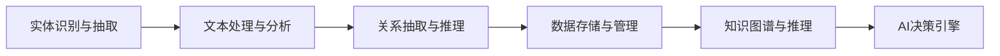

                 

# AI2.0时代：数字实体自动化的潜力

## 1. 背景介绍

### 1.1 问题由来

随着人工智能(AI)技术的不断进步，尤其是AI2.0时代的到来，数字实体自动化成为新一代技术趋势。AI2.0不仅仅指的是智能水平的提升，更意味着其在多个领域中应用的深入和广泛。这一时代，AI正逐渐从智能工具演变为行业应用中的关键驱动者，进一步推动了各行各业的数字化转型。

数字实体自动化的核心是将传统业务实体（如物品、文档、客户等）进行数字化处理，并利用AI技术进行自动化管理、分析与优化。这一过程不仅提升了工作效率，降低了人工错误，还提供了更强大的数据洞察，帮助企业更好地理解市场趋势和用户需求。

### 1.2 问题核心关键点

数字实体自动化主要聚焦于以下几个方面：
- **数据采集与整合**：从不同的数据源收集并整合实体的数据。
- **数据存储与管理**：通过高效的数据存储技术，保障数据的可靠性和可访问性。
- **数据处理与分析**：利用AI技术对收集到的数据进行自动化处理和分析。
- **决策支持**：基于数据分析结果，为业务决策提供数据支撑。

本文将深入探讨数字实体自动化的核心算法与操作步骤，通过理论和实践相结合的方式，详细解读该领域的最新进展与挑战。

## 2. 核心概念与联系

### 2.1 核心概念概述

为了更好地理解数字实体自动化的过程，首先需要明确以下核心概念：

- **实体识别与抽取**：从文本中识别和抽取实体，如人名、地点、组织等。实体识别是数字实体自动化的基础。
- **文本处理与分析**：包括文本清洗、词性标注、命名实体识别等。文本处理是实体抽取和分析的关键步骤。
- **关系抽取与推理**：从文本中抽取实体间的语义关系，如主谓宾关系、属性值等。关系抽取为后续的推理和分析提供支撑。
- **数据存储与管理**：通过数据库、数据湖等技术，实现数据的长期存储和高效管理。
- **知识图谱与推理**：构建实体和关系组成的知识图谱，通过图谱进行更高级的推理与查询。
- **AI决策引擎**：利用机器学习、深度学习等技术，实现对实体数据的自动决策支持。

这些核心概念之间相互联系，共同构成了数字实体自动化的完整流程。以下通过Mermaid流程图来展示这些概念之间的逻辑关系：



### 2.2 核心概念原理和架构

**实体识别与抽取**：
- **原理**：利用自然语言处理(NLP)技术，从文本中识别并抽取指定的实体。常用的方法包括基于规则、基于统计、基于深度学习等。
- **架构**：实体识别系统通常包括预处理、特征提取、模型训练和后处理等模块。预处理包括文本清洗、分词、词性标注等；特征提取使用TF-IDF、词向量等技术；模型训练多采用RNN、CNN、BERT等架构；后处理包括歧义消解、去重等。

**文本处理与分析**：
- **原理**：对原始文本进行清洗、标准化、分词、词性标注、命名实体识别等处理，提取文本中的关键信息。
- **架构**：文本处理系统包括文本清洗模块、分词模块、词性标注模块、命名实体识别模块等。常用工具包括NLTK、spaCy、StanfordNLP等。

**关系抽取与推理**：
- **原理**：从文本中抽取实体之间的关系，如主谓宾关系、属性值等。常用的关系抽取方法包括基于规则、基于模板、基于深度学习等。
- **架构**：关系抽取系统包括实体抽取模块、关系抽取模块、关系推理模块等。常用的模型包括基于图神经网络的模型，如GAT、GraphSAGE等。

**数据存储与管理**：
- **原理**：通过高效的数据存储技术，如Hadoop、Spark等，实现大规模数据的存储与处理。
- **架构**：数据存储管理系统包括数据存储模块、数据管理模块、数据访问模块等。常用工具包括HDFS、Hive、Spark等。

**知识图谱与推理**：
- **原理**：构建实体和关系组成的知识图谱，通过图谱进行更高级的推理与查询。知识图谱通常采用图数据库存储，如Neo4j、ArangoDB等。
- **架构**：知识图谱系统包括知识图谱构建模块、图谱查询模块、图谱推理模块等。常用的技术包括基于图神经网络的知识图谱嵌入，如TransE、GNN等。

**AI决策引擎**：
- **原理**：利用机器学习、深度学习等技术，实现对实体数据的自动决策支持。常用的方法包括决策树、支持向量机、深度神经网络等。
- **架构**：决策引擎系统包括数据输入模块、特征工程模块、模型训练模块、决策输出模块等。常用的工具包括TensorFlow、PyTorch、Scikit-Learn等。

这些核心概念通过相互协作，形成了数字实体自动化的完整流程，为各行各业提供了强大的数据管理和智能决策支持。

## 3. 核心算法原理 & 具体操作步骤

### 3.1 算法原理概述

数字实体自动化的算法原理主要基于以下三个步骤：
1. **数据采集与整合**：从不同数据源收集并整合实体的数据。
2. **数据处理与分析**：利用AI技术对收集到的数据进行自动化处理和分析。
3. **数据存储与管理**：通过高效的数据存储技术，保障数据的可靠性和可访问性。

其中，数据处理与分析是核心步骤，涉及文本处理、实体识别、关系抽取、推理等环节。以下将详细阐述这些步骤。

### 3.2 算法步骤详解

#### 3.2.1 数据采集与整合

数据采集与整合是数字实体自动化的基础。其步骤包括：
- **数据源确定**：明确需要采集的数据源，如网站、社交媒体、文档等。
- **数据收集**：使用爬虫、API等手段从数据源收集数据。
- **数据清洗**：去除噪声、去重、标准化数据格式等。
- **数据整合**：将来自不同数据源的数据进行整合，形成统一的数据集合。

#### 3.2.2 数据处理与分析

数据处理与分析是数字实体自动化的关键步骤，其目的是从文本中提取有用的信息。主要步骤如下：
- **文本预处理**：包括文本清洗、分词、词性标注、命名实体识别等。
- **实体抽取**：从文本中识别并抽取实体，如人名、地点、组织等。
- **关系抽取**：从文本中抽取实体之间的关系，如主谓宾关系、属性值等。
- **数据融合**：将不同来源的数据进行融合，形成更加全面的数据视图。

#### 3.2.3 数据存储与管理

数据存储与管理是数字实体自动化的保障。主要步骤如下：
- **数据存储**：通过高效的数据存储技术，如Hadoop、Spark等，实现大规模数据的存储与处理。
- **数据管理**：利用数据管理工具，如Hive、Impala等，对数据进行管理和查询。
- **元数据管理**：管理数据的元信息，如数据来源、格式、更新时间等。

### 3.3 算法优缺点

**优点**：
- **提升效率**：自动化处理数据，减少人工操作，提升效率。
- **降低成本**：减少人力成本和运营成本，提高企业竞争力。
- **数据驱动决策**：提供更全面的数据洞察，帮助企业进行更科学、精准的决策。

**缺点**：
- **技术门槛高**：需要较高的技术门槛，涉及多个领域的知识。
- **数据隐私问题**：涉及大量敏感数据，需注意数据隐私和安全性。
- **模型性能依赖数据质量**：模型性能高度依赖数据的质量和完整性。

### 3.4 算法应用领域

数字实体自动化的应用领域非常广泛，涵盖多个行业。以下是几个典型的应用场景：

#### 3.4.1 金融领域

- **应用**：自动化处理金融数据，如交易记录、客户信息等。
- **案例**：金融机构利用AI技术自动处理客户的财务报表，提取关键财务数据，为风险评估提供支持。

#### 3.4.2 医疗领域

- **应用**：自动化处理医疗数据，如病历、检查报告等。
- **案例**：医疗机构利用AI技术自动处理病历数据，提取关键信息，为疾病诊断和治疗提供支持。

#### 3.4.3 电商领域

- **应用**：自动化处理电商数据，如商品信息、用户行为等。
- **案例**：电商平台利用AI技术自动处理用户评论，提取关键信息，为商品推荐和市场分析提供支持。

#### 3.4.4 物流领域

- **应用**：自动化处理物流数据，如订单信息、配送记录等。
- **案例**：物流公司利用AI技术自动处理订单数据，优化配送路线，提高配送效率。

## 4. 数学模型和公式 & 详细讲解

### 4.1 数学模型构建

数字实体自动化的数学模型主要涉及以下内容：
- **文本表示**：将文本转化为数学向量表示，便于后续处理。
- **实体识别**：利用自然语言处理技术，从文本中识别实体。
- **关系抽取**：从文本中抽取实体之间的关系，构建知识图谱。
- **推理与查询**：在知识图谱上进行推理与查询。

#### 4.1.1 文本表示

文本表示是数字实体自动化的基础。常用的文本表示方法包括词袋模型、TF-IDF、词向量等。其中，词向量方法通过神经网络学习单词的向量表示，能够更好地捕捉单词之间的语义关系。

常用的词向量模型包括Word2Vec、GloVe、FastText等。这些模型通过训练神经网络，将单词映射为低维向量，每个单词在向量空间中都有其独特的表示。

#### 4.1.2 实体识别

实体识别是数字实体自动化的核心步骤。常用的实体识别方法包括基于规则、基于统计、基于深度学习等。

**基于规则的方法**：利用正则表达式、词典匹配等方法，从文本中识别实体。
**基于统计的方法**：利用统计模型，如条件随机场、最大熵模型等，从文本中识别实体。
**基于深度学习的方法**：利用神经网络，如BiLSTM、CRF等，从文本中识别实体。

#### 4.1.3 关系抽取

关系抽取是数字实体自动化的关键步骤。常用的关系抽取方法包括基于规则、基于模板、基于深度学习等。

**基于规则的方法**：利用规则库，从文本中抽取实体之间的关系。
**基于模板的方法**：利用预定义的模板，从文本中抽取实体之间的关系。
**基于深度学习的方法**：利用神经网络，如BERT、GAT等，从文本中抽取实体之间的关系。

#### 4.1.4 推理与查询

推理与查询是数字实体自动化的高级步骤。常用的方法包括基于图神经网络的方法，如TransE、GNN等。

**基于图神经网络的方法**：利用图神经网络，从知识图谱中推理实体之间的关系，进行高级查询。

### 4.2 公式推导过程

#### 4.2.1 文本表示

文本表示的公式推导过程如下：

设文本 $T$ 包含 $N$ 个单词，每个单词 $w_i$ 对应的词向量为 $v_i$，文本向量表示为 $V$。则文本向量 $V$ 可以表示为：

$$
V = \sum_{i=1}^{N} v_i
$$

其中，$v_i$ 是单词 $w_i$ 的词向量表示。

#### 4.2.2 实体识别

实体识别的公式推导过程如下：

设文本 $T$ 中包含 $M$ 个实体，每个实体 $e_j$ 对应的实体向量为 $u_j$，实体向量表示为 $U$。则实体向量 $U$ 可以表示为：

$$
U = \sum_{j=1}^{M} u_j
$$

其中，$u_j$ 是实体 $e_j$ 的实体向量表示。

#### 4.2.3 关系抽取

关系抽取的公式推导过程如下：

设文本 $T$ 中包含 $R$ 个关系，每个关系 $r_k$ 对应的关系向量为 $p_k$，关系向量表示为 $P$。则关系向量 $P$ 可以表示为：

$$
P = \sum_{k=1}^{R} p_k
$$

其中，$p_k$ 是关系 $r_k$ 的关系向量表示。

#### 4.2.4 推理与查询

推理与查询的公式推导过程如下：

设知识图谱 $G$ 包含 $E$ 个实体节点和 $R$ 个关系边，每个实体节点 $n_i$ 对应的节点向量为 $q_i$，关系边 $e_j$ 对应的边向量为 $q_j$，节点向量表示为 $Q$，边向量表示为 $E$。则节点向量 $Q$ 和边向量 $E$ 可以表示为：

$$
Q = \sum_{i=1}^{E} q_i
$$

$$
E = \sum_{j=1}^{R} q_j
$$

其中，$q_i$ 是节点 $n_i$ 的节点向量表示，$q_j$ 是边 $e_j$ 的边向量表示。

### 4.3 案例分析与讲解

#### 4.3.1 文本表示案例

假设有一个电商网站，需要从用户评论中提取商品信息。可以先将评论转化为TF-IDF向量，再使用Word2Vec模型将单词映射为词向量，最后将所有词向量求和，得到文本向量。

**步骤**：
1. 对评论进行分词，去除停用词。
2. 使用TF-IDF算法计算每个单词的重要性。
3. 使用Word2Vec模型训练单词的词向量。
4. 将所有词向量求和，得到文本向量。

#### 4.3.2 实体识别案例

假设需要从医疗文本中提取病人信息和药物信息。可以先将文本转化为TF-IDF向量，再使用BiLSTM模型进行实体识别。

**步骤**：
1. 对文本进行分词，去除停用词。
2. 使用TF-IDF算法计算每个单词的重要性。
3. 使用BiLSTM模型训练实体识别模型。
4. 输入文本向量，得到实体向量。

#### 4.3.3 关系抽取案例

假设需要从医疗文本中抽取病人与药物之间的关系。可以先将文本转化为TF-IDF向量，再使用GAT模型进行关系抽取。

**步骤**：
1. 对文本进行分词，去除停用词。
2. 使用TF-IDF算法计算每个单词的重要性。
3. 使用GAT模型训练关系抽取模型。
4. 输入文本向量，得到关系向量。

#### 4.3.4 推理与查询案例

假设需要从知识图谱中查询病人与药物之间的关系。可以先将节点和边转化为向量，再使用TransE模型进行推理与查询。

**步骤**：
1. 将节点和边转化为向量表示。
2. 使用TransE模型训练推理与查询模型。
3. 输入节点向量，得到查询结果。

## 5. 项目实践：代码实例和详细解释说明

### 5.1 开发环境搭建

为了进行数字实体自动化的实践，需要搭建以下开发环境：

1. 安装Python：推荐使用Python 3.8及以上版本，使用pip安装必要的依赖包。
2. 安装NLTK库：用于文本处理和实体识别。
3. 安装spaCy库：用于文本处理和命名实体识别。
4. 安装Gensim库：用于文本向量化。
5. 安装TensorFlow或PyTorch：用于训练实体识别和关系抽取模型。
6. 安装ElasticSearch或Apache Hadoop：用于存储和管理数据。

### 5.2 源代码详细实现

以下是使用NLTK和spaCy库进行实体识别的Python代码示例：

```python
import nltk
from nltk.tokenize import word_tokenize
from nltk.corpus import stopwords
from spacy import displacy

# 文本预处理
def preprocess_text(text):
    # 分词和去除停用词
    tokens = word_tokenize(text)
    stop_words = set(stopwords.words('english'))
    filtered_tokens = [word for word in tokens if word.lower() not in stop_words]
    return filtered_tokens

# 实体识别
def recognize_entities(text):
    # 初始化spaCy模型
    nlp = spacy.load('en_core_web_sm')
    # 进行命名实体识别
    doc = nlp(text)
    entities = []
    for ent in doc.ents:
        entities.append(ent.text)
    return entities

# 测试代码
text = "John Smith lives in New York City."
entities = recognize_entities(text)
print(entities)
```

以上代码通过NLTK和spaCy库进行实体识别，先对文本进行分词和去除停用词，再使用spaCy模型进行命名实体识别，最终输出实体列表。

### 5.3 代码解读与分析

以下是代码的详细解读和分析：

1. `preprocess_text`函数：对输入文本进行分词和去除停用词，使用NLTK库的`word_tokenize`函数进行分词，去除英文停用词。
2. `recognize_entities`函数：使用spaCy库的命名实体识别模型进行实体识别，获取文本中的实体列表。
3. `test`代码：输入文本，调用`recognize_entities`函数进行实体识别，并输出结果。

## 6. 实际应用场景

### 6.1 智能客服

智能客服系统可以通过数字实体自动化技术，实现客户意图识别和自动回复。例如，智能客服系统可以通过实体识别技术，从用户输入的文本中识别出客户问题和意图，然后根据知识图谱进行查询和推理，自动生成回复。

### 6.2 金融风险管理

金融领域可以利用数字实体自动化技术，自动化处理交易记录和客户信息，从海量数据中提取关键信息，进行风险评估和监控。例如，利用实体识别技术，从交易记录中识别出交易对象、金额、时间等信息，自动生成风险报告。

### 6.3 医疗健康管理

医疗领域可以利用数字实体自动化技术，自动化处理病历数据和药物信息，从海量数据中提取关键信息，进行疾病诊断和治疗。例如，利用实体识别技术，从病历数据中识别出病人的基本信息和疾病症状，自动生成诊断报告。

### 6.4 物流供应链管理

物流领域可以利用数字实体自动化技术，自动化处理订单信息和配送记录，从海量数据中提取关键信息，优化配送路线和库存管理。例如，利用实体识别技术，从订单信息中识别出订单编号、商品信息、配送地址等信息，自动生成配送计划。

## 7. 工具和资源推荐

### 7.1 学习资源推荐

为了帮助开发者掌握数字实体自动化的相关知识，以下是一些推荐的学习资源：

1. **NLTK官方文档**：提供了丰富的自然语言处理工具和教程，是入门NLP的绝佳资源。
2. **spaCy官方文档**：提供了高效的自然语言处理工具和教程，支持命名实体识别、句法分析等。
3. **Kaggle数据集**：提供了丰富的NLP数据集，包括实体识别、关系抽取等。
4. **Coursera课程**：提供了多门自然语言处理相关的课程，涵盖了文本处理、实体识别、关系抽取等。
5. **O'Reilly书籍**：提供了深入的自然语言处理和文本挖掘方面的书籍，适合深度学习。

### 7.2 开发工具推荐

为了提高数字实体自动化的开发效率，以下是一些推荐的开发工具：

1. **NLTK**：提供了丰富的自然语言处理工具和教程，支持文本处理、实体识别、关系抽取等。
2. **spaCy**：提供了高效的自然语言处理工具和教程，支持命名实体识别、句法分析等。
3. **Gensim**：提供了高效的文本向量化工具和教程，支持词向量、TF-IDF等。
4. **TensorFlow**：提供了强大的深度学习框架，支持神经网络、知识图谱等。
5. **PyTorch**：提供了灵活的深度学习框架，支持神经网络、知识图谱等。

### 7.3 相关论文推荐

为了深入理解数字实体自动化的相关技术，以下是一些推荐的相关论文：

1. **《BERT: Pre-training of Deep Bidirectional Transformers for Language Understanding》**：提出了BERT预训练模型，利用掩码语言模型和下一句预测任务进行预训练，取得了多项NLP任务的SOTA。
2. **《Graph Neural Networks》**：介绍了基于图神经网络的模型，在知识图谱推理和查询方面表现优异。
3. **《Knowledge-Graph-Embedding and Its Application in Healthcare Data Management》**：介绍了知识图谱嵌入在医疗数据管理中的应用，利用TransE模型进行推理与查询。

## 8. 总结：未来发展趋势与挑战

### 8.1 研究成果总结

数字实体自动化技术在多个领域已经取得了显著的进展，主要体现在以下几个方面：
1. **技术成熟**：实体识别、关系抽取、推理与查询等技术已经相对成熟，可以应用于多个场景。
2. **算法多样**：基于规则、统计、深度学习等算法广泛应用于不同的应用场景。
3. **应用广泛**：广泛应用于金融、医疗、电商、物流等众多行业。

### 8.2 未来发展趋势

未来，数字实体自动化技术将继续向以下几个方向发展：
1. **技术进步**：实体识别、关系抽取、推理与查询等技术将进一步提升，模型性能将不断提高。
2. **应用扩展**：应用于更多行业和场景，如法律、教育、媒体等。
3. **数据融合**：融合多模态数据，如图像、语音、视频等，提升数据处理能力。
4. **自动化程度提升**：利用自动化技术，减少人工干预，提高处理效率。

### 8.3 面临的挑战

尽管数字实体自动化技术已经取得了显著进展，但仍面临一些挑战：
1. **数据质量**：数据质量对模型性能有重要影响，需要高质量的数据进行训练。
2. **模型泛化能力**：模型在不同领域和场景中的泛化能力需要进一步提升。
3. **技术门槛**：需要较高的技术门槛，需要掌握多方面的知识。
4. **安全与隐私**：涉及大量敏感数据，需要保障数据安全与隐私。

### 8.4 研究展望

未来，数字实体自动化技术需要在以下几个方面进行进一步的研究：
1. **多模态融合**：融合图像、语音、视频等多模态数据，提升数据处理能力。
2. **知识图谱扩展**：构建更全面的知识图谱，涵盖更多实体和关系。
3. **自动化技术**：利用自动化技术，减少人工干预，提高处理效率。
4. **可解释性**：提升模型的可解释性，保障模型决策的透明性与可理解性。

## 9. 附录：常见问题与解答

### 9.1 问题1：实体识别的效果如何提高？

**解答**：提高实体识别效果的方法包括：
1. **数据清洗**：对数据进行清洗，去除噪声和冗余信息。
2. **特征工程**：提取更有意义的特征，如TF-IDF、词向量等。
3. **模型优化**：使用更先进的模型，如BERT、GAT等。
4. **超参数调优**：调整模型的超参数，如学习率、批大小等。

### 9.2 问题2：关系抽取的挑战有哪些？

**解答**：关系抽取的挑战包括：
1. **歧义处理**：处理同义词和歧义词，确保抽取的准确性。
2. **长尾问题**：处理长尾实体和关系，确保模型能够覆盖所有实体和关系。
3. **模型泛化**：提升模型在不同场景和领域的泛化能力。

### 9.3 问题3：推理与查询的挑战有哪些？

**解答**：推理与查询的挑战包括：
1. **知识图谱构建**：构建全面的知识图谱，涵盖更多实体和关系。
2. **查询效率**：提高查询效率，减少查询时间和资源消耗。
3. **数据更新**：实时更新知识图谱，保持数据的时效性和准确性。

### 9.4 问题4：如何保障数据隐私？

**解答**：保障数据隐私的方法包括：
1. **数据脱敏**：对敏感数据进行脱敏处理，减少隐私泄露风险。
2. **访问控制**：设置访问控制机制，确保数据访问的合法性和安全性。
3. **加密技术**：对数据进行加密，防止数据泄露和篡改。

### 9.5 问题5：如何在不同的场景中应用数字实体自动化？

**解答**：在不同的场景中应用数字实体自动化的方法包括：
1. **场景分析**：对应用场景进行详细分析，确定需要处理的数据类型和目标。
2. **技术适配**：选择适用的技术工具和方法，进行技术适配。
3. **模型优化**：根据实际需求，对模型进行优化和调整，提升模型性能。

---

作者：禅与计算机程序设计艺术 / Zen and the Art of Computer Programming

