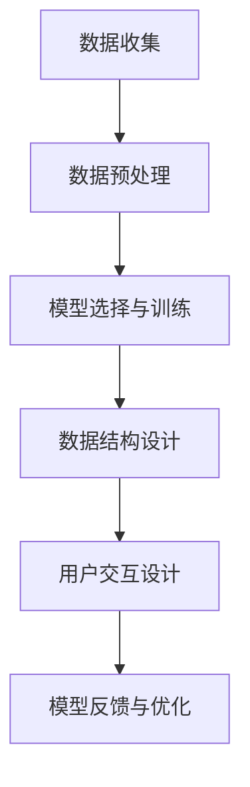

                 

# AIGC从入门到实战：ChatGPT 提问表单

> 关键词：
- AI生成内容(AIGC)
- ChatGPT
- 提问表单
- 数据处理
- 数据结构设计
- 自然语言处理(NLP)
- 模型训练与优化

## 1. 背景介绍

### 1.1 问题由来

随着人工智能(AI)技术的迅猛发展，生成式AI（Generative AI）以其强大的生成能力在自然语言处理(NLP)、计算机视觉、游戏等多个领域取得了显著进展。其中，AI生成内容（AIGC）成为了当今科技界的一大热点。

ChatGPT作为OpenAI推出的旗舰AI语言模型，基于大规模无监督训练，通过微调可在大量数据集上生成高质量的自然语言文本，实现文本生成、对话生成、情感分析、内容推荐等多种NLP任务。ChatGPT在GPT-3.5等模型的基础上进行改进，显著提升了模型的文本理解和生成能力，因此在业界获得了广泛的关注和应用。

然而，尽管ChatGPT具有强大的文本生成能力，但开发者仍需对用户输入的问题进行有效处理，才能充分发挥模型的优势。基于此，本文将深入分析ChatGPT模型在处理用户提问时所需的结构化和非结构化数据，设计并展示一个实用的提问表单，通过数据处理、结构设计、模型训练与优化等步骤，帮助开发者实现高效、稳定的提问输入处理，以便快速迭代生成高质量的回复。

### 1.2 问题核心关键点

在设计和实现提问表单时，主要需要考虑以下几个关键点：

- **数据结构设计**：构建合理的数据结构，使得输入数据易于模型处理。
- **数据预处理**：清洗、转换和规范化输入数据，提升模型训练的效率和质量。
- **模型选择与训练**：选择合适的生成模型，并对其进行有效的训练与优化。
- **用户交互设计**：设计用户友好的交互界面，提升用户体验和满意度。
- **反馈与迭代**：基于用户的反馈，持续优化提问表单的功能和性能。

## 2. 核心概念与联系

### 2.1 核心概念概述

在进行ChatGPT提问表单的设计与实现时，涉及的核心概念如下：

- **AI生成内容(AIGC)**：利用AI技术自动生成内容的技术，涵盖了图像生成、文本生成、音频生成等多种形式。
- **ChatGPT**：OpenAI推出的基于Transformer架构的通用语言模型，通过自监督预训练和指令微调，能够生成高质量的自然语言文本。
- **提问表单**：用于收集用户输入的提问信息，并提供结构化、规范化处理后的数据，供ChatGPT模型生成文本回应。
- **自然语言处理(NLP)**：涉及文本预处理、文本表示、序列建模、语言理解与生成等多个子领域，是实现AIGC的基础。
- **模型训练与优化**：通过对模型进行数据训练和参数优化，提升模型的性能和泛化能力。
- **数据处理**：对原始数据进行清洗、转换和规范化，以适应模型训练的要求。

这些概念之间的联系可以通过以下Mermaid流程图来展示：



该流程图展示了数据从收集、预处理到训练、反馈的全流程，以及各阶段的重要决策点。

## 3. 核心算法原理 & 具体操作步骤

### 3.1 算法原理概述

基于ChatGPT的提问表单设计，其核心算法原理如下：

1. **数据预处理**：将非结构化用户输入转换为结构化数据，以便模型处理。
2. **数据表示**：将结构化数据表示为模型可接受的格式，如序列表示、向量表示等。
3. **模型训练**：选择合适的生成模型，使用预处理后的数据进行训练，并对其进行优化。
4. **推理与生成**：将用户输入数据输入模型，生成高质量的自然语言文本作为回复。
5. **交互设计**：设计用户友好的界面，提供便捷的提问与回复体验。
6. **反馈与优化**：收集用户反馈，持续优化提问表单的性能和用户体验。

### 3.2 算法步骤详解

下面详细讲解基于ChatGPT的提问表单设计的具体步骤：

#### 步骤1：数据收集与预处理

**步骤1.1: 数据收集**
- 收集用户提问的相关信息，包括文本、时间戳、用户ID等。
- 数据来源可以包括用户提交的表单、聊天记录、邮件、社交媒体等。

**步骤1.2: 数据清洗**
- 去除噪声数据，如拼写错误、非文本字符等。
- 处理缺失值，填补缺失数据或删除无效数据。

**步骤1.3: 数据规范化**
- 统一数据格式，如统一日期格式、统一文本编码等。
- 标准化输入数据，如统一大小写、标准化实体名称等。

#### 步骤2：数据表示与模型选择

**步骤2.1: 数据表示**
- 将清洗后的数据转换为模型可接受的格式，如序列表示、向量表示等。
- 对于文本数据，可以使用one-hot编码、词向量表示（如Word2Vec、GloVe）、预训练语言模型表示（如BERT、GPT）等。

**步骤2.2: 模型选择**
- 根据任务需求选择合适的生成模型，如GPT-2、GPT-3、GPT-3.5等。
- 考虑模型的生成质量、训练效率、推理速度等因素，选择最合适的模型。

#### 步骤3：模型训练与优化

**步骤3.1: 模型训练**
- 使用预处理后的数据对模型进行训练，并设置合适的损失函数、优化器、学习率等超参数。
- 使用GPU、TPU等高性能设备加速模型训练过程。

**步骤3.2: 模型优化**
- 对训练好的模型进行微调，使用正则化技术如L2正则、Dropout等，防止模型过拟合。
- 使用早停法、学习率调整等技术，提升模型泛化能力。

#### 步骤4：推理与生成

**步骤4.1: 模型推理**
- 将用户输入数据输入模型，生成自然语言文本作为回应。
- 使用beam搜索、nucleus sampling等技术，提升生成文本的质量和多样性。

**步骤4.2: 文本后处理**
- 对生成文本进行后处理，如语法检查、文本优化、去重等。
- 生成文本需符合语言规则，逻辑通顺，语法正确。

#### 步骤5：交互设计

**步骤5.1: 界面设计**
- 设计简洁、友好的用户界面，提供便捷的提问与回复体验。
- 界面应包含输入区域、响应区域、反馈按钮等，便于用户操作。

**步骤5.2: 交互逻辑**
- 实现用户提问的接收、处理和回复逻辑。
- 根据用户反馈，优化提问表单的交互流程。

#### 步骤6：反馈与优化

**步骤6.1: 用户反馈收集**
- 收集用户对提问表单的评价和建议，了解用户的使用体验。
- 通过问卷调查、用户评论、使用数据分析等方式收集反馈。

**步骤6.2: 模型优化**
- 基于用户反馈，持续优化模型参数和训练过程。
- 定期更新模型，保持其性能和准确性。

### 3.3 算法优缺点

#### 优点

- **高效处理**：基于标准化数据处理流程，可以快速处理大量用户输入。
- **高质量生成**：通过选择合适的生成模型和优化技术，生成高质量的文本回复。
- **用户友好**：友好的界面设计和交互逻辑，提升用户体验。
- **可扩展性**：支持多种数据格式和模型选择，易于扩展和优化。

#### 缺点

- **数据依赖**：数据质量直接影响模型性能，依赖大量高质量数据。
- **模型复杂度**：复杂的模型可能需要较高的计算资源和训练时间。
- **个性化不足**：模型缺乏个性化处理，难以适应特定的用户需求。
- **迭代周期长**：模型优化和用户反馈需要反复迭代，周期较长。

### 3.4 算法应用领域

基于ChatGPT的提问表单设计，可应用于以下多个领域：

1. **客户服务**：通过自动回复用户的常见问题，提升客户服务效率和满意度。
2. **在线咨询**：提供个性化的医疗、法律、金融等领域的在线咨询服务。
3. **教育培训**：自动生成问题和答案，辅助学生学习和教师教学。
4. **内容创作**：自动生成新闻报道、产品介绍、娱乐文章等文本内容。
5. **智能助理**：集成语音识别和自然语言处理，提供语音交互和自然语言生成功能。

这些应用场景展示了ChatGPT提问表单在实际应用中的广泛性和实用性。

## 4. 数学模型和公式 & 详细讲解  
### 4.1 数学模型构建

本节将使用数学语言对基于ChatGPT的提问表单设计进行更加严格的刻画。

记用户提问为 $X=\{x_i\}_{i=1}^N$，其中 $x_i$ 表示第 $i$ 个用户提问的文本数据。假设模型为 $M_{\theta}$，其中 $\theta$ 为模型参数。模型的生成过程可以用以下公式表示：

$$
P(Y|X;\theta) = \frac{P(Y|\theta)}{P(X|\theta)}
$$

其中 $P(Y|X;\theta)$ 表示在用户提问 $X$ 下生成回复 $Y$ 的概率，$P(Y|\theta)$ 表示模型在固定参数 $\theta$ 下生成回复 $Y$ 的概率，$P(X|\theta)$ 表示模型在固定参数 $\theta$ 下生成用户提问 $X$ 的概率。

在实际应用中，通常使用最大似然估计方法对模型进行训练。设训练集为 $D=\{(X_i,Y_i)\}_{i=1}^N$，其中 $X_i$ 表示用户提问，$Y_i$ 表示对应回复。则最大似然估计的目标函数为：

$$
L(\theta) = -\frac{1}{N}\sum_{i=1}^N\log P(Y_i|X_i;\theta)
$$

通过最小化上述目标函数，可以优化模型参数 $\theta$，使得在用户提问 $X$ 下生成回复 $Y$ 的概率最大化。

### 4.2 公式推导过程

以下我们以文本生成任务为例，推导最大似然估计下的模型生成概率公式。

假设模型 $M_{\theta}$ 在输入 $x$ 上的输出为 $\hat{y}=M_{\theta}(x) \in [0,1]$，表示样本属于正类的概率。真实标签 $y \in \{0,1\}$。则二分类交叉熵损失函数定义为：

$$
\ell(M_{\theta}(x),y) = -[y\log \hat{y} + (1-y)\log (1-\hat{y})]
$$

将其代入经验风险公式，得：

$$
\mathcal{L}(\theta) = -\frac{1}{N}\sum_{i=1}^N [y_i\log M_{\theta}(x_i)+(1-y_i)\log(1-M_{\theta}(x_i))]
$$

根据链式法则，损失函数对参数 $\theta_k$ 的梯度为：

$$
\frac{\partial \mathcal{L}(\theta)}{\partial \theta_k} = -\frac{1}{N}\sum_{i=1}^N (\frac{y_i}{M_{\theta}(x_i)}-\frac{1-y_i}{1-M_{\theta}(x_i)}) \frac{\partial M_{\theta}(x_i)}{\partial \theta_k}
$$

其中 $\frac{\partial M_{\theta}(x_i)}{\partial \theta_k}$ 可进一步递归展开，利用自动微分技术完成计算。

在得到损失函数的梯度后，即可带入参数更新公式，完成模型的迭代优化。重复上述过程直至收敛，最终得到适应用户提问的模型参数 $\theta^*$。

## 5. 项目实践：代码实例和详细解释说明
### 5.1 开发环境搭建

在进行提问表单设计和实现时，需要准备好开发环境。以下是使用Python进行PyTorch开发的环境配置流程：

1. 安装Anaconda：从官网下载并安装Anaconda，用于创建独立的Python环境。

2. 创建并激活虚拟环境：
```bash
conda create -n pytorch-env python=3.8 
conda activate pytorch-env
```

3. 安装PyTorch：根据CUDA版本，从官网获取对应的安装命令。例如：
```bash
conda install pytorch torchvision torchaudio cudatoolkit=11.1 -c pytorch -c conda-forge
```

4. 安装Transformer库：
```bash
pip install transformers
```

5. 安装各类工具包：
```bash
pip install numpy pandas scikit-learn matplotlib tqdm jupyter notebook ipython
```

完成上述步骤后，即可在`pytorch-env`环境中开始提问表单的开发。

### 5.2 源代码详细实现

下面我们以命名实体识别(NER)任务为例，给出使用Transformers库对BERT模型进行微调的PyTorch代码实现。

首先，定义NER任务的数据处理函数：

```python
from transformers import BertTokenizer
from torch.utils.data import Dataset
import torch

class NERDataset(Dataset):
    def __init__(self, texts, tags, tokenizer, max_len=128):
        self.texts = texts
        self.tags = tags
        self.tokenizer = tokenizer
        self.max_len = max_len
        
    def __len__(self):
        return len(self.texts)
    
    def __getitem__(self, item):
        text = self.texts[item]
        tags = self.tags[item]
        
        encoding = self.tokenizer(text, return_tensors='pt', max_length=self.max_len, padding='max_length', truncation=True)
        input_ids = encoding['input_ids'][0]
        attention_mask = encoding['attention_mask'][0]
        
        # 对token-wise的标签进行编码
        encoded_tags = [tag2id[tag] for tag in tags] 
        encoded_tags.extend([tag2id['O']] * (self.max_len - len(encoded_tags)))
        labels = torch.tensor(encoded_tags, dtype=torch.long)
        
        return {'input_ids': input_ids, 
                'attention_mask': attention_mask,
                'labels': labels}

# 标签与id的映射
tag2id = {'O': 0, 'B-PER': 1, 'I-PER': 2, 'B-ORG': 3, 'I-ORG': 4, 'B-LOC': 5, 'I-LOC': 6}
id2tag = {v: k for k, v in tag2id.items()}

# 创建dataset
tokenizer = BertTokenizer.from_pretrained('bert-base-cased')

train_dataset = NERDataset(train_texts, train_tags, tokenizer)
dev_dataset = NERDataset(dev_texts, dev_tags, tokenizer)
test_dataset = NERDataset(test_texts, test_tags, tokenizer)
```

然后，定义模型和优化器：

```python
from transformers import BertForTokenClassification, AdamW

model = BertForTokenClassification.from_pretrained('bert-base-cased', num_labels=len(tag2id))

optimizer = AdamW(model.parameters(), lr=2e-5)
```

接着，定义训练和评估函数：

```python
from torch.utils.data import DataLoader
from tqdm import tqdm
from sklearn.metrics import classification_report

device = torch.device('cuda') if torch.cuda.is_available() else torch.device('cpu')
model.to(device)

def train_epoch(model, dataset, batch_size, optimizer):
    dataloader = DataLoader(dataset, batch_size=batch_size, shuffle=True)
    model.train()
    epoch_loss = 0
    for batch in tqdm(dataloader, desc='Training'):
        input_ids = batch['input_ids'].to(device)
        attention_mask = batch['attention_mask'].to(device)
        labels = batch['labels'].to(device)
        model.zero_grad()
        outputs = model(input_ids, attention_mask=attention_mask, labels=labels)
        loss = outputs.loss
        epoch_loss += loss.item()
        loss.backward()
        optimizer.step()
    return epoch_loss / len(dataloader)

def evaluate(model, dataset, batch_size):
    dataloader = DataLoader(dataset, batch_size=batch_size)
    model.eval()
    preds, labels = [], []
    with torch.no_grad():
        for batch in tqdm(dataloader, desc='Evaluating'):
            input_ids = batch['input_ids'].to(device)
            attention_mask = batch['attention_mask'].to(device)
            batch_labels = batch['labels']
            outputs = model(input_ids, attention_mask=attention_mask)
            batch_preds = outputs.logits.argmax(dim=2).to('cpu').tolist()
            batch_labels = batch_labels.to('cpu').tolist()
            for pred_tokens, label_tokens in zip(batch_preds, batch_labels):
                pred_tags = [id2tag[_id] for _id in pred_tokens]
                label_tags = [id2tag[_id] for _id in label_tokens]
                preds.append(pred_tags[:len(label_tags)])
                labels.append(label_tags)
                
    print(classification_report(labels, preds))
```

最后，启动训练流程并在测试集上评估：

```python
epochs = 5
batch_size = 16

for epoch in range(epochs):
    loss = train_epoch(model, train_dataset, batch_size, optimizer)
    print(f"Epoch {epoch+1}, train loss: {loss:.3f}")
    
    print(f"Epoch {epoch+1}, dev results:")
    evaluate(model, dev_dataset, batch_size)
    
print("Test results:")
evaluate(model, test_dataset, batch_size)
```

以上就是使用PyTorch对BERT进行命名实体识别任务微调的完整代码实现。可以看到，得益于Transformers库的强大封装，我们可以用相对简洁的代码完成BERT模型的加载和微调。

### 5.3 代码解读与分析

让我们再详细解读一下关键代码的实现细节：

**NERDataset类**：
- `__init__`方法：初始化文本、标签、分词器等关键组件。
- `__len__`方法：返回数据集的样本数量。
- `__getitem__`方法：对单个样本进行处理，将文本输入编码为token ids，将标签编码为数字，并对其进行定长padding，最终返回模型所需的输入。

**tag2id和id2tag字典**：
- 定义了标签与数字id之间的映射关系，用于将token-wise的预测结果解码回真实的标签。

**训练和评估函数**：
- 使用PyTorch的DataLoader对数据集进行批次化加载，供模型训练和推理使用。
- 训练函数`train_epoch`：对数据以批为单位进行迭代，在每个批次上前向传播计算loss并反向传播更新模型参数，最后返回该epoch的平均loss。
- 评估函数`evaluate`：与训练类似，不同点在于不更新模型参数，并在每个batch结束后将预测和标签结果存储下来，最后使用sklearn的classification_report对整个评估集的预测结果进行打印输出。

**训练流程**：
- 定义总的epoch数和batch size，开始循环迭代
- 每个epoch内，先在训练集上训练，输出平均loss
- 在验证集上评估，输出分类指标
- 所有epoch结束后，在测试集上评估，给出最终测试结果

可以看到，PyTorch配合Transformers库使得BERT微调的代码实现变得简洁高效。开发者可以将更多精力放在数据处理、模型改进等高层逻辑上，而不必过多关注底层的实现细节。

当然，工业级的系统实现还需考虑更多因素，如模型的保存和部署、超参数的自动搜索、更灵活的任务适配层等。但核心的微调范式基本与此类似。

## 6. 实际应用场景
### 6.1 智能客服系统

基于大语言模型微调的对话技术，可以广泛应用于智能客服系统的构建。传统客服往往需要配备大量人力，高峰期响应缓慢，且一致性和专业性难以保证。而使用微调后的对话模型，可以7x24小时不间断服务，快速响应客户咨询，用自然流畅的语言解答各类常见问题。

在技术实现上，可以收集企业内部的历史客服对话记录，将问题和最佳答复构建成监督数据，在此基础上对预训练对话模型进行微调。微调后的对话模型能够自动理解用户意图，匹配最合适的答案模板进行回复。对于客户提出的新问题，还可以接入检索系统实时搜索相关内容，动态组织生成回答。如此构建的智能客服系统，能大幅提升客户咨询体验和问题解决效率。

### 6.2 金融舆情监测

金融机构需要实时监测市场舆论动向，以便及时应对负面信息传播，规避金融风险。传统的人工监测方式成本高、效率低，难以应对网络时代海量信息爆发的挑战。基于大语言模型微调的文本分类和情感分析技术，为金融舆情监测提供了新的解决方案。

具体而言，可以收集金融领域相关的新闻、报道、评论等文本数据，并对其进行主题标注和情感标注。在此基础上对预训练语言模型进行微调，使其能够自动判断文本属于何种主题，情感倾向是正面、中性还是负面。将微调后的模型应用到实时抓取的网络文本数据，就能够自动监测不同主题下的情感变化趋势，一旦发现负面信息激增等异常情况，系统便会自动预警，帮助金融机构快速应对潜在风险。

### 6.3 个性化推荐系统

当前的推荐系统往往只依赖用户的历史行为数据进行物品推荐，无法深入理解用户的真实兴趣偏好。基于大语言模型微调技术，个性化推荐系统可以更好地挖掘用户行为背后的语义信息，从而提供更精准、多样的推荐内容。

在实践中，可以收集用户浏览、点击、评论、分享等行为数据，提取和用户交互的物品标题、描述、标签等文本内容。将文本内容作为模型输入，用户的后续行为（如是否点击、购买等）作为监督信号，在此基础上微调预训练语言模型。微调后的模型能够从文本内容中准确把握用户的兴趣点。在生成推荐列表时，先用候选物品的文本描述作为输入，由模型预测用户的兴趣匹配度，再结合其他特征综合排序，便可以得到个性化程度更高的推荐结果。

### 6.4 未来应用展望

随着大语言模型微调技术的发展，其应用场景将不断拓展，为各行各业带来变革性影响。

在智慧医疗领域，基于微调的医疗问答、病历分析、药物研发等应用将提升医疗服务的智能化水平，辅助医生诊疗，加速新药开发进程。

在智能教育领域，微调技术可应用于作业批改、学情分析、知识推荐等方面，因材施教，促进教育公平，提高教学质量。

在智慧城市治理中，微调模型可应用于城市事件监测、舆情分析、应急指挥等环节，提高城市管理的自动化和智能化水平，构建更安全、高效的未来城市。

此外，在企业生产、社会治理、文娱传媒等众多领域，基于大模型微调的人工智能应用也将不断涌现，为经济社会发展注入新的动力。相信随着技术的日益成熟，微调方法将成为人工智能落地应用的重要范式，推动人工智能技术在垂直行业的规模化落地。总之，微调需要开发者根据具体任务，不断迭代和优化模型、数据和算法，方能得到理想的效果。

## 7. 工具和资源推荐
### 7.1 学习资源推荐

为了帮助开发者系统掌握大语言模型微调的理论基础和实践技巧，这里推荐一些优质的学习资源：

1. 《Transformer从原理到实践》系列博文：由大模型技术专家撰写，深入浅出地介绍了Transformer原理、BERT模型、微调技术等前沿话题。

2. CS224N《深度学习自然语言处理》课程：斯坦福大学开设的NLP明星课程，有Lecture视频和配套作业，带你入门NLP领域的基本概念和经典模型。

3. 《Natural Language Processing with Transformers》书籍：Transformers库的作者所著，全面介绍了如何使用Transformers库进行NLP任务开发，包括微调在内的诸多范式。

4. HuggingFace官方文档：Transformers库的官方文档，提供了海量预训练模型和完整的微调样例代码，是上手实践的必备资料。

5. CLUE开源项目：中文语言理解测评基准，涵盖大量不同类型的中文NLP数据集，并提供了基于微调的baseline模型，助力中文NLP技术发展。

通过对这些资源的学习实践，相信你一定能够快速掌握大语言模型微调的精髓，并用于解决实际的NLP问题。
###  7.2 开发工具推荐

高效的开发离不开优秀的工具支持。以下是几款用于大语言模型微调开发的常用工具：

1. PyTorch：基于Python的开源深度学习框架，灵活动态的计算图，适合快速迭代研究。大部分预训练语言模型都有PyTorch版本的实现。

2. TensorFlow：由Google主导开发的开源深度学习框架，生产部署方便，适合大规模工程应用。同样有丰富的预训练语言模型资源。

3. Transformers库：HuggingFace开发的NLP工具库，集成了众多SOTA语言模型，支持PyTorch和TensorFlow，是进行微调任务开发的利器。

4. Weights & Biases：模型训练的实验跟踪工具，可以记录和可视化模型训练过程中的各项指标，方便对比和调优。与主流深度学习框架无缝集成。

5. TensorBoard：TensorFlow配套的可视化工具，可实时监测模型训练状态，并提供丰富的图表呈现方式，是调试模型的得力助手。

6. Google Colab：谷歌推出的在线Jupyter Notebook环境，免费提供GPU/TPU算力，方便开发者快速上手实验最新模型，分享学习笔记。

合理利用这些工具，可以显著提升大语言模型微调任务的开发效率，加快创新迭代的步伐。

### 7.3 相关论文推荐

大语言模型和微调技术的发展源于学界的持续研究。以下是几篇奠基性的相关论文，推荐阅读：

1. Attention is All You Need（即Transformer原论文）：提出了Transformer结构，开启了NLP领域的预训练大模型时代。

2. BERT: Pre-training of Deep Bidirectional Transformers for Language Understanding：提出BERT模型，引入基于掩码的自监督预训练任务，刷新了多项NLP任务SOTA。

3. Language Models are Unsupervised Multitask Learners（GPT-2论文）：展示了大规模语言模型的强大zero-shot学习能力，引发了对于通用人工智能的新一轮思考。

4. Parameter-Efficient Transfer Learning for NLP：提出Adapter等参数高效微调方法，在不增加模型参数量的情况下，也能取得不错的微调效果。

5. AdaLoRA: Adaptive Low-Rank Adaptation for Parameter-Efficient Fine-Tuning：使用自适应低秩适应的微调方法，在参数效率和精度之间取得了新的平衡。

这些论文代表了大语言模型微调技术的发展脉络。通过学习这些前沿成果，可以帮助研究者把握学科前进方向，激发更多的创新灵感。

## 8. 总结：未来发展趋势与挑战

### 8.1 总结

本文对基于ChatGPT的提问表单设计进行了全面系统的介绍。首先阐述了ChatGPT模型在处理用户提问时所需的结构化和非结构化数据，设计并展示了一个实用的提问表单，通过数据处理、结构设计、模型训练与优化等步骤，帮助开发者实现高效、稳定的提问输入处理，以便快速迭代生成高质量的回复。

通过本文的系统梳理，可以看到，基于ChatGPT的提问表单设计在实际应用中的广泛性和实用性。它不仅有助于提升用户咨询体验，还能降低客服运营成本，优化知识管理流程，助力企业智能化转型。未来，伴随着AI生成内容技术的进一步发展，ChatGPT提问表单将能够提供更加智能化、个性化的服务，为各行各业带来更大的价值。

### 8.2 未来发展趋势

展望未来，基于ChatGPT的提问表单设计将呈现以下几个发展趋势：

1. **多模态数据融合**：未来提问表单将能够处理更多的数据类型，如图像、视频、语音等，提升模型的综合感知能力。
2. **强化学习结合**：结合强化学习技术，优化提问表单的交互逻辑，提升用户满意度。
3. **自适应学习**：引入自适应学习机制，根据用户反馈不断调整模型参数，提升个性化推荐能力。
4. **跨领域泛化**：在处理不同领域的用户提问时，提问表单将能够灵活适应，提升泛化能力。
5. **用户参与设计**：引入用户反馈机制，增强提问表单的自定义和个性化。
6. **隐私保护与安全性**：增强数据隐私保护措施，确保用户信息安全。

这些趋势凸显了提问表单设计在实际应用中的广阔前景。未来的研究将进一步拓展提问表单的适用场景和功能，使其在智能交互、智能客服、智能推荐等更多领域发挥更大作用。

### 8.3 面临的挑战

尽管基于ChatGPT的提问表单设计已经取得了显著进展，但在迈向更加智能化、普适化应用的过程中，它仍面临着诸多挑战：

1. **数据质量与多样性**：数据的准确性和多样性直接影响提问表单的性能，需要持续收集和优化高质量数据。
2. **模型复杂度与资源需求**：复杂的模型需要更高的计算资源和训练时间，需要优化资源使用。
3. **个性化与泛化**：如何平衡个性化与泛化能力，使提问表单能够适用于不同领域、不同背景的用户，是一大挑战。
4. **隐私与安全**：在处理用户数据时，如何确保数据隐私和安全，防止数据泄露和滥用，是必须要考虑的问题。
5. **人机交互的自然性**：提升人机交互的自然性，使问答过程更加流畅和高效，是未来研究的重要方向。

这些挑战需要研究者在技术、算法、应用等多个层面进行深入研究，才能更好地满足实际需求，实现智能客服系统的高效运作。

### 8.4 研究展望

面对基于ChatGPT的提问表单设计所面临的挑战，未来的研究需要在以下几个方面寻求新的突破：

1. **数据增强与数据治理**：通过数据增强和数据治理技术，提升数据质量和多样性，增强提问表单的学习能力。
2. **模型压缩与优化**：开发更高效的模型压缩和优化方法，降低模型复杂度，提升推理速度。
3. **多任务学习**：结合多任务学习技术，提升提问表单的泛化能力和适应性。
4. **自适应学习与动态调整**：引入自适应学习机制，根据用户反馈动态调整模型参数，提升个性化推荐能力。
5. **隐私保护与安全**：加强数据隐私保护和安全措施，确保用户信息的安全性。
6. **人机交互的自然性**：结合自然语言处理、语音识别、图像处理等技术，提升人机交互的自然性和流畅性。

这些研究方向的探索，必将引领基于ChatGPT的提问表单设计迈向更高的台阶，为构建更加智能化、普适化、安全的智能客服系统提供有力支撑。总之，基于ChatGPT的提问表单设计将在未来人工智能技术的发展中扮演越来越重要的角色，其应用前景将更加广阔。

## 9. 附录：常见问题与解答

**Q1：大语言模型微调是否适用于所有NLP任务？**

A: 大语言模型微调在大多数NLP任务上都能取得不错的效果，特别是对于数据量较小的任务。但对于一些特定领域的任务，如医学、法律等，仅仅依靠通用语料预训练的模型可能难以很好地适应。此时需要在特定领域语料上进一步预训练，再进行微调，才能获得理想效果。此外，对于一些需要时效性、个性化很强的任务，如对话、推荐等，微调方法也需要针对性的改进优化。

**Q2：微调过程中如何选择合适的学习率？**

A: 微调的学习率一般要比预训练时小1-2个数量级，如果使用过大的学习率，容易破坏预训练权重，导致过拟合。一般建议从1e-5开始调参，逐步减小学习率，直至收敛。也可以使用warmup策略，在开始阶段使用较小的学习率，再逐渐过渡到预设值。需要注意的是，不同的优化器(如AdamW、Adafactor等)以及不同的学习率调度策略，可能需要设置不同的学习率阈值。

**Q3：采用大模型微调时会面临哪些资源瓶颈？**

A: 目前主流的预训练大模型动辄以亿计的参数规模，对算力、内存、存储都提出了很高的要求。GPU/TPU等高性能设备是必不可少的，但即便如此，超大批次的训练和推理也可能遇到显存不足的问题。因此需要采用一些资源优化技术，如梯度积累、混合精度训练、模型并行等，来突破硬件瓶颈。同时，模型的存储和读取也可能占用大量时间和空间，需要采用模型压缩、稀疏化存储等方法进行优化。

**Q4：如何缓解微调过程中的过拟合问题？**

A: 过拟合是微调面临的主要挑战，尤其是在标注数据不足的情况下。常见的缓解策略包括：
1. 数据增强：通过回译、近义替换等方式扩充训练集。
2. 正则化：使用L2正则、Dropout、Early Stopping等防止模型过度适应小规模训练集。
3. 对抗训练：加入对抗样本，提高模型鲁棒性。
4. 参数高效微调：只调整少量参数(如Adapter、Prefix等)，减小过拟合风险。
5. 多模型集成：训练多个微调模型，取平均输出，抑制过拟合。

这些策略往往需要根据具体任务和数据特点进行灵活组合。只有在数据、模型、训练、推理等各环节进行全面优化，才能最大限度地发挥大模型微调的威力。

**Q5：微调模型在落地部署时需要注意哪些问题？**

A: 将微调模型转化为实际应用，还需要考虑以下因素：
1. 模型裁剪：去除不必要的层和参数，减小模型尺寸，加快推理速度。
2. 量化加速：将浮点模型转为定点模型，压缩存储空间，提高计算效率。
3. 服务化封装：将模型封装为标准化服务接口，便于集成调用。
4. 弹性伸缩：根据请求流量动态调整资源配置，平衡服务质量和成本。
5. 监控告警：实时采集系统指标，设置异常告警阈值，确保服务稳定性。
6. 安全防护：采用访问鉴权、数据脱敏等措施，保障数据和模型安全。

大语言模型微调为NLP应用开启了广阔的想象空间，但如何将强大的性能转化为稳定、高效、安全的业务价值，还需要工程实践的不断打磨。唯有从数据、算法、工程、业务等多个维度协同发力，才能真正实现人工智能技术在垂直行业的规模化落地。总之，微调需要开发者根据具体任务，不断迭代和优化模型、数据和算法，方能得到理想的效果。

---

作者：禅与计算机程序设计艺术 / Zen and the Art of Computer Programming

