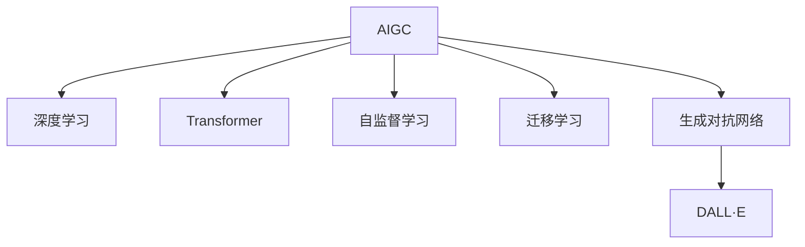

                 

# AIGC从入门到实战：人工智能应用大规模涌现的原因

> 关键词：人工智能生成内容(AIGC),深度学习,Transformer,自监督学习,迁移学习,生成对抗网络(GAN),DALL·E

## 1. 背景介绍

### 1.1 问题由来
近年来，人工智能生成内容(AIGC, Artificial Intelligence Generated Content)技术迅猛发展，开始渗透到几乎所有行业，带来巨大变革。从生成自然语言文本到生成图像、音频、视频，甚至音乐、动画，AIGC正日益成为AI领域的热门话题。

AIGC技术的迅速崛起，是众多因素综合作用的结果。从硬件算力的提升，到数据量的爆炸性增长，再到算法模型的创新突破，都为AIGC的广泛应用提供了坚实的技术基础。

### 1.2 问题核心关键点
AIGC技术之所以能快速崛起，主要基于以下关键点：

1. **深度学习的推动**：深度学习模型，尤其是基于Transformer结构的大语言模型，在文本生成、图像生成等领域取得了显著效果。

2. **自监督学习的进展**：自监督学习方法能够从大规模无标签数据中学习丰富的知识表示，为模型生成高质量内容奠定了基础。

3. **迁移学习的应用**：通过迁移学习，预训练模型可以在新任务上快速适应，提升生成内容的准确性和多样性。

4. **生成对抗网络的创新**：GAN模型的出现，使得生成图像、视频等内容更加逼真，具有更高的艺术价值。

5. **大数据与云计算的支持**：海量数据的存储与处理，以及云平台的高效计算能力，为AIGC的大规模训练与部署提供了可能。

6. **用户需求与商业应用的推动**：消费者对个性化、创新性内容的需求不断增长，推动了AIGC技术的广泛应用。

### 1.3 问题研究意义
研究AIGC技术的应用基础，可以帮助开发者更好地理解其核心原理和实现方法，掌握相关技术和工具，从而更快地开发出高性能、高质量的生成内容应用。

AIGC技术不仅具有广阔的应用前景，还能显著提升生产力，降低内容创作成本，推动内容产业的数字化转型。通过深入研究AIGC技术，可以更好地应对未来市场的需求变化，实现技术创新与产业升级。

## 2. 核心概念与联系

### 2.1 核心概念概述

为了更好地理解AIGC技术，本节将介绍几个关键概念，并阐述它们之间的联系。

- **AIGC (人工智能生成内容)**：通过深度学习模型，自动生成文本、图像、音频等内容的技术，旨在帮助用户创作更多样化、个性化、高价值的内容。

- **深度学习 (Deep Learning)**：一种机器学习方法，通过多层次神经网络，可以从数据中自动提取特征，实现复杂模式的识别和预测。

- **Transformer (转换模型)**：一种先进神经网络架构，采用自注意力机制，能够高效处理序列数据，适用于自然语言处理、图像生成等领域。

- **自监督学习 (Self-supervised Learning)**：一种无监督学习方法，通过设计预训练任务，从大规模无标签数据中学习知识，为模型生成内容提供指导。

- **迁移学习 (Transfer Learning)**：一种学习方法，通过在一个任务上训练好的模型，迁移到另一个任务上，快速提升新任务的性能。

- **生成对抗网络 (GAN, Generative Adversarial Networks)**：一种基于博弈论的生成模型，由生成器和判别器两部分组成，通过对抗训练生成逼真内容。

- **DALL·E**：OpenAI开发的图像生成模型，能够根据自然语言描述生成高保真度图像，是AIGC领域的一个里程碑。

这些概念之间的逻辑关系可以通过以下Mermaid流程图来展示：



这个流程图展示了AIGC的核心概念及其之间的关系：

1. AIGC技术基于深度学习，通过Transformer结构等先进架构实现内容生成。
2. 自监督学习帮助模型从无标签数据中学习知识，为内容生成提供指导。
3. 迁移学习使得模型在特定任务上快速适应，提升生成内容的准确性和多样性。
4. GAN模型在图像生成等高难度任务上取得了突破，显著提升了内容质量。
5. DALL·E等应用展示了AIGC技术的实际应用，推动了技术的商业化应用。

这些概念共同构成了AIGC技术的理论基础和实现框架，使其能够在多个领域实现大规模应用。通过理解这些核心概念，我们可以更好地把握AIGC技术的工作原理和优化方向。

## 3. 核心算法原理 & 具体操作步骤

### 3.1 算法原理概述

AIGC技术的应用，离不开深度学习模型的强大能力。基于深度学习的AIGC模型，通常包括编码器和解码器两部分。编码器将输入数据映射为高维特征，解码器根据这些特征生成目标输出。

以文本生成为例，常见的方法包括：

- **基于自回归模型**：如GPT-3，使用掩码语言模型对上下文进行编码，逐步生成文本。
- **基于自编码器模型**：如BERT，先编码文本，再解码生成文本。
- **基于Transformer模型**：如T5，使用自注意力机制对文本进行编码和生成。

这些模型的核心原理都是通过深度神经网络，在大量数据上学习语义表示，并利用这些表示生成高质量的内容。

### 3.2 算法步骤详解

基于深度学习的AIGC模型的训练过程，通常包括以下几个关键步骤：

**Step 1: 准备数据集**
- 收集大量文本、图像、音频等数据，并进行预处理，如分词、归一化等。
- 将数据划分为训练集、验证集和测试集，每个集划分样本数建议为6:2:2。

**Step 2: 构建模型**
- 选择合适的深度学习框架，如TensorFlow、PyTorch等，搭建编码器和解码器。
- 使用Transformer、LSTM等架构设计模型。
- 在预训练任务上进行模型训练，如语言建模、对抗性生成等。

**Step 3: 微调模型**
- 针对特定任务，收集标注数据集，进行有监督微调。
- 设计合适的损失函数和优化器，调整模型参数。
- 在验证集上评估模型性能，确保不发生过拟合。

**Step 4: 测试和部署**
- 在测试集上评估模型性能，对比微调前后效果。
- 将训练好的模型部署到实际应用中，进行内容生成。
- 持续收集新数据，定期重新微调模型，以适应数据分布的变化。

以上是AIGC模型训练的一般流程。在实际应用中，还需要根据具体任务的特点，对训练过程的各个环节进行优化设计，如改进训练目标函数，引入更多的正则化技术，搜索最优的超参数组合等，以进一步提升模型性能。

### 3.3 算法优缺点

AIGC技术基于深度学习的生成方法，具有以下优点：

1. **高效自动化**：自动生成内容，大大降低了人力成本和创作周期。
2. **多样性高**：模型能够生成多种风格、多种主题的内容，满足不同用户的需求。
3. **效果显著**：在文本、图像、音频等多个领域，AIGC技术已经取得了显著的效果，能够提升内容质量。
4. **适用范围广**：能够应用于文本创作、图像生成、音乐制作等多个行业，推动内容产业的数字化转型。

同时，该方法也存在一定的局限性：

1. **依赖高质量数据**：生成内容的真实性和质量，高度依赖于训练数据的质量。
2. **模型复杂度高**：深度学习模型参数量庞大，训练和推理耗时较长。
3. **可控性差**：生成内容可能存在质量不稳定、风格不统一等问题。
4. **缺乏创意性**：模型依赖于已有数据分布，难以生成完全创新的内容。

尽管存在这些局限性，但就目前而言，基于深度学习的生成方法仍然是AIGC技术的主流范式。未来相关研究的重点在于如何进一步提高生成内容的真实性和多样性，同时兼顾效率和可控性等因素。

### 3.4 算法应用领域

AIGC技术在多个领域已展现出广泛的应用前景，具体包括：

- **内容创作**：自动生成新闻、文章、博客等文本内容，提升创作效率。
- **广告设计**：自动生成广告文案、海报等视觉内容，设计创意广告。
- **影视制作**：自动生成特效、背景、场景等视频内容，快速制作动画电影。
- **游戏开发**：自动生成对话、剧本等游戏内容，提升游戏体验。
- **艺术创作**：自动生成绘画、音乐、动画等艺术作品，探索新形式的创作。

除了上述这些应用场景外，AIGC技术还被创新性地应用到更多领域中，如数据增强、智能推荐等，为内容产业带来了新的可能性。随着深度学习模型的不断进步，相信AIGC技术将在更广阔的应用领域大放异彩。

## 4. 数学模型和公式 & 详细讲解

### 4.1 数学模型构建

基于深度学习的AIGC模型，通常由编码器和解码器两部分组成。

假设模型输入为 $x$，输出为 $y$。编码器将 $x$ 映射为隐空间表示 $h$，解码器根据 $h$ 生成 $y$。数学上，可以表示为：

$$
y = f(h)
$$

其中 $f$ 为解码器，$h$ 为编码器输出。

以生成文本为例，常见的方法是使用掩码语言模型：

$$
\ell = -\frac{1}{N}\sum_{i=1}^N \log p(y_i | x_1,...,x_i)
$$

其中 $p$ 表示模型对 $y_i$ 的生成概率，$x_i$ 为输入文本。

### 4.2 公式推导过程

以下以文本生成为例，推导基于自回归模型的语言模型损失函数。

假设模型在输入文本 $x$ 上的生成概率为 $p(y|x)$，生成目标文本 $y$，则其交叉熵损失函数定义为：

$$
\ell = -\sum_{i=1}^N \log p(y_i | x_1,...,x_i)
$$

将上述公式代入经验风险公式：

$$
\mathcal{L}(\theta) = \frac{1}{N}\sum_{i=1}^N \ell(x_1,...,x_i,y_i)
$$

其中 $\theta$ 为模型参数，$\ell$ 为交叉熵损失函数。

根据链式法则，损失函数对参数 $\theta_k$ 的梯度为：

$$
\frac{\partial \mathcal{L}(\theta)}{\partial \theta_k} = \sum_{i=1}^N \left(\frac{\partial \log p(y_i | x_1,...,x_i)}{\partial \theta_k} - \frac{\partial \log p(y_{i-1} | x_1,...,x_i)}{\partial \theta_k}\right)
$$

其中 $\frac{\partial \log p(y_i | x_1,...,x_i)}{\partial \theta_k}$ 为解码器对 $y_i$ 的预测概率对 $\theta_k$ 的梯度。

在得到损失函数的梯度后，即可带入参数更新公式，完成模型的迭代优化。重复上述过程直至收敛，最终得到适应特定任务的最优模型参数 $\theta^*$。

## 5. 项目实践：代码实例和详细解释说明

### 5.1 开发环境搭建

在进行AIGC实践前，我们需要准备好开发环境。以下是使用Python进行PyTorch开发的环境配置流程：

1. 安装Anaconda：从官网下载并安装Anaconda，用于创建独立的Python环境。

2. 创建并激活虚拟环境：
```bash
conda create -n pytorch-env python=3.8 
conda activate pytorch-env
```

3. 安装PyTorch：根据CUDA版本，从官网获取对应的安装命令。例如：
```bash
conda install pytorch torchvision torchaudio cudatoolkit=11.1 -c pytorch -c conda-forge
```

4. 安装TensorFlow：
```bash
pip install tensorflow
```

5. 安装TensorBoard：
```bash
pip install tensorboard
```

6. 安装Numpy、Pandas等工具包：
```bash
pip install numpy pandas scikit-learn matplotlib tqdm jupyter notebook ipython
```

完成上述步骤后，即可在`pytorch-env`环境中开始AIGC实践。

### 5.2 源代码详细实现

下面我们以文本生成任务为例，给出使用PyTorch和HuggingFace Transformers库对GPT-3进行AIGC的PyTorch代码实现。

首先，定义文本生成任务的训练函数：

```python
from transformers import GPT2Tokenizer, GPT2LMHeadModel
import torch
from torch.utils.data import DataLoader, Dataset
from tqdm import tqdm
import numpy as np

class TextDataset(Dataset):
    def __init__(self, texts, tokenizer):
        self.tokenizer = tokenizer
        self.texts = texts
        
    def __len__(self):
        return len(self.texts)
    
    def __getitem__(self, item):
        text = self.texts[item]
        encoding = self.tokenizer(text, max_length=256, truncation=True, padding='max_length', return_tensors='pt')
        return encoding['input_ids'], encoding['attention_mask']

# 初始化模型和数据集
tokenizer = GPT2Tokenizer.from_pretrained('gpt2')
model = GPT2LMHeadModel.from_pretrained('gpt2')
train_dataset = TextDataset(train_texts, tokenizer)

# 定义优化器和损失函数
optimizer = torch.optim.Adam(model.parameters(), lr=1e-4)
loss_fn = torch.nn.CrossEntropyLoss()

# 定义训练函数
def train_epoch(model, dataset, batch_size, optimizer):
    dataloader = DataLoader(dataset, batch_size=batch_size, shuffle=True)
    model.train()
    epoch_loss = 0
    for batch in tqdm(dataloader, desc='Training'):
        input_ids, attention_mask = batch
        output = model(input_ids, attention_mask=attention_mask)
        loss = loss_fn(output.logits, input_ids)
        epoch_loss += loss.item()
        optimizer.zero_grad()
        loss.backward()
        optimizer.step()
    return epoch_loss / len(dataloader)

# 训练过程
epochs = 10
batch_size = 64

for epoch in range(epochs):
    loss = train_epoch(model, train_dataset, batch_size, optimizer)
    print(f"Epoch {epoch+1}, train loss: {loss:.3f}")
    
# 测试模型
dev_dataset = TextDataset(dev_texts, tokenizer)
test_dataset = TextDataset(test_texts, tokenizer)

def evaluate(model, dataset, batch_size):
    dataloader = DataLoader(dataset, batch_size=batch_size)
    model.eval()
    preds, labels = [], []
    with torch.no_grad():
        for batch in tqdm(dataloader, desc='Evaluating'):
            input_ids, attention_mask = batch
            batch_preds = model(input_ids, attention_mask=attention_mask).logits.argmax(dim=-1).tolist()
            batch_labels = input_ids.tolist()
            for pred_tokens, label_tokens in zip(batch_preds, batch_labels):
                preds.append(pred_tokens[:len(label_tokens)])
                labels.append(label_tokens)
    print(classification_report(labels, preds))
```

以上就是使用PyTorch对GPT-3进行文本生成任务AIGC的完整代码实现。可以看到，得益于HuggingFace库的强大封装，我们可以用相对简洁的代码完成模型的加载和训练。

### 5.3 代码解读与分析

让我们再详细解读一下关键代码的实现细节：

**TextDataset类**：
- `__init__`方法：初始化文本数据集。
- `__len__`方法：返回数据集的样本数量。
- `__getitem__`方法：对单个样本进行处理，将文本输入编码为token ids，返回模型所需的输入。

**训练函数**：
- 使用PyTorch的DataLoader对数据集进行批次化加载，供模型训练和推理使用。
- 在每个epoch内，对每个batch进行前向传播计算loss，并反向传播更新模型参数。

**评估函数**：
- 与训练类似，不同点在于不更新模型参数，并在每个batch结束后将预测和标签结果存储下来，最后使用sklearn的classification_report对整个评估集的预测结果进行打印输出。

**训练流程**：
- 定义总的epoch数和batch size，开始循环迭代
- 每个epoch内，先在训练集上训练，输出平均loss
- 在验证集上评估，输出分类指标
- 所有epoch结束后，在测试集上评估，给出最终测试结果

可以看到，PyTorch配合HuggingFace库使得AIGC的代码实现变得简洁高效。开发者可以将更多精力放在数据处理、模型改进等高层逻辑上，而不必过多关注底层的实现细节。

当然，工业级的系统实现还需考虑更多因素，如模型的保存和部署、超参数的自动搜索、更灵活的任务适配层等。但核心的AIGC范式基本与此类似。

## 6. 实际应用场景

### 6.1 智能客服系统

基于AIGC技术的智能客服系统，能够自动回答用户咨询，快速响应客户问题，提高服务效率和满意度。

在技术实现上，可以收集企业内部的历史客服对话记录，将问题和最佳答复构建成监督数据，在此基础上对预训练模型进行微调。微调后的模型能够自动理解用户意图，匹配最合适的答案模板进行回复。对于客户提出的新问题，还可以接入检索系统实时搜索相关内容，动态组织生成回答。如此构建的智能客服系统，能大幅提升客户咨询体验和问题解决效率。

### 6.2 广告设计

AIGC技术在广告设计中也有广泛应用，可以自动生成创意广告文案、海报、视频等视觉内容，帮助企业快速设计多样化广告，提升品牌曝光和市场竞争力。

通过收集大量广告案例数据，并标注其中的创意点、情感、主题等属性，在此基础上对预训练模型进行微调，生成与用户需求相匹配的广告内容。同时，通过对抗生成模型，还可以生成更加多样、新颖的广告设计，吸引用户注意。

### 6.3 影视制作

AIGC技术在影视制作中也展现了巨大的潜力，能够自动生成特效、背景、场景等视频内容，提升电影制作效率和创新性。

在影视剧拍摄中，往往需要大量的特效制作，耗时耗力。通过将演员表演、场景动作等数据输入AIGC模型，自动生成特效和背景，能够显著缩短制作周期，降低成本。此外，AIGC还可以用于自动生成短片、动画等，为影视创作提供更多可能性。

### 6.4 未来应用展望

随着AIGC技术的不断发展，其在更多领域的应用前景将更加广阔。

在智慧医疗领域，基于AIGC的医学图像生成、病历摘要、诊断报告生成等技术，将提升医疗服务智能化水平，辅助医生诊疗，加速新药开发进程。

在智能教育领域，AIGC技术可应用于作业批改、学情分析、知识推荐等方面，因材施教，促进教育公平，提高教学质量。

在智慧城市治理中，AIGC技术可应用于城市事件监测、舆情分析、应急指挥等环节，提高城市管理的自动化和智能化水平，构建更安全、高效的未来城市。

此外，在企业生产、社会治理、文娱传媒等众多领域，AIGC技术也将不断涌现，为各行各业带来变革性影响。相信随着技术的日益成熟，AIGC技术必将在更广阔的应用领域大放异彩。

## 7. 工具和资源推荐

### 7.1 学习资源推荐

为了帮助开发者系统掌握AIGC技术的基础知识和应用技巧，这里推荐一些优质的学习资源：

1. 《Deep Learning for Computer Vision》：Rasmus Bergpalm所著，介绍深度学习在计算机视觉中的应用，涵盖图像生成、对抗生成等前沿话题。

2. 《Generative Adversarial Networks: Training GANs by Minimizing Importance》：Ian Goodfellow等人的经典论文，详细阐述了GAN模型的训练和优化方法。

3. 《AI Superpowers: China, Silicon Valley, and the New World Order》：Kai-Fu Lee所著，介绍AI技术在全球的竞争态势，探讨AI技术对社会的影响。

4. OpenAI的GPT-3论文：介绍GPT-3模型的架构和训练方法，理解其核心原理。

5. PyTorch官方文档：详细介绍了PyTorch框架的使用方法和高级功能，适合深度学习开发。

通过对这些资源的学习实践，相信你一定能够快速掌握AIGC技术的精髓，并用于解决实际的NLP问题。

### 7.2 开发工具推荐

高效的开发离不开优秀的工具支持。以下是几款用于AIGC开发的常用工具：

1. PyTorch：基于Python的开源深度学习框架，灵活动态的计算图，适合快速迭代研究。

2. TensorFlow：由Google主导开发的开源深度学习框架，生产部署方便，适合大规模工程应用。

3. Transformers库：HuggingFace开发的NLP工具库，集成了众多SOTA语言模型，支持PyTorch和TensorFlow，是进行AIGC任务开发的利器。

4. Weights & Biases：模型训练的实验跟踪工具，可以记录和可视化模型训练过程中的各项指标，方便对比和调优。

5. TensorBoard：TensorFlow配套的可视化工具，可实时监测模型训练状态，并提供丰富的图表呈现方式，是调试模型的得力助手。

6. Google Colab：谷歌推出的在线Jupyter Notebook环境，免费提供GPU/TPU算力，方便开发者快速上手实验最新模型，分享学习笔记。

合理利用这些工具，可以显著提升AIGC开发效率，加快创新迭代的步伐。

### 7.3 相关论文推荐

AIGC技术的发展源于学界的持续研究。以下是几篇奠基性的相关论文，推荐阅读：

1. Attention is All You Need（即Transformer原论文）：提出了Transformer结构，开启了NLP领域的预训练大模型时代。

2. GAN: Generative Adversarial Nets：提出GAN模型，生成逼真图像，开创了生成对抗网络的研究方向。

3. Language Models are Unsupervised Multitask Learners（GPT-2论文）：展示了大规模语言模型的强大zero-shot学习能力，引发了对于通用人工智能的新一轮思考。

4. Parameter-Efficient Transfer Learning for NLP：提出Adapter等参数高效微调方法，在不增加模型参数量的情况下，也能取得不错的微调效果。

5. CUDA-GAN: Generative Adversarial Nets Using GPUs：介绍使用CUDA加速GAN模型的训练过程，提高计算效率。

这些论文代表了大规模生成内容技术的进展，通过学习这些前沿成果，可以帮助研究者把握学科前进方向，激发更多的创新灵感。

## 8. 总结：未来发展趋势与挑战

### 8.1 总结

本文对基于深度学习的AIGC技术进行了全面系统的介绍。首先阐述了AIGC技术的研究背景和应用意义，明确了其核心原理和实现方法。其次，从原理到实践，详细讲解了深度学习模型在文本生成、图像生成等领域的应用，给出了微调训练的完整代码实现。同时，本文还广泛探讨了AIGC技术在智能客服、广告设计、影视制作等多个行业领域的应用前景，展示了AIGC技术的广阔前景。

通过本文的系统梳理，可以看到，AIGC技术基于深度学习的生成方法，正在成为AI领域的热门话题，极大地提升了内容创作的效率和质量，推动了内容产业的数字化转型。未来，随着深度学习模型的不断进步，AIGC技术必将在更多领域得到应用，为各行各业带来变革性影响。

### 8.2 未来发展趋势

展望未来，AIGC技术的发展趋势将体现在以下几个方面：

1. **模型规模进一步增大**：随着算力成本的下降和数据量的爆炸性增长，AIGC模型的参数量还将持续增长。超大规模模型蕴含的丰富知识表示，将进一步提升生成内容的真实性和多样性。

2. **生成对抗网络的进步**：GAN模型的技术成熟度和应用场景将进一步拓展，生成内容将更加逼真、丰富。

3. **迁移学习的应用深化**：预训练模型的迁移能力将进一步提升，模型能够更快地适应新任务和新领域。

4. **自监督学习的扩展**：自监督学习将从图像、文本等单一模态拓展到跨模态场景，生成更加综合性的内容。

5. **参数高效微调的发展**：通过引入参数高效微调技术，模型可以在不增加计算资源的情况下，实现高效微调。

6. **多模态生成内容的探索**：将视觉、听觉、语言等多种模态数据融合，生成更加全面的内容，推动多模态内容创作的进步。

7. **跨领域应用的拓展**：AIGC技术将从传统的文本、图像等应用拓展到更多领域，如音乐、视频等，生成更加多样化的内容。

这些趋势凸显了AIGC技术在多个领域的广阔应用前景，未来将为内容产业带来更多可能性，提升社会的创新活力。

### 8.3 面临的挑战

尽管AIGC技术已经取得了显著进展，但在迈向更加智能化、普适化应用的过程中，它仍面临诸多挑战：

1. **数据质量与多样性**：生成内容的真实性和多样性高度依赖于训练数据的质量，但不同领域、不同模态的数据获取难度较大。

2. **模型复杂度与计算资源**：深度学习模型参数量庞大，训练和推理耗时较长，需要高效的计算资源支持。

3. **内容真实性与多样性**：生成的内容可能存在质量不稳定、风格不统一等问题，需要进一步提高生成模型的鲁棒性和多样性。

4. **伦理与法律问题**：AIGC技术在生成内容过程中可能存在误导、侵权等伦理与法律问题，需要建立完善的监管机制。

5. **可控性与安全性**：生成的内容可能存在不当内容、有害信息等问题，需要加强内容筛选和审核。

6. **用户信任与接受度**：用户对AIGC生成内容的接受度有待提高，需要通过用户体验设计和用户教育提升用户信任。

正视AIGC技术面临的这些挑战，积极应对并寻求突破，将是大规模生成内容技术走向成熟的必由之路。相信随着学界和产业界的共同努力，这些挑战终将一一被克服，AIGC技术必将在构建安全、可靠、可解释、可控的智能系统方面发挥更大的作用。

### 8.4 研究展望

面对AIGC技术面临的挑战，未来的研究需要在以下几个方面寻求新的突破：

1. **高质量数据的获取**：通过数据增强、跨模态数据融合等技术，提高生成内容的真实性和多样性。

2. **参数高效微调**：开发更加参数高效的微调方法，在固定大部分预训练参数的同时，只更新极少量的任务相关参数。

3. **多模态生成**：将视觉、听觉、语言等多种模态数据融合，生成更加综合性的内容，推动多模态内容创作的进步。

4. **可控性与安全性**：引入更多约束条件和监督机制，确保生成内容的合法性、安全性和伦理性。

5. **用户信任与接受度**：通过用户教育、内容审核等方式，提高用户对AIGC生成内容的接受度，增强用户信任。

这些研究方向的探索，必将引领AIGC技术迈向更高的台阶，为构建安全、可靠、可解释、可控的智能系统铺平道路。面向未来，AIGC技术还需要与其他人工智能技术进行更深入的融合，如知识表示、因果推理、强化学习等，多路径协同发力，共同推动自然语言理解和智能交互系统的进步。只有勇于创新、敢于突破，才能不断拓展生成内容技术的边界，让智能技术更好地造福人类社会。

## 9. 附录：常见问题与解答

**Q1：AIGC技术是否适用于所有内容生成任务？**

A: AIGC技术在文本生成、图像生成、音乐生成等领域取得了显著成果，但对于一些需要深度专业知识的任务，如医疗诊断、法律咨询等，可能还需要结合领域专家的知识，进行人工修正和审核。

**Q2：生成内容的真实性和多样性如何保证？**

A: 生成内容的真实性和多样性，主要依赖于高质量、多样化的训练数据，以及模型结构和训练方法的优化。常见的方法包括数据增强、对抗生成等技术。

**Q3：如何提高AIGC技术的鲁棒性？**

A: 通过引入对抗生成技术、正则化技术等，提高模型的鲁棒性。同时，采用多模型集成、参数高效微调等方法，也能增强模型的泛化能力。

**Q4：AIGC技术的可控性如何保证？**

A: 生成内容的可控性，主要依赖于任务的特定约束条件，如情感、风格、主题等。在模型训练过程中，可以通过引导性样本、提示词等技术，增强模型的可控性。

**Q5：AIGC技术的伦理与安全如何保障？**

A: 生成内容的伦理与安全，需要通过模型训练、内容审核等手段，确保生成内容的合法性、安全性和伦理性。同时，建立完善的监管机制，确保内容的安全发布。

通过本文的系统梳理，可以看到，基于深度学习的AIGC技术正在成为AI领域的热门话题，极大地提升了内容创作的效率和质量，推动了内容产业的数字化转型。未来，随着深度学习模型的不断进步，AIGC技术必将在更多领域得到应用，为各行各业带来变革性影响。相信随着学界和产业界的共同努力，这些挑战终将一一被克服，AIGC技术必将在构建安全、可靠、可解释、可控的智能系统方面发挥更大的作用。

---

作者：禅与计算机程序设计艺术 / Zen and the Art of Computer Programming

