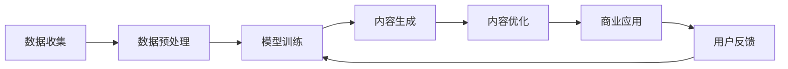

                 

# AIGC：如何利用生成式AI实现商业突破？

> 关键词：生成式AI, 商业应用, 商业智能, AI生成内容, 数据驱动决策

## 1. 背景介绍

### 1.1 问题由来

随着人工智能（AI）技术在各个领域的持续进步，特别是生成式AI（Generative AI，简称AIGC）技术的快速发展，生成式AI已经逐渐渗透到商业应用中，成为了推动企业数字化转型的重要工具。生成式AI能够基于大量数据自动生成内容，不仅能够节省大量人力和时间，而且可以大幅提升内容创意和多样性。在广告、营销、娱乐、教育、零售等多个领域，生成式AI技术正在带来显著的商业价值。

然而，对于很多企业来说，如何高效利用生成式AI技术，将其转化为实际的商业突破，仍然是一个复杂的挑战。本博文将系统介绍生成式AI技术的基本原理、核心算法、实际应用案例及未来发展趋势，帮助企业决策者和开发者更好地理解和应用生成式AI技术，实现商业突破。

### 1.2 问题核心关键点

生成式AI技术的核心在于其自动生成内容的能力。与传统的AI技术相比，生成式AI不仅能够进行预测和分类，还能够创造新的内容，如文本、图片、音频等。其主要应用场景包括内容生成、内容修复、数据增强、智能推荐等。

生成式AI技术的关键点包括：

- 基于大规模数据集进行训练，使得生成模型具有丰富的知识储备和强大的泛化能力。
- 使用深度学习模型（如GAN、VAE、Transformer等）实现内容生成。
- 引入对抗性训练、自适应学习等方法提升模型的生成质量和鲁棒性。
- 对生成内容进行后处理和优化，保证生成的内容具有较高的可信度和真实性。

生成式AI技术的商业应用主要体现在以下几个方面：

- 提升内容生产效率，降低人力成本，加快内容创意输出。
- 提供多样化的内容选项，满足用户个性化需求。
- 实现动态内容生成，提高用户交互体验和参与度。
- 通过内容分析，优化产品设计和市场策略。

本博文将从生成式AI技术的基本原理出发，详细介绍其在商业应用中的核心算法和操作步骤，并结合实际应用案例，展示其带来的商业价值。

## 2. 核心概念与联系

### 2.1 核心概念概述

为了更好地理解生成式AI技术的核心原理和商业应用，本节将介绍几个关键的概念：

- **生成式AI（Generative AI）**：指能够基于输入数据自动生成新内容的技术，包括文本、图像、音频等。典型算法包括GAN（生成对抗网络）、VAE（变分自编码器）、Transformer等。

- **内容生成（Content Generation）**：指使用生成式AI技术自动生成文本、图像、音频等内容的过程。主要应用包括自动写作、图像生成、音乐创作等。

- **内容修复（Content Repair）**：指利用生成式AI技术修复损坏、缺失、错误的内容，如图片修复、语音转录等。

- **数据增强（Data Augmentation）**：指通过生成式AI技术生成更多训练数据，提高模型的泛化能力和鲁棒性。

- **智能推荐（Recommendation System）**：指基于生成式AI技术生成个性化推荐内容，提升用户交互体验和满意度。

### 2.2 核心概念原理和架构的 Mermaid 流程图

以下是生成式AI技术的核心概念原理和架构的Mermaid流程图，展示了生成式AI技术的全流程：



这个流程图展示了生成式AI技术的全流程：从数据收集到内容生成，再到内容优化和商业应用，最后通过用户反馈不断迭代优化模型。

## 3. 核心算法原理 & 具体操作步骤

### 3.1 算法原理概述

生成式AI技术的核心在于利用深度学习模型自动生成新内容。以下是几种常用的生成式AI算法原理概述：

- **生成对抗网络（GANs）**：由两个深度神经网络构成，一个生成器（Generator）和一个判别器（Discriminator）。生成器通过学习输入数据的分布，生成与真实数据相似的伪造数据，而判别器则尝试区分真实数据和伪造数据。两者相互竞争，最终生成器能够生成高质量的伪造数据。

- **变分自编码器（VAEs）**：通过学习输入数据的潜在分布，生成新的数据样本。VAE由编码器（Encoder）和解码器（Decoder）组成，能够生成高质量且分布多样的数据样本。

- **Transformer**：由多层自注意力机制构成，能够自动学习输入数据的分布，并生成新内容。Transformer在图像生成、文本生成等领域表现优异。

### 3.2 算法步骤详解

以下是生成式AI技术的具体操作步骤：

**Step 1: 数据收集与预处理**

- 收集生成内容所需的数据，如文本、图像、音频等。
- 对数据进行清洗、去重、标注等预处理操作，确保数据的质量和完整性。

**Step 2: 选择和训练模型**

- 根据生成内容的需求，选择适合的生成模型（如GAN、VAE、Transformer等）。
- 使用预处理后的数据集训练生成模型，并进行超参数调优，以获得最佳生成效果。

**Step 3: 内容生成**

- 使用训练好的生成模型生成新的内容样本，如文本、图像、音频等。
- 对生成的内容进行后处理和优化，保证生成的内容具有较高的质量。

**Step 4: 评估和反馈**

- 对生成的内容进行质量评估，如使用BLEU、FID等指标。
- 根据评估结果调整模型参数和训练策略，以提高生成内容的精度和多样性。
- 收集用户反馈，对生成的内容进行进一步优化和改进。

### 3.3 算法优缺点

生成式AI技术具有以下优点：

- 能够大幅提高内容生产效率，降低人力成本。
- 能够生成多样化的内容，满足用户个性化需求。
- 能够实现动态内容生成，提高用户交互体验。
- 能够通过内容分析优化产品设计和市场策略。

同时，生成式AI技术也存在以下缺点：

- 生成的内容可能存在偏见和错误，需要严格审核和校验。
- 生成模型的训练需要大量数据，数据收集和预处理成本较高。
- 生成模型的泛化能力受限于数据质量，对噪声和异常值敏感。
- 生成内容的质量和多样性可能受限于模型参数和训练策略。

### 3.4 算法应用领域

生成式AI技术已经在多个领域得到了广泛应用，如：

- **广告和营销**：自动生成广告文案、图像、视频等内容，提升广告效果。
- **娱乐和媒体**：自动生成影视剧情、音乐、游戏等内容，丰富用户体验。
- **教育**：自动生成教学视频、习题、教材等内容，提高教学质量。
- **零售**：自动生成商品描述、推荐、评论等内容，提升销售转化率。
- **健康医疗**：自动生成医疗报告、诊断、治疗方案等内容，辅助医生诊疗。

## 4. 数学模型和公式 & 详细讲解 & 举例说明

### 4.1 数学模型构建

生成式AI技术的数学模型通常基于深度学习框架构建，以下以生成对抗网络（GANs）为例，介绍生成式AI的数学模型构建过程：

**生成器模型**：
$$
G(z) = \mu + \sigma(z)\hat{G}(\epsilon)
$$

其中，$G(z)$表示生成器的输出，$z$表示输入的随机噪声，$\hat{G}(\epsilon)$表示生成器网络。

**判别器模型**：
$$
D(x) = W_2(z) + \sigma(W_1(x))
$$

其中，$D(x)$表示判别器的输出，$W_1(x)$表示判别器网络，$W_2(z)$表示判别器对输入的判别结果。

**损失函数**：
$$
\mathcal{L}(D,G) = \mathbb{E}_{x\sim p_{data}} [\log D(x)] + \mathbb{E}_{z\sim p_{noise}} [\log(1 - D(G(z))]]
$$

其中，$\mathbb{E}_{x\sim p_{data}}$表示对真实数据取期望，$\mathbb{E}_{z\sim p_{noise}}$表示对噪声取期望。

### 4.2 公式推导过程

以下以生成对抗网络（GANs）为例，详细推导生成式AI的公式过程：

**生成器模型的推导**：
$$
G(z) = \mu + \sigma(z)\hat{G}(\epsilon)
$$

其中，$\mu$表示生成器输出的均值，$\sigma(z)$表示生成器对输入噪声的变换，$\hat{G}(\epsilon)$表示生成器网络。

**判别器模型的推导**：
$$
D(x) = W_2(z) + \sigma(W_1(x))
$$

其中，$W_1(x)$表示判别器网络，$W_2(z)$表示判别器对输入的判别结果。

**损失函数的推导**：
$$
\mathcal{L}(D,G) = \mathbb{E}_{x\sim p_{data}} [\log D(x)] + \mathbb{E}_{z\sim p_{noise}} [\log(1 - D(G(z))]]
$$

其中，$\mathbb{E}_{x\sim p_{data}}$表示对真实数据取期望，$\mathbb{E}_{z\sim p_{noise}}$表示对噪声取期望。

**训练过程的推导**：
$$
\min_{G} \max_{D} \mathcal{L}(D,G)
$$

其中，$\min_{G}$表示最小化生成器的损失函数，$\max_{D}$表示最大化判别器的损失函数。

### 4.3 案例分析与讲解

以下以生成对抗网络（GANs）为例，展示生成式AI在图像生成中的应用：

**Step 1: 数据收集与预处理**

收集一组高质量的图像数据，并进行清洗、去重、标注等预处理操作。

**Step 2: 选择和训练模型**

选择生成对抗网络（GANs）作为生成模型，使用预处理后的数据集训练生成器（Generator）和判别器（Discriminator），并进行超参数调优。

**Step 3: 内容生成**

使用训练好的生成器生成新的图像样本。例如，给定输入噪声向量$z$，生成器能够生成一张高质量的图像。

**Step 4: 评估和反馈**

对生成的图像进行质量评估，如使用FID（Fréchet Inception Distance）等指标。根据评估结果调整生成器参数和训练策略，以提高生成图像的质量和多样性。

## 5. 项目实践：代码实例和详细解释说明

### 5.1 开发环境搭建

在进行生成式AI项目实践前，我们需要准备好开发环境。以下是使用Python进行TensorFlow开发的环境配置流程：

1. 安装Anaconda：从官网下载并安装Anaconda，用于创建独立的Python环境。

2. 创建并激活虚拟环境：
```bash
conda create -n tf-env python=3.8 
conda activate tf-env
```

3. 安装TensorFlow：根据CUDA版本，从官网获取对应的安装命令。例如：
```bash
conda install tensorflow-gpu=2.6 -c pytorch -c conda-forge
```

4. 安装TensorBoard：
```bash
pip install tensorboard
```

5. 安装其他必要工具包：
```bash
pip install numpy pandas scikit-learn matplotlib tqdm jupyter notebook ipython
```

完成上述步骤后，即可在`tf-env`环境中开始生成式AI项目的开发。

### 5.2 源代码详细实现

这里以生成对抗网络（GANs）在图像生成中的应用为例，给出TensorFlow代码实现。

首先，定义生成器和判别器的输入和输出：

```python
import tensorflow as tf
from tensorflow.keras import layers

class Generator(tf.keras.Model):
    def __init__(self, latent_dim=100):
        super(Generator, self).__init__()
        self.latent_dim = latent_dim
        self.dense = layers.Dense(7*7*256, use_bias=False, input_shape=(latent_dim,))
        self.reshape = layers.Reshape((7, 7, 256))
        self.conv1 = layers.Conv2DTranspose(128, (5, 5), strides=(1, 1), padding='same', use_bias=False)
        self.conv1 = layers.BatchNormalization()
        self.conv2 = layers.Conv2DTranspose(64, (5, 5), strides=(2, 2), padding='same', use_bias=False)
        self.conv2 = layers.BatchNormalization()
        self.conv3 = layers.Conv2DTranspose(1, (5, 5), strides=(2, 2), padding='same', use_bias=False, activation='tanh')
        
    def call(self, inputs):
        x = self.dense(inputs)
        x = self.reshape(x)
        x = self.conv1(x)
        x = self.conv2(x)
        x = self.conv3(x)
        return x

class Discriminator(tf.keras.Model):
    def __init__(self):
        super(Discriminator, self).__init__()
        self.conv1 = layers.Conv2D(64, (5, 5), strides=(2, 2), padding='same')
        self.conv1 = layers.LeakyReLU(0.2)
        self.conv2 = layers.Conv2D(128, (5, 5), strides=(2, 2), padding='same')
        self.conv2 = layers.LeakyReLU(0.2)
        self.flatten = layers.Flatten()
        self.dense = layers.Dense(1, activation='sigmoid')
        
    def call(self, inputs):
        x = self.conv1(inputs)
        x = self.conv2(x)
        x = self.flatten(x)
        x = self.dense(x)
        return x
```

然后，定义生成器模型和判别器模型的损失函数和优化器：

```python
from tensorflow.keras.optimizers import Adam

latent_dim = 100
generator = Generator(latent_dim)
discriminator = Discriminator()

# 定义损失函数和优化器
cross_entropy = tf.keras.losses.BinaryCrossentropy(from_logits=True)
generator_optimizer = Adam(1e-4)
discriminator_optimizer = Adam(1e-4)
```

接着，定义生成式AI的训练函数：

```python
@tf.function
def train_step(images):
    noise = tf.random.normal([BATCH_SIZE, latent_dim])

    with tf.GradientTape() as gen_tape, tf.GradientTape() as disc_tape:
        generated_images = generator(noise, training=True)

        real_output = discriminator(images, training=True)
        fake_output = discriminator(generated_images, training=True)

        gen_loss = cross_entropy(tf.ones_like(fake_output), fake_output)
        disc_loss = cross_entropy(tf.ones_like(real_output), real_output) + cross_entropy(tf.zeros_like(fake_output), fake_output)

    gradients_of_generator = gen_tape.gradient(gen_loss, generator.trainable_variables)
    gradients_of_discriminator = disc_tape.gradient(disc_loss, discriminator.trainable_variables)

    generator_optimizer.apply_gradients(zip(gradients_of_generator, generator.trainable_variables))
    discriminator_optimizer.apply_gradients(zip(gradients_of_discriminator, discriminator.trainable_variables))
```

最后，启动生成式AI的训练流程：

```python
EPOCHS = 100
BATCH_SIZE = 32

for epoch in range(EPOCHS):
    for image_batch in train_dataset:
        train_step(image_batch)
    # 在每个epoch结束时评估模型性能
    evaluate(generator, discriminator)
```

以上就是使用TensorFlow对生成对抗网络（GANs）在图像生成中应用的完整代码实现。可以看到，TensorFlow提供了强大的深度学习模型构建和训练功能，使生成式AI项目开发变得简单高效。

### 5.3 代码解读与分析

让我们再详细解读一下关键代码的实现细节：

**Generator类**：
- `__init__`方法：初始化生成器的网络结构，包括密集层、重塑层、卷积转置层等。
- `call`方法：定义生成器的输入和输出，使用密集层、重塑层、卷积转置层进行卷积操作，并使用tanh激活函数输出图像。

**Discriminator类**：
- `__init__`方法：初始化判别器的网络结构，包括卷积层、LeakyReLU激活函数、扁平层、密集层等。
- `call`方法：定义判别器的输入和输出，使用卷积层、LeakyReLU激活函数、扁平层、密集层进行卷积操作，并使用sigmoid激活函数输出判别结果。

**train_step函数**：
- 随机生成噪声向量，输入到生成器中生成假图像。
- 将真实图像和假图像分别输入到判别器中，计算生成器和判别器的损失函数。
- 使用梯度下降优化器对生成器和判别器进行反向传播，更新模型参数。

**训练流程**：
- 定义总的epoch数和batch size，开始循环迭代。
- 每个epoch内，在训练集上进行迭代训练，更新生成器和判别器的参数。
- 在每个epoch结束时，使用evaluate函数评估模型性能。

可以看到，TensorFlow为生成式AI项目提供了完整的开发环境，使得模型的构建和训练变得非常简便。开发者可以通过接口调用，快速实现各种生成式AI应用。

## 6. 实际应用场景

### 6.1 广告和营销

生成式AI技术在广告和营销中的应用，主要体现在自动生成广告文案、图像、视频等方面。企业可以利用生成式AI技术，根据用户画像和市场趋势，自动生成高质量的广告素材，提高广告点击率和转化率。

以生成式AI在广告文案中的应用为例，企业可以根据用户行为数据和市场反馈，生成符合用户喜好的广告文案，如促销信息、折扣广告等。生成式AI能够快速生成多种文案，并进行A/B测试，选择最优的文案方案，提升广告效果。

### 6.2 娱乐和媒体

生成式AI技术在娱乐和媒体中的应用，主要体现在自动生成影视剧情、音乐、游戏等内容。企业可以利用生成式AI技术，自动生成高质量的影视剧情、音乐、游戏等娱乐内容，丰富用户体验。

以生成式AI在影视剧情中的应用为例，企业可以基于大量的剧本、人物、场景数据，自动生成符合用户偏好的影视剧情。生成式AI能够根据用户评论和反馈，生成更多符合用户喜好的影视剧情，提升用户满意度。

### 6.3 教育

生成式AI技术在教育中的应用，主要体现在自动生成教学视频、习题、教材等方面。企业可以利用生成式AI技术，根据学生的学习情况和反馈，自动生成个性化的教学内容和习题，提高教学质量。

以生成式AI在教学视频中的应用为例，企业可以基于学生的学习数据，自动生成符合学生学习进度的教学视频。生成式AI能够根据学生的学习情况和反馈，生成更多符合学生喜好的教学视频，提升学习效果。

### 6.4 零售

生成式AI技术在零售中的应用，主要体现在自动生成商品描述、推荐、评论等方面。企业可以利用生成式AI技术，自动生成高质量的商品描述、推荐和评论，提升销售转化率。

以生成式AI在商品推荐中的应用为例，企业可以基于用户历史行为数据和市场反馈，自动生成个性化的商品推荐。生成式AI能够根据用户历史行为和市场反馈，生成更多符合用户喜好的商品推荐，提升用户满意度。

### 6.5 健康医疗

生成式AI技术在健康医疗中的应用，主要体现在自动生成医疗报告、诊断、治疗方案等方面。企业可以利用生成式AI技术，自动生成符合医生诊疗需求的医疗报告、诊断和方案，辅助医生诊疗。

以生成式AI在医疗报告中的应用为例，企业可以基于大量的医学数据和医生反馈，自动生成符合医生诊疗需求的医疗报告。生成式AI能够根据医生的诊疗需求和反馈，生成更多符合医生喜好的医疗报告，提升医生诊疗效率。

## 7. 工具和资源推荐

### 7.1 学习资源推荐

为了帮助开发者系统掌握生成式AI技术的基本原理和实践技巧，这里推荐一些优质的学习资源：

1. **《生成式AI：理论和实践》**：斯坦福大学出版社出版的生成式AI经典教材，涵盖生成式AI的基本原理、主要算法和应用场景。

2. **Coursera《深度学习与生成模型》**：由斯坦福大学开设的生成式AI在线课程，提供系统的生成式AI知识体系和实践技能。

3. **NIPS《Generative Models in Deep Learning》**：NIPS会议上的生成式AI专题，涵盖生成式AI的最新研究成果和前沿技术。

4. **《生成式AI实战》**：O'Reilly出版社出版的生成式AI实战书籍，提供丰富的生成式AI项目案例和实践经验。

5. **DeepLearning.ai《Generative Adversarial Networks》**：DeepLearning.ai开设的生成式AI在线课程，涵盖生成式AI的基本原理和实战技能。

通过对这些资源的学习实践，相信你一定能够快速掌握生成式AI技术，并用于解决实际的商业问题。

### 7.2 开发工具推荐

生成式AI技术的应用离不开高效的工具支持。以下是几款用于生成式AI技术开发的工具：

1. **TensorFlow**：由Google主导开发的深度学习框架，支持自动求导和分布式训练，广泛应用于生成式AI项目开发。

2. **PyTorch**：由Facebook主导开发的深度学习框架，支持动态计算图和自动求导，广泛应用于生成式AI项目开发。

3. **MXNet**：由Amazon主导开发的深度学习框架，支持多GPU、多机训练，广泛应用于生成式AI项目开发。

4. **JAX**：由Google主导开发的深度学习框架，支持自动求导和分布式训练，广泛应用于生成式AI项目开发。

5. **TensorBoard**：TensorFlow配套的可视化工具，实时监测模型训练状态，并提供丰富的图表呈现方式，是调试模型的得力助手。

6. **Weights & Biases**：模型训练的实验跟踪工具，可以记录和可视化模型训练过程中的各项指标，方便对比和调优。

合理利用这些工具，可以显著提升生成式AI项目的开发效率，加快创新迭代的步伐。

### 7.3 相关论文推荐

生成式AI技术的持续进步离不开学界的深入研究。以下是几篇奠基性的相关论文，推荐阅读：

1. **《Image Super-Resolution Using Deep Convolutional Networks》**：由Dong Chen等人发表的图像超分辨率论文，提出基于深度卷积网络的图像超分辨率算法。

2. **《Generative Adversarial Nets》**：由Ian Goodfellow等人发表的生成对抗网络（GANs）论文，提出GANs算法，解决生成式AI的生成质量问题。

3. **《Super-Resolution Image Patch Synthesis》**：由Jasper R. R. Christensen等人发表的图像超分辨率论文，提出基于神经网络的图像超分辨率算法。

4. **《Fast Image Super-Resolution Using Deep Residual Networks without Exemplar Images》**：由Dong Chen等人发表的图像超分辨率论文，提出基于深度残差网络的图像超分辨率算法。

5. **《Deep Neural Networks for Language and Speech Processing》**：由Yann LeCun等人发表的深度学习论文，提出基于深度神经网络的自然语言处理和语音处理算法。

这些论文代表了大生成式AI技术的发展脉络。通过学习这些前沿成果，可以帮助研究者把握学科前进方向，激发更多的创新灵感。

## 8. 总结：未来发展趋势与挑战

### 8.1 总结

本文对生成式AI技术的基本原理和商业应用进行了全面系统的介绍。首先阐述了生成式AI技术的背景和意义，明确了生成式AI在商业应用中的重要价值。其次，从生成式AI技术的基本原理和操作步骤出发，详细讲解了生成式AI的数学模型和核心算法，给出了TensorFlow代码实现。同时，本文还结合实际应用案例，展示了生成式AI带来的商业价值。

通过本文的系统梳理，可以看到，生成式AI技术正在成为商业应用的重要工具，其自动生成内容的能力，能够大幅提升企业数字化转型的效率和效果。未来，伴随生成式AI技术的持续演进，其在更多领域的应用前景将更加广阔，为商业创新提供新的动力。

### 8.2 未来发展趋势

生成式AI技术的未来发展趋势如下：

1. **自动化程度提升**：未来的生成式AI系统将更加自动化，能够根据任务需求和用户反馈，自动优化模型参数和训练策略，提高生成内容的精度和多样性。

2. **跨模态生成技术发展**：未来的生成式AI技术将实现跨模态生成，即能够同时生成文本、图像、音频等多模态内容，提升内容的多样性和丰富性。

3. **生成模型的协同优化**：未来的生成式AI技术将通过模型协同优化，提高生成内容的泛化能力和鲁棒性，提升系统的稳定性和可靠性。

4. **生成内容的个性化**：未来的生成式AI技术将更加注重用户个性化需求，能够根据用户行为数据和偏好，生成符合用户喜好的内容，提升用户体验。

5. **生成内容的安全性和可信度**：未来的生成式AI技术将更加注重内容的安全性和可信度，通过引入伦理和道德约束，保证生成内容的真实性和公正性。

6. **生成式AI与人类协作**：未来的生成式AI技术将更加注重与人类协作，能够根据人类反馈和建议，进一步优化生成内容的质量和效果。

### 8.3 面临的挑战

尽管生成式AI技术已经取得了显著的商业应用成果，但在迈向更加智能化、普适化应用的过程中，它仍面临着诸多挑战：

1. **生成内容的质量和多样性**：生成的内容可能存在偏见、错误或重复，需要严格审核和校验。

2. **生成模型的泛化能力**：生成模型对噪声和异常值敏感，生成的内容可能无法适应复杂的现实场景。

3. **数据收集和标注成本**：生成式AI技术需要大量高质量的数据进行训练，数据收集和标注成本较高。

4. **伦理和安全问题**：生成内容可能存在偏见、有害信息，需要严格的伦理和安全约束。

5. **模型可解释性**：生成式AI模型通常被视为“黑盒”系统，难以解释其内部工作机制和决策逻辑。

6. **大规模部署成本**：生成式AI模型需要高算力和内存，大规模部署成本较高。

### 8.4 研究展望

面对生成式AI技术所面临的挑战，未来的研究需要在以下几个方面寻求新的突破：

1. **生成内容的质量和多样性**：通过引入自监督学习、半监督学习等方法，进一步提升生成内容的精度和多样性。

2. **生成模型的泛化能力**：通过引入对抗性训练、自适应学习等方法，提高生成模型的泛化能力和鲁棒性。

3. **数据收集和标注成本**：通过引入数据增强、自动标注等方法，降低数据收集和标注成本。

4. **伦理和安全问题**：通过引入伦理导向的评估指标，过滤和惩罚有偏见、有害的输出倾向。

5. **模型可解释性**：通过引入因果分析、知识图谱等方法，增强生成式AI模型的可解释性。

6. **大规模部署成本**：通过引入模型裁剪、量化加速等方法，优化生成式AI模型的资源占用和计算效率。

这些研究方向的探索，必将引领生成式AI技术迈向更高的台阶，为商业创新提供新的动力。面向未来，生成式AI技术还需要与其他人工智能技术进行更深入的融合，如知识表示、因果推理、强化学习等，多路径协同发力，共同推动生成式AI技术的持续进步。

## 9. 附录：常见问题与解答

**Q1：如何训练生成式AI模型？**

A: 训练生成式AI模型的主要步骤包括：
1. 数据收集与预处理：收集生成内容所需的数据，并进行清洗、去重、标注等预处理操作。
2. 选择和训练模型：根据生成内容的需求，选择适合的生成模型（如GAN、VAE、Transformer等），使用预处理后的数据集训练模型，并进行超参数调优。
3. 内容生成：使用训练好的生成模型生成新的内容样本，如文本、图像、音频等。
4. 评估和反馈：对生成的内容进行质量评估，如使用BLEU、FID等指标，收集用户反馈，进一步优化模型。

**Q2：生成式AI模型是否适用于所有任务？**

A: 生成式AI模型适用于大多数需要自动生成内容的场景，如广告、营销、娱乐、教育、零售等。但在某些特殊领域，如法律、医疗等，生成的内容可能存在伦理和法律风险，需要进行严格审核和校验。

**Q3：生成式AI模型在部署过程中有哪些注意事项？**

A: 生成式AI模型在部署过程中需要注意以下几点：
1. 数据隐私和安全：确保生成式AI模型不会泄露用户隐私信息，遵守相关法律法规。
2. 计算资源优化：合理配置计算资源，确保模型高效运行，避免资源浪费。
3. 模型监控和维护：实时监测生成式AI模型的运行状态，及时发现和解决潜在问题。
4. 用户反馈机制：建立用户反馈机制，及时收集用户意见和建议，优化模型性能。

**Q4：如何确保生成内容的可信度和真实性？**

A: 确保生成内容的可信度和真实性，可以采取以下措施：
1. 引入数据增强技术，丰富生成内容的样本多样性。
2. 使用生成对抗网络（GANs）等模型，提高生成内容的真实性。
3. 引入伦理和道德约束，确保生成内容的公正性和安全性。
4. 通过后处理和优化，提升生成内容的可信度。

**Q5：生成式AI技术在实际应用中面临哪些挑战？**

A: 生成式AI技术在实际应用中面临以下挑战：
1. 生成内容的质量和多样性：生成的内容可能存在偏见、错误或重复，需要严格审核和校验。
2. 生成模型的泛化能力：生成模型对噪声和异常值敏感，生成的内容可能无法适应复杂的现实场景。
3. 数据收集和标注成本：生成式AI技术需要大量高质量的数据进行训练，数据收集和标注成本较高。
4. 伦理和安全问题：生成内容可能存在偏见、有害信息，需要严格的伦理和安全约束。
5. 模型可解释性：生成式AI模型通常被视为“黑盒”系统，难以解释其内部工作机制和决策逻辑。
6. 大规模部署成本：生成式AI模型需要高算力和内存，大规模部署成本较高。

通过本文的系统梳理，可以看到，生成式AI技术正在成为商业应用的重要工具，其自动生成内容的能力，能够大幅提升企业数字化转型的效率和效果。未来，伴随生成式AI技术的持续演进，其在更多领域的应用前景将更加广阔，为商业创新提供新的动力。

