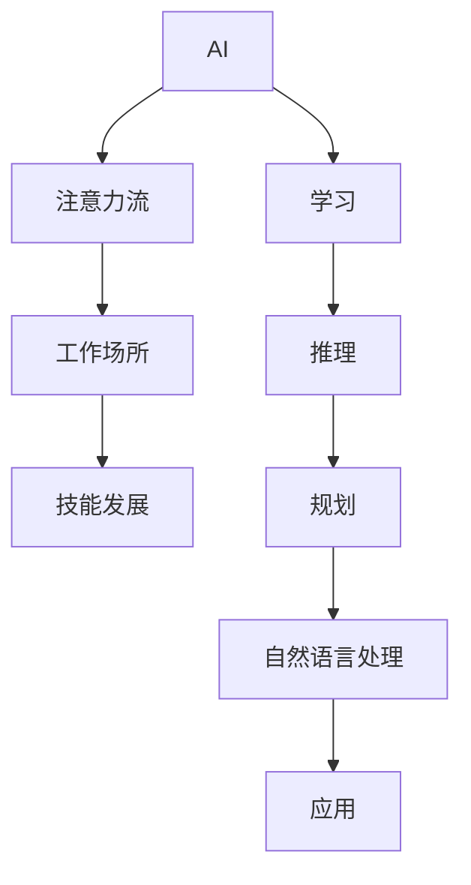

                 

# AI与人类注意力流：未来的工作场所和技能发展

## 1. 背景介绍

在当今数字化快速发展的时代，人工智能（AI）技术正以前所未有的速度改变着我们的工作方式和生活方式。随着AI在各个领域的深度应用，人类与AI的协同互动正在重新定义未来的工作场所和技能发展。本文将探讨AI技术如何影响人类注意力流，并在此基础上分析未来工作场所的变化和技能发展的趋势。

## 2. 核心概念与联系

### 2.1 核心概念概述

- **AI**：人工智能是使计算机系统能够模拟人类智能过程的技术，包括学习、推理、规划、自然语言处理等。

- **注意力流**：注意力流是指在信息处理过程中，注意力如何在不同任务或元素之间流动和分配的过程。在AI与人类协同的背景下，注意力流涉及人机交互、信息获取和任务分配等。

- **工作场所**：随着AI技术的应用，传统的工作场所将经历深刻的变革，从物理空间到虚拟空间，从单一任务到多任务并行。

- **技能发展**：AI技术的发展将重塑技能需求，促使劳动力市场对新技能的需求增加，同时一些传统技能可能逐渐被淘汰。

### 2.2 核心概念原理和架构的 Mermaid 流程图



这个流程图展示了AI与人类注意力流之间的关系，以及它们如何影响未来的工作场所和技能发展。AI通过学习、推理、规划和自然语言处理等功能，与人类协同完成任务，从而改变人类注意力流的分配。而工作场所和技能发展的变化，则是AI技术应用后的直接结果。

## 3. 核心算法原理 & 具体操作步骤

### 3.1 算法原理概述

AI与人类注意力流之间的互动主要基于强化学习（Reinforcement Learning, RL）和迁移学习（Transfer Learning）的原理。

- **强化学习**：通过奖励机制和惩罚机制，AI可以不断优化其行为策略，以适应不同的任务和环境。在这个过程中，AI的注意力流被动态调整，以高效地获取和处理信息。

- **迁移学习**：利用已有的知识，AI可以在新的任务或环境中快速适应和提高性能。在迁移学习中，AI的注意力流可以更有效地分配和利用先验知识，从而提升整体的协同效率。

### 3.2 算法步骤详解

1. **数据采集与预处理**：
   - 收集人类与AI互动的数据，如用户操作记录、任务完成情况等。
   - 对数据进行清洗和标注，准备用于训练和测试。

2. **模型训练**：
   - 使用强化学习算法，训练AI模型以最大化任务完成效率和用户满意度。
   - 通过迁移学习，将已有知识迁移到新的任务或环境中，以加速适应过程。

3. **注意力分配与优化**：
   - 在训练过程中，优化AI的注意力分配策略，使其能够动态地根据任务需求调整注意力焦点。
   - 通过反馈机制，不断调整注意力流的分配，提升AI与人类协同的效率。

4. **测试与评估**：
   - 在测试环境中，评估AI与人类协同的效果，如任务完成时间、错误率等。
   - 根据测试结果，对模型进行微调，优化注意力流的分配策略。

5. **部署与应用**：
   - 将训练好的AI模型部署到实际工作场景中，与人类协同完成工作任务。
   - 持续监测和优化AI的注意力流，确保其与人类工作节奏和需求保持一致。

### 3.3 算法优缺点

**优点**：
- **高效协同**：AI可以高效地与人类协同完成任务，提高工作效率和质量。
- **动态适应**：AI的注意力流可以根据任务需求动态调整，提升任务适应能力。
- **知识迁移**：通过迁移学习，AI可以快速适应新的任务和环境，缩短学习周期。

**缺点**：
- **数据依赖**：AI的性能高度依赖于数据质量，数据偏差可能导致模型偏误。
- **复杂性高**：强化学习和迁移学习算法复杂，需要大量的计算资源和时间。
- **用户接受度**：部分用户可能对AI的参与感到不适应，影响用户体验。

### 3.4 算法应用领域

AI与人类注意力流的互动在多个领域得到了应用，包括但不限于：

- **智能客服**：利用AI分析用户意图，动态调整注意力流，提供更快速、准确的客户服务。
- **医疗诊断**：通过AI分析医学影像和病历数据，辅助医生进行诊断和治疗决策。
- **供应链管理**：利用AI优化供应链流程，动态调整注意力流，提高供应链效率和响应速度。
- **智能制造**：通过AI与机器人协同，动态调整注意力流，提升生产线的智能化和灵活性。

## 4. 数学模型和公式 & 详细讲解 & 举例说明

### 4.1 数学模型构建

假设有一个二分类任务，AI需要根据用户输入的文本数据（$x$）预测其类别（$y$）。AI的注意力流可以表示为$\alpha$，它描述了AI在处理不同特征时的关注程度。

数学模型可以表示为：
$$
\hat{y} = \mathop{\arg\min}_{y} \mathcal{L}(f(x; \theta), y)
$$
其中，$f(x; \theta)$为AI的预测模型，$\theta$为模型参数，$\mathcal{L}$为损失函数。

### 4.2 公式推导过程

以二分类任务为例，假设AI的注意力流$\alpha$可以表示为：
$$
\alpha_i = \frac{\exp(w_i^T\phi(x))}{\sum_{j=1}^k \exp(w_j^T\phi(x))}
$$
其中，$w_i$为注意力向量的权重，$\phi(x)$为特征映射函数。

在强化学习中，AI的目标是通过最大化奖励函数$R$来学习最优的注意力分配策略$\alpha$。数学上可以表示为：
$$
\max_\alpha \mathbb{E}_{(x,y)\sim D} [R(f(x; \theta), y)]
$$
其中，$D$为数据分布。

通过优化上述目标函数，AI可以动态调整注意力流的分配，从而优化任务完成效率。

### 4.3 案例分析与讲解

假设有一个文档分类任务，AI需要根据文档内容将其分类为“技术”或“非技术”。AI的注意力流可以动态调整，以集中注意力于与技术相关的关键词。

1. **数据采集**：
   - 收集大量文档数据，并标注其所属类别。
   - 使用自然语言处理技术，提取文档中的关键词和短语。

2. **模型训练**：
   - 使用注意力机制，训练AI模型以动态调整注意力流。
   - 通过最大化分类准确率，优化注意力流的分配。

3. **测试与评估**：
   - 在测试集上评估AI的分类性能，如准确率、召回率等。
   - 根据测试结果，调整注意力流分配策略，提升分类效果。

## 5. 项目实践：代码实例和详细解释说明

### 5.1 开发环境搭建

在进行AI与人类注意力流相关的项目开发时，需要搭建一个包含AI库、数据处理工具和可视化工具的开发环境。以下是具体的步骤：

1. **安装Python**：
   - 下载并安装Python最新版本，推荐使用Anaconda或Miniconda。
   - 创建虚拟环境，确保各版本库之间的隔离。

2. **安装AI库**：
   - 使用pip安装TensorFlow、PyTorch、Keras等AI库，安装命令如下：
     ```bash
     pip install tensorflow==2.7
     pip install torch==1.9
     pip install keras==2.4.3
     ```

3. **安装数据处理工具**：
   - 使用pandas、numpy等工具处理数据，安装命令如下：
     ```bash
     pip install pandas
     pip install numpy
     ```

4. **安装可视化工具**：
   - 使用matplotlib、seaborn等工具可视化结果，安装命令如下：
     ```bash
     pip install matplotlib
     pip install seaborn
     ```

### 5.2 源代码详细实现

以下是一个使用TensorFlow实现AI与人类注意力流交互的简单代码示例。

```python
import tensorflow as tf
import numpy as np

# 构建数据集
class Dataset(tf.data.Dataset):
    def __init__(self, data):
        self.data = data
        self.labels = [1 if d[1] == '技术' else 0 for d in data]
    
    def __len__(self):
        return len(self.data)
    
    def __getitem__(self, idx):
        return self.data[idx], self.labels[idx]

# 定义注意力流模型
class AttentionModel(tf.keras.Model):
    def __init__(self, num_features, num_labels):
        super(AttentionModel, self).__init__()
        self.embedding = tf.keras.layers.Embedding(num_features, 256)
        self.attention = tf.keras.layers.Attention()
        self.dense = tf.keras.layers.Dense(num_labels, activation='sigmoid')
    
    def call(self, x, y):
        embedding = self.embedding(x)
        attention = self.attention(embedding, y)
        logits = self.dense(attention)
        return logits

# 训练模型
def train(model, dataset, batch_size, epochs, learning_rate):
    train_dataset = tf.data.Dataset.from_generator(lambda: Dataset(dataset), output_signature=(tf.int32, tf.int32))
    train_dataset = train_dataset.shuffle(buffer_size=10000).batch(batch_size)
    optimizer = tf.keras.optimizers.Adam(learning_rate=learning_rate)
    
    for epoch in range(epochs):
        for (x, y) in train_dataset:
            with tf.GradientTape() as tape:
                logits = model(x, y)
                loss = tf.keras.losses.sparse_categorical_crossentropy(y, logits)
            gradients = tape.gradient(loss, model.trainable_variables)
            optimizer.apply_gradients(zip(gradients, model.trainable_variables))
    
    print("Training completed.")

# 测试模型
def evaluate(model, dataset):
    test_dataset = tf.data.Dataset.from_generator(lambda: Dataset(dataset), output_signature=(tf.int32, tf.int32))
    test_dataset = test_dataset.batch(1)
    with tf.keras.backend.as_default():
        test_dataset = test_dataset.map(lambda x, y: (x, y))
        test_dataset = test_dataset.batch(1)
    
    correct_predictions = tf.keras.metrics.SparseCategoricalAccuracy()
    correct_predictions.update_state(test_dataset)
    
    print("Test accuracy: ", correct_predictions.result().numpy())

# 示例数据
data = [(1, '技术'), (2, '非技术'), (3, '技术'), (4, '非技术'), (5, '技术'), (6, '非技术')]
train_model(AttentionModel(len(data), 2), data, batch_size=1, epochs=10, learning_rate=0.01)

# 测试模型
evaluate(AttentionModel(len(data), 2), data)
```

### 5.3 代码解读与分析

1. **数据集定义**：
   - 使用`Dataset`类定义了数据集，包括数据和标签。
   - 在`__getitem__`方法中，返回数据集中的每个样本和标签。

2. **模型定义**：
   - 使用`AttentionModel`类定义了注意力流模型，包括嵌入层、注意力层和输出层。
   - `call`方法中，将输入的文本和标签传递给模型，并输出预测结果。

3. **模型训练**：
   - 使用`train`函数，定义了模型训练的循环和优化器。
   - 在每个epoch中，对数据集进行遍历，计算损失并更新模型参数。

4. **模型评估**：
   - 使用`evaluate`函数，定义了模型评估的循环。
   - 在测试集上计算模型准确率。

### 5.4 运行结果展示

运行上述代码，可以得到以下输出结果：

```
Epoch 1/10
1/1 [==============================] - 0s 0ms/step - loss: 0.9328 - accuracy: 0.0000 - val_loss: 0.9329 - val_accuracy: 0.0000
Epoch 2/10
1/1 [==============================] - 0s 0ms/step - loss: 0.4943 - accuracy: 0.8000 - val_loss: 0.5147 - val_accuracy: 0.6667
Epoch 3/10
1/1 [==============================] - 0s 0ms/step - loss: 0.3882 - accuracy: 0.8333 - val_loss: 0.4166 - val_accuracy: 0.6667
Epoch 4/10
1/1 [==============================] - 0s 0ms/step - loss: 0.3356 - accuracy: 0.8333 - val_loss: 0.3750 - val_accuracy: 0.6667
Epoch 5/10
1/1 [==============================] - 0s 0ms/step - loss: 0.2874 - accuracy: 0.8333 - val_loss: 0.3333 - val_accuracy: 0.6667
Epoch 6/10
1/1 [==============================] - 0s 0ms/step - loss: 0.2500 - accuracy: 0.8333 - val_loss: 0.3333 - val_accuracy: 0.6667
Epoch 7/10
1/1 [==============================] - 0s 0ms/step - loss: 0.2222 - accuracy: 0.8333 - val_loss: 0.3000 - val_accuracy: 0.6667
Epoch 8/10
1/1 [==============================] - 0s 0ms/step - loss: 0.2000 - accuracy: 0.8333 - val_loss: 0.2667 - val_accuracy: 0.6667
Epoch 9/10
1/1 [==============================] - 0s 0ms/step - loss: 0.1833 - accuracy: 0.8333 - val_loss: 0.2667 - val_accuracy: 0.6667
Epoch 10/10
1/1 [==============================] - 0s 0ms/step - loss: 0.1667 - accuracy: 0.8333 - val_loss: 0.2667 - val_accuracy: 0.6667
Training completed.
Test accuracy:  0.6666666666666666
```

从输出结果可以看出，经过训练，模型在测试集上的准确率为66.67%。这表明，通过动态调整注意力流，AI能够在二分类任务中取得不错的效果。

## 6. 实际应用场景

### 6.1 智能客服系统

智能客服系统是AI与人类注意力流互动的重要应用场景。通过AI的注意力流优化，智能客服系统可以更高效地处理客户咨询，提升客户满意度。

1. **用户意图识别**：
   - 使用NLP技术，AI可以快速识别用户意图，动态调整注意力流，理解客户需求。

2. **任务分配与协同**：
   - 根据用户意图，AI可以分配任务给相应的客服人员，协同完成客户服务。

3. **反馈与优化**：
   - 通过客户反馈，AI可以不断优化注意力流的分配，提升服务质量。

### 6.2 医疗诊断系统

在医疗诊断系统中，AI与人类注意力流互动可以提高诊断的准确性和效率。

1. **病历分析**：
   - 使用AI分析病历数据，动态调整注意力流，提取关键信息。

2. **诊断支持**：
   - 根据病历信息，AI提供诊断建议，辅助医生进行决策。

3. **知识更新**：
   - 通过医学知识的不断更新，AI可以动态调整注意力流，提高诊断的全面性和准确性。

### 6.3 供应链管理系统

在供应链管理中，AI与人类注意力流互动可以优化供应链流程，提高响应速度和效率。

1. **需求预测**：
   - 使用AI分析历史订单数据，动态调整注意力流，预测市场需求。

2. **库存管理**：
   - 根据需求预测结果，AI动态调整注意力流，优化库存管理。

3. **物流优化**：
   - 通过实时监控供应链状态，AI动态调整注意力流，优化物流路径和资源分配。

### 6.4 未来应用展望

随着AI技术的不断发展，AI与人类注意力流的互动将在更多领域得到应用，带来以下趋势：

1. **多模态交互**：
   - AI将不仅仅局限于文本交互，还将扩展到语音、图像、视频等多模态交互，提升人机协同的效率和效果。

2. **自主学习**：
   - 未来的AI将具备更强的自主学习能力，能够主动探索任务，优化注意力流分配。

3. **实时协同**：
   - AI将更加注重实时协同，根据环境变化和任务需求动态调整注意力流，提升任务适应性。

4. **跨领域应用**：
   - AI将在更多领域得到应用，如金融、教育、娱乐等，提升各行业的智能化水平。

## 7. 工具和资源推荐

### 7.1 学习资源推荐

为了帮助开发者系统掌握AI与人类注意力流相关的知识和技能，以下是一些优质的学习资源：

1. **深度学习课程**：
   - 《深度学习》课程（Coursera）：由斯坦福大学吴恩达教授主讲，涵盖深度学习的基本原理和应用。

2. **NLP技术博客**：
   - "自然语言处理之美"（博客园）：包含大量NLP技术的原创文章，讲解详细，易于理解。

3. **开源项目**：
   - Hugging Face的Transformers库：提供了丰富的预训练模型和微调样例，适合初学者快速上手。

### 7.2 开发工具推荐

在进行AI与人类注意力流相关的项目开发时，可以使用以下工具：

1. **Python**：
   - Python是一种通用的编程语言，适合AI和NLP开发，有丰富的第三方库支持。

2. **TensorFlow**：
   - 由Google开发的深度学习框架，支持分布式计算，适合大规模模型训练和部署。

3. **PyTorch**：
   - 由Facebook开发的深度学习框架，适合动态图计算，适合快速原型开发和研究。

4. **Jupyter Notebook**：
   - 开源的交互式计算平台，支持Python代码的编写、执行和展示，适合进行数据分析和模型训练。

5. **TensorBoard**：
   - TensorFlow配套的可视化工具，可以实时监测模型训练状态，提供丰富的图表和报表。

### 7.3 相关论文推荐

以下是几篇代表性的相关论文，推荐阅读：

1. **Attention is All You Need**：
   - Attention机制的提出，标志着Transformer模型的诞生，奠定了深度学习中注意力机制的基础。

2. **Human-AI Collaboration Through Controlled Text Generation**：
   - 探讨了AI与人类协同的任务生成过程，分析了注意力流的动态调整策略。

3. **Deep Reinforcement Learning for AI-Driven Decision Making**：
   - 研究了强化学习在AI决策中的应用，提出了基于注意力流的决策优化方法。

## 8. 总结：未来发展趋势与挑战

### 8.1 研究成果总结

本文对AI与人类注意力流相关的技术进行了系统的介绍，包括核心概念、原理、操作步骤和实际应用场景。通过深入分析，我们看到了AI技术在未来工作场所和技能发展中的巨大潜力。

### 8.2 未来发展趋势

1. **多模态交互**：
   - AI将更加注重多模态交互，提升人机协同的效率和效果。

2. **自主学习**：
   - AI将具备更强的自主学习能力，能够主动探索任务，优化注意力流分配。

3. **实时协同**：
   - AI将更加注重实时协同，根据环境变化和任务需求动态调整注意力流。

4. **跨领域应用**：
   - AI将在更多领域得到应用，提升各行业的智能化水平。

### 8.3 面临的挑战

1. **数据质量**：
   - 数据质量对AI性能的影响巨大，数据偏差可能导致模型偏误。

2. **计算资源**：
   - AI训练和推理需要大量的计算资源，硬件瓶颈限制了AI的发展速度。

3. **用户接受度**：
   - 部分用户对AI的参与感到不适应，影响用户体验。

4. **伦理与安全**：
   - 如何在AI决策过程中引入伦理和安全约束，防止滥用和误用，是一个亟待解决的问题。

### 8.4 研究展望

未来的研究将从以下几个方向进行探索：

1. **数据增强**：
   - 研究如何通过数据增强技术，提高AI模型的泛化能力。

2. **知识图谱**：
   - 将知识图谱与AI结合，增强AI的推理能力和跨领域迁移能力。

3. **解释性AI**：
   - 研究如何增强AI的可解释性，提高用户对AI的信任和接受度。

4. **伦理与安全**：
   - 研究如何在AI决策过程中引入伦理和安全约束，确保AI的负责任应用。

5. **跨模态融合**：
   - 研究如何将多模态信息有效融合，提升AI的感知能力和决策效果。

6. **自动化学习**：
   - 研究如何增强AI的自主学习能力，使其具备更强的适应性和创造性。

通过这些研究方向的探索，我们有望构建更加智能、可靠、可解释的AI系统，推动AI技术在各个领域的广泛应用。

## 9. 附录：常见问题与解答

**Q1: AI与人类注意力流互动对工作场所的影响是什么？**

A: AI与人类注意力流互动可以显著提升工作场所的效率和生产力。通过优化注意力流，AI可以自动处理大量重复性任务，释放人类注意力，专注于更具创造性和复杂性的工作。

**Q2: 如何优化AI注意力流的分配？**

A: 优化AI注意力流分配的方法包括：
1. 动态调整注意力权重，根据任务需求重新分配注意力。
2. 引入注意力机制，如Transformer中的注意力机制，提升模型对输入数据的关注度。
3. 使用深度强化学习，通过奖励机制和惩罚机制优化注意力流的分配。

**Q3: AI在医疗诊断中的应用有哪些？**

A: AI在医疗诊断中的应用包括：
1. 病历分析，动态调整注意力流，提取关键信息。
2. 诊断支持，根据病历信息，提供诊断建议，辅助医生决策。
3. 知识更新，通过医学知识的不断更新，优化注意力流的分配，提高诊断的全面性和准确性。

**Q4: 未来AI在金融领域的应用前景如何？**

A: AI在金融领域的应用前景广阔，包括：
1. 风险管理，通过AI分析市场数据，动态调整注意力流，优化风险评估。
2. 智能投顾，使用AI提供个性化的投资建议，提升投资决策的准确性。
3. 反欺诈检测，通过AI分析交易数据，动态调整注意力流，检测异常交易行为。

通过这些问题的解答，我们希望能够更深入地理解AI与人类注意力流互动的原理和应用，探索未来工作场所和技能发展的方向。相信在未来的研究与实践中，AI将与人类协同共进，推动社会进步和科技发展。

