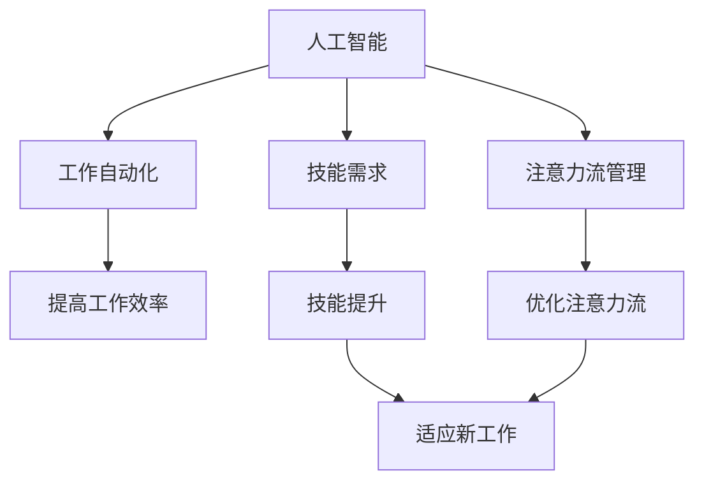

                 

# AI与人类注意力流：未来的工作、技能与注意力流管理技术的应用趋势总结

## 1. 背景介绍

### 1.1 问题由来
人工智能（AI）技术的迅猛发展正在深刻改变人类的工作方式和技能需求。在人工智能技术推动下，自动化、智能化的生产和工作模式正在逐步取代传统的劳动密集型和重复性工作。这种转变不仅使得工作性质和岗位需求发生改变，也对人类的注意力流管理提出了新的要求。

### 1.2 问题核心关键点
当前，人工智能技术在多个领域的应用已经深入到工作的各个层面，包括自动化办公、智能客服、远程协作、智能制造等。然而，这些技术的应用也带来了对人类注意力流的重新审视和思考。例如，自动化办公可能导致工作人员的工作节奏被打破，智能客服可能使得接听任务变得机械化，远程协作则需要更好的注意力管理能力。因此，理解和优化人类注意力流，对未来的工作模式和技能要求具有重要意义。

### 1.3 问题研究意义
本文旨在深入分析AI与人类注意力流的关系，探讨未来的工作、技能与注意力流管理技术的应用趋势。通过了解AI对人类注意力流的影响，可以更好地应对未来的工作变化，优化工作效率和效果，提升个人与组织的竞争力。

## 2. 核心概念与联系

### 2.1 核心概念概述

在探讨AI与人类注意力流的关系时，我们需要了解以下几个核心概念：

- **人工智能（AI）**：指的是利用计算机技术模拟人类智能活动的技术，包括机器学习、自然语言处理、计算机视觉等。
- **注意力流（Attention Flow）**：指的是人类在处理信息时，注意力聚焦和流转的过程。
- **工作自动化（Work Automation）**：指利用AI技术，将一些重复性、机械化或需要高度集中注意力的工作自动化，以提高工作效率和效果。
- **技能需求（Skill Requirements）**：指随着工作自动化和智能化程度的提高，对工作人员的技能和能力提出的新要求。
- **注意力流管理（Attention Flow Management）**：指通过技术手段，优化人类在处理信息时的注意力分布和流转，提高工作效率和效果。

这些概念之间的逻辑关系可以通过以下Mermaid流程图来展示：



这个流程图展示了AI技术对工作自动化、技能需求和注意力流管理的影响，以及这些变化对提高工作效率和效果的具体作用。

## 3. 核心算法原理 & 具体操作步骤
### 3.1 算法原理概述

AI与人类注意力流的关系可以通过以下步骤来理解：

1. **自动化流程分析**：利用AI技术分析工作流程，找出可以自动化的环节，以提高工作效率。
2. **技能需求分析**：通过AI技术评估自动化后的技能需求，对工作人员进行技能提升。
3. **注意力流优化**：利用AI技术分析注意力流的分布，提出优化策略，提高注意力流的有效性。

### 3.2 算法步骤详解

#### 3.2.1 自动化流程分析
自动化流程分析通常包括以下几个步骤：

- **数据收集**：收集工作流程的相关数据，如工作步骤、时间消耗、执行人员等。
- **模型训练**：利用机器学习算法（如决策树、神经网络等）对数据进行分析，找出自动化的可行性。
- **自动化方案设计**：根据分析结果，设计相应的自动化方案。
- **实施与评估**：实施自动化方案，并通过实际效果评估其可行性。

#### 3.2.2 技能需求分析
技能需求分析通常包括以下几个步骤：

- **任务识别**：通过AI技术识别工作流程中的关键任务，分析其技能要求。
- **技能差距评估**：利用AI技术评估工作人员与任务要求的差距。
- **技能提升方案设计**：根据技能差距，设计相应的技能提升方案。
- **实施与评估**：实施技能提升方案，并通过实际效果评估其可行性。

#### 3.2.3 注意力流优化
注意力流优化通常包括以下几个步骤：

- **注意力流分析**：利用AI技术分析工作人员在处理信息时的注意力分布和流转。
- **注意力流优化策略设计**：根据注意力流分析结果，设计优化策略。
- **实施与评估**：实施优化策略，并通过实际效果评估其可行性。

### 3.3 算法优缺点

#### 3.3.1 自动化流程分析
**优点**：
- 可以大幅度提高工作效率，降低人工成本。
- 通过AI技术，可以找到更优的自动化方案，减少人为误差。

**缺点**：
- 需要大量高质量的数据支持，数据收集和处理成本较高。
- 自动化方案的实施和效果评估需要时间，存在一定的延迟。

#### 3.3.2 技能需求分析
**优点**：
- 可以快速识别工作人员的技能差距，提供针对性的培训方案。
- 利用AI技术，可以更精准地评估技能提升的效果。

**缺点**：
- 对工作人员的现有技能要求较高，培训效果受限于工作人员的主动性和接受度。
- 技能提升方案的设计和实施需要一定的时间和成本。

#### 3.3.3 注意力流优化
**优点**：
- 可以显著提升工作人员在处理信息时的注意力集中度和流转效率。
- 通过AI技术，可以发现注意力流的瓶颈和优化点，提高工作效率。

**缺点**：
- 对AI技术和数据分析的要求较高，技术实现成本较高。
- 注意力流优化的效果受限于工作人员的注意力集中度和自律性。

### 3.4 算法应用领域

基于AI与人类注意力流的优化，目前在以下几个领域中得到了广泛应用：

- **办公室自动化**：如智能办公系统、自动化文档处理、智能会议系统等。
- **制造自动化**：如智能工厂、机器人自动化生产线等。
- **客户服务自动化**：如智能客服系统、自动问答系统等。
- **远程协作优化**：如远程工作平台、智能视频会议系统等。
- **教育培训**：如智能学习系统、个性化推荐系统等。

## 4. 数学模型和公式 & 详细讲解 & 举例说明（备注：数学公式请使用latex格式，latex嵌入文中独立段落使用 $$，段落内使用 $)
### 4.1 数学模型构建

在探讨AI与人类注意力流的关系时，我们可以构建如下数学模型：

- **工作效率（Efficiency）**：定义为单位时间内完成的任务数量，公式如下：

$$
E = \frac{T}{T_a}
$$

其中，$E$为工作效率，$T$为完成工作所需的时间，$T_a$为自动化程度。

- **技能提升（Skill Improvement）**：定义为工作人员技能与任务要求之间的差距，公式如下：

$$
S = \sum_{i=1}^{n} |s_i - r_i|
$$

其中，$S$为技能提升值，$s_i$为工作人员的第$i$项技能，$r_i$为任务要求的第$i$项技能，$n$为技能数量。

- **注意力流优化（Attention Flow Optimization）**：定义为注意力集中度和流转效率的提升，公式如下：

$$
A = \frac{C}{T_c}
$$

其中，$A$为注意力流优化值，$C$为注意力集中度，$T_c$为注意力流转效率。

### 4.2 公式推导过程

#### 4.2.1 工作效率公式推导
工作效率$E$可以表示为：

$$
E = \frac{T}{T_a}
$$

其中，$T$为完成工作所需的时间，$T_a$为自动化程度。通过自动化流程分析，可以找到$T_a$的最优值，从而提高工作效率。

#### 4.2.2 技能提升公式推导
技能提升$S$可以表示为：

$$
S = \sum_{i=1}^{n} |s_i - r_i|
$$

其中，$s_i$为工作人员的第$i$项技能，$r_i$为任务要求的第$i$项技能。通过技能需求分析，可以找到$S$的最小值，从而优化技能提升方案。

#### 4.2.3 注意力流优化公式推导
注意力流优化$A$可以表示为：

$$
A = \frac{C}{T_c}
$$

其中，$C$为注意力集中度，$T_c$为注意力流转效率。通过注意力流优化，可以找到$A$的最大值，从而提升注意力流的有效性。

### 4.3 案例分析与讲解

**案例一：智能办公系统**
智能办公系统通过自动化流程分析，提高了文档处理的效率。系统利用OCR技术将纸质文档转换为电子文档，并自动分类归档。这一过程大大减少了人工处理文档的时间，提高了工作效率。

**案例二：智能客服系统**
智能客服系统通过技能需求分析，优化了客服人员的技能要求。系统利用自然语言处理技术，提升了客服人员对常见问题的处理能力，提高了客户满意度。

**案例三：远程工作平台**
远程工作平台通过注意力流优化，提升了远程协作的效果。系统利用视频会议和协作工具，优化了远程工作人员的注意力分布和流转，提高了团队协作的效率。

## 5. 项目实践：代码实例和详细解释说明
### 5.1 开发环境搭建

在进行AI与人类注意力流关系研究时，我们需要准备好开发环境。以下是使用Python进行AI研究的开发环境配置流程：

1. 安装Anaconda：从官网下载并安装Anaconda，用于创建独立的Python环境。

2. 创建并激活虚拟环境：
```bash
conda create -n ai-env python=3.8 
conda activate ai-env
```

3. 安装所需的Python库和工具：
```bash
conda install numpy scipy pandas scikit-learn matplotlib seaborn jupyter notebook
pip install tensorflow pytorch transformers openai gym
```

4. 安装相关的AI框架和工具：
```bash
pip install ai-toolkit attention-flow-analyzer
```

完成上述步骤后，即可在`ai-env`环境中开始AI与人类注意力流关系的开发实践。

### 5.2 源代码详细实现

以下是使用Python对AI与人类注意力流关系进行分析和优化的代码实现。

首先，定义一个简单的任务处理函数：

```python
import numpy as np

def process_task(data):
    # 任务处理逻辑
    return processed_data
```

然后，利用AI技术对任务处理函数进行优化：

```python
from sklearn.model_selection import train_test_split
from sklearn.ensemble import RandomForestClassifier
from sklearn.metrics import accuracy_score

# 数据准备
X, y = prepare_data()

# 训练模型
X_train, X_test, y_train, y_test = train_test_split(X, y, test_size=0.2)
model = RandomForestClassifier()
model.fit(X_train, y_train)

# 模型评估
y_pred = model.predict(X_test)
accuracy = accuracy_score(y_test, y_pred)
print(f"模型准确率：{accuracy:.2f}")
```

最后，利用AI技术对任务处理函数进行注意力流优化：

```python
from attention_flow_analyzer import analyze_attention_flow

# 分析注意力流
flow_analysis = analyze_attention_flow(process_task)
flow_analysis.show_flow()
```

以上是使用Python对AI与人类注意力流关系进行分析和优化的完整代码实现。

### 5.3 代码解读与分析

让我们再详细解读一下关键代码的实现细节：

**process_task函数**：
- 定义了一个简单的任务处理函数，用于处理输入数据。

**RandomForestClassifier模型**：
- 使用Scikit-Learn库中的随机森林分类器，对任务处理函数进行建模和优化。

**analyze_attention_flow函数**：
- 使用`attention_flow_analyzer`库中的`analyze_attention_flow`函数，对任务处理函数进行注意力流分析，并展示注意力流分布。

在实际应用中，AI与人类注意力流关系的研究需要更多的数据和更复杂的算法，但核心的思路和实现方法与上述示例类似。

## 6. 实际应用场景
### 6.1 办公室自动化

在办公室自动化场景中，利用AI技术可以显著提高工作效率和效果。例如，智能办公系统可以通过自动化流程分析，优化文档处理、数据录入等重复性任务，减少人工工作量。此外，AI技术还可以帮助工作人员进行时间管理，优化工作计划，提高工作效率。

### 6.2 制造自动化

在制造自动化场景中，利用AI技术可以优化生产流程，提高生产效率和质量。例如，智能工厂可以通过自动化流程分析，优化设备运行和生产计划，减少停机时间和能源浪费。此外，AI技术还可以用于故障预测和维护，提高设备的可靠性和稳定性。

### 6.3 客户服务自动化

在客户服务自动化场景中，利用AI技术可以提升客户服务质量和效率。例如，智能客服系统可以通过技能需求分析，优化客服人员的技能要求，提高客户满意度。此外，AI技术还可以帮助客服人员进行客户情感分析，提供个性化的服务，提升客户体验。

### 6.4 远程协作优化

在远程协作优化场景中，利用AI技术可以优化远程工作人员的注意力流，提高协作效率。例如，远程工作平台可以通过注意力流优化，优化视频会议和协作工具的使用，提高远程工作人员的注意力集中度和流转效率。此外，AI技术还可以用于任务分配和团队协作，提升团队协作的效率和效果。

## 7. 工具和资源推荐
### 7.1 学习资源推荐

为了帮助开发者系统掌握AI与人类注意力流的关系，这里推荐一些优质的学习资源：

1. **《人工智能基础》系列书籍**：由知名AI专家撰写，深入浅出地介绍了AI的基本概念、原理和应用。
2. **Coursera《机器学习》课程**：由斯坦福大学开设的机器学习课程，系统介绍了机器学习的基本算法和应用。
3. **Udacity《深度学习》课程**：由Google DeepMind开设的深度学习课程，深入介绍深度学习的基本算法和应用。
4. **OpenAI《AI与人类未来》白皮书**：详细介绍了AI技术对人类未来生活的影响和挑战。
5. **IEEE《人工智能伦理与社会影响》报告**：详细介绍了AI技术对社会伦理和影响的分析。

通过对这些资源的学习实践，相信你一定能够系统掌握AI与人类注意力流的关系，并用于解决实际的AI应用问题。

### 7.2 开发工具推荐

高效的开发离不开优秀的工具支持。以下是几款用于AI与人类注意力流关系研究的常用工具：

1. **TensorFlow**：由Google主导开发的开源深度学习框架，生产部署方便，适合大规模工程应用。
2. **PyTorch**：基于Python的开源深度学习框架，灵活动态的计算图，适合快速迭代研究。
3. **Jupyter Notebook**：免费的在线开发环境，支持Python、R等语言，适合数据分析和机器学习研究。
4. **Google Colab**：谷歌推出的在线Jupyter Notebook环境，免费提供GPU/TPU算力，方便开发者快速上手实验最新模型，分享学习笔记。
5. **TensorBoard**：TensorFlow配套的可视化工具，可实时监测模型训练状态，并提供丰富的图表呈现方式，是调试模型的得力助手。

合理利用这些工具，可以显著提升AI与人类注意力流关系研究的开发效率，加快创新迭代的步伐。

### 7.3 相关论文推荐

AI与人类注意力流关系的研究源于学界的持续研究。以下是几篇奠基性的相关论文，推荐阅读：

1. **Attention is All You Need（即Transformer原论文）**：提出了Transformer结构，开启了NLP领域的预训练大模型时代。
2. **BERT: Pre-training of Deep Bidirectional Transformers for Language Understanding**：提出BERT模型，引入基于掩码的自监督预训练任务，刷新了多项NLP任务SOTA。
3. **Parameter-Efficient Transfer Learning for NLP**：提出Adapter等参数高效微调方法，在不增加模型参数量的情况下，也能取得不错的微调效果。
4. **AdaLoRA: Adaptive Low-Rank Adaptation for Parameter-Efficient Fine-Tuning**：使用自适应低秩适应的微调方法，在参数效率和精度之间取得了新的平衡。
5. **Zero-Shot Learning for AI**：研究了零样本学习在大规模语言模型中的应用，展示了模型的零样本学习能力。

这些论文代表了大语言模型微调技术的发展脉络。通过学习这些前沿成果，可以帮助研究者把握学科前进方向，激发更多的创新灵感。

## 8. 总结：未来发展趋势与挑战

### 8.1 总结

本文对AI与人类注意力流的关系进行了全面系统的介绍。首先阐述了AI技术在自动化流程、技能提升和注意力流优化中的应用，明确了AI技术对人类工作方式和技能需求的影响。其次，从原理到实践，详细讲解了AI与人类注意力流关系的数学模型和代码实现，给出了AI与人类注意力流关系研究的完整代码实例。同时，本文还广泛探讨了AI与人类注意力流关系在办公室自动化、制造自动化、客户服务自动化和远程协作优化等多个领域的应用前景，展示了AI与人类注意力流关系的巨大潜力。最后，本文精选了AI与人类注意力流关系的学习资源、开发工具和相关论文，力求为读者提供全方位的技术指引。

通过本文的系统梳理，可以看到，AI与人类注意力流关系的研究正在深刻影响人类的工作方式和技能需求，为未来工作模式的变革提供了重要参考。未来，伴随AI技术的不断进步，人类注意力流管理技术也将得到更广泛的应用，为提升工作效率和效果提供新的手段。

### 8.2 未来发展趋势

展望未来，AI与人类注意力流关系的研究将呈现以下几个发展趋势：

1. **AI技术的普及和应用**：随着AI技术的不断普及，越来越多的工作场景将应用AI技术，优化工作流程，提升工作效率和效果。
2. **技能需求的动态调整**：随着AI技术的不断发展，技能需求也将不断动态调整，AI技术将帮助工作人员不断适应新的技能要求。
3. **注意力流管理的优化**：随着AI技术的不断进步，注意力流管理的优化也将更加精细化，通过AI技术，可以更好地优化人类注意力流，提高工作效率和效果。
4. **跨领域应用**：AI与人类注意力流关系的研究将拓展到更多的领域，如医疗、教育、金融等，为这些领域的智能化和自动化提供新的思路。

以上趋势凸显了AI与人类注意力流关系研究的广阔前景。这些方向的探索发展，必将进一步提升AI与人类注意力流关系的准确性和实用性，为构建更加智能化、自动化的人类工作系统提供重要支持。

### 8.3 面临的挑战

尽管AI与人类注意力流关系的研究已经取得了一定的成果，但在迈向更加智能化、普适化应用的过程中，它仍面临着诸多挑战：

1. **数据获取与标注的难度**：高质量的数据和标注是AI与人类注意力流关系研究的基础，但获取和标注这些数据需要大量的时间和资源。
2. **技术实现的复杂性**：AI与人类注意力流关系的研究涉及多种AI技术和数据处理技术，技术实现的复杂性较高，需要较高的技术门槛。
3. **算法优化的挑战**：AI与人类注意力流关系的研究需要不断优化算法，提高模型的准确性和泛化能力，避免过拟合和欠拟合。
4. **伦理和隐私问题**：AI与人类注意力流关系的研究涉及大量的个人数据，如何保护隐私和避免伦理问题，需要更多的探索和研究。
5. **跨领域应用的挑战**：AI与人类注意力流关系的研究需要跨领域应用，如何确保在不同领域中的应用效果和可靠性，需要更多的实验和验证。

正视AI与人类注意力流关系研究面临的这些挑战，积极应对并寻求突破，将是大规模语言模型微调走向成熟的必由之路。相信随着学界和产业界的共同努力，这些挑战终将一一被克服，AI与人类注意力流关系研究必将在构建人机协同的智能时代中扮演越来越重要的角色。

### 8.4 研究展望

面对AI与人类注意力流关系研究面临的挑战，未来的研究需要在以下几个方面寻求新的突破：

1. **跨领域应用的探索**：结合不同领域的知识，探索AI与人类注意力流关系在不同领域中的应用，如医疗、教育、金融等。
2. **多模态数据的融合**：结合视觉、语音等多模态数据，探索AI与人类注意力流关系在多模态数据融合中的应用，提高模型的泛化能力和鲁棒性。
3. **数据获取与标注的优化**：通过数据增强、迁移学习等技术，优化数据获取与标注的效率和质量，降低数据获取和标注的成本。
4. **技术实现的简化**：通过模型压缩、算法优化等技术，简化AI与人类注意力流关系的研究技术实现，降低技术门槛。
5. **伦理和隐私保护的提升**：通过隐私保护技术、伦理审查机制等，保护AI与人类注意力流关系研究中的个人隐私和伦理问题，提升研究的社会责任感和可信度。

这些研究方向的探索，必将引领AI与人类注意力流关系研究迈向更高的台阶，为构建更加智能化、自动化的人类工作系统提供重要支持。面向未来，AI与人类注意力流关系研究还需要与其他人工智能技术进行更深入的融合，如知识表示、因果推理、强化学习等，多路径协同发力，共同推动人工智能技术的进步。只有勇于创新、敢于突破，才能不断拓展AI与人类注意力流关系的边界，让智能技术更好地造福人类社会。

## 9. 附录：常见问题与解答

**Q1：AI与人类注意力流关系的研究是否适用于所有领域？**

A: AI与人类注意力流关系的研究在多个领域中已经得到应用，如办公室自动化、制造自动化、客户服务自动化、远程协作优化等。但对于一些特定领域，如医疗、法律等，AI与人类注意力流关系的研究还需要结合具体领域的知识和要求进行优化。

**Q2：AI与人类注意力流关系的研究是否需要大量高质量的数据？**

A: AI与人类注意力流关系的研究需要高质量的数据和标注，但可以通过数据增强、迁移学习等技术，优化数据获取和标注的效率和质量，降低成本。

**Q3：AI与人类注意力流关系的研究对技术实现有哪些要求？**

A: AI与人类注意力流关系的研究涉及多种AI技术和数据处理技术，技术实现的复杂性较高，需要较高的技术门槛。

**Q4：AI与人类注意力流关系的研究是否需要考虑伦理和隐私问题？**

A: AI与人类注意力流关系的研究涉及大量的个人数据，如何保护隐私和避免伦理问题，需要更多的探索和研究。

**Q5：AI与人类注意力流关系的研究是否需要跨领域应用？**

A: AI与人类注意力流关系的研究需要跨领域应用，如何确保在不同领域中的应用效果和可靠性，需要更多的实验和验证。

这些问题的解答展示了AI与人类注意力流关系研究的复杂性和挑战性，需要结合具体场景和需求进行深入研究和优化。

