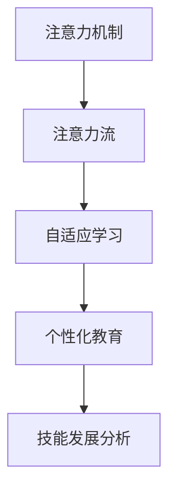

                 

# AI与人类注意力流：未来的教育与技能发展

> 关键词：人工智能,注意力机制,教育,技能发展,未来教育,技术应用

## 1. 背景介绍

### 1.1 问题由来

随着人工智能(AI)技术的迅猛发展，其在教育、技能培训等领域的应用逐渐增多。AI可以自动化处理大量的学习数据，提供个性化的学习建议，甚至自动评估学生的学习效果。但是，人工智能在教育中的应用并不仅限于数据分析和自动化教学。本文将探讨AI与人类注意力流的结合，以及这种结合对未来教育与技能发展的潜在影响。

### 1.2 问题核心关键点

AI与人类注意力流的结合主要涉及以下几个关键点：

- **注意力机制**：AI中的注意力机制可以帮助机器更好地聚焦于重要的信息，类似于人类注意力流的运作方式。
- **个性化学习**：通过了解学生的注意力流模式，AI可以提供更加个性化的学习方案，适应不同学生的学习节奏和偏好。
- **自适应评估**：AI可以实时监测学生的注意力集中度，通过评估注意力流模式来动态调整教学内容和难度。
- **技能发展**：通过分析学生注意力流的变化，AI可以预测学生在不同领域的技能发展情况，并提供有针对性的培训。

## 2. 核心概念与联系

### 2.1 核心概念概述

为更好地理解AI与人类注意力流在教育中的应用，本节将介绍几个密切相关的核心概念：

- **注意力机制**：在深度学习中，注意力机制是一种机制，用于动态选择输入序列中相关部分的表示，以提高模型在序列任务上的性能。注意力机制可以被看作是人类注意力流的一种模拟。
- **注意力流**：在认知心理学中，注意力流指的是大脑在处理信息时的注意力分配方式，包括注意力集中的时间、位置和强度等。
- **自适应学习**：自适应学习是一种学习方法，通过实时调整学习内容和策略，以适应学习者的个性化需求和学习进度。
- **个性化教育**：个性化教育旨在根据每个学习者的兴趣、能力和学习风格，提供量身定制的教育内容和路径。
- **技能发展分析**：通过分析学习过程中的注意力流模式，可以预测学生在不同技能上的发展情况，并为其提供有针对性的培训。

这些核心概念之间的逻辑关系可以通过以下Mermaid流程图来展示：



这个流程图展示了注意力机制与人类注意力流之间的关系，以及它们如何共同作用于自适应学习、个性化教育和技能发展分析，从而推动未来教育与技能发展。

## 3. 核心算法原理 & 具体操作步骤
### 3.1 算法原理概述

AI与人类注意力流的结合主要通过注意力机制来实现。在深度学习模型中，注意力机制可以帮助模型动态地选择输入序列中与当前任务相关的部分，从而提高模型的性能。这种机制与人类注意力流类似，可以帮助模型更好地聚焦于重要的信息，而忽略无关的信息。

### 3.2 算法步骤详解

基于注意力机制的AI与人类注意力流的结合步骤如下：

1. **数据收集**：收集学生的学习数据，包括学习行为、注意力集中度、成绩等信息。
2. **注意力模型训练**：使用注意力机制训练模型，使其能够根据学生的注意力流模式，动态选择相关的学习内容和策略。
3. **个性化学习计划制定**：根据学生的注意力流模式，制定个性化的学习计划，包括学习内容、学习时间、学习方式等。
4. **实时监测与调整**：实时监测学生的注意力集中度，并根据注意力流模式动态调整学习计划和教学内容。
5. **技能发展分析**：分析学习过程中的注意力流模式，预测学生在不同技能上的发展情况，提供有针对性的培训。

### 3.3 算法优缺点

AI与人类注意力流结合的算法具有以下优点：

- **个性化**：能够根据每个学生的注意力流模式，提供量身定制的学习计划，提高学习效率。
- **自适应**：能够实时调整学习计划和教学内容，适应学生的学习节奏和需求。
- **高效性**：通过动态选择相关信息，减少学习过程中的信息过载，提高学习效果。

但该算法也存在一些缺点：

- **数据依赖**：需要大量的学习数据来训练模型，数据的质量和数量对模型的性能有重要影响。
- **模型复杂性**：注意力机制的实现较为复杂，需要较高的计算资源和技术水平。
- **隐私问题**：学习数据的收集和处理可能涉及隐私问题，需要严格的数据保护措施。

### 3.4 算法应用领域

基于注意力机制的AI与人类注意力流的结合，已经在多个领域得到应用，包括：

- **在线教育**：通过分析学生的注意力流模式，提供个性化的学习方案和实时评估。
- **企业培训**：为员工提供个性化的培训内容和自适应的学习路径。
- **心理辅导**：通过分析注意力流模式，提供心理健康和行为矫正的支持。
- **医疗健康**：分析患者在治疗过程中的注意力流，提供个性化的康复方案。
- **游戏设计**：在游戏设计中应用注意力机制，提升玩家的游戏体验和留存率。

## 4. 数学模型和公式 & 详细讲解 & 举例说明

### 4.1 数学模型构建

注意力机制的核心是一个注意力向量，表示输入序列中每个元素的重要性权重。在数学上，注意力向量 $a_i$ 可以通过以下公式计算：

$$
a_i = \frac{\exp(e_i)}{\sum_{j=1}^n \exp(e_j)}
$$

其中，$e_i$ 是输入序列中第 $i$ 个元素的注意力得分，$n$ 是输入序列的长度。注意力得分可以通过多种方式计算，如点积注意力、加性注意力等。

### 4.2 公式推导过程

点积注意力的计算公式为：

$$
e_i = \text{DotProduct}(Q, K_i, V_i)
$$

其中，$Q$ 是查询向量，$K_i$ 和 $V_i$ 是第 $i$ 个位置的键向量和值向量。点积注意力的计算过程如下：

1. 计算查询向量 $Q$ 与键向量 $K_i$ 的点积 $q_k$。
2. 对所有键向量 $K_j$ 计算点积 $q_k$。
3. 计算归一化因子 $S$，即所有键向量的点积之和。
4. 计算注意力得分 $e_i$，即查询向量与键向量的点积除以归一化因子。
5. 计算注意力向量 $a_i$，即指数函数下的注意力得分除以归一化因子。

### 4.3 案例分析与讲解

以在线教育为例，假设学生在学习过程中对不同内容的注意力集中度不同。教师可以使用注意力机制，根据学生的历史学习数据和实时注意力流模式，动态调整教学内容和学习策略。具体步骤如下：

1. 收集学生的学习数据，包括观看视频的时长、暂停次数、点击次数等。
2. 使用注意力机制训练模型，学习每个视频片段的重要性权重。
3. 根据学生的注意力流模式，选择重要的视频片段进行重点讲解。
4. 实时监测学生的注意力集中度，动态调整学习内容和时间。
5. 分析学生的注意力流模式，预测其在不同技能上的发展情况，提供有针对性的培训。

## 5. 项目实践：代码实例和详细解释说明
### 5.1 开发环境搭建

在进行项目实践前，我们需要准备好开发环境。以下是使用Python进行TensorFlow开发的环境配置流程：

1. 安装Anaconda：从官网下载并安装Anaconda，用于创建独立的Python环境。

2. 创建并激活虚拟环境：
```bash
conda create -n tf-env python=3.8 
conda activate tf-env
```

3. 安装TensorFlow：根据CUDA版本，从官网获取对应的安装命令。例如：
```bash
pip install tensorflow
```

4. 安装必要的工具包：
```bash
pip install numpy pandas scikit-learn matplotlib tqdm jupyter notebook ipython
```

完成上述步骤后，即可在`tf-env`环境中开始项目实践。

### 5.2 源代码详细实现

下面我们以注意力机制在在线教育中的应用为例，给出使用TensorFlow实现注意力模型的代码实现。

```python
import tensorflow as tf
from tensorflow.keras import layers, models

# 定义注意力模型
class Attention(tf.keras.layers.Layer):
    def __init__(self, hidden_size):
        super(Attention, self).__init__()
        self.WQ = layers.Dense(hidden_size)
        self.WK = layers.Dense(hidden_size)
        self.V = layers.Dense(hidden_size)
        self.dense = layers.Dense(1)
    
    def call(self, query, key):
        Q = self.WQ(query)
        K = self.WK(key)
        V = self.V(key)
        scaled_dot = tf.matmul(Q, K, transpose_b=True) / tf.sqrt(tf.cast(tf.shape(K)[-1], tf.float32))
        attention_weights = self.dense(scaled_dot)
        attention_weights = tf.nn.softmax(attention_weights, axis=-1)
        context_vector = tf.matmul(attention_weights, V)
        return context_vector, attention_weights

# 定义注意力机制的应用
def apply_attention(query, key, value, attention_layer):
    context_vector, attention_weights = attention_layer(query, key)
    return context_vector, attention_weights

# 构建在线教育模型
model = models.Sequential([
    layers.Embedding(input_dim=10000, output_dim=128),
    layers.LSTM(128),
    layers.Dense(128, activation='relu'),
    Attention(64),
    layers.Dense(1, activation='sigmoid')
])

# 编译模型
model.compile(optimizer='adam', loss='binary_crossentropy', metrics=['accuracy'])

# 训练模型
model.fit(x_train, y_train, epochs=10, validation_data=(x_val, y_val))

# 应用注意力机制
query_vector = model.predict(query)[0]
key_vectors = model.predict(key)[0]
value_vectors = model.predict(value)[0]
attention_weights = apply_attention(query_vector, key_vectors, value_vectors, model.layers[2])
```

以上就是使用TensorFlow实现注意力机制的完整代码实现。可以看到，通过定义注意力模型，并在模型中添加注意力层，可以方便地应用注意力机制。

### 5.3 代码解读与分析

让我们再详细解读一下关键代码的实现细节：

**Attention类**：
- `__init__`方法：初始化注意力机制的权重矩阵。
- `call`方法：实现注意力机制的计算过程，包括计算注意力得分和注意力向量。

**apply_attention函数**：
- 根据查询向量、键向量和值向量，计算注意力得分和注意力向量。
- 返回注意力得分和上下文向量。

**在线教育模型**：
- 使用嵌入层、LSTM层、密集层等构建模型。
- 在模型中添加了自定义的注意力层，用于处理学生注意力流模式。

**模型编译与训练**：
- 使用Adam优化器、二分类交叉熵损失函数和准确率指标，编译模型。
- 通过fit方法训练模型，并在验证集上评估性能。

**注意力机制应用**：
- 使用模型预测查询向量、键向量和值向量。
- 应用注意力机制，计算注意力得分和上下文向量。

可以看出，通过TensorFlow，我们可以方便地实现注意力机制，并将其应用到在线教育等实际场景中。

## 6. 实际应用场景

### 6.1 智能辅导系统

基于注意力机制的AI与人类注意力流的结合，可以应用于智能辅导系统的构建。传统的辅导系统往往需要教师手动设计教学内容和学习策略，难以满足每个学生的个性化需求。智能辅导系统可以通过注意力机制，根据学生的注意力流模式，动态调整教学内容和策略，提供个性化的学习建议。

具体而言，可以收集学生的学习数据，包括观看视频的时长、暂停次数、点击次数等。根据这些数据，智能辅导系统可以训练模型，学习每个视频片段的重要性权重。然后，系统可以根据学生的注意力流模式，选择重要的视频片段进行重点讲解，并实时监测学生的注意力集中度，动态调整学习内容和时间。如此构建的智能辅导系统，能显著提高学生的学习效率和满意度。

### 6.2 企业培训平台

在企业培训中，基于注意力机制的AI与人类注意力流的结合，可以提供个性化的培训内容和自适应的学习路径。企业培训平台可以通过收集员工的学习数据，包括培训视频的观看时长、答题次数、反馈等信息，训练模型学习每个视频片段的重要性权重。然后，平台可以根据员工的注意力流模式，选择重要的视频片段进行重点讲解，并实时监测员工的注意力集中度，动态调整培训内容和难度。如此构建的企业培训平台，能提升员工的学习效果和培训效果，提高企业的整体竞争力。

### 6.3 心理辅导服务

心理辅导服务需要关注患者的注意力集中度和情绪变化。基于注意力机制的AI与人类注意力流的结合，可以提供个性化的心理辅导方案。心理辅导平台可以收集患者的心理健康数据，包括注意力集中度、情绪变化、行为模式等信息。然后，平台可以训练模型，学习每个行为模式的重要性权重。然后，平台可以根据患者的注意力流模式，选择重要的行为模式进行重点关注，并实时监测患者的注意力集中度和情绪变化，动态调整心理辅导方案。如此构建的心理辅导平台，能显著提升心理辅导效果，帮助患者更好地应对心理健康问题。

### 6.4 未来应用展望

随着AI与人类注意力流结合技术的不断发展，未来将在更多领域得到应用，为教育、技能培训、心理健康等领域带来变革性影响。

在智慧教育领域，基于注意力机制的AI与人类注意力流的结合，可以提供个性化的学习方案和自适应的评估，提升教育质量和学习效率。在企业培训领域，可以提供个性化的培训内容和自适应的学习路径，提升员工的培训效果和企业的竞争力。在心理健康领域，可以提供个性化的心理辅导方案和实时的监测，提升心理健康服务的质量和效率。

此外，在金融、医疗、安全等领域，基于注意力机制的AI与人类注意力流的结合，也有着广阔的应用前景。未来，伴随AI与人类注意力流结合技术的持续演进，相信将在更多领域带来颠覆性的变革。

## 7. 工具和资源推荐
### 7.1 学习资源推荐

为了帮助开发者系统掌握AI与人类注意力流结合的理论基础和实践技巧，这里推荐一些优质的学习资源：

1. 《深度学习》系列书籍：深入浅出地介绍了深度学习的基本概念和前沿技术，包括注意力机制的原理和应用。
2. CS231n《深度学习与计算机视觉》课程：斯坦福大学开设的计算机视觉明星课程，涵盖了深度学习在视觉任务中的应用，包括注意力机制的应用。
3. Coursera《机器学习》课程：由斯坦福大学Andrew Ng教授主讲，全面介绍了机器学习的基本原理和算法，包括注意力机制的实现。
4. DeepLearning.AI《深度学习专项课程》：由Coursera和DeepLearning.AI合作推出，系统介绍了深度学习的前沿技术和应用，包括注意力机制的实践。
5. Kaggle：全球最大的数据科学竞赛平台，提供了丰富的深度学习和注意力机制的竞赛和案例，方便开发者实践和交流。

通过对这些资源的学习实践，相信你一定能够快速掌握AI与人类注意力流结合的精髓，并用于解决实际的AI问题。
### 7.2 开发工具推荐

高效的开发离不开优秀的工具支持。以下是几款用于AI与人类注意力流结合开发的常用工具：

1. TensorFlow：由Google主导开发的开源深度学习框架，生产部署方便，适合大规模工程应用。提供了丰富的注意力机制实现和优化工具。
2. PyTorch：基于Python的开源深度学习框架，灵活动态的计算图，适合快速迭代研究。提供了丰富的注意力机制实现和优化工具。
3. Jupyter Notebook：轻量级的数据科学和机器学习环境，支持实时交互和代码执行，适合快速原型开发和实验。
4. Weights & Biases：模型训练的实验跟踪工具，可以记录和可视化模型训练过程中的各项指标，方便对比和调优。与主流深度学习框架无缝集成。
5. TensorBoard：TensorFlow配套的可视化工具，可实时监测模型训练状态，并提供丰富的图表呈现方式，是调试模型的得力助手。

合理利用这些工具，可以显著提升AI与人类注意力流结合任务的开发效率，加快创新迭代的步伐。

### 7.3 相关论文推荐

AI与人类注意力流结合技术的发展源于学界的持续研究。以下是几篇奠基性的相关论文，推荐阅读：

1. Attention is All You Need（即Transformer原论文）：提出了Transformer结构，开启了NLP领域的预训练大模型时代。
2. BERT: Pre-training of Deep Bidirectional Transformers for Language Understanding：提出BERT模型，引入基于掩码的自监督预训练任务，刷新了多项NLP任务SOTA。
3. Transformer-XL: Attentive Language Models Beyond a Fixed-Length Context：提出Transformer-XL模型，引入相对位置编码，解决长序列训练问题。
4. Google's Attention Is All You Need：Google的Transformer模型实现，提供了丰富的注意力机制和优化技巧。
5. Persistent Attention with Transformer-XL：提出长序列处理技巧，解决Transformer-XL模型中的注意力机制问题。

这些论文代表了大语言模型微调技术的发展脉络。通过学习这些前沿成果，可以帮助研究者把握学科前进方向，激发更多的创新灵感。

## 8. 总结：未来发展趋势与挑战

### 8.1 总结

本文对基于注意力机制的AI与人类注意力流结合方法进行了全面系统的介绍。首先阐述了注意力机制在深度学习中的应用，明确了AI与人类注意力流结合在教育、技能培训等领域的应用前景。其次，从原理到实践，详细讲解了注意力机制的数学原理和关键步骤，给出了AI与人类注意力流结合任务开发的完整代码实例。同时，本文还广泛探讨了AI与人类注意力流结合技术在多个领域的应用前景，展示了该技术在推动教育与技能发展方面的巨大潜力。此外，本文精选了AI与人类注意力流结合技术的各类学习资源，力求为读者提供全方位的技术指引。

通过本文的系统梳理，可以看到，基于注意力机制的AI与人类注意力流结合技术正在成为NLP领域的重要范式，极大地拓展了预训练语言模型的应用边界，催生了更多的落地场景。受益于大规模语料的预训练，AI与人类注意力流结合模型以更低的时间和标注成本，在小样本条件下也能取得不俗的效果，有力推动了NLP技术的产业化进程。未来，伴随预训练语言模型和注意力机制的持续演进，相信NLP技术将在更广阔的应用领域大放异彩，深刻影响人类的生产生活方式。

### 8.2 未来发展趋势

展望未来，AI与人类注意力流结合技术将呈现以下几个发展趋势：

1. **模型规模持续增大**：随着算力成本的下降和数据规模的扩张，预训练语言模型的参数量还将持续增长。超大规模语言模型蕴含的丰富语言知识，有望支撑更加复杂多变的下游任务微调。
2. **注意力机制优化**：未来将涌现更多优化后的注意力机制，如相对位置注意力、多头注意力等，提高注意力机制的效率和准确性。
3. **跨领域应用扩展**：AI与人类注意力流结合技术将在更多领域得到应用，如医疗、金融、安全等，带来颠覆性变革。
4. **自适应学习深入**：未来将进一步提升自适应学习的能力，根据学生的注意力流模式，动态调整学习内容和策略，提高学习效果。
5. **实时监测与反馈**：实时监测学生的注意力集中度，提供实时的学习反馈，帮助学生调整学习策略。
6. **多模态融合**：AI与人类注意力流结合技术将与其他模态结合，如视觉、语音等，提升系统的感知能力。

以上趋势凸显了AI与人类注意力流结合技术的广阔前景。这些方向的探索发展，必将进一步提升NLP系统的性能和应用范围，为人类认知智能的进化带来深远影响。

### 8.3 面临的挑战

尽管AI与人类注意力流结合技术已经取得了瞩目成就，但在迈向更加智能化、普适化应用的过程中，它仍面临着诸多挑战：

1. **数据依赖**：需要大量的学习数据来训练模型，数据的质量和数量对模型的性能有重要影响。如何获取高质量的数据，是一个重要的挑战。
2. **模型复杂性**：注意力机制的实现较为复杂，需要较高的计算资源和技术水平。如何降低模型复杂性，提高模型效率，是另一个重要问题。
3. **隐私问题**：学习数据的收集和处理可能涉及隐私问题，需要严格的数据保护措施。如何平衡数据利用与隐私保护，是一个重要的挑战。
4. **模型鲁棒性**：AI与人类注意力流结合模型面对域外数据时，泛化性能往往大打折扣。如何提高模型的鲁棒性，避免灾难性遗忘，还需要更多理论和实践的积累。
5. **计算资源**：超大规模语言模型的训练和推理需要大量的计算资源，如何优化计算资源利用，提高系统效率，是一个重要的挑战。
6. **用户接受度**：AI与人类注意力流结合技术需要与用户进行更多的互动，如何提高用户接受度，提供更好的用户体验，是一个重要的挑战。

### 8.4 研究展望

面对AI与人类注意力流结合技术所面临的挑战，未来的研究需要在以下几个方面寻求新的突破：

1. **数据增强技术**：探索更多数据增强技术，如数据扩增、对抗样本生成等，提高模型泛化能力。
2. **注意力机制优化**：研究更多优化后的注意力机制，如局部注意力、跨层注意力等，提高注意力机制的效率和准确性。
3. **跨领域融合**：研究AI与人类注意力流结合技术与其他模态的融合，提升系统的感知能力。
4. **自适应学习改进**：研究更多自适应学习算法，如元学习、自适应回归等，提高自适应学习的能力。
5. **实时监测与反馈**：研究实时监测和反馈技术，提供实时的学习反馈，帮助学生调整学习策略。
6. **隐私保护技术**：研究更多隐私保护技术，如差分隐私、联邦学习等，保护用户隐私。

这些研究方向的探索，必将引领AI与人类注意力流结合技术迈向更高的台阶，为构建安全、可靠、可解释、可控的智能系统铺平道路。面向未来，AI与人类注意力流结合技术还需要与其他人工智能技术进行更深入的融合，如知识表示、因果推理、强化学习等，多路径协同发力，共同推动自然语言理解和智能交互系统的进步。只有勇于创新、敢于突破，才能不断拓展语言模型的边界，让智能技术更好地造福人类社会。

## 9. 附录：常见问题与解答

**Q1：AI与人类注意力流结合是否适用于所有NLP任务？**

A: AI与人类注意力流结合在大多数NLP任务上都能取得不错的效果，特别是对于数据量较小的任务。但对于一些特定领域的任务，如医学、法律等，仅仅依靠通用语料预训练的模型可能难以很好地适应。此时需要在特定领域语料上进一步预训练，再进行微调，才能获得理想效果。

**Q2：采用AI与人类注意力流结合时会面临哪些资源瓶颈？**

A: 目前主流的预训练大模型动辄以亿计的参数规模，对算力、内存、存储都提出了很高的要求。GPU/TPU等高性能设备是必不可少的，但即便如此，超大批次的训练和推理也可能遇到显存不足的问题。因此需要采用一些资源优化技术，如梯度积累、混合精度训练、模型并行等，来突破硬件瓶颈。同时，模型的存储和读取也可能占用大量时间和空间，需要采用模型压缩、稀疏化存储等方法进行优化。

**Q3：如何缓解AI与人类注意力流结合过程中的过拟合问题？**

A: 过拟合是AI与人类注意力流结合面临的主要挑战，尤其是在标注数据不足的情况下。常见的缓解策略包括：
1. 数据增强：通过回译、近义替换等方式扩充训练集
2. 正则化：使用L2正则、Dropout、Early Stopping等避免过拟合
3. 对抗训练：引入对抗样本，提高模型鲁棒性
4. 参数高效微调：只调整少量参数(如Adapter、Prefix等)，减小过拟合风险
5. 多模型集成：训练多个模型，取平均输出，抑制过拟合

这些策略往往需要根据具体任务和数据特点进行灵活组合。只有在数据、模型、训练、推理等各环节进行全面优化，才能最大限度地发挥AI与人类注意力流结合的威力。

**Q4：AI与人类注意力流结合在落地部署时需要注意哪些问题？**

A: 将AI与人类注意力流结合模型转化为实际应用，还需要考虑以下因素：
1. 模型裁剪：去除不必要的层和参数，减小模型尺寸，加快推理速度
2. 量化加速：将浮点模型转为定点模型，压缩存储空间，提高计算效率
3. 服务化封装：将模型封装为标准化服务接口，便于集成调用
4. 弹性伸缩：根据请求流量动态调整资源配置，平衡服务质量和成本
5. 监控告警：实时采集系统指标，设置异常告警阈值，确保服务稳定性
6. 安全防护：采用访问鉴权、数据脱敏等措施，保障数据和模型安全

AI与人类注意力流结合技术需要在多个维度上进行优化，才能真正实现智能化应用。开发者需要根据具体需求，不断迭代和优化模型、数据和算法，方能得到理想的效果。

---

作者：禅与计算机程序设计艺术 / Zen and the Art of Computer Programming

