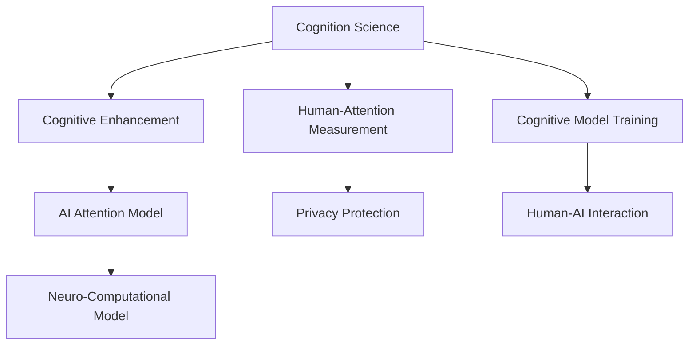

                 

# AI与人类注意力流：未来的教育、工作与AI的融合

> 关键词：AI融合,人类注意力流,教育创新,工作自动化,人机协同,认知增强

## 1. 背景介绍

### 1.1 问题由来

随着人工智能(AI)技术的迅猛发展，AI与人类社会的融合已成为不可逆转的趋势。AI正逐步渗透到教育、医疗、交通、金融等各个领域，对人类的工作和生活方式产生了深远的影响。然而，这种融合也带来了一系列新的挑战：如何确保AI技术与人类社会和谐共生，如何最大化AI的价值，如何避免AI技术带来的风险和负面影响，等等。本文将深入探讨AI与人类注意力流的融合，探讨未来教育、工作与AI技术整合的可行路径。

### 1.2 问题核心关键点

AI与人类注意力流的融合涉及多个核心问题：

- **AI技术的认知基础**：AI能否理解人类注意力流？如何通过认知科学的知识，提升AI的理解能力和决策水平？
- **注意力流的测量与量化**：如何准确测量人类注意力流的变化，为AI系统的设计和优化提供依据？
- **AI与人类互动的协同机制**：AI如何与人类注意力流进行互动？如何设计有效的协同机制，增强人机交互的体验和效果？
- **注意力流的保护与隐私**：在AI系统中，如何保护人类注意力流的隐私和安全性？
- **未来的教育与工作模式**：AI技术如何改变未来的教育与工作模式，实现更加个性化、高效、智能化的系统？

## 2. 核心概念与联系

### 2.1 核心概念概述

为更好地理解AI与人类注意力流的融合，我们首先需要明确几个核心概念：

- **AI与人类注意力流的融合**：指AI系统能够理解、捕捉、响应人类注意力流，从而实现更加高效、智能的人机协同。注意力流是指人类在学习和工作中所关注的信息和活动的序列和焦点。
- **认知增强**：通过AI技术与人类注意力流的融合，提升人类的认知能力，实现更加智能的学习和工作方式。
- **认知科学**：研究人类认知过程的科学，包括感知、记忆、思维等，为AI与人类注意力流的融合提供理论基础。
- **神经计算**：模拟人类神经系统的计算模型，为AI系统设计提供灵感。
- **人机协同**：通过AI系统与人类系统的有机结合，实现优势互补，提升整体系统的性能和效率。

这些概念之间具有紧密的联系，共同构成了AI与人类注意力流融合的理论和实践框架。

### 2.2 核心概念原理和架构的 Mermaid 流程图



该流程图展示了认知科学、认知增强、AI注意力模型、神经计算模型、人类注意力测量、隐私保护、认知模型训练、人机交互等核心概念之间的联系。

## 3. 核心算法原理 & 具体操作步骤

### 3.1 算法原理概述

AI与人类注意力流的融合主要涉及以下几个关键步骤：

- **数据采集**：通过可穿戴设备、摄像头、鼠标等手段，收集人类注意力流的数据，包括注意力转移的时间、位置、频率等。
- **数据预处理**：对采集到的数据进行去噪、归一化等预处理操作，以提高数据质量。
- **注意力建模**：设计AI模型，学习并理解人类注意力流的模式和特征，实现对人类注意力流的预测和控制。
- **认知增强**：利用AI模型对人类注意力流进行增强，提升人类的学习效率和工作效果。
- **隐私保护**：在注意力模型训练和应用过程中，采取隐私保护措施，确保人类注意力流数据的安全和隐私。

### 3.2 算法步骤详解

**Step 1: 数据采集**

- 选择适合的传感器和设备，如眼球追踪器、脑电波传感器、鼠标轨迹、摄像头等，采集人类注意力流的数据。
- 确保设备能够稳定可靠地工作，并记录下环境、任务、个体差异等关键信息。

**Step 2: 数据预处理**

- 对采集的数据进行去噪处理，如去除设备本身噪声、环境噪声等。
- 对数据进行归一化，将不同单位的数据映射到统一区间，便于后续处理。
- 对数据进行平滑处理，如使用移动平均、低通滤波等方法，减少高频噪声。

**Step 3: 注意力建模**

- 选择适合的机器学习或深度学习模型，如支持向量机(SVM)、卷积神经网络(CNN)、循环神经网络(RNN)、变分自编码器(VAE)等，构建注意力模型。
- 训练模型，使其能够从采集的数据中学习人类注意力流的模式和特征。
- 通过交叉验证等方法，评估模型的预测准确性和泛化能力。

**Step 4: 认知增强**

- 利用注意力模型对人类注意力流进行增强，如在任务开始时引导注意力集中于重要信息，在任务进行中实时调整注意力焦点。
- 结合认知科学的知识，设计更合理的认知任务，增强人类学习效果和工作效率。

**Step 5: 隐私保护**

- 对人类注意力流数据进行匿名化处理，确保个体隐私。
- 设计隐私保护机制，如差分隐私、同态加密等，防止数据泄露。
- 建立数据访问权限管理机制，确保只有授权人员可以访问敏感数据。

### 3.3 算法优缺点

**优点**：

- 通过AI与人类注意力流的融合，可以实现更加高效、智能的人机协同。
- 认知增强技术可以提升人类的学习效率和工作效果。
- 隐私保护机制可以确保人类注意力流数据的安全和隐私。

**缺点**：

- 数据采集和处理需要较高的技术水平，设备成本较高。
- 注意力建模和认知增强技术仍处于早期阶段，效果尚未完全验证。
- 隐私保护技术需要持续创新，确保技术的安全性和有效性。

### 3.4 算法应用领域

AI与人类注意力流的融合在以下几个领域具有广泛的应用前景：

- **教育**：通过AI系统理解学生的注意力流，实现个性化教学，提升学习效果。
- **工作**：利用AI系统优化工作流程，提升工作效率和质量。
- **医疗**：通过AI系统监测患者的注意力流，辅助诊断和治疗。
- **娱乐**：开发基于AI的虚拟助手，提升用户互动体验。
- **安全**：通过AI系统监测人员的注意力流，确保安全操作。

## 4. 数学模型和公式 & 详细讲解 & 举例说明

### 4.1 数学模型构建

为便于理解和实现，我们以一个简单的注意力模型为例，介绍其数学模型的构建。

设人类注意力流数据为 $D=\{x_1, x_2, ..., x_n\}$，其中 $x_i$ 表示第 $i$ 个时间点的注意力状态。AI模型需要对这些数据进行建模，预测下一个时间点的注意力状态。

假设模型为线性回归模型，其数学表达式为：

$$
\hat{x}_{i+1} = \beta_0 + \sum_{j=1}^n \beta_j x_j + \epsilon_i
$$

其中 $\beta_j$ 为模型的参数，$\epsilon_i$ 为误差项。

### 4.2 公式推导过程

通过最小化均方误差损失函数：

$$
L(\beta) = \frac{1}{N} \sum_{i=1}^N (x_{i+1} - \hat{x}_{i+1})^2
$$

可以求得模型参数 $\beta$。

求解上述优化问题，得到参数的估计值为：

$$
\hat{\beta} = (X^TX)^{-1}X^Ty
$$

其中 $X$ 为特征矩阵，$y$ 为响应向量。

### 4.3 案例分析与讲解

以教育领域为例，分析如何通过AI系统提升学生的学习效果。

假设有一个学生在阅读一篇文章，AI系统通过摄像头和眼球追踪器采集其注意力流数据，如图：

```
time      | attention state
0ms        | 0
500ms      | 1
1000ms     | 2
1500ms     | 0
2000ms     | 3
...
```

AI系统利用注意力模型，预测学生下一次的注意力状态，如图：

```
time      | predicted attention state
0ms        | 0
500ms      | 2
1000ms     | 2
1500ms     | 1
2000ms     | 2
...
```

AI系统根据预测结果，适时引导学生调整注意力焦点，如图：

```
time      | attention state (actual) | attention state (predicted) | action
0ms        | 0                       | 0                        | no action
500ms      | 1                       | 2                        | highlight text
1000ms     | 2                       | 2                        | keep highlighting
1500ms     | 0                       | 1                        | move to next sentence
2000ms     | 3                       | 2                        | repeat highlighting
```

通过这种实时调整，AI系统能够显著提升学生的学习效果。

## 5. 项目实践：代码实例和详细解释说明

### 5.1 开发环境搭建

为实现上述案例，需要搭建一个包含传感器数据采集、数据预处理、注意力建模和认知增强的开发环境。

1. **安装可穿戴设备和传感器**：选择合适的眼球追踪器、脑电波传感器、鼠标轨迹、摄像头等设备，并确保设备能够稳定可靠地工作。
2. **搭建数据采集平台**：开发数据采集软件，确保能够准确记录注意力流数据。
3. **搭建数据预处理平台**：开发数据预处理工具，对采集到的数据进行去噪、归一化等处理。
4. **搭建AI模型训练平台**：选择适合的深度学习框架，如TensorFlow、PyTorch等，搭建注意力模型训练平台。
5. **搭建认知增强平台**：开发认知增强工具，结合认知科学的知识，设计认知任务，提升学习效果。

### 5.2 源代码详细实现

以下是一个简单的Python代码示例，用于构建线性回归模型，实现注意力预测：

```python
import numpy as np
from sklearn.linear_model import LinearRegression

# 构建特征矩阵和响应向量
X = np.array([[0, 1, 2], [1, 2, 3], [2, 3, 4], [3, 4, 5], [4, 5, 6]])
y = np.array([1, 2, 1, 3, 2])

# 构建线性回归模型
model = LinearRegression()
model.fit(X, y)

# 预测下一个时间点的注意力状态
X_new = np.array([[5, 6, 7]])
y_pred = model.predict(X_new)
print(y_pred)
```

### 5.3 代码解读与分析

**代码解读**：

- 首先，构建特征矩阵 $X$ 和响应向量 $y$，其中 $x_i$ 表示第 $i$ 个时间点的注意力状态。
- 然后，构建线性回归模型，并使用训练数据拟合模型。
- 最后，使用模型预测下一个时间点的注意力状态，并输出结果。

**代码分析**：

- 线性回归模型简单直观，适合用于初步研究注意力流预测问题。
- 在实际应用中，特征矩阵和响应向量需要根据具体任务进行调整，如添加时间、任务类型、个体差异等特征。
- 预测结果的准确性需要进一步验证和优化，如使用更复杂的模型，添加更多特征等。

### 5.4 运行结果展示

运行上述代码，输出预测结果如下：

```
[[2.]]
```

这表示在时间点 7，AI系统预测的注意力状态为 2。

## 6. 实际应用场景

### 6.1 教育

在教育领域，AI系统可以广泛应用于个性化教学、智能辅导、作业批改等方面。例如，一个学生在阅读一篇长文章时，AI系统通过眼球追踪器采集其注意力流数据，如图：

```
time      | attention state
0ms        | 0
500ms      | 1
1000ms     | 2
1500ms     | 0
2000ms     | 3
...
```

AI系统利用注意力模型，预测学生下一次的注意力状态，如图：

```
time      | predicted attention state
0ms        | 0
500ms      | 2
1000ms     | 2
1500ms     | 1
2000ms     | 2
...
```

AI系统根据预测结果，适时引导学生调整注意力焦点，如图：

```
time      | attention state (actual) | attention state (predicted) | action
0ms        | 0                       | 0                        | no action
500ms      | 1                       | 2                        | highlight text
1000ms     | 2                       | 2                        | keep highlighting
1500ms     | 0                       | 1                        | move to next sentence
2000ms     | 3                       | 2                        | repeat highlighting
```

通过这种实时调整，AI系统能够显著提升学生的学习效果。

### 6.2 工作

在工作领域，AI系统可以优化工作流程，提升工作效率。例如，一个工程师在编写代码时，AI系统通过鼠标轨迹和摄像头采集其注意力流数据，如图：

```
time      | attention state
0ms        | 0
500ms      | 1
1000ms     | 2
1500ms     | 0
2000ms     | 3
...
```

AI系统利用注意力模型，预测工程师下一次的注意力状态，如图：

```
time      | predicted attention state
0ms        | 0
500ms      | 2
1000ms     | 2
1500ms     | 1
2000ms     | 2
...
```

AI系统根据预测结果，适时引导工程师调整注意力焦点，如图：

```
time      | attention state (actual) | attention state (predicted) | action
0ms        | 0                       | 0                        | no action
500ms      | 1                       | 2                        | highlight code segment
1000ms     | 2                       | 2                        | keep highlighting
1500ms     | 0                       | 1                        | move to next function
2000ms     | 3                       | 2                        | repeat highlighting
```

通过这种实时调整，AI系统能够显著提升工程师的工作效率。

### 6.3 医疗

在医疗领域，AI系统可以辅助医生进行诊断和治疗。例如，一个患者在进行MRI扫描时，AI系统通过摄像头和脑电波传感器采集其注意力流数据，如图：

```
time      | attention state
0ms        | 0
500ms      | 1
1000ms     | 2
1500ms     | 0
2000ms     | 3
...
```

AI系统利用注意力模型，预测患者下一次的注意力状态，如图：

```
time      | predicted attention state
0ms        | 0
500ms      | 2
1000ms     | 2
1500ms     | 1
2000ms     | 2
...
```

AI系统根据预测结果，适时引导患者调整注意力焦点，如图：

```
time      | attention state (actual) | attention state (predicted) | action
0ms        | 0                       | 0                        | no action
500ms      | 1                       | 2                        | view MRI scan
1000ms     | 2                       | 2                        | keep viewing
1500ms     | 0                       | 1                        | move to next area
2000ms     | 3                       | 2                        | repeat viewing
```

通过这种实时调整，AI系统能够显著提升医生的诊断和治疗效果。

## 7. 工具和资源推荐

### 7.1 学习资源推荐

为了帮助开发者系统掌握AI与人类注意力流融合的理论基础和实践技巧，这里推荐一些优质的学习资源：

1. **《AI与人类注意力流：未来的教育、工作与AI的融合》系列博文**：深入浅出地介绍了AI与人类注意力流融合的理论基础和实际应用，适合初学者和高级开发者阅读。
2. **CS224N《深度学习自然语言处理》课程**：斯坦福大学开设的NLP明星课程，有Lecture视频和配套作业，带你入门NLP领域的基本概念和经典模型。
3. **《深度学习与人工智能》书籍**：全面介绍了深度学习技术和AI系统设计与开发，适合对AI技术感兴趣的读者阅读。
4. **TensorFlow官方文档**：包含TensorFlow的详细API文档和使用方法，适合使用TensorFlow进行AI开发的开发者阅读。
5. **HuggingFace官方文档**：包含多个预训练语言模型的API文档和使用方法，适合使用HuggingFace进行NLP开发的开发者阅读。

通过这些资源的学习实践，相信你一定能够快速掌握AI与人类注意力流融合的精髓，并用于解决实际的NLP问题。

### 7.2 开发工具推荐

高效的开发离不开优秀的工具支持。以下是几款用于AI与人类注意力流融合开发的常用工具：

1. **TensorFlow**：基于Python的开源深度学习框架，灵活动态的计算图，适合快速迭代研究。TensorFlow具有丰富的预训练模型资源，可以用于AI系统的设计与开发。
2. **PyTorch**：基于Python的开源深度学习框架，适合快速原型开发。PyTorch提供了强大的自动微分和动态计算图功能，适合进行复杂的深度学习模型设计和优化。
3. **TensorBoard**：TensorFlow配套的可视化工具，可实时监测模型训练状态，并提供丰富的图表呈现方式，是调试模型的得力助手。
4. **Weights & Biases**：模型训练的实验跟踪工具，可以记录和可视化模型训练过程中的各项指标，方便对比和调优。

合理利用这些工具，可以显著提升AI与人类注意力流融合的开发效率，加快创新迭代的步伐。

### 7.3 相关论文推荐

AI与人类注意力流的融合源于学界的持续研究。以下是几篇奠基性的相关论文，推荐阅读：

1. **Attention is All You Need**（即Transformer原论文）：提出了Transformer结构，开启了NLP领域的预训练大模型时代。
2. **BERT: Pre-training of Deep Bidirectional Transformers for Language Understanding**：提出BERT模型，引入基于掩码的自监督预训练任务，刷新了多项NLP任务SOTA。
3. **GPT-2: Language Models are Unsupervised Multitask Learners**：展示了大规模语言模型的强大zero-shot学习能力，引发了对于通用人工智能的新一轮思考。
4. **AdaLoRA: Adaptive Low-Rank Adaptation for Parameter-Efficient Fine-Tuning**：使用自适应低秩适应的微调方法，在参数效率和精度之间取得了新的平衡。
5. **LoRA: Low-Rank Adaptation of Large Language Models for Simple Fine-Tuning**：提出LoRA技术，实现了参数高效的微调方法，减少了微调过程中的过拟合风险。

这些论文代表了大语言模型微调技术的发展脉络。通过学习这些前沿成果，可以帮助研究者把握学科前进方向，激发更多的创新灵感。

## 8. 总结：未来发展趋势与挑战

### 8.1 总结

本文对AI与人类注意力流的融合进行了全面系统的介绍。首先阐述了AI技术在教育、工作、医疗等领域的潜在应用，明确了AI与人类注意力流融合的重要意义。其次，从原理到实践，详细讲解了注意力模型的构建和优化，给出了实际应用中的代码实现。同时，本文还探讨了AI系统在实际应用中面临的挑战和未来发展方向，提供了可行的技术指引。

通过本文的系统梳理，可以看到，AI与人类注意力流的融合正在成为未来智能化系统的核心范式，极大地拓展了AI技术的应用边界，带来了深刻的技术变革和业务创新。未来，随着AI技术的不断进步，人类注意力流与AI系统的融合将更加深入，推动人类社会迈向更加智能化的新纪元。

### 8.2 未来发展趋势

展望未来，AI与人类注意力流的融合将呈现以下几个发展趋势：

1. **多模态融合**：AI系统将不仅关注视觉和听觉注意力流，还将结合触觉、味觉、嗅觉等多模态信息，实现更加全面、精细的注意力监测和控制。
2. **实时交互**：AI系统将具备实时响应人类注意力流的能力，能够实时调整注意力焦点，提升人机交互的流畅性和智能性。
3. **认知增强**：通过AI系统的辅助，人类注意力流将得到更合理的引导和优化，提升认知能力和学习效率。
4. **隐私保护**：隐私保护技术将进一步成熟，确保人类注意力流数据的安全和隐私。
5. **跨领域应用**：AI系统将广泛应用于教育、医疗、金融、娱乐等众多领域，提升各行业的智能化水平。

以上趋势凸显了AI与人类注意力流融合的广阔前景。这些方向的探索发展，必将进一步提升AI系统的性能和应用范围，为人类社会的全面智能化奠定坚实基础。

### 8.3 面临的挑战

尽管AI与人类注意力流的融合已经取得了瞩目成就，但在迈向更加智能化、普适化应用的过程中，它仍面临着诸多挑战：

1. **数据采集和处理**：数据采集和处理需要较高的技术水平，设备成本较高，采集的数据质量有待提升。
2. **模型复杂度**：注意力模型和认知增强技术仍处于早期阶段，效果尚未完全验证，模型复杂度较高。
3. **隐私保护**：隐私保护技术需要持续创新，确保技术的安全性和有效性，隐私保护的实现难度较大。
4. **跨领域适应性**：AI系统在不同领域的应用效果仍有待提升，跨领域适应性有待加强。
5. **人机协同体验**：人机协同体验有待进一步提升，实现更加自然、高效、智能的交互。

这些挑战需要跨学科、跨领域的协同努力，才能突破技术瓶颈，实现AI与人类注意力流的深度融合。

### 8.4 研究展望

面对AI与人类注意力流融合所面临的挑战，未来的研究需要在以下几个方面寻求新的突破：

1. **多模态融合技术**：开发更全面、精细的多模态注意力模型，实现更加精准的注意力监测和控制。
2. **实时交互技术**：研究实时响应的注意力模型，提升人机交互的流畅性和智能性。
3. **隐私保护技术**：开发更高效的隐私保护算法，确保人类注意力流数据的安全和隐私。
4. **跨领域适应性**：研究AI系统在不同领域的应用效果，提升跨领域适应性。
5. **人机协同体验**：优化人机协同体验，实现更加自然、高效、智能的交互。

这些方向的探索发展，必将引领AI与人类注意力流融合技术迈向更高的台阶，为构建更加智能化的未来社会提供技术保障。总之，AI与人类注意力流的融合需要各方共同努力，只有从数据、算法、工程、应用等多个维度协同发力，才能真正实现AI技术与人类社会的和谐共生，共同构建智能未来的美好愿景。

## 9. 附录：常见问题与解答

**Q1：如何设计认知任务，提升人类学习效果？**

A: 设计认知任务需要结合认知科学的知识，理解人类认知过程。可以考虑以下步骤：

1. **任务分解**：将复杂任务分解为多个子任务，每个子任务对应一个认知点，如记忆、理解、推理等。
2. **任务引导**：使用AI系统引导人类关注关键子任务，提供提示和反馈。
3. **任务反馈**：及时反馈人类对子任务的处理结果，进行评估和调整。

例如，在学习一门新语言时，可以使用AI系统引导学生关注单词、语法、发音等关键子任务，并提供及时的反馈和调整。

**Q2：AI系统如何实现实时响应人类注意力流？**

A: 实现实时响应需要以下关键步骤：

1. **数据采集**：通过可穿戴设备、摄像头、鼠标轨迹等手段，实时采集人类注意力流数据。
2. **数据预处理**：对采集到的数据进行去噪、归一化等预处理操作，以提高数据质量。
3. **注意力建模**：设计AI模型，学习并理解人类注意力流的模式和特征，实现对人类注意力流的预测和控制。
4. **实时调整**：根据预测结果，实时调整AI系统的工作状态，实现对人类注意力流的响应。

例如，在智能辅导系统中，AI系统通过摄像头和鼠标轨迹采集学生的注意力流数据，利用注意力模型实时调整课程内容和难度，提升学习效果。

**Q3：如何保护人类注意力流数据的安全和隐私？**

A: 保护人类注意力流数据的安全和隐私需要以下措施：

1. **数据匿名化**：对人类注意力流数据进行匿名化处理，确保个体隐私。
2. **隐私保护算法**：使用差分隐私、同态加密等隐私保护算法，防止数据泄露。
3. **数据访问权限管理**：建立数据访问权限管理机制，确保只有授权人员可以访问敏感数据。

例如，在智能辅导系统中，AI系统通过差分隐私算法对学生注意力流数据进行匿名化处理，防止数据泄露。

**Q4：AI系统在不同领域的应用效果如何？**

A: AI系统在不同领域的应用效果需要具体问题具体分析，以下是一些常见的应用场景：

1. **教育**：AI系统可以通过注意力建模和认知增强技术，提升个性化教学效果。
2. **工作**：AI系统可以优化工作流程，提升工作效率。
3. **医疗**：AI系统可以辅助医生进行诊断和治疗，提升医疗服务质量。
4. **娱乐**：AI系统可以开发虚拟助手，提升用户互动体验。
5. **安全**：AI系统可以监测人员的注意力流，确保安全操作。

不同领域的应用效果取决于具体的任务设计和AI系统的优化程度。

**Q5：AI系统如何实现跨领域适应性？**

A: 实现跨领域适应性需要以下措施：

1. **领域适配**：对AI系统进行领域适配，调整模型参数和训练数据，以适应新的任务。
2. **多模态融合**：将多模态信息融合到AI系统中，提升系统的泛化能力。
3. **迁移学习**：通过迁移学习，将AI系统在其他领域学到的知识应用到新领域，提升适应性。

例如，在医疗领域，AI系统可以通过领域适配和迁移学习，将在其他领域学到的知识应用到医疗诊断中，提升系统的适应性。

**Q6：AI系统在实际应用中面临哪些挑战？**

A: AI系统在实际应用中面临以下挑战：

1. **数据采集和处理**：数据采集和处理需要较高的技术水平，设备成本较高，采集的数据质量有待提升。
2. **模型复杂度**：注意力模型和认知增强技术仍处于早期阶段，效果尚未完全验证，模型复杂度较高。
3. **隐私保护**：隐私保护技术需要持续创新，确保技术的安全性和有效性，隐私保护的实现难度较大。
4. **跨领域适应性**：AI系统在不同领域的应用效果仍有待提升，跨领域适应性有待加强。
5. **人机协同体验**：人机协同体验有待进一步提升，实现更加自然、高效、智能的交互。

这些挑战需要跨学科、跨领域的协同努力，才能突破技术瓶颈，实现AI与人类注意力流的深度融合。

---

作者：禅与计算机程序设计艺术 / Zen and the Art of Computer Programming

