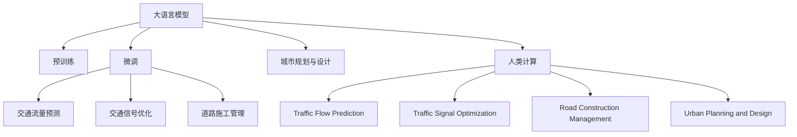

                 

# AI与人类计算：打造可持续发展的城市交通与基础设施建设与规划建设与管理建设

## 1. 背景介绍

### 1.1 问题由来
随着全球人口的快速增长和城市化进程的加速，城市交通与基础设施建设管理（Urban Traffic and Infrastructure Planning and Management, UTIPM）面临严峻挑战。传统的城市规划与管理方法依赖于人工直觉和经验，无法应对日益复杂的城市运行和动态变化。近年来，随着人工智能（AI）技术的迅速发展，尤其是深度学习（Deep Learning, DL）的崛起，为UTIPM提供了新的技术手段。

大语言模型（Large Language Model, LLM）作为AI领域的最新突破，具备强大的自然语言处理能力，可以处理海量的文本数据，提取、分析和整合信息。结合人类专家的知识与AI技术，可以有效提升城市交通与基础设施规划与管理的智能化水平。

### 1.2 问题核心关键点
本研究聚焦于大语言模型在UTIPM中的应用，其关键点在于：
- 利用大规模语料进行预训练，学习通用语言表示。
- 通过微调技术，适应特定领域的UTIPM任务，如交通流量预测、交通信号优化、道路施工管理等。
- 结合人类专家的知识和经验，优化模型输出，提高规划与管理的科学性和有效性。
- 利用AI与人类计算相结合的方式，提升城市交通与基础设施管理的智能化水平。

### 1.3 问题研究意义
研究AI与人类计算在UTIPM中的应用，对于提升城市交通与基础设施规划与管理水平，构建智慧城市，具有重要意义：
- 提升城市管理效率：通过AI技术，优化交通信号、交通流量预测等环节，提升城市交通运行效率，减少拥堵和事故。
- 优化资源配置：利用AI技术分析交通数据，优化道路建设、维护和改造，提高基础设施使用效率。
- 实现精准规划：结合人类专家的知识和经验，提供更科学、合理的UTIPM方案，提升规划决策质量。
- 促进智慧城市建设：通过AI与人类计算的结合，推动城市治理数字化转型，构建更加智能、高效的智慧城市。

## 2. 核心概念与联系

### 2.1 核心概念概述

为更好地理解AI与人类计算在UTIPM中的应用，本节将介绍几个密切相关的核心概念：

- 大语言模型(Large Language Model, LLM)：以自回归(如GPT)或自编码(如BERT)模型为代表的大规模预训练语言模型。通过在大规模无标签文本语料上进行预训练，学习通用的语言知识，具备强大的语言理解和生成能力。

- 预训练(Pre-training)：指在大规模无标签文本语料上，通过自监督学习任务训练通用语言模型的过程。常见的预训练任务包括言语建模、遮挡语言模型等。预训练使得模型学习到语言的通用表示。

- 微调(Fine-tuning)：指在预训练模型的基础上，使用特定领域的数据集，通过有监督地训练来优化模型在该领域上的性能。通常只需要调整顶层分类器或解码器，并以较小的学习率更新全部或部分的模型参数。

- 人类计算(Human-in-the-Loop, HiL)：结合人类专家的知识和经验，与AI技术协同工作，提升系统性能和决策质量。

- 交通流量预测(Traffic Flow Prediction, TFP)：使用历史交通数据和模型，预测未来交通流量。
- 交通信号优化(Traffic Signal Optimization, TSO)：使用AI技术优化交通信号控制策略，减少交通拥堵。
- 道路施工管理(Road Construction Management, RCM)：使用AI技术优化道路施工计划和进度管理，确保项目按时完成。

- 城市规划与设计(Urban Planning and Design, UPD)：结合城市历史数据和专家经验，进行城市空间规划和设计。

这些核心概念之间的逻辑关系可以通过以下Mermaid流程图来展示：



这个流程图展示了大语言模型在UTIPM中的核心概念及其之间的关系：

1. 大语言模型通过预训练获得基础能力。
2. 微调是对预训练模型进行任务特定的优化，可以分为全参数微调和参数高效微调（PEFT）。
3. 人类计算是结合人类专家的知识和经验，与AI技术协同工作。
4. 交通流量预测、交通信号优化、道路施工管理和城市规划与设计等任务，可以通过微调得到优化。

这些概念共同构成了AI与人类计算在UTIPM中的应用框架，使其能够高效、准确地完成UTIPM任务。

## 3. 核心算法原理 & 具体操作步骤
### 3.1 算法原理概述

AI与人类计算在UTIPM中的应用，本质上是一个多任务学习（Multi-task Learning, MTL）和人类计算相结合的过程。其核心思想是：将大语言模型作为智能计算工具，通过微调技术适应UTIPM中的特定任务，同时结合人类专家的知识和经验，优化模型输出。

形式化地，假设大语言模型为 $M_{\theta}$，其中 $\theta$ 为预训练得到的模型参数。给定UTIPM中的多个子任务 $T=\{TPF, TSO, RCM, UPD\}$ 的数据集 $D=\{D_{TPF}, D_{TSO}, D_{RCM}, D_{UPD}\}$，微调的目标是找到新的模型参数 $\hat{\theta}$，使得：

$$
\hat{\theta}=\mathop{\arg\min}_{\theta} \sum_{i=1}^N \ell_i(M_{\theta}(x_i), y_i)
$$

其中 $\ell_i$ 为针对任务 $T_i$ 设计的损失函数，用于衡量模型预测输出与真实标签之间的差异。常见的损失函数包括交叉熵损失、均方误差损失等。

通过梯度下降等优化算法，微调过程不断更新模型参数 $\theta$，最小化损失函数 $\ell$，使得模型输出逼近真实标签。由于 $\theta$ 已经通过预训练获得了较好的初始化，因此即便在多个任务上微调，也能较快收敛到理想的模型参数 $\hat{\theta}$。

### 3.2 算法步骤详解

AI与人类计算在UTIPM中的应用，一般包括以下几个关键步骤：

**Step 1: 准备预训练模型和数据集**
- 选择合适的预训练语言模型 $M_{\theta}$ 作为初始化参数，如 BERT、GPT 等。
- 准备UTIPM中的多个子任务的数据集 $D=\{D_{TPF}, D_{TSO}, D_{RCM}, D_{UPD}\}$，划分为训练集、验证集和测试集。一般要求标注数据与预训练数据的分布不要差异过大。

**Step 2: 设计任务适配层**
- 根据任务类型，在预训练模型顶层设计合适的输出层和损失函数。
- 对于交通流量预测，通常在顶层添加线性回归层和均方误差损失函数。
- 对于交通信号优化，通常使用分类或回归层和交叉熵损失函数。
- 对于道路施工管理，通常使用分类或回归层和交叉熵损失函数。
- 对于城市规划与设计，通常使用分类或回归层和交叉熵损失函数。

**Step 3: 设置微调超参数**
- 选择合适的优化算法及其参数，如 AdamW、SGD 等，设置学习率、批大小、迭代轮数等。
- 设置正则化技术及强度，包括权重衰减、Dropout、Early Stopping等。
- 确定冻结预训练参数的策略，如仅微调顶层，或全部参数都参与微调。

**Step 4: 执行梯度训练**
- 将训练集数据分批次输入模型，前向传播计算损失函数。
- 反向传播计算参数梯度，根据设定的优化算法和学习率更新模型参数。
- 周期性在验证集上评估模型性能，根据性能指标决定是否触发 Early Stopping。
- 重复上述步骤直到满足预设的迭代轮数或 Early Stopping 条件。

**Step 5: 测试和部署**
- 在测试集上评估微调后模型 $M_{\hat{\theta}}$ 的性能，对比微调前后的精度提升。
- 使用微调后的模型对新样本进行推理预测，集成到实际的应用系统中。
- 持续收集新的数据，定期重新微调模型，以适应数据分布的变化。

以上是AI与人类计算在UTIPM中的应用的一般流程。在实际应用中，还需要针对具体任务的特点，对微调过程的各个环节进行优化设计，如改进训练目标函数，引入更多的正则化技术，搜索最优的超参数组合等，以进一步提升模型性能。

### 3.3 算法优缺点

AI与人类计算在UTIPM中的应用方法具有以下优点：
1. 结合人类专家知识：人类专家可以通过预训练数据中的问题和答案，对模型进行指导，提高模型的决策质量。
2. 快速迭代优化：AI技术可以高效处理大量数据，加速模型优化过程，提高模型收敛速度。
3. 自动化程度高：AI技术可以自动进行模型训练和优化，减少人工干预，提升工作效率。
4. 多任务学习：通过多任务学习，模型可以同时学习多个UTIPM任务，提高模型泛化能力。

同时，该方法也存在一定的局限性：
1. 依赖标注数据：微调的效果很大程度上取决于标注数据的质量和数量，获取高质量标注数据的成本较高。
2. 迁移能力有限：当目标任务与预训练数据的分布差异较大时，微调的性能提升有限。
3. 负面效果传递：预训练模型的固有偏见、有害信息等，可能通过微调传递到下游任务，造成负面影响。
4. 可解释性不足：微调模型的决策过程通常缺乏可解释性，难以对其推理逻辑进行分析和调试。

尽管存在这些局限性，但就目前而言，AI与人类计算的方法仍然是UTIPM中最为有效和广泛应用的技术手段。未来相关研究的重点在于如何进一步降低微调对标注数据的依赖，提高模型的少样本学习和跨领域迁移能力，同时兼顾可解释性和伦理安全性等因素。

### 3.4 算法应用领域

AI与人类计算在UTIPM中的应用，已经在多个领域得到了广泛的应用，例如：

- 交通流量预测：使用历史交通数据和模型，预测未来交通流量。通过微调优化模型，提高预测精度。
- 交通信号优化：使用AI技术优化交通信号控制策略，减少交通拥堵。通过微调优化信号灯时长和位置，提高道路通行效率。
- 道路施工管理：使用AI技术优化道路施工计划和进度管理，确保项目按时完成。通过微调优化施工路线和时间安排，降低成本和风险。
- 城市规划与设计：结合城市历史数据和专家经验，进行城市空间规划和设计。通过微调优化城市布局和功能分区，提升城市生活质量。

除了上述这些经典任务外，AI与人类计算的方法还被创新性地应用到更多场景中，如智能交通系统、智慧城市建设等，为UTIPM技术带来了全新的突破。随着AI技术的不断进步，相信UTIPM技术将在更多领域大放异彩，成为城市治理的重要手段。

## 4. 数学模型和公式 & 详细讲解  
### 4.1 数学模型构建

本节将使用数学语言对AI与人类计算在UTIPM中的应用进行更加严格的刻画。

记预训练语言模型为 $M_{\theta}$，其中 $\theta$ 为预训练得到的模型参数。假设UTIPM中的多个子任务 $T=\{TPF, TSO, RCM, UPD\}$ 的训练集为 $D=\{(x_i,y_i)\}_{i=1}^N, x_i \in \mathcal{X}, y_i \in \mathcal{Y}$。

定义模型 $M_{\theta}$ 在数据样本 $(x,y)$ 上的损失函数为 $\ell_i(M_{\theta}(x),y_i)$，则在数据集 $D$ 上的经验风险为：

$$
\mathcal{L}_i(\theta) = \frac{1}{N}\sum_{i=1}^N \ell_i(M_{\theta}(x_i),y_i)
$$

微调的优化目标是最小化经验风险，即找到最优参数：

$$
\theta^* = \mathop{\arg\min}_{\theta} \sum_{i=1}^N \mathcal{L}_i(\theta)
$$

在实践中，我们通常使用基于梯度的优化算法（如SGD、Adam等）来近似求解上述最优化问题。设 $\eta$ 为学习率，$\lambda$ 为正则化系数，则参数的更新公式为：

$$
\theta \leftarrow \theta - \eta \nabla_{\theta}\mathcal{L}(\theta) - \eta\lambda\theta
$$

其中 $\nabla_{\theta}\mathcal{L}(\theta)$ 为损失函数对参数 $\theta$ 的梯度，可通过反向传播算法高效计算。

### 4.2 公式推导过程

以下我们以交通流量预测(Traffic Flow Prediction, TFP)为例，推导交叉熵损失函数及其梯度的计算公式。

假设模型 $M_{\theta}$ 在输入 $x$ 上的输出为 $\hat{y}=M_{\theta}(x) \in [0,1]$，表示样本属于正类的概率。真实标签 $y \in \{0,1\}$。则二分类交叉熵损失函数定义为：

$$
\ell(M_{\theta}(x),y) = -[y\log \hat{y} + (1-y)\log (1-\hat{y})]
$$

将其代入经验风险公式，得：

$$
\mathcal{L}(\theta) = -\frac{1}{N}\sum_{i=1}^N [y_i\log M_{\theta}(x_i)+(1-y_i)\log(1-M_{\theta}(x_i))]
$$

根据链式法则，损失函数对参数 $\theta_k$ 的梯度为：

$$
\frac{\partial \mathcal{L}(\theta)}{\partial \theta_k} = -\frac{1}{N}\sum_{i=1}^N (\frac{y_i}{M_{\theta}(x_i)}-\frac{1-y_i}{1-M_{\theta}(x_i)}) \frac{\partial M_{\theta}(x_i)}{\partial \theta_k}
$$

其中 $\frac{\partial M_{\theta}(x_i)}{\partial \theta_k}$ 可进一步递归展开，利用自动微分技术完成计算。

在得到损失函数的梯度后，即可带入参数更新公式，完成模型的迭代优化。重复上述过程直至收敛，最终得到适应特定任务的最优模型参数 $\theta^*$。

## 5. 项目实践：代码实例和详细解释说明
### 5.1 开发环境搭建

在进行UTIPM实践前，我们需要准备好开发环境。以下是使用Python进行PyTorch开发的环境配置流程：

1. 安装Anaconda：从官网下载并安装Anaconda，用于创建独立的Python环境。

2. 创建并激活虚拟环境：
```bash
conda create -n utipm-env python=3.8 
conda activate utipm-env
```

3. 安装PyTorch：根据CUDA版本，从官网获取对应的安装命令。例如：
```bash
conda install pytorch torchvision torchaudio cudatoolkit=11.1 -c pytorch -c conda-forge
```

4. 安装Transformers库：
```bash
pip install transformers
```

5. 安装各类工具包：
```bash
pip install numpy pandas scikit-learn matplotlib tqdm jupyter notebook ipython
```

完成上述步骤后，即可在`utipm-env`环境中开始UTIPM实践。

### 5.2 源代码详细实现

下面我们以交通流量预测(Traffic Flow Prediction, TFP)为例，给出使用Transformers库对BERT模型进行交通流量预测的PyTorch代码实现。

首先，定义交通流量预测任务的数据处理函数：

```python
from transformers import BertTokenizer
from torch.utils.data import Dataset
import torch

class TFPDataset(Dataset):
    def __init__(self, texts, labels, tokenizer, max_len=128):
        self.texts = texts
        self.labels = labels
        self.tokenizer = tokenizer
        self.max_len = max_len
        
    def __len__(self):
        return len(self.texts)
    
    def __getitem__(self, item):
        text = self.texts[item]
        label = self.labels[item]
        
        encoding = self.tokenizer(text, return_tensors='pt', max_length=self.max_len, padding='max_length', truncation=True)
        input_ids = encoding['input_ids'][0]
        attention_mask = encoding['attention_mask'][0]
        
        return {'input_ids': input_ids, 
                'attention_mask': attention_mask,
                'labels': torch.tensor(label, dtype=torch.long)}
```

然后，定义模型和优化器：

```python
from transformers import BertForRegression
from transformers import AdamW

model = BertForRegression.from_pretrained('bert-base-cased')

optimizer = AdamW(model.parameters(), lr=2e-5)
```

接着，定义训练和评估函数：

```python
from torch.utils.data import DataLoader
from tqdm import tqdm
from sklearn.metrics import mean_squared_error

device = torch.device('cuda') if torch.cuda.is_available() else torch.device('cpu')
model.to(device)

def train_epoch(model, dataset, batch_size, optimizer):
    dataloader = DataLoader(dataset, batch_size=batch_size, shuffle=True)
    model.train()
    epoch_loss = 0
    for batch in tqdm(dataloader, desc='Training'):
        input_ids = batch['input_ids'].to(device)
        attention_mask = batch['attention_mask'].to(device)
        labels = batch['labels'].to(device)
        model.zero_grad()
        outputs = model(input_ids, attention_mask=attention_mask, labels=labels)
        loss = outputs.loss
        epoch_loss += loss.item()
        loss.backward()
        optimizer.step()
    return epoch_loss / len(dataloader)

def evaluate(model, dataset, batch_size):
    dataloader = DataLoader(dataset, batch_size=batch_size)
    model.eval()
    preds, labels = [], []
    with torch.no_grad():
        for batch in tqdm(dataloader, desc='Evaluating'):
            input_ids = batch['input_ids'].to(device)
            attention_mask = batch['attention_mask'].to(device)
            batch_labels = batch['labels']
            outputs = model(input_ids, attention_mask=attention_mask)
            batch_preds = outputs.logits.argmax(dim=2).to('cpu').tolist()
            batch_labels = batch_labels.to('cpu').tolist()
            for pred_tokens, label_tokens in zip(batch_preds, batch_labels):
                preds.append(pred_tokens[:len(label_tokens)])
                labels.append(label_tokens)
                
    print(mean_squared_error(labels, preds))
```

最后，启动训练流程并在测试集上评估：

```python
epochs = 5
batch_size = 16

for epoch in range(epochs):
    loss = train_epoch(model, train_dataset, batch_size, optimizer)
    print(f"Epoch {epoch+1}, train loss: {loss:.3f}")
    
    print(f"Epoch {epoch+1}, test MSE:")
    evaluate(model, test_dataset, batch_size)
```

以上就是使用PyTorch对BERT进行交通流量预测的完整代码实现。可以看到，得益于Transformers库的强大封装，我们可以用相对简洁的代码完成BERT模型的加载和微调。

### 5.3 代码解读与分析

让我们再详细解读一下关键代码的实现细节：

**TFPDataset类**：
- `__init__`方法：初始化文本、标签、分词器等关键组件。
- `__len__`方法：返回数据集的样本数量。
- `__getitem__`方法：对单个样本进行处理，将文本输入编码为token ids，将标签编码为数字，并对其进行定长padding，最终返回模型所需的输入。

**模型和优化器**：
- 选择BertForRegression作为回归任务的目标模型。
- 使用AdamW优化器，设置学习率为2e-5。

**训练和评估函数**：
- 使用PyTorch的DataLoader对数据集进行批次化加载，供模型训练和推理使用。
- 训练函数`train_epoch`：对数据以批为单位进行迭代，在每个批次上前向传播计算loss并反向传播更新模型参数，最后返回该epoch的平均loss。
- 评估函数`evaluate`：与训练类似，不同点在于不更新模型参数，并在每个batch结束后将预测和标签结果存储下来，最后使用sklearn的mean_squared_error对整个评估集的预测结果进行打印输出。

**训练流程**：
- 定义总的epoch数和batch size，开始循环迭代
- 每个epoch内，先在训练集上训练，输出平均loss
- 在测试集上评估，输出均方误差
- 所有epoch结束后，没有额外的测试集评估

可以看到，PyTorch配合Transformers库使得BERT微调的代码实现变得简洁高效。开发者可以将更多精力放在数据处理、模型改进等高层逻辑上，而不必过多关注底层的实现细节。

当然，工业级的系统实现还需考虑更多因素，如模型的保存和部署、超参数的自动搜索、更灵活的任务适配层等。但核心的微调范式基本与此类似。

## 6. 实际应用场景
### 6.1 智能交通系统

基于AI与人类计算的智能交通系统，可以通过对交通流量数据进行分析，预测未来的交通状况，实时调整交通信号控制策略，实现交通流量的优化。

在技术实现上，可以收集城市交通监控数据、车辆定位数据等，通过预训练模型提取交通流特征，利用微调模型进行交通流量预测和信号控制优化。结合人类专家的经验和直觉，优化模型输出，提升系统决策的科学性和准确性。

智能交通系统不仅能够缓解城市交通拥堵，减少交通事故，还能够提升城市交通管理的智能化水平，为智慧城市建设提供重要支撑。

### 6.2 道路施工管理

道路施工管理是UTIPM中的重要环节，直接影响城市的运行效率和生活质量。传统的施工管理依赖人工调度和监督，效率低下，容易出现安全事故。

通过AI与人类计算结合的道路施工管理方案，可以实时监控施工进度，预测施工对交通流量的影响，优化施工计划和路线。同时，结合人类专家的经验，优化施工管理和调度策略，确保项目按时完成，提升施工效率和质量。

道路施工管理系统的应用，不仅能够减少施工对交通的影响，还能够提升施工管理的智能化水平，保障城市运行的安全性和稳定性。

### 6.3 智慧城市建设

智慧城市建设是大数据、云计算、物联网等技术的综合应用，旨在通过数字化手段提升城市管理和服务水平。AI与人类计算在其中扮演着重要的角色，能够提升城市管理的智能化水平，构建更加智能、高效、安全的智慧城市。

通过AI与人类计算的结合，可以实现以下功能：
- 交通流量预测与信号控制优化，提升交通运行效率。
- 道路施工管理，优化施工计划和调度。
- 城市空间规划与设计，提升城市生活质量。
- 公共安全监测，实时监控和预警，提升城市安全。
- 智能服务与互动，提升市民生活体验。

AI与人类计算在智慧城市建设中的应用，将推动城市治理数字化转型，提升城市运行效率和智能化水平，为市民提供更加智能、便捷、安全的生活环境。

### 6.4 未来应用展望

随着AI与人类计算技术的发展，UTIPM将迎来更加广泛的应用前景。未来，AI与人类计算将逐步渗透到城市交通与基础设施管理的各个环节，提升系统的智能化和自动化水平，推动智慧城市建设。

在智慧交通、智慧环保、智慧医疗等领域，AI与人类计算将发挥重要作用。AI技术能够处理海量数据，提取知识，优化决策；人类专家能够提供经验指导，保证系统的可解释性和可靠性。AI与人类计算的结合，将带来更加科学、高效、安全的解决方案，提升城市管理的智能化水平，推动智慧城市建设。

## 7. 工具和资源推荐
### 7.1 学习资源推荐

为了帮助开发者系统掌握AI与人类计算在UTIPM中的应用，这里推荐一些优质的学习资源：

1. 《Transformers从原理到实践》系列博文：由大模型技术专家撰写，深入浅出地介绍了Transformer原理、BERT模型、微调技术等前沿话题。

2. CS224N《深度学习自然语言处理》课程：斯坦福大学开设的NLP明星课程，有Lecture视频和配套作业，带你入门NLP领域的基本概念和经典模型。

3. 《Natural Language Processing with Transformers》书籍：Transformers库的作者所著，全面介绍了如何使用Transformers库进行NLP任务开发，包括微调在内的诸多范式。

4. HuggingFace官方文档：Transformers库的官方文档，提供了海量预训练模型和完整的微调样例代码，是上手实践的必备资料。

5. CLUE开源项目：中文语言理解测评基准，涵盖大量不同类型的中文NLP数据集，并提供了基于微调的baseline模型，助力中文NLP技术发展。

通过对这些资源的学习实践，相信你一定能够快速掌握AI与人类计算的精髓，并用于解决实际的UTIPM问题。
###  7.2 开发工具推荐

高效的开发离不开优秀的工具支持。以下是几款用于UTIPM开发的常用工具：

1. PyTorch：基于Python的开源深度学习框架，灵活动态的计算图，适合快速迭代研究。大部分预训练语言模型都有PyTorch版本的实现。

2. TensorFlow：由Google主导开发的开源深度学习框架，生产部署方便，适合大规模工程应用。同样有丰富的预训练语言模型资源。

3. Transformers库：HuggingFace开发的NLP工具库，集成了众多SOTA语言模型，支持PyTorch和TensorFlow，是进行UTIPM任务的开发利器。

4. Weights & Biases：模型训练的实验跟踪工具，可以记录和可视化模型训练过程中的各项指标，方便对比和调优。与主流深度学习框架无缝集成。

5. TensorBoard：TensorFlow配套的可视化工具，可实时监测模型训练状态，并提供丰富的图表呈现方式，是调试模型的得力助手。

6. Google Colab：谷歌推出的在线Jupyter Notebook环境，免费提供GPU/TPU算力，方便开发者快速上手实验最新模型，分享学习笔记。

合理利用这些工具，可以显著提升UTIPM任务的开发效率，加快创新迭代的步伐。

### 7.3 相关论文推荐

AI与人类计算在UTIPM中的应用源于学界的持续研究。以下是几篇奠基性的相关论文，推荐阅读：

1. Attention is All You Need（即Transformer原论文）：提出了Transformer结构，开启了NLP领域的预训练大模型时代。

2. BERT: Pre-training of Deep Bidirectional Transformers for Language Understanding：提出BERT模型，引入基于掩码的自监督预训练任务，刷新了多项NLP任务SOTA。

3. Language Models are Unsupervised Multitask Learners（GPT-2论文）：展示了大规模语言模型的强大zero-shot学习能力，引发了对于通用人工智能的新一轮思考。

4. Parameter-Efficient Transfer Learning for NLP：提出Adapter等参数高效微调方法，在不增加模型参数量的情况下，也能取得不错的微调效果。

5. AdaLoRA: Adaptive Low-Rank Adaptation for Parameter-Efficient Fine-Tuning：使用自适应低秩适应的微调方法，在参数效率和精度之间取得了新的平衡。

这些论文代表了大语言模型微调技术的发展脉络。通过学习这些前沿成果，可以帮助研究者把握学科前进方向，激发更多的创新灵感。

## 8. 总结：未来发展趋势与挑战
### 8.1 总结

本文对AI与人类计算在UTIPM中的应用进行了全面系统的介绍。首先阐述了AI与人类计算的研究背景和意义，明确了AI技术在UTIPM中的作用和价值。其次，从原理到实践，详细讲解了AI与人类计算的数学原理和关键步骤，给出了UTIPM任务开发的完整代码实例。同时，本文还广泛探讨了AI与人类计算在智慧交通、道路施工管理、智慧城市建设等领域的实际应用场景，展示了其在UTIPM技术中的广泛前景。

通过本文的系统梳理，可以看到，AI与人类计算技术在UTIPM中的应用，为城市交通与基础设施管理提供了全新的技术手段。AI技术能够处理海量数据，提取知识，优化决策；人类专家能够提供经验指导，保证系统的可解释性和可靠性。AI与人类计算的结合，将带来更加科学、高效、安全的解决方案，推动智慧城市建设，提升城市治理水平。

### 8.2 未来发展趋势

展望未来，AI与人类计算在UTIPM中的应用将呈现以下几个发展趋势：

1. 模型规模持续增大。随着算力成本的下降和数据规模的扩张，预训练语言模型的参数量还将持续增长。超大规模语言模型蕴含的丰富语言知识，有望支撑更加复杂多变的UTIPM任务。

2. 微调方法日趋多样。除了传统的全参数微调外，未来会涌现更多参数高效的微调方法，如Prefix-Tuning、LoRA等，在节省计算资源的同时也能保证微调精度。

3. 持续学习成为常态。随着数据分布的不断变化，微调模型也需要持续学习新知识以保持性能。如何在不遗忘原有知识的同时，高效吸收新样本信息，将成为重要的研究课题。

4. 标注样本需求降低。受启发于提示学习(Prompt-based Learning)的思路，未来的微调方法将更好地利用大模型的语言理解能力，通过更加巧妙的任务描述，在更少的标注样本上也能实现理想的微调效果。

5. 多模态微调崛起。当前的微调主要聚焦于纯文本数据，未来会进一步拓展到图像、视频、语音等多模态数据微调。多模态信息的融合，将显著提升语言模型对现实世界的理解和建模能力。

6. 模型通用性增强。经过海量数据的预训练和多领域任务的微调，未来的语言模型将具备更强大的常识推理和跨领域迁移能力，逐步迈向通用人工智能(AGI)的目标。

以上趋势凸显了AI与人类计算在UTIPM中的广阔前景。这些方向的探索发展，必将进一步提升UTIPM系统的性能和应用范围，为城市治理数字化转型提供技术支撑。

### 8.3 面临的挑战

尽管AI与人类计算在UTIPM中的应用已经取得了瞩目成就，但在迈向更加智能化、普适化应用的过程中，它仍面临着诸多挑战：

1. 标注成本瓶颈。尽管微调大大降低了标注数据的需求，但对于长尾应用场景，难以获得充足的高质量标注数据，成为制约微调性能的瓶颈。如何进一步降低微调对标注样本的依赖，将是一大难题。

2. 模型鲁棒性不足。当前微调模型面对域外数据时，泛化性能往往大打折扣。对于测试样本的微小扰动，微调模型的预测也容易发生波动。如何提高微调模型的鲁棒性，避免灾难性遗忘，还需要更多理论和实践的积累。

3. 推理效率有待提高。大规模语言模型虽然精度高，但在实际部署时往往面临推理速度慢、内存占用大等效率问题。如何在保证性能的同时，简化模型结构，提升推理速度，优化资源占用，将是重要的优化方向。

4. 可解释性亟需加强。当前微调模型更像是"黑盒"系统，难以解释其内部工作机制和决策逻辑。对于医疗、金融等高风险应用，算法的可解释性和可审计性尤为重要。如何赋予微调模型更强的可解释性，将是亟待攻克的难题。

5. 安全性有待保障。预训练语言模型难免会学习到有偏见、有害的信息，通过微调传递到下游任务，产生误导性、歧视性的输出，给实际应用带来安全隐患。如何从数据和算法层面消除模型偏见，避免恶意用途，确保输出的安全性，也将是重要的研究课题。

6. 知识整合能力不足。现有的微调模型往往局限于任务内数据，难以灵活吸收和运用更广泛的先验知识。如何让微调过程更好地与外部知识库、规则库等专家知识结合，形成更加全面、准确的信息整合能力，还有很大的想象空间。

正视AI与人类计算在UTIPM中面临的这些挑战，积极应对并寻求突破，将是大语言模型微调走向成熟的必由之路。相信随着学界和产业界的共同努力，这些挑战终将一一被克服，AI与人类计算必将在构建智能城市交通与基础设施管理中发挥更大的作用。

### 8.4 研究展望

面向未来，AI与人类计算在UTIPM中的应用研究，需要在以下几个方面寻求新的突破：

1. 探索无监督和半监督微调方法。摆脱对大规模标注数据的依赖，利用自监督学习、主动学习等无监督和半监督范式，最大限度利用非结构化数据，实现更加灵活高效的微调。

2. 研究参数高效和计算高效的微调范式。开发更加参数高效的微调方法，在固定大部分预训练参数的同时，只更新极少量的任务相关参数。同时优化微调模型的计算图，减少前向传播和反向传播的资源消耗，实现更加轻量级、实时性的部署。

3. 融合因果和对比学习范式。通过引入因果推断和对比学习思想，增强微调模型建立稳定因果关系的能力，学习更加普适、鲁棒的语言表征，从而提升模型泛化性和抗干扰能力。

4. 引入更多先验知识。将符号化的先验知识，如知识图谱、逻辑规则等，与神经网络模型进行巧妙融合，引导微调过程学习更准确、合理的语言模型。同时加强不同模态数据的整合，实现视觉、语音等多模态信息与文本信息的协同建模。

5. 结合因果分析和博弈论工具。将因果分析方法引入微调模型，识别出模型决策的关键特征，增强输出解释的因果性和逻辑性。借助博弈论工具刻画人机交互过程，主动探索并规避模型的脆弱点，提高系统稳定性。

6. 纳入伦理道德约束。在模型训练目标中引入伦理导向的评估指标，过滤和惩罚有偏见、有害的输出倾向。同时加强人工干预和审核，建立模型行为的监管机制，确保输出符合人类价值观和伦理道德。

这些研究方向的探索，必将引领AI与人类计算在UTIPM中的应用走向更高的台阶，为构建安全、可靠、可解释、可控的智能系统铺平道路。面向未来，AI与人类计算技术还需要与其他人工智能技术进行更深入的融合，如知识表示、因果推理、强化学习等，多路径协同发力，共同推动智能交通与基础设施管理的进步。只有勇于创新、敢于突破，才能不断拓展语言模型的边界，让智能技术更好地造福人类社会。

## 9. 附录：常见问题与解答
----------------------------------------------------------------
**Q1：AI与人类计算在UTIPM中的应用是否适用于所有城市交通与基础设施管理场景？**

A: AI与人类计算在UTIPM中的应用，在大多数城市交通与基础设施管理场景中都能够取得不错的效果，特别是在数据量较大、复杂度较高的场景。但对于一些特定领域，如军事、地质等，由于数据获取和处理难度较大，AI与人类计算的应用可能受到限制。

**Q2：微调过程中如何选择合适的学习率？**

A: 微调的学习率一般要比预训练时小1-2个数量级，如果使用过大的学习率，容易破坏预训练权重，导致过拟合。一般建议从1e-5开始调参，逐步减小学习率，直至收敛。也可以使用warmup策略，在开始阶段使用较小的学习率，再逐渐过渡到预设值。需要注意的是，不同的优化器(如AdamW、Adafactor等)以及不同的学习率调度策略，可能需要设置不同的学习率阈值。

**Q3：采用AI与人类计算的方法时需要注意哪些问题？**

A: 采用AI与人类计算的方法时，需要注意以下问题：
1. 数据质量：确保数据的准确性和代表性，避免因为数据问题导致模型预测偏差。
2. 模型鲁棒性：模型面对域外数据时，泛化性能往往大打折扣，需要采取措施提高模型鲁棒性。
3. 推理效率：大规模语言模型虽然精度高，但在实际部署时往往面临推理速度慢、内存占用大等效率问题，需要优化模型结构和算法。
4. 可解释性：当前AI模型更像是"黑盒"系统，难以解释其内部工作机制和决策逻辑，需要开发可解释性模型。
5. 安全性：预训练语言模型可能学习到有害信息，需要通过数据和算法层面消除模型偏见，确保输出安全性。
6. 知识整合：现有的微调模型往往局限于任务内数据，难以灵活吸收和运用更广泛的先验知识，需要开发跨模态融合的模型。

合理利用这些工具，可以显著提升UTIPM任务的开发效率，加快创新迭代的步伐。

**Q4：如何缓解微调过程中的过拟合问题？**

A: 过拟合是微调面临的主要挑战，尤其是在标注数据不足的情况下。常见的缓解策略包括：
1. 数据增强：通过回译、近义替换等方式扩充训练集。
2. 正则化：使用L2正则、Dropout、Early Stopping等避免过拟合。
3. 对抗训练：引入对抗样本，提高模型鲁棒性。
4. 参数高效微调：只调整少量参数，减小过拟合风险。
5. 多模型集成：训练多个微调模型，取平均输出，抑制过拟合。

这些策略往往需要根据具体任务和数据特点进行灵活组合。只有在数据、模型、训练、推理等各环节进行全面优化，才能最大限度地发挥AI与人类计算的优势。

**Q5：如何提高AI与人类计算在UTIPM中的应用效果？**

A: 提高AI与人类计算在UTIPM中的应用效果，可以从以下几个方面进行优化：
1. 数据预处理：通过数据清洗、特征提取等手段，提高数据质量和模型输入的代表性。
2. 模型结构设计：优化模型结构，减少冗余参数，提高模型效率。
3. 优化算法：选择合适的优化算法及其参数，提高训练速度和收敛效果。
4. 多任务学习：通过多任务学习，模型可以同时学习多个UTIPM任务，提高泛化能力。
5. 知识融合：结合人类专家的经验和知识，指导模型学习，提高模型决策的科学性和可靠性。

通过这些优化措施，可以进一步提升AI与人类计算在UTIPM中的应用效果，构建更加智能、高效、安全的智能系统。

---

作者：禅与计算机程序设计艺术 / Zen and the Art of Computer Programming

