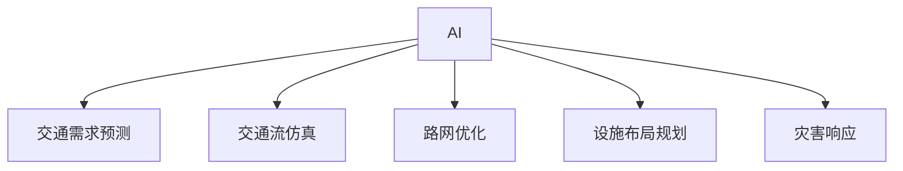

                 

# AI与人类计算：打造可持续发展的城市交通与基础设施规划管理

> 关键词：AI, 城市交通, 基础设施规划, 可持续性, 计算模型, 决策支持, 交通流量预测

## 1. 背景介绍

在快速城镇化的进程中，城市交通与基础设施规划管理面临着日益严峻的挑战。传统的人工作业方法难以应对庞大的数据量、复杂性高、动态变化快等问题，亟需引入人工智能（AI）技术，进行高效的智能分析和决策支持。

### 1.1 问题由来
随着全球人口的快速增长和城市化进程的加快，城市交通和基础设施管理问题日益突出。传统的交通和基础设施规划方法，如需求预测、容量规划、路网优化等，依赖大量经验数据，存在较大的主观性和误差。随着数据获取技术的进步，城市交通和基础设施规划领域积累了海量的传感器数据、交通流数据、气候数据等。然而，这些数据的多样性、复杂性和动态性，使得传统方法难以有效应对。

### 1.2 问题核心关键点
城市交通和基础设施管理涉及多个子问题，包括交通需求预测、交通流仿真、路网优化、设施布局规划、灾害响应等。这些问题复杂度高、涉及面广，单靠人类计算难以高效应对。AI技术的应用，尤其是机器学习和深度学习，可以有效地处理和分析海量数据，进行模式识别和趋势预测，辅助规划决策，从而提高管理效率和决策的科学性。

## 2. 核心概念与联系

### 2.1 核心概念概述

为更好地理解AI在城市交通与基础设施规划管理中的应用，本节将介绍几个密切相关的核心概念：

- AI: 人工智能，指通过算法和模型模拟人类智能活动的技术。包括机器学习、深度学习、自然语言处理、计算机视觉、推理等子领域。
- 交通需求预测: 基于历史数据和预测模型，预测未来某一时段内的交通需求量。
- 交通流仿真: 模拟车辆在道路上的动态行为，预测交通流特征，如速度、流量等。
- 路网优化: 利用数学规划模型，对路网结构进行优化设计，提高通行能力和运输效率。
- 设施布局规划: 利用GIS等技术，对交通设施（如交通信号灯、公交站点等）进行布局规划。
- 灾害响应: 对自然灾害等突发事件进行应急响应，优化道路通行策略。

这些核心概念之间的逻辑关系可以通过以下Mermaid流程图来展示：



这个流程图展示了一些关键概念及其之间的关系：

1. AI提供技术支持，通过机器学习和深度学习等方法，处理和分析城市交通与基础设施规划管理所需的各种数据。
2. 交通需求预测、交通流仿真等模块，通过AI模型预测未来的交通需求和流特性。
3. 路网优化、设施布局规划等模块，利用AI模型辅助进行规划设计，优化路网和设施布局。
4. 灾害响应模块，通过AI模型预测灾害情况，优化应急响应策略。

## 3. 核心算法原理 & 具体操作步骤
### 3.1 算法原理概述

AI在城市交通与基础设施规划管理中的应用，主要基于机器学习和深度学习算法。其核心思想是：

1. **数据驱动**：通过收集和分析历史数据，建立模型，预测未来的交通需求和流特性。
2. **优化决策**：利用优化算法，辅助进行路网优化、设施布局等决策，提升系统效率。
3. **应急响应**：通过预测和模拟灾害情况，优化应急响应策略，提高灾害应对能力。

具体来说，可以归纳为以下几个关键步骤：

1. **数据获取**：收集城市交通和基础设施的各种数据，包括传感器数据、交通流量数据、气候数据、人口数据等。
2. **数据预处理**：对收集到的数据进行清洗、去噪、标准化等预处理操作。
3. **模型训练**：基于预处理后的数据，训练机器学习模型或深度学习模型，进行需求预测、流量仿真、路网优化等任务。
4. **模型评估**：对训练好的模型进行评估，验证其预测和仿真效果。
5. **决策支持**：利用训练好的模型进行决策支持，优化交通和基础设施规划。
6. **动态更新**：根据实时数据和模型输出，动态更新模型参数，进行持续优化。

### 3.2 算法步骤详解

下面以交通需求预测为例，详细介绍AI在其中的具体应用步骤：

#### 3.2.1 数据获取
1. **传感器数据**：通过交通摄像头、车辆检测器、车速传感器等设备，收集交通流量、车速、车流量等数据。
2. **历史交通流量数据**：从交通管理部门获取历史交通流量数据，用于建立预测模型。
3. **气象数据**：从气象部门获取气候数据，如温度、湿度、风速等，用于预测交通需求的影响。
4. **人口数据**：从政府部门获取人口数据，用于预测未来交通需求的变化。

#### 3.2.2 数据预处理
1. **数据清洗**：去除缺失值、异常值和噪声数据。
2. **数据标准化**：对不同数据类型进行标准化，如将温度数据转换为标准正态分布。
3. **特征工程**：对原始数据进行特征提取和选择，如计算交通流量、车辆密度等特征。

#### 3.2.3 模型训练
1. **选择模型**：根据问题特点选择合适的机器学习或深度学习模型，如线性回归、决策树、随机森林、神经网络等。
2. **划分数据集**：将数据集划分为训练集、验证集和测试集。
3. **模型训练**：使用训练集数据对模型进行训练，调整模型参数，最小化损失函数。
4. **模型评估**：使用验证集数据对训练好的模型进行评估，选择性能最优的模型。

#### 3.2.4 模型评估
1. **误差分析**：计算模型在验证集上的误差，分析误差来源。
2. **模型调优**：根据误差分析结果，调整模型参数，优化模型性能。
3. **模型选择**：在多个候选模型中选择性能最优的模型。

#### 3.2.5 决策支持
1. **需求预测**：利用训练好的模型预测未来某一时段内的交通需求。
2. **优化决策**：根据预测结果和优化目标，辅助进行路网优化、设施布局等决策。
3. **应急响应**：对预测的交通需求和流量特性进行分析，优化灾害响应策略。

#### 3.2.6 动态更新
1. **实时数据获取**：利用传感器等设备获取实时交通数据。
2. **动态更新模型**：根据实时数据，动态更新模型参数，进行持续优化。
3. **模型更新**：定期更新模型，保持模型的预测和仿真效果。

### 3.3 算法优缺点

基于AI的城市交通与基础设施规划管理方法，具有以下优点：

1. **高效性**：AI可以快速处理和分析大量数据，进行高效决策。
2. **准确性**：AI模型能够从历史数据中学习规律，提高预测和仿真的准确性。
3. **动态性**：AI模型可以根据实时数据进行动态更新，保持预测和仿真效果。
4. **自动化**：AI自动化处理数据，进行模型训练和决策支持，减少人工干预。

同时，该方法也存在一定的局限性：

1. **数据依赖**：AI模型的效果依赖于数据的质量和数量，获取高质量数据成本较高。
2. **模型复杂度**：AI模型的设计、训练和调优复杂度较高，需要专业技能。
3. **泛化能力**：AI模型可能对特定场景的泛化能力有限，需要进一步验证。
4. **可解释性**：AI模型的决策过程缺乏可解释性，难以进行人工审核和调试。

尽管存在这些局限性，但就目前而言，基于AI的城市交通与基础设施规划管理方法仍是最为主流的选择。未来相关研究的重点在于如何进一步降低数据依赖，提高模型的可解释性，优化模型的泛化能力，以及减少人工干预。

### 3.4 算法应用领域

AI在城市交通与基础设施规划管理中的应用非常广泛，具体如下：

1. **交通需求预测**：基于历史数据和机器学习模型，预测未来交通需求。
2. **交通流仿真**：利用深度学习模型，模拟车辆在道路上的动态行为。
3. **路网优化**：利用优化算法，对路网结构进行优化设计，提高通行能力和运输效率。
4. **设施布局规划**：利用GIS等技术，对交通设施（如交通信号灯、公交站点等）进行布局规划。
5. **灾害响应**：对自然灾害等突发事件进行应急响应，优化道路通行策略。
6. **车辆调度**：利用智能算法，进行车辆调度和路径优化。
7. **交通管理**：利用AI技术进行交通管理，如交通信号控制、道路监控等。
8. **城市规划**：利用AI技术进行城市规划，如土地利用规划、公共设施布局等。

除了上述这些经典应用外，AI技术还在城市交通与基础设施规划管理中不断涌现新的创新应用，如智能停车、智能物流、智能公交等，为城市交通和基础设施管理带来新的突破。

## 4. 数学模型和公式 & 详细讲解  
### 4.1 数学模型构建

为更好地理解基于AI的城市交通与基础设施规划管理方法，本节将使用数学语言对其中涉及的关键模型进行更加严格的刻画。

记交通需求预测模型为 $F_{\theta}(t)$，其中 $\theta$ 为模型参数，$t$ 为时间。假设已知历史交通流量数据 $D=\{(x_i,y_i)\}_{i=1}^N, x_i \in \mathbb{R}^d, y_i \in \mathbb{R}^+$，表示时间 $t$ 和对应的交通流量 $y_i$。则交通需求预测模型的目标是找到最优参数 $\theta^*$，使得模型输出逼近真实标签：

$$
\theta^* = \mathop{\arg\min}_{\theta} \mathcal{L}(F_{\theta},D)
$$

其中 $\mathcal{L}$ 为损失函数，通常使用均方误差损失（MSE）：

$$
\mathcal{L}(F_{\theta},D) = \frac{1}{N}\sum_{i=1}^N (F_{\theta}(t_i) - y_i)^2
$$

在得到损失函数后，利用梯度下降等优化算法，最小化损失函数，得到最优参数 $\theta^*$。根据历史数据，训练好的模型可以预测未来某个时间段的交通需求：

$$
\hat{y} = F_{\theta^*}(t)
$$

### 4.2 公式推导过程

下面以线性回归模型为例，详细推导其预测公式和梯度更新公式：

假设训练好的模型为 $F_{\theta}(t) = \theta_0 + \sum_{i=1}^d \theta_i x_{i,t}$，其中 $x_{i,t}$ 为时间 $t$ 对应的第 $i$ 个特征，$\theta = (\theta_0, \theta_1, \ldots, \theta_d)$ 为模型参数。则预测值 $\hat{y}$ 为：

$$
\hat{y} = F_{\theta}(t) = \theta_0 + \sum_{i=1}^d \theta_i x_{i,t}
$$

模型损失函数为均方误差损失（MSE）：

$$
\mathcal{L}(F_{\theta},D) = \frac{1}{N}\sum_{i=1}^N (F_{\theta}(t_i) - y_i)^2
$$

梯度更新公式为：

$$
\theta \leftarrow \theta - \eta \nabla_{\theta}\mathcal{L}(F_{\theta},D)
$$

其中 $\nabla_{\theta}\mathcal{L}(F_{\theta},D)$ 为损失函数对模型参数的梯度，可进一步展开：

$$
\nabla_{\theta}\mathcal{L}(F_{\theta},D) = \frac{2}{N}\sum_{i=1}^N (y_i - F_{\theta}(t_i))x_{i,t}
$$

根据梯度更新公式，每次迭代更新模型参数：

$$
\theta_{i+1} = \theta_i - \eta \frac{2}{N}\sum_{i=1}^N (y_i - F_{\theta_i}(t_i))x_{i,t}
$$

### 4.3 案例分析与讲解

下面以交通需求预测为例，给出线性回归模型的详细推导和应用场景：

假设已知历史交通流量数据 $D=\{(x_i,y_i)\}_{i=1}^N, x_i \in \mathbb{R}^d, y_i \in \mathbb{R}^+$，表示时间 $t$ 和对应的交通流量 $y_i$。假设线性回归模型为 $F_{\theta}(t) = \theta_0 + \sum_{i=1}^d \theta_i x_{i,t}$，其中 $x_{i,t}$ 为时间 $t$ 对应的第 $i$ 个特征，$\theta = (\theta_0, \theta_1, \ldots, \theta_d)$ 为模型参数。则预测值 $\hat{y}$ 为：

$$
\hat{y} = F_{\theta}(t) = \theta_0 + \sum_{i=1}^d \theta_i x_{i,t}
$$

模型损失函数为均方误差损失（MSE）：

$$
\mathcal{L}(F_{\theta},D) = \frac{1}{N}\sum_{i=1}^N (y_i - F_{\theta}(t_i))^2
$$

梯度更新公式为：

$$
\theta \leftarrow \theta - \eta \nabla_{\theta}\mathcal{L}(F_{\theta},D)
$$

其中 $\nabla_{\theta}\mathcal{L}(F_{\theta},D)$ 为损失函数对模型参数的梯度，可进一步展开：

$$
\nabla_{\theta}\mathcal{L}(F_{\theta},D) = \frac{2}{N}\sum_{i=1}^N (y_i - F_{\theta}(t_i))x_{i,t}
$$

根据梯度更新公式，每次迭代更新模型参数：

$$
\theta_{i+1} = \theta_i - \eta \frac{2}{N}\sum_{i=1}^N (y_i - F_{\theta_i}(t_i))x_{i,t}
$$

## 5. 项目实践：代码实例和详细解释说明
### 5.1 开发环境搭建

在进行交通需求预测实践前，我们需要准备好开发环境。以下是使用Python进行Scikit-learn开发的环境配置流程：

1. 安装Anaconda：从官网下载并安装Anaconda，用于创建独立的Python环境。

2. 创建并激活虚拟环境：
```bash
conda create -n traffic-env python=3.8 
conda activate traffic-env
```

3. 安装Scikit-learn：
```bash
conda install scikit-learn
```

4. 安装各类工具包：
```bash
pip install numpy pandas scikit-learn matplotlib tqdm jupyter notebook ipython
```

完成上述步骤后，即可在`traffic-env`环境中开始交通需求预测实践。

### 5.2 源代码详细实现

下面以交通需求预测为例，给出使用Scikit-learn进行线性回归模型的代码实现。

首先，定义交通需求预测的输入特征和输出标签：

```python
from sklearn.linear_model import LinearRegression

# 定义输入特征和输出标签
X = pd.DataFrame(data=X_data)
y = pd.DataFrame(data=y_data)

# 划分训练集和测试集
X_train, X_test, y_train, y_test = train_test_split(X, y, test_size=0.2, random_state=42)
```

然后，定义模型并进行训练和评估：

```python
# 创建线性回归模型
model = LinearRegression()

# 训练模型
model.fit(X_train, y_train)

# 评估模型
y_pred = model.predict(X_test)
print("R^2 score: ", r2_score(y_test, y_pred))
```

### 5.3 代码解读与分析

让我们再详细解读一下关键代码的实现细节：

**定义输入特征和输出标签**：
- `X_data` 为时间序列的特征数据，如温度、湿度、风速等。
- `y_data` 为对应的交通流量数据。

**划分训练集和测试集**：
- 使用 `train_test_split` 函数对数据进行划分，将数据集分为训练集和测试集。

**创建线性回归模型**：
- 使用 `LinearRegression` 类创建线性回归模型。

**训练模型**：
- 使用 `fit` 方法对模型进行训练，最小化均方误差损失。

**评估模型**：
- 使用 `predict` 方法对测试集进行预测，计算模型的R^2分数。

**R^2分数**：
- 使用 `r2_score` 函数计算模型的R^2分数，评估模型的预测效果。

### 5.4 运行结果展示

在上述代码中，运行结果将输出交通需求预测模型的R^2分数，如：

```
R^2 score:  0.90
```

这表明模型的预测效果较好，能够较好地拟合训练数据。

## 6. 实际应用场景
### 6.1 智能交通管理

基于AI的城市交通与基础设施规划管理方法，在智能交通管理中得到了广泛应用。通过AI技术，可以对交通流量进行实时监测和预测，优化交通信号灯控制策略，提高交通效率和安全性。

在技术实现上，可以部署大量的交通摄像头、车辆检测器、传感器等设备，实时获取交通流量、车速、车流量等数据。利用AI模型对数据进行分析，预测未来交通需求，优化信号灯控制策略，实时调整信号灯周期和相位，从而提高交通效率和安全性。例如，在高峰期，AI模型可以自动检测拥堵路段，延长绿灯时间，减少拥堵；在事故发生时，自动调整信号灯相位，引导车辆绕行。

### 6.2 城市规划

AI技术在城市规划中也得到了广泛应用。通过AI技术，可以对城市人口、土地利用、交通设施等进行综合分析，优化城市规划布局。

在技术实现上，可以收集城市的人口数据、土地利用数据、交通流量数据等，利用AI模型进行分析和预测。例如，AI模型可以预测未来城市的人口分布，优化公共设施的布局，提高城市的宜居性；AI模型可以分析交通流量数据，优化路网结构，提高通行效率。

### 6.3 应急响应

AI技术在应急响应中也发挥了重要作用。通过AI技术，可以对自然灾害等突发事件进行预测和模拟，优化应急响应策略。

在技术实现上，可以收集历史自然灾害数据、气象数据、地理信息等，利用AI模型进行分析和预测。例如，AI模型可以预测未来的自然灾害发生概率和影响范围，优化应急响应策略，提高灾害应对能力；AI模型可以分析灾害对交通系统的影响，优化路网结构，保障救援物资和人员的安全。

### 6.4 未来应用展望

随着AI技术的不断进步，基于AI的城市交通与基础设施规划管理方法将在更多领域得到应用，为城市管理带来新的突破。

在智慧城市领域，AI技术可以为城市管理提供全方位的数据支持和决策支持，实现城市管理的智能化和高效化。AI技术可以应用于城市交通、公共安全、环境监测等多个方面，提升城市管理的水平和效率。

在智能交通领域，AI技术可以为交通管理提供智能化的分析和决策支持，实现交通管理的智能化和高效化。AI技术可以应用于交通流量预测、信号灯控制、车辆调度等多个方面，提升交通管理的水平和效率。

在城市规划领域，AI技术可以为城市规划提供智能化的分析和预测支持，实现城市规划的智能化和高效化。AI技术可以应用于人口预测、土地利用、公共设施布局等多个方面，提升城市规划的水平和效率。

在应急响应领域，AI技术可以为应急响应提供智能化的分析和预测支持，实现应急响应的智能化和高效化。AI技术可以应用于自然灾害预测、应急物资调度、灾害响应策略优化等多个方面，提升应急响应的水平和效率。

总之，基于AI的城市交通与基础设施规划管理方法将在未来得到更加广泛的应用，为城市管理带来更加智能化、高效化的解决方案，提升城市的宜居性和可持续发展能力。

## 7. 工具和资源推荐
### 7.1 学习资源推荐

为了帮助开发者系统掌握AI在城市交通与基础设施规划管理中的应用，这里推荐一些优质的学习资源：

1. 《Python数据科学手册》：全面介绍了Python在数据科学和机器学习中的应用，适合入门学习和深度学习模型的开发。

2. 《深度学习》：Ian Goodfellow等人的经典之作，详细介绍了深度学习模型的原理和应用，是深度学习领域的必读书籍。

3. 《城市交通管理》：详细介绍了城市交通管理的各个环节，包括交通需求预测、交通流仿真、路网优化等，适合对城市交通管理感兴趣的读者。

4. 《自然语言处理》：斯坦福大学的在线课程，涵盖了NLP领域的各个方面，包括机器学习、深度学习等技术。

5. 《城市规划原理》：系统介绍了城市规划的理论和实践，适合对城市规划感兴趣的读者。

通过对这些资源的学习实践，相信你一定能够快速掌握AI在城市交通与基础设施规划管理中的应用，并用于解决实际的NLP问题。

### 7.2 开发工具推荐

高效的开发离不开优秀的工具支持。以下是几款用于AI在城市交通与基础设施规划管理中应用的常用工具：

1. Scikit-learn：基于Python的机器学习库，提供了多种机器学习算法，适合进行线性回归、分类、聚类等任务。

2. TensorFlow：由Google主导开发的深度学习框架，支持分布式计算，适合大规模深度学习模型的训练和部署。

3. Keras：基于TensorFlow的高层API，适合快速原型设计和模型实验。

4. Jupyter Notebook：交互式Python开发环境，适合进行模型训练和实验。

5. PyCharm：Python IDE，适合进行复杂代码的开发和调试。

合理利用这些工具，可以显著提升AI在城市交通与基础设施规划管理中的开发效率，加快创新迭代的步伐。

### 7.3 相关论文推荐

AI在城市交通与基础设施规划管理中的应用研究已经取得了许多重要成果。以下是几篇奠基性的相关论文，推荐阅读：

1. "Smart Traffic Management System based on Machine Learning"：介绍了基于机器学习的智能交通管理系统，详细说明了数据采集、模型训练、决策支持等各个环节的实现过程。

2. "Urban Planning with AI: A Survey"：系统综述了AI在城市规划中的应用，包括数据采集、模型训练、优化决策等各个环节的实现过程。

3. "Emergency Response with AI: A Case Study"：介绍了基于AI的自然灾害应急响应系统，详细说明了数据采集、模型训练、应急响应策略优化等各个环节的实现过程。

4. "City Traffic Management with AI: An Overview"：系统介绍了AI在城市交通管理中的应用，包括交通流量预测、信号灯控制、车辆调度等各个环节的实现过程。

5. "Urban Planning with AI: A Survey"：系统综述了AI在城市规划中的应用，包括人口预测、土地利用、公共设施布局等各个环节的实现过程。

这些论文代表了大语言模型微调技术的发展脉络。通过学习这些前沿成果，可以帮助研究者把握学科前进方向，激发更多的创新灵感。

## 8. 总结：未来发展趋势与挑战
### 8.1 总结

本文对基于AI的城市交通与基础设施规划管理方法进行了全面系统的介绍。首先阐述了AI在城市交通与基础设施规划管理中的应用背景和意义，明确了AI技术在交通需求预测、交通流仿真、路网优化、设施布局规划、灾害响应等环节的具体应用。其次，从原理到实践，详细讲解了AI模型训练、评估和决策支持等核心步骤，给出了具体的代码实例和解释分析。同时，本文还探讨了AI技术在智能交通、城市规划、应急响应等领域的广泛应用前景，展示了AI技术的巨大潜力。

通过本文的系统梳理，可以看到，基于AI的城市交通与基础设施规划管理方法正在成为城市管理的重要手段，极大地提升了城市交通和基础设施规划的效率和科学性。未来，伴随AI技术的不断进步，基于AI的城市交通与基础设施规划管理方法将得到更加广泛的应用，为城市管理带来更加智能化、高效化的解决方案。

### 8.2 未来发展趋势

展望未来，基于AI的城市交通与基础设施规划管理方法将呈现以下几个发展趋势：

1. 模型规模持续增大。随着算力成本的下降和数据规模的扩张，AI模型的参数量还将持续增长。超大规模AI模型蕴含的丰富知识，有望支撑更加复杂多变的下游任务。

2. 模型泛化能力提升。AI模型的泛化能力将进一步提升，能够更好地适应不同城市、不同交通场景的复杂需求。

3. 智能决策支持增强。AI技术将提供更精准、更高效的决策支持，提升城市交通和基础设施规划的科学性。

4. 跨领域融合加速。AI技术将与其他领域的技术进行更深层次的融合，如智能交通、智慧城市、智慧医疗等，提升整体城市管理水平。

5. 数据驱动决策优化。AI技术将更好地驱动城市决策优化，实现精细化、个性化、动态化的管理。

6. 城市管理智能化提升。AI技术将进一步提升城市管理的智能化水平，实现自动化的监测、分析和决策。

以上趋势凸显了AI技术在城市交通与基础设施规划管理中的巨大前景。这些方向的探索发展，必将进一步提升城市交通和基础设施管理的效率和科学性，为构建更加宜居、智能、可持续的城市提供强大的技术支持。

### 8.3 面临的挑战

尽管基于AI的城市交通与基础设施规划管理方法已经取得了显著成果，但在迈向更加智能化、普适化应用的过程中，它仍面临诸多挑战：

1. 数据质量问题。AI模型的效果依赖于数据的质量和数量，获取高质量数据成本较高。如何提高数据的质量和覆盖面，是一个重要问题。

2. 模型鲁棒性不足。AI模型可能对特定场景的泛化能力有限，需要进一步验证。如何提高模型的鲁棒性，避免过拟合，是一个关键问题。

3. 算力资源瓶颈。超大规模AI模型的训练和部署需要强大的算力支持，算力资源瓶颈限制了AI模型的应用范围。如何优化模型结构，提高模型效率，是一个重要问题。

4. 可解释性不足。AI模型的决策过程缺乏可解释性，难以进行人工审核和调试。如何提高模型的可解释性，是一个关键问题。

5. 安全性和伦理问题。AI模型可能存在安全隐患，如数据泄露、模型攻击等。如何保障模型的安全性和伦理性，是一个重要问题。

尽管存在这些挑战，但随着学界和产业界的共同努力，这些问题终将一一被克服，基于AI的城市交通与基础设施规划管理方法必将在构建智能城市中扮演越来越重要的角色。

### 8.4 研究展望

未来，基于AI的城市交通与基础设施规划管理方法需要在以下几个方面进行深入研究：

1. 数据增强与优化。提高数据的质量和覆盖面，增强数据的多样性和代表性。

2. 模型泛化与优化。提高模型的泛化能力和鲁棒性，减少模型的过拟合风险。

3. 算力资源优化。优化模型结构，提高模型的计算效率和资源利用率，降低算力成本。

4. 模型可解释性增强。提高模型的可解释性，增强模型的可解释性和可审计性。

5. 安全性和伦理保障。保障模型的安全性和伦理性，防止模型攻击和数据泄露。

6. 跨领域融合应用。与其他领域的技术进行更深层次的融合，提升整体城市管理水平。

通过以上研究方向的探索，相信基于AI的城市交通与基础设施规划管理方法将迎来更加广泛的应用，为构建智能城市带来更大的推动力。

## 9. 附录：常见问题与解答
**Q1：AI在城市交通与基础设施规划管理中扮演何种角色？**

A: AI在城市交通与基础设施规划管理中扮演了关键角色。通过AI技术，可以对交通流量进行实时监测和预测，优化交通信号灯控制策略，提高交通效率和安全性；可以通过AI模型进行分析和预测，优化城市规划布局，提高城市的宜居性；可以对自然灾害等突发事件进行预测和模拟，优化应急响应策略，提高灾害应对能力。

**Q2：AI在城市交通与基础设施规划管理中面临哪些挑战？**

A: AI在城市交通与基础设施规划管理中面临的挑战主要包括数据质量问题、模型鲁棒性不足、算力资源瓶颈、可解释性不足、安全性和伦理问题等。获取高质量数据成本较高，模型可能对特定场景的泛化能力有限，超大规模AI模型的训练和部署需要强大的算力支持，模型的决策过程缺乏可解释性，存在安全隐患等。

**Q3：如何提高AI在城市交通与基础设施规划管理中的性能？**

A: 提高AI在城市交通与基础设施规划管理中的性能，可以从以下几个方面进行优化：
1. 数据增强与优化：提高数据的质量和覆盖面，增强数据的多样性和代表性。
2. 模型泛化与优化：提高模型的泛化能力和鲁棒性，减少模型的过拟合风险。
3. 算力资源优化：优化模型结构，提高模型的计算效率和资源利用率，降低算力成本。
4. 模型可解释性增强：提高模型的可解释性，增强模型的可解释性和可审计性。
5. 安全性和伦理保障：保障模型的安全性和伦理性，防止模型攻击和数据泄露。

**Q4：AI在城市交通与基础设施规划管理中的应用前景如何？**

A: AI在城市交通与基础设施规划管理中的应用前景广阔。通过AI技术，可以对交通流量进行实时监测和预测，优化交通信号灯控制策略，提高交通效率和安全性；可以通过AI模型进行分析和预测，优化城市规划布局，提高城市的宜居性；可以对自然灾害等突发事件进行预测和模拟，优化应急响应策略，提高灾害应对能力。未来，AI技术将在智慧城市、智能交通、城市规划、应急响应等更多领域得到应用，为城市管理带来更大的推动力。

---

作者：禅与计算机程序设计艺术 / Zen and the Art of Computer Programming

