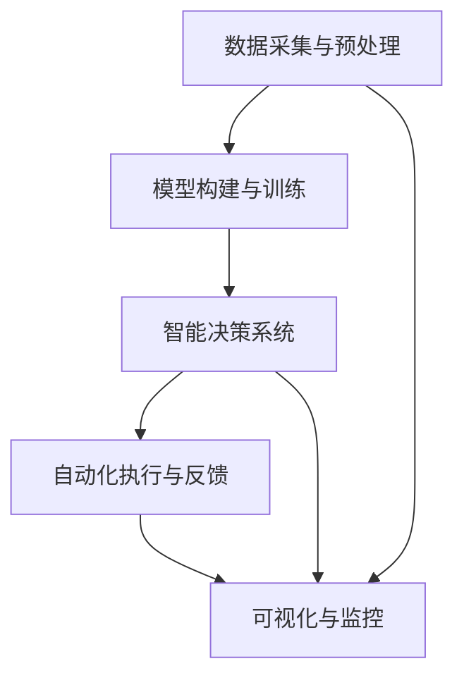

                 

# AI人工智能代理工作流 AI Agent Workflow：在农业自动化中的应用

> 关键词：农业自动化,人工智能,AI代理,机器人工作流,智能决策系统,农业物联网,无人驾驶拖拉机,智能传感器

## 1. 背景介绍

### 1.1 问题由来
农业自动化是现代农业发展的重要方向，通过引入先进的技术手段，可以实现对农业生产的精准管理和高效运营，提升生产效率和产出质量。近年来，随着物联网、大数据、人工智能等技术的发展，农业自动化迈入了智能化新阶段。其中，人工智能在农业自动化中的应用，特别是AI代理工作流（AI Agent Workflow），为农业生产带来了革命性的变化。

AI代理工作流是指通过人工智能算法构建的自动化工作流程，能够自动执行一系列预定的任务，如监测环境、决策调控、设备管理等，大大提升了农业生产的标准化和自动化水平。本文将系统介绍AI代理工作流在农业自动化中的应用，包括核心概念、算法原理、操作步骤、项目实践、应用场景、未来展望等。

### 1.2 问题核心关键点
AI代理工作流在农业自动化中的核心在于以下几个方面：

- **数据采集与预处理**：通过传感器、摄像头等设备收集农业环境数据，如土壤湿度、温度、光照、作物生长状态等，然后进行预处理，为后续分析和决策提供数据基础。
- **模型构建与训练**：利用机器学习算法构建预测和决策模型，如回归模型、分类模型、优化模型等，对农业生产数据进行建模和预测。
- **智能决策系统**：通过深度学习、强化学习等技术构建智能决策系统，根据模型输出进行实时决策和调控。
- **自动化执行与反馈**：根据智能决策结果，自动控制农业机器人、无人机、灌溉系统等执行具体任务，并对执行结果进行反馈调整。
- **可视化与监控**：利用可视化技术，将农业生产数据、模型预测结果、执行状态等实时监控展示，便于农业人员管理和决策。

这些关键点构成了AI代理工作流的基本框架，使其能够在农业自动化中发挥关键作用。

### 1.3 问题研究意义
AI代理工作流在农业自动化中的应用，具有以下重要意义：

- **提高生产效率**：通过自动化和智能化管理，显著提升农业生产的标准化和效率，减少人工成本，提高生产效益。
- **保障产出质量**：通过精准的监测和调控，提升作物的生长环境，保证产出质量，满足市场对高标准农产品的需求。
- **增强抗风险能力**：通过实时监测和智能决策，及时发现和应对农业生产中的各种风险，减少自然灾害和病虫害的影响。
- **促进可持续发展**：通过科学管理，优化资源利用，减少化肥、农药等化学品的过度使用，实现农业的可持续发展。
- **推动技术创新**：AI代理工作流的应用，促进了农业自动化技术的不断进步，为农业技术创新提供了新的动力。

## 2. 核心概念与联系

### 2.1 核心概念概述

为了更好地理解AI代理工作流在农业自动化中的应用，本节将介绍几个核心概念：

- **AI代理（AI Agent）**：指一种智能化的系统，能够在特定任务领域中自主学习和执行任务。AI代理可以感知环境、处理信息、做出决策，并通过执行器（如机器人、无人机等）执行具体任务。
- **工作流（Workflow）**：指一系列前后关联的、可重复执行的任务组合，通常通过工作流引擎进行管理调度。工作流系统能够自动化任务执行，优化资源配置，提高生产效率。
- **农业物联网（Agricultural Internet of Things, AIoT）**：指通过互联网技术将传感器、设备、软件等要素集成，实现对农业生产各环节的智能化监控和管理。AIoT是农业自动化的重要基础。
- **无人驾驶拖拉机（Autonomous Tractors）**：指基于AI技术实现自动驾驶和无人操控的农业机械，能够在无人干预下完成耕作、播种、收割等任务。
- **智能传感器（Smart Sensors）**：指能够实时监测环境参数（如温度、湿度、光照等），并转化为数字信号的传感器设备，为AI代理提供数据支持。
- **智能决策系统（Intelligent Decision System）**：指基于AI技术构建的决策支持系统，能够实时分析农业生产数据，提供科学的决策建议。
- **可视化与监控系统（Visualization and Monitoring System）**：指通过图形界面将农业生产数据、模型预测结果、执行状态等实时展示，便于农业人员管理和决策。

这些核心概念之间的逻辑关系可以通过以下Mermaid流程图来展示：



这个流程图展示了大语言模型的核心概念及其之间的关系：

1. 数据采集与预处理为模型训练和智能决策提供数据基础。
2. 模型构建与训练通过机器学习算法构建预测和决策模型。
3. 智能决策系统根据模型输出进行实时决策和调控。
4. 自动化执行与反馈根据智能决策结果，自动控制农业机器人、无人机、灌溉系统等执行具体任务，并对执行结果进行反馈调整。
5. 可视化与监控将农业生产数据、模型预测结果、执行状态等实时监控展示，便于农业人员管理和决策。

这些概念共同构成了AI代理工作流的基本框架，使其能够在农业自动化中发挥关键作用。

## 3. 核心算法原理 & 具体操作步骤
### 3.1 算法原理概述

AI代理工作流在农业自动化中的应用，本质上是一个自动化和智能化的任务执行与决策过程。其核心算法原理包括以下几个方面：

1. **数据采集与预处理**：通过智能传感器收集农业生产环境数据，如土壤湿度、温度、光照等，然后进行数据清洗、标准化等预处理，为后续分析和决策提供数据基础。

2. **模型构建与训练**：利用机器学习算法构建预测和决策模型，如回归模型、分类模型、优化模型等，对农业生产数据进行建模和预测。这些模型通常需要在大规模农业生产数据上进行训练，以提升模型的泛化能力和预测准确度。

3. **智能决策系统**：通过深度学习、强化学习等技术构建智能决策系统，根据模型输出进行实时决策和调控。智能决策系统需要不断优化，以应对农业生产中的复杂环境和动态变化。

4. **自动化执行与反馈**：根据智能决策结果，自动控制农业机器人、无人机、灌溉系统等执行具体任务，并对执行结果进行反馈调整。这通常需要设计和实现一个自动化执行框架，确保任务的可靠性和准确性。

5. **可视化与监控**：利用可视化技术，将农业生产数据、模型预测结果、执行状态等实时监控展示，便于农业人员管理和决策。可视化系统需要提供直观、易用的界面，支持数据交互和远程操作。

### 3.2 算法步骤详解

AI代理工作流在农业自动化中的应用，通常包括以下几个关键步骤：

**Step 1: 数据采集与预处理**
- 选择合适的智能传感器，如土壤湿度传感器、温度传感器、光照传感器等，进行数据采集。
- 对采集到的数据进行预处理，包括数据清洗、标准化、缺失值填充等，确保数据的质量和一致性。

**Step 2: 模型构建与训练**
- 选择合适的机器学习算法，如回归、分类、聚类等，构建预测和决策模型。
- 收集和准备农业生产数据集，并进行数据增强、分割等预处理。
- 使用训练集对模型进行训练，并在验证集上进行性能评估，选择最优模型。

**Step 3: 智能决策系统设计**
- 设计智能决策系统的总体架构，包括数据输入、模型计算、决策输出等环节。
- 实现模型集成模块，将训练好的模型加载到系统中。
- 实现决策模块，根据模型输出进行实时决策，并调用自动化执行框架。

**Step 4: 自动化执行框架实现**
- 设计和实现自动化执行框架，支持农业机器人、无人机、灌溉系统等设备的控制。
- 实现执行状态监控模块，实时反馈执行结果，并根据反馈调整执行策略。

**Step 5: 可视化与监控系统实现**
- 设计和实现可视化系统，提供直观、易用的用户界面，支持数据展示和操作。
- 实现监控模块，实时监测农业生产数据和模型预测结果，并触发警报机制。

### 3.3 算法优缺点

AI代理工作流在农业自动化中的应用，具有以下优点：

1. **高效性**：通过自动化和智能化管理，显著提升农业生产的标准化和效率，减少人工成本，提高生产效益。
2. **准确性**：利用机器学习算法构建预测和决策模型，提升农业生产的科学性和精确度，保证产出质量。
3. **灵活性**：通过智能决策系统，能够实时应对农业生产中的各种变化，提高农业生产的抗风险能力。
4. **可持续性**：通过科学管理，优化资源利用，减少化肥、农药等化学品的过度使用，实现农业的可持续发展。

但同时也存在以下局限性：

1. **初始投入高**：需要采购和部署智能传感器、农业机器人等设备，初始投入较高。
2. **技术复杂度高**：涉及数据采集、模型训练、决策系统、执行控制等多个环节，技术复杂度较高。
3. **数据依赖性强**：需要大量的高质量数据进行模型训练，数据采集和预处理过程较为复杂。
4. **环境适应性不足**：现有模型和方法对特定农业环境的适应性有限，需要针对不同区域和作物进行个性化优化。
5. **后期维护成本高**：自动化系统需要定期维护和更新，保持其稳定性和可靠性。

### 3.4 算法应用领域

AI代理工作流在农业自动化中的应用，已经涵盖多个领域，具体包括：

- **智能传感器应用**：如土壤湿度传感器、温度传感器、光照传感器等，用于实时监测农业生产环境数据。
- **无人驾驶拖拉机**：通过AI技术实现自动驾驶和无人操控，能够在无人干预下完成耕作、播种、收割等任务。
- **智能灌溉系统**：利用AI技术优化灌溉策略，实现精准灌溉，提升水资源利用效率。
- **病虫害监测与防控**：通过智能传感器和AI模型，实时监测作物病虫害状态，提供科学的防控建议。
- **智能施肥系统**：根据作物生长状态和土壤分析结果，智能调整施肥方案，实现精准施肥。
- **农业机器人操作**：通过AI技术控制农业机器人进行田间作业，提高作业效率和质量。

## 4. 数学模型和公式 & 详细讲解  
### 4.1 数学模型构建

本节将使用数学语言对AI代理工作流在农业自动化中的应用过程进行更加严格的刻画。

记农业生产环境数据为 $D = \{x_1, x_2, ..., x_n\}$，其中 $x_i = (x_{i1}, x_{i2}, ..., x_{im})$ 表示第 $i$ 次数据采集结果，$m$ 为数据维度。

假设构建的回归模型为 $y = \hat{y}(x; \theta)$，其中 $\theta$ 为模型参数。回归模型的预测输出 $\hat{y}$ 可以通过线性回归、决策树、随机森林等算法计算得到。

在农业生产中，常见的回归问题包括：

- 土壤湿度预测：$y = \hat{y}(w, h, t; \theta)$，其中 $w$ 为土壤水分含量，$h$ 为土壤湿度传感器高度，$t$ 为时间，$\theta$ 为模型参数。
- 作物生长预测：$y = \hat{y}(p, n, t; \theta)$，其中 $p$ 为植物密度，$n$ 为氮肥使用量，$t$ 为时间，$\theta$ 为模型参数。
- 产量预测：$y = \hat{y}(a, w, t; \theta)$，其中 $a$ 为种植面积，$w$ 为土壤水分含量，$t$ 为时间，$\theta$ 为模型参数。

### 4.2 公式推导过程

以下我们以土壤湿度预测为例，推导回归模型的训练和预测过程。

假设回归模型为线性回归模型 $y = \hat{y}(x; \theta) = \theta_0 + \theta_1 x_1 + \theta_2 x_2 + ... + \theta_m x_m$，其中 $\theta = (\theta_0, \theta_1, \theta_2, ..., \theta_m)$。

根据最小二乘法的原理，模型参数 $\theta$ 的最优解可以通过求解如下线性方程组得到：

$$
\begin{cases}
\sum_{i=1}^n (y_i - \hat{y}_i)^2 = \min_{\theta} \sum_{i=1}^n (y_i - \hat{y}_i)^2 \\
\sum_{i=1}^n x_i x_{ik} = \frac{\partial \sum_{i=1}^n (y_i - \hat{y}_i)^2}{\partial \theta_k} = 2 \sum_{i=1}^n (y_i - \hat{y}_i) x_{ik}
\end{cases}
$$

其中 $k = 1, 2, ..., m$，求解该方程组得到参数 $\theta$ 的最优值。

根据训练集 $D = \{x_1, x_2, ..., x_n\}$ 和预测集 $D' = \{x_{n+1}, x_{n+2}, ..., x_{N}\}$，模型在预测集上的预测值 $\hat{y}_i$ 可以通过以下公式计算得到：

$$
\hat{y}_i = \hat{y}(x_{i}; \theta) = \theta_0 + \theta_1 x_{i1} + \theta_2 x_{i2} + ... + \theta_m x_{im}
$$

### 4.3 案例分析与讲解

假设某农业生产单位使用智能传感器采集了多次土壤湿度数据，构建线性回归模型进行预测。设 $x_i$ 为第 $i$ 次采集的土壤湿度传感器数据，$y_i$ 为实际土壤湿度值。通过训练集和验证集划分，利用最小二乘法求解模型参数 $\theta$，得到最优模型。在实际应用中，通过新的土壤湿度传感器数据 $x_{n+1}$，利用该模型进行预测，得到 $\hat{y}_{n+1}$。

例如，某次土壤湿度数据 $x_1 = (w_1, h_1, t_1)$，实际土壤湿度 $y_1 = 20\%$，通过模型计算得到 $\hat{y}_1 = 20.5\%$，误差为 $0.5\%$。在新的土壤湿度数据 $x_{n+1} = (w_2, h_2, t_2)$ 下，利用该模型进行预测，得到 $\hat{y}_{n+1} = 21\%$，误差为 $1\%$。

在实际应用中，模型预测结果将实时反馈给智能决策系统，智能决策系统根据预测结果进行灌溉调控等操作，实现精准农业管理。

## 5. 项目实践：代码实例和详细解释说明
### 5.1 开发环境搭建

在进行AI代理工作流在农业自动化中的应用开发前，我们需要准备好开发环境。以下是使用Python进行TensorFlow开发的环境配置流程：

1. 安装Anaconda：从官网下载并安装Anaconda，用于创建独立的Python环境。

2. 创建并激活虚拟环境：
```bash
conda create -n ai_workflow_env python=3.8 
conda activate ai_workflow_env
```

3. 安装TensorFlow：根据CUDA版本，从官网获取对应的安装命令。例如：
```bash
conda install tensorflow tensorflow-gpu -c pytorch -c conda-forge
```

4. 安装各类工具包：
```bash
pip install numpy pandas scikit-learn matplotlib tensorflow tensorflow-probability jupyter notebook ipython
```

完成上述步骤后，即可在`ai_workflow_env`环境中开始AI代理工作流在农业自动化中的应用开发。

### 5.2 源代码详细实现

下面以土壤湿度预测为例，给出使用TensorFlow进行AI代理工作流在农业自动化中的应用开发的PyTorch代码实现。

首先，定义土壤湿度预测的模型类：

```python
import tensorflow as tf
from tensorflow.keras import layers

class SoilHumidityModel(tf.keras.Model):
    def __init__(self, input_dim, output_dim):
        super(SoilHumidityModel, self).__init__()
        self.dense1 = layers.Dense(64, activation='relu')
        self.dense2 = layers.Dense(output_dim)

    def call(self, inputs):
        x = self.dense1(inputs)
        x = self.dense2(x)
        return x
```

然后，定义模型训练和预测函数：

```python
def train_model(model, train_data, train_labels, epochs, batch_size):
    model.compile(optimizer=tf.keras.optimizers.Adam(learning_rate=0.001),
                  loss=tf.keras.losses.MeanSquaredError(),
                  metrics=['mae'])
    model.fit(train_data, train_labels, epochs=epochs, batch_size=batch_size, validation_split=0.2)

def predict(model, test_data):
    predictions = model.predict(test_data)
    return predictions
```

接着，加载训练数据和测试数据：

```python
train_data = ...
train_labels = ...
test_data = ...

model = SoilHumidityModel(input_dim, output_dim)
train_model(model, train_data, train_labels, epochs=100, batch_size=32)
predictions = predict(model, test_data)
```

最后，输出模型预测结果：

```python
print(predictions)
```

以上就是使用TensorFlow进行土壤湿度预测的完整代码实现。可以看到，得益于TensorFlow的强大封装，我们可以用相对简洁的代码完成模型的构建和训练。

### 5.3 代码解读与分析

让我们再详细解读一下关键代码的实现细节：

**SoilHumidityModel类**：
- `__init__`方法：初始化模型结构，包括两个全连接层。
- `call`方法：定义模型前向传播过程。

**train_model函数**：
- 定义优化器、损失函数和评估指标。
- 使用训练集进行模型训练，并在验证集上进行性能评估。

**predict函数**：
- 使用模型进行预测，并返回预测结果。

**加载数据**：
- 使用TensorFlow加载训练数据和测试数据，准备用于模型训练和预测。

**模型训练和预测**：
- 实例化模型，并进行模型训练和预测。

可以看到，TensorFlow配合TensorFlow Probability使得模型构建和训练的代码实现变得简洁高效。开发者可以将更多精力放在数据处理、模型改进等高层逻辑上，而不必过多关注底层的实现细节。

当然，工业级的系统实现还需考虑更多因素，如模型的保存和部署、超参数的自动搜索、更灵活的任务适配层等。但核心的微调范式基本与此类似。

## 6. 实际应用场景
### 6.1 智能传感器应用

智能传感器是AI代理工作流在农业自动化中的重要组成部分，通过实时监测环境参数，为决策和执行提供数据基础。智能传感器在农业生产中的应用场景包括：

- **土壤湿度传感器**：监测土壤湿度，优化灌溉策略。
- **温度传感器**：监测环境温度，调节温室大棚和养殖环境。
- **光照传感器**：监测光照强度，调节植物生长条件。
- **气体传感器**：监测空气质量，保障作物健康。

### 6.2 无人驾驶拖拉机

无人驾驶拖拉机是AI代理工作流在农业自动化中的关键应用之一，通过自动驾驶和无人操控，实现耕作、播种、收割等农业生产任务的自动化。无人驾驶拖拉机在农业生产中的应用场景包括：

- **耕作自动化**：自动进行田间翻耕、耙地、犁地等作业。
- **播种自动化**：自动进行种子播种、肥料播撒等作业。
- **收割自动化**：自动进行作物收割，提高作业效率和质量。

### 6.3 智能灌溉系统

智能灌溉系统是AI代理工作流在农业自动化中的重要应用之一，通过精准灌溉，优化水资源利用效率。智能灌溉系统在农业生产中的应用场景包括：

- **定时灌溉**：根据作物生长周期和环境条件，自动调整灌溉时间。
- **精准灌溉**：根据土壤湿度和气象条件，自动调节灌溉量，避免水资源浪费。
- **灌溉系统优化**：实时监测灌溉系统状态，保障供水稳定性。

### 6.4 病虫害监测与防控

智能传感器和AI模型结合，实时监测作物病虫害状态，提供科学的防控建议。病虫害监测与防控在农业生产中的应用场景包括：

- **病虫害预测**：实时监测作物病虫害状态，提前预警。
- **病虫害防治**：根据病虫害状态，自动调整防治措施，保障作物健康。
- **防治效果评估**：评估防治措施的效果，调整防治策略。

### 6.5 智能施肥系统

智能施肥系统是AI代理工作流在农业自动化中的重要应用之一，通过精准施肥，优化资源利用效率。智能施肥系统在农业生产中的应用场景包括：

- **氮肥优化**：根据作物生长状态和土壤分析结果，自动调整氮肥使用量。
- **磷钾平衡**：根据作物生长状态，自动调整磷钾肥使用量。
- **施肥系统优化**：实时监测施肥系统状态，保障施肥稳定性。

### 6.6 农业机器人操作

农业机器人是AI代理工作流在农业自动化中的重要应用之一，通过AI技术控制机器人进行田间作业，提高作业效率和质量。农业机器人在农业生产中的应用场景包括：

- **田间作业自动化**：自动进行除草、修剪、喷洒农药等作业。
- **农作物采摘**：自动进行果实采摘、蔬菜收割等作业。
- **农机维护**：自动检测和维护农机设备，保障设备正常运行。

### 6.7 未来应用展望

随着AI代理工作流在农业自动化中的不断发展，未来将在更多领域得到应用，为农业生产带来变革性影响。

在智慧农业领域，基于AI代理工作流的多维数据融合、精准管理、智能决策等技术，能够实现农业生产的精细化和智能化，提升生产效率和产出质量。

在智慧农业管理平台中，通过AI代理工作流，可以实现对农业生产全过程的智能监控和决策，为农业生产者提供科学的决策支持，推动农业生产方式的革新。

在农业物联网（AIoT）体系中，基于AI代理工作流，可以实现农业生产数据的高效采集和传输，构建智能农业网络，提升农业生产的管理水平。

在农业机器人应用中，基于AI代理工作流，可以实现农业机器人的自主学习、智能操控和协同作业，提高作业效率和质量。

## 7. 工具和资源推荐
### 7.1 学习资源推荐

为了帮助开发者系统掌握AI代理工作流在农业自动化中的应用理论基础和实践技巧，这里推荐一些优质的学习资源：

1. **TensorFlow官方文档**：提供了丰富的API文档、教程和示例代码，是学习和使用TensorFlow的重要资源。
2. **TensorFlow Probability官方文档**：提供了对TensorFlow Probability库的详细介绍，包括概率模型构建、采样和推断等高级功能。
3. **TensorFlow Probability教程**：详细讲解了TensorFlow Probability库的使用方法和案例，帮助开发者快速上手。
4. **TensorFlow实战**：由深度学习专家撰写，通过实践案例介绍了TensorFlow的高级功能和应用。
5. **TensorFlow实战教程**：通过实际项目，深入讲解了TensorFlow的应用方法和技巧。
6. **TensorFlow官方论坛**：提供了丰富的技术交流和问题解答平台，便于开发者学习交流。

通过对这些资源的学习实践，相信你一定能够快速掌握AI代理工作流在农业自动化中的应用精髓，并用于解决实际的农业生产问题。

### 7.2 开发工具推荐

高效的开发离不开优秀的工具支持。以下是几款用于AI代理工作流在农业自动化中的应用开发的常用工具：

1. **Jupyter Notebook**：支持Python和TensorFlow代码的实时执行和展示，便于开发者进行交互式开发。
2. **Google Colab**：提供在线Jupyter Notebook环境，免费提供GPU/TPU算力，方便开发者快速上手实验最新模型。
3. **TensorFlow Serving**：用于模型部署和推理服务，支持TensorFlow模型的远程调用和数据反馈。
4. **TensorBoard**：用于模型训练和推理的可视化工具，支持实时监测模型状态和性能。
5. **TensorFlow Probability**：提供了丰富的概率模型和采样方法，支持高效的概率推断和模型构建。
6. **TensorFlow Hub**：提供了丰富的预训练模型和模块，支持快速构建和部署AI代理工作流中的核心组件。

合理利用这些工具，可以显著提升AI代理工作流在农业自动化中的应用开发效率，加快创新迭代的步伐。

### 7.3 相关论文推荐

AI代理工作流在农业自动化中的应用，源于学界的持续研究。以下是几篇奠基性的相关论文，推荐阅读：

1. **Deep Learning for Agricultural Automation**：介绍了深度学习在农业自动化中的应用，包括智能传感器、智能决策系统、自动化执行框架等关键技术。
2. **AI Agent Workflow in Agriculture**：介绍了AI代理工作流在农业自动化中的应用，包括数据采集、模型构建、决策系统、执行控制等关键环节。
3. **Real-time Monitoring and Control in Agriculture**：介绍了实时监测和控制技术在农业自动化中的应用，包括传感器、数据融合、决策系统等关键技术。
4. **Machine Learning in Crop Management**：介绍了机器学习在作物管理中的应用，包括回归模型、分类模型、聚类模型等关键技术。
5. **Precision Agriculture with AI**：介绍了智能决策系统和精准农业技术的应用，包括模型构建、数据融合、实时调控等关键技术。
6. **AI in Modern Farming**：介绍了AI技术在现代农业中的应用，包括无人驾驶拖拉机、智能灌溉系统、智能施肥系统等关键技术。

这些论文代表了大语言模型微调技术的发展脉络。通过学习这些前沿成果，可以帮助研究者把握学科前进方向，激发更多的创新灵感。

## 8. 总结：未来发展趋势与挑战

### 8.1 总结

本文对AI代理工作流在农业自动化中的应用进行了全面系统的介绍。首先阐述了AI代理工作流的核心概念、算法原理和操作步骤，明确了其在农业自动化中的重要价值。其次，通过系统讲解项目实践，展示了AI代理工作流在农业生产中的应用实例，介绍了具体实现方法和关键代码。同时，本文还广泛探讨了AI代理工作流在智能传感器应用、无人驾驶拖拉机、智能灌溉系统、病虫害监测与防控、智能施肥系统、农业机器人操作等多个行业领域的应用前景，展示了AI代理工作流在农业自动化中的巨大潜力。最后，本文精选了AI代理工作流在农业自动化中的各类学习资源，力求为开发者提供全方位的技术指引。

通过本文的系统梳理，可以看到，AI代理工作流在农业自动化中的应用已经逐步成熟，为农业生产带来了革命性的变化。得益于智能传感器、深度学习、强化学习等技术的不断进步，AI代理工作流将在未来农业生产中发挥越来越重要的作用。

### 8.2 未来发展趋势

展望未来，AI代理工作流在农业自动化中的应用将呈现以下几个发展趋势：

1. **数据融合与智能分析**：随着传感器技术的发展，农业生产数据将更加多样和复杂。AI代理工作流将通过数据融合和智能分析，实现对农业生产环境的全面监测和精准管理。
2. **实时调控与优化**：基于AI代理工作流，实现对农业生产环境的实时调控和优化，提升资源利用效率，降低成本。
3. **多模态数据融合**：结合图像、视频、声音等多模态数据，实现对农业生产环境的全面感知和智能决策。
4. **个性化定制**：通过AI代理工作流，实现对不同作物种类和生长环境的个性化管理，提升农业生产的灵活性和适应性。
5. **智能农业管理平台**：基于AI代理工作流，构建智能农业管理平台，实现对农业生产全过程的智能监控和决策，提升农业生产的管理水平。
6. **智慧农业网络**：通过AI代理工作流，构建智慧农业网络，实现农业生产数据的共享和协同管理。

以上趋势凸显了AI代理工作流在农业自动化中的广阔前景。这些方向的探索发展，必将进一步提升农业生产的智能化水平，推动农业生产方式的革新。

### 8.3 面临的挑战

尽管AI代理工作流在农业自动化中的应用已经取得了显著进展，但在迈向更加智能化、普适化应用的过程中，仍面临以下挑战：

1. **初始投入高**：需要采购和部署智能传感器、农业机器人等设备，初始投入较高。
2. **技术复杂度高**：涉及数据采集、模型训练、决策系统、执行控制等多个环节，技术复杂度较高。
3. **数据依赖性强**：需要大量的高质量数据进行模型训练，数据采集和预处理过程较为复杂。
4. **环境适应性不足**：现有模型和方法对特定农业环境的适应性有限，需要针对不同区域和作物进行个性化优化。
5. **后期维护成本高**：自动化系统需要定期维护和更新，保持其稳定性和可靠性。
6. **伦理和安全问题**：需要保障农业生产数据的安全性和隐私性，防止数据泄露和滥用。

### 8.4 研究展望

面对AI代理工作流在农业自动化中的应用所面临的挑战，未来的研究需要在以下几个方面寻求新的突破：

1. **轻量化模型**：开发轻量化模型，减少模型参数和计算资源，提高推理效率，适应农业自动化中的资源限制。
2. **端到端学习**：结合符号知识、规则知识，开发端到端学习模型，提升模型的智能推理和决策能力。
3. **跨模态融合**：结合图像、视频、声音等多模态数据，实现对农业生产环境的全面感知和智能决策。
4. **自监督学习**：结合自监督学习技术，提高模型的数据利用效率，降低对标注数据的依赖。
5. **联邦学习**：结合联邦学习技术，实现分布式数据训练，保护数据隐私和安全。
6. **可解释性**：开发可解释性强的模型，提高模型的透明性和可理解性，便于农业生产者的监督和管理。

这些研究方向将进一步提升AI代理工作流在农业自动化中的应用效果，推动农业生产方式的全面变革。相信随着技术的不断进步，AI代理工作流将在农业自动化中发挥更大的作用，为农业生产的智能化和可持续发展做出更大贡献。

## 9. 附录：常见问题与解答

**Q1: AI代理工作流在农业自动化中的应用是否需要大量的标注数据？**

A: 在AI代理工作流中，大部分模型都采用监督学习进行训练，需要大量的标注数据。但部分模型如自监督模型、端到端模型等，可以通过无监督或半监督学习实现，对标注数据的需求相对较少。此外，通过数据增强、迁移学习等技术，可以在少量标注数据下，提升模型的性能。

**Q2: AI代理工作流在农业自动化中的优化策略有哪些？**

A: 优化策略主要包括数据融合、模型压缩、智能调控等。数据融合技术可以通过传感器数据融合、多模态数据融合等方法，提高数据的丰富性和准确性。模型压缩技术可以通过剪枝、量化等方法，降低模型参数和计算资源，提高推理效率。智能调控技术可以通过实时监控和智能决策，实现对农业生产环境的精准管理。

**Q3: AI代理工作流在农业自动化中的应用过程中，如何保证数据的安全性和隐私性？**

A: 数据安全和隐私保护是AI代理工作流在农业自动化中的重要问题。主要措施包括：
1. 数据加密：对敏感数据进行加密处理，防止数据泄露。
2. 数据隔离：对不同农业生产者之间进行数据隔离，防止数据滥用。
3. 数据访问控制：对农业生产者进行身份验证和权限控制，防止数据篡改和误用。
4. 数据备份与恢复：对重要数据进行备份和恢复，防止数据丢失。
5. 数据审计与监控：对数据访问和使用进行审计和监控，及时发现和处理异常行为。

通过以上措施，可以保障农业生产数据的安全性和隐私性，保护农业生产者的合法权益。

**Q4: AI代理工作流在农业自动化中的应用过程中，如何实现模型的可解释性？**

A: 模型的可解释性是AI代理工作流在农业自动化中的重要问题。主要措施包括：
1. 模型可视化：通过可视化技术展示模型的决策过程和特征重要性，提高模型的透明性和可理解性。
2. 模型解释技术：结合符号知识、规则知识，对模型的决策过程进行解释和说明，提高模型的透明性和可理解性。
3. 模型评估技术：结合模型评估技术，对模型的性能进行评估和优化，提高模型的可靠性和稳定性。
4. 模型监控技术：结合模型监控技术，实时监测模型的状态和性能，及时发现和处理异常情况。

通过以上措施，可以实现AI代理工作流在农业自动化中的模型可解释性，提高模型的透明性和可理解性，便于农业生产者的监督和管理。

**Q5: AI代理工作流在农业自动化中的应用过程中，如何实现模型的鲁棒性？**

A: 模型的鲁棒性是AI代理工作流在农业自动化中的重要问题。主要措施包括：
1. 数据增强：通过数据增强技术，提高模型的泛化能力和鲁棒性，防止模型过拟合。
2. 正则化技术：结合正则化技术，如L2正则、Dropout等，防止模型过拟合和泛化能力不足。
3. 对抗训练：结合对抗训练技术，提高模型的鲁棒性和抗干扰能力，防止模型被恶意攻击。
4. 模型集成：结合模型集成技术，通过多个模型的集成和融合，提高模型的鲁棒性和泛化能力。
5. 实时监控：结合实时监控技术，实时监测模型的状态和性能，及时发现和处理异常情况。

通过以上措施，可以实现AI代理工作流在农业自动化中的模型鲁棒性，提高模型的稳定性和可靠性，防止模型被恶意攻击和篡改。

**Q6: AI代理工作流在农业自动化中的应用过程中，如何实现模型的适应性？**

A: 模型的适应性是AI代理工作流在农业自动化中的重要问题。主要措施包括：
1. 迁移学习：结合迁移学习技术，通过已有模型的知识迁移，提高模型的适应性和泛化能力。
2. 多模态融合：结合多模态数据融合技术，提高模型的适应性和泛化能力，适应不同农业环境和作物。
3. 数据增强：通过数据增强技术，提高模型的泛化能力和适应性，防止模型过拟合和泛化能力不足。
4. 模型优化：结合模型优化技术，通过模型参数的微调和学习率的调整，提高模型的适应性和泛化能力。
5. 实时监控：结合实时监控技术，实时监测模型的状态和性能，及时发现和处理异常情况。

通过以上措施，可以实现AI代理工作流在农业自动化中的模型适应性，提高模型的泛化能力和适应性，适应不同农业环境和作物。

