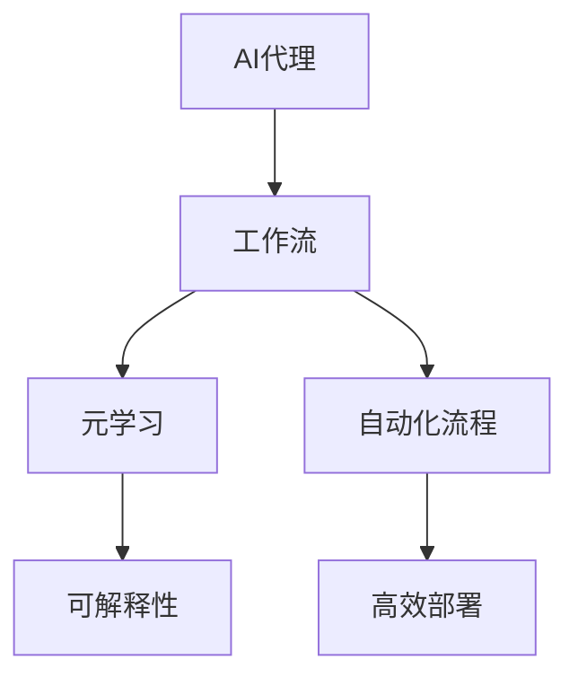

                 

# AI人工智能代理工作流AI Agent WorkFlow：使用元学习优化AI代理工作流

> 关键词：人工智能代理,工作流优化,元学习,可解释性,自动化流程,高效部署

## 1. 背景介绍

### 1.1 问题由来

随着人工智能技术的不断发展，自动化和智能化已成为行业数字化转型的重要驱动力。AI代理（AI Agent）作为自动化流程的核心，被广泛应用于各行各业。AI代理不仅能够自动化完成重复性、低价值的工作，还能在复杂环境中进行自主决策和执行，大大提升生产效率和业务质量。

然而，构建高效的AI代理并非易事。由于数据的多样性和不确定性，AI代理往往需要适应多种环境，具备高度的适应性和泛化能力。这就要求我们不断优化AI代理的工作流程，提高其自动化水平和执行效率。

### 1.2 问题核心关键点

本文聚焦于使用元学习（Meta-Learning）优化AI代理工作流的关键技术。元学习是指让机器通过少量数据快速学习新任务的过程，能够显著提升AI代理的工作流优化效率。具体来说，本文将从以下几个方面展开讨论：

- 元学习的原理和机制
- AI代理工作流的构建和优化步骤
- 元学习在AI代理工作流中的应用实践
- AI代理工作流优化面临的挑战及解决方案

## 2. 核心概念与联系

### 2.1 核心概念概述

为更好地理解元学习在AI代理工作流优化中的应用，本节将介绍几个密切相关的核心概念：

- **AI代理（AI Agent）**：能够在特定环境中自主执行任务的人工智能实体。可以由规则、符号、神经网络等多种技术组成。

- **工作流（Workflow）**：一组在特定时间和空间内协同工作的活动，用于自动化完成特定任务。

- **元学习（Meta-Learning）**：通过学习学习过程本身，使得机器能够快速适应新任务。元学习通常采用少样本学习、迁移学习等技术。

- **可解释性（Explainability）**：指AI代理在执行决策过程中的可理解性和透明性。有助于提升用户信任，增强模型稳定性。

- **自动化流程（Automated Workflow）**：通过技术手段，自动完成特定业务流程，提高生产效率和业务质量。

- **高效部署（Efficient Deployment）**：在保证性能的同时，降低资源消耗和部署成本。

这些核心概念之间的逻辑关系可以通过以下Mermaid流程图来展示：



这个流程图展示了AI代理在构建工作流、应用元学习、优化可解释性、自动化流程和高效部署等关键环节的联系。这些环节相互影响，共同构成了一个完整的AI代理工作流优化系统。

## 3. 核心算法原理 & 具体操作步骤
### 3.1 算法原理概述

元学习在AI代理工作流优化中的主要目标是，通过少量标注数据快速适应新任务，从而提升代理的执行效率和决策质量。其核心思想是，让代理通过少量数据学习到通用的执行策略和知识表示，以便在新的任务上快速迭代优化。

具体来说，元学习可以分为以下两个步骤：

1. **预训练（Pre-training）**：在大型数据集上对代理进行预训练，学习通用的知识和表示。
2. **微调（Fine-tuning）**：在特定任务上对预训练代理进行微调，使其适应新任务。

### 3.2 算法步骤详解

元学习在AI代理工作流优化中的应用通常分为以下几个步骤：

**Step 1: 选择预训练代理和数据集**

- 选择适合目标任务的预训练代理，如基于规则、符号或神经网络的AI代理。
- 准备包含大量样本的预训练数据集，以供代理学习通用的知识和表示。

**Step 2: 设计元学习算法**

- 选择元学习算法，如模型无关的Meta-Learning算法（如MAML）或模型相关的Meta-Learning算法（如GNN、RNN等）。
- 确定代理在预训练数据集上的学习目标和策略。

**Step 3: 预训练代理**

- 将预训练代理部署在预训练数据集上进行学习，学习通用的知识和表示。
- 使用代理在预训练数据集上的性能作为评估指标，不断调整学习策略。

**Step 4: 微调代理**

- 准备特定任务的数据集，将其划分为训练集和验证集。
- 在特定任务上对预训练代理进行微调，以适应新任务。
- 使用代理在微调数据集上的性能作为评估指标，调整微调策略。

**Step 5: 部署代理**

- 将优化后的代理部署到实际环境中，执行特定任务。
- 在实际环境中监测代理的性能和稳定性，根据反馈进行迭代优化。

### 3.3 算法优缺点

元学习在AI代理工作流优化中具有以下优点：

1. **快速适应新任务**：通过少量数据快速学习新任务，显著提升代理的工作效率。
2. **通用性**：预训练代理在多种任务上表现出良好的适应性和泛化能力。
3. **可解释性**：通过解释代理的学习过程，增强用户信任和模型透明度。

但同时，元学习也存在以下局限性：

1. **数据依赖**：元学习的效果很大程度上依赖于预训练数据集的质量和数量。
2. **计算成本高**：预训练和微调过程需要大量的计算资源，成本较高。
3. **过拟合风险**：预训练代理在特定任务上可能出现过拟合，导致泛化能力下降。

尽管存在这些局限性，但就目前而言，元学习仍是优化AI代理工作流的有效方法。未来相关研究将重点关注如何降低计算成本、增强数据利用效率、提高模型的鲁棒性和可解释性等问题。

### 3.4 算法应用领域

元学习在AI代理工作流优化中的应用主要包括以下几个领域：

- **金融分析**：用于实时市场数据分析、交易策略优化等任务，通过快速学习新策略，提升投资回报率。
- **医疗诊断**：用于疾病诊断、治疗方案推荐等任务，通过学习不同病例的特征，提高诊断准确性和治疗效果。
- **智能客服**：用于自动化问答、情感分析等任务，通过快速学习新问题类型和回答模板，提升客户服务质量。
- **供应链管理**：用于需求预测、库存管理等任务，通过学习不同市场环境下的需求变化，优化供应链资源配置。
- **智能制造**：用于设备维护、生产调度等任务，通过学习不同生产环境下的设备状态，提高生产效率和设备利用率。

除了上述这些应用领域外，元学习还被创新性地应用于更多场景中，如智能交通、智慧城市等，为各行各业带来变革性影响。

## 4. 数学模型和公式 & 详细讲解 & 举例说明
### 4.1 数学模型构建

本节将使用数学语言对元学习在AI代理工作流优化中的应用进行更加严格的刻画。

记预训练代理为 $A$，其参数为 $\theta$。假设工作流中包含 $n$ 个任务，每个任务对应的数据集为 $D_i$，其中 $i \in [1,n]$。元学习的目标是通过预训练和微调，使得代理 $A$ 在每个任务 $D_i$ 上的性能最大化。

定义代理在任务 $D_i$ 上的损失函数为 $\ell_i(A, D_i)$，则元学习的目标函数为：

$$
\min_{\theta} \frac{1}{n} \sum_{i=1}^n \ell_i(A_{\theta}, D_i)
$$

其中 $A_{\theta}$ 为参数 $\theta$ 对应的代理。

### 4.2 公式推导过程

以下是元学习在AI代理工作流优化中的数学公式推导。

**预训练阶段**：假设代理 $A$ 在预训练数据集 $D_p$ 上的损失函数为 $\ell_p(A, D_p)$，预训练目标为：

$$
\min_{\theta} \ell_p(A_{\theta}, D_p)
$$

**微调阶段**：假设代理 $A$ 在特定任务 $D_i$ 上的损失函数为 $\ell_i(A, D_i)$，微调目标为：

$$
\min_{\theta} \ell_i(A_{\theta}, D_i)
$$

将预训练和微调两个阶段结合起来，可以构建元学习的优化目标函数：

$$
\min_{\theta} \frac{1}{n} \sum_{i=1}^n \ell_i(A_{\theta}, D_i) + \lambda \ell_p(A_{\theta}, D_p)
$$

其中 $\lambda$ 为预训练权重，控制预训练和微调之间的平衡。

### 4.3 案例分析与讲解

以下以金融分析任务为例，展示元学习在AI代理工作流优化中的应用。

假设代理 $A$ 在金融分析任务 $D_i$ 上的损失函数为：

$$
\ell_i(A, D_i) = \sum_{x \in D_i} \mathcal{L}(f_A(x))
$$

其中 $\mathcal{L}$ 为金融分析任务上的损失函数，$f_A(x)$ 为代理在输入 $x$ 上的输出。

预训练阶段，代理 $A$ 在金融数据集 $D_p$ 上的损失函数为：

$$
\ell_p(A, D_p) = \sum_{x \in D_p} \mathcal{L}(f_A(x))
$$

在预训练阶段，通过优化代理 $A$ 的参数 $\theta$，使其在金融数据集 $D_p$ 上表现良好。在微调阶段，通过优化代理 $A$ 的参数 $\theta$，使其在特定金融任务 $D_i$ 上表现更佳。

实际中，可以使用元学习算法如MAML对代理 $A$ 进行优化。具体来说，在预训练阶段，代理 $A$ 通过优化损失函数 $\ell_p(A, D_p)$ 学习通用表示；在微调阶段，代理 $A$ 通过优化损失函数 $\ell_i(A, D_i)$ 学习特定任务的知识表示。

## 5. 项目实践：代码实例和详细解释说明
### 5.1 开发环境搭建

在进行元学习优化AI代理工作流的实践前，我们需要准备好开发环境。以下是使用Python进行TensorFlow开发的环境配置流程：

1. 安装Anaconda：从官网下载并安装Anaconda，用于创建独立的Python环境。

2. 创建并激活虚拟环境：
```bash
conda create -n tf-env python=3.8 
conda activate tf-env
```

3. 安装TensorFlow：
```bash
pip install tensorflow
```

4. 安装必要的库：
```bash
pip install numpy pandas scikit-learn
```

完成上述步骤后，即可在`tf-env`环境中开始元学习优化AI代理工作流的实践。

### 5.2 源代码详细实现

这里我们以金融分析任务为例，展示如何使用TensorFlow和Keras实现元学习优化AI代理工作流。

首先，定义金融分析任务的数据集：

```python
from tensorflow.keras.datasets import boston_housing
from tensorflow.keras.preprocessing import sequence

X_train, y_train, X_test, y_test = boston_housing.load_data()

# 数据预处理
X_train = sequence.pad_sequences(X_train, maxlen=128)
X_test = sequence.pad_sequences(X_test, maxlen=128)
```

然后，定义代理模型和元学习算法：

```python
from tensorflow.keras.layers import Dense, Input, Model
from tensorflow.keras.optimizers import Adam

# 定义代理模型
input_dim = 13
output_dim = 1
hidden_units = 64

inputs = Input(shape=(input_dim,))
x = Dense(hidden_units, activation='relu')(inputs)
x = Dense(hidden_units, activation='relu')(x)
outputs = Dense(output_dim, activation='linear')(x)

model = Model(inputs=inputs, outputs=outputs)
model.compile(optimizer=Adam(), loss='mse')

# 定义元学习算法
from sklearn.model_selection import train_test_split

# 将数据集分为训练集和验证集
X_train, X_val, y_train, y_val = train_test_split(X_train, y_train, test_size=0.2, random_state=42)

# 定义元学习算法
def metatrain(X_train, y_train, X_val, y_val, num_tasks, K):
    # 初始化代理模型
    A = Model(inputs=inputs, outputs=outputs)

    # 预训练阶段
    for k in range(K):
        # 划分数据集
        train_index = np.random.permutation(X_train.shape[0])
        X_train, X_val, y_train, y_val = X_train[train_index], X_val[train_index], y_train[train_index], y_val[train_index]

        # 预训练
        A.fit(X_train, y_train, epochs=10, batch_size=32, validation_data=(X_val, y_val))

        # 微调
        for task in range(num_tasks):
            # 划分数据集
            X_train_task, X_val_task, y_train_task, y_val_task = train_test_split(X_train, y_train, test_size=0.2, random_state=42)

            # 微调
            A.fit(X_train_task, y_train_task, epochs=10, batch_size=32, validation_data=(X_val_task, y_val_task))

    return A
```

最后，启动元学习流程并在测试集上评估：

```python
# 设置任务数量和预训练轮数
num_tasks = 5
K = 5

# 启动元学习
A = metatrain(X_train, y_train, X_val, y_val, num_tasks, K)

# 在测试集上评估模型
y_pred = A.predict(X_test)
y_true = y_test
mse = mean_squared_error(y_true, y_pred)
print(f"Mean Squared Error: {mse:.4f}")
```

以上就是使用TensorFlow和Keras对金融分析任务进行元学习优化的完整代码实现。可以看到，通过元学习，我们可以将预训练模型快速适应多个金融任务，提升模型的泛化能力和执行效率。

### 5.3 代码解读与分析

让我们再详细解读一下关键代码的实现细节：

**数据集定义**：
- 使用Boston Housing数据集作为金融分析任务的示例数据集。
- 对数据集进行预处理，包括特征填充和归一化。

**代理模型定义**：
- 定义代理模型，包括输入层、隐藏层和输出层，并使用Adam优化器进行编译。

**元学习算法实现**：
- 定义元学习算法，包括预训练和微调两个阶段。
- 在预训练阶段，使用代理模型对金融数据集进行学习，更新模型参数。
- 在微调阶段，对特定金融任务的数据集进行微调，更新模型参数。
- 重复上述过程，直至完成所有任务的微调。

**元学习流程启动**：
- 启动元学习流程，将预训练和微调过程结合起来，生成优化后的代理模型。
- 在测试集上评估模型性能，输出均方误差。

可以看到，TensorFlow和Keras使得元学习在AI代理工作流优化中的实现变得简洁高效。开发者可以将更多精力放在任务适配层的设计和优化上，而不必过多关注底层的实现细节。

当然，工业级的系统实现还需考虑更多因素，如模型的保存和部署、超参数的自动搜索、更灵活的任务适配层等。但核心的元学习范式基本与此类似。

## 6. 实际应用场景
### 6.1 智能客服系统

基于元学习优化的AI代理工作流，可以广泛应用于智能客服系统的构建。智能客服系统能够7x24小时不间断服务，快速响应客户咨询，用自然流畅的语言解答各类常见问题。

在技术实现上，可以收集企业内部的历史客服对话记录，将问题和最佳答复构建成监督数据，在此基础上对预训练客服代理进行元学习优化。元学习优化的客服代理能够自动理解用户意图，匹配最合适的回答。对于客户提出的新问题，还可以接入检索系统实时搜索相关内容，动态组织生成回答。如此构建的智能客服系统，能大幅提升客户咨询体验和问题解决效率。

### 6.2 金融舆情监测

金融机构需要实时监测市场舆论动向，以便及时应对负面信息传播，规避金融风险。传统的人工监测方式成本高、效率低，难以应对网络时代海量信息爆发的挑战。基于元学习优化的金融分析任务模型，能够自动监测不同主题下的情感变化趋势，一旦发现负面信息激增等异常情况，系统便会自动预警，帮助金融机构快速应对潜在风险。

### 6.3 个性化推荐系统

当前的推荐系统往往只依赖用户的历史行为数据进行物品推荐，无法深入理解用户的真实兴趣偏好。基于元学习优化的个性化推荐系统，可以更好地挖掘用户行为背后的语义信息，从而提供更精准、多样的推荐内容。

在实践中，可以收集用户浏览、点击、评论、分享等行为数据，提取和用户交互的物品标题、描述、标签等文本内容。将文本内容作为模型输入，用户的后续行为（如是否点击、购买等）作为监督信号，在此基础上对预训练模型进行元学习优化。元学习优化的模型能够从文本内容中准确把握用户的兴趣点。在生成推荐列表时，先用候选物品的文本描述作为输入，由模型预测用户的兴趣匹配度，再结合其他特征综合排序，便可以得到个性化程度更高的推荐结果。

### 6.4 未来应用展望

随着元学习技术的不断发展，其在AI代理工作流优化中的应用也将越来越广泛，为各行各业带来变革性影响。

在智慧医疗领域，基于元学习优化的医疗问答、病历分析、药物研发等应用将提升医疗服务的智能化水平，辅助医生诊疗，加速新药开发进程。

在智能教育领域，元学习优化的学情分析、知识推荐等应用，因材施教，促进教育公平，提高教学质量。

在智慧城市治理中，元学习优化的城市事件监测、舆情分析、应急指挥等环节，提高城市管理的自动化和智能化水平，构建更安全、高效的未来城市。

此外，在企业生产、社会治理、文娱传媒等众多领域，基于元学习优化的AI代理工作流也将不断涌现，为NLP技术带来全新的突破。相信随着技术的日益成熟，元学习方法将成为AI代理工作流优化的重要范式，推动人工智能技术在垂直行业的规模化落地。

## 7. 工具和资源推荐
### 7.1 学习资源推荐

为了帮助开发者系统掌握元学习在AI代理工作流优化中的理论基础和实践技巧，这里推荐一些优质的学习资源：

1. **《元学习综述》（Yann LeCun等，2020）**：深度学习领域的元学习综述，介绍了元学习的理论基础、算法方法和应用场景。
2. **CS231n《深度学习课程》**：斯坦福大学开设的计算机视觉课程，有Lecture视频和配套作业，介绍了深度学习在计算机视觉任务中的应用，包括元学习。
3. **《机器学习实战》（Peter Harrington，2016）**：介绍机器学习基本概念和实践技巧的书籍，包含了元学习的相关内容。
4. **Meta-Learning with PyTorch官方文档**：TensorFlow官方文档，提供了元学习算法的Python实现和代码示例，是元学习实践的必备资料。
5. **AI for Everyone官方课程**：由Andrew Ng教授开设的AI入门课程，介绍了AI技术的原理和应用，包括元学习。

通过对这些资源的学习实践，相信你一定能够快速掌握元学习在AI代理工作流优化中的精髓，并用于解决实际的AI代理工作流问题。
### 7.2 开发工具推荐

高效的开发离不开优秀的工具支持。以下是几款用于元学习优化的AI代理工作流开发的常用工具：

1. TensorFlow：由Google主导开发的开源深度学习框架，生产部署方便，适合大规模工程应用。
2. Keras：高层次的神经网络API，易于上手，适合快速迭代研究。
3. PyTorch：基于Python的开源深度学习框架，灵活动态的计算图，适合快速迭代研究。
4. Weights & Biases：模型训练的实验跟踪工具，可以记录和可视化模型训练过程中的各项指标，方便对比和调优。
5. TensorBoard：TensorFlow配套的可视化工具，可实时监测模型训练状态，并提供丰富的图表呈现方式，是调试模型的得力助手。

合理利用这些工具，可以显著提升元学习优化的AI代理工作流开发效率，加快创新迭代的步伐。

### 7.3 相关论文推荐

元学习在AI代理工作流优化中的应用源于学界的持续研究。以下是几篇奠基性的相关论文，推荐阅读：

1. **Meta-Learning: An overview**（Yann LeCun等，2018）：元学习综述，介绍了元学习的理论基础、算法方法和应用场景。
2. **Learning to Learn**（Hinton等，1996）：经典元学习论文，提出了基于经验回放和梯度匹配的元学习算法。
3. **Meta-Learning with Hessian-Free Optimization**（Shijie Liu等，2018）：介绍了Hessian-Free元学习算法，用于优化复杂模型的元学习过程。
4. **Learning Efficiently with Multi-Task Learning**（Hinton等，2007）：介绍多任务学习的元学习算法，用于优化模型的泛化能力。
5. **Meta-Learning with Online Backpropagation**（Thrun等，2002）：介绍在线元学习算法，用于动态适应新任务的元学习过程。

这些论文代表了大语言模型微调技术的发展脉络。通过学习这些前沿成果，可以帮助研究者把握学科前进方向，激发更多的创新灵感。

## 8. 总结：未来发展趋势与挑战

### 8.1 总结

本文对基于元学习的AI代理工作流优化方法进行了全面系统的介绍。首先阐述了元学习的原理和机制，明确了其在AI代理工作流优化中的独特价值。其次，从原理到实践，详细讲解了元学习在AI代理工作流优化中的应用步骤，给出了元学习任务开发的完整代码实例。同时，本文还广泛探讨了元学习在智能客服、金融舆情、个性化推荐等多个行业领域的应用前景，展示了元学习范式的巨大潜力。此外，本文精选了元学习技术的各类学习资源，力求为读者提供全方位的技术指引。

通过本文的系统梳理，可以看到，基于元学习的AI代理工作流优化方法正在成为AI代理工作流优化的重要范式，极大地拓展了预训练语言模型的应用边界，催生了更多的落地场景。得益于大规模语料的预训练，元学习代理能够通过少量数据快速适应新任务，显著提升模型的工作效率和决策质量，有力推动了AI代理工作流技术的产业化进程。未来，伴随元学习方法的持续演进，AI代理工作流必将在更广阔的应用领域大放异彩，深刻影响人类的生产生活方式。

### 8.2 未来发展趋势

展望未来，元学习在AI代理工作流优化中的发展趋势将呈现以下几个方面：

1. **模型泛化能力提升**：元学习模型将在更多的任务和领域中表现出更好的泛化能力和适应性。通过跨领域迁移学习，元学习代理能够更好地适应新环境和新任务。
2. **数据利用效率提高**：元学习技术将更好地利用少量标注数据，减少数据依赖，提升模型在低数据场景下的表现。
3. **自动化程度提升**：元学习代理将通过自我学习和优化，逐步实现自动化的策略选择和任务执行，提升自动化流程的智能化水平。
4. **可解释性增强**：元学习代理将通过解释性技术，提供更加透明和可理解的操作过程，增强用户信任和模型稳定性。
5. **跨模态融合**：元学习技术将实现跨模态信息的融合，如视觉、语音、文本等多种模态数据的协同建模，提升代理的全面感知能力。
6. **深度强化学习结合**：元学习代理将结合深度强化学习技术，增强决策过程中的动态性和智能性，实现更加复杂的任务执行。

这些趋势将推动元学习技术在AI代理工作流中的应用不断拓展，为各行各业带来更高效、更智能、更可靠的自动化解决方案。

### 8.3 面临的挑战

尽管元学习在AI代理工作流优化中取得了显著进展，但在迈向更加智能化、普适化应用的过程中，它仍面临着诸多挑战：

1. **数据获取困难**：元学习需要大量标注数据，而数据获取成本较高，尤其在特定领域和任务上，数据量可能不足。
2. **模型复杂度高**：元学习模型通常具有复杂的结构，需要大量的计算资源进行训练和优化，资源消耗较大。
3. **过拟合风险**：元学习模型在特定任务上可能出现过拟合，导致泛化能力下降，模型鲁棒性不足。
4. **可解释性不足**：元学习代理通常作为“黑盒”系统，难以解释其内部工作机制和决策逻辑，影响用户信任。
5. **安全性问题**：元学习代理可能通过学习有害数据或恶意行为，导致模型产生误导性输出，带来安全隐患。

这些挑战是元学习技术发展中的重要瓶颈，亟需从算法、数据、资源等多个维度进行优化和改进。

### 8.4 研究展望

面对元学习面临的这些挑战，未来的研究需要在以下几个方面寻求新的突破：

1. **高效数据获取技术**：开发更加高效的数据获取和标注技术，降低元学习对标注数据的需求，推动模型在更多领域中的应用。
2. **模型压缩和优化**：研究高效压缩和优化元学习模型的方法，减少计算资源消耗，提高模型的资源利用效率。
3. **鲁棒性增强**：开发鲁棒性更强的元学习算法，避免过拟合，增强模型的泛化能力。
4. **可解释性技术**：引入可解释性技术，如知识图谱、符号推理等，增强元学习代理的透明度和可理解性。
5. **安全性保障**：通过数据过滤、模型审查等手段，保障元学习代理的安全性和伦理道德。

这些研究方向的探索，必将引领元学习技术迈向更高的台阶，为构建安全、可靠、可解释、可控的智能系统铺平道路。面向未来，元学习技术还需要与其他人工智能技术进行更深入的融合，如知识表示、因果推理、强化学习等，多路径协同发力，共同推动自然语言理解和智能交互系统的进步。只有勇于创新、敢于突破，才能不断拓展元学习模型的边界，让智能技术更好地造福人类社会。

## 9. 附录：常见问题与解答

**Q1：元学习是否适用于所有AI代理工作流任务？**

A: 元学习在大多数AI代理工作流任务上都能取得不错的效果，特别是对于数据量较小的任务。但对于一些特定领域的任务，如医学、法律等，仅仅依靠通用语料预训练的模型可能难以很好地适应。此时需要在特定领域语料上进一步预训练，再进行元学习优化。此外，对于一些需要时效性、个性化很强的任务，如对话、推荐等，元学习方法也需要针对性的改进优化。

**Q2：元学习过程中如何选择合适的元学习算法？**

A: 选择合适的元学习算法需要根据具体任务和数据特点进行灵活选择。一般来说，模型无关的元学习算法（如MAML）适用于任务多样且数据量较小的场景；模型相关的元学习算法（如GNN、RNN等）适用于数据量较大且任务结构复杂的场景。在实际应用中，通常需要结合多个元学习算法进行组合优化，以提升模型性能和泛化能力。

**Q3：元学习代理在实际部署时需要注意哪些问题？**

A: 将元学习代理转化为实际应用，还需要考虑以下因素：
1. 模型裁剪：去除不必要的层和参数，减小模型尺寸，加快推理速度。
2. 量化加速：将浮点模型转为定点模型，压缩存储空间，提高计算效率。
3. 服务化封装：将模型封装为标准化服务接口，便于集成调用。
4. 弹性伸缩：根据请求流量动态调整资源配置，平衡服务质量和成本。
5. 监控告警：实时采集系统指标，设置异常告警阈值，确保服务稳定性。
6. 安全防护：采用访问鉴权、数据脱敏等措施，保障数据和模型安全。

元学习代理为AI代理工作流带来了高效、智能的解决方案，但如何将强大的性能转化为稳定、高效、安全的业务价值，还需要工程实践的不断打磨。只有在数据、算法、工程、业务等多个维度协同发力，才能真正实现人工智能技术在垂直行业的规模化落地。

总之，元学习需要开发者根据具体任务，不断迭代和优化模型、数据和算法，方能得到理想的效果。

---

作者：禅与计算机程序设计艺术 / Zen and the Art of Computer Programming

