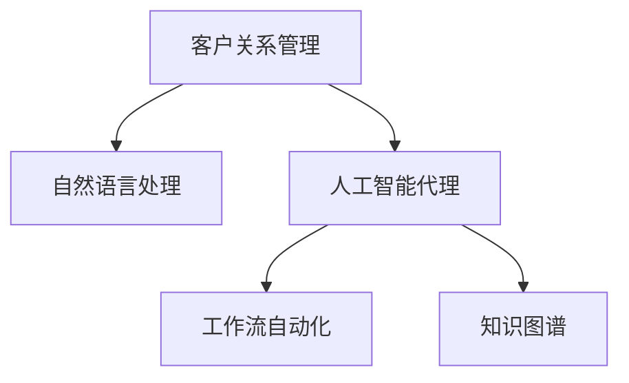

                 

# AI人工智能代理工作流AI Agent WorkFlow：智能代理在CRM客户管理中的应用

> 关键词：人工智能代理,客户关系管理,工作流自动化,客户管理,智能客服,数据驱动,机器学习,CRM系统

## 1. 背景介绍

### 1.1 问题由来
在数字化转型的浪潮中，企业对客户管理的依赖日益加深。如何提高客户管理效率，优化客户体验，成为企业追求的重要目标。传统的客户管理流程繁琐，涉及人工录入、沟通、跟进等多个环节，存在效率低、信息分散等问题。

人工智能代理（AI Agent）的出现，为优化客户管理流程提供了新的路径。AI Agent通过自然语言处理（NLP）、机器学习（ML）等技术，能够自动完成客户咨询、服务、管理等任务，大幅度提升企业客户管理的智能化水平。

### 1.2 问题核心关键点
AI Agent在客户管理中的应用，主要关注以下几个关键点：

- **自动化与智能化**：通过AI Agent，实现客户管理流程的自动化，提升效率。
- **多渠道支持**：AI Agent支持多种沟通渠道，包括电话、邮件、社交媒体等，提供无缝的客户服务体验。
- **个性化推荐**：根据客户行为和历史数据，提供个性化的产品推荐和服务。
- **数据驱动决策**：通过分析客户数据，洞察客户需求，制定更加精准的市场策略。
- **集成与协同**：AI Agent可以与CRM系统无缝集成，优化客户数据的收集和利用。

## 2. 核心概念与联系

### 2.1 核心概念概述

为了更好地理解AI Agent在CRM客户管理中的应用，首先需要明确几个核心概念：

- **客户关系管理（CRM）**：通过信息收集、分析和管理，提升客户满意度和忠诚度，优化企业资源配置，提高销售效率。
- **自然语言处理（NLP）**：使计算机能够理解、解释和生成自然语言，支持智能客服、聊天机器人等功能。
- **人工智能代理（AI Agent）**：基于NLP、ML等技术，自动完成客户服务、咨询、管理等任务，提升客户管理效率。
- **工作流自动化**：通过技术手段，自动执行和管理业务流程，减少人工干预，提升效率和精度。
- **知识图谱**：利用图结构化表示知识，支持复杂的推理和查询，提升决策支持能力。

这些概念之间的逻辑关系可以通过以下Mermaid流程图来展示：



这个流程图展示了AI Agent在CRM客户管理中的应用框架：

1. **客户关系管理**：作为AI Agent的基础数据来源，提供客户的基本信息和交互历史。
2. **自然语言处理**：使AI Agent能够理解客户的自然语言输入，提供智能化的交流体验。
3. **人工智能代理**：通过自动化执行客户管理任务，提高效率和精度。
4. **工作流自动化**：通过技术手段优化业务流程，提升整体运营效率。
5. **知识图谱**：为AI Agent提供知识库支持，增强决策能力。

## 3. 核心算法原理 & 具体操作步骤
### 3.1 算法原理概述

AI Agent在CRM客户管理中的应用，主要基于以下几个算法原理：

- **自然语言处理（NLP）**：通过词向量嵌入、语言模型等技术，使计算机能够理解自然语言输入，生成自然语言输出。
- **机器学习（ML）**：通过监督学习、无监督学习、强化学习等技术，使AI Agent能够从历史数据中学习，优化自身行为。
- **知识图谱**：通过图结构化的方式，表示和组织知识，支持复杂的推理和查询。
- **工作流自动化**：通过工作流引擎、任务调度等技术，自动执行和管理业务流程。
- **个性化推荐**：通过协同过滤、内容推荐等技术，提供个性化的产品和服务。

### 3.2 算法步骤详解

AI Agent在CRM客户管理中的应用步骤主要包括：

**Step 1: 数据收集与预处理**
- 从CRM系统、客服系统、社交媒体等渠道收集客户数据，包括基本信息、历史交互记录、行为数据等。
- 对数据进行清洗和格式化，去除噪声和重复数据。

**Step 2: 模型训练**
- 使用NLP技术，将客户数据转换为模型可接受的格式，如词向量、文本序列等。
- 通过监督学习、无监督学习、强化学习等技术，训练AI Agent模型。

**Step 3: 集成与部署**
- 将训练好的AI Agent模型集成到CRM系统，实现自动化任务执行。
- 部署AI Agent到多种沟通渠道，如电话、邮件、社交媒体等，提供无缝的客户服务体验。

**Step 4: 监控与优化**
- 通过监控AI Agent的执行情况，收集用户反馈和系统日志。
- 根据监控结果，对AI Agent进行优化和迭代，提升性能和用户体验。

### 3.3 算法优缺点

AI Agent在CRM客户管理中的应用，具有以下优点：

- **效率提升**：通过自动化处理客户服务、咨询、管理等任务，大幅提升效率。
- **成本节约**：减少人工客服的投入，降低运营成本。
- **服务个性化**：根据客户行为和历史数据，提供个性化的服务体验。
- **数据驱动决策**：通过分析客户数据，制定更加精准的市场策略。

同时，也存在一些局限性：

- **数据隐私**：客户数据的收集和处理可能涉及隐私问题，需要严格遵守相关法律法规。
- **模型复杂度**：复杂的模型可能需要大量的计算资源和时间，存在一定的开发和部署成本。
- **依赖高质量数据**：模型的性能高度依赖于数据的质量和量，需要持续维护和优化数据源。

## 4. 数学模型和公式 & 详细讲解 & 举例说明

### 4.1 数学模型构建

AI Agent在CRM客户管理中的应用，可以通过以下数学模型进行描述：

- **输入数据**：$X$，包括客户基本信息、历史交互记录、行为数据等。
- **输出数据**：$Y$，包括客户服务响应、产品推荐等。
- **模型参数**：$\theta$，包括词向量、语言模型参数、推荐算法参数等。
- **损失函数**：$L$，衡量模型输出与真实标签之间的差异。

### 4.2 公式推导过程

以文本分类任务为例，AI Agent的数学模型推导如下：

- **输入数据**：$X=\{x_1, x_2, ..., x_n\}$，其中$x_i$表示第$i$个客户的数据。
- **标签数据**：$Y=\{y_1, y_2, ..., y_n\}$，其中$y_i$表示第$i$个客户的分类标签。
- **词向量嵌入**：$E_W=\{w_1, w_2, ..., w_n\}$，将文本转换为向量表示。
- **语言模型**：$M_L$，基于词向量预测分类标签。
- **推荐算法**：$M_R$，根据客户行为预测推荐结果。

### 4.3 案例分析与讲解

假设AI Agent需要处理一个电商平台的客户服务任务。客户输入：“我想买一双鞋子”，AI Agent需要判断客户的意图，推荐合适的商品，并进行回复。

- **输入处理**：将客户输入转换为词向量，如：$\vec{x}=[鞋子, 买, 一双]$。
- **意图分类**：通过语言模型$M_L$，预测客户的意图标签，如：$y=\text{意图}\text{-}购买鞋子$。
- **商品推荐**：根据意图和客户行为数据，使用推荐算法$M_R$，从商品库中筛选出推荐商品，如：$[鞋子A, 鞋子B, 鞋子C]$。
- **回复生成**：生成自然语言回复，如：“根据您的需求，推荐以下鞋子：鞋子A、鞋子B、鞋子C”。

## 5. 项目实践：代码实例和详细解释说明
### 5.1 开发环境搭建

在进行AI Agent开发前，首先需要搭建开发环境。以下是使用Python进行TensorFlow开发的典型环境配置流程：

1. 安装Anaconda：从官网下载并安装Anaconda，用于创建独立的Python环境。

2. 创建并激活虚拟环境：
```bash
conda create -n tf-env python=3.8 
conda activate tf-env
```

3. 安装TensorFlow：根据CUDA版本，从官网获取对应的安装命令。例如：
```bash
conda install tensorflow -c pytorch -c conda-forge
```

4. 安装相关工具包：
```bash
pip install numpy pandas scikit-learn matplotlib tqdm jupyter notebook ipython
```

完成上述步骤后，即可在`tf-env`环境中开始AI Agent的开发。

### 5.2 源代码详细实现

以下是一个使用TensorFlow进行文本分类的AI Agent示例代码：

```python
import tensorflow as tf
from tensorflow.keras import layers, models
from sklearn.model_selection import train_test_split
from sklearn.metrics import accuracy_score

# 数据预处理
def preprocess_data(data, seq_len):
    X = []
    Y = []
    for text, label in data:
        tokenized = tokenizer.texts_to_sequences(text)
        X.append(tokenized[:seq_len])
        Y.append(label)
    X = tf.keras.preprocessing.sequence.pad_sequences(X, maxlen=seq_len, padding='post')
    Y = tf.keras.utils.to_categorical(Y)
    return X, Y

# 定义模型
def create_model(seq_len, num_classes):
    model = models.Sequential([
        layers.Embedding(input_dim=vocab_size, output_dim=embedding_dim, input_length=seq_len),
        layers.Conv1D(128, 5, activation='relu'),
        layers.MaxPooling1D(pool_size=4),
        layers.Conv1D(128, 5, activation='relu'),
        layers.MaxPooling1D(pool_size=4),
        layers.Flatten(),
        layers.Dense(128, activation='relu'),
        layers.Dense(num_classes, activation='softmax')
    ])
    model.compile(loss='categorical_crossentropy', optimizer='adam', metrics=['accuracy'])
    return model

# 加载数据
data = load_data()
X_train, X_test, Y_train, Y_test = train_test_split(data['texts'], data['labels'], test_size=0.2)

# 数据预处理
seq_len = 100
X_train, Y_train = preprocess_data(X_train, seq_len)
X_test, Y_test = preprocess_data(X_test, seq_len)

# 训练模型
model = create_model(seq_len, num_classes)
model.fit(X_train, Y_train, epochs=10, batch_size=32, validation_data=(X_test, Y_test))

# 评估模型
Y_pred = model.predict(X_test)
Y_pred = tf.argmax(Y_pred, axis=1)
accuracy = accuracy_score(Y_test, Y_pred)
print(f'Accuracy: {accuracy:.2f}')
```

### 5.3 代码解读与分析

让我们再详细解读一下关键代码的实现细节：

**preprocess_data函数**：
- 对文本数据进行分词和填充，转换为模型可接受的输入格式。

**create_model函数**：
- 定义模型结构，包括嵌入层、卷积层、池化层、全连接层等。
- 设置损失函数、优化器和评估指标。

**训练模型**：
- 对模型进行训练，设置迭代轮数、批次大小和验证集。
- 在每个epoch结束时，评估模型在测试集上的准确率。

**评估模型**：
- 使用测试集数据进行模型预测，计算准确率。

可以看到，TensorFlow提供了强大的API支持，使得模型开发和训练过程相对简洁高效。开发者可以将更多精力放在数据处理、模型优化等高层逻辑上，而不必过多关注底层实现细节。

## 6. 实际应用场景
### 6.1 智能客服系统

基于AI Agent的智能客服系统，可以广泛应用于各类企业的客户服务场景。传统客服系统依赖人工，响应速度慢、效率低、成本高。通过部署AI Agent，可以24小时不间断地提供客户服务，减少人工客服的工作负担，提高服务效率和客户满意度。

在技术实现上，可以收集企业的历史客服对话记录，训练AI Agent模型，使其能够理解和处理自然语言输入，自动回答常见问题。对于复杂问题，可以调用API或进一步与人工客服进行交互，提供高效稳定的客户支持。

### 6.2 电商个性化推荐

电商平台通过AI Agent，可以实现基于用户行为数据的个性化推荐。AI Agent可以分析用户浏览历史、购买记录等数据，预测用户兴趣，推荐相关商品。通过实时调整推荐策略，提高转化率和用户满意度。

在实际应用中，可以使用协同过滤、基于内容的推荐算法等技术，构建AI Agent推荐模型。通过不断优化模型参数和数据，提升推荐效果。

### 6.3 医疗健康咨询

医疗健康领域对服务的专业性和准确性要求较高，传统客服系统难以满足。通过部署AI Agent，可以提供24小时健康咨询，回答常见健康问题，提供初步诊断建议。

在技术实现上，可以收集医生的诊断案例和健康知识库，训练AI Agent模型，使其能够理解自然语言输入，提供科学的健康建议。对于复杂问题，可以调用医生资源进行进一步诊断和治疗。

### 6.4 未来应用展望

随着AI Agent技术的不断进步，其在CRM客户管理中的应用前景将更加广阔。未来，AI Agent将能够提供更加智能、个性化、全天候的客户服务，帮助企业提升运营效率和客户满意度。

在智慧医疗、智能教育、智慧城市等领域，AI Agent将发挥重要作用，为各行各业带来深远的影响。随着技术的不断迭代和优化，AI Agent将在更多场景中实现落地应用，为人类生活带来更多的便利和福祉。

## 7. 工具和资源推荐
### 7.1 学习资源推荐

为了帮助开发者系统掌握AI Agent在CRM客户管理中的应用，这里推荐一些优质的学习资源：

1. **TensorFlow官方文档**：提供丰富的教程和样例代码，帮助开发者快速上手TensorFlow。
2. **自然语言处理（NLP）课程**：如斯坦福大学的CS224N《深度学习自然语言处理》课程，系统介绍NLP的基本概念和技术。
3. **机器学习（ML）课程**：如Coursera上的《机器学习》课程，涵盖监督学习、无监督学习、强化学习等算法。
4. **深度学习（DL）书籍**：如《深度学习》（Ian Goodfellow等著），深入浅出地介绍深度学习的理论和实践。
5. **Keras官方文档**：TensorFlow的高级API，提供简单易用的界面，方便开发者快速构建模型。

通过对这些资源的学习实践，相信你一定能够快速掌握AI Agent在CRM客户管理中的应用，并用于解决实际的NLP问题。

### 7.2 开发工具推荐

高效的开发离不开优秀的工具支持。以下是几款用于AI Agent开发的常用工具：

1. **TensorFlow**：基于Python的开源深度学习框架，提供灵活的计算图和高效的自动微分功能。
2. **Keras**：TensorFlow的高层API，提供简单易用的模型构建和训练工具。
3. **PyTorch**：基于Python的深度学习框架，提供动态计算图和高效的模型优化功能。
4. **Jupyter Notebook**：提供交互式编程环境，方便开发者进行模型实验和调试。
5. **Google Colab**：免费的在线Jupyter Notebook环境，提供GPU/TPU算力支持，方便开发者进行模型实验。

合理利用这些工具，可以显著提升AI Agent开发效率，加快创新迭代的步伐。

### 7.3 相关论文推荐

AI Agent在CRM客户管理中的应用，是当前NLP和AI领域的研究热点。以下是几篇奠基性的相关论文，推荐阅读：

1. **《Dialogue with Attention Models》**：提出了注意力机制在对话系统中的应用，提升对话系统的性能和效果。
2. **《Sequence to Sequence Learning with Neural Networks》**：介绍了序列到序列模型在机器翻译中的应用，为AI Agent的生成能力提供了理论支持。
3. **《Machine Learning in Healthcare》**：讨论了机器学习在医疗健康领域的应用，介绍了AI Agent在医疗咨询中的应用。
4. **《Reinforcement Learning for Smart Decision Making》**：介绍了强化学习在智能决策中的应用，为AI Agent的优化能力提供了新思路。
5. **《Customer Relationship Management with AI》**：讨论了AI Agent在CRM系统中的应用，介绍了其在客户管理中的实际效果和挑战。

这些论文代表了大规模语言模型微调技术的发展脉络。通过学习这些前沿成果，可以帮助研究者把握学科前进方向，激发更多的创新灵感。

## 8. 总结：未来发展趋势与挑战

### 8.1 总结

本文对AI Agent在CRM客户管理中的应用进行了全面系统的介绍。首先阐述了AI Agent在客户管理中的应用背景和意义，明确了AI Agent在客户管理中的应用价值。其次，从原理到实践，详细讲解了AI Agent的数学模型和算法步骤，给出了AI Agent开发和应用的具体实例。同时，本文还广泛探讨了AI Agent在智能客服、电商推荐、医疗咨询等多个行业领域的应用前景，展示了AI Agent技术的广阔应用空间。此外，本文精选了AI Agent技术的各类学习资源，力求为开发者提供全方位的技术指引。

通过本文的系统梳理，可以看到，AI Agent技术在CRM客户管理中的应用，已经具备了良好的发展基础和广阔的应用前景。随着技术的不断进步和应用场景的不断拓展，相信AI Agent将在更多领域带来深远的影响，为各行各业带来全新的变革。

### 8.2 未来发展趋势

展望未来，AI Agent在CRM客户管理中的应用将呈现以下几个发展趋势：

1. **自动化水平提升**：随着AI技术的不断进步，AI Agent的自动化水平将进一步提升，能够处理更加复杂和多样的客户需求。
2. **个性化推荐优化**：基于AI Agent的推荐系统将更加智能，能够根据用户的历史行为和实时数据，提供更加精准的个性化推荐。
3. **多渠道集成**：AI Agent将支持更多的沟通渠道，如电话、邮件、社交媒体等，提供无缝的客户服务体验。
4. **情感分析增强**：通过情感分析技术，AI Agent将能够更好地理解客户的情绪和需求，提供更加人性化的服务。
5. **多模态融合**：AI Agent将融合视觉、语音、文本等多种模态信息，提供更加全面和准确的客户服务。

以上趋势凸显了AI Agent在CRM客户管理中的应用前景。这些方向的探索发展，必将进一步提升AI Agent系统的性能和用户体验，推动企业客户管理的智能化进程。

### 8.3 面临的挑战

尽管AI Agent在CRM客户管理中的应用取得了显著成效，但在迈向更加智能化、普适化应用的过程中，仍然面临诸多挑战：

1. **数据隐私保护**：客户数据的收集和处理可能涉及隐私问题，需要严格遵守相关法律法规。
2. **模型复杂度**：复杂的模型可能需要大量的计算资源和时间，存在一定的开发和部署成本。
3. **依赖高质量数据**：模型的性能高度依赖于数据的质量和量，需要持续维护和优化数据源。
4. **用户接受度**：部分用户可能对AI Agent的输出产生质疑，需要加强用户教育和体验优化。
5. **系统稳定性**：AI Agent的系统稳定性需要不断提升，避免因错误输出而影响客户体验。

正视AI Agent在CRM客户管理中面临的这些挑战，积极应对并寻求突破，将有助于AI Agent技术的持续发展和优化。相信随着技术的发展和应用的深入，AI Agent必将在CRM客户管理中发挥更大的作用。

### 8.4 研究展望

未来，AI Agent在CRM客户管理中的应用将朝着以下几个方向进行深入研究：

1. **数据隐私保护**：研究如何在保证客户数据隐私的前提下，提高AI Agent的性能和效果。
2. **模型优化与压缩**：研究如何通过模型优化和压缩技术，降低AI Agent的计算资源需求，提升推理效率。
3. **跨模态融合**：研究如何融合视觉、语音、文本等多种模态信息，提升AI Agent的感知能力和服务质量。
4. **多任务学习**：研究如何在同一模型中同时完成多个任务，提升AI Agent的系统效率和用户体验。
5. **鲁棒性和可解释性**：研究如何提升AI Agent的鲁棒性和可解释性，增强其可信度和透明度。

这些研究方向将进一步推动AI Agent在CRM客户管理中的应用，提升企业的运营效率和客户满意度。随着技术的不断进步，AI Agent必将在更多领域实现落地应用，为人类生产和生活带来更多便利。

## 9. 附录：常见问题与解答

**Q1: 什么是AI Agent?**

A: AI Agent是利用人工智能技术，自动完成客户服务、咨询、管理等任务的系统。它能够理解自然语言输入，提供个性化的服务，优化客户管理流程。

**Q2: 如何训练AI Agent模型?**

A: 训练AI Agent模型需要以下步骤：
1. 收集和预处理数据，转换为模型可接受的格式。
2. 设计模型结构，包括嵌入层、卷积层、全连接层等。
3. 选择损失函数、优化器和评估指标。
4. 使用训练数据进行模型训练，调整模型参数。
5. 在验证集上评估模型性能，选择最优模型。

**Q3: AI Agent在CRM客户管理中的应用有哪些?**

A: AI Agent在CRM客户管理中的应用包括：
1. 智能客服系统：自动回答客户咨询，提供24小时不间断的服务。
2. 电商个性化推荐：根据客户行为，推荐相关商品，提高转化率。
3. 医疗健康咨询：提供健康建议，支持初步诊断。
4. 多渠道集成：支持电话、邮件、社交媒体等多种沟通渠道。
5. 情感分析：理解客户情绪，提供更加人性化的服务。

**Q4: 如何提高AI Agent的鲁棒性和可解释性?**

A: 提高AI Agent的鲁棒性和可解释性需要以下方法：
1. 使用对抗训练，增加模型鲁棒性。
2. 引入解释模型，提供决策解释。
3. 融合多种数据源，提升模型泛化能力。
4. 优化模型结构，减少过拟合风险。

**Q5: AI Agent在CRM客户管理中面临哪些挑战?**

A: AI Agent在CRM客户管理中面临以下挑战：
1. 数据隐私保护：需要严格遵守相关法律法规。
2. 模型复杂度：需要大量的计算资源和时间。
3. 依赖高质量数据：需要持续维护和优化数据源。
4. 用户接受度：需要加强用户教育和体验优化。
5. 系统稳定性：需要不断提升系统稳定性。

这些挑战需要通过技术进步和应用优化来逐步克服，进一步提升AI Agent在CRM客户管理中的应用效果。

---

作者：禅与计算机程序设计艺术 / Zen and the Art of Computer Programming

