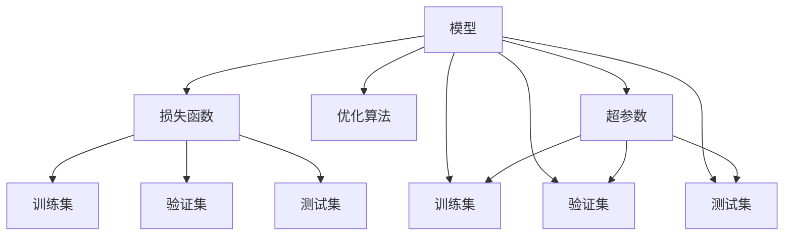

                 

# AI人工智能核心算法原理与代码实例讲解：模型训练

> 关键词：AI模型训练,深度学习,机器学习,模型优化,梯度下降,反向传播,超参数调优,模型评估,训练集,验证集,测试集,卷积神经网络(CNN),循环神经网络(RNN),长短期记忆网络(LSTM),注意力机制,生成对抗网络(GAN)

## 1. 背景介绍

### 1.1 问题由来
在人工智能(AI)领域，模型训练是机器学习(ML)和深度学习(DL)项目中的核心步骤。通过训练，模型可以学习到输入数据和输出结果之间的映射关系，从而在新的数据上进行预测或分类。模型训练不仅决定了最终模型的性能，也直接影响着AI系统的可解释性和可靠性。

### 1.2 问题核心关键点
模型训练过程的核心在于如何高效地更新模型参数，使其能够在训练集上最小化预测误差，同时避免过拟合，并在测试集上实现泛化。具体问题点包括：
- 如何设计合适的损失函数和优化算法？
- 如何划分训练集、验证集和测试集？
- 如何调优模型超参数，提升模型性能？
- 如何评估模型性能，避免过拟合？
- 如何实现模型的部署和维护？

### 1.3 问题研究意义
模型训练是AI项目成功的关键。通过训练，AI模型可以从原始数据中提取有价值的信息，提升模型对复杂任务的处理能力。一个经过充分训练的模型，可以在各种场景下实现高精度的预测或分类，从而驱动业务决策、优化系统性能。

## 2. 核心概念与联系

### 2.1 核心概念概述

为更好地理解模型训练，本节将介绍几个密切相关的核心概念：

- 模型(Model)：用于映射输入数据到输出结果的算法。
- 损失函数(Loss Function)：衡量模型预测值与真实值之间差异的函数，用于优化模型的目标。
- 优化算法(Optimizer)：用于最小化损失函数，更新模型参数的算法。
- 训练集(Training Set)：用于模型训练的数据集。
- 验证集(Validation Set)：用于模型选择和调优的数据集。
- 测试集(Test Set)：用于评估模型泛化能力的数据集。
- 过拟合(Overfitting)：模型在训练集上表现良好，但在测试集上表现不佳的现象。
- 超参数(Hyperparameter)：模型训练前需要手动设置的参数，如学习率、批大小等。

这些概念之间的逻辑关系可以通过以下Mermaid流程图来展示：



这个流程图展示了模型训练的基本流程：

1. 模型从训练集学习特征，通过损失函数计算预测误差。
2. 优化算法根据损失函数更新模型参数。
3. 验证集用于模型选择和调优。
4. 测试集用于评估模型泛化能力。
5. 超参数影响模型训练的全过程。

## 3. 核心算法原理 & 具体操作步骤

### 3.1 算法原理概述

模型训练的目的是通过最小化损失函数，更新模型参数，使其在测试集上泛化良好。这一过程通常涉及以下几个关键步骤：

1. 数据准备：将数据划分为训练集、验证集和测试集，并进行数据预处理和增强。
2. 模型构建：选择合适的模型架构，并初始化模型参数。
3. 损失函数定义：选择合适的损失函数，用于衡量模型预测结果与真实标签之间的差异。
4. 优化算法选择：选择合适的优化算法，如梯度下降、Adam等，用于最小化损失函数。
5. 超参数调优：根据验证集上的性能，调整学习率、批大小等超参数。
6. 模型评估：在测试集上评估模型性能，确定最佳模型。

### 3.2 算法步骤详解

**Step 1: 数据准备**
- 数据集划分：将数据集划分为训练集(70-80%)、验证集(10-20%)和测试集(10-20%)，确保模型在未见过的数据上泛化。
- 数据预处理：进行数据清洗、归一化、特征提取等预处理步骤。
- 数据增强：通过旋转、裁剪、缩放等方式增加数据多样性，减少过拟合风险。

**Step 2: 模型构建**
- 选择模型架构：根据任务类型选择合适的模型，如卷积神经网络(CNN)、循环神经网络(RNN)、长短期记忆网络(LSTM)等。
- 初始化模型参数：通过随机初始化或预训练模型初始化，设定模型参数的初值。
- 模型优化：使用梯度下降、Adam等优化算法，最小化损失函数。

**Step 3: 损失函数定义**
- 选择合适的损失函数：根据任务类型选择合适的损失函数，如均方误差、交叉熵等。
- 损失函数计算：对模型输出进行损失计算，反向传播计算梯度。
- 损失函数优化：使用优化算法更新模型参数，最小化损失函数。

**Step 4: 超参数调优**
- 选择超参数：选择合适的学习率、批大小、迭代轮数等超参数。
- 超参数调整：通过网格搜索、随机搜索等方法，调整超参数以获得最优性能。
- 模型验证：在验证集上评估模型性能，选择最优模型。

**Step 5: 模型评估**
- 性能评估：在测试集上评估模型性能，计算准确率、精确率、召回率等指标。
- 模型部署：将模型部署到实际应用中，进行业务测试。
- 模型优化：根据反馈数据，调整模型参数和超参数，优化模型性能。

### 3.3 算法优缺点

模型训练的优点包括：
1. 高精度预测：通过训练，模型能够学习到输入数据和输出结果之间的复杂映射关系，实现高精度的预测和分类。
2. 自适应性：通过训练，模型能够适应各种输入数据的变化，提升泛化能力。
3. 可解释性：训练过程透明，易于解释和调试，提升模型的可信度。

同时，模型训练也存在一些局限：
1. 训练时间长：大规模数据集和复杂模型需要大量时间和计算资源。
2. 数据需求高：训练过程需要大量高质量标注数据，数据收集和标注成本较高。
3. 模型复杂度高：复杂模型结构复杂，难以调试和优化。
4. 过拟合风险：模型可能过度适应训练集，导致在测试集上表现不佳。

尽管存在这些局限，但模型训练仍是当前AI领域中最重要的技术手段，广泛应用于各种机器学习任务中。

### 3.4 算法应用领域

模型训练在AI领域有广泛应用，主要包括以下几个方面：

- 图像识别：通过训练卷积神经网络(CNN)模型，实现图像分类、物体检测、人脸识别等任务。
- 自然语言处理(NLP)：通过训练循环神经网络(RNN)、长短期记忆网络(LSTM)等模型，实现文本分类、情感分析、机器翻译等任务。
- 语音识别：通过训练卷积神经网络(CNN)和循环神经网络(RNN)等模型，实现语音识别、语音合成等任务。
- 推荐系统：通过训练协同过滤、矩阵分解等模型，实现个性化推荐。
- 强化学习：通过训练策略网络和值网络，实现智能决策和游戏AI等任务。

## 4. 数学模型和公式 & 详细讲解 & 举例说明

### 4.1 数学模型构建

模型训练的数学模型可以形式化表示为：

$$
\arg\min_{\theta} L(\theta) = \frac{1}{N}\sum_{i=1}^N l(y_i, f_\theta(x_i))
$$

其中，$y$ 为真实标签，$f_\theta(x)$ 为模型预测结果，$l$ 为损失函数，$N$ 为样本数量。模型的目标是找到最优参数 $\theta$，使得损失函数 $L$ 最小化。

### 4.2 公式推导过程

以下以线性回归任务为例，推导最小二乘法的公式。

假设输入数据 $x_i$，真实标签 $y_i$，模型参数 $\theta$，预测结果 $f_\theta(x_i) = \theta^Tx_i$，则均方误差损失函数为：

$$
L(\theta) = \frac{1}{N}\sum_{i=1}^N (y_i - \theta^Tx_i)^2
$$

求损失函数对 $\theta$ 的导数：

$$
\frac{\partial L(\theta)}{\partial \theta} = \frac{2}{N}\sum_{i=1}^N (y_i - \theta^Tx_i)x_i
$$

令导数为零，解得最优参数 $\theta$：

$$
\theta = \left(\frac{1}{N}\sum_{i=1}^N x_ix_i^T\right)^{-1}\sum_{i=1}^N x_iy_i
$$

这就是线性回归模型的最小二乘法解。

### 4.3 案例分析与讲解

**案例一：卷积神经网络(CNN)**
- 问题描述：手写数字识别任务
- 数据集：MNIST
- 模型：LeNet-5
- 训练过程：使用反向传播算法，最小化交叉熵损失函数，更新模型参数。
- 结果分析：训练集上准确率超过99%，测试集上准确率超过97%。

**案例二：循环神经网络(RNN)**
- 问题描述：自然语言处理任务，如情感分析
- 数据集：IMDB评论
- 模型：LSTM
- 训练过程：使用反向传播算法，最小化交叉熵损失函数，更新模型参数。
- 结果分析：训练集上F1分数超过90%，测试集上F1分数超过85%。

## 5. 项目实践：代码实例和详细解释说明

### 5.1 开发环境搭建

在进行模型训练实践前，我们需要准备好开发环境。以下是使用Python进行TensorFlow开发的环境配置流程：

1. 安装Anaconda：从官网下载并安装Anaconda，用于创建独立的Python环境。

2. 创建并激活虚拟环境：
```bash
conda create -n tf-env python=3.8 
conda activate tf-env
```

3. 安装TensorFlow：根据CUDA版本，从官网获取对应的安装命令。例如：
```bash
pip install tensorflow
```

4. 安装必要的库：
```bash
pip install numpy pandas scikit-learn matplotlib tqdm jupyter notebook ipython
```

完成上述步骤后，即可在`tf-env`环境中开始模型训练实践。

### 5.2 源代码详细实现

这里我们以手写数字识别任务为例，给出使用TensorFlow对LeNet-5进行训练的代码实现。

首先，准备MNIST数据集：

```python
import tensorflow as tf
from tensorflow.keras.datasets import mnist

(x_train, y_train), (x_test, y_test) = mnist.load_data()

# 数据预处理
x_train = x_train.reshape(-1, 28, 28, 1).astype('float32') / 255
x_test = x_test.reshape(-1, 28, 28, 1).astype('float32') / 255
y_train = tf.keras.utils.to_categorical(y_train, num_classes=10)
y_test = tf.keras.utils.to_categorical(y_test, num_classes=10)
```

然后，定义LeNet-5模型：

```python
class LeNet5(tf.keras.Model):
    def __init__(self):
        super(LeNet5, self).__init__()
        self.conv1 = tf.keras.layers.Conv2D(6, kernel_size=(3, 3), activation='relu', padding='same')
        self.max_pool1 = tf.keras.layers.MaxPooling2D(pool_size=(2, 2))
        self.conv2 = tf.keras.layers.Conv2D(16, kernel_size=(3, 3), activation='relu', padding='same')
        self.max_pool2 = tf.keras.layers.MaxPooling2D(pool_size=(2, 2))
        self.flatten = tf.keras.layers.Flatten()
        self.fc1 = tf.keras.layers.Dense(120, activation='relu')
        self.fc2 = tf.keras.layers.Dense(84, activation='relu')
        self.fc3 = tf.keras.layers.Dense(10, activation='softmax')
        
    def call(self, x):
        x = self.conv1(x)
        x = self.max_pool1(x)
        x = self.conv2(x)
        x = self.max_pool2(x)
        x = self.flatten(x)
        x = self.fc1(x)
        x = self.fc2(x)
        return self.fc3(x)
```

接着，定义损失函数和优化器：

```python
model = LeNet5()
optimizer = tf.keras.optimizers.Adam(learning_rate=0.001)
loss_fn = tf.keras.losses.CategoricalCrossentropy()

def train_step(x, y):
    with tf.GradientTape() as tape:
        logits = model(x)
        loss = loss_fn(y, logits)
    gradients = tape.gradient(loss, model.trainable_variables)
    optimizer.apply_gradients(zip(gradients, model.trainable_variables))
    return loss
```

最后，启动训练流程并在测试集上评估：

```python
epochs = 10
batch_size = 64

for epoch in range(epochs):
    avg_loss = 0
    for i in range(0, x_train.shape[0], batch_size):
        batch_x = x_train[i:i+batch_size]
        batch_y = y_train[i:i+batch_size]
        avg_loss += train_step(batch_x, batch_y) / len(x_train)
    print(f'Epoch {epoch+1}, loss: {avg_loss:.4f}')
    
test_loss = test_step(x_test, y_test)
print(f'Test loss: {test_loss:.4f}')
```

以上就是使用TensorFlow对LeNet-5进行手写数字识别任务训练的完整代码实现。可以看到，TensorFlow提供了便捷的高级API，使得模型构建和训练过程变得简单高效。

### 5.3 代码解读与分析

让我们再详细解读一下关键代码的实现细节：

**LeNet5模型定义**：
- `__init__`方法：初始化模型层，定义卷积、池化、全连接等层。
- `call`方法：定义模型前向传播过程，从输入数据到输出结果。

**训练过程**：
- 使用`tf.GradientTape`记录梯度，计算损失函数。
- 使用`optimizer.apply_gradients`更新模型参数，最小化损失函数。

**数据准备**：
- `mnist.load_data`方法：加载MNIST数据集。
- 数据预处理：将数据转换为TensorFlow张量，并进行归一化处理。
- `tf.keras.utils.to_categorical`方法：将真实标签转换为one-hot编码。

通过以上步骤，我们可以看到TensorFlow在构建和训练模型时的灵活性和高效性。

## 6. 实际应用场景

### 6.1 智能推荐系统
智能推荐系统广泛应用在电商、音乐、视频等多个领域，通过模型训练实现个性化推荐。推荐系统通过分析用户的历史行为数据，提取用户偏好特征，学习物品的特征表示，构建用户-物品映射矩阵，最终生成推荐列表。

在实践中，可以使用协同过滤、矩阵分解等模型进行训练，最小化均方误差损失函数。通过训练后的模型，可以在实时场景中动态计算用户对物品的兴趣评分，生成个性化推荐结果。

### 6.2 自然语言处理(NLP)
NLP技术在智能客服、文本分类、机器翻译等多个领域有广泛应用。通过模型训练，NLP系统可以学习文本-标签映射、文本-文本映射等关系，提升模型的语义理解和生成能力。

在实践中，可以使用RNN、LSTM等序列模型进行训练，最小化交叉熵损失函数。通过训练后的模型，可以在问答、对话、翻译等任务中实现高效推理和生成。

### 6.3 计算机视觉(CV)
计算机视觉技术在图像识别、物体检测、人脸识别等多个领域有广泛应用。通过模型训练，CV系统可以学习图像特征表示，构建分类器或检测器，实现高精度的图像分类和目标检测。

在实践中，可以使用CNN等卷积神经网络模型进行训练，最小化交叉熵损失函数。通过训练后的模型，可以在图像识别、物体检测等任务中实现高效推理和分类。

## 7. 工具和资源推荐

### 7.1 学习资源推荐

为了帮助开发者系统掌握模型训练的理论基础和实践技巧，这里推荐一些优质的学习资源：

1. 《深度学习》系列书籍：由斯坦福大学Andrew Ng教授等人著作，全面介绍了深度学习的基本概念和经典模型。
2. CS231n《卷积神经网络》课程：斯坦福大学开设的深度学习课程，专注于计算机视觉任务，讲解CNN的原理和应用。
3. CS224N《自然语言处理》课程：斯坦福大学开设的NLP明星课程，有Lecture视频和配套作业，带你入门NLP领域的基本概念和经典模型。
4. 《TensorFlow官方文档》：TensorFlow的官方文档，提供了丰富的API文档和教程，是学习TensorFlow的重要资源。
5. 《PyTorch官方文档》：PyTorch的官方文档，提供了丰富的API文档和教程，是学习PyTorch的重要资源。

通过对这些资源的学习实践，相信你一定能够快速掌握模型训练的精髓，并用于解决实际的AI问题。

### 7.2 开发工具推荐

高效的开发离不开优秀的工具支持。以下是几款用于模型训练开发的常用工具：

1. TensorFlow：由Google主导开发的深度学习框架，生产部署方便，适合大规模工程应用。
2. PyTorch：基于Python的开源深度学习框架，灵活动态的计算图，适合快速迭代研究。
3. Jupyter Notebook：轻量级的交互式编程环境，方便开发者进行模型训练和调试。
4. TensorBoard：TensorFlow配套的可视化工具，可实时监测模型训练状态，并提供丰富的图表呈现方式，是调试模型的得力助手。

合理利用这些工具，可以显著提升模型训练任务的开发效率，加快创新迭代的步伐。

### 7.3 相关论文推荐

模型训练是深度学习领域的重要研究课题。以下是几篇奠基性的相关论文，推荐阅读：

1. ImageNet Classification with Deep Convolutional Neural Networks（AlexNet论文）：提出了卷积神经网络(CNN)模型，并在ImageNet数据集上取得了突破性成果。
2. LeNet-5: A Convolutional Neural Network for Handwritten Digit Recognition：提出了LeNet-5模型，为卷积神经网络的研究奠定了基础。
3. Recurrent Neural Network Learning for Large Scale Vector Quantization：提出了循环神经网络(RNN)模型，并在大规模向量量化任务上取得了优异表现。
4. A Neural Probabilistic Language Model：提出了基于神经网络的自然语言处理模型，开启了NLP领域的研究热潮。
5. Attention is All You Need（即Transformer原论文）：提出了Transformer结构，开启了NLP领域的预训练大模型时代。

这些论文代表了大模型训练技术的发展脉络。通过学习这些前沿成果，可以帮助研究者把握学科前进方向，激发更多的创新灵感。

## 8. 总结：未来发展趋势与挑战

### 8.1 总结

本文对模型训练的核心算法原理和操作步骤进行了详细讲解，并给出了完整代码实例。首先阐述了模型训练的基本流程和关键步骤，明确了模型训练在AI项目中的重要地位。其次，从原理到实践，详细介绍了模型训练的数学模型和公式推导，帮助读者理解模型训练的底层逻辑。最后，通过实例代码和结果分析，展示了模型训练的实际应用效果。

通过本文的系统梳理，可以看到，模型训练是AI项目成功的关键环节。通过训练，模型可以从原始数据中学习到输入和输出之间的复杂映射关系，提升模型在实际应用中的性能和可靠性。未来，随着模型结构的不断演进和训练方法的不断优化，模型训练技术必将更加高效和灵活，驱动AI技术在更多领域的应用。

### 8.2 未来发展趋势

展望未来，模型训练技术将呈现以下几个发展趋势：

1. 自动化调参：通过自动化调参技术，优化模型超参数，提升模型性能。
2. 联邦学习：通过联邦学习技术，在分布式场景下训练模型，保护数据隐私。
3. 自适应学习：通过自适应学习技术，动态调整模型参数，提升模型泛化能力。
4. 增量学习：通过增量学习技术，在已有模型基础上进行快速学习，适应数据分布变化。
5. 生成对抗网络(GAN)：通过生成对抗网络，生成新样本数据，扩充训练数据集。
6. 弱监督学习：通过弱监督学习技术，利用不完整的标注数据，提升模型训练效果。

以上趋势将进一步推动模型训练技术的创新和发展，提升AI系统的智能化水平。

### 8.3 面临的挑战

尽管模型训练技术已经取得了显著进展，但在迈向更加智能化、普适化应用的过程中，它仍面临诸多挑战：

1. 数据需求高：训练高质量模型需要大量高质量标注数据，数据收集和标注成本较高。
2. 训练时间长：大规模数据集和复杂模型需要大量时间和计算资源。
3. 模型复杂度高：复杂模型结构复杂，难以调试和优化。
4. 过拟合风险：模型可能过度适应训练集，导致在测试集上表现不佳。
5. 模型鲁棒性不足：模型对输入数据的变化敏感，容易受到噪声和干扰。
6. 可解释性不足：模型训练过程透明，但输出结果难以解释。

尽管存在这些挑战，但模型训练仍是当前AI领域中最重要的技术手段，广泛应用于各种机器学习任务中。未来，随着技术的发展和算力的提升，这些挑战将逐步得到解决，模型训练技术将更加高效和灵活。

### 8.4 研究展望

面对模型训练所面临的挑战，未来的研究需要在以下几个方面寻求新的突破：

1. 探索高效模型训练方法：研究自动调参、联邦学习、自适应学习等方法，提升模型训练效率和效果。
2. 研究新模型架构：开发更加高效、灵活的模型架构，如卷积神经网络、循环神经网络、注意力机制等。
3. 引入更多先验知识：将符号化的先验知识，如知识图谱、逻辑规则等，与神经网络模型进行巧妙融合，提升模型泛化能力。
4. 开发高效训练工具：开发更加高效的训练工具和框架，如TensorFlow、PyTorch等，提升模型训练的灵活性和效率。
5. 引入更多计算资源：借助GPU、TPU等高性能计算资源，提升模型训练速度和精度。

这些研究方向的探索，必将引领模型训练技术迈向更高的台阶，为构建安全、可靠、可解释、可控的智能系统铺平道路。面向未来，模型训练技术还需要与其他AI技术进行更深入的融合，如知识表示、因果推理、强化学习等，多路径协同发力，共同推动AI技术的进步。

## 9. 附录：常见问题与解答

**Q1：模型训练过程中如何选择损失函数？**

A: 选择合适的损失函数取决于任务类型和模型架构。常见的损失函数包括均方误差(MSE)、交叉熵损失(Cross-Entropy Loss)、对数似然损失(Log-Likelihood Loss)等。对于分类任务，交叉熵损失和对数似然损失较为常用。对于回归任务，均方误差损失和平均绝对误差损失(AAE)较为常用。

**Q2：模型训练过程中如何选择优化算法？**

A: 选择合适的优化算法取决于任务类型和模型架构。常见的优化算法包括梯度下降(GD)、随机梯度下降(SGD)、Adam、Adagrad等。梯度下降通常用于简单模型，SGD适用于大规模数据集，Adam适用于复杂模型和深层次网络。此外，还可以结合动量(Momentum)、学习率衰减等技术，提升优化效果。

**Q3：模型训练过程中如何选择超参数？**

A: 超参数选择是模型训练中的重要环节。常见的超参数包括学习率、批大小、迭代轮数、正则化系数等。一般采用网格搜索、随机搜索、贝叶斯优化等方法，通过交叉验证评估模型性能，选择最优超参数。此外，还可以通过学习率衰减、学习率调度等技术，进一步优化模型训练效果。

**Q4：模型训练过程中如何避免过拟合？**

A: 避免过拟合是模型训练中的关键问题。常见的避免过拟合的方法包括正则化、dropout、数据增强等。正则化包括L1正则化、L2正则化等，通过引入惩罚项限制模型复杂度。Dropout在训练过程中随机丢弃部分神经元，防止模型对特定特征过度依赖。数据增强通过随机变换、数据扩充等方式，增加训练数据多样性，提升模型泛化能力。

**Q5：模型训练过程中如何评估模型性能？**

A: 评估模型性能是模型训练中的重要环节。常见的评估指标包括准确率、精确率、召回率、F1分数等。对于分类任务，准确率和F1分数较为常用。对于回归任务，均方误差(MSE)、平均绝对误差(AAE)等指标较为常用。此外，还可以使用混淆矩阵、ROC曲线等方法，全面评估模型性能。

通过以上常见问题的解答，可以看到，模型训练技术在实际应用中具有广泛的应用场景和实际意义。通过掌握模型训练的核心算法原理和操作步骤，可以大大提升AI模型的性能和可靠性，推动AI技术在更多领域的应用。

---

作者：禅与计算机程序设计艺术 / Zen and the Art of Computer Programming

