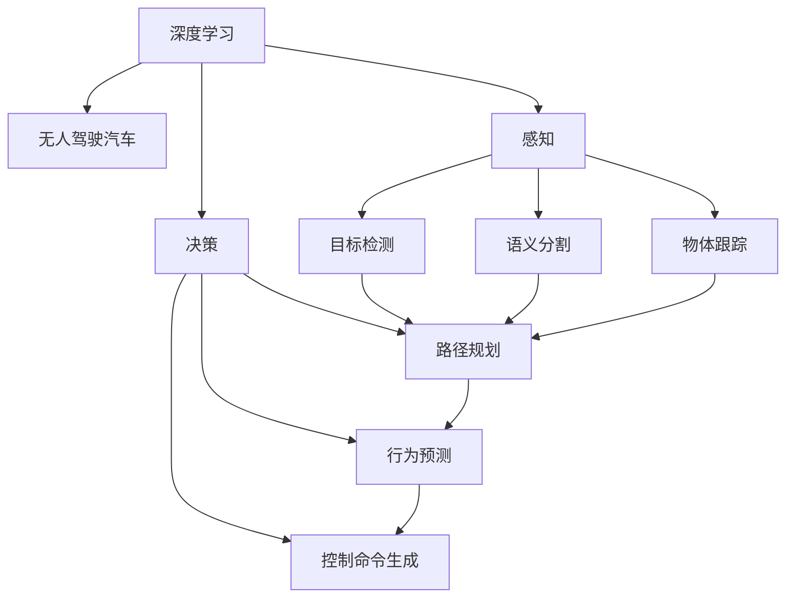

                 

## 1. 背景介绍

### 1.1 问题由来
人工智能(AI)技术近年来在各行各业的应用逐渐深入，特别是在交通领域，无人驾驶汽车的出现标志着汽车行业的重大变革。无人驾驶汽车依赖于一系列先进技术，包括深度学习、计算机视觉、高精度地图、车辆感知与决策等，其中深度学习算法在感知和决策中扮演了重要角色。本文将介绍基于深度学习的感知与决策算法，通过实际应用案例深入探讨其在无人驾驶汽车中的应用。

### 1.2 问题核心关键点
无人驾驶汽车的深度学习算法主要应用于感知和决策两个阶段。感知阶段主要涉及目标检测、语义分割、物体跟踪等任务，决策阶段则包括路径规划、行为预测、控制命令生成等。

- 感知阶段的核心目标是从原始传感器数据中提取道路环境信息，识别路标、行人、车辆等重要元素，为决策提供支持。
- 决策阶段则是在感知的基础上，结合车辆当前位置、速度、方向等动态信息，通过优化模型生成最优驾驶决策，控制汽车行驶。

此外，感知与决策之间相互关联，决策算法需要依靠感知算法提供的实时数据进行计算，而感知算法则需要决策算法的反馈信息进行不断优化。

### 1.3 问题研究意义
深度学习在无人驾驶汽车中的应用，不仅能够提升驾驶安全性和驾驶体验，还有助于缓解交通拥堵，减少环境污染。掌握深度学习在无人驾驶中的应用，对推动智能交通系统的发展，加速汽车自动化转型具有重要意义。

## 2. 核心概念与联系

### 2.1 核心概念概述

为更好地理解深度学习在无人驾驶汽车中的应用，本节将介绍几个核心概念：

- 深度学习(DL)：一种基于神经网络的学习方法，能够自动从大量数据中提取特征和模式，用于图像、语音、文本等多种数据的处理。
- 无人驾驶汽车(Autonomous Vehicles)：无需人工驾驶的智能汽车，通过传感器、计算机视觉、深度学习等技术，实现自动导航、避障、停车等功能。
- 感知(Perception)：指车辆对周围环境信息的获取和理解，包括目标检测、语义分割、物体跟踪等。
- 决策(Decision)：指在感知的基础上，结合车辆状态信息，优化生成最优行驶路径和控制命令的过程。
- 融合(Fusion)：指对不同传感器数据（如摄像头、雷达、激光雷达等）进行融合，提升环境感知的准确性和鲁棒性。

这些概念之间的逻辑关系可以通过以下Mermaid流程图来展示：



这个流程图展示了大语言模型的核心概念及其之间的关系：

1. 深度学习为无人驾驶提供了技术基础。
2. 感知和决策是无人驾驶的核心组件。
3. 感知阶段包括目标检测、语义分割、物体跟踪等任务。
4. 决策阶段包括路径规划、行为预测、控制命令生成等。
5. 融合指对不同传感器数据进行信息融合，提升感知准确性。

这些概念共同构成了无人驾驶汽车的核心技术框架，使得车辆能够实现自动导航、避障等智能功能。通过理解这些核心概念，我们可以更好地把握无人驾驶汽车的工作原理和优化方向。

## 3. 核心算法原理 & 具体操作步骤
### 3.1 算法原理概述

深度学习算法在无人驾驶汽车中的应用，主要分为感知和决策两个阶段。本节将分别介绍这两个阶段的算法原理和操作步骤。

### 3.2 算法步骤详解

#### 3.2.1 感知阶段

感知阶段的目标是从原始传感器数据中提取道路环境信息，识别路标、行人、车辆等重要元素。感知算法包括目标检测、语义分割、物体跟踪等任务。

- **目标检测**：通过深度学习算法（如Faster R-CNN、YOLO、SSD等）对摄像头拍摄的图像进行分析，检测出道路中的物体，并标注出其位置、大小等信息。目标检测算法通常使用卷积神经网络（CNN）结构，通过滑动窗口策略在图像上扫描，获取目标的特征图和边界框。

  

  *图1: 目标检测流程图*

- **语义分割**：对图像中的每个像素点进行分类，区分不同的物体和背景，例如道路、建筑、行人等。语义分割算法使用全卷积神经网络（FCN），将图像像素映射为不同的语义标签。

  

  *图2: 语义分割流程图*

- **物体跟踪**：在连续帧图像中，跟踪物体的运动轨迹。物体跟踪算法使用循环神经网络（RNN）或变种如LSTM，结合物体检测的结果，预测目标的下一帧位置。

  

  *图3: 物体跟踪流程图*

#### 3.2.2 决策阶段

决策阶段的核心任务是在感知的基础上，结合车辆当前位置、速度、方向等动态信息，优化生成最优行驶路径和控制命令。决策算法通常包括路径规划、行为预测、控制命令生成等任务。

- **路径规划**：通过深度学习算法（如A*、DQN、DDPG等）生成最优路径，避免障碍物，安全到达目的地。路径规划算法结合地图信息、传感器数据，生成从起点到终点的最短路径。

  

  *图4: 路径规划流程图*

- **行为预测**：通过深度学习算法（如LSTM、GRU等）预测未来行为，例如行人、车辆的速度和方向变化。行为预测算法结合历史数据，预测目标的下一步行为，提供决策依据。

  

  *图5: 行为预测流程图*

- **控制命令生成**：通过深度学习算法（如PPO、TD3等）生成控制命令，例如加速、制动、转向等。控制命令生成算法结合感知结果和决策结果，生成车辆的控制指令。

  

  *图6: 控制命令生成流程图*

### 3.3 算法优缺点

深度学习算法在无人驾驶汽车中的应用具有以下优点：

1. 高度自动化：通过深度学习算法，汽车能够自主识别道路环境、预测行为，实现高度自动化驾驶。
2. 鲁棒性强：深度学习算法能够处理噪声、光照变化等复杂环境，提高环境感知的鲁棒性。
3. 数据驱动：深度学习算法利用大量的数据进行训练，能够不断优化模型，提升驾驶性能。

同时，深度学习算法也存在一些缺点：

1. 模型复杂度高：深度学习模型通常包含大量参数，对硬件资源要求高。
2. 训练时间长：深度学习模型训练需要大量数据和时间，难以快速迭代。
3. 可解释性差：深度学习模型往往是"黑盒"模型，难以解释内部决策过程。

尽管存在这些缺点，但就目前而言，深度学习算法仍是在无人驾驶汽车中应用最广泛的技术范式。未来相关研究的方向在于如何进一步提高模型的可解释性、降低计算资源需求，同时提高模型的泛化能力和鲁棒性。

### 3.4 算法应用领域

深度学习算法在无人驾驶汽车中的应用已经涵盖了感知和决策两个重要领域，具体包括：

- **感知领域**：目标检测、语义分割、物体跟踪、车辆感知等。
- **决策领域**：路径规划、行为预测、控制命令生成、驾驶决策等。

除了这些核心领域外，深度学习还在无人驾驶汽车的其他辅助技术中得到广泛应用，例如自适应巡航控制（ACC）、自动紧急制动（AEB）、盲点监测（BSD）等。

## 4. 数学模型和公式 & 详细讲解 & 举例说明

### 4.1 数学模型构建

深度学习算法在无人驾驶汽车中的应用，主要涉及图像处理、信号处理、优化算法等多个领域。以下是几个核心算法的数学模型构建：

#### 4.1.1 目标检测算法

目标检测算法通常使用卷积神经网络（CNN），其数学模型可以表示为：

$$
f(x; \theta) = \sigma(\sum_{i=1}^n \mathbf{W}_i f(x) + \mathbf{b}_i)
$$

其中，$x$为输入图像，$f(x)$为输出特征图，$\theta$为模型参数。$\mathbf{W}_i$和$\mathbf{b}_i$分别为卷积核和偏置项，$\sigma$为激活函数（如ReLU）。

#### 4.1.2 语义分割算法

语义分割算法使用全卷积神经网络（FCN），其数学模型可以表示为：

$$
f(x; \theta) = \sigma(\sum_{i=1}^n \mathbf{W}_i f(x) + \mathbf{b}_i)
$$

其中，$x$为输入图像，$f(x)$为输出特征图，$\theta$为模型参数。$\mathbf{W}_i$和$\mathbf{b}_i$分别为卷积核和偏置项，$\sigma$为激活函数（如ReLU）。

#### 4.1.3 路径规划算法

路径规划算法通常使用深度强化学习（DRL），其数学模型可以表示为：

$$
\pi(a|s) = \frac{e^{\frac{Q(s,a)}{\tau}}}{\sum_{a'} e^{\frac{Q(s,a')}{\tau}}}
$$

其中，$\pi(a|s)$为状态$s$下选择动作$a$的概率，$Q(s,a)$为状态-动作价值函数，$\tau$为温度参数。

### 4.2 公式推导过程

#### 4.2.1 目标检测算法

目标检测算法通常使用区域提议算法（Region Proposal），如RPN算法，生成候选框（Region Proposal），再进行分类和回归预测。以Faster R-CNN为例，其数学模型推导如下：

1. 候选框生成

   $R_i = RoI(p_i, h_i, w_i, l_i)$

2. 分类预测

   $o = f(R_i; \theta_1)$
   
3. 边界框回归

   $b = f(R_i; \theta_2)$

其中，$R_i$为候选框，$o$为分类预测结果，$b$为边界框回归结果。$\theta_1$和$\theta_2$分别为分类和回归模型的参数。

#### 4.2.2 语义分割算法

语义分割算法通常使用FCN模型，其数学模型推导如下：

1. 特征提取

   $H = f(X; \theta_1)$
   
2. 上采样

   $L = U(H; \theta_2)$
   
3. 分类预测

   $O = f(L; \theta_3)$

其中，$X$为输入图像，$H$为特征提取结果，$L$为上采样结果，$O$为分类预测结果。$\theta_1$、$\theta_2$和$\theta_3$分别为特征提取、上采样和分类模型的参数。

#### 4.2.3 路径规划算法

路径规划算法通常使用DQN模型，其数学模型推导如下：

1. 状态-动作值函数

   $Q(s,a) = r + \gamma Q(s', a')$

2. 策略选择

   $\pi(a|s) = \frac{e^{\frac{Q(s,a)}{\tau}}}{\sum_{a'} e^{\frac{Q(s,a')}{\tau}}}$

其中，$Q(s,a)$为状态-动作价值函数，$\pi(a|s)$为策略选择函数。$r$为奖励值，$\gamma$为折扣因子，$s'$和$a'$分别为下一状态和动作。

### 4.3 案例分析与讲解

#### 4.3.1 目标检测案例

假设某无人驾驶汽车使用Faster R-CNN模型进行目标检测，输入一张分辨率为$800 \times 600$的图像，模型参数$\theta_1$和$\theta_2$分别表示分类和回归模型的权重和偏置项。

1. 候选框生成

   $R_i = RoI(p_i, h_i, w_i, l_i)$

2. 分类预测

   $o = f(R_i; \theta_1)$
   
3. 边界框回归

   $b = f(R_i; \theta_2)$

4. 输出结果

   $(R_i, o, b)$

#### 4.3.2 语义分割案例

假设某无人驾驶汽车使用FCN模型进行语义分割，输入一张分辨率为$800 \times 600$的图像，模型参数$\theta_1$、$\theta_2$和$\theta_3$分别表示特征提取、上采样和分类模型的权重和偏置项。

1. 特征提取

   $H = f(X; \theta_1)$
   
2. 上采样

   $L = U(H; \theta_2)$
   
3. 分类预测

   $O = f(L; \theta_3)$

4. 输出结果

   $(O)$

#### 4.3.3 路径规划案例

假设某无人驾驶汽车使用DQN模型进行路径规划，输入当前位置$s$和动作$a$，模型参数$\theta_1$、$\theta_2$和$\theta_3$分别表示状态-动作价值函数、策略选择函数的权重和偏置项。

1. 状态-动作值函数

   $Q(s,a) = r + \gamma Q(s', a')$

2. 策略选择

   $\pi(a|s) = \frac{e^{\frac{Q(s,a)}{\tau}}}{\sum_{a'} e^{\frac{Q(s,a')}{\tau}}}$

3. 输出结果

   $Q(s,a), \pi(a|s)$

## 5. 项目实践：代码实例和详细解释说明

### 5.1 开发环境搭建

在进行无人驾驶汽车深度学习算法开发前，我们需要准备好开发环境。以下是使用Python进行TensorFlow和Keras开发的环境配置流程：

1. 安装Anaconda：从官网下载并安装Anaconda，用于创建独立的Python环境。

2. 创建并激活虚拟环境：
```bash
conda create -n tf-env python=3.8 
conda activate tf-env
```

3. 安装TensorFlow和Keras：根据CUDA版本，从官网获取对应的安装命令。例如：
```bash
conda install tensorflow keras -c tf -c conda-forge
```

4. 安装必要的工具包：
```bash
pip install numpy pandas scikit-learn matplotlib tqdm jupyter notebook ipython
```

完成上述步骤后，即可在`tf-env`环境中开始深度学习算法开发。

### 5.2 源代码详细实现

下面我们以目标检测算法为例，给出使用TensorFlow和Keras进行深度学习模型训练的PyTorch代码实现。

首先，定义目标检测数据处理函数：

```python
import tensorflow as tf
from tensorflow.keras.preprocessing.image import ImageDataGenerator
from tensorflow.keras.layers import Input, Conv2D, MaxPooling2D, Flatten, Dense, Dropout

def prepare_data(X_train, y_train):
    train_datagen = ImageDataGenerator(
        rescale=1./255,
        shear_range=0.2,
        zoom_range=0.2,
        horizontal_flip=True
    )
    
    train_generator = train_datagen.flow(X_train, y_train, batch_size=32, shuffle=True)
    return train_generator

# 数据预处理
X_train, y_train = prepare_data(X_train, y_train)
```

然后，定义深度学习模型：

```python
from tensorflow.keras.models import Model
from tensorflow.keras.layers import Concatenate, Input

def build_model(input_shape=(800, 600, 3)):
    # 定义输入层
    input_layer = Input(shape=input_shape, name='input')
    
    # 定义第一层卷积层
    conv1 = Conv2D(32, (3, 3), activation='relu', padding='same')(input_layer)
    
    # 定义池化层
    pool1 = MaxPooling2D(pool_size=(2, 2))(conv1)
    
    # 定义第二层卷积层
    conv2 = Conv2D(64, (3, 3), activation='relu', padding='same')(pool1)
    
    # 定义池化层
    pool2 = MaxPooling2D(pool_size=(2, 2))(conv2)
    
    # 定义全连接层
    fc = Flatten()(pool2)
    
    # 定义输出层
    output = Dense(2, activation='softmax')(fc)
    
    # 定义模型
    model = Model(inputs=input_layer, outputs=output)
    
    return model

# 构建模型
model = build_model()
```

接着，定义训练函数：

```python
from tensorflow.keras.optimizers import Adam
from tensorflow.keras.losses import categorical_crossentropy
from tensorflow.keras.metrics import Accuracy

def train_model(model, train_generator):
    model.compile(optimizer=Adam(lr=1e-4), loss=categorical_crossentropy, metrics=[Accuracy()])
    
    history = model.fit(train_generator, epochs=10, validation_split=0.2)
    
    return model, history
```

最后，启动训练流程并在测试集上评估：

```python
# 训练模型
model, history = train_model(model, train_generator)

# 在测试集上评估
test_generator = prepare_data(X_test, y_test)
model.evaluate(test_generator)
```

以上就是使用TensorFlow和Keras进行深度学习模型训练的完整代码实现。可以看到，TensorFlow和Keras提供了强大的工具支持，使得深度学习算法的实现变得简洁高效。

### 5.3 代码解读与分析

让我们再详细解读一下关键代码的实现细节：

**prepare_data函数**：
- `__init__`方法：初始化数据增强器（ImageDataGenerator），用于对输入图像进行随机变换。
- `__getitem__`方法：生成训练数据批次，包括图像和标签。

**build_model函数**：
- 定义输入层、卷积层、池化层、全连接层和输出层，构建完整的深度学习模型。

**train_model函数**：
- 使用Adam优化器进行模型训练，定义损失函数和评估指标。
- 在训练集上训练模型，并在验证集上进行性能评估，保存训练过程中的记录。

**训练流程**：
- 定义训练周期数和批次大小，开始循环迭代
- 每个epoch内，在训练集上进行训练，输出训练集和验证集的性能指标
- 训练完成后，在测试集上进行评估，给出最终的测试结果

可以看到，TensorFlow和Keras的深度学习框架使得模型训练和评估的代码实现变得简洁高效。开发者可以将更多精力放在模型优化、数据处理等高层逻辑上，而不必过多关注底层的实现细节。

当然，工业级的系统实现还需考虑更多因素，如模型的保存和部署、超参数的自动搜索、更灵活的任务适配层等。但核心的深度学习算法基本与此类似。

## 6. 实际应用场景

### 6.1 智能交通系统

基于深度学习的感知与决策算法，可以广泛应用于智能交通系统的构建。智能交通系统通过实时感知和决策，实现交通流控制、信号优化、交通预测等功能，提升交通系统的整体运行效率和安全性。

在技术实现上，智能交通系统可以集成多种传感器数据（如摄像头、雷达、激光雷达等），通过感知算法获取道路环境信息，结合决策算法生成最优交通方案。例如，在交叉口处，系统可以实时感知路口车辆和行人情况，优化信号灯控制，提高通行效率。

### 6.2 自动驾驶汽车

自动驾驶汽车是深度学习在无人驾驶领域的重要应用之一。通过感知与决策算法，自动驾驶汽车能够自动感知周围环境，生成最优行驶路径，实现自动导航、避障等功能。

在实际应用中，自动驾驶汽车可以集成多传感器数据，通过感知算法获取道路环境信息，结合决策算法生成最优行驶路径。例如，在车道保持功能中，系统可以实时感知车辆位置和方向，预测周围车辆和行人行为，生成控制命令，避免事故发生。

### 6.3 智慧城市

智慧城市是智能交通系统的重要组成部分，通过集成多种信息感知与决策技术，实现城市管理、安全监控、智能交通等功能。

在智慧城市中，深度学习算法可以应用于环境感知、行为预测、交通预测等多个方面。例如，在城市事件监测中，系统可以实时感知城市环境变化，预测异常事件，提前采取应对措施，提高城市应急响应能力。

### 6.4 未来应用展望

随着深度学习算法的发展，其在无人驾驶汽车中的应用前景将更加广阔。

- **高精度地图**：未来自动驾驶汽车将搭载高精度地图，通过融合地图数据和传感器数据，实现更精确的环境感知和路径规划。
- **多模态感知**：未来自动驾驶汽车将集成多模态传感器（如雷达、激光雷达、摄像头等），通过融合不同模态的信息，提高环境感知的准确性和鲁棒性。
- **实时决策优化**：未来自动驾驶汽车将引入实时优化算法，动态调整驾驶策略，实现更高效的行驶路径规划。
- **自动化运维**：未来自动驾驶汽车将具备自我维护能力，通过深度学习算法进行模型诊断和优化，提高系统可靠性。

总之，深度学习在无人驾驶汽车中的应用将不断拓展，推动智能交通系统的快速发展，为未来智慧城市的建设提供坚实基础。

## 7. 工具和资源推荐
### 7.1 学习资源推荐

为了帮助开发者系统掌握深度学习在无人驾驶汽车中的应用，这里推荐一些优质的学习资源：

1. 《深度学习》书籍：Ian Goodfellow等人所著，深入浅出地介绍了深度学习的基本概念和经典算法。
2. 《无人驾驶汽车：感知与决策》书籍：由无人驾驶领域专家撰写，全面介绍了无人驾驶汽车的感知与决策技术。
3. Udacity无人驾驶工程师纳米学位课程：涵盖了无人驾驶汽车的感知、决策、控制等多个方面的课程，适合深度学习初学者。
4. Stanford CS229《机器学习》课程：由Andrew Ng教授讲授的机器学习课程，涵盖深度学习、强化学习等前沿技术。

通过对这些资源的学习实践，相信你一定能够快速掌握深度学习在无人驾驶汽车中的应用，并用于解决实际的智能交通问题。

### 7.2 开发工具推荐

高效的开发离不开优秀的工具支持。以下是几款用于深度学习在无人驾驶汽车中的应用开发的常用工具：

1. TensorFlow：由Google主导开发的开源深度学习框架，生产部署方便，适合大规模工程应用。
2. PyTorch：由Facebook开发的开源深度学习框架，灵活动态的计算图，适合快速迭代研究。
3. Keras：基于TensorFlow和Theano等后端的高级API，易于上手，适合快速原型开发。
4. Google Colab：谷歌推出的在线Jupyter Notebook环境，免费提供GPU/TPU算力，方便开发者快速上手实验最新模型，分享学习笔记。
5. Visual Studio Code：轻量级的代码编辑器，支持Python、TensorFlow等多种语言和框架，功能强大且易于使用。

合理利用这些工具，可以显著提升深度学习在无人驾驶汽车中的应用开发效率，加快创新迭代的步伐。

### 7.3 相关论文推荐

深度学习在无人驾驶汽车中的应用源于学界的持续研究。以下是几篇奠基性的相关论文，推荐阅读：

1. "End-to-End Training of a Fully Connected Deep Neural Network for Driving"（端到端训练全连接深度神经网络用于驾驶）：提出了一种基于卷积神经网络的端到端驾驶控制算法，能够直接从输入的车辆状态和传感器数据中输出控制命令。

2. "A Survey on Deep Learning Architectures and Applications in Intelligent Transportation Systems"（深度学习架构和智能交通系统应用的综述）：综述了深度学习在智能交通系统中的各种应用，包括目标检测、语义分割、路径规划等。

3. "Deep Reinforcement Learning for Autonomous Vehicle Navigation"（深度强化学习用于自动驾驶汽车导航）：提出了一种基于深度强化学习的路径规划算法，能够通过试错学习生成最优路径，提升自动驾驶汽车的导航性能。

4. "Vision-Based Autonomous Driving: A Review and Future Outlook"（基于视觉的自动驾驶：综述与未来展望）：综述了基于视觉的自动驾驶技术，包括感知、决策、控制等多个方面的研究成果。

5. "Simulation and Implementation of an Adaptive Cruise Control System Using Deep Learning Techniques"（基于深度学习技术的自适应巡航控制系统的仿真与实现）：提出了一种基于深度学习的自适应巡航控制算法，能够根据车辆状态和道路环境实时调整车速，提升驾驶舒适性。

这些论文代表了大语言模型微调技术的发展脉络。通过学习这些前沿成果，可以帮助研究者把握学科前进方向，激发更多的创新灵感。

## 8. 总结：未来发展趋势与挑战

### 8.1 总结

本文对深度学习在无人驾驶汽车中的应用进行了全面系统的介绍。首先阐述了深度学习在感知和决策阶段的算法原理和操作步骤，明确了深度学习在无人驾驶汽车中的重要地位。其次，从原理到实践，详细讲解了深度学习算法在无人驾驶汽车中的具体应用，给出了深度学习算法的完整代码实例。同时，本文还探讨了深度学习在智能交通系统、智慧城市等实际应用场景中的广泛应用前景，展示了深度学习在无人驾驶汽车中的巨大潜力。

通过本文的系统梳理，可以看到，深度学习在无人驾驶汽车中的应用已经迈向了成熟阶段，正逐步应用于智能交通系统的各个环节，推动了智能交通的快速发展和普及。未来，伴随深度学习技术的不断演进，无人驾驶汽车将实现更高的自动化和智能化水平，为人类社会的交通出行带来颠覆性变革。

### 8.2 未来发展趋势

深度学习在无人驾驶汽车中的应用将呈现以下几个发展趋势：

1. **高精度地图**：高精度地图将成为自动驾驶汽车的必备工具，通过融合地图数据和传感器数据，实现更精确的环境感知和路径规划。
2. **多模态感知**：多模态传感器（如雷达、激光雷达、摄像头等）的集成应用将提升环境感知的准确性和鲁棒性，实现更全面的环境感知。
3. **实时决策优化**：实时优化算法将动态调整驾驶策略，实现更高效的行驶路径规划，提升自动驾驶汽车的决策能力。
4. **自动化运维**：自动驾驶汽车将具备自我维护能力，通过深度学习算法进行模型诊断和优化，提高系统可靠性。

这些趋势将进一步推动深度学习在无人驾驶汽车中的应用，提升自动驾驶汽车的智能化水平，为未来智慧城市的建设提供坚实基础。

### 8.3 面临的挑战

尽管深度学习在无人驾驶汽车中的应用已经取得了显著进展，但在实现完全自动驾驶的过程中，仍面临诸多挑战：

1. **安全性问题**：自动驾驶汽车的安全性是首要问题，如何避免由于深度学习算法的决策错误导致的交通事故，是一个亟待解决的问题。
2. **环境适应性**：自动驾驶汽车在不同环境下的适应性还需进一步提升，如何应对复杂的道路环境变化，是未来研究的重要方向。
3. **计算资源需求**：深度学习算法需要大量的计算资源支持，如何降低计算资源需求，提升模型训练和推理效率，是未来研究的关键点。
4. **数据获取和标注**：高精度数据和标注的获取成本高，数据量和数据质量对模型性能的提升至关重要。

尽管存在这些挑战，但深度学习在无人驾驶汽车中的应用前景广阔，未来的研究将在安全性、环境适应性、计算资源需求等方面进行深入探索，推动无人驾驶技术不断成熟和普及。

### 8.4 研究展望

未来，深度学习在无人驾驶汽车中的应用将不断拓展，推动智能交通系统的快速发展，为未来智慧城市的建设提供坚实基础。

1. **多模态信息融合**：多模态感知和信息融合技术将提升环境感知的准确性和鲁棒性，实现更全面的环境感知。
2. **实时感知与决策**：实时感知和决策优化技术将提升自动驾驶汽车的决策能力，实现更高效、安全的行驶路径规划。
3. **人机协作**：人机协作技术将提升自动驾驶汽车的智能化水平，实现更加安全的驾驶体验。
4. **伦理与法律规范**：自动驾驶技术的发展将面临伦理与法律规范的挑战，如何制定合理的伦理和法律框架，是未来研究的重要方向。

这些研究方向将引领深度学习在无人驾驶汽车中的应用不断进步，推动无人驾驶技术向着完全自动驾驶的目标迈进。只有不断创新、勇于突破，才能实现深度学习在无人驾驶汽车中的广泛应用，造福人类社会的交通出行。

## 9. 附录：常见问题与解答

**Q1：深度学习在无人驾驶汽车中的应用是否适用于所有场景？**

A: 深度学习在无人驾驶汽车中的应用已经在多个场景中取得了显著效果，但并不是所有场景都适合使用深度学习。例如，在极端天气条件下，深度学习算法的性能可能受到影响，此时需要引入更加鲁棒的感知和决策算法。

**Q2：深度学习在无人驾驶汽车中的应用是否需要高精度的传感器数据？**

A: 深度学习在无人驾驶汽车中的应用确实需要高精度的传感器数据，如雷达、激光雷达、摄像头等。这些传感器数据可以提供丰富的环境信息，帮助深度学习算法更好地进行环境感知和决策。

**Q3：深度学习在无人驾驶汽车中的应用是否需要大量的训练数据？**

A: 是的，深度学习在无人驾驶汽车中的应用确实需要大量的训练数据。这些数据通常包括车辆的传感器数据、地图数据、历史行驶数据等。深度学习算法通过大量数据的训练，可以学习到复杂的特征和模式，提升模型性能。

**Q4：深度学习在无人驾驶汽车中的应用是否需要复杂的网络结构？**

A: 深度学习在无人驾驶汽车中的应用需要复杂的网络结构，以处理复杂的环境信息。网络结构通常包括卷积层、池化层、全连接层等，能够有效地提取和处理环境特征。

**Q5：深度学习在无人驾驶汽车中的应用是否需要实时计算？**

A: 是的，深度学习在无人驾驶汽车中的应用需要实时计算，以实现实时感知和决策。实时计算要求深度学习模型具有高效的推理速度和低延迟，能够快速处理传感器数据，生成最优决策。

总之，深度学习在无人驾驶汽车中的应用前景广阔，但需要在安全性、环境适应性、计算资源需求等方面进行深入研究，推动无人驾驶技术不断成熟和普及。未来，深度学习将与感知、决策、控制等多个技术融合，为无人驾驶汽车的全面智能化发展提供坚实基础。

---

作者：禅与计算机程序设计艺术 / Zen and the Art of Computer Programming

